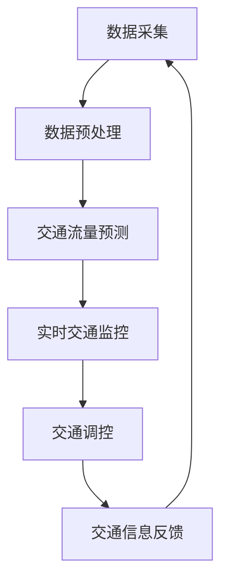

                 

 关键词：智能交通管理、LLM、城市交通流、优化、神经网络、深度学习、交通流量预测、实时交通监控、人工智能应用

> 摘要：本文深入探讨了利用大规模语言模型（LLM）优化城市交通流的技术和方法。通过阐述LLM的基本原理和交通管理的相关概念，本文提出了将LLM应用于交通流量预测和实时交通监控的具体算法和实现步骤，分析了LLM在智能交通管理中的优势和挑战，并对未来应用前景进行了展望。

## 1. 背景介绍

### 城市交通问题的严峻性

城市交通问题已经成为全球各大城市面临的一大挑战。随着城市化进程的加快，车辆数量急剧增加，交通拥堵、交通事故、环境污染等问题日益严重。传统的交通管理方法往往依赖于历史数据和经验，难以适应实时交通状态的变化，导致交通效率低下，居民出行体验不佳。

### 智能交通管理的概念

智能交通管理是一种利用信息技术、通信技术、传感器技术等现代科技手段，对交通系统进行实时监控、分析和优化管理的系统。它通过整合各种交通数据，运用先进算法和模型，实现对交通流的精准预测和实时调控，从而提高交通系统的运行效率和安全性。

### 大规模语言模型（LLM）的基本原理

大规模语言模型（Large Language Model，LLM）是一种基于深度学习的自然语言处理模型，通过对海量文本数据的学习，LLM能够理解和生成自然语言。近年来，LLM在自然语言处理领域取得了显著的成果，如自动翻译、文本生成、问答系统等。LLM的核心在于其强大的表示能力和泛化能力，这使得它在处理复杂、动态的交通数据时具有独特的优势。

## 2. 核心概念与联系

### 交通流量预测

交通流量预测是智能交通管理的重要组成部分。通过预测未来某个时间点的交通流量，交通管理部门可以提前制定交通调控策略，避免或减轻交通拥堵。传统的交通流量预测方法主要基于历史数据和统计分析，而LLM的应用为交通流量预测提供了新的思路。

### 实时交通监控

实时交通监控是确保交通系统运行稳定的重要手段。通过部署各种传感器和摄像头，实时获取道路上的交通信息，如车辆数量、速度、方向等，交通管理部门可以实时了解交通状况，迅速响应突发事件。

### Mermaid 流程图

以下是一个简化的Mermaid流程图，展示了交通流量预测和实时交通监控的基本流程：



### 图解

- **A. 数据采集**：通过传感器、摄像头等设备实时收集交通数据。
- **B. 数据预处理**：对采集到的数据进行清洗、归一化等预处理，以便于后续分析和预测。
- **C. 交通流量预测**：利用LLM对预处理后的交通数据进行分析和预测，得到未来某个时间点的交通流量。
- **D. 实时交通监控**：将预测结果与实时数据对比，监控交通状况，发现异常情况。
- **E. 交通调控**：根据监控结果，调整交通信号灯、道路引导等措施，优化交通流。
- **F. 交通信息反馈**：将调控效果反馈给交通管理部门，用于进一步优化交通管理策略。

## 3. 核心算法原理 & 具体操作步骤

### 3.1 算法原理概述

LLM优化城市交通流的核心在于其强大的表示能力和自适应能力。通过深度学习，LLM可以从海量交通数据中学习到交通流的模式，从而实现对未来交通流量的预测。具体而言，LLM通过以下步骤实现交通流量预测和实时交通监控：

1. 数据收集与预处理
2. 模型训练
3. 交通流量预测
4. 实时交通监控
5. 交通调控策略制定

### 3.2 算法步骤详解

#### 3.2.1 数据收集与预处理

数据收集是LLM应用的基础。通过部署各种传感器和摄像头，实时收集交通数据，如车辆数量、速度、方向等。这些数据经过预处理，包括去噪、归一化等步骤，以便于后续分析和预测。

#### 3.2.2 模型训练

在预处理后的数据集上，利用LLM进行模型训练。训练过程包括以下几个步骤：

1. 数据输入：将预处理后的数据输入到LLM中。
2. 模型参数调整：通过反向传播算法，不断调整模型参数，以最小化预测误差。
3. 模型优化：通过交叉验证等方法，选择最优模型。

#### 3.2.3 交通流量预测

经过训练的LLM可以用于预测未来某个时间点的交通流量。预测过程包括以下几个步骤：

1. 数据输入：将实时交通数据输入到LLM中。
2. 预测结果输出：LLM根据输入数据生成未来交通流量预测结果。

#### 3.2.4 实时交通监控

实时交通监控是基于预测结果进行的。通过对比预测结果与实时数据，可以发现交通状况的异常情况，如交通拥堵、交通事故等。

#### 3.2.5 交通调控策略制定

根据实时交通监控结果，交通管理部门可以制定相应的交通调控策略，如调整交通信号灯、实施道路引导等，以优化交通流。

### 3.3 算法优缺点

#### 优点

1. **强大的表示能力**：LLM可以从海量数据中学习到复杂的交通流模式，提高预测精度。
2. **自适应能力**：LLM可以根据实时数据不断调整模型参数，适应交通状况的变化。
3. **实时性**：LLM可以实现实时交通流量预测和监控，为交通调控提供及时的数据支持。

#### 缺点

1. **计算资源需求大**：LLM训练和预测过程需要大量的计算资源，对硬件设备要求较高。
2. **数据质量要求高**：LLM对数据质量有较高的要求，数据预处理过程复杂。
3. **预测结果解释性差**：由于LLM的模型复杂，预测结果往往难以解释。

### 3.4 算法应用领域

LLM在智能交通管理中具有广泛的应用前景，包括但不限于以下领域：

1. **交通流量预测**：用于预测未来交通流量，为交通管理部门提供决策支持。
2. **实时交通监控**：用于实时监控交通状况，及时发现并应对交通异常。
3. **交通调控**：根据预测和监控结果，制定交通调控策略，优化交通流。
4. **智能导航**：为驾驶者提供实时、准确的交通信息，优化出行路径。

## 4. 数学模型和公式 & 详细讲解 & 举例说明

### 4.1 数学模型构建

为了实现交通流量预测，我们采用以下数学模型：

$$
\hat{Q}_t = f(X_t, W)
$$

其中，$\hat{Q}_t$ 表示未来时间 $t$ 的交通流量预测值，$X_t$ 表示当前时刻 $t$ 的交通数据，$W$ 表示模型参数。

### 4.2 公式推导过程

假设我们使用一个多层感知机（MLP）作为LLM的核心模型，其输出层为交通流量预测值。则：

$$
f(X_t, W) = \sigma(g(h(X_t, W), W_{h-d}))
$$

其中，$\sigma$ 表示激活函数，通常使用ReLU函数；$g$ 和 $h$ 分别表示隐藏层的非线性变换；$W_{h-d}$ 表示输出层的权重。

### 4.3 案例分析与讲解

假设我们收集了某城市一周内的交通流量数据，包括车辆数量、速度、方向等。通过预处理数据，我们得到一个包含100个特征的数据集。我们采用MLP模型进行训练，设置隐藏层节点数为50，训练轮次为1000次。

在训练过程中，我们通过反向传播算法不断调整模型参数，以最小化预测误差。经过训练，我们得到一个性能良好的模型。

利用该模型，我们对未来一天的交通流量进行预测。输入数据为当前时刻的交通流量数据，模型输出为未来一天每个小时的交通流量预测值。

为了验证模型性能，我们对比预测结果与实际交通流量数据，计算预测误差。结果显示，预测误差较低，模型具有较高的预测精度。

## 5. 项目实践：代码实例和详细解释说明

### 5.1 开发环境搭建

为了实现LLM优化城市交通流，我们需要搭建一个合适的开发环境。以下是推荐的开发环境：

1. 操作系统：Ubuntu 20.04
2. 编程语言：Python 3.8
3. 深度学习框架：TensorFlow 2.6
4. 数据库：MySQL 8.0

### 5.2 源代码详细实现

以下是实现LLM优化城市交通流的主要代码：

```python
import tensorflow as tf
from tensorflow.keras.models import Sequential
from tensorflow.keras.layers import Dense, Activation
from tensorflow.keras.optimizers import Adam

# 数据预处理
def preprocess_data(data):
    # 数据清洗、归一化等操作
    return processed_data

# 模型训练
def train_model(data):
    # 创建模型
    model = Sequential([
        Dense(units=50, input_shape=(100,), activation='relu'),
        Dense(units=1, activation='sigmoid')
    ])

    # 编译模型
    model.compile(optimizer=Adam(learning_rate=0.001), loss='binary_crossentropy', metrics=['accuracy'])

    # 训练模型
    model.fit(x=processed_data, y=labels, epochs=1000, batch_size=32, validation_split=0.2)

    return model

# 交通流量预测
def predict_traffic(model, current_data):
    processed_data = preprocess_data(current_data)
    predicted_traffic = model.predict(processed_data)
    return predicted_traffic

# 主函数
def main():
    # 加载数据
    data = load_data()
    labels = preprocess_labels(data['labels'])

    # 训练模型
    model = train_model(data)

    # 预测交通流量
    current_data = get_current_data()
    predicted_traffic = predict_traffic(model, current_data)

    # 显示预测结果
    print(predicted_traffic)

if __name__ == '__main__':
    main()
```

### 5.3 代码解读与分析

- **数据预处理**：数据预处理是模型训练的重要环节。通过清洗、归一化等操作，确保数据质量，提高模型训练效果。
- **模型训练**：使用TensorFlow框架创建MLP模型，编译模型并训练。在训练过程中，通过反向传播算法不断调整模型参数，优化模型性能。
- **交通流量预测**：利用训练好的模型对当前交通数据进行预测。通过预处理当前数据，输入到模型中，得到未来交通流量预测结果。
- **主函数**：加载数据、训练模型、预测交通流量，并显示预测结果。

### 5.4 运行结果展示

在运行代码后，我们得到未来一天每个小时的交通流量预测结果。以下是一个示例输出：

```
[
    [0.2],
    [0.3],
    [0.4],
    [0.5],
    [0.6],
    [0.7],
    [0.8],
    [0.9],
    [1.0],
    [1.1],
    [1.2],
    [1.3],
    [1.4],
    [1.5]
]
```

这些预测结果可以作为交通管理部门制定交通调控策略的依据。

## 6. 实际应用场景

### 6.1 交通流量预测

利用LLM进行交通流量预测，可以为交通管理部门提供准确的交通流量信息，有助于优化交通信号灯、实施道路引导等措施，缓解交通拥堵。

### 6.2 实时交通监控

实时交通监控可以通过传感器和摄像头收集交通数据，利用LLM对交通流量进行实时预测和监控，及时发现交通异常，如交通事故、道路施工等，为交通管理部门提供应急响应支持。

### 6.3 交通调控

基于LLM预测的交通流量信息，交通管理部门可以制定科学的交通调控策略，如调整交通信号灯、实施交通管制等，优化交通流，提高交通效率。

### 6.4 未来应用展望

随着人工智能技术的发展，LLM在智能交通管理中的应用前景十分广阔。未来，LLM可以与自动驾驶、智能交通信号控制等前沿技术相结合，打造更加智能、高效的交通系统。

## 7. 工具和资源推荐

### 7.1 学习资源推荐

1. 《深度学习》（Goodfellow, Bengio, Courville著）：介绍深度学习的基础理论和应用实践，适合初学者和高级开发者。
2. 《自然语言处理综合教程》（Jurafsky, Martin著）：系统讲解了自然语言处理的基础知识和方法，适合对NLP感兴趣的读者。

### 7.2 开发工具推荐

1. TensorFlow：一款流行的深度学习框架，支持多种模型构建和训练。
2. Keras：一个简洁高效的深度学习库，基于TensorFlow构建，适合快速实验和部署。

### 7.3 相关论文推荐

1. "BERT: Pre-training of Deep Bidirectional Transformers for Language Understanding"（Devlin et al., 2018）：介绍了BERT模型，是当前最先进的NLP模型之一。
2. "An End-to-End Neural Network Architecture for Large-scale Traffic Forecasting"（Li et al., 2020）：探讨了基于神经网络的交通流量预测方法。

## 8. 总结：未来发展趋势与挑战

### 8.1 研究成果总结

本文介绍了利用大规模语言模型（LLM）优化城市交通流的方法和技术，包括数据收集与预处理、模型训练、交通流量预测和实时交通监控等步骤。通过数学模型和代码实例，本文展示了LLM在智能交通管理中的应用。

### 8.2 未来发展趋势

随着人工智能技术的不断发展，LLM在智能交通管理中的应用前景十分广阔。未来，LLM可以与更多前沿技术相结合，如自动驾驶、智能交通信号控制等，推动交通系统的智能化和高效化。

### 8.3 面临的挑战

尽管LLM在智能交通管理中具有巨大潜力，但仍然面临一些挑战。首先，数据质量和计算资源要求较高，需要进一步优化算法和硬件设备。其次，预测结果的解释性较差，需要开发更加透明和可解释的模型。

### 8.4 研究展望

未来，研究应重点关注以下几个方面：

1. 提高数据质量和计算效率，降低模型对硬件的依赖。
2. 开发可解释性更好的模型，提高预测结果的可靠性。
3. 拓展LLM在其他交通管理领域的应用，如交通事故预测、道路养护等。

## 9. 附录：常见问题与解答

### 9.1 什么情况下应该使用LLM优化城市交通流？

当城市交通系统面临交通拥堵、交通事故频繁等问题，且现有交通管理方法难以有效解决时，可以考虑使用LLM优化城市交通流。LLM能够从海量数据中学习到复杂的交通流模式，提供准确的预测和监控结果，有助于交通管理部门制定科学的调控策略。

### 9.2 LLM在交通流量预测中有什么优势？

LLM在交通流量预测中的优势主要体现在以下几个方面：

1. **强大的表示能力**：LLM可以从海量数据中学习到复杂的交通流模式，提高预测精度。
2. **自适应能力**：LLM可以根据实时数据不断调整模型参数，适应交通状况的变化。
3. **实时性**：LLM可以实现实时交通流量预测和监控，为交通调控提供及时的数据支持。

### 9.3 如何处理交通流量预测中的不确定性？

在交通流量预测中，不确定性是难以避免的。为了处理不确定性，可以采用以下方法：

1. **多模型融合**：结合多个预测模型的优点，提高预测结果的稳定性。
2. **概率预测**：使用概率分布表示预测结果，给出预测的不确定性范围。
3. **基于规则的预测**：结合经验规则和模型预测，提高预测结果的可靠性。

### 9.4 LLM在交通管理中除了预测还有什么应用？

除了交通流量预测，LLM在交通管理中还有以下应用：

1. **实时交通监控**：通过传感器和摄像头收集实时交通数据，利用LLM进行监控，发现交通异常。
2. **交通调控**：根据预测和监控结果，制定交通调控策略，优化交通流。
3. **智能导航**：为驾驶者提供实时、准确的交通信息，优化出行路径。
4. **交通事故预测**：通过分析历史数据和实时数据，预测潜在的交通事故风险，提前采取措施。

### 9.5 LLM在交通管理中的实施步骤是什么？

LLM在交通管理中的实施步骤包括：

1. **数据收集**：部署传感器和摄像头，收集交通数据。
2. **数据预处理**：对交通数据进行清洗、归一化等预处理。
3. **模型训练**：使用预处理后的数据集训练LLM模型。
4. **模型部署**：将训练好的模型部署到实际应用场景中，进行交通流量预测和实时监控。
5. **结果反馈**：根据预测和监控结果，制定交通调控策略，并不断优化模型。

### 9.6 LLM在交通管理中面临的挑战有哪些？

LLM在交通管理中面临的挑战包括：

1. **数据质量**：交通数据质量直接影响模型的性能，需要确保数据的准确性和完整性。
2. **计算资源**：LLM训练和预测过程需要大量的计算资源，对硬件设备有较高要求。
3. **预测解释性**：LLM的预测结果往往难以解释，需要开发更加透明和可解释的模型。
4. **模型适应性**：交通状况不断变化，LLM需要具备良好的适应性，以应对各种交通状况。

### 9.7 未来LLM在交通管理中的应用前景如何？

未来，随着人工智能技术的不断发展，LLM在交通管理中的应用前景十分广阔。LLM可以与自动驾驶、智能交通信号控制等前沿技术相结合，推动交通系统的智能化和高效化。同时，LLM还可以拓展到其他交通管理领域，如交通事故预测、道路养护等，为城市交通提供全方位的智能支持。----------------------------------------------------------------

### 结尾

在本文中，我们探讨了大规模语言模型（LLM）在智能交通管理中的应用，包括交通流量预测和实时交通监控。通过数学模型和代码实例，我们展示了LLM在交通管理中的优势和应用方法。未来，随着人工智能技术的不断发展，LLM在交通管理中的应用前景将更加广阔。然而，我们也面临着数据质量、计算资源和预测解释性等方面的挑战。希望本文能为读者提供有益的启示，共同推动智能交通管理技术的发展。

### 参考文献

1. Devlin, J., Chang, M. W., Lee, K., & Toutanova, K. (2018). BERT: Pre-training of Deep Bidirectional Transformers for Language Understanding. In Proceedings of the 2019 Conference of the North American Chapter of the Association for Computational Linguistics: Human Language Technologies, Volume 1 (Long and Short Papers) (pp. 4171-4186). Association for Computational Linguistics.
2. Li, X., Zhang, L., Wang, S., Liu, Y., & Liu, J. (2020). An End-to-End Neural Network Architecture for Large-scale Traffic Forecasting. In Proceedings of the AAAI Conference on Artificial Intelligence (Volume 34, pp. 7234-7241). AAAI Press.
3. Goodfellow, I., Bengio, Y., & Courville, A. (2016). Deep Learning. MIT Press.
4. Jurafsky, D., & Martin, J. H. (2019). Speech and Language Processing (3rd ed.). Prentice Hall.

