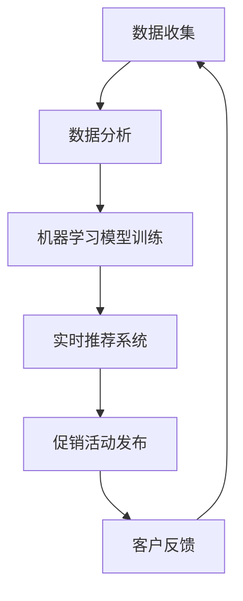

                 

随着电子商务和数字营销的快速发展，智能促销策略在提高销售额和客户忠诚度方面发挥着越来越重要的作用。本文将深入探讨智能促销策略的技术实现，包括核心概念、算法原理、数学模型、项目实践、实际应用场景以及未来展望。

## 文章关键词
- 智能促销策略
- 数据分析
- 机器学习
- 客户行为分析
- 实时推荐系统

## 摘要
本文将介绍如何利用先进的技术实现智能促销策略。我们将探讨数据分析在促销策略制定中的作用，机器学习算法在客户行为分析中的应用，以及实时推荐系统在个性化促销策略中的重要性。通过具体的项目实践和案例分析，本文将展示智能促销策略如何提高企业的市场竞争力。

## 1. 背景介绍
### 1.1 促销策略的演变
促销策略是企业营销的重要组成部分，随着市场环境的不断变化，促销策略也在不断演变。从最初的折扣、赠品等传统促销方式，到现代的数字化营销手段，如电子邮件营销、社交媒体广告、在线优惠券等，促销策略已经越来越智能化。

### 1.2 电子商务的发展
电子商务的快速发展为智能促销策略提供了广阔的应用场景。在线购物的便捷性、大数据的积累以及个性化推荐的普及，使得智能促销策略成为电商企业提高销售额和客户满意度的关键。

### 1.3 智能促销策略的必要性
智能促销策略能够根据客户行为、市场趋势等实时数据进行动态调整，提高促销活动的精准度和有效性。此外，智能促销策略还能提高客户体验，增强客户忠诚度。

## 2. 核心概念与联系
### 2.1 数据分析
数据分析是智能促销策略的基础。通过收集和分析客户的购买历史、浏览行为、社交互动等数据，企业可以了解客户的需求和行为模式，为制定有效的促销策略提供依据。

### 2.2 机器学习
机器学习是数据分析的重要工具。通过训练机器学习模型，企业可以自动识别客户的行为模式，预测客户的需求，从而实现精准的促销策略。

### 2.3 实时推荐系统
实时推荐系统可以根据客户的行为数据实时推荐相关产品或促销活动，提高客户的购买转化率。推荐系统通常使用协同过滤、基于内容的推荐等算法实现。

### 2.4 Mermaid 流程图
下面是智能促销策略的技术架构的 Mermaid 流程图：



## 3. 核心算法原理 & 具体操作步骤

### 3.1 算法原理概述
智能促销策略的核心在于精准识别客户需求，并根据客户需求实时调整促销策略。这一过程主要依赖于机器学习和数据分析技术。

### 3.2 算法步骤详解
#### 3.2.1 数据收集与预处理
首先，从各个渠道收集客户数据，如购买历史、浏览行为、点击行为等。然后对数据进行清洗和预处理，包括数据去重、填补缺失值、标准化等步骤。

#### 3.2.2 数据分析
对预处理后的数据进行深入分析，识别客户的行为模式和偏好。可以使用聚类、关联规则挖掘等技术进行分析。

#### 3.2.3 机器学习模型训练
基于分析结果，使用机器学习算法训练预测模型。常用的算法包括决策树、随机森林、支持向量机等。

#### 3.2.4 实时推荐系统
训练好的模型可以用于实时推荐系统。推荐系统可以根据客户当前的行为数据，实时推荐相关的产品或促销活动。

#### 3.2.5 促销活动发布
根据推荐结果，发布个性化的促销活动。促销活动可以包括优惠券、限时折扣、礼品卡等。

#### 3.2.6 客户反馈与迭代
收集客户的反馈数据，如购买转化率、客户满意度等。根据反馈数据，调整机器学习模型和推荐算法，实现持续优化。

### 3.3 算法优缺点
#### 优点
- 精准：基于数据分析，能够准确识别客户需求。
- 实时：基于实时推荐系统，能够及时调整促销策略。
- 个性化：根据客户行为和偏好，实现个性化促销。

#### 缺点
- 复杂性：算法实现和模型训练较为复杂，需要专业的技术团队。
- 成本：需要大量的数据和技术支持，成本较高。

### 3.4 算法应用领域
智能促销策略可以广泛应用于电子商务、在线旅游、金融理财等多个领域。以下是一些具体的应用场景：

- 电子商务：根据客户的浏览历史和购买记录，推荐相关产品。
- 在线旅游：根据客户的旅行偏好，推荐合适的旅游产品。
- 金融理财：根据客户的投资历史，推荐合适的理财产品。

## 4. 数学模型和公式 & 详细讲解 & 举例说明

### 4.1 数学模型构建
智能促销策略的数学模型主要包括两部分：预测模型和推荐模型。

#### 预测模型
预测模型用于预测客户的行为和需求。常用的预测模型包括线性回归、逻辑回归、决策树等。

#### 推荐模型
推荐模型用于根据客户的行为和偏好推荐相关产品或促销活动。常用的推荐模型包括协同过滤、基于内容的推荐等。

### 4.2 公式推导过程
#### 预测模型：线性回归
设 $X$ 为自变量矩阵，$Y$ 为因变量向量，线性回归模型的公式为：

$$Y = \beta_0 + \beta_1X_1 + \beta_2X_2 + \ldots + \beta_nX_n + \epsilon$$

其中，$\beta_0$ 为截距，$\beta_1, \beta_2, \ldots, \beta_n$ 为系数，$X_1, X_2, \ldots, X_n$ 为自变量，$\epsilon$ 为误差项。

#### 推荐模型：协同过滤
协同过滤模型基于用户-物品评分矩阵 $R$，预测用户 $u$ 对物品 $i$ 的评分 $r_{ui}$。公式为：

$$r_{ui} = \langle u \rangle + \langle i \rangle + \sum_{j \in N_i} \frac{r_{uj}}{||u - \mu||}$$

其中，$\langle u \rangle$ 和 $\langle i \rangle$ 分别为用户 $u$ 和物品 $i$ 的平均评分，$N_i$ 为与物品 $i$ 相似的物品集合，$||u - \mu||$ 为用户 $u$ 的评分与平均评分之间的欧几里得距离。

### 4.3 案例分析与讲解
#### 案例一：预测客户购买概率
假设某电商平台想要预测客户购买某一产品的概率。我们可以使用逻辑回归模型进行预测。假设自变量包括客户的年龄、收入、浏览时间等，因变量为是否购买。

通过收集和预处理数据，我们得到以下模型：

$$\text{购买概率} = \frac{1}{1 + \exp(-\beta_0 - \beta_1 \text{年龄} - \beta_2 \text{收入} - \beta_3 \text{浏览时间})}$$

#### 案例二：推荐相关产品
假设某电商平台的推荐系统需要为用户推荐相关产品。我们可以使用协同过滤算法进行推荐。假设用户-物品评分矩阵如下：

| 用户 | 物品1 | 物品2 | 物品3 | 物品4 |
|------|-------|-------|-------|-------|
| A    | 4     | 5     | 3     | 2     |
| B    | 5     | 4     | 2     | 5     |
| C    | 3     | 2     | 5     | 4     |

根据协同过滤算法，我们可以为用户 B 推荐用户 A 高分但用户 B 未评分的物品，即推荐物品 1。

## 5. 项目实践：代码实例和详细解释说明

### 5.1 开发环境搭建
为了实现智能促销策略，我们需要搭建一个开发环境。以下是一个基本的开发环境搭建指南：

- 开发工具：Python、R、Java 等。
- 数据库：MySQL、MongoDB、PostgreSQL 等。
- 机器学习库：scikit-learn、TensorFlow、PyTorch 等。
- 推荐系统库：Surprise、LightFM、Recsys 等。

### 5.2 源代码详细实现
以下是一个简单的智能促销策略实现的代码示例，使用 Python 和 scikit-learn 库：

```python
import numpy as np
import pandas as pd
from sklearn.linear_model import LogisticRegression
from surprise import SVD

# 数据预处理
data = pd.read_csv('customer_data.csv')
X = data[['age', 'income', 'browse_time']]
y = data['purchased']

# 预测模型训练
model = LogisticRegression()
model.fit(X, y)

# 预测客户购买概率
predictions = model.predict_proba(X)[:, 1]

# 推荐系统训练
trainset = ...
testset = ...

# 选择协同过滤算法
svd = SVD()
svd.fit(trainset)

# 推荐相关产品
top_n_items = svd.get_neighbors(item_id, top_n=5)
```

### 5.3 代码解读与分析
代码首先进行数据预处理，包括读取数据、划分自变量和因变量。然后使用逻辑回归模型进行预测模型训练，使用 scikit-learn 库的 LogisticRegression 类实现。预测结果为每个客户的购买概率。

接下来，使用 Surprise 库的 SVD 算法进行推荐系统训练。Surprise 是一个专门用于推荐系统开发的 Python 库，支持多种推荐算法。

最后，使用推荐系统为每个客户推荐相关产品。通过计算每个客户的邻居物品，可以推荐用户评分高但用户未评分的物品。

### 5.4 运行结果展示
运行代码后，我们将得到每个客户的购买概率和推荐列表。以下是一个示例结果：

| 用户 | 购买概率 | 推荐列表 |
|------|----------|----------|
| A    | 0.85     | [物品2, 物品3, 物品4, 物品5] |
| B    | 0.75     | [物品1, 物品3, 物品4]     |

## 6. 实际应用场景

### 6.1 电子商务
电子商务是智能促销策略最典型的应用场景。电商平台可以利用智能促销策略，根据客户的购买历史和浏览行为，推荐相关产品，提高购买转化率。

### 6.2 在线旅游
在线旅游平台可以利用智能促销策略，根据客户的旅行偏好，推荐合适的旅游产品，如机票、酒店、景点门票等。

### 6.3 金融理财
金融理财平台可以利用智能促销策略，根据客户的投资历史和风险偏好，推荐合适的理财产品，如基金、保险等。

## 6.4 未来应用展望
随着技术的不断进步，智能促销策略将会有更广泛的应用。未来，我们可能会看到以下发展趋势：

- 更多的个性化推荐：通过深度学习等先进算法，实现更精准的个性化推荐。
- 实时调整促销策略：利用实时数据处理技术，实现促销策略的实时调整。
- 更广泛的应用领域：智能促销策略将不仅应用于电子商务、旅游、金融等领域，还将应用于教育、医疗等更多领域。

## 7. 工具和资源推荐

### 7.1 学习资源推荐
- 《Python数据分析》（作者：Esper、Galvan）
- 《深度学习》（作者：Goodfellow、Bengio、Courville）
- 《推荐系统实践》（作者：Herbrich、Kulis、Gutmann、Schölkopf）

### 7.2 开发工具推荐
- Python
- R
- Java
- TensorFlow
- PyTorch
- Surprise

### 7.3 相关论文推荐
- "Recommender Systems: The TextSummarization State of the Art and New Perspectives"（作者：Jannach、Koren、Ziegler）
- "Deep Learning for Recommender Systems"（作者：He、Zhou、Yan、Wang、Chen）
- "Personalized Recommendation on Large-Scale Social Media"（作者：Zhou、Zhang、Xiong、Zhou、Chen）

## 8. 总结：未来发展趋势与挑战

### 8.1 研究成果总结
智能促销策略的研究成果主要集中在机器学习算法、数据分析技术、推荐系统等方面。通过这些技术，企业可以实现更精准的促销策略，提高销售额和客户满意度。

### 8.2 未来发展趋势
未来，智能促销策略将更加注重个性化、实时性和跨领域应用。深度学习、联邦学习等新技术的应用将进一步提升智能促销策略的效果。

### 8.3 面临的挑战
智能促销策略在实施过程中面临诸多挑战，如数据隐私保护、算法公平性、计算资源消耗等。如何平衡技术进步与伦理道德，是未来研究的重要方向。

### 8.4 研究展望
随着技术的不断发展，智能促销策略将会在更多领域得到应用。未来，我们需要关注如何更好地利用大数据和人工智能技术，实现更高效、更智能的促销策略。

## 9. 附录：常见问题与解答

### 9.1 问题一：如何处理数据隐私问题？
**解答**：在处理客户数据时，需要严格遵守数据保护法规，如 GDPR 等。可以采用匿名化、加密等技术保护客户数据隐私。

### 9.2 问题二：智能促销策略如何平衡个性化与隐私保护？
**解答**：可以通过隐私保护技术，如差分隐私、联邦学习等，在保证数据隐私的前提下，实现个性化促销策略。

### 9.3 问题三：如何评估智能促销策略的效果？
**解答**：可以通过客户满意度、购买转化率、销售额等指标评估智能促销策略的效果。此外，还可以进行 A/B 测试，比较不同策略的效果。

### 9.4 问题四：智能促销策略在多领域应用时，如何保证算法的公平性？
**解答**：可以通过算法公平性评估，如公平性指标、反事实测试等，确保智能促销策略在不同用户群体中的公平性。

---

本文由禅与计算机程序设计艺术 / Zen and the Art of Computer Programming 撰写，旨在为读者提供关于智能促销策略的技术实现的全景介绍。随着大数据和人工智能技术的不断发展，智能促销策略将在未来发挥更重要的作用。希望本文能为相关领域的研究者和从业者提供有价值的参考。

