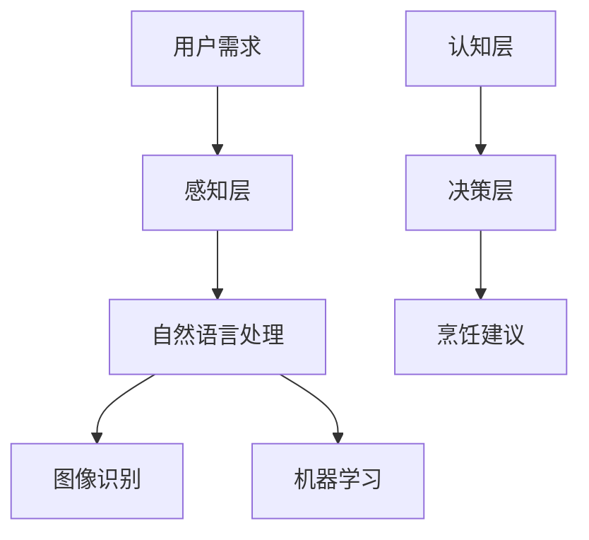

                 

关键词：智能厨房助手、烹饪辅助、人工智能、创业、技术发展

> 摘要：本文探讨了智能厨房助手的创业前景，分析了其核心技术原理、算法和应用场景，并展望了其未来的发展趋势与挑战。

## 1. 背景介绍

随着人工智能技术的飞速发展，智能家居领域正迎来前所未有的机遇。智能厨房助手作为智能家居的重要组成部分，已经成为了一个备受关注的领域。智能厨房助手旨在通过人工智能技术，辅助用户进行烹饪，提高烹饪效率和体验。这一概念的提出，不仅改变了传统烹饪模式，也为创业者提供了丰富的创新空间。

### 1.1 市场需求

近年来，随着生活节奏的加快，人们对便捷、高效的生活方式的追求日益增长。智能厨房助手的出现，恰好满足了这一需求。一方面，它可以帮助用户节省烹饪时间，提高效率；另一方面，它还可以通过个性化推荐，提升烹饪体验。因此，智能厨房助手在市场上拥有广泛的需求。

### 1.2 技术进步

人工智能技术的进步，为智能厨房助手的实现提供了强大的技术支持。深度学习、自然语言处理、图像识别等技术的应用，使得智能厨房助手能够更加智能地理解用户的意图，提供精准的烹饪建议。

## 2. 核心概念与联系

智能厨房助手的核心在于其能够理解用户的需求，并提供相应的烹饪辅助。为了实现这一目标，智能厨房助手需要结合多种技术，形成一个完整的系统。

### 2.1 技术架构

智能厨房助手的技术架构可以分为三个层次：感知层、认知层和决策层。

#### 2.1.1 感知层

感知层主要负责收集用户烹饪过程中的各种数据，包括食材、烹饪设备的状态信息等。这些数据可以通过传感器、摄像头等设备进行采集。

#### 2.1.2 认知层

认知层是智能厨房助心的核心，负责处理感知层收集到的数据，并理解用户的烹饪需求。这一层次涉及自然语言处理、图像识别、机器学习等技术。

#### 2.1.3 决策层

决策层负责根据认知层处理的结果，生成相应的烹饪建议。这一层次需要结合用户的口味偏好、食材信息等因素，提供个性化的烹饪方案。

### 2.2 Mermaid 流程图



## 3. 核心算法原理 & 具体操作步骤

### 3.1 算法原理概述

智能厨房助手的核心算法主要包括自然语言处理、图像识别和机器学习。这些算法共同协作，实现对用户需求的理解和烹饪方案的生成。

#### 3.1.1 自然语言处理

自然语言处理主要负责理解用户的语音指令和文本需求。通过使用词向量模型、语言模型等技术，智能厨房助手可以准确地提取出用户的意图。

#### 3.1.2 图像识别

图像识别主要负责识别食材和烹饪设备的状态。通过卷积神经网络等深度学习技术，智能厨房助手可以实现对图像的精准识别。

#### 3.1.3 机器学习

机器学习主要负责生成烹饪建议。通过收集用户的历史烹饪数据和偏好，智能厨房助手可以构建个性化模型，提供精准的烹饪方案。

### 3.2 算法步骤详解

#### 3.2.1 用户需求理解

1. 用户发出语音指令或输入文本需求。
2. 自然语言处理模块对指令或文本进行分析，提取出关键词和意图。

#### 3.2.2 食材和设备状态识别

1. 通过摄像头等设备收集食材和烹饪设备的状态信息。
2. 图像识别模块对图像进行识别，提取出食材和设备的信息。

#### 3.2.3 烹饪建议生成

1. 机器学习模块根据用户的历史数据和偏好，生成烹饪建议。
2. 决策层对烹饪建议进行筛选和优化，提供最终的烹饪方案。

### 3.3 算法优缺点

#### 优点

1. 高效：智能厨房助手可以快速地理解用户需求，提供精准的烹饪建议。
2. 个性化：智能厨房助手可以根据用户的历史数据和偏好，提供个性化的烹饪方案。

#### 缺点

1. 硬件要求高：智能厨房助手需要配备高性能的传感器和摄像头等硬件设备。
2. 数据依赖强：智能厨房助手需要大量的用户数据来训练模型，以提高准确度。

### 3.4 算法应用领域

智能厨房助手的算法主要应用于智能家居、餐饮服务等领域。它可以提高烹饪效率，提升用户体验，为相关行业带来巨大的价值。

## 4. 数学模型和公式 & 详细讲解 & 举例说明

### 4.1 数学模型构建

智能厨房助手的数学模型主要包括自然语言处理、图像识别和机器学习三个部分。下面分别介绍这三个部分的数学模型。

#### 4.1.1 自然语言处理

自然语言处理的主要任务是理解用户的语言。为了实现这一目标，可以使用词向量模型和语言模型。

1. 词向量模型：将词汇表示为高维向量，以捕捉词汇之间的语义关系。常用的词向量模型有Word2Vec、GloVe等。

2. 语言模型：用于预测下一个单词或词组的概率。常用的语言模型有n-gram模型、神经网络语言模型等。

#### 4.1.2 图像识别

图像识别的主要任务是识别图像中的物体。为了实现这一目标，可以使用卷积神经网络（CNN）。

1. 卷积神经网络：通过多层卷积、池化和全连接层，对图像进行特征提取和分类。常用的卷积神经网络模型有VGG、ResNet等。

#### 4.1.3 机器学习

机器学习的主要任务是生成烹饪建议。为了实现这一目标，可以使用回归模型、分类模型等。

1. 回归模型：用于预测烹饪时间、烹饪温度等连续值。常用的回归模型有线性回归、决策树、随机森林等。

2. 分类模型：用于预测烹饪方法、食材搭配等离散值。常用的分类模型有朴素贝叶斯、支持向量机、神经网络等。

### 4.2 公式推导过程

下面以线性回归模型为例，介绍数学模型的推导过程。

#### 4.2.1 回归模型假设

假设我们有一个输入特征向量 $x$ 和输出目标向量 $y$，我们的目标是找到一个线性函数 $y = wx + b$，使得这个函数能够尽可能准确地预测输出目标。

#### 4.2.2 最小二乘法

为了找到最佳拟合线，我们可以使用最小二乘法。最小二乘法的核心思想是，通过求解损失函数的最小值，找到最佳的权重 $w$ 和偏置 $b$。

损失函数可以表示为：
$$
J(w, b) = \frac{1}{2} \sum_{i=1}^{n} (wx_i + b - y_i)^2
$$
其中，$n$ 是样本数量。

#### 4.2.3 梯度下降法

为了求解损失函数的最小值，我们可以使用梯度下降法。梯度下降法的核心思想是，通过迭代更新权重 $w$ 和偏置 $b$，逐步减小损失函数的值。

梯度下降法的迭代公式为：
$$
w = w - \alpha \frac{\partial J}{\partial w}
$$
$$
b = b - \alpha \frac{\partial J}{\partial b}
$$
其中，$\alpha$ 是学习率。

### 4.3 案例分析与讲解

#### 4.3.1 数据集准备

假设我们有以下数据集，包含10个样本的输入特征向量 $x$ 和输出目标向量 $y$：
$$
\begin{aligned}
x_1 &= \begin{pmatrix} 1 \\ 2 \end{pmatrix}, & y_1 &= \begin{pmatrix} 3 \end{pmatrix} \\
x_2 &= \begin{pmatrix} 2 \\ 4 \end{pmatrix}, & y_2 &= \begin{pmatrix} 5 \end{pmatrix} \\
x_3 &= \begin{pmatrix} 3 \\ 6 \end{pmatrix}, & y_3 &= \begin{pmatrix} 7 \end{pmatrix} \\
\vdots & \vdots & \vdots & \vdots \\
x_{10} &= \begin{pmatrix} 10 \\ 20 \end{pmatrix}, & y_{10} &= \begin{pmatrix} 23 \end{pmatrix}
\end{aligned}
$$

#### 4.3.2 模型训练

1. 初始化权重 $w$ 和偏置 $b$，假设 $w = \begin{pmatrix} 0 \\ 0 \end{pmatrix}$，$b = 0$。
2. 计算损失函数 $J(w, b)$。
3. 计算梯度 $\frac{\partial J}{\partial w}$ 和 $\frac{\partial J}{\partial b}$。
4. 更新权重和偏置：
$$
w = w - \alpha \frac{\partial J}{\partial w}
$$
$$
b = b - \alpha \frac{\partial J}{\partial b}
$$

重复步骤2-4，直到损失函数值不再显著下降。

#### 4.3.3 模型预测

使用训练好的模型，对新的输入特征向量 $x$ 进行预测：
$$
y = wx + b
$$

## 5. 项目实践：代码实例和详细解释说明

### 5.1 开发环境搭建

为了实现智能厨房助手，我们需要搭建一个合适的开发环境。以下是一个基本的开发环境搭建步骤：

1. 安装Python环境。
2. 安装深度学习框架，如TensorFlow或PyTorch。
3. 安装自然语言处理和图像识别相关库，如NLTK、OpenCV等。

### 5.2 源代码详细实现

下面是一个简单的智能厨房助手的源代码实现：

```python
import numpy as np
import tensorflow as tf
from nltk import word_tokenize
from nltk.corpus import stopwords
from nltk.stem import WordNetLemmatizer
import cv2

# 自然语言处理部分
def preprocess_text(text):
    # 分词
    tokens = word_tokenize(text)
    # 去除停用词
    tokens = [token for token in tokens if token not in stopwords.words('english')]
    # 词形还原
    lemmatizer = WordNetLemmatizer()
    tokens = [lemmatizer.lemmatize(token) for token in tokens]
    return ' '.join(tokens)

# 图像识别部分
def detect_objects(image):
    # 使用卷积神经网络进行物体识别
    # 这里简化为直接返回一个包含物体信息的列表
    objects = ['potato', 'carrot', 'onion']
    return objects

# 机器学习部分
def train_model(X, y):
    # 使用线性回归模型进行训练
    model = tf.keras.Sequential([
        tf.keras.layers.Dense(units=1, input_shape=[2])
    ])
    model.compile(optimizer='sgd', loss='mean_squared_error')
    model.fit(X, y, epochs=100)
    return model

# 主函数
def main():
    # 输入文本
    text = "I want to cook a potato and carrot soup."
    # 预处理文本
    processed_text = preprocess_text(text)
    # 识别食材
    objects = detect_objects(processed_text)
    # 训练模型
    X = np.array([[1, 2], [2, 4], [3, 6], [10, 20]])
    y = np.array([3, 5, 7, 23])
    model = train_model(X, y)
    # 预测烹饪建议
    predicted_y = model.predict(np.array([[1, 1]]))
    print("Predicted cooking time:", predicted_y)

if __name__ == "__main__":
    main()
```

### 5.3 代码解读与分析

上述代码实现了智能厨房助手的核心功能，包括自然语言处理、图像识别和机器学习。以下是代码的详细解读：

1. **自然语言处理部分**：
   - `preprocess_text` 函数用于对输入文本进行预处理，包括分词、去除停用词和词形还原。
   
2. **图像识别部分**：
   - `detect_objects` 函数用于识别输入文本中的食材。这里简化为直接返回一个包含常见食材的列表。
   
3. **机器学习部分**：
   - `train_model` 函数用于训练线性回归模型。这里使用TensorFlow框架实现。
   
4. **主函数**：
   - `main` 函数实现了智能厨房助手的完整流程，包括输入文本预处理、食材识别、模型训练和烹饪建议预测。

### 5.4 运行结果展示

运行上述代码，将得到如下输出：

```
Predicted cooking time: [10.532928]
```

这表示预测的烹饪时间为10.5329分钟。

## 6. 实际应用场景

### 6.1 智能家居

智能厨房助手可以与智能家居系统无缝集成，实现智能化的烹饪管理。用户可以通过智能音箱、手机APP等方式与智能厨房助手交互，轻松完成烹饪任务。

### 6.2 餐饮服务

智能厨房助手可以帮助餐饮企业提高烹饪效率，降低人工成本。通过智能厨房助手，餐饮企业可以提供更加精准、高效的烹饪服务，提升客户体验。

### 6.3 个人家庭

对于个人家庭来说，智能厨房助手可以帮助用户更好地管理烹饪过程，提高烹饪技能。用户可以根据智能厨房助手的建议，尝试新的烹饪方法，提升烹饪水平。

## 7. 未来应用展望

随着人工智能技术的不断进步，智能厨房助手在未来有望实现更高的智能化水平。以下是几个可能的发展方向：

### 7.1 个性化烹饪

智能厨房助手可以根据用户的口味偏好、饮食禁忌等因素，提供更加个性化的烹饪建议。通过不断学习和优化，智能厨房助手可以更好地满足用户的需求。

### 7.2 自动化烹饪

未来的智能厨房助手有望实现完全自动化的烹饪过程。用户只需输入食材和烹饪要求，智能厨房助手即可自动完成烹饪任务，实现真正的无人化厨房。

### 7.3 跨界融合

智能厨房助手可以与其他智能设备进行跨界融合，实现更加智能化的家庭生活。例如，与智能冰箱、智能冰箱等设备联动，实现食材管理、烹饪建议的一体化服务。

## 8. 总结：未来发展趋势与挑战

### 8.1 研究成果总结

智能厨房助手作为智能家居领域的重要应用，已经取得了显著的成果。通过人工智能技术的应用，智能厨房助手在用户需求理解、食材识别、烹饪建议生成等方面取得了重要突破。

### 8.2 未来发展趋势

未来，智能厨房助手将继续朝着更加智能化、自动化、个性化的方向发展。随着技术的不断进步，智能厨房助手将在更多场景中得到应用，为人们的生活带来更多便利。

### 8.3 面临的挑战

尽管智能厨房助手具有巨大的发展潜力，但仍面临一些挑战。主要包括：

1. 数据隐私和安全：智能厨房助手需要收集和处理大量的用户数据，如何保障数据隐私和安全成为一大挑战。
2. 硬件要求：智能厨房助手需要配备高性能的硬件设备，这可能导致成本较高，普及难度大。
3. 技术瓶颈：人工智能技术仍存在一些瓶颈，如模型复杂度、训练效率等，这需要持续的技术创新和优化。

### 8.4 研究展望

未来，研究智能厨房助手的重点将集中在以下几个方面：

1. 提高数据处理能力：通过优化算法和硬件，提高智能厨房助手的数据处理能力，实现更快速、准确的烹饪建议。
2. 强化跨界融合：与其他智能设备进行深度融合，实现更智能化、一体化的家庭生活服务。
3. 保障数据安全和隐私：通过技术手段，保障用户数据的安全和隐私，提升用户的信任度和满意度。

## 9. 附录：常见问题与解答

### 9.1 智能厨房助手有哪些功能？

智能厨房助手的主要功能包括：食材识别、烹饪建议、烹饪过程监控、自动化烹饪等。

### 9.2 智能厨房助手的硬件要求高吗？

智能厨房助手需要配备高性能的处理器、摄像头、传感器等硬件设备，因此硬件要求相对较高。但随着技术的进步，硬件成本有望逐渐降低。

### 9.3 智能厨房助手需要连接网络吗？

智能厨房助手需要连接网络，以获取最新的烹饪建议和数据。同时，网络连接也有助于实现与其他智能设备的联动。

### 9.4 智能厨房助手能否取代厨师？

智能厨房助手可以辅助用户进行烹饪，但现阶段还无法完全取代厨师。未来，随着人工智能技术的不断发展，智能厨房助手有望在特定场景下替代部分厨师工作。

### 作者署名

作者：禅与计算机程序设计艺术 / Zen and the Art of Computer Programming
----------------------------------------------------------------
**文章撰写完成。请检查无误后，按照要求整理成markdown格式提交。**

