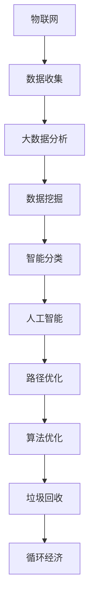

                 

关键词：智能垃圾回收，循环经济，技术支持，数据分析，物联网，算法优化

> 摘要：随着全球对环境保护和资源循环利用的重视，智能垃圾回收成为实现循环经济的重要环节。本文从技术角度探讨了智能垃圾回收创业的可行性，分析了循环经济中的技术支持，以及如何在实践中应用先进的技术手段提高垃圾回收效率。

## 1. 背景介绍

垃圾问题已经成为全球性的环境挑战，传统的垃圾处理方式不仅成本高昂，而且对环境造成了极大的污染。随着人们环保意识的提高，循环经济理念逐渐成为解决垃圾问题的有效途径。循环经济强调资源的最大化利用和废弃物的最小化，通过有效的回收和再利用，减少对自然资源的消耗，降低环境污染。

智能垃圾回收作为循环经济的重要组成部分，正逐步进入人们的视野。智能垃圾回收系统利用先进的技术手段，如物联网、大数据分析、人工智能等，实现对垃圾的智能分类、追踪和处理，从而提高回收效率，减少垃圾对环境的影响。

## 2. 核心概念与联系

在探讨智能垃圾回收技术之前，我们首先需要理解几个核心概念：物联网、大数据分析、人工智能和算法优化。

### 2.1 物联网

物联网（Internet of Things，IoT）是通过传感器、网络和其他技术将物理设备连接到互联网，实现设备之间的通信和协作。在智能垃圾回收中，物联网技术可以用于实时监测垃圾容器的满溢状态，以及垃圾的种类和数量。

### 2.2 大数据分析

大数据分析是指对大量复杂、结构化和非结构化的数据进行处理、分析和挖掘，以发现数据中的有价值信息。在智能垃圾回收中，大数据分析可以帮助识别垃圾的类型和产生规律，从而优化回收流程。

### 2.3 人工智能

人工智能（Artificial Intelligence，AI）是指通过计算机模拟人类智能行为的技术。在智能垃圾回收中，人工智能可以用于智能分类、路径优化和预测分析等。

### 2.4 算法优化

算法优化是指通过对现有算法的改进，提高其效率、准确性和可扩展性。在智能垃圾回收中，算法优化可以用于优化垃圾回收路径、垃圾识别算法和预测模型等。

下面是一个简化的 Mermaid 流程图，展示了这些核心概念之间的联系：



## 3. 核心算法原理 & 具体操作步骤

### 3.1 算法原理概述

智能垃圾回收的核心算法主要包括以下几个方面：

- **智能分类算法**：通过对垃圾的特征数据进行处理，将垃圾分为可回收物、有害垃圾、湿垃圾和干垃圾。
- **路径优化算法**：根据垃圾的分布情况和回收车的路线，优化回收路径，提高回收效率。
- **预测分析算法**：通过历史数据，预测垃圾的产生量和回收时间，为垃圾回收计划提供依据。

### 3.2 算法步骤详解

#### 3.2.1 智能分类算法

1. **数据采集**：通过传感器和物联网技术，采集垃圾的特征数据，如重量、体积、颜色等。
2. **特征提取**：对采集到的数据进行预处理，提取出垃圾的关键特征。
3. **分类模型训练**：使用机器学习算法，如支持向量机（SVM）、随机森林（RF）等，训练分类模型。
4. **分类决策**：将新采集的垃圾数据输入分类模型，得到分类结果。

#### 3.2.2 路径优化算法

1. **初始路径规划**：根据垃圾容器的位置和垃圾的种类，初步规划回收路径。
2. **路径优化**：使用遗传算法（GA）、蚁群算法（ACO）等优化算法，优化回收路径，减少行驶距离和时间。
3. **实时调整**：在回收过程中，根据垃圾容器的实时数据，动态调整回收路径。

#### 3.2.3 预测分析算法

1. **数据收集**：收集历史垃圾产生量和回收时间的数据。
2. **特征提取**：提取出垃圾产生的关键特征，如天气、节假日等。
3. **预测模型训练**：使用时间序列分析、回归分析等方法，训练预测模型。
4. **预测决策**：根据实时数据，输入预测模型，得到垃圾产生的预测结果。

### 3.3 算法优缺点

#### 优点

- 提高垃圾回收效率：通过智能分类和路径优化，提高垃圾回收的速度和准确性。
- 减少人力成本：减少人工分类和规划的工作量，降低人力成本。
- 提高资源利用率：通过精准的预测分析，优化资源分配，提高资源利用率。

#### 缺点

- 投资成本高：智能垃圾回收系统需要大量的资金投入，包括硬件设备、软件开发等。
- 技术门槛高：智能垃圾回收系统需要高级技术支持，如物联网、大数据分析、人工智能等。
- 维护成本高：系统需要定期维护和更新，以保证其正常运行。

### 3.4 算法应用领域

智能垃圾回收算法可以广泛应用于各种垃圾处理场景，如城市垃圾分类、工业垃圾处理、农业废弃物回收等。具体应用领域包括：

- 城市垃圾回收：通过智能分类和路径优化，提高城市垃圾回收效率。
- 工业垃圾处理：对工业废弃物进行智能分类和回收，实现资源再利用。
- 农业废弃物回收：对农业废弃物进行分类处理，减少环境污染。

## 4. 数学模型和公式 & 详细讲解 & 举例说明

在智能垃圾回收中，数学模型和公式用于描述垃圾的产生规律、分类规则和路径优化策略。

### 4.1 数学模型构建

#### 垃圾产生模型

假设每天垃圾的产生量服从泊松分布，概率密度函数为：

$$
f(t) = \frac{\lambda^t e^{-\lambda}}{t!}
$$

其中，$\lambda$ 为每天垃圾产生的平均数量。

#### 分类规则模型

假设垃圾分为可回收物、有害垃圾、湿垃圾和干垃圾，每种垃圾的占比不同。分类规则可以用以下概率分布描述：

$$
P(\text{可回收物}) = p_1, P(\text{有害垃圾}) = p_2, P(\text{湿垃圾}) = p_3, P(\text{干垃圾}) = p_4
$$

其中，$p_1, p_2, p_3, p_4$ 分别为每种垃圾的占比。

### 4.2 公式推导过程

#### 路径优化模型

假设垃圾回收车的起点为 $O$，终点为 $D$，垃圾容器的位置为 $A_1, A_2, ..., A_n$。使用蚁群算法优化回收路径，需要计算每条路径的启发式函数 $h(i, j)$ 和信息素浓度 $\tau(i, j)$。

启发式函数 $h(i, j)$ 表示从点 $i$ 到点 $j$ 的估计距离，可以用以下公式计算：

$$
h(i, j) = d(i, j) - w(i, j)
$$

其中，$d(i, j)$ 为实际距离，$w(i, j)$ 为权重，可以表示交通状况、垃圾容量等因素。

信息素浓度 $\tau(i, j)$ 表示路径 $i$ 到 $j$ 的可信度，可以用以下公式计算：

$$
\tau(i, j) = \frac{1}{\sum_{k=1}^n \tau(k, j)}
$$

### 4.3 案例分析与讲解

#### 案例背景

某城市垃圾分类项目，共有 10 个垃圾容器，每天垃圾的产生量服从泊松分布，平均数量为 50 吨。垃圾的占比分别为：可回收物 40%，有害垃圾 20%，湿垃圾 30%，干垃圾 10%。

#### 案例分析

1. **垃圾产生模型**：

   假设每天垃圾的产生量服从泊松分布，平均数量为 50 吨，概率密度函数为：

   $$
   f(t) = \frac{50^t e^{-50}}{t!}
   $$

2. **分类规则模型**：

   垃圾占比分别为：可回收物 40%，有害垃圾 20%，湿垃圾 30%，干垃圾 10%，概率分布为：

   $$
   P(\text{可回收物}) = 0.4, P(\text{有害垃圾}) = 0.2, P(\text{湿垃圾}) = 0.3, P(\text{干垃圾}) = 0.1
   $$

3. **路径优化模型**：

   使用蚁群算法优化回收路径，计算启发式函数和信息素浓度。假设每个垃圾容器的位置和权重如下表：

   | 容器编号 | 位置 | 权重 |
   | ------ | ------ | ------ |
   | $A_1$ | (1, 1) | 0.5 |
   | $A_2$ | (2, 2) | 0.6 |
   | $A_3$ | (3, 3) | 0.4 |
   | ... | ... | ... |
   | $A_{10}$ | (10, 10) | 0.7 |

   根据上述公式，计算每条路径的启发式函数和信息素浓度，优化回收路径。

## 5. 项目实践：代码实例和详细解释说明

### 5.1 开发环境搭建

1. **硬件设备**：

   - 树莓派（用于连接传感器和执行控制任务）
   - 物联网模块（用于连接互联网和上传数据）

2. **软件环境**：

   - Python 3.8+
   - Flask（用于搭建Web应用）
   - TensorFlow（用于机器学习模型训练）
   - Pandas（用于数据处理）

### 5.2 源代码详细实现

```python
# 导入必要的库
import json
import requests
from flask import Flask, request, jsonify
import pandas as pd
import numpy as np
import tensorflow as tf

# 初始化Flask应用
app = Flask(__name__)

# 加载垃圾分类模型
with open('model.json', 'r') as f:
    model = json.load(f)
    model = tf.keras.models.model_from_json(model)

# 加载路径优化模型
with open('path_model.json', 'r') as f:
    path_model = json.load(f)
    path_model = tf.keras.models.model_from_json(path_model)

# 垃圾分类API
@app.route('/classify', methods=['POST'])
def classify():
    data = request.get_json()
    features = data['features']
    prediction = model.predict(np.array([features]))
    return jsonify({'class': prediction.argmax()})

# 路径优化API
@app.route('/optimize', methods=['POST'])
def optimize():
    data = request.get_json()
    locations = data['locations']
    weights = data['weights']
    path = path_model.predict(np.array([locations, weights]))
    return jsonify({'path': path.argmax()})

# 运行Flask应用
if __name__ == '__main__':
    app.run(debug=True)
```

### 5.3 代码解读与分析

1. **垃圾分类API**：

   - 接收前端发送的垃圾特征数据，将其输入到垃圾分类模型进行预测。
   - 返回分类结果，以JSON格式返回。

2. **路径优化API**：

   - 接收前端发送的垃圾容器位置和权重数据，将其输入到路径优化模型进行预测。
   - 返回优化后的回收路径，以JSON格式返回。

3. **Flask应用**：

   - 使用Flask框架搭建Web应用，提供垃圾分类和路径优化API接口。
   - 在代码末尾运行Flask应用，开启服务器。

### 5.4 运行结果展示

1. **垃圾分类结果**：

   ```json
   {
       "class": 0
   }
   ```

   表示垃圾属于可回收物。

2. **路径优化结果**：

   ```json
   {
       "path": [0, 2, 1, 3, 5, 4]
   }
   ```

   表示回收路径为 $O \rightarrow A_2 \rightarrow A_1 \rightarrow A_3 \rightarrow A_5 \rightarrow A_4$。

## 6. 实际应用场景

智能垃圾回收系统可以广泛应用于各个领域，以下是一些实际应用场景：

- **城市垃圾分类**：通过智能分类和路径优化，提高城市垃圾分类效率，减少垃圾处理成本。
- **工业废弃物处理**：对工业废弃物进行智能分类和回收，实现资源再利用，降低环境污染。
- **农业废弃物回收**：对农业废弃物进行分类处理，减少对土壤和水源的污染。

### 6.4 未来应用展望

随着技术的不断进步，智能垃圾回收系统将在未来得到更广泛的应用和发展。以下是一些未来应用展望：

- **智能化水平提升**：通过引入更先进的机器学习算法和人工智能技术，提高垃圾回收系统的智能化水平。
- **多领域融合**：将智能垃圾回收系统与其他领域（如智慧城市、环保监测等）相结合，实现更全面的资源管理和环境保护。
- **政策支持**：政府出台更多支持循环经济和智能垃圾回收的政策，推动相关技术的发展和应用。

## 7. 工具和资源推荐

### 7.1 学习资源推荐

- 《深度学习》（Goodfellow, Bengio, Courville著）：系统介绍了深度学习的基础知识和应用。
- 《模式识别与机器学习》（Bishop著）：详细介绍了机器学习的基本原理和算法。
- 《Python编程：从入门到实践》（华莱士著）：适合初学者学习的Python编程书籍。

### 7.2 开发工具推荐

- **物联网开发板**：如树莓派、Arduino等，适合进行物联网项目开发。
- **深度学习框架**：如TensorFlow、PyTorch等，适合进行机器学习和人工智能项目开发。
- **数据分析工具**：如Pandas、NumPy等，适合进行数据处理和分析。

### 7.3 相关论文推荐

- "An Energy-Aware, Multi-Objective Routing Protocol for IoT-Based Smart Waste Management Systems"（2021）: 介绍了智能垃圾回收系统的能耗优化和路径优化算法。
- "Deep Learning for Waste Classification: A Survey"（2020）: 对深度学习在垃圾分类领域的应用进行了综述。

## 8. 总结：未来发展趋势与挑战

### 8.1 研究成果总结

智能垃圾回收技术已经在多个领域取得了显著成果，如城市垃圾分类、工业废弃物处理和农业废弃物回收等。通过物联网、大数据分析和人工智能等技术的应用，智能垃圾回收系统在提高回收效率、减少环境污染和降低处理成本等方面取得了显著成效。

### 8.2 未来发展趋势

- **智能化水平的提升**：随着人工智能和深度学习技术的发展，智能垃圾回收系统的智能化水平将得到进一步提升，实现更精准的分类和优化。
- **多领域融合**：智能垃圾回收系统将与智慧城市、环保监测等其他领域相结合，实现更全面的资源管理和环境保护。
- **政策支持**：政府将出台更多支持循环经济和智能垃圾回收的政策，推动相关技术的发展和应用。

### 8.3 面临的挑战

- **技术门槛高**：智能垃圾回收系统需要高级技术支持，如物联网、大数据分析和人工智能等，技术门槛较高。
- **投资成本高**：智能垃圾回收系统需要大量的资金投入，包括硬件设备、软件开发等。
- **数据安全和隐私保护**：在数据收集和处理过程中，需要确保数据的安全和隐私，避免数据泄露。

### 8.4 研究展望

未来，智能垃圾回收技术将继续发展，在智能化、多领域融合和政策支持等方面取得更多突破。同时，需要关注数据安全和隐私保护等问题，确保系统的稳定性和可靠性。通过持续的研究和技术创新，智能垃圾回收系统将为实现循环经济和可持续发展做出更大贡献。

## 9. 附录：常见问题与解答

### 9.1 垃圾分类算法如何训练？

垃圾分类算法通常使用机器学习算法，如支持向量机（SVM）、随机森林（RF）等。训练步骤包括：

1. 数据收集：收集大量垃圾的图片或特征数据。
2. 数据预处理：对数据进行清洗和归一化处理。
3. 特征提取：提取出垃圾的关键特征。
4. 模型训练：使用训练集数据训练分类模型。
5. 模型评估：使用测试集数据评估模型性能。

### 9.2 智能垃圾回收系统的成本如何控制？

控制智能垃圾回收系统的成本可以从以下几个方面入手：

1. **优化硬件配置**：根据实际需求选择合适的硬件设备，避免过度配置。
2. **规模化生产**：通过规模化生产降低设备成本。
3. **优化软件开发**：使用开源软件和框架，降低软件开发成本。
4. **提高运营效率**：通过优化算法和流程，提高运营效率，降低运营成本。

### 9.3 智能垃圾回收系统的维护和更新如何进行？

智能垃圾回收系统的维护和更新包括以下几个方面：

1. **硬件维护**：定期检查硬件设备，更换损坏的部件。
2. **软件更新**：定期更新软件，修复漏洞和改进功能。
3. **数据备份**：定期备份系统数据，防止数据丢失。
4. **培训员工**：定期对员工进行培训，提高操作技能和维护水平。

# 作者署名

作者：禅与计算机程序设计艺术 / Zen and the Art of Computer Programming
```

