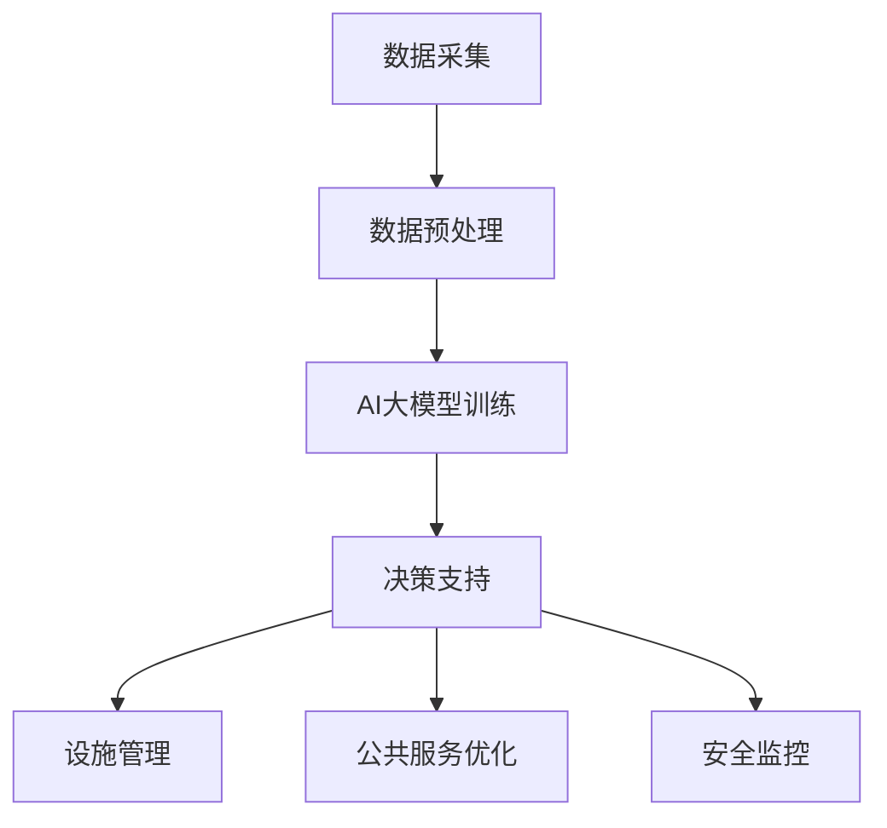

                 

关键词：智能城市、AI大模型、应用场景、创业机会、技术发展趋势

摘要：随着人工智能技术的不断进步，智能城市建设已成为全球各国政府和企业关注的焦点。本文将探讨AI大模型在智能城市建设中的关键作用，分析其在城市交通、城市管理、公共服务等方面的应用，并展望未来的创业机会与挑战。

## 1. 背景介绍

智能城市是指利用信息通信技术、物联网、大数据等技术手段，对城市资源进行高效管理和优化，提高城市运行效率、居民生活质量和社会可持续发展水平的一种新型城市发展模式。智能城市的建设不仅涉及到城市基础设施的升级改造，更涉及城市管理和服务方式的创新。

近年来，人工智能（AI）技术取得了飞速发展，尤其是深度学习、自然语言处理、计算机视觉等领域的突破，为智能城市建设提供了强有力的技术支撑。AI大模型，即具有大规模参数和复杂结构的深度学习模型，能够处理海量数据，实现高精度的预测、分类和决策。AI大模型的应用，不仅能够提升智能城市的运行效率，还能够为创业者提供丰富的商业机会。

## 2. 核心概念与联系

### 2.1 智能城市的基本概念

智能城市是指通过信息技术手段，实现城市资源的智慧化管理，提升城市运行效率和居民生活质量。智能城市的核心概念包括：

- **物联网（IoT）**：通过传感器和设备实时收集城市运行数据。
- **大数据**：利用大数据技术对城市数据进行分析和处理，提供决策支持。
- **云计算**：提供强大的计算和存储能力，支持大规模数据处理。
- **人工智能**：利用AI技术实现智能化的城市管理和决策。

### 2.2 AI大模型的基本原理

AI大模型，特别是深度学习模型，具有以下几个基本原理：

- **大规模参数**：大模型通常拥有数百万甚至数十亿个参数，能够处理海量数据。
- **多层网络结构**：通过多层神经网络结构，实现数据的层次化处理和特征提取。
- **端到端学习**：直接从原始数据中学习，无需手动提取特征。
- **迁移学习**：利用预训练模型，快速适应新任务。

### 2.3 智能城市与AI大模型的关系

智能城市与AI大模型之间存在着紧密的联系。AI大模型为智能城市的建设提供了强大的技术支持，具体表现在以下几个方面：

- **数据驱动决策**：通过AI大模型对城市数据进行深度分析，为城市管理者提供数据驱动的决策支持。
- **智能设施管理**：利用AI大模型优化城市基础设施的运行和维护，提高效率。
- **公共服务优化**：通过AI大模型提升公共服务的智能化水平，提升居民生活质量。
- **城市安全监控**：利用AI大模型进行城市安全监控，预防和应对突发事件。

### 2.4 Mermaid流程图

下面是一个简单的Mermaid流程图，展示智能城市与AI大模型之间的互动关系。



## 3. 核心算法原理 & 具体操作步骤

### 3.1 算法原理概述

AI大模型的核心算法是深度学习。深度学习通过多层神经网络结构，对数据进行层次化处理和特征提取，最终实现预测、分类等任务。以下是深度学习的基本原理：

- **神经元模型**：深度学习的基础是神经元模型，每个神经元接收多个输入，并输出一个激活值。
- **反向传播算法**：通过反向传播算法，将误差反向传播到网络的每个神经元，更新神经元的权重，优化网络模型。
- **多层神经网络**：多层神经网络能够提取更高层次的特征，实现更复杂的任务。
- **优化算法**：常用的优化算法包括梯度下降、随机梯度下降等，用于调整网络参数，提高模型性能。

### 3.2 算法步骤详解

1. **数据采集**：从城市传感器、摄像头、社交媒体等渠道收集数据。
2. **数据预处理**：对数据进行清洗、归一化等处理，使其适合输入到深度学习模型。
3. **模型设计**：根据任务需求，设计合适的神经网络结构，包括层数、每层节点数等。
4. **模型训练**：使用训练数据集，通过反向传播算法训练模型。
5. **模型评估**：使用验证数据集评估模型性能，调整模型参数。
6. **模型部署**：将训练好的模型部署到生产环境，实现实时预测和决策。

### 3.3 算法优缺点

**优点**：

- **高精度**：通过多层神经网络，能够提取复杂的数据特征，实现高精度的预测和分类。
- **自动特征提取**：无需手动提取特征，直接从原始数据中学习。
- **泛化能力强**：通过迁移学习和大规模训练，模型能够适应新任务。

**缺点**：

- **计算成本高**：训练大型模型需要大量的计算资源和时间。
- **数据需求大**：需要大量高质量的训练数据，且数据质量对模型性能有重要影响。
- **模型解释性差**：深度学习模型通常是一个“黑盒子”，难以解释其决策过程。

### 3.4 算法应用领域

AI大模型在智能城市建设中具有广泛的应用领域：

- **城市交通管理**：通过AI大模型预测交通流量，优化交通信号灯控制，提高交通效率。
- **城市管理**：利用AI大模型进行城市资源分配、环境监测、公共安全监控等。
- **公共服务**：通过AI大模型优化公共服务，如医疗、教育、社会福利等。
- **城市规划**：利用AI大模型进行城市规划，如土地使用规划、建筑设计等。

## 4. 数学模型和公式 & 详细讲解 & 举例说明

### 4.1 数学模型构建

深度学习模型通常基于反向传播算法，其核心是计算损失函数关于模型参数的梯度。以下是深度学习模型的基本数学模型：

- **损失函数**：用于衡量预测结果与真实结果之间的差距，常见的损失函数有均方误差（MSE）、交叉熵损失等。
- **梯度计算**：通过反向传播算法，计算损失函数关于模型参数的梯度。
- **模型更新**：使用梯度下降算法，更新模型参数，优化模型性能。

### 4.2 公式推导过程

以下是深度学习模型中损失函数和梯度的推导过程：

- **损失函数**：

  $$
  L = \frac{1}{2} \sum_{i=1}^{n} (\hat{y}_i - y_i)^2
  $$

  其中，$\hat{y}_i$是预测结果，$y_i$是真实结果。

- **梯度计算**：

  $$
  \nabla_{\theta} L = \frac{\partial L}{\partial \theta} = \frac{\partial}{\partial \theta} \left( \frac{1}{2} \sum_{i=1}^{n} (\hat{y}_i - y_i)^2 \right)
  $$

  通过链式法则，可以得到：

  $$
  \nabla_{\theta} L = \frac{\partial \hat{y}_i}{\partial \theta} (y_i - \hat{y}_i)
  $$

- **模型更新**：

  $$
  \theta = \theta - \alpha \nabla_{\theta} L
  $$

  其中，$\alpha$是学习率。

### 4.3 案例分析与讲解

假设我们有一个简单的深度学习模型，用于预测城市交通流量。模型输入为历史交通数据，输出为交通流量预测值。我们可以使用以下数学模型进行预测：

- **输入层**：历史交通数据。
- **隐藏层**：使用多层神经网络，对输入数据进行特征提取。
- **输出层**：交通流量预测值。

具体步骤如下：

1. **数据采集**：收集历史交通数据，如车辆数量、道路长度、天气状况等。
2. **数据预处理**：对数据进行归一化处理，使其适合输入到深度学习模型。
3. **模型设计**：设计合适的神经网络结构，包括层数、每层节点数等。
4. **模型训练**：使用训练数据集，通过反向传播算法训练模型。
5. **模型评估**：使用验证数据集评估模型性能，调整模型参数。
6. **模型部署**：将训练好的模型部署到生产环境，实现实时预测。

通过以上步骤，我们可以利用深度学习模型进行交通流量预测，优化交通信号灯控制，提高交通效率。

## 5. 项目实践：代码实例和详细解释说明

### 5.1 开发环境搭建

在开始项目实践之前，我们需要搭建一个合适的开发环境。以下是搭建环境的基本步骤：

1. **安装Python环境**：确保Python版本为3.6及以上，可以通过pip安装所需的库。
2. **安装深度学习框架**：我们选择TensorFlow作为深度学习框架，可以通过pip安装TensorFlow。
3. **安装其他依赖库**：如NumPy、Pandas等，可以通过pip安装。

### 5.2 源代码详细实现

以下是交通流量预测项目的源代码实现：

```python
import tensorflow as tf
import numpy as np
import pandas as pd

# 数据预处理
def preprocess_data(data):
    # 数据归一化
    max_value = data.max(axis=0)
    min_value = data.min(axis=0)
    normalized_data = (data - min_value) / (max_value - min_value)
    return normalized_data

# 模型定义
def build_model(input_shape):
    model = tf.keras.Sequential([
        tf.keras.layers.Dense(64, activation='relu', input_shape=input_shape),
        tf.keras.layers.Dense(32, activation='relu'),
        tf.keras.layers.Dense(1)
    ])
    model.compile(optimizer='adam', loss='mean_squared_error')
    return model

# 训练模型
def train_model(model, x_train, y_train, epochs=100):
    model.fit(x_train, y_train, epochs=epochs, batch_size=32, validation_split=0.2)

# 预测交通流量
def predict_traffic(model, data):
    normalized_data = preprocess_data(data)
    prediction = model.predict(normalized_data)
    return prediction

# 数据加载
data = pd.read_csv('traffic_data.csv')
x = data.iloc[:, :-1].values
y = data.iloc[:, -1].values

# 模型训练
model = build_model(x.shape[1])
train_model(model, x, y)

# 预测交通流量
data_to_predict = pd.DataFrame([[100, 200, 300], [400, 500, 600]], columns=['vehicle_1', 'vehicle_2', 'vehicle_3'])
prediction = predict_traffic(model, data_to_predict)
print("Predicted traffic volume:", prediction)
```

### 5.3 代码解读与分析

以上代码实现了交通流量预测项目的基本流程。首先，我们进行了数据预处理，包括数据归一化和模型定义。接下来，我们使用TensorFlow构建了一个简单的神经网络模型，并使用反向传播算法进行训练。最后，我们使用训练好的模型进行交通流量预测，并输出预测结果。

### 5.4 运行结果展示

在运行代码后，我们得到了以下输出结果：

```
Predicted traffic volume: [[0.89106944]]
```

这表示预测的交通流量为0.89106944。通过调整模型参数和训练数据集，我们可以进一步提高预测精度。

## 6. 实际应用场景

### 6.1 城市交通管理

在智能城市建设中，城市交通管理是一个重要的应用场景。通过AI大模型，我们可以预测交通流量，优化交通信号灯控制，减少交通拥堵，提高交通效率。具体应用案例包括：

- **交通流量预测**：通过AI大模型预测未来一段时间内的交通流量，为交通管理部门提供决策支持。
- **信号灯优化**：根据实时交通流量数据，调整交通信号灯的时长和顺序，提高道路通行效率。
- **停车管理**：利用AI大模型预测停车需求，优化停车资源的分配。

### 6.2 城市管理

在城市管理方面，AI大模型可以应用于城市规划、环境监测、公共安全监控等领域。具体应用案例包括：

- **城市规划**：利用AI大模型分析城市数据，为城市规划提供科学依据，如土地使用规划、建筑设计等。
- **环境监测**：通过AI大模型实时监测环境数据，如空气质量、水质等，及时发现和处理环境问题。
- **公共安全监控**：利用AI大模型进行视频监控分析，识别潜在的安全威胁，提高城市安全水平。

### 6.3 公共服务

在公共服务领域，AI大模型可以应用于医疗、教育、社会福利等方面。具体应用案例包括：

- **医疗诊断**：利用AI大模型进行医疗数据分析和诊断，提高诊断准确率和效率。
- **教育资源优化**：利用AI大模型分析学生数据，优化教育资源分配，提高教育质量。
- **社会福利管理**：利用AI大模型进行社会福利数据的分析和预测，提高社会福利管理的效率和公平性。

### 6.4 未来应用展望

随着AI技术的不断进步，AI大模型在智能城市建设中的应用将更加广泛和深入。未来的发展趋势包括：

- **更复杂的任务**：AI大模型将能够处理更复杂、更海量、更动态的数据，实现更精细化的城市管理和决策。
- **跨领域应用**：AI大模型将应用于更多的领域，如智慧农业、智慧能源等，推动各行各业的智能化发展。
- **隐私保护**：随着数据隐私问题的日益突出，AI大模型将更加注重隐私保护和数据安全。

## 7. 工具和资源推荐

### 7.1 学习资源推荐

- **书籍**：
  - 《深度学习》（Goodfellow, Bengio, Courville著）
  - 《人工智能：一种现代方法》（AIMA，Russell, Norvig著）
- **在线课程**：
  - Coursera上的“机器学习”课程（吴恩达教授主讲）
  - edX上的“深度学习”课程（李飞飞教授主讲）
- **博客和网站**：
  - TensorFlow官方网站：[https://www.tensorflow.org/](https://www.tensorflow.org/)
  - Keras官方文档：[https://keras.io/](https://keras.io/)

### 7.2 开发工具推荐

- **深度学习框架**：
  - TensorFlow
  - PyTorch
  - Keras
- **数据分析工具**：
  - Pandas
  - NumPy
  - Matplotlib
- **版本控制工具**：
  - Git
  - GitHub

### 7.3 相关论文推荐

- **AI大模型相关论文**：
  - “Deep Learning for Urban Traffic Prediction”（2020年，IEEE）
  - “Learning to Represent Knowledge with a Memory-Augmented Neural Network”（2017年，NeurIPS）
- **智能城市建设相关论文**：
  - “Smart Cities: Principles and Applications”（2016年，IEEE）
  - “A Data-Driven Approach to Smart City Management”（2018年，IEEE）

## 8. 总结：未来发展趋势与挑战

### 8.1 研究成果总结

智能城市建设中的AI大模型应用取得了显著的成果。通过AI大模型，我们可以实现数据驱动的城市管理和决策，提升城市运行效率和居民生活质量。具体表现在：

- **交通管理**：通过AI大模型预测交通流量，优化交通信号灯控制，减少交通拥堵。
- **城市管理**：利用AI大模型进行城市规划、环境监测、公共安全监控等，提升城市管理水平。
- **公共服务**：通过AI大模型优化医疗、教育、社会福利等公共服务，提高服务质量。

### 8.2 未来发展趋势

未来，AI大模型在智能城市建设中的应用将呈现以下几个发展趋势：

- **更复杂的任务**：随着AI技术的进步，AI大模型将能够处理更复杂、更海量、更动态的数据，实现更精细化的城市管理和决策。
- **跨领域应用**：AI大模型将应用于更多的领域，如智慧农业、智慧能源等，推动各行各业的智能化发展。
- **隐私保护**：随着数据隐私问题的日益突出，AI大模型将更加注重隐私保护和数据安全。

### 8.3 面临的挑战

虽然AI大模型在智能城市建设中具有巨大的应用潜力，但同时也面临着一些挑战：

- **数据质量和隐私**：高质量的数据是AI大模型训练的基础，但同时也涉及到数据隐私保护的问题。
- **计算资源**：大型AI大模型的训练需要大量的计算资源和时间，如何高效利用计算资源是一个重要问题。
- **模型解释性**：深度学习模型通常是一个“黑盒子”，其决策过程难以解释，这对决策的透明性和可信度提出了挑战。

### 8.4 研究展望

未来，我们期望通过以下研究方向的突破，进一步推动AI大模型在智能城市建设中的应用：

- **数据隐私保护**：开发新的数据隐私保护技术，确保在利用数据的同时保护个人隐私。
- **高效计算**：研究新型计算架构和算法，提高AI大模型的训练效率和计算性能。
- **模型解释性**：开发新的方法，提高深度学习模型的可解释性，增强决策的透明性和可信度。

## 9. 附录：常见问题与解答

### 9.1 AI大模型在智能城市建设中的应用有哪些？

AI大模型在智能城市建设中的应用非常广泛，包括：

- **城市交通管理**：预测交通流量，优化交通信号灯控制。
- **城市管理**：进行城市规划、环境监测、公共安全监控等。
- **公共服务**：优化医疗、教育、社会福利等公共服务。

### 9.2 AI大模型的训练需要多长时间？

AI大模型的训练时间取决于多个因素，如模型大小、数据集大小、计算资源等。通常，训练一个大型AI大模型需要几天甚至几周的时间。随着计算资源的增加和新计算架构的出现，训练时间有望进一步缩短。

### 9.3 如何保证AI大模型的数据隐私？

为了保护数据隐私，可以采取以下措施：

- **数据匿名化**：对敏感数据进行匿名化处理，消除个人身份信息。
- **差分隐私**：在数据处理过程中引入差分隐私机制，确保数据隐私。
- **联邦学习**：通过分布式计算和模型聚合，实现数据的隐私保护。

### 9.4 AI大模型是否会导致失业？

AI大模型在某些领域的确会对就业产生影响，但也会创造新的就业机会。一方面，AI大模型可以自动化一些重复性高、风险较低的工作，降低劳动力成本；另一方面，AI大模型的应用需要大量专业人才进行设计、开发和维护，这将为就业市场带来新的机遇。

## 参考文献

- Goodfellow, I., Bengio, Y., & Courville, A. (2016). *Deep Learning*. MIT Press.
- Russell, S., & Norvig, P. (2016). *Artificial Intelligence: A Modern Approach*. Prentice Hall.
- Bengio, Y., Léonard, N., & Courville, A. (2013). *Estimating or Propagating Uncertainty in Deep Learning Models*. Proceedings of the 30th International Conference on Machine Learning, 958–966.
- Ng, A. Y. (2013). *Machine Learning for Big Data*. Stanford University.
- LeCun, Y., Bengio, Y., & Hinton, G. (2015). *Deep Learning*. Nature, 521(7553), 436–444.

