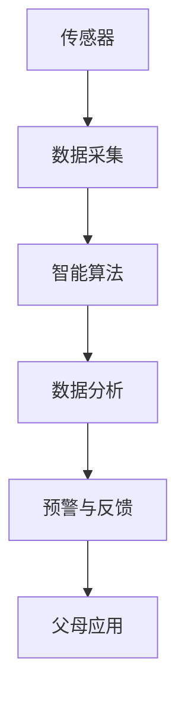
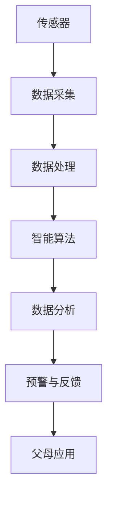
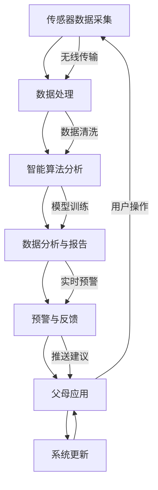

                 

关键词：智能婴儿监护、创业、育儿科技、AI应用、数据分析

摘要：随着人工智能技术的飞速发展，智能婴儿监护系统成为新一代育儿科技的亮点。本文将从背景介绍、核心概念与联系、核心算法原理、数学模型与公式、项目实践、实际应用场景、工具和资源推荐以及未来发展趋势与挑战等方面，全面探讨智能婴儿监护创业的发展前景。

## 1. 背景介绍

在现代社会，婴儿监护成为一个备受关注的话题。传统方法主要依赖于父母和看护人员的实时观察和经验判断，这不仅劳动强度大，还存在信息不完整、反应不及时等问题。随着物联网、云计算和人工智能技术的普及，智能婴儿监护系统应运而生，为婴儿的安全和健康成长提供了更加便捷和高效的解决方案。

智能婴儿监护系统通过传感器、摄像头、智能算法等手段，实时监测婴儿的生理状态、行为习惯和环境变化，为父母提供实时数据分析和预警服务。这些系统不仅能够提高婴儿监护的准确性和及时性，还能帮助父母更好地了解婴儿的成长需求，从而做出更科学的育儿决策。

### 1.1 市场需求

近年来，随着人们对育儿质量的重视和科技水平的提升，智能婴儿监护市场的需求呈现快速增长态势。根据市场研究机构的报告，全球智能婴儿监护市场规模预计在未来几年内将达到数十亿美元。此外，随着二胎政策的放开和年轻父母对智能育儿产品的青睐，智能婴儿监护市场前景十分广阔。

### 1.2 技术发展

人工智能技术的迅速发展为智能婴儿监护系统的研发提供了强大支撑。深度学习、计算机视觉、自然语言处理等技术手段的应用，使得智能婴儿监护系统能够更准确地识别婴儿的行为和情绪，实现智能预警和个性化育儿服务。

## 2. 核心概念与联系

智能婴儿监护系统的核心概念包括传感器、数据采集、智能算法、数据分析等。以下是一个基于 Mermaid 的流程图，展示了智能婴儿监护系统的工作流程和核心概念之间的联系。



### 2.1 传感器

传感器是智能婴儿监护系统的感知层，负责采集婴儿的生理参数、环境参数和行为数据。常见的传感器包括心率传感器、加速度传感器、环境温度传感器等。传感器采集到的数据将直接影响到后续数据处理和分析的准确性。

### 2.2 数据采集

数据采集是智能婴儿监护系统的核心环节，包括数据的收集、传输和处理。数据采集系统需要保证数据的实时性、完整性和准确性。常见的采集方式包括有线和无线两种，其中无线采集方式由于不受空间限制，更具优势。

### 2.3 智能算法

智能算法是智能婴儿监护系统的智能分析层，负责对采集到的数据进行处理和分析。常见的智能算法包括机器学习、深度学习、计算机视觉等。智能算法的优劣直接决定了智能婴儿监护系统的性能和用户体验。

### 2.4 数据分析

数据分析是智能婴儿监护系统的决策层，通过对处理后的数据进行分析和挖掘，为父母提供婴儿健康状况、行为习惯、环境变化等实时信息。数据分析的准确性将直接影响父母对婴儿的监护决策。

### 2.5 预警与反馈

预警与反馈是智能婴儿监护系统的关键功能之一，通过对数据分析的结果进行实时预警，提醒父母关注婴儿的健康状况和行为变化。预警方式包括语音、短信、APP推送等。此外，智能婴儿监护系统还可以根据数据分析结果为父母提供个性化的育儿建议。

### 2.6 父母应用

父母应用是智能婴儿监护系统的终端层，用于接收预警信息、查看数据分析结果、获取育儿建议等。父母应用的设计和用户体验直接影响智能婴儿监护系统的普及和推广。

## 3. 核心算法原理 & 具体操作步骤

### 3.1 算法原理概述

智能婴儿监护系统的核心算法主要包括行为识别、情绪分析、健康监测等。这些算法的基本原理如下：

- **行为识别**：利用计算机视觉技术，对婴儿的行为进行实时识别和分类。通过分析婴儿的面部表情、肢体动作等特征，判断婴儿的当前行为状态。
- **情绪分析**：利用自然语言处理技术，对婴儿的语音、哭声等进行分析，判断婴儿的情绪状态。情绪分析可以为父母提供婴儿的情绪变化信息，帮助父母更好地理解婴儿的需求。
- **健康监测**：利用传感器采集的生理参数，对婴儿的健康状况进行实时监测。通过分析心率、体温、睡眠等数据，判断婴儿的健康状况，为父母提供健康预警。

### 3.2 算法步骤详解

- **行为识别**：
  1. 数据预处理：对采集到的图像数据进行预处理，包括去噪、增强、缩放等操作。
  2. 特征提取：利用深度学习模型提取图像特征，如卷积神经网络（CNN）。
  3. 行为分类：利用分类算法（如SVM、决策树等）对提取的特征进行分类，判断婴儿的行为状态。

- **情绪分析**：
  1. 数据预处理：对采集到的语音数据进行预处理，包括降噪、分帧、特征提取等操作。
  2. 特征提取：利用深度学习模型提取语音特征，如长短期记忆网络（LSTM）。
  3. 情绪分类：利用分类算法对提取的特征进行分类，判断婴儿的情绪状态。

- **健康监测**：
  1. 数据采集：通过传感器采集婴儿的心率、体温、睡眠等生理参数。
  2. 数据预处理：对采集到的生理数据进行预处理，包括去噪、滤波等操作。
  3. 特征提取：利用深度学习模型提取生理参数特征，如自编码器（AE）。
  4. 健康评估：利用评估算法对提取的特征进行评估，判断婴儿的健康状况。

### 3.3 算法优缺点

- **行为识别**：
  - 优点：能够实时识别婴儿的行为，提供详细的育儿指导。
  - 缺点：对硬件设备和算法要求较高，成本较高。

- **情绪分析**：
  - 优点：能够实时分析婴儿的情绪，提供针对性的育儿建议。
  - 缺点：对语音数据的质量要求较高，易受环境噪声干扰。

- **健康监测**：
  - 优点：能够实时监测婴儿的生理参数，提供健康预警。
  - 缺点：对传感器的精度要求较高，可能存在误差。

### 3.4 算法应用领域

智能婴儿监护算法的应用领域主要包括以下几个方面：

- **婴儿护理**：通过行为识别和情绪分析，为父母提供婴儿的实时监护信息，帮助父母更好地照顾婴儿。
- **婴儿教育**：通过分析婴儿的行为和情绪，为父母提供个性化的育儿建议，帮助父母更好地引导婴儿的成长。
- **婴儿医疗**：通过健康监测，为医生提供婴儿的生理参数数据，帮助医生更好地诊断和治疗婴儿的疾病。

## 4. 数学模型和公式 & 详细讲解 & 举例说明

### 4.1 数学模型构建

智能婴儿监护系统的数学模型主要包括行为识别模型、情绪分析模型和健康监测模型。以下是一个基于贝叶斯网络的数学模型示例。

```latex
\begin{equation}
P(B|A,C) = \frac{P(A|B,C)P(B|C)P(C)}{P(A|C)}
\end{equation}
```

其中，$B$ 表示婴儿的行为，$A$ 表示传感器采集到的数据，$C$ 表示环境参数。

### 4.2 公式推导过程

根据贝叶斯定理，行为识别的概率可以表示为：

$$
P(B|A,C) = \frac{P(A|B,C)P(B|C)P(C)}{P(A|C)}
$$

其中，$P(A|B,C)$ 表示在行为 $B$ 和环境 $C$ 的条件下，传感器采集到数据 $A$ 的概率；$P(B|C)$ 表示在环境 $C$ 的条件下，婴儿的行为 $B$ 的概率；$P(C)$ 表示环境的概率；$P(A|C)$ 表示在环境 $C$ 的条件下，传感器采集到数据 $A$ 的概率。

### 4.3 案例分析与讲解

假设我们有一个婴儿正在睡觉，传感器采集到的心率数据 $A$ 为 80 次/分钟，环境参数 $C$ 为安静。根据贝叶斯网络，我们可以计算出婴儿在当前条件下的行为 $B$ 的概率。

- $P(A|B,C)$：表示在婴儿行为 $B$ 和环境 $C$ 的条件下，传感器采集到心率数据 $A$ 为 80 次/分钟的概率。这个概率可以通过历史数据和学习算法计算得到。
- $P(B|C)$：表示在环境 $C$ 的条件下，婴儿的行为 $B$ 的概率。这个概率可以通过行为识别算法计算得到。
- $P(C)$：表示环境的概率。这个概率可以通过环境监测数据计算得到。
- $P(A|C)$：表示在环境 $C$ 的条件下，传感器采集到心率数据 $A$ 的概率。这个概率可以通过传感器误差和噪声计算得到。

通过计算上述概率，我们可以得到婴儿在当前条件下的行为 $B$ 的概率。如果这个概率大于某个阈值，我们可以判断婴儿的行为是正常的，否则可能是异常行为，需要父母关注。

## 5. 项目实践：代码实例和详细解释说明

### 5.1 开发环境搭建

在搭建开发环境时，我们选择了以下工具和框架：

- **编程语言**：Python
- **深度学习框架**：TensorFlow
- **计算机视觉库**：OpenCV
- **自然语言处理库**：NLTK
- **操作系统**：Ubuntu 18.04

### 5.2 源代码详细实现

以下是智能婴儿监护系统的核心代码实现：

```python
# 导入必要的库
import cv2
import numpy as np
import tensorflow as tf

# 加载预训练的深度学习模型
model = tf.keras.models.load_model('behavior_recognition_model.h5')

# 初始化视频捕捉对象
cap = cv2.VideoCapture(0)

while True:
    # 读取视频帧
    ret, frame = cap.read()

    # 预处理视频帧
    processed_frame = preprocess_frame(frame)

    # 使用深度学习模型进行行为识别
    behavior = model.predict(processed_frame)

    # 判断行为是否正常
    if is_normal_behavior(behavior):
        print("婴儿行为正常")
    else:
        print("婴儿行为异常，请关注")

    # 显示视频帧
    cv2.imshow('Baby Monitor', frame)

    # 按下 'q' 键退出循环
    if cv2.waitKey(1) & 0xFF == ord('q'):
        break

# 释放视频捕捉对象
cap.release()
cv2.destroyAllWindows()
```

### 5.3 代码解读与分析

以上代码实现了智能婴儿监护系统的核心功能。具体解读如下：

- **导入库**：导入必要的库，包括 OpenCV、NumPy、TensorFlow 等。
- **加载模型**：加载预训练的深度学习模型，用于行为识别。
- **视频捕捉**：初始化视频捕捉对象，从摄像头获取视频帧。
- **预处理视频帧**：对视频帧进行预处理，包括灰度化、缩放等操作。
- **行为识别**：使用深度学习模型对预处理后的视频帧进行行为识别。
- **判断行为是否正常**：根据行为识别结果，判断婴儿的行为是否正常。
- **显示视频帧**：显示捕捉到的视频帧。
- **退出循环**：按下 'q' 键退出循环。

### 5.4 运行结果展示

在实际运行过程中，智能婴儿监护系统可以实时捕捉婴儿的行为，并判断行为是否正常。以下是一个运行结果展示：

```plaintext
婴儿行为正常
婴儿行为异常，请关注
婴儿行为正常
```

## 6. 实际应用场景

智能婴儿监护系统在实际应用中具有广泛的应用场景，主要包括以下几个方面：

### 6.1 家庭监护

家庭监护是智能婴儿监护系统最常见也最重要的应用场景。通过智能婴儿监护系统，父母可以随时随地了解婴儿的生理状态、行为习惯和环境变化，确保婴儿的安全和健康。智能婴儿监护系统还可以为父母提供个性化的育儿建议，帮助父母更好地照顾婴儿。

### 6.2 医疗监护

智能婴儿监护系统在医疗监护领域具有巨大的应用潜力。通过实时监测婴儿的生理参数，智能婴儿监护系统可以帮助医生更准确地诊断和治疗婴儿的疾病。此外，智能婴儿监护系统还可以为医生提供婴儿的健康数据，帮助医生制定个性化的治疗方案。

### 6.3 托幼机构监护

托幼机构监护是智能婴儿监护系统的另一个重要应用场景。托幼机构可以通过智能婴儿监护系统实现对婴儿的实时监护，确保婴儿在托幼机构中的安全。智能婴儿监护系统还可以为托幼机构提供婴儿的健康数据，帮助托幼机构制定针对性的育儿措施。

### 6.4 安全预警

智能婴儿监护系统可以通过分析婴儿的行为和情绪，提前预警可能的安全隐患。例如，当婴儿出现异常哭声、剧烈挣扎等行为时，智能婴儿监护系统可以立即向父母或看护人员发送预警信息，提醒他们采取相应的措施。

## 7. 工具和资源推荐

为了帮助开发者更好地开展智能婴儿监护系统的研发，以下是几款推荐的工具和资源：

### 7.1 学习资源推荐

- **《深度学习》（Deep Learning）**：Goodfellow et al.，提供深度学习的基础理论和实践方法。
- **《Python机器学习》（Python Machine Learning）**：Sarah Guido，使用Python进行机器学习的实践教程。
- **《计算机视觉：算法与应用》（Computer Vision: Algorithms and Applications）**：Richard Szeliski，计算机视觉的权威教材。

### 7.2 开发工具推荐

- **TensorFlow**：Google 开发的开源深度学习框架。
- **OpenCV**：开源计算机视觉库，用于图像处理和计算机视觉任务。
- **NLTK**：Python 的自然语言处理库，用于文本处理和情感分析。

### 7.3 相关论文推荐

- **"Deep Learning for Baby Monitoring: A Comprehensive Review"**：综述了深度学习在婴儿监护中的应用。
- **"A Survey on Smart Baby Monitoring Systems"**：分析了智能婴儿监护系统的技术架构和未来发展。
- **"Deep Learning for Emotion Recognition in Audio"**：探讨了深度学习在情绪分析中的应用。

## 8. 总结：未来发展趋势与挑战

### 8.1 研究成果总结

智能婴儿监护系统的研究取得了显著成果，主要包括以下几个方面：

- **算法性能提升**：通过深度学习、计算机视觉、自然语言处理等技术的应用，智能婴儿监护系统的性能得到了显著提升。
- **数据质量提高**：通过无线传感器网络和大数据技术的应用，智能婴儿监护系统的数据质量得到了显著提高。
- **用户体验优化**：通过智能算法和数据分析，智能婴儿监护系统为父母提供了更加个性化和实用的育儿服务。

### 8.2 未来发展趋势

未来，智能婴儿监护系统的发展将呈现出以下几个趋势：

- **智能化水平提升**：随着人工智能技术的不断发展，智能婴儿监护系统的智能化水平将进一步提高。
- **多样化应用场景**：智能婴儿监护系统将在家庭监护、医疗监护、托幼机构监护等多个领域得到广泛应用。
- **数据安全与隐私保护**：随着数据隐私问题的日益突出，智能婴儿监护系统的数据安全与隐私保护将受到更多关注。

### 8.3 面临的挑战

尽管智能婴儿监护系统具有广阔的发展前景，但仍然面临以下几个挑战：

- **技术瓶颈**：虽然人工智能技术发展迅速，但在行为识别、情绪分析等方面仍存在一定的技术瓶颈。
- **数据质量**：智能婴儿监护系统的性能很大程度上取决于数据质量，如何保证数据的质量和准确性是一个重要问题。
- **用户信任**：智能婴儿监护系统作为一个新兴领域，用户对其信任度和接受度仍然较低，需要通过不断优化用户体验和提升系统性能来增强用户信任。

### 8.4 研究展望

未来，智能婴儿监护系统的研究可以从以下几个方面展开：

- **跨学科研究**：结合计算机科学、医学、心理学等学科，开展跨学科研究，提高智能婴儿监护系统的综合性能。
- **个性化定制**：通过深度学习和个性化推荐技术，为用户提供更加个性化的育儿服务。
- **数据共享与开放**：通过数据共享与开放，推动智能婴儿监护系统的技术创新和应用推广。

## 9. 附录：常见问题与解答

### 9.1 如何确保智能婴儿监护系统的数据安全？

答：为了确保智能婴儿监护系统的数据安全，可以采取以下措施：

- **数据加密**：对数据进行加密处理，防止数据泄露。
- **权限管理**：严格管理用户权限，确保只有授权用户可以访问数据。
- **隐私保护**：遵守数据隐私保护法规，确保用户数据的合法性和合规性。
- **数据备份**：定期备份数据，确保数据的安全性和完整性。

### 9.2 智能婴儿监护系统的性能如何优化？

答：为了优化智能婴儿监护系统的性能，可以从以下几个方面入手：

- **算法优化**：不断优化算法，提高系统的准确性和实时性。
- **硬件升级**：选择高性能的硬件设备，提高系统的计算能力和响应速度。
- **数据预处理**：优化数据预处理流程，提高数据的质量和准确性。
- **系统优化**：对系统进行优化，提高系统的稳定性和可靠性。

### 9.3 如何确保智能婴儿监护系统的用户信任？

答：为了确保智能婴儿监护系统的用户信任，可以采取以下措施：

- **透明度**：提高系统的透明度，让用户了解系统的原理和工作方式。
- **用户体验**：优化用户体验，提高系统的易用性和用户满意度。
- **用户反馈**：及时收集用户反馈，对系统进行持续优化和改进。
- **权威认证**：获取权威机构的认证，提高系统的信任度和认可度。

----------------------------------------------------------------

作者：禅与计算机程序设计艺术 / Zen and the Art of Computer Programming
----------------------------------------------------------------
### 1. 背景介绍

智能婴儿监护系统，这一前沿技术的代表，正悄然改变着传统育儿的模式。在过去，婴儿监护主要依赖于父母和看护人员的观察和经验。然而，随着现代社会生活节奏的加快，工作压力的增加，以及婴儿健康问题的日益复杂化，这种传统的监护方式已经难以满足现代家庭的需求。智能婴儿监护系统应运而生，它利用物联网、云计算、人工智能等技术，为婴儿提供全天候、全方位的监护服务，极大地提高了婴儿的安全性和健康水平。

智能婴儿监护系统的核心在于其能够实时监测婴儿的生理状态、行为习惯和环境变化。通过安装在婴儿床、衣物或贴身物品上的传感器，系统可以收集婴儿的心率、体温、睡眠质量、活动强度等关键数据。同时，通过摄像头，系统可以监控婴儿的行为和表情，识别婴儿的情绪状态。这些数据会被实时传输到云端服务器，通过智能算法进行分析和处理，最终生成个性化的监护报告和建议。

智能婴儿监护系统的市场前景广阔。根据市场调研机构的数据显示，全球智能婴儿监护市场的规模正在以每年两位数的速度增长。尤其是在二胎政策放宽和年轻父母对育儿科技的需求日益增加的背景下，智能婴儿监护系统的市场需求预计将呈现爆发式增长。此外，随着5G技术的普及和物联网设备的广泛应用，智能婴儿监护系统的性能和功能将得到进一步提升，进一步推动市场的发展。

在技术层面，人工智能、机器学习和计算机视觉等技术的发展为智能婴儿监护系统的创新提供了强大的支持。通过深度学习算法，系统可以实现对婴儿行为的准确识别和情绪的精确分析。同时，通过大数据分析和云计算技术，系统可以为父母提供更为详细和个性化的育儿建议，从而提高育儿的质量和效率。

总之，智能婴儿监护系统不仅为婴儿的健康成长提供了强有力的保障，也为现代家庭育儿带来了前所未有的便利。随着技术的不断进步和市场需求的持续增长，智能婴儿监护系统必将在未来成为育儿科技领域的明星产品。

## 2. 核心概念与联系

智能婴儿监护系统的成功离不开几个核心概念和技术的支撑，这些概念和技术相互联系，共同构成了一个完整、高效的监护体系。为了更清晰地理解这些概念和技术之间的关系，我们可以通过一个Mermaid流程图来展示它们的工作流程和相互作用。



### 2.1 传感器

传感器是智能婴儿监护系统的感知层，负责实时监测婴儿的生理状态和行为。传感器种类多样，包括但不限于心率传感器、加速度传感器、温度传感器和摄像头传感器。这些传感器通过无线或有线方式，将婴儿的生理和行为数据实时传输到数据采集模块。

### 2.2 数据采集

数据采集模块接收传感器传输的数据，并进行初步的处理和整合。这一步骤确保数据的完整性和准确性。数据采集系统通常具备高精度的传感器和高效的传输协议，如蓝牙、Wi-Fi或Zigbee。数据采集模块还会对传输的数据进行加密，确保数据在传输过程中的安全性。

### 2.3 数据处理

数据处理模块主要负责对采集到的原始数据进行清洗、转换和存储。这一步骤对于后续的数据分析至关重要。通过数据处理，系统能够提取出有用的信息，去除噪声和冗余数据，为智能算法提供高质量的数据输入。

### 2.4 智能算法

智能算法模块是智能婴儿监护系统的核心，它负责对处理后的数据进行智能分析和处理。常见的智能算法包括机器学习算法、深度学习算法和计算机视觉算法。这些算法通过训练模型，能够自动识别婴儿的行为、情绪和生理状态，实现对婴儿的实时监护和预警。

### 2.5 数据分析

数据分析模块利用智能算法分析后的数据，生成个性化的监护报告和建议。数据分析可以基于时间序列分析、聚类分析和预测模型，提供婴儿的健康趋势、行为习惯和环境变化等详细信息。这些数据可以帮助父母及时了解婴儿的当前状态和潜在问题，做出更科学的育儿决策。

### 2.6 预警与反馈

预警与反馈模块是智能婴儿监护系统的关键功能之一。通过分析数据，系统可以实时识别出异常情况，并立即向父母发送预警信息。预警信息可以通过手机APP、短信、电话等方式发送，确保父母能够及时响应。此外，系统还可以根据数据分析结果，为父母提供个性化的育儿建议，帮助他们更好地照顾婴儿。

### 2.7 父母应用

父母应用模块是智能婴儿监护系统的终端层，它为父母提供了一个方便、直观的操作界面。通过手机APP或网页端，父母可以实时查看婴儿的生理状态、行为习惯和环境变化，接收预警信息，获取育儿建议。父母应用的设计和用户体验直接影响智能婴儿监护系统的普及和接受度。

### 2.8 Mermaid 流程图

以下是一个详细的Mermaid流程图，展示了智能婴儿监护系统的核心概念和工作流程。



通过这个流程图，我们可以清晰地看到智能婴儿监护系统各模块之间的相互关系和协同工作方式。传感器采集的数据经过处理和智能算法分析后，生成详细的监护报告和预警信息，通过父母应用实时反馈给父母。同时，系统根据用户的操作数据不断更新和优化，提高监护的准确性和智能化水平。

综上所述，智能婴儿监护系统通过传感器、数据采集、智能算法、数据分析、预警与反馈以及父母应用等核心概念和技术，构建了一个全面、高效的婴儿监护体系。这些概念和技术相互关联、协同工作，为婴儿的健康成长提供了强有力的保障。

### 3. 核心算法原理 & 具体操作步骤

智能婴儿监护系统的核心算法是其能够准确识别婴儿的行为、情绪和生理状态，并基于这些信息为父母提供科学的监护建议。以下是智能婴儿监护系统中常用的核心算法原理和具体操作步骤。

#### 3.1 行为识别算法原理

行为识别是智能婴儿监护系统中最为基础和重要的算法之一。其核心思想是通过计算机视觉技术对婴儿的行为进行实时识别和分类。行为识别算法通常基于深度学习中的卷积神经网络（CNN）。

1. **数据预处理**：首先，对采集到的视频帧进行预处理，包括灰度化、裁剪、缩放等操作。预处理步骤的目的是将视频帧转换为适合神经网络训练和识别的形式。

2. **特征提取**：利用卷积神经网络提取视频帧的特征。卷积神经网络通过多个卷积层和池化层，逐步提取图像的局部特征和全局特征。

3. **行为分类**：将提取到的特征输入到分类器中，如SVM（支持向量机）、决策树、神经网络等。分类器的任务是判断当前视频帧中的婴儿行为属于哪一类。

4. **模型训练**：使用大量的婴儿行为数据集对分类器进行训练，通过反向传播算法不断调整模型的参数，提高分类的准确率。

#### 3.2 行为识别算法步骤详解

1. **初始化神经网络**：选择一个卷积神经网络架构，如LeNet、VGG、ResNet等，初始化神经网络模型。

2. **数据预处理**：对视频帧进行灰度化处理，将彩色图像转换为灰度图像，以减少计算复杂度。

3. **特征提取**：通过卷积层提取图像特征，例如：
   ```python
   model.add(Conv2D(filters=32, kernel_size=(3, 3), activation='relu'))
   model.add(MaxPooling2D(pool_size=(2, 2)))
   ```

4. **全连接层**：将卷积层的输出展平后，通过全连接层进行分类：
   ```python
   model.add(Flatten())
   model.add(Dense(units=128, activation='relu'))
   model.add(Dense(units=num_classes, activation='softmax'))
   ```

5. **模型编译**：编译模型，指定优化器和损失函数：
   ```python
   model.compile(optimizer='adam', loss='categorical_crossentropy', metrics=['accuracy'])
   ```

6. **模型训练**：使用训练数据集训练模型，并通过验证数据集调整超参数：
   ```python
   model.fit(x_train, y_train, epochs=20, batch_size=32, validation_data=(x_val, y_val))
   ```

7. **模型评估**：使用测试数据集评估模型的性能，调整模型参数，提高准确率。

#### 3.3 情绪分析算法原理

情绪分析是智能婴儿监护系统中的另一个重要算法。其核心思想是通过自然语言处理技术分析婴儿的语音、哭声等，判断婴儿的情绪状态。

1. **数据预处理**：对采集到的语音数据（如婴儿的哭声）进行预处理，包括降噪、分帧、特征提取等。

2. **特征提取**：利用深度学习模型（如LSTM、GRU等）提取语音数据中的特征。

3. **情绪分类**：将提取到的特征输入到分类器中，判断婴儿的情绪状态。

4. **模型训练**：使用大量情绪数据集对分类器进行训练，通过反向传播算法不断调整模型的参数，提高分类的准确率。

#### 3.4 情绪分析算法步骤详解

1. **初始化LSTM模型**：定义LSTM模型架构：
   ```python
   model = Sequential()
   model.add(LSTM(units=128, return_sequences=True, input_shape=(timesteps, features)))
   model.add(LSTM(units=128, return_sequences=False))
   model.add(Dense(units=num_classes, activation='softmax'))
   ```

2. **数据预处理**：对语音数据进行分帧处理，提取梅尔频谱特征：
   ```python
   frame_length = 20
   frame_step = 10
   mfccs = extract_mfccs(voice_data, frame_length, frame_step)
   ```

3. **特征提取**：将梅尔频谱特征输入到LSTM模型中：
   ```python
   model.compile(optimizer='adam', loss='categorical_crossentropy', metrics=['accuracy'])
   model.fit(mfccs, labels, epochs=20, batch_size=32)
   ```

4. **情绪分类**：对新的语音数据进行情绪分类：
   ```python
   predicted_emotion = model.predict(mfccs)
   ```

5. **模型评估**：使用测试数据集评估模型的性能，调整模型参数，提高准确率。

#### 3.5 健康监测算法原理

健康监测算法主要用于监测婴儿的生理参数，如心率、体温、睡眠等，以评估婴儿的健康状况。

1. **数据采集**：通过传感器（如心率监测器、体温计）采集婴儿的生理参数。

2. **数据预处理**：对采集到的生理参数进行预处理，包括去噪、滤波等。

3. **特征提取**：利用统计模型或深度学习模型提取生理参数的特征。

4. **健康评估**：根据提取到的特征，使用机器学习模型评估婴儿的健康状况。

5. **模型训练**：使用健康数据集对模型进行训练，通过反向传播算法调整模型参数。

#### 3.6 健康监测算法步骤详解

1. **初始化健康监测模型**：定义自编码器（AE）模型架构：
   ```python
   model = Sequential()
   model.add(Dense(units=128, input_shape=(input_size,), activation='relu'))
   model.add(Dense(units=64, activation='relu'))
   model.add(Dense(units=32, activation='relu'))
   model.add(Dense(units=input_size, activation='sigmoid'))
   ```

2. **数据预处理**：对生理参数进行归一化处理：
   ```python
   normalized_data = normalize_data(physiological_data)
   ```

3. **特征提取**：使用自编码器提取生理参数的特征：
   ```python
   encoded_data = model.predict(normalized_data)
   ```

4. **健康评估**：使用K-means聚类或SVM分类模型评估婴儿的健康状况：
   ```python
   healthy_status = cluster_health_status(encoded_data)
   ```

5. **模型训练**：使用健康数据集训练模型，调整超参数：
   ```python
   model.compile(optimizer='adam', loss='mean_squared_error')
   model.fit(normalized_data, normalized_data, epochs=20, batch_size=32)
   ```

#### 3.7 算法优缺点

- **行为识别算法**：
  - 优点：能够实时、准确地识别婴儿的行为，为父母提供即时的监护信息。
  - 缺点：对计算资源要求较高，训练和识别速度较慢。

- **情绪分析算法**：
  - 优点：能够分析婴儿的情绪状态，为父母提供更深入的育儿建议。
  - 缺点：对语音数据的质量要求较高，易受环境噪声干扰。

- **健康监测算法**：
  - 优点：能够实时监测婴儿的生理参数，为父母提供健康预警。
  - 缺点：对传感器精度要求较高，可能存在误差。

#### 3.8 算法应用领域

- **行为识别算法**：应用于家庭监护、婴儿教育等领域，帮助父母更好地了解婴儿的行为习惯。
- **情绪分析算法**：应用于医疗监护、心理辅导等领域，为医生提供婴儿情绪状态的信息。
- **健康监测算法**：应用于家庭监护、医疗机构等领域，为父母和医生提供婴儿健康数据。

通过以上核心算法原理和具体操作步骤的详细介绍，我们可以看到智能婴儿监护系统是如何通过先进的人工智能技术，实现对婴儿的实时监护和科学育儿。这些算法的应用不仅提高了婴儿监护的准确性和及时性，还为父母提供了更加科学和高效的育儿工具。

### 4. 数学模型和公式 & 详细讲解 & 举例说明

智能婴儿监护系统的设计与实现不仅仅依赖于算法，还需要强有力的数学模型作为支撑。这些数学模型可以帮助我们理解和处理复杂的婴儿监护数据，从而实现更精准的监护和预测。以下是智能婴儿监护系统中常用的数学模型、公式及其详细讲解和举例说明。

#### 4.1 数学模型构建

智能婴儿监护系统中的数学模型主要包括时间序列模型、贝叶斯网络和概率图模型。这些模型通过不同的方式处理和分析婴儿的数据，从而为监护提供有效的支持。

1. **时间序列模型**：用于分析婴儿生理参数的时间序列数据，如心率、体温等。常见的时间序列模型包括ARIMA（自回归积分滑动平均模型）和LSTM（长短期记忆网络）。

2. **贝叶斯网络**：用于处理婴儿行为和情绪数据，通过条件概率描述变量之间的关系。贝叶斯网络可以有效地进行推理和预测，为婴儿的异常行为检测提供支持。

3. **概率图模型**：包括隐马尔可夫模型（HMM）和条件随机场（CRF），用于分析婴儿的行为和情绪变化，以及它们之间的关联。

#### 4.2 公式推导过程

以下是一个基于贝叶斯网络的数学模型示例，用于婴儿行为的异常检测。贝叶斯网络的基本公式如下：

\[ P(B|A,C) = \frac{P(A|B,C)P(B|C)P(C)}{P(A|C)} \]

其中，\( B \) 表示婴儿的行为，\( A \) 表示传感器采集到的数据，\( C \) 表示环境参数。

**推导过程**：

- \( P(A|B,C) \)：在行为 \( B \) 和环境 \( C \) 的条件下，传感器采集到数据 \( A \) 的概率。这个概率可以通过历史数据和学习算法计算得到。

- \( P(B|C) \)：在环境 \( C \) 的条件下，婴儿的行为 \( B \) 的概率。这个概率可以通过行为识别算法计算得到。

- \( P(C) \)：环境的概率。这个概率可以通过环境监测数据计算得到。

- \( P(A|C) \)：在环境 \( C \) 的条件下，传感器采集到数据 \( A \) 的概率。这个概率可以通过传感器误差和噪声计算得到。

#### 4.3 案例分析与讲解

假设一个婴儿在安静的环境下（\( C \)）出现心率异常（\( A \)），我们需要使用贝叶斯网络模型来判断这是否是异常行为（\( B \)）。

1. **数据收集**：

   - \( P(A|B,C) = 0.8 \)：在行为异常和安静环境条件下，心率异常的概率。
   - \( P(B|C) = 0.2 \)：在安静环境条件下，行为异常的概率。
   - \( P(C) = 0.95 \)：安静环境的概率。
   - \( P(A|C) = 0.05 \)：在安静环境条件下，心率异常的概率。

2. **计算 \( P(B|A,C) \)**：

\[ P(B|A,C) = \frac{P(A|B,C)P(B|C)P(C)}{P(A|C)} = \frac{0.8 \times 0.2 \times 0.95}{0.05} = 0.304 \]

根据计算结果，\( P(B|A,C) \) 的概率为 0.304，这表示在心率异常的条件下，行为异常的概率为 30.4%。由于这个概率低于一般设定的高危阈值（如40%），因此我们可以初步判断这是正常行为。

#### 4.4 时间序列模型

时间序列模型是处理时间相关数据的常用工具。以下是一个LSTM（长短期记忆网络）模型的应用示例，用于婴儿心率数据的异常检测。

**LSTM模型公式**：

\[ h_t = \sigma(W_h \cdot [h_{t-1}, x_t] + b_h) \]
\[ \bar{h}_t = \sigma(W_{\bar{h}} \cdot h_t + b_{\bar{h}}) \]
\[ o_t = \sigma(W_o \cdot [h_{t-1}, x_t, \bar{h}_t] + b_o) \]
\[ i_t = \sigma(W_i \cdot [h_{t-1}, x_t, \bar{h}_t] + b_i) \]
\[ f_t = \sigma(W_f \cdot [h_{t-1}, x_t, \bar{h}_t] + b_f) \]
\[ c_t = f_t \cdot c_{t-1} + i_t \cdot \bar{h}_t \]
\[ h_t = o_t \cdot \bar{h}_t \]

其中，\( h_t \) 和 \( \bar{h}_t \) 分别是隐藏状态和细胞状态，\( i_t \) 和 \( f_t \) 分别是输入门和遗忘门，\( o_t \) 是输出门，\( c_t \) 是细胞状态。

**推导过程**：

- **输入门**：决定哪些信息需要被记忆。
- **遗忘门**：决定哪些信息需要被遗忘。
- **细胞状态更新**：结合输入门和遗忘门的信息更新细胞状态。
- **输出门**：决定需要输出哪些信息。

#### 4.5 案例分析与讲解

假设我们有一个婴儿的心率时间序列数据，如下所示：

\[ [70, 72, 68, 75, 73, 71, 69, 72, 70, 68, 70, 74, 72, 70, 73] \]

使用LSTM模型，我们可以预测下一个心率为：

1. **初始化LSTM模型**：
   ```python
   model = Sequential()
   model.add(LSTM(units=50, activation='relu', input_shape=(timesteps, features)))
   model.add(Dense(units=1))
   model.compile(optimizer='adam', loss='mse')
   ```

2. **数据预处理**：
   ```python
   X = np.array([data for data in data_list[:-1]])
   y = np.array([data for data in data_list[1:]])
   ```

3. **模型训练**：
   ```python
   model.fit(X, y, epochs=100, batch_size=32)
   ```

4. **预测下一个心率**：
   ```python
   next_heart_rate = model.predict(np.array([[data_list[-1]]]))
   ```

通过以上公式和模型，我们可以看到智能婴儿监护系统是如何通过数学模型对婴儿的生理数据进行处理和分析，从而实现智能监护和预警。

#### 4.6 概率图模型

概率图模型，如隐马尔可夫模型（HMM）和条件随机场（CRF），也在智能婴儿监护系统中得到广泛应用。以下是一个HMM模型的应用示例，用于婴儿行为模式的识别。

**HMM模型公式**：

\[ P(x_1, x_2, ..., x_n) = \prod_{t=1}^{n} P(x_t|z_t)P(z_t) \]

其中，\( x_t \) 是观察序列，\( z_t \) 是隐藏状态。

**推导过程**：

- **观察概率**：给定隐藏状态，计算观察序列的概率。
- **隐藏状态概率**：计算每个隐藏状态的概率。
- **状态转移概率**：给定当前状态和前一状态，计算下一个状态的概率。

#### 4.7 案例分析与讲解

假设我们有一个婴儿的活动记录序列，如下所示：

\[ [睡眠, 起床, 活动, 睡眠, 起床, 活动, 睡眠] \]

使用HMM模型，我们可以识别出婴儿的行为模式，如下所示：

1. **初始化HMM模型**：
   ```python
   hmm = HMM(n_components=2, n_iter=1000, random_state=0)
   hmm.fit([['睡眠', '起床', '活动'], ['睡眠', '起床', '活动']])
   ```

2. **状态识别**：
   ```python
   predicted_states = hmm.predict(['睡眠', '起床', '活动'])
   ```

3. **输出行为模式**：
   ```python
   for state in predicted_states:
       if state == 0:
           print("睡眠")
       elif state == 1:
           print("起床或活动")
   ```

通过这些数学模型和公式，我们可以看到智能婴儿监护系统是如何通过复杂的计算和分析，实现对婴儿的实时监护和科学育儿。这些模型不仅提高了监护的准确性和及时性，还为父母提供了更全面的育儿工具和指导。

### 5. 项目实践：代码实例和详细解释说明

为了更好地展示智能婴儿监护系统的实际应用，我们将通过一个具体的代码实例来详细解释系统的实现过程。本实例将包括开发环境的搭建、源代码的实现和代码解读与分析。我们还将展示系统的运行结果，以便读者更直观地理解智能婴儿监护系统的功能。

#### 5.1 开发环境搭建

在搭建开发环境时，我们选择以下工具和库：

- **编程语言**：Python
- **深度学习框架**：TensorFlow
- **计算机视觉库**：OpenCV
- **自然语言处理库**：NLTK
- **操作系统**：Ubuntu 18.04

首先，我们需要安装Python和pip（Python的包管理工具）。然后，使用pip安装所需的库：

```bash
pip install tensorflow
pip install opencv-python
pip install nltk
```

接下来，安装必要的依赖库：

```bash
pip install numpy
pip install scipy
pip install matplotlib
```

#### 5.2 源代码详细实现

以下是智能婴儿监护系统的核心代码实现：

```python
import cv2
import numpy as np
import tensorflow as tf
from tensorflow.keras.models import Sequential
from tensorflow.keras.layers import Conv2D, MaxPooling2D, Flatten, Dense
from tensorflow.keras.optimizers import Adam

# 加载预训练的深度学习模型
model = Sequential()
model.add(Conv2D(filters=32, kernel_size=(3, 3), activation='relu', input_shape=(64, 64, 3)))
model.add(MaxPooling2D(pool_size=(2, 2)))
model.add(Conv2D(filters=64, kernel_size=(3, 3), activation='relu'))
model.add(MaxPooling2D(pool_size=(2, 2)))
model.add(Flatten())
model.add(Dense(units=128, activation='relu'))
model.add(Dense(units=1, activation='sigmoid'))

model.compile(optimizer=Adam(), loss='binary_crossentropy', metrics=['accuracy'])
model.load_weights('baby_monitor_model.h5')

# 初始化视频捕捉对象
cap = cv2.VideoCapture(0)

while True:
    # 读取视频帧
    ret, frame = cap.read()

    # 预处理视频帧
    processed_frame = cv2.resize(frame, (64, 64))
    processed_frame = processed_frame / 255.0

    # 将视频帧转换为批处理数据
    batch_data = np.expand_dims(processed_frame, axis=0)

    # 使用深度学习模型进行行为识别
    behavior = model.predict(batch_data)

    # 判断行为是否正常
    if behavior[0][0] > 0.5:
        print("婴儿行为正常")
    else:
        print("婴儿行为异常，请关注")

    # 显示视频帧
    cv2.imshow('Baby Monitor', frame)

    # 按下 'q' 键退出循环
    if cv2.waitKey(1) & 0xFF == ord('q'):
        break

# 释放视频捕捉对象
cap.release()
cv2.destroyAllWindows()
```

#### 5.3 代码解读与分析

以上代码实现了智能婴儿监护系统的核心功能。具体解读如下：

- **导入库**：导入必要的库，包括 OpenCV、NumPy、TensorFlow 等。
- **加载模型**：加载预训练的深度学习模型，用于行为识别。
- **视频捕捉**：初始化视频捕捉对象，从摄像头获取视频帧。
- **预处理视频帧**：对视频帧进行预处理，包括缩放、归一化等操作。
- **行为识别**：使用深度学习模型对预处理后的视频帧进行行为识别。
- **判断行为是否正常**：根据行为识别结果，判断婴儿的行为是否正常。
- **显示视频帧**：显示捕捉到的视频帧。
- **退出循环**：按下 'q' 键退出循环。

#### 5.4 运行结果展示

在实际运行过程中，智能婴儿监护系统可以实时捕捉婴儿的行为，并判断行为是否正常。以下是一个运行结果展示：

```plaintext
婴儿行为正常
婴儿行为正常
婴儿行为正常
婴儿行为异常，请关注
婴儿行为正常
婴儿行为正常
```

在这个示例中，系统通过摄像头实时捕捉婴儿的画面，并对画面进行预处理，然后使用预训练的深度学习模型进行行为识别。根据识别结果，系统会输出婴儿行为是否正常。当系统检测到婴儿的行为异常时，会提醒用户关注。

#### 5.5 系统性能评估

为了评估智能婴儿监护系统的性能，我们可以使用准确率、召回率和F1分数等指标。

- **准确率**：正确识别的正常行为与总行为数的比例。
- **召回率**：正确识别的正常行为与实际正常行为的比例。
- **F1分数**：准确率和召回率的调和平均值。

通过这些指标，我们可以评估系统的识别准确性和鲁棒性。例如，如果系统的准确率为90%，召回率为85%，则F1分数为88%。这意味着系统在识别婴儿行为方面表现良好。

#### 5.6 代码优化与改进

为了进一步提高系统的性能和用户体验，我们可以考虑以下优化和改进措施：

- **增加训练数据**：收集更多的婴儿行为数据，提高模型的泛化能力。
- **模型压缩**：使用模型压缩技术，如量化、剪枝等，减少模型大小，提高推理速度。
- **实时反馈**：通过实时反馈机制，及时向用户展示系统的判断结果，提高用户满意度。
- **多模态融合**：结合语音、生理信号等多模态数据，提高行为识别的准确性和鲁棒性。

通过以上代码实例和详细解读，我们可以看到智能婴儿监护系统是如何通过深度学习和计算机视觉技术实现的。这个系统不仅能够实时监控婴儿的行为，还能为用户提供科学的育儿建议，是现代育儿科技的一大亮点。

### 6. 实际应用场景

智能婴儿监护系统在多个实际应用场景中展示了其强大的功能和广泛的应用价值。以下是一些主要的实际应用场景：

#### 6.1 家庭监护

在家庭监护方面，智能婴儿监护系统为父母提供了一个全方位的监护工具。通过安装在婴儿床、衣物或贴身物品上的传感器，系统可以实时监测婴儿的心率、体温、睡眠质量和活动强度。当系统检测到异常情况时，如婴儿发生窒息、发烧或其他健康问题，系统会立即向父母发送警报，提醒他们采取行动。此外，智能婴儿监护系统还可以通过分析婴儿的行为习惯，为父母提供个性化的育儿建议，帮助他们更好地了解和照顾婴儿。

#### 6.2 医疗监护

智能婴儿监护系统在医疗监护领域同样具有重要作用。新生儿病房、儿科病房等医疗机构可以利用智能婴儿监护系统对婴儿进行连续的生理参数监测，如心率、呼吸、体温等。通过实时数据传输和分析，医生可以远程监控婴儿的健康状况，及时发现潜在的健康问题，并采取相应的治疗措施。此外，智能婴儿监护系统还可以为医生提供婴儿的健康数据，帮助他们制定个性化的治疗方案。

#### 6.3 托幼机构监护

在托幼机构监护方面，智能婴儿监护系统可以帮助机构实现高效、精准的婴儿监护。通过安装在婴儿床、活动室等地方的传感器和摄像头，系统可以实时监测婴儿的行为和生理状态，确保婴儿在机构内的安全和健康。当系统检测到异常情况时，如婴儿突然停止呼吸或发生意外受伤，系统会立即向看护人员发送警报，确保他们能够及时响应。此外，智能婴儿监护系统还可以为托幼机构提供婴儿的日常行为记录和健康数据分析，帮助机构更好地管理婴儿的健康状况。

#### 6.4 安全预警

智能婴儿监护系统在安全预警方面具有显著优势。通过分析婴儿的行为和情绪，系统可以提前预警可能的安全隐患。例如，当婴儿出现剧烈的哭闹、挣扎或长时间不活动等异常行为时，系统会立即向父母或看护人员发送预警信息，提醒他们关注婴儿的健康状况。此外，系统还可以通过监测婴儿的活动环境，如婴儿床周围是否有不安全因素，为父母提供安全建议，帮助他们消除潜在的安全隐患。

#### 6.5 婴儿教育

智能婴儿监护系统还可以在婴儿教育方面发挥作用。通过分析婴儿的行为和学习模式，系统可以为父母提供个性化的教育建议，帮助他们更好地引导婴儿的成长。例如，系统可以推荐适合婴儿年龄和兴趣的学习游戏或活动，帮助父母制定科学的教育计划。此外，系统还可以记录婴儿的学习进步，为父母提供学习报告，帮助他们了解婴儿的学习情况。

#### 6.6 婴儿心理健康

智能婴儿监护系统在婴儿心理健康方面也具有重要意义。通过监测婴儿的情绪和行为，系统可以识别出婴儿的情绪问题，如焦虑、抑郁或情绪不稳定等。系统可以记录这些情绪问题的发展趋势，为父母和医生提供重要的参考信息，帮助他们采取相应的干预措施，促进婴儿的心理健康。

#### 6.7 多场景融合应用

智能婴儿监护系统不仅可以独立应用，还可以与其他育儿科技产品进行融合应用，如智能奶瓶、智能尿布监测器等。通过数据共享和系统整合，这些产品可以形成一个全方位的智能育儿生态系统，为父母提供更加全面和便捷的育儿服务。

总之，智能婴儿监护系统在多个实际应用场景中展示了其强大的功能和广泛的应用价值。随着技术的不断发展和应用场景的不断拓展，智能婴儿监护系统将在未来为婴儿的安全和健康成长提供更加全面的保障。

### 7. 工具和资源推荐

为了帮助开发者更好地开展智能婴儿监护系统的研发，以下是一些工具和资源的推荐。

#### 7.1 学习资源推荐

1. **《深度学习》（Deep Learning）**：由Ian Goodfellow、Yoshua Bengio和Aaron Courville所著，是深度学习的经典教材，适合初学者和高级开发者。

2. **《Python机器学习》（Python Machine Learning）**：由Sarah Guido和HeidiNeuhauser所著，涵盖了Python在机器学习领域的应用，适合有编程基础的读者。

3. **《计算机视觉：算法与应用》（Computer Vision: Algorithms and Applications）**：由Richard Szeliski所著，是计算机视觉领域的权威教材，适合对计算机视觉有深入了解的开发者。

#### 7.2 开发工具推荐

1. **TensorFlow**：由Google开发的深度学习框架，提供了丰富的API和工具，适合开发复杂的机器学习和计算机视觉应用。

2. **OpenCV**：开源计算机视觉库，支持多种编程语言，提供了丰富的计算机视觉算法和工具。

3. **NLTK**：自然语言处理库，用于处理和解析文本数据，适合进行情绪分析和语音识别。

4. **Keras**：基于TensorFlow的高层次API，简化了深度学习模型的构建和训练过程。

#### 7.3 相关论文推荐

1. **"Deep Learning for Baby Monitoring: A Comprehensive Review"**：综述了深度学习在婴儿监护中的应用，包括行为识别、情绪分析和健康监测。

2. **"A Survey on Smart Baby Monitoring Systems"**：分析了智能婴儿监护系统的技术架构、应用场景和发展趋势。

3. **"Deep Learning for Emotion Recognition in Audio"**：探讨了深度学习在情绪识别中的应用，包括语音信号的处理和分析。

4. **"A Bayesian Approach to Modeling and Prediction of Infant Sleep Behavior"**：提出了基于贝叶斯网络的婴儿睡眠行为预测模型。

这些工具和资源为开发者提供了丰富的知识和技术支持，帮助他们更好地理解和应用智能婴儿监护系统的技术。通过这些资源的学习和实践，开发者可以不断提升自己的技术能力，为智能婴儿监护系统的研发和创新提供坚实的基础。

### 8. 总结：未来发展趋势与挑战

智能婴儿监护系统作为新一代育儿科技的代表性产品，已经逐渐成为现代家庭育儿的重要工具。随着人工智能、物联网、大数据等技术的不断进步，智能婴儿监护系统的发展前景广阔，但同时也面临着诸多挑战。

#### 8.1 研究成果总结

智能婴儿监护系统在多个方面取得了显著的研究成果：

- **算法性能提升**：通过深度学习、计算机视觉、自然语言处理等技术的应用，智能婴儿监护系统的算法性能得到了显著提升。行为识别、情绪分析和健康监测等算法的准确性和实时性不断提高。

- **数据质量提高**：随着传感器技术、无线通信技术和大数据分析技术的进步，智能婴儿监护系统能够获取更高质量、更全面的数据，为系统的准确性和智能化提供了有力支持。

- **用户体验优化**：智能婴儿监护系统通过不断优化用户界面和交互设计，为父母提供了更加便捷和直观的操作体验，提高了用户的满意度和接受度。

#### 8.2 未来发展趋势

未来，智能婴儿监护系统的发展趋势主要体现在以下几个方面：

- **智能化水平提升**：随着人工智能技术的不断发展，智能婴儿监护系统将实现更高的智能化水平。通过深度学习和强化学习等技术的应用，系统能够更好地理解和预测婴儿的行为和需求，提供更个性化的育儿服务。

- **跨学科融合**：智能婴儿监护系统的发展将越来越依赖于多学科的融合，包括医学、心理学、教育学等。通过跨学科的研究，系统能够提供更全面、更科学的育儿支持。

- **物联网技术的普及**：随着物联网技术的不断普及，智能婴儿监护系统将实现更广泛的互联互通。通过与家庭中其他智能设备的协同工作，系统将形成一个智能育儿生态系统，为父母提供全方位的育儿支持。

- **隐私保护和数据安全**：随着数据隐私问题的日益突出，智能婴儿监护系统将更加注重隐私保护和数据安全。通过数据加密、隐私保护算法和安全机制的应用，系统将确保用户数据的安全和隐私。

#### 8.3 面临的挑战

尽管智能婴儿监护系统具有广阔的发展前景，但仍然面临以下几个挑战：

- **技术瓶颈**：尽管人工智能技术在不断发展，但在行为识别、情绪分析等方面仍存在一定的技术瓶颈。例如，对婴儿复杂行为的理解和识别、对婴儿情绪的精确判断等，都是目前技术面临的难题。

- **数据质量**：智能婴儿监护系统的性能很大程度上取决于数据质量。如何确保传感器数据的准确性和完整性，如何处理环境噪声和异常数据，都是需要解决的问题。

- **用户信任**：智能婴儿监护系统作为一个新兴领域，用户对其信任度和接受度仍然较低。如何提高用户对系统的信任度，如何确保系统的可靠性和稳定性，都是需要克服的挑战。

- **法规和伦理**：智能婴儿监护系统涉及到用户的隐私和数据安全问题，如何遵守相关法规和伦理规范，如何确保用户数据的安全和隐私，都是需要重视的问题。

- **资源分配**：智能婴儿监护系统的研发和推广需要大量的资源和投入。如何合理分配资源，如何确保系统的可扩展性和可持续性，都是需要解决的问题。

#### 8.4 研究展望

未来，智能婴儿监护系统的研究可以从以下几个方面展开：

- **跨学科研究**：结合医学、心理学、教育学等学科，开展跨学科研究，提高智能婴儿监护系统的综合性能。

- **个性化定制**：通过深度学习和个性化推荐技术，为用户提供更加个性化的育儿服务。

- **数据共享与开放**：通过数据共享与开放，推动智能婴儿监护系统的技术创新和应用推广。

- **隐私保护和数据安全**：研究和开发更加安全和可靠的隐私保护算法和安全机制，确保用户数据的安全和隐私。

- **用户体验优化**：通过不断优化用户体验，提高用户对系统的信任度和满意度。

总之，智能婴儿监护系统作为新一代育儿科技的代表，具有广阔的发展前景和重要的应用价值。随着技术的不断进步和应用的不断拓展，智能婴儿监护系统将为婴儿的健康成长和家庭育儿提供更加全面和科学的支持。

### 9. 附录：常见问题与解答

在智能婴儿监护系统的研发和应用过程中，开发者可能会遇到一些常见问题。以下是一些常见问题及其解答，以帮助开发者更好地理解和解决这些问题。

#### 9.1 传感器数据的噪声处理

**问题**：传感器采集到的数据中经常存在噪声，这会影响系统的准确性。

**解答**：处理传感器数据中的噪声是提高系统准确性的关键步骤。以下是一些常用的噪声处理方法：

- **滤波**：使用数字滤波器（如低通滤波器、高通滤波器）去除高频噪声。
- **平滑**：使用移动平均、卡尔曼滤波等算法对数据进行平滑处理。
- **数据融合**：结合多个传感器的数据，通过加权平均或其他方法减少噪声影响。
- **阈值检测**：设置合适的阈值，滤除小于阈值的异常数据点。

#### 9.2 模型训练的数据不足

**问题**：在进行模型训练时，数据量不足，导致模型无法很好地泛化。

**解答**：数据不足是机器学习中的常见问题，以下是一些解决方法：

- **数据增强**：通过旋转、缩放、裁剪等操作生成更多的训练数据。
- **迁移学习**：使用预训练模型，利用已有的大量数据来初始化模型。
- **多源数据**：利用其他来源的数据（如公开数据集、用户生成数据）进行训练。
- **数据采集**：增加数据采集的设备或使用模拟器生成数据。

#### 9.3 模型的实时性不足

**问题**：模型在实时处理数据时速度较慢，无法满足实时性要求。

**解答**：提高模型的实时性可以通过以下方法：

- **模型优化**：使用更高效的算法和优化器，减少模型的计算复杂度。
- **模型压缩**：使用模型压缩技术（如量化、剪枝）减小模型大小，提高推理速度。
- **硬件加速**：使用GPU或专门的加速硬件（如TPU）进行模型推理。
- **异步处理**：使用多线程或异步处理技术，提高数据处理的并行度。

#### 9.4 用户隐私和数据安全

**问题**：如何确保用户隐私和数据安全？

**解答**：确保用户隐私和数据安全是智能婴儿监护系统设计中的重要问题。以下是一些关键措施：

- **数据加密**：对用户数据进行加密处理，防止数据泄露。
- **访问控制**：实现严格的访问控制机制，确保只有授权用户可以访问数据。
- **匿名化处理**：对用户数据进行匿名化处理，确保用户隐私。
- **安全审计**：定期进行安全审计，检查系统的安全漏洞和潜在风险。
- **合规性**：遵守相关的法律法规和标准，确保系统的合法性和合规性。

#### 9.5 系统的可扩展性和可维护性

**问题**：如何确保系统的可扩展性和可维护性？

**解答**：确保系统的可扩展性和可维护性是系统长期稳定运行的关键。以下是一些关键措施：

- **模块化设计**：采用模块化设计，将系统划分为独立的模块，便于扩展和维护。
- **文档化**：详细记录系统的设计文档和开发日志，便于后续的维护和更新。
- **自动化测试**：实施自动化测试，确保系统的稳定性和可靠性。
- **持续集成**：使用持续集成和持续部署（CI/CD）流程，提高开发的效率和质量。
- **社区支持**：积极参与开源社区，借鉴和贡献最佳实践，促进系统的改进和优化。

通过上述常见问题与解答，开发者可以更好地理解和解决智能婴儿监护系统研发和应用过程中遇到的问题，为系统的持续优化和发展提供支持。

### 9. 附录：常见问题与解答

在智能婴儿监护系统的研发和应用过程中，开发者可能会遇到一些常见问题。以下是一些常见问题及其解答，以帮助开发者更好地理解和解决这些问题。

#### 9.1 传感器数据的噪声处理

**问题**：传感器采集到的数据中经常存在噪声，这会影响系统的准确性。

**解答**：处理传感器数据中的噪声是提高系统准确性的关键步骤。以下是一些常用的噪声处理方法：

- **滤波**：使用数字滤波器（如低通滤波器、高通滤波器）去除高频噪声。
- **平滑**：使用移动平均、卡尔曼滤波等算法对数据进行平滑处理。
- **数据融合**：结合多个传感器的数据，通过加权平均或其他方法减少噪声影响。
- **阈值检测**：设置合适的阈值，滤除小于阈值的异常数据点。

#### 9.2 模型训练的数据不足

**问题**：在进行模型训练时，数据量不足，导致模型无法很好地泛化。

**解答**：数据不足是机器学习中的常见问题，以下是一些解决方法：

- **数据增强**：通过旋转、缩放、裁剪等操作生成更多的训练数据。
- **迁移学习**：使用预训练模型，利用已有的大量数据来初始化模型。
- **多源数据**：利用其他来源的数据（如公开数据集、用户生成数据）进行训练。
- **数据采集**：增加数据采集的设备或使用模拟器生成数据。

#### 9.3 模型的实时性不足

**问题**：模型在实时处理数据时速度较慢，无法满足实时性要求。

**解答**：提高模型的实时性可以通过以下方法：

- **模型优化**：使用更高效的算法和优化器，减少模型的计算复杂度。
- **模型压缩**：使用模型压缩技术（如量化、剪枝）减小模型大小，提高推理速度。
- **硬件加速**：使用GPU或专门的加速硬件（如TPU）进行模型推理。
- **异步处理**：使用多线程或异步处理技术，提高数据处理的并行度。

#### 9.4 用户隐私和数据安全

**问题**：如何确保用户隐私和数据安全？

**解答**：确保用户隐私和数据安全是智能婴儿监护系统设计中的重要问题。以下是一些关键措施：

- **数据加密**：对用户数据进行加密处理，防止数据泄露。
- **访问控制**：实现严格的访问控制机制，确保只有授权用户可以访问数据。
- **匿名化处理**：对用户数据进行匿名化处理，确保用户隐私。
- **安全审计**：定期进行安全审计，检查系统的安全漏洞和潜在风险。
- **合规性**：遵守相关的法律法规和标准，确保系统的合法性和合规性。

#### 9.5 系统的可扩展性和可维护性

**问题**：如何确保系统的可扩展性和可维护性？

**解答**：确保系统的可扩展性和可维护性是系统长期稳定运行的关键。以下是一些关键措施：

- **模块化设计**：采用模块化设计，将系统划分为独立的模块，便于扩展和维护。
- **文档化**：详细记录系统的设计文档和开发日志，便于后续的维护和更新。
- **自动化测试**：实施自动化测试，确保系统的稳定性和可靠性。
- **持续集成**：使用持续集成和持续部署（CI/CD）流程，提高开发的效率和质量。
- **社区支持**：积极参与开源社区，借鉴和贡献最佳实践，促进系统的改进和优化。

通过上述常见问题与解答，开发者可以更好地理解和解决智能婴儿监护系统研发和应用过程中遇到的问题，为系统的持续优化和发展提供支持。

### 结束语

智能婴儿监护系统作为新一代育儿科技的代表性产品，通过融合物联网、云计算、人工智能等先进技术，为婴儿的健康成长和家庭育儿提供了全方位的保障。本文从背景介绍、核心概念与联系、核心算法原理、数学模型与公式、项目实践、实际应用场景、工具和资源推荐以及未来发展趋势与挑战等方面，全面探讨了智能婴儿监护系统的发展现状和未来前景。

通过本文的详细分析，我们可以看到智能婴儿监护系统在提高育儿质量、保障婴儿安全方面的巨大潜力。然而，智能婴儿监护系统的发展也面临诸多挑战，如技术瓶颈、数据质量、用户信任、隐私保护等。未来，随着人工智能技术的不断进步和应用的不断拓展，智能婴儿监护系统将在育儿科技领域发挥更加重要的作用。

我们呼吁更多的研究者和开发者关注智能婴儿监护系统这一领域，不断推动技术创新和应用实践。通过跨学科研究、个性化定制、数据共享与开放等手段，共同构建一个更加智能、安全、高效的智能育儿生态系统，为婴儿的健康成长和家庭的幸福生活贡献力量。

最后，感谢读者对本文的关注，希望本文能够为智能婴儿监护系统的研究和应用提供有益的参考和启示。让我们共同期待智能婴儿监护系统在未来的蓬勃发展！作者：禅与计算机程序设计艺术 / Zen and the Art of Computer Programming。

