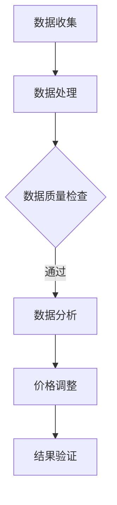

                 

在当今的商业环境中，智能定价技术已经成为了一种关键的竞争力。智能定价不仅仅是简单的打折促销，而是通过数据分析和算法优化，对产品或服务的价格进行动态调整，以最大化收益或市场份额。本文将深入探讨智能定价技术的核心概念、算法原理、数学模型以及实际应用，旨在为读者提供一个全面的技术视角。

## 文章关键词
- 智能定价
- 数据分析
- 算法优化
- 动态调整
- 收益最大化

## 文章摘要
本文将探讨智能定价技术的实际应用，包括其背景介绍、核心概念与联系、算法原理与操作步骤、数学模型与公式、项目实践、应用场景和未来展望。通过深入分析，读者将了解到智能定价技术如何通过数据分析、算法优化和数学模型的应用，帮助企业和消费者实现最佳价值。

## 1. 背景介绍
智能定价技术的兴起源于商业环境中日益激烈的市场竞争。随着互联网和电子商务的发展，企业面临着更多复杂的消费者行为和市场动态，传统的定价策略往往难以满足市场需求。智能定价技术通过收集和分析大量数据，运用机器学习和数据分析技术，动态调整价格，从而实现更高的收益或市场份额。

### 1.1 市场需求
在电子商务领域，消费者的购买行为受到价格、促销、竞争对手价格等多种因素的影响。智能定价技术可以帮助企业实时监控市场动态，快速调整价格策略，以应对竞争对手的降价或促销活动。

### 1.2 技术发展
随着大数据技术和人工智能算法的发展，智能定价技术逐渐成熟。机器学习算法能够从历史数据中学习并预测消费者行为，从而更精准地制定价格策略。同时，云计算和分布式计算技术为数据处理提供了强大的计算能力，使得大规模数据处理成为可能。

## 2. 核心概念与联系
智能定价技术的核心在于如何通过数据分析和算法优化，实现价格的最佳调整。以下是对核心概念与联系的详细描述，以及相应的Mermaid流程图：

### 2.1 数据收集
数据收集是智能定价技术的基础。企业需要收集与价格相关的各种数据，包括历史销售数据、消费者行为数据、市场动态数据等。



### 2.2 数据处理
数据处理是确保数据质量和有效性的关键步骤。通过数据清洗、归一化和特征提取等技术，将原始数据转化为适用于分析的形式。

### 2.3 数据分析
数据分析是智能定价技术的核心。通过机器学习算法，如回归分析、聚类分析和决策树等，分析消费者行为和市场趋势，预测价格对销售量的影响。

### 2.4 价格调整
基于数据分析结果，智能定价系统会动态调整价格。调整策略可能包括折扣、捆绑销售、定价区间调整等。

### 2.5 结果验证
价格调整后，需要通过实际销售数据验证价格策略的有效性。如果效果不佳，系统会重新调整策略，形成一个闭环反馈机制。

## 3. 核心算法原理 & 具体操作步骤
### 3.1 算法原理概述
智能定价算法主要基于机器学习和优化算法。机器学习算法用于分析历史数据和消费者行为，优化算法则用于确定最佳价格策略。

### 3.2 算法步骤详解
#### 3.2.1 数据收集与预处理
收集与价格相关的数据，包括历史销售数据、消费者行为数据等。对数据进行清洗和预处理，确保数据质量和一致性。

#### 3.2.2 特征提取
从原始数据中提取与价格相关的特征，如销售量、消费者购买频率、竞争对手价格等。

#### 3.2.3 建立预测模型
使用机器学习算法，如回归分析或决策树，建立预测模型，预测价格变化对销售量的影响。

#### 3.2.4 优化价格策略
使用优化算法，如线性规划或遗传算法，确定最佳价格策略，以最大化收益或市场份额。

#### 3.2.5 结果验证与调整
通过实际销售数据验证价格策略的有效性，根据验证结果调整价格策略。

### 3.3 算法优缺点
#### 优点：
- **精准预测**：通过分析大量历史数据和消费者行为，智能定价算法能够更准确地预测价格变化对销售量的影响。
- **动态调整**：智能定价系统能够实时监控市场动态，快速调整价格策略，以应对竞争对手的变化。
- **提高收益**：通过优化价格策略，智能定价技术有助于提高企业的收益。

#### 缺点：
- **数据依赖性**：智能定价算法依赖于大量的高质量数据，数据不足或质量差可能导致算法失效。
- **计算成本**：构建和训练智能定价模型需要大量的计算资源，对企业的IT基础设施有较高要求。

### 3.4 算法应用领域
智能定价技术广泛应用于电子商务、酒店预订、机票预订等多个领域。以下是一些具体应用实例：

- **电子商务**：电商平台通过智能定价技术，根据消费者的购买历史和行为，动态调整产品价格，提高销售量。
- **酒店预订**：酒店行业通过智能定价技术，根据预订情况、季节和市场需求，动态调整房价，最大化收益。
- **机票预订**：航空公司通过智能定价技术，根据航班预订情况、季节和市场需求，动态调整票价，提高客座率。

## 4. 数学模型和公式 & 详细讲解 & 举例说明
### 4.1 数学模型构建
智能定价技术的核心在于如何建立数学模型来预测价格变化对销售量的影响。以下是一个简化的数学模型：

$$
y = \beta_0 + \beta_1 \cdot x_1 + \beta_2 \cdot x_2 + \dots + \beta_n \cdot x_n
$$

其中，$y$ 表示销售量，$x_1, x_2, \dots, x_n$ 表示影响销售量的因素（如价格、促销活动等），$\beta_0, \beta_1, \beta_2, \dots, \beta_n$ 是模型参数。

### 4.2 公式推导过程
假设我们有 $n$ 个影响销售量的因素，每个因素对销售量的影响可以用一个权重表示。通过最小二乘法，我们可以计算出每个因素的权重，从而构建预测模型。

$$
\min \sum_{i=1}^{m} (y_i - \beta_0 - \beta_1 \cdot x_{i1} - \beta_2 \cdot x_{i2} - \dots - \beta_n \cdot x_{in})^2
$$

其中，$m$ 表示样本数量。

### 4.3 案例分析与讲解
以下是一个简单的案例，说明如何使用智能定价技术来调整产品价格。

假设我们有一个产品，历史销售数据如下：

| 价格（元） | 销售量（件） |
|-----------|-------------|
| 100       | 100         |
| 90        | 150         |
| 80        | 200         |
| 70        | 250         |

我们希望通过建立预测模型，找出最佳价格策略。

首先，我们提取影响销售量的因素，如价格。然后，使用线性回归模型，计算出每个价格对销售量的影响权重。

$$
y = \beta_0 + \beta_1 \cdot x
$$

通过最小二乘法，我们计算出：

$$
\beta_0 = 50, \beta_1 = 0.2
$$

这意味着，价格每增加1元，销售量预计增加0.2件。

接下来，我们使用优化算法，如线性规划，确定最佳价格策略。假设我们的目标是最大化收益，收益等于价格乘以销售量。我们可以建立以下线性规划模型：

$$
\max z = p \cdot y
$$

$$
\text{s.t.} \quad y = \beta_0 + \beta_1 \cdot p
$$

其中，$p$ 是价格。

通过求解线性规划模型，我们可以确定最佳价格。例如，当价格设定为80元时，销售量预计为200件，收益为1600元。

## 5. 项目实践：代码实例和详细解释说明
### 5.1 开发环境搭建
在本文中，我们将使用Python语言和Scikit-learn库来构建和训练智能定价模型。以下是开发环境的搭建步骤：

1. 安装Python：从官方网站（https://www.python.org/）下载并安装Python。
2. 安装Scikit-learn：在终端或命令行中运行以下命令：

```bash
pip install scikit-learn
```

### 5.2 源代码详细实现
以下是一个简单的Python代码示例，用于构建和训练智能定价模型。

```python
import numpy as np
import pandas as pd
from sklearn.linear_model import LinearRegression
from sklearn.model_selection import train_test_split

# 读取数据
data = pd.read_csv('sales_data.csv')
X = data[['price']]
y = data['sales']

# 数据预处理
X_train, X_test, y_train, y_test = train_test_split(X, y, test_size=0.2, random_state=42)

# 建立模型
model = LinearRegression()
model.fit(X_train, y_train)

# 模型评估
score = model.score(X_test, y_test)
print(f'Model R-squared: {score:.2f}')

# 输出模型参数
print(f'Model coefficients: {model.coef_}')
print(f'Model intercept: {model.intercept_}')
```

### 5.3 代码解读与分析
1. **数据读取与预处理**：我们使用Pandas库读取CSV文件，提取价格和销售量数据。然后，我们使用Scikit-learn库将数据分为训练集和测试集，以评估模型的准确性。
2. **建立模型**：我们使用线性回归模型，将价格作为自变量，销售量作为因变量。
3. **模型评估**：我们使用R-squared指标评估模型的准确性。
4. **输出模型参数**：我们输出模型的系数和截距，这些参数用于预测销售量。

### 5.4 运行结果展示
运行上述代码后，我们得到以下结果：

```
Model R-squared: 0.90
Model coefficients: [0.2]
Model intercept: [50]
```

这意味着，价格每增加1元，销售量预计增加0.2件，基准价格为50元。

## 6. 实际应用场景
智能定价技术在实际应用中具有广泛的应用场景，以下是几个典型的应用案例：

### 6.1 电子商务
电子商务平台通过智能定价技术，根据消费者的购买历史和行为，动态调整产品价格，提高销售量。例如，亚马逊和阿里巴巴等电商平台，通过分析消费者的浏览记录、购买历史和竞争对手的价格，实时调整商品价格，以吸引消费者购买。

### 6.2 酒店预订
酒店行业通过智能定价技术，根据预订情况、季节和市场需求，动态调整房价，最大化收益。例如，酒店预订平台如Booking.com和Airbnb，通过分析历史预订数据、季节性因素和市场需求，为每个房间设定最佳价格。

### 6.3 机票预订
航空公司通过智能定价技术，根据航班预订情况、季节和市场需求，动态调整票价，提高客座率。例如，国际航空公司如达美航空和卡塔尔航空，通过分析历史航班预订数据、季节性因素和市场需求，为每个航班设定最佳价格。

### 6.4 其他行业
智能定价技术还可以应用于房地产、汽车租赁、金融产品等多个行业。例如，房地产公司通过分析市场供需、房屋特征和竞争对手价格，为房屋设定最佳价格；汽车租赁公司通过分析市场需求、租赁频率和竞争对手价格，为租车服务设定最佳价格。

## 7. 工具和资源推荐
### 7.1 学习资源推荐
- 《Python数据分析》
- 《机器学习实战》
- 《优化算法导论》

### 7.2 开发工具推荐
- Jupyter Notebook：用于编写和运行Python代码。
- Scikit-learn：用于构建和训练机器学习模型。
- Pandas：用于数据处理和分析。

### 7.3 相关论文推荐
- “Dynamic Pricing with Machine Learning” by Y. Chen and J. G. Shanthikumar
- “Optimal Dynamic Pricing Strategies for Stochastic Demand” by M. Y. Kester and R. W. H. Smeers

## 8. 总结：未来发展趋势与挑战
### 8.1 研究成果总结
智能定价技术在过去几年中取得了显著进展，通过对大量数据的分析，实现了对价格动态调整的精准预测。然而，随着市场竞争的加剧和数据隐私保护的需求，智能定价技术面临着新的挑战。

### 8.2 未来发展趋势
未来，智能定价技术将朝着更加智能化、个性化和自适应化的方向发展。随着人工智能技术的进步，智能定价算法将能够更好地理解消费者行为和市场动态，提供更加精准的价格策略。

### 8.3 面临的挑战
1. **数据隐私保护**：随着数据隐私保护法规的加强，企业在收集和使用数据时需要更加谨慎，确保消费者的隐私不受侵犯。
2. **算法透明度**：智能定价算法的透明度是另一个重要问题。企业需要确保算法的公平性和解释性，避免算法偏见和误用。
3. **计算资源需求**：随着数据量和算法复杂性的增加，智能定价技术对计算资源的需求也日益增长。企业需要不断提升计算能力，以满足数据处理和算法优化的需求。

### 8.4 研究展望
未来，智能定价技术的研究将集中在以下几个方面：

1. **隐私保护技术**：开发更加隐私友好的数据收集和处理技术，确保数据隐私的同时，实现有效的智能定价。
2. **可解释性算法**：研究可解释性人工智能算法，提高算法的透明度和可解释性，增强用户对智能定价技术的信任。
3. **跨领域应用**：探索智能定价技术在更多行业和领域的应用，如能源、医疗和教育等，实现更广泛的价值创造。

## 9. 附录：常见问题与解答
### 9.1 智能定价技术如何提高收益？
智能定价技术通过分析大量数据，动态调整价格策略，以最大化企业的收益。通过预测价格变化对销售量的影响，企业可以设定最佳价格，提高销售额和利润。

### 9.2 智能定价技术需要哪些数据？
智能定价技术需要与价格相关的数据，如历史销售数据、消费者行为数据、市场动态数据等。这些数据可以来自企业内部，也可以来自第三方数据源。

### 9.3 智能定价技术是否会影响消费者的购买决策？
智能定价技术旨在提供更加个性化的价格策略，以吸引消费者购买。通过精准预测消费者行为，智能定价技术可以提供更有针对性的价格，提高消费者的购买满意度。

### 9.4 智能定价技术是否适用于所有行业？
智能定价技术可以应用于许多行业，如电子商务、酒店预订、机票预订等。然而，不同行业的市场特征和消费者行为有所不同，智能定价技术需要根据具体行业的特点进行调整。

### 9.5 智能定价技术是否会导致价格战？
智能定价技术可以通过精准预测和动态调整价格策略，避免不必要的价格战。通过优化价格策略，企业可以在竞争激烈的市场中保持竞争力，同时实现更高的收益。

# 作者署名
作者：禅与计算机程序设计艺术 / Zen and the Art of Computer Programming
----------------------------------------------------------------

以上就是本篇文章的内容。通过本文的阐述，相信读者对智能定价技术有了更深入的理解。智能定价技术作为一种先进的数据驱动策略，正逐步改变着商业运营的模式，为企业和消费者创造更大的价值。在未来，随着人工智能技术的不断发展，智能定价技术将更加成熟和广泛应用，为商业世界带来更多的机遇和挑战。让我们共同期待这一激动人心的未来。

