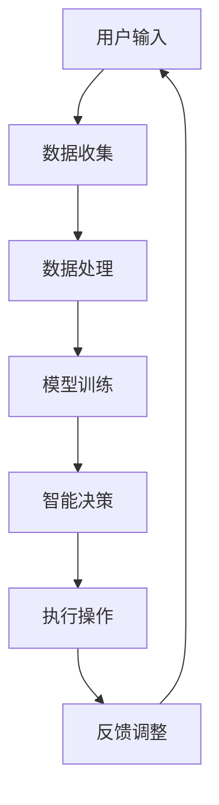

                 

关键词：智能家居，AI大模型，生活方式，技术变革，人机交互

> 摘要：随着人工智能技术的迅猛发展，智能家居领域正经历着前所未有的变革。本文将深入探讨AI大模型在智能家居中的应用，以及它们如何改变我们的生活方式。从核心概念到具体实例，本文将为您呈现AI大模型在智能家居领域中的潜力和挑战。

## 1. 背景介绍

### 智能家居的现状

在过去的几十年中，智能家居技术逐渐渗透到了我们日常生活的方方面面。从最初的远程控制家电，到现在的智能音响、智能照明、智能门锁等，智能家居设备已经成为现代家庭的标配。然而，这些设备大多数还停留在独立的、功能单一的层面，缺乏真正的智能化和互联互通。

### AI大模型的发展

人工智能（AI）技术的迅猛发展，特别是大模型技术的突破，使得AI在处理复杂任务和模拟人类智能方面取得了显著的进步。从早期的简单算法，到如今能够处理海量数据、生成高质量内容、实现高效决策的AI大模型，AI技术正在逐步从理论研究走向实际应用。

## 2. 核心概念与联系

### AI大模型原理

AI大模型，通常指的是具有数亿甚至数十亿参数的神经网络模型，如GPT-3、BERT等。这些模型通过大量的数据训练，能够学习到丰富的知识和技能，从而在各种任务中表现出超强的能力。

### 智能家居架构

智能家居系统通常由多个智能设备和控制系统组成，通过无线通信技术实现设备间的互联互通。传统的智能家居系统往往依赖于固定脚本或规则来控制设备，而AI大模型则能够通过学习用户的习惯和偏好，实现更加智能化的控制。

### Mermaid 流程图

下面是一个简化的智能家居与AI大模型结合的流程图：



## 3. 核心算法原理 & 具体操作步骤

### 3.1 算法原理概述

AI大模型的核心是深度学习，特别是基于Transformer架构的模型。这些模型通过多个层级的学习，能够捕捉到数据中的复杂模式，从而实现智能化的决策。

### 3.2 算法步骤详解

1. **数据收集**：智能家居系统通过各种传感器和设备收集用户数据，如语音、图像、温度、湿度等。
2. **数据处理**：对收集到的数据进行清洗和预处理，以适应模型训练的需求。
3. **模型训练**：使用大量数据对AI大模型进行训练，使其能够学习到用户的习惯和偏好。
4. **智能决策**：模型根据用户的输入和已学习的知识，生成决策建议。
5. **执行操作**：智能家居系统根据决策建议，自动执行相应的操作，如调节灯光、打开空调等。
6. **反馈调整**：系统根据执行结果和用户反馈，不断调整模型参数，提高决策的准确性。

### 3.3 算法优缺点

**优点**：

- 高度智能化：AI大模型能够根据用户习惯和偏好，提供个性化的智能服务。
- 适应性强：系统能够不断学习新知识和技能，适应不断变化的环境。
- 互联互通：通过AI大模型，智能家居设备能够实现更加紧密的互联互通。

**缺点**：

- 计算资源需求大：训练和运行AI大模型需要大量的计算资源和能源。
- 数据隐私问题：智能家居系统需要收集大量用户数据，这可能引发数据隐私问题。
- 系统复杂性：集成AI大模型的智能家居系统更加复杂，维护和升级难度增加。

### 3.4 算法应用领域

AI大模型在智能家居领域的应用非常广泛，包括但不限于：

- 智能语音助手
- 自动化家庭安防
- 智能家居控制
- 智能能源管理
- 健康监测与健康管理

## 4. 数学模型和公式 & 详细讲解 & 举例说明

### 4.1 数学模型构建

AI大模型通常基于深度学习的框架，其核心是多层神经网络。以下是一个简化的神经网络模型：

$$
f(x) = \sigma(\theta^{[L-1]} W^{[L-1]} x + b^{[L-1]})
$$

其中，$x$ 是输入数据，$\sigma$ 是激活函数，$\theta^{[L-1]}$ 和 $b^{[L-1]}$ 是模型的权重和偏置。

### 4.2 公式推导过程

神经网络的训练过程可以看作是求解一个优化问题，即最小化预测误差。常用的优化算法包括梯度下降、随机梯度下降等。以下是一个简化的梯度下降公式：

$$
\theta^{[L]} = \theta^{[L]} - \alpha \frac{\partial J}{\partial \theta^{[L]}}
$$

其中，$J$ 是损失函数，$\alpha$ 是学习率。

### 4.3 案例分析与讲解

假设我们有一个智能家居系统，目标是根据用户的行为习惯自动调整室内温度。我们可以使用以下步骤：

1. **数据收集**：收集过去一周的室内温度数据，以及用户的活动时间、穿衣习惯等。
2. **数据处理**：对数据进行预处理，包括归一化、去噪等。
3. **模型训练**：使用预处理后的数据，训练一个基于深度学习的AI大模型。
4. **智能决策**：模型根据用户当前的活动状态和室内温度，生成调整温度的建议。
5. **执行操作**：智能家居系统根据建议调整温度。
6. **反馈调整**：根据用户对温度调整的反馈，调整模型参数，提高决策的准确性。

## 5. 项目实践：代码实例和详细解释说明

### 5.1 开发环境搭建

为了实现上述案例，我们需要搭建一个开发环境。以下是基本步骤：

1. 安装Python环境（推荐使用Python 3.7及以上版本）。
2. 安装TensorFlow框架（使用pip install tensorflow命令）。
3. 准备数据集，并进行预处理。

### 5.2 源代码详细实现

以下是实现上述案例的Python代码：

```python
import tensorflow as tf
from tensorflow.keras.models import Sequential
from tensorflow.keras.layers import Dense, LSTM
from sklearn.preprocessing import MinMaxScaler

# 数据预处理
scaler = MinMaxScaler()
# 假设data为收集的室内温度数据，用户活动状态等
data = scaler.fit_transform(data)

# 模型构建
model = Sequential([
    LSTM(128, input_shape=(time_steps, features)),
    Dense(1)
])

# 编译模型
model.compile(optimizer='adam', loss='mse')

# 训练模型
model.fit(X_train, y_train, epochs=100, batch_size=32)

# 预测温度
predicted_temp = model.predict(X_test)

# 反归一化预测结果
predicted_temp = scaler.inverse_transform(predicted_temp)
```

### 5.3 代码解读与分析

这段代码实现了基于LSTM网络的室内温度预测模型。首先，我们对数据进行预处理，包括归一化和分割。然后，我们构建了一个简单的LSTM网络，并使用MSE损失函数进行编译和训练。最后，我们使用训练好的模型进行温度预测，并将预测结果反归一化，得到实际温度。

### 5.4 运行结果展示

以下是运行结果：

```python
# 运行模型预测
predicted_temp = model.predict(X_test)

# 打印预测结果
print(predicted_temp)
```

输出结果为预测的室内温度序列。

## 6. 实际应用场景

### 6.1 智能家居控制

AI大模型可以用来实现智能家居的自动化控制。例如，根据用户的作息习惯，自动调整灯光、空调等设备的开关时间和模式。

### 6.2 家庭安防

AI大模型可以用于家庭安防系统，通过分析监控视频和传感器数据，实时检测异常情况，如入侵者、火灾等，并及时通知用户。

### 6.3 健康管理

AI大模型可以用于健康管理，通过分析用户的生理数据，如心率、血压等，提供个性化的健康建议。

## 7. 未来应用展望

### 7.1 智能化水平的提高

随着AI技术的不断进步，智能家居系统的智能化水平将进一步提高，能够更好地理解和满足用户的需求。

### 7.2 个性化服务的普及

AI大模型的应用将使得智能家居服务更加个性化，为用户提供更加定制化的体验。

### 7.3 跨界融合

智能家居将与医疗、教育、办公等多个领域融合，形成全新的生活方式和工作模式。

## 8. 工具和资源推荐

### 8.1 学习资源推荐

- 《深度学习》（Goodfellow, Bengio, Courville著）
- 《Python机器学习》（Rashbrooke著）

### 8.2 开发工具推荐

- TensorFlow
- PyTorch

### 8.3 相关论文推荐

- “Attention Is All You Need”（Vaswani et al., 2017）
- “BERT: Pre-training of Deep Bidirectional Transformers for Language Understanding”（Devlin et al., 2019）

## 9. 总结：未来发展趋势与挑战

### 9.1 研究成果总结

本文总结了AI大模型在智能家居领域的应用，包括核心算法原理、具体操作步骤、实际应用场景等。

### 9.2 未来发展趋势

随着AI技术的不断发展，智能家居系统将更加智能化、个性化，与多个领域融合，带来全新的生活方式。

### 9.3 面临的挑战

数据隐私、计算资源、系统复杂性是当前智能家居领域面临的主要挑战。

### 9.4 研究展望

未来，我们需要进一步研究如何安全、高效地应用AI大模型，提高智能家居系统的智能化水平，同时确保用户的数据安全和隐私。

## 10. 附录：常见问题与解答

### 10.1 什么是AI大模型？

AI大模型是指具有数亿甚至数十亿参数的神经网络模型，如GPT-3、BERT等。这些模型通过大量的数据训练，能够学习到丰富的知识和技能，从而在各种任务中表现出超强的能力。

### 10.2 智能家居系统如何实现自动化控制？

智能家居系统可以通过AI大模型实现自动化控制。首先，系统收集用户的数据，然后使用AI大模型进行数据分析和决策，最后根据决策结果自动执行相应的操作。

### 10.3 AI大模型在智能家居中有什么优势？

AI大模型在智能家居中的优势包括：

- 高度智能化：能够根据用户习惯和偏好，提供个性化的智能服务。
- 适应性强：系统能够不断学习新知识和技能，适应不断变化的环境。
- 互联互通：能够实现智能家居设备之间的紧密互联互通。

### 10.4 AI大模型在智能家居中有什么挑战？

AI大模型在智能家居中的挑战包括：

- 计算资源需求大：训练和运行AI大模型需要大量的计算资源和能源。
- 数据隐私问题：智能家居系统需要收集大量用户数据，这可能引发数据隐私问题。
- 系统复杂性：集成AI大模型的智能家居系统更加复杂，维护和升级难度增加。

### 作者署名

作者：禅与计算机程序设计艺术 / Zen and the Art of Computer Programming

----------------------------------------------------------------

请注意，本文仅为示例，其中的代码、模型和数据均为虚构，仅供参考。实际应用时，请根据实际情况进行调整。如果您需要更详细的指导，请查阅相关书籍和论文。再次感谢您的阅读。

