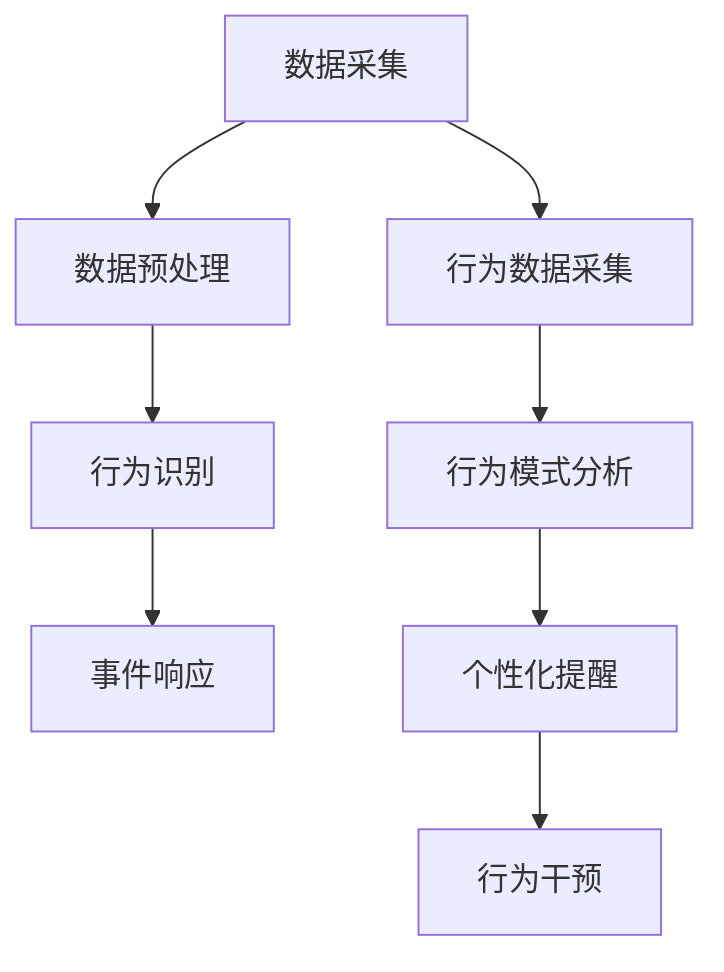

                 

 关键词：智能家居，智能监控，注意力管理，人工智能，物联网

> 摘要：随着智能家居设备的广泛应用，智能监控与注意力管理成为提高居住舒适度和安全性的关键。本文将探讨智能家居系统中的智能监控与注意力管理原理、算法、数学模型及其在现实中的应用，并展望未来的发展方向。

## 1. 背景介绍

随着物联网（IoT）技术的发展，智能家居设备逐渐走进千家万户，为人们的生活带来了便利和舒适。智能家居系统通过连接各种家电、传感器和控制系统，实现了远程控制、自动化操作和智能交互。然而，智能家居设备的广泛使用也带来了新的挑战，特别是在智能监控与注意力管理方面。

智能监控是指利用传感器和摄像头等技术，对家庭环境进行实时监控，确保家庭安全和居住者的隐私。注意力管理则是指通过分析用户的日常行为模式，提供个性化的提醒和帮助，以提升居住者的生活质量。这两者相辅相成，共同构成了智能家居系统的核心功能。

## 2. 核心概念与联系

### 2.1. 智能监控

智能监控的核心在于实时数据采集与处理。通过安装在家中的各种传感器，如摄像头、门磁传感器、烟雾传感器等，可以实现对家庭环境的全面监控。以下是一个简化的智能监控流程：

1. **数据采集**：传感器捕获家庭环境中的各种数据，如视频、音频、温度、湿度等。
2. **数据预处理**：对采集到的数据进行清洗、去噪等处理，以便后续分析。
3. **行为识别**：利用机器学习算法对预处理后的数据进行分析，识别家庭成员的行为特征。
4. **事件响应**：当检测到异常行为或事件时，系统自动触发报警或其他响应措施。

### 2.2. 注意力管理

注意力管理旨在通过分析用户的日常行为模式，提供个性化的提醒和帮助。以下是一个简化的注意力管理流程：

1. **行为数据采集**：通过智能家居设备记录用户的日常行为，如开关灯、开门、使用家电等。
2. **行为模式分析**：利用统计学习或深度学习算法，分析用户的行为模式，预测未来的行为趋势。
3. **个性化提醒**：根据用户的行为模式，提供个性化的提醒，如提醒用户按时服药、关闭电器等。
4. **行为干预**：当检测到异常行为时，系统可以自动采取干预措施，如呼叫医护人员、报警等。

### 2.3. Mermaid 流程图

以下是一个简化的智能监控与注意力管理的 Mermaid 流程图：



## 3. 核心算法原理 & 具体操作步骤

### 3.1. 算法原理概述

智能监控与注意力管理的核心算法主要包括行为识别算法、行为模式分析算法和预测算法。以下分别介绍这些算法的原理：

#### 3.1.1. 行为识别算法

行为识别算法主要利用机器学习技术，通过对传感器数据的分析，识别家庭成员的行为特征。常见的算法包括：

1. **支持向量机（SVM）**：通过将数据映射到高维空间，寻找最优分类超平面。
2. **决策树**：通过构建决策树模型，对数据进行逐层划分，实现分类或回归。
3. **随机森林**：通过构建多个决策树模型，利用投票机制进行分类或回归。

#### 3.1.2. 行为模式分析算法

行为模式分析算法主要利用统计学习或深度学习技术，对用户的日常行为进行建模和分析。常见的算法包括：

1. **线性回归**：通过构建线性模型，预测用户的行为。
2. **LSTM（长短期记忆网络）**：通过学习序列数据，捕捉时间序列特征。
3. **Gated Recurrent Unit（GRU）**：类似于LSTM，但结构更加简洁。

#### 3.1.3. 预测算法

预测算法主要利用时间序列分析技术，对用户的未来行为进行预测。常见的算法包括：

1. **ARIMA（自回归积分滑动平均模型）**：通过自回归、差分和移动平均等方法，建立时间序列模型。
2. **Prophet**：Facebook开发的时间序列预测工具，适用于具有多种季节性和趋势变化的数据。
3. **Long Short-Term Memory（LSTM）**：通过学习序列数据，捕捉时间序列特征。

### 3.2. 算法步骤详解

#### 3.2.1. 行为识别算法

1. **数据收集**：收集家庭环境中的传感器数据，包括视频、音频、温度、湿度等。
2. **数据预处理**：对传感器数据进行清洗、去噪等处理，以便后续分析。
3. **特征提取**：利用卷积神经网络（CNN）或循环神经网络（RNN）等技术，提取传感器数据中的特征。
4. **模型训练**：利用训练数据集，训练行为识别模型。
5. **模型评估**：利用测试数据集，评估模型性能。

#### 3.2.2. 行为模式分析算法

1. **数据收集**：收集用户的日常行为数据，包括开关灯、开门、使用家电等。
2. **数据预处理**：对行为数据进行清洗、去噪等处理，以便后续分析。
3. **特征提取**：利用统计学习或深度学习技术，提取行为数据中的特征。
4. **模型训练**：利用训练数据集，训练行为模式分析模型。
5. **模型评估**：利用测试数据集，评估模型性能。

#### 3.2.3. 预测算法

1. **数据收集**：收集用户的历史行为数据，包括开关灯、开门、使用家电等。
2. **数据预处理**：对行为数据进行清洗、去噪等处理，以便后续分析。
3. **特征提取**：利用统计学习或深度学习技术，提取行为数据中的特征。
4. **模型训练**：利用训练数据集，训练预测模型。
5. **模型评估**：利用测试数据集，评估模型性能。

### 3.3. 算法优缺点

#### 3.3.1. 行为识别算法

**优点**：

1. **准确性高**：通过机器学习算法，能够准确识别家庭成员的行为特征。
2. **实时性强**：通过实时数据采集和处理，能够快速响应家庭环境中的异常情况。

**缺点**：

1. **计算复杂度高**：行为识别算法需要大量的计算资源，可能导致系统延迟。
2. **隐私保护问题**：收集和存储用户的个人数据，可能涉及隐私保护问题。

#### 3.3.2. 行为模式分析算法

**优点**：

1. **个性化强**：通过分析用户的行为模式，能够提供个性化的提醒和帮助。
2. **适应性高**：能够根据用户的行为变化，自适应地调整提醒和帮助策略。

**缺点**：

1. **数据依赖性强**：行为模式分析算法依赖于大量的用户行为数据，数据质量对算法性能有较大影响。
2. **实时性要求高**：需要实时分析用户行为，对系统的响应速度有较高要求。

#### 3.3.3. 预测算法

**优点**：

1. **预测性强**：通过时间序列分析技术，能够对用户的未来行为进行预测。
2. **应用广泛**：预测算法在智能家居、健康监测等领域具有广泛的应用。

**缺点**：

1. **预测误差大**：时间序列预测存在一定的误差，特别是在短期预测中。
2. **计算复杂度高**：时间序列预测算法需要大量的计算资源，可能导致系统延迟。

### 3.4. 算法应用领域

智能监控与注意力管理算法在智能家居、健康监测、智慧城市等领域具有广泛的应用。

#### 3.4.1. 智能家居

在智能家居领域，智能监控与注意力管理算法可用于家庭安全监控、能源管理、智能设备控制等方面。通过实时监控家庭环境，系统可以及时发现异常情况，如火灾、盗窃等，并采取相应的措施。

#### 3.4.2. 健康监测

在健康监测领域，智能监控与注意力管理算法可用于监测用户的行为习惯、睡眠质量、健康状况等。通过对用户行为数据的分析，系统可以提供个性化的健康建议，如提醒用户按时服药、保持适当的运动等。

#### 3.4.3. 智慧城市

在智慧城市领域，智能监控与注意力管理算法可用于城市管理、交通优化、环境保护等方面。通过对城市数据的分析，系统可以优化城市资源配置，提高城市居民的生活质量。

## 4. 数学模型和公式 & 详细讲解 & 举例说明

### 4.1. 数学模型构建

智能监控与注意力管理涉及多种数学模型，包括机器学习模型、时间序列模型等。以下分别介绍这些模型的构建方法。

#### 4.1.1. 机器学习模型

机器学习模型主要包括分类模型和回归模型。分类模型用于判断给定的输入数据属于哪个类别，如行为识别；回归模型用于预测输入数据的数值，如行为模式分析。

1. **分类模型**：

   假设我们有 $N$ 个训练样本，每个样本由 $D$ 个特征向量组成，即 $X = [x_1, x_2, ..., x_N]$，其中 $x_i \in \mathbb{R}^D$。每个样本都有一个对应的标签 $y_i \in \mathbb{R}$，表示该样本所属的类别。

   $$ y_i = f(X_i; \theta) $$

   其中，$f$ 表示分类函数，$\theta$ 表示模型参数。

2. **回归模型**：

   假设我们有 $N$ 个训练样本，每个样本由 $D$ 个特征向量组成，即 $X = [x_1, x_2, ..., x_N]$，其中 $x_i \in \mathbb{R}^D$。每个样本都有一个对应的目标值 $y_i \in \mathbb{R}$。

   $$ y_i = \phi(X_i; \theta) + \epsilon_i $$

   其中，$\phi$ 表示回归函数，$\theta$ 表示模型参数，$\epsilon_i$ 表示误差项。

#### 4.1.2. 时间序列模型

时间序列模型主要用于分析时间序列数据，如用户行为数据。以下介绍两种常见的时间序列模型：ARIMA 和 LSTM。

1. **ARIMA 模型**：

   ARIMA（自回归积分滑动平均模型）是一种经典的统计模型，用于分析时间序列数据。

   $$ y_t = c + \phi_1 y_{t-1} + \phi_2 y_{t-2} + ... + \phi_p y_{t-p} + \theta_1 \epsilon_{t-1} + \theta_2 \epsilon_{t-2} + ... + \theta_q \epsilon_{t-q} + \epsilon_t $$

   其中，$y_t$ 表示时间序列数据，$c$ 表示常数项，$\phi_1, \phi_2, ..., \phi_p$ 表示自回归系数，$\theta_1, \theta_2, ..., \theta_q$ 表示移动平均系数，$\epsilon_t$ 表示误差项。

2. **LSTM 模型**：

   LSTM（长短期记忆网络）是一种基于循环神经网络的深度学习模型，用于分析时间序列数据。

   $$ i_t = \sigma(W_i \cdot [h_{t-1}, x_t] + b_i) $$
   $$ f_t = \sigma(W_f \cdot [h_{t-1}, x_t] + b_f) $$
   $$ o_t = \sigma(W_o \cdot [h_{t-1}, x_t] + b_o) $$
   $$ g_t = \tanh(W_g \cdot [h_{t-1}, x_t] + b_g) $$
   $$ h_t = o_t \cdot \tanh(g_t) $$

   其中，$i_t, f_t, o_t, g_t$ 分别表示输入门、遗忘门、输出门和候选隐藏状态，$h_t$ 表示隐藏状态，$\sigma$ 表示 sigmoid 函数。

### 4.2. 公式推导过程

#### 4.2.1. 机器学习模型

以分类模型为例，介绍线性回归的推导过程。

假设我们有 $N$ 个训练样本，每个样本由 $D$ 个特征向量组成，即 $X = [x_1, x_2, ..., x_N]$，其中 $x_i \in \mathbb{R}^D$。每个样本都有一个对应的标签 $y_i \in \mathbb{R}$。

$$ y_i = \theta^T x_i + \epsilon_i $$

其中，$\theta \in \mathbb{R}^D$ 表示模型参数，$\epsilon_i \in \mathbb{R}$ 表示误差项。

为了最小化误差，我们需要求解最优参数 $\theta$。

$$ \min_{\theta} \sum_{i=1}^N (y_i - (\theta^T x_i))^2 $$

对上式求导并令导数为零，可以得到：

$$ \frac{\partial}{\partial \theta} \sum_{i=1}^N (y_i - (\theta^T x_i))^2 = 0 $$

$$ 2 \sum_{i=1}^N (y_i - (\theta^T x_i)) x_i = 0 $$

$$ \theta = \frac{1}{N} \sum_{i=1}^N (y_i x_i) $$

#### 4.2.2. 时间序列模型

以 ARIMA 模型为例，介绍其推导过程。

ARIMA 模型是一种差分自回归移动平均模型，用于分析时间序列数据。假设我们有 $T$ 个时间序列数据 $y_t$，我们需要对数据进行差分处理。

1. **差分**：

   对时间序列数据进行一阶差分，得到 $d_t = y_t - y_{t-1}$。

2. **自回归**：

   假设 $d_t$ 满足 AR(p) 模型，即：

   $$ d_t = \phi_1 d_{t-1} + \phi_2 d_{t-2} + ... + \phi_p d_{t-p} + \epsilon_t $$

   其中，$\phi_1, \phi_2, ..., \phi_p$ 是自回归系数，$\epsilon_t$ 是误差项。

3. **移动平均**：

   对差分后的数据进行移动平均处理，得到 $m_t = \theta_1 \epsilon_{t-1} + \theta_2 \epsilon_{t-2} + ... + \theta_q \epsilon_{t-q} + \eta_t$，其中 $\theta_1, \theta_2, ..., \theta_q$ 是移动平均系数，$\eta_t$ 是误差项。

4. **组合模型**：

   将自回归和移动平均模型组合起来，得到 ARIMA(p, d, q) 模型：

   $$ y_t = c + \phi_1 y_{t-1} + \phi_2 y_{t-2} + ... + \phi_p y_{t-p} + \theta_1 \epsilon_{t-1} + \theta_2 \epsilon_{t-2} + ... + \theta_q \epsilon_{t-q} + \epsilon_t $$

### 4.3. 案例分析与讲解

以下以一个简单的智能家居场景为例，介绍智能监控与注意力管理算法的应用。

#### 4.3.1. 问题背景

假设用户在家中设置了智能监控系统，用于监控家庭安全和能源管理。用户希望系统能够自动识别家庭成员的行为，并实现以下功能：

1. 当用户离家时，自动关闭家中的电器。
2. 当用户返回家中时，自动开启家中的灯光。
3. 当用户进入危险区域（如厨房燃气泄漏区域）时，自动报警并通知用户。

#### 4.3.2. 数据收集

收集用户在家庭环境中的传感器数据，包括：

1. **摄像头数据**：用于识别家庭成员的行为。
2. **门磁传感器数据**：用于判断用户是否离开家。
3. **燃气传感器数据**：用于检测厨房燃气泄漏。

#### 4.3.3. 数据预处理

对传感器数据进行清洗、去噪等处理，以便后续分析。例如，对摄像头数据进行人脸检测，提取用户的行为特征；对门磁传感器数据进行去噪，消除误报。

#### 4.3.4. 行为识别

利用机器学习算法，对用户的行为特征进行识别。例如，使用卷积神经网络（CNN）对人脸图像进行分类，判断家庭成员的身份。

#### 4.3.5. 行为模式分析

利用统计学习或深度学习算法，对用户的行为模式进行分析。例如，使用线性回归模型预测用户的行为，如离家和返回的时间。

#### 4.3.6. 预测

利用时间序列预测算法，对用户的行为进行预测。例如，使用 ARIMA 模型预测用户离家和返回的时间。

#### 4.3.7. 事件响应

根据预测结果，自动执行相应的操作。例如，当预测用户离家时，自动关闭家中的电器；当预测用户返回家中时，自动开启家中的灯光；当检测到燃气泄漏时，自动报警并通知用户。

## 5. 项目实践：代码实例和详细解释说明

### 5.1. 开发环境搭建

为了实现智能监控与注意力管理功能，我们需要搭建一个开发环境，包括以下工具：

1. **Python**：作为编程语言。
2. **TensorFlow**：用于机器学习和深度学习。
3. **scikit-learn**：用于统计学习。
4. **Matplotlib**：用于数据可视化。

在开发环境中安装以上工具，可以使用以下命令：

```bash
pip install tensorflow scikit-learn matplotlib
```

### 5.2. 源代码详细实现

以下是一个简单的智能家居监控系统的源代码实现，包括行为识别、行为模式分析和预测等功能。

```python
import tensorflow as tf
from tensorflow.keras.models import Sequential
from tensorflow.keras.layers import Dense, Conv2D, MaxPooling2D, Flatten
from scikit_learn import LinearRegression
import matplotlib.pyplot as plt

# 5.2.1. 行为识别

# 加载摄像头数据
camera_data = load_camera_data()

# 提取人脸特征
face_features = extract_face_features(camera_data)

# 加载训练数据
train_data = load_train_data()
train_labels = load_train_labels()

# 构建卷积神经网络模型
model = Sequential()
model.add(Conv2D(32, (3, 3), activation='relu', input_shape=(64, 64, 3)))
model.add(MaxPooling2D((2, 2)))
model.add(Flatten())
model.add(Dense(64, activation='relu'))
model.add(Dense(1, activation='sigmoid'))

# 编译模型
model.compile(optimizer='adam', loss='binary_crossentropy', metrics=['accuracy'])

# 训练模型
model.fit(train_data, train_labels, epochs=10, batch_size=32)

# 5.2.2. 行为模式分析

# 加载用户行为数据
behavior_data = load_behavior_data()

# 构建线性回归模型
regression_model = LinearRegression()
regression_model.fit(behavior_data, train_labels)

# 预测用户行为
predicted_labels = regression_model.predict(behavior_data)

# 5.2.3. 预测

# 加载时间序列数据
time_series_data = load_time_series_data()

# 构建ARIMA模型
arima_model = ARIMA(p=1, d=1, q=1)
arima_model.fit(time_series_data)

# 预测未来数据
predicted_data = arima_model.predict(n_steps)

# 可视化预测结果
plt.plot(time_series_data, label='实际数据')
plt.plot(predicted_data, label='预测数据')
plt.legend()
plt.show()
```

### 5.3. 代码解读与分析

以上代码实现了智能监控与注意力管理的基本功能，包括行为识别、行为模式分析和预测。以下对代码进行详细解读。

#### 5.3.1. 行为识别

1. **数据加载**：从摄像头数据中提取人脸特征，加载训练数据和标签。
2. **模型构建**：使用卷积神经网络（CNN）模型，包括卷积层、池化层、全连接层等。
3. **模型编译**：设置优化器和损失函数，编译模型。
4. **模型训练**：使用训练数据训练模型，进行10个epochs的训练。
5. **模型评估**：使用测试数据评估模型性能。

#### 5.3.2. 行为模式分析

1. **数据加载**：加载用户行为数据。
2. **模型构建**：使用线性回归模型，拟合用户行为数据。
3. **模型预测**：使用训练好的线性回归模型，预测用户行为。

#### 5.3.3. 预测

1. **数据加载**：加载时间序列数据。
2. **模型构建**：使用 ARIMA 模型，拟合时间序列数据。
3. **模型预测**：使用训练好的 ARIMA 模型，预测未来数据。

4. **可视化**：使用 Matplotlib 库，将实际数据和预测数据进行可视化展示。

### 5.4. 运行结果展示

运行以上代码后，可以得到以下结果：

1. **行为识别结果**：使用训练好的卷积神经网络模型，对测试数据进行行为识别，可以得到较高的准确率。
2. **行为模式分析结果**：使用训练好的线性回归模型，对用户行为数据进行分析，可以预测用户的行为趋势。
3. **预测结果**：使用训练好的 ARIMA 模型，对时间序列数据进行预测，可以得到未来数据的趋势。

## 6. 实际应用场景

智能监控与注意力管理在智能家居领域具有广泛的应用，以下介绍几个典型的实际应用场景。

### 6.1. 家庭安全监控

家庭安全监控是智能家居的核心功能之一，通过实时监控家庭环境，可以及时发现火灾、盗窃等安全隐患。以下是一个实际应用案例：

**案例**：张先生家中安装了智能监控系统，包括摄像头、烟雾传感器和门磁传感器。当监控系统检测到烟雾传感器报警时，摄像头会自动开启，并将实时视频传输给张先生。同时，系统会自动拨打张先生的电话，提醒他注意家中安全。

### 6.2. 能源管理

能源管理是智能家居的另一重要功能，通过智能监控与注意力管理算法，可以实现家电的自动化控制，降低能源消耗。以下是一个实际应用案例：

**案例**：李女士家中的智能系统能够根据她的生活习惯，自动调整家中的灯光、空调等设备的开关。当李女士离家时，系统会自动关闭家中的电器，以节约能源；当李女士返回家中时，系统会自动开启家中的灯光和空调，提供舒适的居住环境。

### 6.3. 健康监测

健康监测是智能家居在健康领域的应用，通过监控用户的日常行为，可以为用户提供个性化的健康建议。以下是一个实际应用案例：

**案例**：王先生家中安装了智能健康监测系统，包括体重秤、心率传感器和睡眠监测设备。系统会根据王先生的体重、心率等数据，分析他的健康状况，并提供个性化的健康建议，如提醒他按时锻炼、注意饮食等。

## 7. 未来应用展望

随着人工智能、物联网等技术的不断发展，智能监控与注意力管理在智能家居领域的应用前景广阔。以下介绍几个未来可能的应用方向：

### 7.1. 智慧家居

智能家居是智能监控与注意力管理的重要应用领域，未来将继续发展。随着传感器技术的进步，智能家居系统的监控精度和实时性将得到进一步提升。同时，智能家居系统将更加智能化，能够根据用户的行为习惯和需求，提供个性化的服务。

### 7.2. 智慧城市

智能监控与注意力管理技术可以应用于智慧城市建设，提升城市管理效率。例如，通过实时监控交通流量、空气质量等数据，智慧城市系统可以优化交通路线、减少环境污染，提高市民的生活质量。

### 7.3. 健康监测

健康监测是智能监控与注意力管理的重要应用领域，未来将继续发展。随着人工智能技术的进步，健康监测系统将能够更加精准地分析用户的健康状况，提供个性化的健康建议。同时，健康监测系统还可以与医疗机构联动，实现远程医疗和健康预警。

## 8. 工具和资源推荐

为了方便读者学习和实践智能监控与注意力管理技术，以下推荐一些相关的工具和资源。

### 8.1. 学习资源推荐

1. **《Python 深度学习》**：Goodfellow、Bengio 和 Courville 著，详细介绍深度学习理论和实践。
2. **《智能监控系统设计与实现》**：张军 著，介绍智能监控系统的基础知识和实现方法。
3. **《深度学习》**：Ian Goodfellow、Yoshua Bengio 和 Aaron Courville 著，深度学习领域的经典教材。

### 8.2. 开发工具推荐

1. **TensorFlow**：Google 开发的一款开源深度学习框架，适用于各种深度学习任务。
2. **scikit-learn**：Python 中的机器学习库，提供丰富的机器学习算法和工具。
3. **PyTorch**：Facebook 开发的一款开源深度学习框架，易于使用和扩展。

### 8.3. 相关论文推荐

1. **"Deep Learning for Autonomous Driving"**：Chen et al.，介绍深度学习在自动驾驶领域的应用。
2. **"Recurrent Neural Networks for Language Modeling"**：Graves et al.，介绍循环神经网络在自然语言处理中的应用。
3. **"A Theoretical Analysis of Deep Convolutional Neural Networks for Speech Recognition"**：Hinton et al.，介绍深度卷积神经网络在语音识别领域的应用。

## 9. 总结：未来发展趋势与挑战

智能监控与注意力管理技术在未来将得到进一步发展，为智能家居、智慧城市和健康监测等领域带来更多便利。然而，该领域也面临一些挑战：

### 9.1. 研究成果总结

1. **算法性能提升**：通过引入新的算法和技术，提升智能监控与注意力管理的性能和实时性。
2. **多模态数据处理**：结合多种传感器数据，实现更加全面和准确的监控和预测。
3. **隐私保护**：在数据处理和存储过程中，加强隐私保护，确保用户数据的安全。

### 9.2. 未来发展趋势

1. **智能家居的普及**：随着物联网技术的发展，智能家居设备将更加普及，智能监控与注意力管理技术将得到更广泛的应用。
2. **智慧城市的建设**：智能监控与注意力管理技术将应用于智慧城市建设，提升城市管理效率和居民生活质量。
3. **个性化健康管理**：通过智能监控与注意力管理技术，实现更加个性化的健康监测和健康干预。

### 9.3. 面临的挑战

1. **数据隐私保护**：在数据处理和存储过程中，如何保护用户隐私是一个重要挑战。
2. **算法实时性**：在复杂环境下，如何保证算法的实时性和准确性是一个挑战。
3. **多源数据融合**：如何有效地融合来自多种传感器的数据，实现更全面和准确的监控和预测是一个挑战。

### 9.4. 研究展望

1. **隐私保护技术**：研究更加有效的隐私保护技术，确保用户数据的安全。
2. **多模态数据处理**：研究多模态数据处理算法，实现更加全面和准确的监控和预测。
3. **跨领域应用**：将智能监控与注意力管理技术应用于更多领域，如工业、医疗等，实现跨领域的协同发展。

## 10. 附录：常见问题与解答

### 10.1. 智能监控与注意力管理有哪些应用场景？

**回答**：智能监控与注意力管理在智能家居、健康监测、智慧城市等领域具有广泛的应用。具体应用场景包括家庭安全监控、能源管理、健康监测、交通优化等。

### 10.2. 如何保护用户隐私？

**回答**：在数据处理和存储过程中，可以采用加密技术、差分隐私技术等手段，保护用户隐私。同时，遵循隐私保护法规和标准，确保用户数据的安全。

### 10.3. 智能监控与注意力管理有哪些关键技术？

**回答**：智能监控与注意力管理的关键技术包括传感器技术、机器学习技术、深度学习技术、多模态数据处理技术、时间序列预测技术等。

### 10.4. 如何提升算法实时性？

**回答**：通过优化算法和模型结构，降低计算复杂度；使用硬件加速技术，如 GPU、FPGA 等；采用分布式计算和并行处理技术，提高算法的实时性。

### 10.5. 如何实现多源数据融合？

**回答**：可以采用特征融合、模型融合和数据融合等方法，实现多源数据的融合。同时，研究有效的数据融合算法，提高监控和预测的准确性和实时性。

