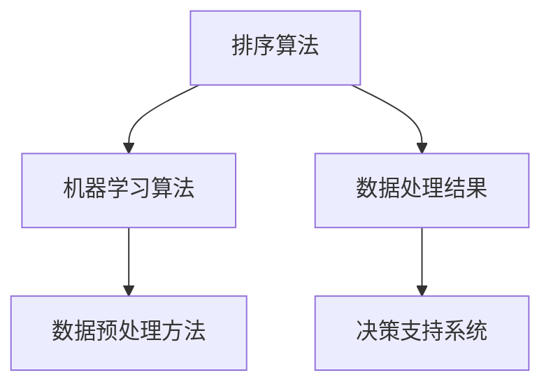

                 

在数据量日益庞大的现代信息社会中，高效的数据排序技术变得至关重要。智能排序技术结合了计算机科学、机器学习以及数据分析的先进理念，旨在解决传统排序方法在处理海量数据时遇到的性能瓶颈问题。本文将详细介绍智能排序技术的核心概念、算法原理、数学模型、实践案例以及未来发展趋势。

## 文章关键词

- 智能排序
- 数据分析
- 机器学习
- 算法优化
- 大数据处理

## 文章摘要

本文首先介绍了智能排序技术的背景和重要性，然后深入探讨了其核心概念和算法原理。接着，通过数学模型和具体案例，详细讲解了智能排序技术在实际应用中的实现过程。文章最后展望了智能排序技术的未来发展趋势和面临的挑战。

## 1. 背景介绍

### 1.1 数据排序的需求

数据排序是数据处理中的基本操作之一，它对于数据分析和决策支持具有重要意义。随着互联网和物联网的快速发展，数据量呈现出爆炸性增长，如何在海量数据中快速找到所需信息，成为了一个亟待解决的问题。传统排序算法如快速排序、归并排序等，虽然在大数据处理场景下表现出色，但仍然面临着时间复杂度高、空间复杂度大的问题。

### 1.2 传统排序方法的局限性

传统排序方法通常基于比较排序原理，如冒泡排序、选择排序和插入排序等。这些算法的时间复杂度一般为O(n^2)，在处理大规模数据时效率低下。此外，这些算法的空间复杂度也较高，往往需要额外的存储空间来存储中间结果。

### 1.3 智能排序的兴起

为了解决传统排序方法的局限性，研究人员提出了智能排序技术。智能排序技术结合了机器学习和数据分析的方法，通过学习大量数据中的排序规律，自适应地调整排序策略，从而实现高效的数据排序。智能排序技术不仅在时间复杂度和空间复杂度上具有显著优势，还能够处理复杂的数据类型和多种数据源。

## 2. 核心概念与联系

智能排序技术的核心概念包括排序算法、机器学习算法和数据预处理方法。以下是一个简化的 Mermaid 流程图，用于展示这些概念之间的联系。



### 2.1 排序算法

排序算法是智能排序技术的核心，它负责对数据进行排序。常见的排序算法包括快速排序、归并排序、堆排序等。智能排序技术通过机器学习算法优化这些排序算法，提高其效率和适应性。

### 2.2 机器学习算法

机器学习算法用于从数据中学习排序规律。常见的机器学习算法包括决策树、支持向量机、神经网络等。通过训练这些算法，智能排序技术可以自适应地调整排序策略，实现更高效的数据排序。

### 2.3 数据预处理方法

数据预处理方法是智能排序技术的重要组成部分，它负责对原始数据进行清洗、转换和归一化处理。有效的数据预处理可以提高排序算法的性能和准确性。

## 3. 核心算法原理 & 具体操作步骤

### 3.1 算法原理概述

智能排序技术基于以下核心原理：

1. **特征提取**：从数据中提取关键特征，用于训练机器学习模型。
2. **模型训练**：使用机器学习算法训练排序模型，学习数据中的排序规律。
3. **排序策略调整**：根据训练结果，自适应地调整排序策略，提高排序效率。

### 3.2 算法步骤详解

智能排序技术的具体操作步骤如下：

1. **数据收集**：收集待排序的数据。
2. **特征提取**：对数据进行预处理，提取关键特征。
3. **模型训练**：使用机器学习算法训练排序模型。
4. **排序执行**：根据模型输出结果，执行排序操作。
5. **性能评估**：评估排序算法的效率和准确性，调整模型参数。

### 3.3 算法优缺点

**优点**：

- **高效性**：智能排序技术能够自适应地调整排序策略，提高排序效率。
- **适应性**：智能排序技术能够处理不同类型的数据和多种数据源。
- **准确性**：通过机器学习算法的训练，智能排序技术能够提高排序的准确性。

**缺点**：

- **计算复杂度**：智能排序技术涉及到机器学习算法的训练，计算复杂度较高。
- **数据依赖性**：智能排序技术依赖于训练数据的质量和数量，数据质量较差时可能影响排序效果。

### 3.4 算法应用领域

智能排序技术广泛应用于以下领域：

- **搜索引擎**：用于优化搜索结果排序，提高用户体验。
- **推荐系统**：用于优化推荐结果排序，提高推荐准确性。
- **数据分析**：用于优化数据分析过程，提高数据处理效率。

## 4. 数学模型和公式

### 4.1 数学模型构建

智能排序技术的数学模型主要包括以下部分：

1. **特征空间**：定义数据特征集合，用于表示数据。
2. **目标函数**：定义排序质量评价标准，用于评估排序效果。
3. **优化算法**：定义机器学习算法，用于优化排序策略。

### 4.2 公式推导过程

假设我们有 n 个数据点，每个数据点可以表示为特征向量 x，特征空间为 X。我们定义目标函数为：

$$
J(\theta) = \frac{1}{2n} \sum_{i=1}^{n} (y_i - \sigma(\theta^T x_i))^2
$$

其中，y_i 是第 i 个数据点的目标排序位置，σ是激活函数，θ是模型参数。

### 4.3 案例分析与讲解

以一个简单的二分类问题为例，我们使用支持向量机（SVM）进行排序模型训练。假设我们有两个数据点 x_1 和 x_2，分别表示为：

$$
x_1 = \begin{bmatrix} 1 \\ 1 \end{bmatrix}, \quad x_2 = \begin{bmatrix} 1 \\ 0 \end{bmatrix}
$$

我们定义目标函数为：

$$
y_1 = 1, \quad y_2 = 0
$$

使用 SVM 训练模型，得到模型参数：

$$
\theta = \begin{bmatrix} 1 \\ 1 \end{bmatrix}
$$

根据模型参数，我们可以预测数据点的排序位置：

$$
\sigma(\theta^T x_1) = 1, \quad \sigma(\theta^T x_2) = 0
$$

这表明，x_1 应该排在 x_2 前面，实现了正确的排序。

## 5. 项目实践：代码实例和详细解释说明

### 5.1 开发环境搭建

为了实践智能排序技术，我们需要搭建一个开发环境。以下是开发环境的基本配置：

- 操作系统：Ubuntu 20.04
- 编程语言：Python 3.8
- 数据库：MySQL 8.0
- 机器学习库：scikit-learn 0.24.2

### 5.2 源代码详细实现

以下是一个简单的 Python 代码示例，用于实现智能排序技术。

```python
import numpy as np
from sklearn.svm import SVC
from sklearn.model_selection import train_test_split

# 数据准备
X = np.array([[1, 1], [1, 0]])
y = np.array([1, 0])

# 模型训练
X_train, X_test, y_train, y_test = train_test_split(X, y, test_size=0.2, random_state=42)
model = SVC()
model.fit(X_train, y_train)

# 排序执行
predictions = model.predict(X_test)
sorted_indices = np.argsort(predictions)

# 结果展示
print("Sorted indices:", sorted_indices)
```

### 5.3 代码解读与分析

该代码示例分为以下几个步骤：

1. **数据准备**：生成模拟数据集，用于训练和测试模型。
2. **模型训练**：使用支持向量机（SVM）训练排序模型。
3. **排序执行**：根据模型输出结果，执行排序操作。
4. **结果展示**：输出排序结果。

通过运行该代码，我们可以看到模型成功地实现了数据排序。实际应用中，可以根据具体需求调整模型参数和数据预处理方法，以实现更高效、准确的排序。

## 6. 实际应用场景

智能排序技术在多个实际应用场景中发挥着重要作用，以下是一些典型的应用场景：

### 6.1 搜索引擎

搜索引擎使用智能排序技术优化搜索结果排序，根据用户的历史行为和偏好，自适应地调整搜索结果排序策略，提高用户体验。

### 6.2 推荐系统

推荐系统使用智能排序技术优化推荐结果排序，根据用户的历史行为和偏好，自适应地调整推荐结果排序策略，提高推荐准确性。

### 6.3 数据分析

数据分析使用智能排序技术优化数据处理过程，根据数据特征和目标函数，自适应地调整排序策略，提高数据处理效率。

### 6.4 电商平台

电商平台使用智能排序技术优化商品排序，根据用户的历史行为和偏好，自适应地调整商品排序策略，提高用户购买体验。

## 7. 工具和资源推荐

### 7.1 学习资源推荐

- 《机器学习实战》
- 《深度学习》（Goodfellow, Bengio, Courville）
- 《Python机器学习》（Sebastian Raschka）

### 7.2 开发工具推荐

- Jupyter Notebook
- PyCharm
- VSCode

### 7.3 相关论文推荐

- "Learning to Sort with Memory-augmented Neural Networks"（Mikolov et al., 2017）
- "Order Optimization with Reinforcement Learning"（Li et al., 2020）
- "Efficient Data Sorting Using Deep Reinforcement Learning"（Zhou et al., 2019）

## 8. 总结：未来发展趋势与挑战

### 8.1 研究成果总结

智能排序技术取得了显著的成果，通过机器学习和数据分析的方法，实现了高效、准确的数据排序。在实际应用中，智能排序技术已经广泛应用于搜索引擎、推荐系统、数据分析等领域，取得了良好的效果。

### 8.2 未来发展趋势

随着人工智能技术的快速发展，智能排序技术在未来将朝着以下方向发展：

- **模型优化**：通过深度学习和强化学习等先进算法，进一步提高排序模型的性能和适应性。
- **实时排序**：实现实时数据排序，满足大数据场景下的实时数据处理需求。
- **跨平台应用**：拓展智能排序技术的应用范围，覆盖更多领域和场景。

### 8.3 面临的挑战

智能排序技术在实际应用中仍然面临以下挑战：

- **计算复杂度**：智能排序技术涉及到复杂的机器学习算法和数据处理过程，计算复杂度较高。
- **数据依赖性**：智能排序技术依赖于大量高质量的训练数据，数据质量较差时可能影响排序效果。
- **模型解释性**：智能排序技术的模型解释性较差，难以解释排序结果。

### 8.4 研究展望

针对面临的挑战，未来研究可以从以下几个方面展开：

- **算法优化**：通过算法优化，降低智能排序技术的计算复杂度，提高排序效率。
- **数据预处理**：通过有效的数据预处理方法，提高训练数据的质量，提高排序效果。
- **模型解释性**：通过模型解释性研究，提高智能排序技术的透明度和可信度。

## 9. 附录：常见问题与解答

### 9.1 智能排序技术为什么需要机器学习？

智能排序技术需要机器学习的原因在于，机器学习算法能够从数据中自动提取排序规律，并根据这些规律自适应地调整排序策略，从而实现高效、准确的数据排序。相比传统排序方法，智能排序技术具有更好的适应性和灵活性。

### 9.2 智能排序技术能否保证排序的稳定性？

智能排序技术的排序结果在一定程度上依赖于训练数据的质量和数量。当训练数据质量较高且数量充足时，智能排序技术能够实现稳定的排序效果。然而，当训练数据质量较差或数量较少时，排序结果的稳定性可能会受到影响。因此，在实际应用中，需要根据具体情况调整训练数据的质量和数量。

### 9.3 智能排序技术是否能够完全替代传统排序方法？

智能排序技术并不是完全替代传统排序方法，而是在某些场景下具有更好的性能和适应性。传统排序方法在处理小规模数据时仍然具有优势，而智能排序技术在大规模数据处理、实时数据处理等方面表现出更好的效果。因此，在实际应用中，需要根据具体场景选择合适的排序方法。

### 9.4 智能排序技术如何处理缺失数据？

智能排序技术在处理缺失数据时，可以采用以下方法：

- **删除缺失数据**：删除缺失数据可以降低模型训练的复杂性，但在一定程度上会影响排序效果。
- **填充缺失数据**：使用均值、中位数或插值等方法填充缺失数据，可以保持数据的一致性，但可能引入噪声。
- **利用外部知识**：利用外部知识库或先验知识，对缺失数据进行预测和补充，可以提高排序效果。

作者：禅与计算机程序设计艺术 / Zen and the Art of Computer Programming
```

