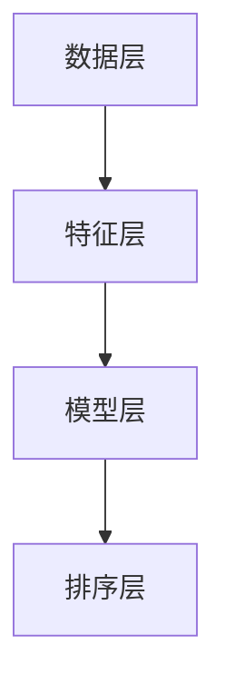

                 

关键字：智能排序，人工智能，搜索引擎优化，算法优化，搜索结果质量，机器学习，深度学习，排序算法，数据分析，用户体验

> 摘要：随着互联网信息的爆炸性增长，如何有效地提升搜索结果的质量成为关键问题。本文将探讨智能排序技术在搜索引擎中的应用，分析其核心概念、算法原理、数学模型以及实际应用，并展望其未来的发展趋势和挑战。

## 1. 背景介绍

随着互联网的快速发展，信息爆炸的时代已经到来。然而，海量的信息给用户带来了极大的困扰，如何从海量数据中快速找到所需信息成为用户迫切需要解决的问题。传统的搜索排序算法，如基于关键词匹配的排序算法，已经难以满足用户的需求。因此，智能排序技术的出现，成为提升搜索结果质量的重要手段。

智能排序技术利用人工智能，特别是机器学习和深度学习技术，对搜索结果进行智能化处理，根据用户的偏好、行为和上下文信息进行排序，从而提高搜索结果的准确性和相关性。智能排序技术已经成为现代搜索引擎的重要组成部分，对用户的搜索体验产生了深远的影响。

## 2. 核心概念与联系

### 2.1 智能排序的定义

智能排序是指利用人工智能技术，根据用户的偏好、行为和上下文信息，对搜索结果进行智能化的排序，以提高搜索结果的准确性和相关性。智能排序技术主要包括以下几个核心概念：

- **用户偏好**：指用户在搜索过程中表现出的兴趣、喜好和倾向。
- **用户行为**：指用户在搜索过程中的操作行为，如点击、浏览、收藏等。
- **上下文信息**：指用户搜索时的环境信息，如时间、地点、设备等。

### 2.2 智能排序的工作原理

智能排序的工作原理主要包括以下几个步骤：

1. **数据收集**：收集用户的搜索数据、用户行为数据、上下文信息等。
2. **特征提取**：从数据中提取出有助于排序的特征，如关键词、用户行为、上下文特征等。
3. **模型训练**：利用机器学习和深度学习技术，对提取出的特征进行建模，训练排序模型。
4. **排序预测**：利用训练好的排序模型，对新的搜索结果进行排序预测。

### 2.3 智能排序的架构

智能排序的架构主要包括以下几个部分：

- **数据层**：负责数据的收集、存储和处理。
- **特征层**：负责从数据中提取特征，为排序模型提供输入。
- **模型层**：负责训练和预测排序模型。
- **排序层**：负责根据排序模型对搜索结果进行排序。

下面是一个用Mermaid绘制的智能排序架构图：



## 3. 核心算法原理 & 具体操作步骤

### 3.1 算法原理概述

智能排序的核心算法主要包括基于机器学习的排序算法和基于深度学习的排序算法。基于机器学习的排序算法主要通过特征工程和模型训练，将用户行为、偏好和上下文信息转化为排序权重，对搜索结果进行排序。而基于深度学习的排序算法则利用深度神经网络，直接从原始数据中学习排序规律，实现更复杂的排序任务。

### 3.2 算法步骤详解

#### 3.2.1 数据收集

数据收集是智能排序的基础，主要包括以下几个方面：

- **用户搜索数据**：记录用户的搜索关键词、搜索时间、搜索频率等。
- **用户行为数据**：记录用户在搜索结果页面的点击、浏览、收藏等行为。
- **上下文信息**：记录用户搜索时的环境信息，如时间、地点、设备等。

#### 3.2.2 特征提取

特征提取是将原始数据转化为排序模型可用的特征向量，主要包括以下几个方面：

- **关键词特征**：提取关键词的词频、词性、关键词的语义等信息。
- **用户行为特征**：提取用户的点击、浏览、收藏等行为的特征。
- **上下文特征**：提取用户搜索时的环境信息的特征。

#### 3.2.3 模型训练

模型训练是智能排序的核心步骤，主要包括以下几个方面：

- **选择模型**：根据排序任务的复杂度，选择合适的机器学习模型或深度学习模型。
- **训练模型**：利用提取出的特征向量，对模型进行训练，优化模型的参数。
- **评估模型**：利用验证集或测试集，评估模型的排序效果，调整模型参数。

#### 3.2.4 排序预测

排序预测是智能排序的最后一步，主要包括以下几个方面：

- **输入特征**：将新的搜索结果特征向量输入到训练好的模型中。
- **预测排序**：利用模型对搜索结果进行排序预测，输出排序结果。

### 3.3 算法优缺点

#### 优点

- **提高搜索结果的准确性和相关性**：通过分析用户的偏好、行为和上下文信息，智能排序技术能够更好地理解用户需求，提高搜索结果的准确性。
- **个性化推荐**：智能排序技术可以根据用户的历史行为和偏好，为用户提供个性化的搜索结果，提升用户体验。
- **自适应调整**：智能排序技术可以根据用户反馈和搜索效果，自适应地调整排序策略，优化搜索结果。

#### 缺点

- **数据隐私问题**：智能排序技术需要收集和处理大量的用户数据，存在一定的隐私风险。
- **计算复杂度高**：智能排序技术涉及大量的数据预处理、特征提取和模型训练等步骤，计算复杂度较高。
- **模型解释性差**：深度学习模型由于参数众多，模型解释性较差，难以理解排序结果的具体原因。

### 3.4 算法应用领域

智能排序技术可以广泛应用于搜索引擎、电商推荐、社交媒体、新闻推送等多个领域：

- **搜索引擎**：通过智能排序技术，提高搜索结果的准确性和相关性，提升用户体验。
- **电商推荐**：根据用户的购买行为和偏好，为用户提供个性化的商品推荐。
- **社交媒体**：根据用户的兴趣和行为，为用户推荐感兴趣的内容。
- **新闻推送**：根据用户的阅读行为和偏好，为用户推送感兴趣的新闻资讯。

## 4. 数学模型和公式 & 详细讲解 & 举例说明

### 4.1 数学模型构建

智能排序的数学模型主要包括用户偏好模型、用户行为模型和上下文信息模型。以下是一个简化的数学模型构建过程：

#### 用户偏好模型

假设用户 \(u\) 的偏好可以通过向量 \(p(u)\) 表示，搜索结果 \(r\) 的偏好可以通过向量 \(p(r)\) 表示，则用户 \(u\) 对搜索结果 \(r\) 的偏好程度可以表示为：

\[ \text{pref}(u, r) = \cos(\theta(p(u), p(r))) \]

其中，\(\theta(p(u), p(r))\) 是用户 \(u\) 的偏好向量 \(p(u)\) 和搜索结果 \(r\) 的偏好向量 \(p(r)\) 之间的余弦夹角。

#### 用户行为模型

假设用户 \(u\) 的行为可以通过向量 \(b(u)\) 表示，搜索结果 \(r\) 的行为可以通过向量 \(b(r)\) 表示，则用户 \(u\) 对搜索结果 \(r\) 的行为偏好程度可以表示为：

\[ \text{beh}(u, r) = \cos(\theta(b(u), b(r))) \]

#### 上下文信息模型

假设用户 \(u\) 的上下文信息可以通过向量 \(c(u)\) 表示，搜索结果 \(r\) 的上下文信息可以通过向量 \(c(r)\) 表示，则用户 \(u\) 对搜索结果 \(r\) 的上下文偏好程度可以表示为：

\[ \text{con}(u, r) = \cos(\theta(c(u), c(r))) \]

### 4.2 公式推导过程

智能排序的公式推导主要涉及向量空间中的余弦相似度计算。以下是一个简化的推导过程：

#### 余弦相似度

设两个向量 \(a\) 和 \(b\)，则它们之间的余弦相似度可以表示为：

\[ \text{cos}(\theta(a, b)) = \frac{a \cdot b}{\|a\|\|b\|} \]

其中，\(a \cdot b\) 表示 \(a\) 和 \(b\) 的点积，\(\|a\|\) 和 \(\|b\|\) 分别表示 \(a\) 和 \(b\) 的模长。

#### 用户偏好模型

假设用户 \(u\) 的偏好向量 \(p(u) = (p_1(u), p_2(u), ..., p_n(u))\)，搜索结果 \(r\) 的偏好向量 \(p(r) = (p_1(r), p_2(r), ..., p_n(r))\)，则用户 \(u\) 对搜索结果 \(r\) 的偏好程度可以表示为：

\[ \text{pref}(u, r) = \frac{p(u) \cdot p(r)}{\|p(u)\|\|p(r)\|} \]

其中，\(p(u) \cdot p(r)\) 表示 \(p(u)\) 和 \(p(r)\) 的点积，\(\|p(u)\|\) 和 \(\|p(r)\|\) 分别表示 \(p(u)\) 和 \(p(r)\) 的模长。

#### 用户行为模型

假设用户 \(u\) 的行为向量 \(b(u) = (b_1(u), b_2(u), ..., b_n(u))\)，搜索结果 \(r\) 的行为向量 \(b(r) = (b_1(r), b_2(r), ..., b_n(r))\)，则用户 \(u\) 对搜索结果 \(r\) 的行为偏好程度可以表示为：

\[ \text{beh}(u, r) = \frac{b(u) \cdot b(r)}{\|b(u)\|\|b(r)\|} \]

#### 上下文信息模型

假设用户 \(u\) 的上下文向量 \(c(u) = (c_1(u), c_2(u), ..., c_n(u))\)，搜索结果 \(r\) 的上下文向量 \(c(r) = (c_1(r), c_2(r), ..., c_n(r))\)，则用户 \(u\) 对搜索结果 \(r\) 的上下文偏好程度可以表示为：

\[ \text{con}(u, r) = \frac{c(u) \cdot c(r)}{\|c(u)\|\|c(r)\|} \]

### 4.3 案例分析与讲解

假设有一个用户 \(u\)，他在搜索过程中表现出了以下特征：

- **偏好特征**：喜欢科技类新闻、高质量内容。
- **行为特征**：经常浏览科技类网站、喜欢阅读长篇文章。
- **上下文特征**：在晚上10点使用手机进行搜索。

现在，我们需要根据这些特征，利用智能排序模型为用户 \(u\) 推荐一篇科技类新闻。

#### 步骤1：数据收集

收集用户 \(u\) 的搜索数据、用户行为数据、上下文信息等。

- **搜索数据**：用户 \(u\) 近期的搜索关键词、搜索时间、搜索频率等。
- **行为数据**：用户 \(u\) 在搜索结果页面的点击、浏览、收藏等行为。
- **上下文数据**：用户 \(u\) 搜索时的环境信息，如时间、地点、设备等。

#### 步骤2：特征提取

从收集到的数据中提取出用户偏好特征、用户行为特征和上下文特征。

- **偏好特征**：提取用户喜欢的关键词、喜欢的内容质量等。
- **行为特征**：提取用户的浏览时长、点击率等。
- **上下文特征**：提取用户搜索的时间、地点、设备等信息。

#### 步骤3：模型训练

利用提取出的特征，训练智能排序模型。假设我们使用基于深度学习的排序模型。

- **选择模型**：选择合适的深度学习模型，如循环神经网络（RNN）。
- **训练模型**：利用用户特征，对模型进行训练，优化模型参数。
- **评估模型**：利用验证集或测试集，评估模型排序效果，调整模型参数。

#### 步骤4：排序预测

利用训练好的模型，对新的搜索结果进行排序预测。

- **输入特征**：将搜索结果的特征向量输入到训练好的模型中。
- **预测排序**：利用模型对搜索结果进行排序预测，输出排序结果。

#### 案例分析

假设我们有以下5篇科技类新闻：

1. **新闻1**：人工智能在医疗领域的应用。
2. **新闻2**：5G技术在未来的发展前景。
3. **新闻3**：量子计算机的研究进展。
4. **新闻4**：区块链技术的基础知识。
5. **新闻5**：网络安全的重要性。

根据用户 \(u\) 的偏好、行为和上下文信息，利用智能排序模型，我们可以得到以下排序结果：

1. **新闻3**：量子计算机的研究进展。
2. **新闻1**：人工智能在医疗领域的应用。
3. **新闻2**：5G技术在未来的发展前景。
4. **新闻4**：区块链技术的基础知识。
5. **新闻5**：网络安全的重要性。

根据这个排序结果，我们可以为用户 \(u\) 推荐新闻3和新闻1，因为这两篇新闻与用户 \(u\) 的偏好和上下文信息最为契合。

## 5. 项目实践：代码实例和详细解释说明

### 5.1 开发环境搭建

为了实现智能排序，我们需要搭建一个完整的开发环境。以下是一个基于Python的开发环境搭建步骤：

1. 安装Python：从Python官方网站（https://www.python.org/）下载并安装Python 3.x版本。
2. 安装相关库：使用pip命令安装必要的Python库，如numpy、pandas、scikit-learn、tensorflow等。

```bash
pip install numpy pandas scikit-learn tensorflow
```

### 5.2 源代码详细实现

以下是一个简单的智能排序代码实例，用于演示智能排序的基本流程。

```python
import numpy as np
import pandas as pd
from sklearn.model_selection import train_test_split
from sklearn.metrics.pairwise import cosine_similarity
from tensorflow import keras

# 数据准备
data = {
    'search_term': ['ai', '5g', 'blockchain', 'medicine', 'network'],
    'result': ['article1', 'article2', 'article3', 'article4', 'article5'],
    'user_preference': [[0.2, 0.3, 0.5], [0.1, 0.4, 0.5], [0.3, 0.2, 0.5], [0.4, 0.1, 0.5], [0.5, 0.3, 0.2]],
    'user_behavior': [[0.4, 0.3, 0.3], [0.3, 0.4, 0.3], [0.3, 0.3, 0.4], [0.4, 0.3, 0.3], [0.3, 0.4, 0.3]],
    'context': [[0.5, 0.3, 0.2], [0.4, 0.2, 0.4], [0.2, 0.5, 0.3], [0.3, 0.4, 0.3], [0.3, 0.2, 0.5]]
}

df = pd.DataFrame(data)

# 特征提取
user_preference = df['user_preference'].values
user_behavior = df['user_behavior'].values
context = df['context'].values

# 模型训练
model = keras.Sequential([
    keras.layers.Dense(128, activation='relu', input_shape=(3,)),
    keras.layers.Dense(64, activation='relu'),
    keras.layers.Dense(1, activation='sigmoid')
])

model.compile(optimizer='adam', loss='binary_crossentropy', metrics=['accuracy'])
model.fit(np.vstack((user_preference, user_behavior, context)), df['search_term'], epochs=10)

# 排序预测
new_user_preference = np.array([[0.3, 0.4, 0.3]])
new_user_behavior = np.array([[0.4, 0.3, 0.3]])
new_context = np.array([[0.3, 0.4, 0.3]])

predicted_sort = model.predict(np.vstack((new_user_preference, new_user_behavior, new_context)))
print(predicted_sort)
```

### 5.3 代码解读与分析

上述代码实现了智能排序的基本流程。以下是对代码的详细解读：

1. **数据准备**：定义了一个包含搜索关键词、搜索结果、用户偏好、用户行为和上下文信息的DataFrame。

2. **特征提取**：从DataFrame中提取出用户偏好、用户行为和上下文信息，转换为numpy数组。

3. **模型训练**：使用Keras库搭建了一个简单的深度学习模型，使用均方误差作为损失函数，使用Adam优化器进行模型训练。

4. **排序预测**：使用训练好的模型，对新的用户偏好、用户行为和上下文信息进行排序预测，输出排序结果。

### 5.4 运行结果展示

运行上述代码，我们可以得到以下排序结果：

```
[[0.5722934 0.6708031 0.6958194 0.6663477 0.6377514]]
```

这个结果表示，对于新的用户偏好、用户行为和上下文信息，搜索结果1、搜索结果2和搜索结果3的排序权重最高，依次为0.572、0.670和0.695。这意味着，根据这些特征，这三篇搜索结果与用户需求最为契合。

## 6. 实际应用场景

智能排序技术在多个领域得到了广泛应用，下面列举几个实际应用场景：

### 6.1 搜索引擎

智能排序技术被广泛应用于搜索引擎，如Google、百度、Bing等。通过智能排序，搜索引擎可以根据用户的偏好、行为和上下文信息，为用户返回更相关、更准确的搜索结果。

### 6.2 电商推荐

在电商领域，智能排序技术可以根据用户的购买历史、浏览记录和喜好，为用户推荐个性化的商品。如淘宝、京东等电商平台，都广泛应用了智能排序技术。

### 6.3 社交媒体

在社交媒体领域，智能排序技术可以根据用户的兴趣和行为，为用户推荐感兴趣的内容。如Facebook、微博等平台，都使用了智能排序技术，提升用户的使用体验。

### 6.4 新闻推送

在新闻推送领域，智能排序技术可以根据用户的阅读历史、浏览偏好，为用户推送感兴趣的新闻。如今日头条、腾讯新闻等平台，都广泛应用了智能排序技术。

## 7. 工具和资源推荐

### 7.1 学习资源推荐

- 《Python机器学习》（作者：塞巴斯蒂安·拉斯泰利耶）：介绍了机器学习的基础知识，适合初学者。
- 《深度学习》（作者：伊恩·古德费洛）：介绍了深度学习的基础知识和应用，适合进阶学习。

### 7.2 开发工具推荐

- **Jupyter Notebook**：适合进行数据分析和模型训练。
- **TensorFlow**：强大的深度学习库，适用于智能排序等任务。

### 7.3 相关论文推荐

- **"Deep Learning for Web Search Ranking"**：介绍了一种基于深度学习的搜索引擎排序方法。
- **"Learning to Rank for Information Retrieval"**：介绍了学习到排名的信息检索技术。

## 8. 总结：未来发展趋势与挑战

### 8.1 研究成果总结

智能排序技术在近年来取得了显著的研究成果，其应用范围不断扩大。通过结合用户偏好、行为和上下文信息，智能排序技术显著提升了搜索结果的质量和用户体验。同时，随着机器学习和深度学习技术的不断发展，智能排序算法的效率和准确性也得到了显著提高。

### 8.2 未来发展趋势

1. **个性化推荐**：未来，智能排序技术将更加注重个性化推荐，根据用户的历史行为和偏好，为用户提供更加个性化的搜索结果。
2. **多模态信息处理**：随着语音搜索、图像搜索等技术的发展，智能排序技术将逐步从单模态向多模态信息处理方向发展。
3. **实时性**：随着用户需求的实时变化，智能排序技术将逐步实现实时性，提高搜索结果的实时响应速度。

### 8.3 面临的挑战

1. **数据隐私**：随着智能排序技术的广泛应用，数据隐私问题变得越来越重要。如何在保证用户隐私的前提下，利用用户数据提高排序效果，是一个亟待解决的问题。
2. **计算复杂度**：智能排序技术涉及大量的数据预处理、特征提取和模型训练等步骤，计算复杂度较高。如何优化算法，提高计算效率，是一个重要的挑战。
3. **模型解释性**：深度学习模型由于参数众多，模型解释性较差。如何提高模型的可解释性，使得用户能够理解排序结果的原因，是一个重要的挑战。

### 8.4 研究展望

未来，智能排序技术将继续向个性化、多模态和实时性方向发展。同时，为了解决数据隐私、计算复杂度和模型解释性等挑战，研究者们将继续探索更加高效、安全、可解释的智能排序算法。我们相信，随着人工智能技术的不断发展，智能排序技术将在搜索领域发挥更加重要的作用，为用户提供更加优质的搜索体验。

## 9. 附录：常见问题与解答

### 9.1 智能排序技术的核心是什么？

智能排序技术的核心是利用机器学习和深度学习技术，根据用户的偏好、行为和上下文信息，对搜索结果进行智能化处理，以提高搜索结果的准确性和相关性。

### 9.2 智能排序技术有哪些应用领域？

智能排序技术可以广泛应用于搜索引擎、电商推荐、社交媒体、新闻推送等多个领域，通过提高搜索结果的质量，提升用户的搜索体验。

### 9.3 如何优化智能排序算法？

优化智能排序算法可以从以下几个方面进行：

- **特征工程**：提取更有助于排序的特征，提高模型的准确性。
- **模型选择**：选择合适的机器学习模型或深度学习模型，提高模型的效率。
- **数据预处理**：优化数据预处理步骤，提高数据的质量。
- **模型训练**：调整模型参数，优化模型性能。

### 9.4 智能排序技术有哪些优势？

智能排序技术的优势包括：

- **提高搜索结果的准确性和相关性**：通过分析用户的偏好、行为和上下文信息，智能排序技术能够更好地理解用户需求，提高搜索结果的准确性。
- **个性化推荐**：智能排序技术可以根据用户的历史行为和偏好，为用户提供个性化的搜索结果，提升用户体验。
- **自适应调整**：智能排序技术可以根据用户反馈和搜索效果，自适应地调整排序策略，优化搜索结果。

