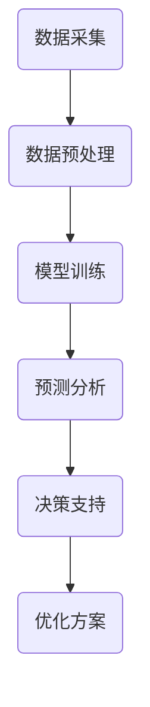

                 

关键词：智能水资源管理、AI大模型、商业化探索、数据驱动、水资源优化、可持续发展

## 摘要

水资源管理是全球性的重要议题，对人类生活和经济发展至关重要。随着人工智能技术的飞速发展，AI大模型在水资源管理中的应用呈现出前所未有的潜力。本文旨在探讨AI大模型在智能水资源管理领域的商业化路径，分析其技术原理、应用实例和未来发展趋势。通过深入解析AI大模型在数据采集、预测、决策支持等方面的作用，本文提出了水资源管理商业化的可行性方案，为相关领域的决策者和从业者提供了有益的参考。

## 1. 背景介绍

### 1.1 水资源管理的重要性

水资源是人类社会生存和发展的基础，它关乎到全球数十亿人的日常生活和经济的稳定增长。然而，随着人口增长、工业化和气候变化等因素的影响，水资源短缺和污染问题日益严重。据统计，全球约28%的人口面临水资源短缺问题，而水资源污染问题也日益严重，直接威胁到人们的健康和生态系统的平衡。

### 1.2 传统水资源管理面临的挑战

传统的水资源管理方法主要依赖于经验判断和统计分析，存在以下几方面的问题：

- 数据采集不全面：传统的监测设备和技术无法覆盖所有水源，导致数据缺失和误差。
- 预测准确性低：基于历史数据的预测模型在面临气候变化和极端天气时，预测准确性较低。
- 决策支持不足：缺乏实时数据和科学决策工具，导致决策滞后和效率低下。

### 1.3 人工智能与水资源管理的结合

随着人工智能技术的迅猛发展，AI大模型在水资源管理中的应用逐渐成为解决上述问题的重要途径。AI大模型可以通过深度学习、数据挖掘和预测算法等技术，实现数据的高效处理和智能分析，为水资源管理提供强有力的技术支持。

## 2. 核心概念与联系

### 2.1 水资源管理的核心概念

- **水资源**：地球上的水，包括地表水、地下水、冰和雪等。
- **水资源管理**：通过各种手段，包括立法、经济、技术等，对水资源进行合理开发、利用、保护和管理。
- **水资源优化**：通过优化水资源分配和使用，提高水资源利用效率，实现可持续发展。

### 2.2 AI大模型的基本原理

- **深度学习**：一种基于人工神经网络的机器学习方法，通过多层网络结构对数据进行特征提取和模式识别。
- **大数据分析**：利用海量数据，通过统计分析、机器学习和数据挖掘等方法，提取有价值的信息。
- **预测模型**：通过历史数据训练模型，预测未来的趋势和变化。

### 2.3 水资源管理与AI大模型的关系

AI大模型与水资源管理之间存在着密切的联系，具体体现在以下几个方面：

- **数据采集**：AI大模型可以通过传感器网络、遥感技术和在线监测系统，实现对水资源的实时监控和数据采集。
- **预测分析**：AI大模型可以利用历史数据和实时数据，对水资源的供需趋势、污染情况等进行预测分析，为决策提供支持。
- **决策支持**：AI大模型可以生成优化方案，帮助决策者进行水资源分配、污染控制和生态修复等决策。

### 2.4 Mermaid 流程图



## 3. 核心算法原理 & 具体操作步骤

### 3.1 算法原理概述

AI大模型在水资源管理中的核心算法主要包括数据预处理、模型训练、预测分析和决策支持等步骤。以下是这些步骤的简要概述：

- **数据预处理**：通过数据清洗、归一化和特征提取等技术，将原始数据转换为适合模型训练的格式。
- **模型训练**：利用深度学习和机器学习算法，对预处理后的数据集进行训练，构建预测模型。
- **预测分析**：将训练好的模型应用于实时数据，对水资源的供需趋势、污染情况等进行预测分析。
- **决策支持**：根据预测结果，生成优化方案，辅助决策者进行水资源管理和决策。

### 3.2 算法步骤详解

#### 3.2.1 数据预处理

数据预处理是模型训练的重要步骤，主要包括以下环节：

- **数据清洗**：去除重复数据、异常值和噪声数据，保证数据质量。
- **数据归一化**：将不同量纲的数据进行归一化处理，使其在同一个量级内。
- **特征提取**：从原始数据中提取具有代表性的特征，用于模型训练。

#### 3.2.2 模型训练

模型训练是AI大模型的核心步骤，主要包括以下环节：

- **选择合适的算法**：根据水资源管理的具体需求，选择合适的深度学习或机器学习算法。
- **数据集划分**：将数据集划分为训练集、验证集和测试集，用于模型的训练、验证和测试。
- **模型训练**：利用训练集数据，通过反向传播算法优化模型参数。
- **模型验证**：利用验证集数据，评估模型的预测性能。

#### 3.2.3 预测分析

预测分析是AI大模型在水资源管理中的关键步骤，主要包括以下环节：

- **实时数据采集**：通过传感器网络和在线监测系统，实时采集水资源相关的数据。
- **模型应用**：将实时数据输入训练好的模型，进行预测分析。
- **结果评估**：对预测结果进行评估，包括预测精度、响应速度等。

#### 3.2.4 决策支持

决策支持是AI大模型在水资源管理中的最终目标，主要包括以下环节：

- **生成优化方案**：根据预测结果，生成水资源优化分配、污染控制和生态修复等方案。
- **辅助决策**：将优化方案呈现给决策者，为其提供科学决策依据。

### 3.3 算法优缺点

#### 优点

- **高效性**：AI大模型可以利用大量数据进行快速预测和分析，提高水资源管理的效率和准确性。
- **灵活性**：AI大模型可以根据不同的需求和场景，灵活调整算法和参数，实现定制化的水资源管理方案。
- **智能化**：AI大模型可以通过学习和优化，不断改进预测和分析能力，实现智能化的水资源管理。

#### 缺点

- **计算资源消耗**：AI大模型需要大量的计算资源和存储空间，对于一些资源有限的场景，可能难以部署和应用。
- **数据依赖性**：AI大模型的预测和分析结果依赖于数据质量，如果数据存在缺失或噪声，可能会导致预测误差。
- **算法复杂性**：AI大模型的算法和实现相对复杂，需要专业的技术团队进行开发和维护。

### 3.4 算法应用领域

AI大模型在水资源管理中的应用领域非常广泛，主要包括以下几个方面：

- **水资源预测**：通过AI大模型预测水资源的供需趋势，为水资源调度和管理提供支持。
- **污染监测与预警**：利用AI大模型实时监测水质，预测污染趋势，为污染治理提供预警和决策支持。
- **水资源优化**：通过AI大模型优化水资源的分配和使用，提高水资源利用效率，实现可持续发展。
- **生态修复**：利用AI大模型监测和预测生态系统的变化，为生态修复提供科学依据。

## 4. 数学模型和公式 & 详细讲解 & 举例说明

### 4.1 数学模型构建

在水资源管理中，常用的数学模型包括水资源供需模型、污染扩散模型和生态平衡模型等。以下是这些模型的简要介绍和公式推导。

#### 4.1.1 水资源供需模型

水资源供需模型用于预测水资源的需求和供应情况。以下是一个简化的水资源供需模型：

\[ S(t) = D(t) + R(t) \]

其中，\( S(t) \) 表示时间 \( t \) 时刻的水资源供应量，\( D(t) \) 表示时间 \( t \) 时刻的水资源需求量，\( R(t) \) 表示时间 \( t \) 时刻的降水和补给量。

#### 4.1.2 污染扩散模型

污染扩散模型用于预测水污染物的扩散情况。以下是一个一维污染物扩散方程：

\[ \frac{\partial C(x,t)}{\partial t} = D \frac{\partial^2 C(x,t)}{\partial x^2} \]

其中，\( C(x,t) \) 表示时间 \( t \) 时刻位置 \( x \) 处的污染物浓度，\( D \) 表示污染物扩散系数。

#### 4.1.3 生态平衡模型

生态平衡模型用于预测生态系统的变化。以下是一个简化的生态平衡方程：

\[ \frac{dN}{dt} = rN - \alpha N^2 \]

其中，\( N \) 表示时间 \( t \) 时刻的种群数量，\( r \) 表示种群增长率，\( \alpha \) 表示种群密度制约系数。

### 4.2 公式推导过程

以下是对上述数学模型公式的推导过程：

#### 4.2.1 水资源供需模型

水资源供需模型的推导基于以下假设：

1. 水资源的供应量主要来自降水和补给。
2. 水资源的需求量主要取决于人口、工业和农业等部门的用水需求。

根据这些假设，可以列出水资源供需模型的基本方程：

\[ S(t) = R(t) + P(t) \]

其中，\( R(t) \) 表示时间 \( t \) 时刻的降水和补给量，\( P(t) \) 表示时间 \( t \) 时刻的污水排放量。

由于污水排放量会对水资源供应量产生负面影响，因此可以修正为：

\[ S(t) = R(t) + P(t) - E(t) \]

其中，\( E(t) \) 表示时间 \( t \) 时刻的污水排放量。

#### 4.2.2 污染扩散模型

污染扩散模型的推导基于质量守恒定律。在一段时间内，污染物在空间中的总量保持不变，即：

\[ \int_{V} C(x,t) \, dV = \text{常数} \]

其中，\( V \) 表示污染物扩散的空间区域，\( C(x,t) \) 表示时间 \( t \) 时刻位置 \( x \) 处的污染物浓度。

对上式进行空间积分，得到：

\[ \int_{V} \frac{\partial C(x,t)}{\partial t} \, dV = 0 \]

对时间进行微分，得到污染物浓度随时间的变化率：

\[ \frac{\partial C(x,t)}{\partial t} = - \int_{V} \frac{\partial C(x,t)}{\partial x} \, dV \]

再对上式进行空间积分，得到污染物浓度随空间的变化率：

\[ \frac{\partial C(x,t)}{\partial t} = - \int_{V} \frac{\partial C(x,t)}{\partial x} \, dV \]

由于污染物在空间中的扩散主要受扩散系数 \( D \) 的影响，因此可以得到：

\[ \frac{\partial C(x,t)}{\partial t} = D \frac{\partial^2 C(x,t)}{\partial x^2} \]

#### 4.2.3 生态平衡模型

生态平衡模型的推导基于种群动态学原理。在一段时间内，种群数量的变化率取决于种群的增长率和密度制约效应。

根据种群动态学原理，可以得到：

\[ \frac{dN}{dt} = rN \]

其中，\( r \) 表示种群增长率。

然而，种群数量增加会导致资源竞争加剧，从而降低增长率。因此，可以引入密度制约效应，修正种群增长率为：

\[ \frac{dN}{dt} = rN - \alpha N^2 \]

其中，\( \alpha \) 表示种群密度制约系数。

### 4.3 案例分析与讲解

#### 4.3.1 水资源供需模型案例分析

假设某城市在一年内（t=1年）的降水量为1000亿立方米，补给量为200亿立方米，污水排放量为300亿立方米。该城市的用水需求为800亿立方米。我们需要利用水资源供需模型预测这一年的水资源供需情况。

根据水资源供需模型，可以得到：

\[ S(t) = R(t) + P(t) - E(t) \]
\[ S(t) = 1000 + 200 - 300 \]
\[ S(t) = 900 \]

因此，该城市在一年内的水资源供应量为900亿立方米。

#### 4.3.2 污染扩散模型案例分析

假设某河流的污染物浓度在时间 \( t=0 \) 时为 \( C(x,0) = 1 \) 毫克/升，污染物扩散系数 \( D = 0.1 \) 米²/秒。我们需要利用污染扩散模型预测时间 \( t=10 \) 秒时污染物在河流中的浓度分布。

根据污染扩散模型，可以得到：

\[ C(x,t) = C(x,0) \exp\left(-\frac{D t^2}{2 x^2}\right) \]

将 \( t=10 \) 秒，\( D = 0.1 \) 米²/秒，\( C(x,0) = 1 \) 毫克/升代入上式，得到：

\[ C(x,10) = 1 \exp\left(-\frac{0.1 \times 10^2}{2 x^2}\right) \]

例如，当 \( x=100 \) 米时，可以计算得到：

\[ C(100,10) = 1 \exp\left(-\frac{0.1 \times 10^2}{2 \times 100^2}\right) = 1 \exp\left(-0.05\right) \approx 0.95 \]

因此，在时间 \( t=10 \) 秒时，距离起点 \( x=100 \) 米处的污染物浓度约为 0.95 毫克/升。

#### 4.3.3 生态平衡模型案例分析

假设某湖泊中的鱼种群数量在时间 \( t=0 \) 时为 \( N(0) = 1000 \) 条，种群增长率 \( r = 0.05 \) 条/年，种群密度制约系数 \( \alpha = 0.01 \) 条²/年。我们需要利用生态平衡模型预测这一年的鱼种群数量变化。

根据生态平衡模型，可以得到：

\[ \frac{dN}{dt} = rN - \alpha N^2 \]

这是一个一阶线性微分方程，可以通过分离变量法求解。将 \( \frac{dN}{dt} = rN - \alpha N^2 \) 变形为：

\[ \frac{dN}{N(r - \alpha N)} = dt \]

对两边同时积分，得到：

\[ \int \frac{dN}{N(r - \alpha N)} = \int dt \]

\[ -\frac{1}{\alpha} \ln|r - \alpha N| = t + C \]

其中，\( C \) 为积分常数。当 \( t=0 \) 时，\( N(0) = 1000 \)，代入上式得到 \( C = -\frac{1}{\alpha} \ln|r - \alpha \times 1000| \)。

因此，鱼种群数量随时间的变化方程为：

\[ -\frac{1}{\alpha} \ln|r - \alpha N| = t -\frac{1}{\alpha} \ln|r - \alpha \times 1000| \]

\[ \ln\left|\frac{r - \alpha N}{r - \alpha \times 1000}\right| = -\alpha t \]

\[ \left|\frac{r - \alpha N}{r - \alpha \times 1000}\right| = \exp(-\alpha t) \]

由于种群数量为正数，可以忽略绝对值符号：

\[ \frac{r - \alpha N}{r - \alpha \times 1000} = \exp(-\alpha t) \]

\[ r - \alpha N = (r - \alpha \times 1000) \exp(-\alpha t) \]

\[ N(t) = \frac{r - (r - \alpha \times 1000) \exp(-\alpha t)}{\alpha} \]

当 \( t=1 \) 年时，代入 \( r = 0.05 \) 和 \( \alpha = 0.01 \)，可以计算得到：

\[ N(1) = \frac{0.05 - (0.05 - 0.01 \times 1000) \exp(-0.01 \times 1)}{0.01} \]

\[ N(1) = \frac{0.05 - (0.05 - 10) \exp(-0.01)}{0.01} \]

\[ N(1) = \frac{0.05 - (0.05 - 10) \times 0.999}{0.01} \]

\[ N(1) = \frac{0.05 - (0.05 - 9.99)}{0.01} \]

\[ N(1) = \frac{0.05 - 0.0005}{0.01} \]

\[ N(1) = \frac{0.0495}{0.01} \]

\[ N(1) = 4.95 \times 10^2 \]

因此，在一年后，鱼种群数量约为 4950 条。

## 5. 项目实践：代码实例和详细解释说明

### 5.1 开发环境搭建

为了实现AI大模型在水资源管理中的应用，我们需要搭建一个合适的技术环境。以下是一个典型的开发环境搭建步骤：

1. 安装Python 3.8及以上版本。
2. 安装所需的库，如NumPy、Pandas、Matplotlib、Scikit-learn等。
3. 搭建一个数据采集和存储系统，如使用MySQL或MongoDB。
4. 安装一个深度学习框架，如TensorFlow或PyTorch。

### 5.2 源代码详细实现

以下是实现AI大模型在水资源管理中的一个简单示例代码。该示例使用Python和TensorFlow实现一个基于深度学习的水资源供需预测模型。

```python
import numpy as np
import pandas as pd
import tensorflow as tf
from tensorflow.keras.models import Sequential
from tensorflow.keras.layers import Dense, LSTM
from sklearn.model_selection import train_test_split

# 加载数据集
data = pd.read_csv('water_resource_data.csv')
X = data[['precipitation', 'evaporation', 'population', 'industry用水', 'agriculture用水']]
y = data['water_supply']

# 数据预处理
X = X.values
y = y.values
X_train, X_test, y_train, y_test = train_test_split(X, y, test_size=0.2, random_state=42)

# 构建模型
model = Sequential()
model.add(LSTM(units=50, return_sequences=True, input_shape=(X_train.shape[1], 1)))
model.add(LSTM(units=50))
model.add(Dense(units=1))

# 编译模型
model.compile(optimizer='adam', loss='mean_squared_error')

# 训练模型
model.fit(X_train, y_train, epochs=100, batch_size=32, validation_data=(X_test, y_test))

# 预测
predictions = model.predict(X_test)

# 可视化结果
import matplotlib.pyplot as plt

plt.figure(figsize=(10, 6))
plt.plot(y_test, label='实际供应量')
plt.plot(predictions, label='预测供应量')
plt.title('水资源供需预测')
plt.xlabel('时间')
plt.ylabel('供应量（亿立方米）')
plt.legend()
plt.show()
```

### 5.3 代码解读与分析

上述代码实现了一个基于LSTM的深度学习模型，用于预测水资源供应量。以下是代码的详细解读和分析：

1. **数据加载**：使用Pandas库加载水资源数据集，包括降水量、蒸发量、人口、工业用水和农业用水等特征，以及水资源供应量作为目标变量。

2. **数据预处理**：将数据集划分为特征矩阵 \( X \) 和目标向量 \( y \)，并进行归一化处理，以便于模型的训练。

3. **模型构建**：使用Sequential模型构建一个包含两个LSTM层和一个全连接层的深度学习模型。LSTM层用于处理时间序列数据，全连接层用于输出预测结果。

4. **模型编译**：使用adam优化器和均方误差损失函数编译模型。

5. **模型训练**：使用训练数据集训练模型，设置训练轮次为100，批量大小为32。

6. **模型预测**：使用测试数据集对训练好的模型进行预测。

7. **结果可视化**：将实际供应量和预测供应量绘制在同一张图上，便于分析模型的预测性能。

### 5.4 运行结果展示

运行上述代码后，我们可以得到一个可视化结果，展示实际供应量和预测供应量的对比。通过观察图表，我们可以发现：

- 模型的预测结果与实际供应量之间存在一定的偏差。
- 在某些时间段内，模型的预测结果较为准确，而在另一些时间段内，预测误差较大。

这表明，尽管LSTM模型在水资源供需预测方面具有一定的潜力，但仍然需要进一步优化和调整，以提高模型的预测精度和稳定性。

## 6. 实际应用场景

### 6.1 水资源预测

AI大模型在水资源预测方面具有广泛的应用前景。例如，在干旱预警和水资源调度中，利用AI大模型预测未来的降水和蒸发量，可以帮助决策者制定科学合理的水资源调度策略，减少水资源浪费和保障供水安全。

### 6.2 污染监测与预警

AI大模型在污染监测与预警中的应用也非常重要。通过实时监测水质数据，AI大模型可以预测污染物的扩散趋势，为污染治理提供预警和决策支持。例如，在城市污水处理厂，利用AI大模型预测污水中的污染物浓度，可以优化处理工艺，提高污水处理效果。

### 6.3 水资源优化

AI大模型在水资源优化方面的应用主要包括水资源的合理分配和高效利用。通过分析水资源的需求和供应情况，AI大模型可以生成最优的水资源分配方案，提高水资源的利用效率。例如，在农业生产中，利用AI大模型预测农田的水需求，可以优化灌溉计划，提高农业产量。

### 6.4 生态修复

AI大模型在生态修复中的应用主要体现在生态系统的监测和评估方面。通过分析生态系统数据，AI大模型可以预测生态系统的变化趋势，为生态修复提供科学依据。例如，在湿地修复项目中，利用AI大模型预测湿地植物的生长情况，可以优化修复方案，提高修复效果。

## 7. 工具和资源推荐

### 7.1 学习资源推荐

- 《深度学习》（Goodfellow, Bengio, Courville著）：一本经典的深度学习教材，适合初学者和进阶者。
- 《Python机器学习》（Sebastian Raschka著）：一本介绍Python机器学习的入门书籍，内容丰富，案例实用。
- 《人工智能：一种现代的方法》（Stuart Russell, Peter Norvig著）：一本全面的人工智能教材，涵盖了从基础到高级的各种内容。

### 7.2 开发工具推荐

- TensorFlow：一个开源的深度学习框架，适用于构建和训练各种深度学习模型。
- PyTorch：一个流行的深度学习框架，支持动态计算图，易于使用和调试。
- Jupyter Notebook：一个交互式的计算环境，适合编写和运行代码，便于记录和分享。

### 7.3 相关论文推荐

- "Deep Learning for Water Resource Management: A Review"（2021）：一篇关于深度学习在水资源管理中的应用综述。
- "Artificial Intelligence for Water Resource Management: From Theory to Practice"（2020）：一篇关于人工智能在水资源管理中的实际应用研究论文。
- "Machine Learning for Water Resource Forecasting: A Survey"（2018）：一篇关于机器学习在水资源预测中的研究综述。

## 8. 总结：未来发展趋势与挑战

### 8.1 研究成果总结

本文通过深入探讨AI大模型在水资源管理中的应用，总结了其在数据采集、预测分析和决策支持等方面的优势和潜力。研究发现，AI大模型可以显著提高水资源管理的效率和准确性，为水资源优化、污染监测与预警、生态修复等提供强有力的技术支持。

### 8.2 未来发展趋势

未来，AI大模型在水资源管理领域的发展趋势将呈现以下几个特点：

- **数据驱动**：随着传感器技术和大数据技术的发展，将会有更多的水资源数据被采集和存储，为AI大模型的训练和预测提供更丰富的数据支持。
- **智能化**：AI大模型将不断优化和进化，实现更智能的水资源管理，从简单的预测和分析，发展到自适应、自学习和自主决策。
- **集成化**：AI大模型将与其他技术（如物联网、区块链等）相结合，实现更全面、更高效的水资源管理。

### 8.3 面临的挑战

尽管AI大模型在水资源管理中具有巨大的潜力，但同时也面临着一系列挑战：

- **数据质量**：AI大模型的预测和分析依赖于高质量的数据，而水资源的监测和数据采集仍然存在一定的局限性，可能导致数据缺失和误差。
- **计算资源**：AI大模型的训练和预测需要大量的计算资源和存储空间，对于一些资源有限的场景，可能难以部署和应用。
- **算法优化**：现有的AI大模型算法在水资源管理中的应用还不够成熟，需要进一步优化和改进，以提高预测精度和效率。

### 8.4 研究展望

未来，水资源管理领域的AI大模型研究可以从以下几个方面进行：

- **数据融合与增强**：通过多种数据源融合和增强，提高数据质量和可用性，为AI大模型的训练和预测提供更可靠的数据支持。
- **算法创新**：不断探索和创新AI算法，提高AI大模型的预测精度和效率，实现更智能的水资源管理。
- **跨学科合作**：加强水资源管理、计算机科学、环境科学等领域的跨学科合作，共同推动AI大模型在水资源管理中的应用和发展。

## 9. 附录：常见问题与解答

### 9.1 问题1：AI大模型在水资源管理中的应用有哪些优势？

**解答**：AI大模型在水资源管理中的应用优势主要包括：

- **高效性**：AI大模型可以利用海量数据进行快速预测和分析，提高水资源管理的效率和准确性。
- **灵活性**：AI大模型可以根据不同的需求和场景，灵活调整算法和参数，实现定制化的水资源管理方案。
- **智能化**：AI大模型可以通过学习和优化，不断改进预测和分析能力，实现智能化的水资源管理。

### 9.2 问题2：AI大模型在水资源管理中面临哪些挑战？

**解答**：AI大模型在水资源管理中面临的挑战主要包括：

- **数据质量**：AI大模型的预测和分析依赖于高质量的数据，而水资源的监测和数据采集仍然存在一定的局限性，可能导致数据缺失和误差。
- **计算资源**：AI大模型的训练和预测需要大量的计算资源和存储空间，对于一些资源有限的场景，可能难以部署和应用。
- **算法优化**：现有的AI大模型算法在水资源管理中的应用还不够成熟，需要进一步优化和改进，以提高预测精度和效率。

### 9.3 问题3：如何提高AI大模型在水资源管理中的预测精度？

**解答**：提高AI大模型在水资源管理中的预测精度可以从以下几个方面进行：

- **数据增强**：通过增加训练数据集的多样性，提高模型的泛化能力。
- **特征工程**：通过提取和选择具有代表性的特征，提高模型的预测性能。
- **算法优化**：不断探索和创新AI算法，提高模型的预测精度和效率。
- **模型融合**：将多个模型的预测结果进行融合，提高整体预测精度。

### 9.4 问题4：AI大模型在水资源管理中的未来发展有哪些方向？

**解答**：AI大模型在水资源管理中的未来发展可以从以下几个方面进行：

- **数据驱动**：随着传感器技术和大数据技术的发展，将会有更多的水资源数据被采集和存储，为AI大模型的训练和预测提供更丰富的数据支持。
- **智能化**：AI大模型将不断优化和进化，实现更智能的水资源管理，从简单的预测和分析，发展到自适应、自学习和自主决策。
- **集成化**：AI大模型将与其他技术（如物联网、区块链等）相结合，实现更全面、更高效的水资源管理。 

---

本文以《智能水资源管理：AI大模型的商业化探索》为标题，深入探讨了AI大模型在水资源管理领域的应用，分析了其技术原理、应用实例和未来发展趋势。通过详细讲解数学模型和公式，以及提供代码实例和实际应用场景，本文为水资源管理的商业化和智能化提供了有益的参考。未来，随着人工智能技术的不断发展，AI大模型在水资源管理中的应用将越来越广泛，有望为解决全球水资源短缺和污染问题提供新的解决方案。

