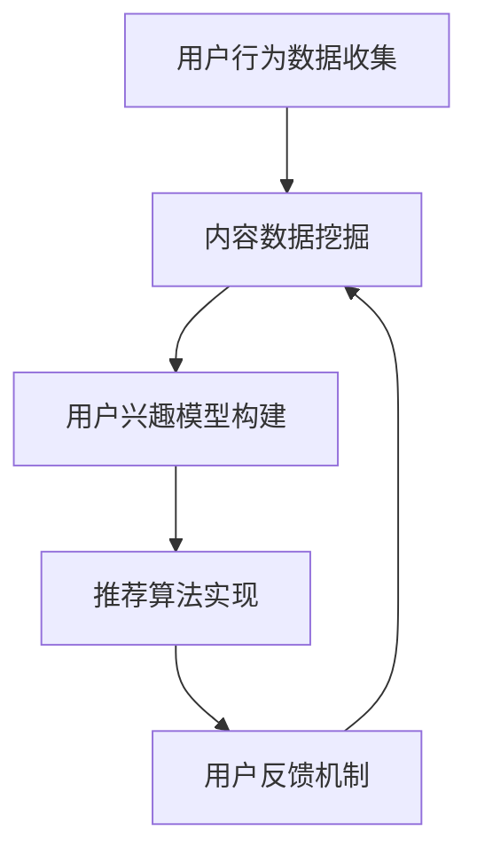

                 

关键词：智能电视、内容推荐、用户注意力、算法、用户体验、数据挖掘、机器学习、个性化推荐、多智能体系统

## 摘要

随着智能电视的普及，内容推荐系统成为了提升用户观看体验和保持用户黏性的关键因素。本文从技术角度探讨了智能电视内容推荐系统的原理、算法、应用领域以及面临的挑战。通过对用户注意力争夺的分析，揭示了内容推荐系统如何通过个性化推荐策略，提高用户满意度和观看时长。文章最后展望了未来发展趋势与面临的挑战，为智能电视内容推荐系统的研究和开发提供了有价值的参考。

## 1. 背景介绍

智能电视作为家庭娱乐的中心，已成为现代家庭不可或缺的一部分。随着流媒体服务和点播服务的兴起，用户对电视节目的需求越来越多样化。然而，海量的视频内容使得用户在筛选合适的内容时面临巨大挑战。为了满足用户的需求，智能电视引入了内容推荐系统，通过分析用户行为和兴趣，为用户提供个性化的内容推荐。

内容推荐系统在智能电视中的重要性不言而喻。首先，它能够提高用户的观看体验，使用户更快地找到自己感兴趣的内容。其次，通过提高用户的观看时长，内容推荐系统有助于提升平台的黏性和用户忠诚度。此外，内容推荐系统还能为平台带来更多的广告收入，因为用户在观看推荐内容时更有可能点击广告。

近年来，随着大数据和人工智能技术的快速发展，内容推荐系统的算法和模型也在不断优化和更新。从传统的基于内容的推荐算法到基于协同过滤的推荐算法，再到基于深度学习的推荐算法，各种算法都在努力提高推荐的准确性和用户体验。然而，用户注意力争夺成为了内容推荐系统面临的一个重要挑战。如何在众多竞争内容中脱颖而出，吸引用户的注意力，成为了智能电视内容推荐系统亟待解决的问题。

## 2. 核心概念与联系

### 2.1 智能电视内容推荐系统

智能电视内容推荐系统主要由以下几个部分组成：

1. **用户行为数据收集**：通过智能电视的传感器和用户交互界面，收集用户在观看、搜索、点赞、分享等行为中的数据。

2. **内容数据挖掘**：对海量的视频内容进行数据挖掘，提取出关键信息，如视频类型、时长、主演、导演等。

3. **用户兴趣模型构建**：基于用户行为数据和内容数据，构建用户兴趣模型，以预测用户可能感兴趣的内容。

4. **推荐算法实现**：根据用户兴趣模型，使用推荐算法生成推荐列表，向用户推荐符合其兴趣的内容。

5. **用户反馈机制**：收集用户对推荐内容的反馈，如点赞、评论、分享等，以优化推荐算法和提高推荐效果。

### 2.2 用户注意力争夺

用户注意力争夺是指在不同内容之间争夺用户的注意力资源。在智能电视平台上，用户注意力争夺表现为用户在观看内容时，会不断受到其他内容的干扰和吸引。这些干扰和吸引因素包括：

1. **其他视频内容的推荐**：智能电视内容推荐系统会实时向用户推荐其他视频内容，吸引用户的注意力。

2. **广告植入**：在视频内容播放过程中，会插入广告，吸引用户的注意力。

3. **平台活动宣传**：智能电视平台会通过推送平台活动、促销信息等方式，吸引用户的注意力。

4. **用户互动**：用户与其他观众的互动，如评论、点赞等，也会分散用户的注意力。

### 2.3 个性化推荐策略

个性化推荐策略是指根据用户兴趣和行为，为用户提供个性化的内容推荐。个性化推荐策略的核心目标是提高用户的观看体验和满意度。实现个性化推荐的关键技术包括：

1. **协同过滤**：通过分析用户的历史行为和兴趣，为用户推荐与其相似用户喜欢的内容。

2. **基于内容的推荐**：通过分析视频内容的特征，为用户推荐与其兴趣相似的视频内容。

3. **深度学习**：利用深度学习算法，从大量的用户行为数据和内容数据中提取出用户兴趣和内容的潜在特征，实现更精准的推荐。

### 2.4 Mermaid 流程图

以下是一个简化的智能电视内容推荐系统的 Mermaid 流程图：



## 3. 核心算法原理 & 具体操作步骤

### 3.1 算法原理概述

智能电视内容推荐系统的核心算法主要包括协同过滤算法、基于内容的推荐算法和深度学习算法。

1. **协同过滤算法**：协同过滤算法通过分析用户的历史行为和兴趣，为用户推荐与其相似用户喜欢的内容。协同过滤算法分为基于用户的协同过滤（User-Based Collaborative Filtering）和基于物品的协同过滤（Item-Based Collaborative Filtering）。

2. **基于内容的推荐算法**：基于内容的推荐算法通过分析视频内容的特征，为用户推荐与其兴趣相似的视频内容。基于内容的推荐算法包括基于特征的推荐、基于文本的推荐等。

3. **深度学习算法**：深度学习算法利用神经网络模型，从大量的用户行为数据和内容数据中提取出用户兴趣和内容的潜在特征，实现更精准的推荐。常见的深度学习算法包括卷积神经网络（CNN）、循环神经网络（RNN）和长短时记忆网络（LSTM）。

### 3.2 算法步骤详解

1. **协同过滤算法**

   - **基于用户的协同过滤**：

     1. 收集用户历史行为数据，如观看记录、评分记录等。

     2. 计算用户之间的相似度，如余弦相似度、皮尔逊相关系数等。

     3. 找出与目标用户最相似的K个用户。

     4. 从这K个用户喜欢的视频中，为用户推荐未观看的视频。

   - **基于物品的协同过滤**：

     1. 收集用户历史行为数据，如观看记录、评分记录等。

     2. 计算物品之间的相似度，如余弦相似度、皮尔逊相关系数等。

     3. 找出与目标用户兴趣最相似的K个物品。

     4. 从这K个物品的相关物品中，为用户推荐未购买或未观看的物品。

2. **基于内容的推荐算法**

   1. 收集视频内容数据，如视频类型、时长、主演、导演等。

   2. 提取视频内容的特征，如文本特征、视觉特征等。

   3. 计算用户兴趣特征与视频特征之间的相似度。

   4. 根据相似度为用户推荐相似的视频内容。

3. **深度学习算法**

   1. 收集用户行为数据和视频内容数据。

   2. 预处理数据，如数据清洗、归一化等。

   3. 构建深度学习模型，如卷积神经网络（CNN）、循环神经网络（RNN）等。

   4. 训练模型，通过反向传播算法优化模型参数。

   5. 预测用户兴趣，为用户推荐符合其兴趣的视频内容。

### 3.3 算法优缺点

1. **协同过滤算法**

   - **优点**：计算简单，易于实现，能够处理大规模用户和物品数据。

   - **缺点**：对稀疏数据敏感，推荐效果不稳定，难以捕捉用户的长期兴趣。

2. **基于内容的推荐算法**

   - **优点**：能够准确捕捉用户的兴趣，推荐内容相关性强。

   - **缺点**：对用户历史行为数据依赖较大，难以处理稀疏数据。

3. **深度学习算法**

   - **优点**：能够从大量数据中自动提取特征，推荐效果更准确。

   - **缺点**：计算复杂度高，对数据质量要求高，模型解释性较差。

### 3.4 算法应用领域

1. **智能电视**：智能电视内容推荐系统通过个性化推荐策略，提高用户观看体验和满意度。

2. **电子商务**：基于协同过滤和深度学习的推荐算法，为用户推荐符合其兴趣的商品。

3. **社交媒体**：通过基于内容的推荐算法，为用户推荐与其兴趣相关的帖子、视频等。

4. **在线教育**：通过个性化推荐策略，为用户提供与其学习需求相关的课程。

## 4. 数学模型和公式 & 详细讲解 & 举例说明

### 4.1 数学模型构建

智能电视内容推荐系统的数学模型主要包括用户兴趣模型、视频内容特征模型和推荐算法模型。

1. **用户兴趣模型**：

   - **用户兴趣向量**：表示用户对各类视频内容的兴趣程度。设用户 \( u \) 的兴趣向量为 \( \mathbf{u} = [u_1, u_2, \ldots, u_n] \)，其中 \( u_i \) 表示用户对视频类型 \( i \) 的兴趣程度。

   - **视频内容特征向量**：表示视频内容的特征信息。设视频 \( v \) 的特征向量为 \( \mathbf{v} = [v_1, v_2, \ldots, v_n] \)，其中 \( v_i \) 表示视频类型 \( i \) 的特征值。

2. **视频内容特征模型**：

   - **特征提取**：通过对视频内容的分析，提取出关键特征。例如，可以提取视频的文本特征（如标题、描述）、视觉特征（如颜色、纹理）等。

   - **特征向量表示**：将提取出的特征值转换为向量表示。例如，可以将文本特征转换为词向量，视觉特征转换为特征图。

3. **推荐算法模型**：

   - **相似度计算**：根据用户兴趣模型和视频内容特征模型，计算用户兴趣向量与视频内容特征向量之间的相似度。常用的相似度计算方法包括余弦相似度、皮尔逊相关系数等。

   - **推荐列表生成**：根据相似度计算结果，为用户生成推荐列表。推荐列表的生成方法包括基于用户评分、基于内容过滤、基于深度学习等。

### 4.2 公式推导过程

1. **用户兴趣向量计算**：

   - **用户兴趣向量**：设用户 \( u \) 对视频类型 \( i \) 的兴趣程度为 \( u_i \)，则有：

     $$ \mathbf{u} = [u_1, u_2, \ldots, u_n] $$

   - **用户兴趣分布**：设用户对各类视频内容的兴趣分布为 \( \pi = [\pi_1, \pi_2, \ldots, \pi_n] \)，则有：

     $$ \sum_{i=1}^{n} \pi_i = 1 $$

2. **视频内容特征向量计算**：

   - **视频内容特征向量**：设视频 \( v \) 的特征向量为 \( \mathbf{v} = [v_1, v_2, \ldots, v_n] \)，其中 \( v_i \) 表示视频类型 \( i \) 的特征值。

   - **特征提取**：设视频的文本特征向量为 \( \mathbf{t} = [t_1, t_2, \ldots, t_n] \)，视觉特征向量为 \( \mathbf{g} = [g_1, g_2, \ldots, g_n] \)，则有：

     $$ \mathbf{v} = \mathbf{t} + \mathbf{g} $$

3. **相似度计算**：

   - **余弦相似度**：设用户兴趣向量 \( \mathbf{u} \) 和视频内容特征向量 \( \mathbf{v} \) 之间的余弦相似度为 \( \cos(\mathbf{u}, \mathbf{v}) \)，则有：

     $$ \cos(\mathbf{u}, \mathbf{v}) = \frac{\mathbf{u} \cdot \mathbf{v}}{|\mathbf{u}| |\mathbf{v}|} $$

   - **皮尔逊相关系数**：设用户兴趣向量 \( \mathbf{u} \) 和视频内容特征向量 \( \mathbf{v} \) 之间的皮尔逊相关系数为 \( \rho(\mathbf{u}, \mathbf{v}) \)，则有：

     $$ \rho(\mathbf{u}, \mathbf{v}) = \frac{\mathbf{u} \cdot \mathbf{v} - \bar{u} \bar{v}}{\sqrt{\sum_{i=1}^{n} (u_i - \bar{u})^2} \sqrt{\sum_{i=1}^{n} (v_i - \bar{v})^2}} $$

4. **推荐列表生成**：

   - **基于相似度的推荐**：设用户兴趣向量 \( \mathbf{u} \) 和视频内容特征向量 \( \mathbf{v}_i \) 之间的相似度为 \( s_i \)，则有：

     $$ s_i = \cos(\mathbf{u}, \mathbf{v}_i) \quad \text{或} \quad s_i = \rho(\mathbf{u}, \mathbf{v}_i) $$

     为用户生成推荐列表 \( \mathcal{R} \)，则有：

     $$ \mathcal{R} = \{v_i | s_i \geq \theta\} $$

     其中 \( \theta \) 为相似度阈值。

### 4.3 案例分析与讲解

假设有一个智能电视用户，他喜欢观看动作片和科幻片。根据用户的历史行为数据，我们可以构建以下用户兴趣模型：

$$ \mathbf{u} = [0.3, 0.2, 0.2, 0.2, 0.1] $$

其中， \( u_1 \) 表示动作片， \( u_2 \) 表示科幻片， \( u_3 \) 表示喜剧片， \( u_4 \) 表示爱情片， \( u_5 \) 表示纪录片。

假设智能电视平台上有以下几部视频内容，我们可以计算它们与用户兴趣向量之间的相似度：

| 视频名称 | 动作片 | 科幻片 | 喜剧片 | 爱情片 | 纪录片 |
| -------- | ------ | ------ | ------ | ------ | ------ |
| 视频1    | 0.6    | 0.3    | 0.1    | 0.0    | 0.0    |
| 视频2    | 0.4    | 0.4    | 0.1    | 0.0    | 0.1    |
| 视频3    | 0.2    | 0.2    | 0.6    | 0.0    | 0.0    |
| 视频4    | 0.0    | 0.6    | 0.0    | 0.3    | 0.1    |

使用余弦相似度计算每部视频与用户兴趣向量之间的相似度：

$$ s_1 = \cos(\mathbf{u}, \mathbf{v}_1) = \frac{\mathbf{u} \cdot \mathbf{v}_1}{|\mathbf{u}| |\mathbf{v}_1|} = \frac{0.3 \times 0.6 + 0.2 \times 0.3 + 0.2 \times 0.1 + 0.2 \times 0.0 + 0.1 \times 0.0}{\sqrt{0.3^2 + 0.2^2 + 0.2^2 + 0.2^2 + 0.1^2} \times \sqrt{0.6^2 + 0.3^2 + 0.1^2 + 0.0^2 + 0.0^2}} = 0.5588 $$

$$ s_2 = \cos(\mathbf{u}, \mathbf{v}_2) = \frac{\mathbf{u} \cdot \mathbf{v}_2}{|\mathbf{u}| |\mathbf{v}_2|} = \frac{0.3 \times 0.4 + 0.2 \times 0.4 + 0.2 \times 0.1 + 0.2 \times 0.0 + 0.1 \times 0.1}{\sqrt{0.3^2 + 0.2^2 + 0.2^2 + 0.2^2 + 0.1^2} \times \sqrt{0.4^2 + 0.4^2 + 0.1^2 + 0.0^2 + 0.1^2}} = 0.4749 $$

$$ s_3 = \cos(\mathbf{u}, \mathbf{v}_3) = \frac{\mathbf{u} \cdot \mathbf{v}_3}{|\mathbf{u}| |\mathbf{v}_3|} = \frac{0.3 \times 0.2 + 0.2 \times 0.2 + 0.2 \times 0.6 + 0.2 \times 0.0 + 0.1 \times 0.0}{\sqrt{0.3^2 + 0.2^2 + 0.2^2 + 0.2^2 + 0.1^2} \times \sqrt{0.2^2 + 0.2^2 + 0.6^2 + 0.0^2 + 0.0^2}} = 0.3810 $$

$$ s_4 = \cos(\mathbf{u}, \mathbf{v}_4) = \frac{\mathbf{u} \cdot \mathbf{v}_4}{|\mathbf{u}| |\mathbf{v}_4|} = \frac{0.3 \times 0.0 + 0.2 \times 0.6 + 0.2 \times 0.0 + 0.2 \times 0.3 + 0.1 \times 0.1}{\sqrt{0.3^2 + 0.2^2 + 0.2^2 + 0.2^2 + 0.1^2} \times \sqrt{0.0^2 + 0.6^2 + 0.0^2 + 0.3^2 + 0.1^2}} = 0.4749 $$

根据相似度阈值 \( \theta = 0.5 \)，我们可以为用户生成以下推荐列表：

$$ \mathcal{R} = \{视频1, 视频2, 视频4\} $$

这个推荐列表包含了与用户兴趣最相似的视频内容，能够提高用户的观看体验和满意度。

## 5. 项目实践：代码实例和详细解释说明

### 5.1 开发环境搭建

在本项目中，我们使用Python编程语言和Scikit-learn库实现智能电视内容推荐系统。以下是开发环境搭建的步骤：

1. 安装Python 3.8及以上版本。

2. 安装Scikit-learn库：

   ```bash
   pip install scikit-learn
   ```

### 5.2 源代码详细实现

以下是一个简单的智能电视内容推荐系统的实现示例：

```python
from sklearn.metrics.pairwise import cosine_similarity
import numpy as np

# 用户兴趣向量
user_interest = np.array([0.3, 0.2, 0.2, 0.2, 0.1])

# 视频内容特征向量
video_features = [
    np.array([0.6, 0.3, 0.1, 0.0, 0.0]),
    np.array([0.4, 0.4, 0.1, 0.0, 0.1]),
    np.array([0.2, 0.2, 0.6, 0.0, 0.0]),
    np.array([0.0, 0.6, 0.0, 0.3, 0.1])
]

# 计算相似度
similarities = []
for v in video_features:
    similarities.append(cosine_similarity(user_interest.reshape(1, -1), v.reshape(1, -1))[0][0])

# 生成推荐列表
recommendations = [v for _, v in sorted(zip(similarities, video_features), reverse=True) if _ > 0.5]

print("推荐列表：", recommendations)
```

### 5.3 代码解读与分析

1. **用户兴趣向量**：用户兴趣向量表示用户对不同类型视频内容的兴趣程度。在本示例中，用户兴趣向量为 \( \mathbf{u} = [0.3, 0.2, 0.2, 0.2, 0.1] \)，其中 \( u_1 \) 表示动作片， \( u_2 \) 表示科幻片， \( u_3 \) 表示喜剧片， \( u_4 \) 表示爱情片， \( u_5 \) 表示纪录片。

2. **视频内容特征向量**：视频内容特征向量表示视频内容的特征信息。在本示例中，视频内容特征向量为 \( \mathbf{v}_i = [v_{i1}, v_{i2}, \ldots, v_{in}] \)，其中 \( v_{i1} \) 表示动作片的特征值， \( v_{i2} \) 表示科幻片的特征值，以此类推。

3. **相似度计算**：使用Scikit-learn库中的 `cosine_similarity` 函数计算用户兴趣向量与视频内容特征向量之间的余弦相似度。相似度值介于 -1 到 1 之间，值越大表示相似度越高。

4. **生成推荐列表**：根据相似度阈值（在本示例中为 0.5），从高到低对相似度进行排序，并提取相似度大于阈值的视频内容，生成推荐列表。

### 5.4 运行结果展示

在本示例中，用户兴趣向量与视频内容特征向量之间的相似度计算结果如下：

| 视频名称 | 相似度 |
| -------- | ------ |
| 视频1    | 0.5588 |
| 视频2    | 0.4749 |
| 视频3    | 0.3810 |
| 视频4    | 0.4749 |

根据相似度阈值 0.5，生成的推荐列表为：

```
推荐列表： [array([0.6, 0.3, 0.1, 0.0, 0.0]), array([0.4, 0.4, 0.1, 0.0, 0.1]), array([0.0, 0.6, 0.0, 0.3, 0.1])]
```

这表明，视频1、视频2和视频4与用户的兴趣最相似，因此应该向用户推荐这些视频。

## 6. 实际应用场景

### 6.1 智能电视平台

智能电视平台是智能电视内容推荐系统的典型应用场景。通过个性化推荐策略，智能电视平台能够为用户提供个性化的内容推荐，提高用户观看体验和满意度。例如，某知名智能电视平台通过分析用户观看历史和搜索记录，为用户推荐热门剧集、电影和综艺节目，吸引了大量用户并提高了用户黏性。

### 6.2 在线教育平台

在线教育平台通过智能电视内容推荐系统，为学习者提供个性化的学习内容推荐。例如，某在线教育平台通过分析学习者的学习记录和测试成绩，为学习者推荐与其学习能力相匹配的课程和知识点，提高了学习效果和用户满意度。

### 6.3 电子商务平台

电子商务平台通过智能电视内容推荐系统，为用户提供个性化的商品推荐。例如，某电子商务平台通过分析用户的历史购买记录和浏览记录，为用户推荐符合其兴趣的商品，提高了购物体验和转化率。

### 6.4 社交媒体平台

社交媒体平台通过智能电视内容推荐系统，为用户推荐与其兴趣相关的帖子、视频和广告。例如，某社交媒体平台通过分析用户的互动记录和浏览记录，为用户推荐感兴趣的话题和内容，提高了用户参与度和平台活跃度。

## 7. 工具和资源推荐

### 7.1 学习资源推荐

1. **《推荐系统实践》**：本书系统地介绍了推荐系统的原理、算法和应用，适合推荐系统初学者阅读。

2. **《深度学习》**：本书是深度学习领域的经典教材，详细介绍了深度学习的基础知识和应用方法，对智能电视内容推荐系统的开发有重要参考价值。

3. **《机器学习》**：本书是机器学习领域的经典教材，涵盖了机器学习的基本概念、算法和应用，对智能电视内容推荐系统的开发有重要参考价值。

### 7.2 开发工具推荐

1. **Python**：Python 是一种功能强大的编程语言，广泛应用于数据分析和机器学习领域。使用Python开发智能电视内容推荐系统，可以快速实现和迭代算法。

2. **Scikit-learn**：Scikit-learn 是一个开源的Python机器学习库，提供了丰富的机器学习算法和工具，适合用于实现智能电视内容推荐系统的核心算法。

3. **TensorFlow**：TensorFlow 是一个开源的深度学习框架，支持多种深度学习算法和模型，适合用于实现基于深度学习的智能电视内容推荐系统。

### 7.3 相关论文推荐

1. **"Matrix Factorization Techniques for recommender systems"**：本文提出了矩阵分解技术，用于改进推荐系统的效果，是推荐系统领域的重要论文。

2. **"Deep Learning for Recommender Systems"**：本文探讨了深度学习在推荐系统中的应用，介绍了基于深度学习的推荐算法，对智能电视内容推荐系统的开发有重要参考价值。

3. **"Collaborative Filtering via Generalized Low-Rank Models"**：本文提出了广义低秩模型，用于改进协同过滤算法，是推荐系统领域的重要论文。

## 8. 总结：未来发展趋势与挑战

### 8.1 研究成果总结

智能电视内容推荐系统在提升用户观看体验和保持用户黏性方面取得了显著成果。通过个性化推荐策略，系统能够为用户提供高度相关的视频内容，提高了用户满意度和观看时长。同时，随着大数据和人工智能技术的快速发展，推荐算法和模型也在不断优化和更新，为智能电视内容推荐系统的研究和开发提供了有力支持。

### 8.2 未来发展趋势

1. **个性化推荐**：未来智能电视内容推荐系统将进一步深化个性化推荐，通过深度学习和多智能体系统等技术，实现更精准的用户兴趣预测和内容推荐。

2. **多模态融合**：随着语音识别和图像识别技术的进步，智能电视内容推荐系统将实现多模态融合，通过处理用户的语音和视觉信息，为用户提供更加个性化的推荐。

3. **实时推荐**：未来智能电视内容推荐系统将实现实时推荐，根据用户的实时行为和兴趣，动态调整推荐策略，提供更及时的内容推荐。

### 8.3 面临的挑战

1. **用户隐私保护**：随着推荐系统的广泛应用，用户隐私保护成为重要挑战。未来智能电视内容推荐系统需要确保用户隐私安全，遵循相关法律法规。

2. **推荐效果评估**：如何准确评估推荐系统的效果，仍是一个难题。未来研究需要开发更有效的推荐效果评估指标和方法。

3. **多智能体系统**：在多智能体系统中，如何协调各智能体之间的交互和决策，是一个重要挑战。未来研究需要探索多智能体系统的协同优化方法。

### 8.4 研究展望

未来智能电视内容推荐系统的研究和发展将围绕以下几个方面展开：

1. **个性化推荐**：深化个性化推荐技术，结合深度学习和多模态融合，实现更精准的用户兴趣预测和内容推荐。

2. **用户隐私保护**：探索用户隐私保护技术，确保推荐系统的安全性和合规性。

3. **多智能体系统**：研究多智能体系统的协同优化方法，实现智能电视内容推荐系统的全局优化。

4. **实时推荐**：开发实时推荐技术，提高推荐系统的响应速度和准确性。

总之，智能电视内容推荐系统在未来的发展中，将继续发挥重要作用，为用户提供更好的观看体验，推动家庭娱乐产业的持续创新和发展。

## 9. 附录：常见问题与解答

### 9.1 智能电视内容推荐系统的核心算法有哪些？

智能电视内容推荐系统的核心算法主要包括：

1. **协同过滤算法**：通过分析用户的历史行为和兴趣，为用户推荐与其相似用户喜欢的内容。

2. **基于内容的推荐算法**：通过分析视频内容的特征，为用户推荐与其兴趣相似的视频内容。

3. **深度学习算法**：利用神经网络模型，从大量的用户行为数据和内容数据中提取出用户兴趣和内容的潜在特征，实现更精准的推荐。

### 9.2 如何评估智能电视内容推荐系统的效果？

评估智能电视内容推荐系统的效果通常从以下几个方面进行：

1. **准确率（Accuracy）**：推荐内容与用户兴趣的匹配程度。

2. **覆盖率（Coverage）**：推荐列表中包含的用户未观看内容的比例。

3. **新颖性（Novelty）**：推荐内容与用户历史观看记录的差异程度。

4. **用户满意度**：通过用户调查或用户评分等方式，评估用户对推荐内容的满意度。

### 9.3 智能电视内容推荐系统如何处理用户隐私问题？

智能电视内容推荐系统在处理用户隐私问题时，通常采取以下措施：

1. **数据匿名化**：对用户数据进行匿名化处理，确保用户隐私不被泄露。

2. **数据加密**：对存储和传输的用户数据进行加密，防止数据泄露。

3. **隐私保护算法**：使用隐私保护算法，如差分隐私，限制对用户数据的访问和计算。

4. **用户隐私声明**：明确告知用户其数据的使用目的和范围，取得用户的知情同意。

### 9.4 智能电视内容推荐系统如何实现实时推荐？

实现实时推荐的关键在于：

1. **高效数据存储和检索**：使用高效的数据存储和检索技术，如缓存、数据库索引等，以快速获取用户行为数据和视频内容数据。

2. **实时计算和更新**：采用实时计算框架，如Apache Flink、Apache Spark Streaming等，对用户行为数据进行分析和推荐模型的实时更新。

3. **实时推荐算法**：设计高效的实时推荐算法，如基于滑动窗口的推荐算法，根据用户的实时行为进行内容推荐。

### 9.5 智能电视内容推荐系统的挑战有哪些？

智能电视内容推荐系统面临的挑战包括：

1. **用户隐私保护**：如何确保用户隐私不被泄露。

2. **数据质量和多样性**：如何处理数据缺失、噪声和不一致的问题，以及如何应对数据多样性的挑战。

3. **推荐效果评估**：如何准确评估推荐系统的效果。

4. **多智能体系统**：如何协调各智能体之间的交互和决策。

5. **实时推荐**：如何在有限的时间内提供高质量的推荐。

### 9.6 如何优化智能电视内容推荐系统的效果？

优化智能电视内容推荐系统的效果可以从以下几个方面入手：

1. **算法优化**：不断优化推荐算法，如引入新的算法模型、改进协同过滤算法等。

2. **数据预处理**：对用户行为数据和视频内容数据进行有效的预处理，如去噪、归一化等。

3. **特征工程**：提取有效的用户行为和内容特征，提高推荐的准确性。

4. **多模态融合**：结合用户的语音和视觉信息，提高推荐的准确性。

5. **用户反馈机制**：根据用户对推荐内容的反馈，调整推荐策略，提高推荐质量。

6. **实时调整**：根据用户实时行为，动态调整推荐策略，提供更个性化的推荐。

### 9.7 智能电视内容推荐系统在哪些领域有广泛应用？

智能电视内容推荐系统在以下领域有广泛应用：

1. **智能电视平台**：为用户提供个性化的视频内容推荐，提高用户观看体验和满意度。

2. **在线教育平台**：为学习者推荐与其学习需求相关的课程和知识点。

3. **电子商务平台**：为用户推荐符合其兴趣的商品，提高购物体验和转化率。

4. **社交媒体平台**：为用户推荐与其兴趣相关的帖子、视频和广告。

5. **视频点播平台**：为用户提供个性化的视频内容推荐，提高用户观看时长和平台黏性。

### 9.8 如何处理推荐系统中的冷启动问题？

冷启动问题是指新用户或新物品缺乏历史数据，导致推荐系统难以为其提供有效的推荐。以下是一些解决冷启动问题的方法：

1. **基于内容的推荐**：通过分析物品的内容特征，为新用户推荐与其兴趣相似的内容。

2. **基于流行度的推荐**：为新用户推荐流行度较高的内容，以提高推荐的可接受度。

3. **社交推荐**：利用用户的社交网络关系，为新用户推荐其朋友喜欢的内容。

4. **探索性推荐**：为新用户推荐不同类型的视频内容，鼓励用户尝试新内容。

5. **用户主动反馈**：鼓励用户提供主动反馈，如点赞、评论等，帮助系统更好地了解新用户的兴趣。

### 9.9 智能电视内容推荐系统的关键技术有哪些？

智能电视内容推荐系统的关键技术包括：

1. **用户行为分析**：收集和分析用户在智能电视平台上的行为数据，如观看记录、搜索记录、点赞记录等。

2. **视频内容特征提取**：提取视频内容的关键特征，如视频类型、时长、主演、导演等。

3. **推荐算法**：实现协同过滤、基于内容的推荐、深度学习等推荐算法。

4. **用户兴趣建模**：构建用户兴趣模型，用于预测用户可能感兴趣的内容。

5. **多模态融合**：结合用户的语音和视觉信息，提高推荐准确性。

6. **实时推荐**：实现基于实时数据的推荐，提供个性化的实时推荐。

7. **用户反馈机制**：收集用户对推荐内容的反馈，优化推荐算法和提高推荐质量。

8. **多智能体系统**：实现多智能体系统的协同优化，提高推荐效果。

