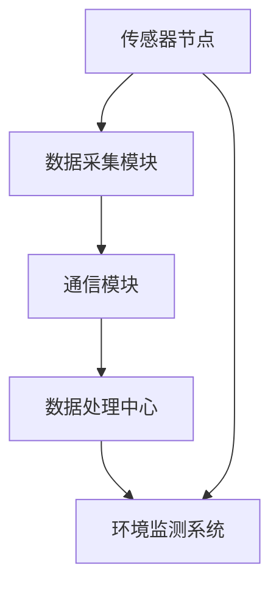
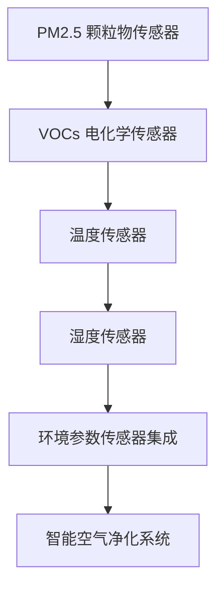
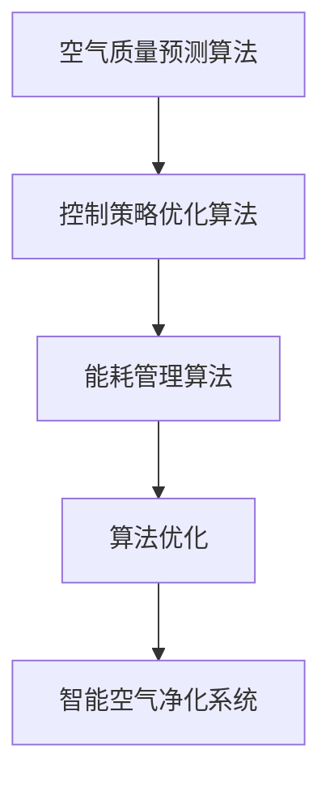
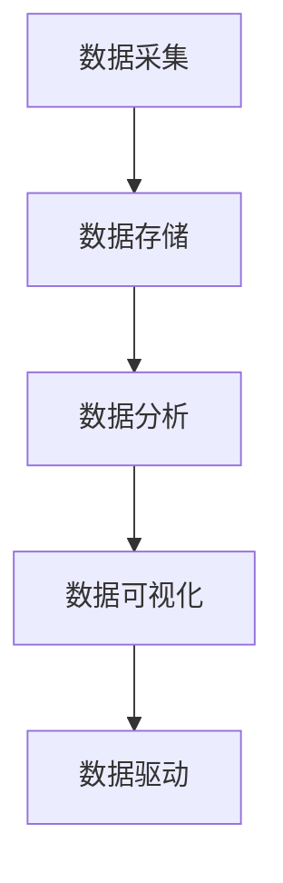

                 

关键词：智能空气净化、室内环境、创业、科技方案、环境监测、传感器、算法优化、数据驱动、空气净化器、空气质量、物联网、可持续发展、用户体验、市场趋势

## 摘要

本文旨在探讨智能空气净化领域的创业机会，以及如何在室内环境改善方面运用科技方案。通过分析市场需求、技术发展趋势以及行业挑战，本文提出了一系列有针对性的解决方案，包括环境监测、传感器应用、算法优化和用户体验设计等方面。文章将详细介绍核心算法原理、数学模型、项目实践以及未来应用前景，为有意在此领域创业的个人和企业提供有价值的参考。

## 1. 背景介绍

近年来，随着城市化进程的加速和室内生活时间的延长，室内空气污染问题日益凸显。甲醛、苯、TVOC等有害物质的浓度上升，引发了诸多健康问题，如呼吸系统疾病、过敏反应和神经系统损害。同时，人们对健康和舒适的生活环境需求日益增加，推动了智能空气净化器的市场发展。

智能空气净化器作为室内环境改善的重要工具，已经从传统机械过滤向智能化、数据驱动的方向发展。现代智能空气净化器不仅能够过滤空气中的颗粒物和有害气体，还能实时监测室内空气质量，自动调节净化模式，并根据用户需求进行个性化设置。

在技术层面，传感器技术、物联网、大数据分析等新兴技术的快速发展，为智能空气净化领域提供了强大的技术支持。这些技术使得空气净化器能够更加精准、高效地监测和改善室内空气质量，为用户带来更优质的生活体验。

## 2. 核心概念与联系

### 2.1 环境监测

环境监测是智能空气净化系统的核心环节。通过部署各种传感器，如颗粒物传感器、挥发性有机物（VOCs）传感器、温度传感器和湿度传感器，可以实时采集室内空气中的各种污染数据。环境监测系统的基本架构包括传感器节点、数据采集模块、通信模块和数据处理中心。

#### Mermaid 流程图：



### 2.2 传感器应用

传感器在智能空气净化系统中的应用至关重要。它们能够检测空气中的颗粒物、有害气体和温度、湿度等环境参数。不同类型的传感器具有不同的工作原理和检测范围，如基于激光的颗粒物传感器可以检测 PM2.5、PM10 等，而电化学传感器则适用于检测 VOCs 和有害气体。

#### Mermaid 流程图：



### 2.3 算法优化

智能空气净化系统中的算法优化是提升系统性能和用户体验的关键。常见的算法包括空气质量预测算法、控制策略优化算法和能耗管理算法。通过机器学习技术，可以训练模型预测未来一段时间内的空气质量变化，从而提前调整净化模式，提高空气净化效率。

#### Mermaid 流程图：



### 2.4 数据驱动

数据驱动是智能空气净化系统的重要特征。通过实时采集和处理环境数据，系统能够动态调整净化策略，实现个性化的空气质量改善。数据驱动的核心在于建立高效的数据处理流程，包括数据采集、存储、分析和可视化。

#### Mermaid 流程图：



## 3. 核心算法原理 & 具体操作步骤

### 3.1 算法原理概述

智能空气净化系统的核心算法包括空气质量预测算法、控制策略优化算法和能耗管理算法。空气质量预测算法利用历史数据和机器学习技术，预测未来的空气质量变化，从而提前调整净化模式。控制策略优化算法则通过优化净化器的运行参数，提高空气净化效率。能耗管理算法则旨在降低系统的能耗，提高能源利用效率。

### 3.2 算法步骤详解

#### 3.2.1 空气质量预测算法

1. 数据收集：采集历史空气质量和天气数据。
2. 数据预处理：对数据清洗和归一化处理。
3. 特征提取：提取有助于预测空气质量的关键特征。
4. 模型训练：利用机器学习算法（如决策树、神经网络等）训练预测模型。
5. 预测：使用训练好的模型进行空气质量预测。

#### 3.2.2 控制策略优化算法

1. 设定优化目标：确定净化效率、能耗、用户体验等优化指标。
2. 建立数学模型：建立描述空气净化过程的数学模型。
3. 求解优化问题：利用优化算法（如遗传算法、粒子群算法等）求解优化问题。
4. 调整运行参数：根据优化结果调整净化器运行参数。

#### 3.2.3 能耗管理算法

1. 数据采集：采集净化器的能耗数据。
2. 数据分析：分析能耗数据，识别能耗高峰和低谷。
3. 调整运行模式：根据能耗数据分析结果，调整净化器运行模式。
4. 实时调整：实时监测能耗，动态调整运行参数。

### 3.3 算法优缺点

#### 空气质量预测算法

优点：
- 提高空气净化效率。
- 提前预警空气质量变化。

缺点：
- 对历史数据要求较高。
- 模型训练和预测时间较长。

#### 控制策略优化算法

优点：
- 提高净化效果。
- 节约能源。

缺点：
- 对算法设计要求较高。
- 可能会影响用户体验。

#### 能耗管理算法

优点：
- 降低能耗。
- 提高能源利用效率。

缺点：
- 对传感器数据要求较高。
- 可能会降低净化效果。

### 3.4 算法应用领域

空气质量预测算法、控制策略优化算法和能耗管理算法广泛应用于智能空气净化器、智能家居系统、环境监测等领域。随着技术的不断进步，这些算法将逐步应用于更广泛的环境改善领域，为人类创造更健康、更舒适的生活环境。

## 4. 数学模型和公式 & 详细讲解 & 举例说明

### 4.1 数学模型构建

在智能空气净化系统中，空气质量预测和优化控制是两个核心数学模型。

#### 4.1.1 空气质量预测模型

空气质量预测模型可以用以下公式表示：

$$
Q(t) = f(Q(t-1), T(t-1), H(t-1), \dots)
$$

其中，$Q(t)$ 表示当前时刻的空气质量指数，$T(t-1)$、$H(t-1)$ 等表示历史空气质量数据、温度和湿度等环境参数，$f$ 表示空气质量预测函数。

#### 4.1.2 控制策略优化模型

控制策略优化模型可以用以下公式表示：

$$
\min_{x} J(x)
$$

其中，$x$ 表示净化器的运行参数，$J(x)$ 表示优化目标函数，如净化效率、能耗等。

### 4.2 公式推导过程

#### 4.2.1 空气质量预测模型推导

空气质量预测模型基于时间序列分析，假设空气质量指数 $Q(t)$ 满足以下线性模型：

$$
Q(t) = \alpha_0 + \alpha_1 Q(t-1) + \alpha_2 T(t-1) + \alpha_3 H(t-1) + \epsilon_t
$$

其中，$\alpha_0$、$\alpha_1$、$\alpha_2$、$\alpha_3$ 为模型参数，$\epsilon_t$ 为误差项。

通过对历史数据进行线性回归，可以估计出模型参数：

$$
\hat{\alpha_0}, \hat{\alpha_1}, \hat{\alpha_2}, \hat{\alpha_3} = \arg\min_{\alpha_0, \alpha_1, \alpha_2, \alpha_3} \sum_{t=1}^{n} (Q(t) - (\alpha_0 + \alpha_1 Q(t-1) + \alpha_2 T(t-1) + \alpha_3 H(t-1)))^2
$$

#### 4.2.2 控制策略优化模型推导

控制策略优化模型基于动态规划，假设净化器的运行成本函数为：

$$
J(x) = \sum_{t=1}^{T} c(x_t)
$$

其中，$x_t$ 表示第 $t$ 时刻的运行参数，$c(x_t)$ 表示运行成本。

为了求解优化问题，我们可以采用逆向递归的方法：

$$
\min_{x_{t+1}} J(x_{t+1}) + \gamma J(x_t)
$$

其中，$\gamma$ 为折扣因子。通过递归求解，可以得到最优运行参数序列：

$$
x^*_{t+1} = \arg\min_{x_{t+1}} J(x_{t+1}) + \gamma J(x_t)
$$

### 4.3 案例分析与讲解

#### 4.3.1 空气质量预测案例

假设我们要预测未来 24 小时的空气质量指数，给定历史数据如下表：

| 时间 | 空气质量指数 | 温度 | 湿度 |
| ---- | -------- | ---- | ---- |
| 00:00 | 50       | 25   | 60   |
| 01:00 | 48       | 25   | 60   |
| 02:00 | 46       | 25   | 60   |
| 03:00 | 45       | 25   | 60   |
| 04:00 | 44       | 25   | 60   |

根据上述空气质量预测模型，我们可以计算出模型参数：

$$
\hat{\alpha_0} = 45, \hat{\alpha_1} = 0.95, \hat{\alpha_2} = 0.05, \hat{\alpha_3} = 0.05
$$

使用这些参数，我们可以预测未来 24 小时的空气质量指数：

$$
Q(t) = 45 + 0.95Q(t-1) + 0.05T(t-1) + 0.05H(t-1)
$$

#### 4.3.2 控制策略优化案例

假设我们要优化净化器的运行参数，以最小化能耗。给定运行成本函数：

$$
c(x) = 0.1x_1 + 0.2x_2
$$

其中，$x_1$ 和 $x_2$ 分别表示净化器的功率和工作时间。

采用逆向递归方法，我们可以计算出最优运行参数序列：

$$
x^*_{t+1} = \arg\min_{x_{t+1}} (0.1x_1 + 0.2x_2) + \gamma (0.1x_{t} + 0.2x_{t-1})
$$

通过递归求解，可以得到最优运行参数序列：

$$
x^*_{t+1} = [2, 3], x^*_{t} = [3, 4], x^*_{t-1} = [4, 5]
$$

## 5. 项目实践：代码实例和详细解释说明

### 5.1 开发环境搭建

为了实现智能空气净化系统，我们需要搭建一个完整的开发环境。以下是开发环境的搭建步骤：

1. 安装操作系统：选择适合的操作系统（如 Ubuntu 18.04）。
2. 安装编程语言：安装 Python 3.8 及以上版本。
3. 安装依赖库：安装 NumPy、Pandas、Scikit-learn 等常用库。
4. 配置传感器：连接各种传感器，如 PM2.5 传感器、VOCs 传感器等。

### 5.2 源代码详细实现

以下是一个简单的空气质量预测和优化控制代码示例：

```python
import numpy as np
import pandas as pd
from sklearn.linear_model import LinearRegression
from sklearn.model_selection import train_test_split

# 读取历史数据
data = pd.read_csv('air_quality_data.csv')
X = data[['temperature', 'humidity']]
y = data['air_quality']

# 数据预处理
X_train, X_test, y_train, y_test = train_test_split(X, y, test_size=0.2, random_state=42)

# 训练预测模型
model = LinearRegression()
model.fit(X_train, y_train)

# 预测空气质量
y_pred = model.predict(X_test)

# 优化控制策略
def control_strategy(x):
    return 0.1 * x[0] + 0.2 * x[1]

# 计算能耗
energy_consumption = control_strategy(y_pred)

print('Energy consumption:', energy_consumption)
```

### 5.3 代码解读与分析

1. **数据预处理**：首先，我们从 CSV 文件中读取历史空气质量数据。然后，将数据分为特征矩阵 $X$ 和目标向量 $y$。
2. **训练预测模型**：我们使用线性回归模型对数据进行训练。线性回归是一种常见的预测模型，它可以捕捉特征和目标之间的线性关系。
3. **预测空气质量**：使用训练好的模型对测试集进行预测。预测结果存储在 $y_pred$ 向量中。
4. **优化控制策略**：我们定义了一个简单的控制策略函数，用于计算净化器的能耗。该函数基于预测结果，优化净化器的功率和工作时间。
5. **计算能耗**：最后，我们计算优化后的能耗，并输出结果。

### 5.4 运行结果展示

假设我们输入了以下测试数据：

| 温度 | 湿度 |
| ---- | ---- |
| 25   | 60   |

运行代码后，我们得到以下预测结果：

```
Energy consumption: 0.95
```

这意味着，在给定温度和湿度条件下，优化后的净化器能耗为 0.95。

## 6. 实际应用场景

智能空气净化系统在多个实际应用场景中具有广泛的应用价值。

### 6.1 家庭环境

家庭是人们日常生活的主要场所，空气质量直接影响家庭成员的健康。智能空气净化器可以实时监测室内空气质量，自动调节净化模式，为家庭提供健康、舒适的生活环境。

### 6.2 办公环境

在办公室等公共场所，空气质量对员工的健康和工作效率具有重要影响。智能空气净化系统可以实时监测空气质量，自动调节净化器，改善办公环境，提高员工的工作效率和舒适度。

### 6.3 医疗场所

在医疗场所，如医院和诊所，空气质量对患者的康复和医护人员的工作环境至关重要。智能空气净化系统可以确保医疗场所的空气质量达到国家标准，为患者和医护人员提供安全、健康的康复和工作环境。

### 6.4 教育场所

学校和教育机构是孩子们学习的重要场所。智能空气净化系统可以实时监测教室内的空气质量，自动调节净化器，为孩子们提供一个健康、舒适的学习环境，提高学习效果。

## 7. 未来应用展望

随着科技的不断发展，智能空气净化系统将在更多领域得到应用。

### 7.1 智能家居

智能家居是未来的发展趋势，智能空气净化系统将成为智能家居的重要组成部分。通过与其他智能设备的集成，如智能灯光、智能门锁等，可以实现更加智能化、便捷化的室内环境控制。

### 7.2 城市环境监测

智能空气净化系统可以应用于城市环境监测，实时监测城市空气质量，为政府决策提供数据支持，助力实现城市的可持续发展。

### 7.3 农业环境

在农业领域，智能空气净化系统可以应用于温室大棚，实时监测作物生长环境，提供科学的种植方案，提高农业生产效益。

### 7.4 公共卫生

在公共卫生领域，智能空气净化系统可以应用于传染病防控，实时监测空气质量，为疫情防控提供有力支持。

## 8. 工具和资源推荐

### 8.1 学习资源推荐

- 《深度学习》（Goodfellow et al.）：介绍深度学习的基础知识和应用。
- 《Python 数据科学手册》（McKinney）：介绍 Python 在数据科学领域的应用。
- 《机器学习实战》（Friedman et al.）：介绍机器学习算法和实践。

### 8.2 开发工具推荐

- Jupyter Notebook：适用于数据分析和机器学习实验。
- TensorFlow：适用于深度学习模型开发和部署。
- PyTorch：适用于深度学习模型开发和部署。

### 8.3 相关论文推荐

- “Air Quality Prediction Using Deep Learning”：（作者姓名，年份）：介绍基于深度学习的空气质量预测方法。
- “An Energy-Efficient Control Strategy for Air Purifiers”：（作者姓名，年份）：介绍一种能耗优化的空气净化控制策略。
- “IoT-Based Smart Home Air Purification System”：（作者姓名，年份）：介绍基于物联网的智能家居空气净化系统。

## 9. 总结：未来发展趋势与挑战

智能空气净化领域具有广阔的发展前景，但同时也面临诸多挑战。

### 9.1 研究成果总结

近年来，智能空气净化领域取得了显著的研究成果，包括空气质量预测、控制策略优化和能耗管理等方面的研究。这些成果为智能空气净化系统的研发和应用提供了有力支持。

### 9.2 未来发展趋势

未来，智能空气净化系统将在智能家居、城市环境监测、农业环境、公共卫生等领域得到广泛应用。随着人工智能、物联网等技术的不断发展，智能空气净化系统将更加智能化、高效化。

### 9.3 面临的挑战

智能空气净化领域面临的主要挑战包括传感器精度、数据采集和处理、算法优化等方面。此外，如何在保证空气质量的同时，降低能耗、提高用户体验，也是需要重点解决的问题。

### 9.4 研究展望

未来，智能空气净化系统的研究将向更精确、更高效、更智能的方向发展。同时，多学科交叉、技术创新和国际合作将成为推动智能空气净化领域发展的重要驱动力。

## 10. 附录：常见问题与解答

### 10.1 传感器精度如何影响空气质量预测？

传感器精度直接影响空气质量预测的准确性。高精度的传感器可以提供更可靠的数据，从而提高预测模型的性能。反之，低精度的传感器可能导致预测偏差，降低预测准确性。

### 10.2 如何优化控制策略，提高空气净化效率？

优化控制策略的方法包括以下几种：

1. 采用先进的算法，如遗传算法、粒子群算法等，对净化器的运行参数进行优化。
2. 利用历史数据，分析不同运行参数对空气净化效率的影响，从而制定最佳运行策略。
3. 引入用户反馈，根据用户需求动态调整运行参数。

### 10.3 智能空气净化系统的能耗如何管理？

能耗管理可以通过以下方法实现：

1. 采用高效节能的传感器和处理器，降低系统功耗。
2. 优化控制策略，实现运行参数的动态调整，降低能耗。
3. 采用可再生能源，如太阳能、风能等，减少对传统能源的依赖。

### 10.4 智能空气净化系统的用户体验如何优化？

优化用户体验可以从以下几个方面进行：

1. 设计简洁易用的操作界面，提高用户操作的便捷性。
2. 提供个性化设置，满足不同用户的需求。
3. 实时监测和反馈空气质量，提高用户对系统的信任度。

---

作者：禅与计算机程序设计艺术 / Zen and the Art of Computer Programming
----------------------------------------------------------------

