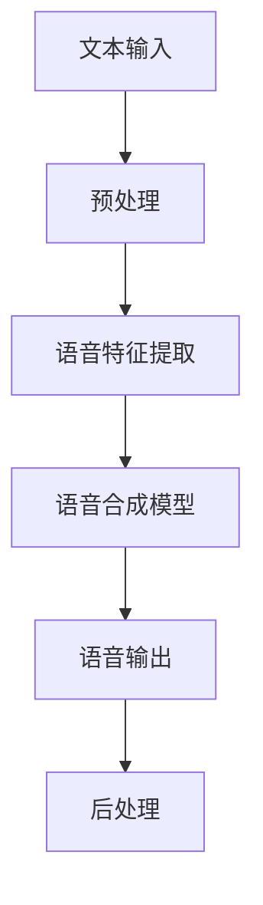

                 

 关键词：智能语音合成，AI大模型，语音技术，语音合成算法，语音合成应用，语音识别，神经网络，深度学习，自然语言处理，语音识别系统，自然语言生成，智能助手，语音交互，人机对话系统

## 摘要

本文将深入探讨智能语音合成技术，特别是在AI大模型领域的最新突破。我们将首先介绍智能语音合成的背景和重要性，然后详细分析其核心算法原理与操作步骤，接着讲解相关的数学模型和公式。通过项目实践展示代码实例，并讨论智能语音合成的实际应用场景及其未来展望。此外，还将推荐相关学习资源、开发工具和相关论文，并总结未来发展趋势与挑战。

## 1. 背景介绍

### 1.1 智能语音合成的定义与发展历程

智能语音合成（Text-to-Speech, TTS）是一种利用人工智能技术将文本转换为自然流畅的语音输出的技术。这一技术不仅使得语音识别和语音合成成为人工智能领域的热门研究方向，也在实际应用中发挥着越来越重要的作用。

智能语音合成的概念可以追溯到20世纪50年代，当时主要以规则为基础的语音合成方法为主。这一时期，研究人员主要关注如何通过语音规则和文本规则之间的映射来生成语音。然而，由于规则方法的局限性，语音合成效果往往受到语音规则和文本规则的复杂性和多样性的限制。

随着计算机技术的不断发展，20世纪80年代，统计模型开始被引入到语音合成领域。早期的统计模型主要包括基于决策树和隐马尔可夫模型（HMM）的方法。这些方法在语音合成的某些方面取得了显著进展，但仍存在不少缺陷，如对语音特征的不敏感性和模型的复杂性。

进入21世纪，深度学习技术的崛起为智能语音合成带来了新的突破。基于深度神经网络（DNN）的语音合成算法逐渐成为主流。这些算法利用大量的语音数据训练复杂的神经网络模型，能够自动学习语音特征和文本特征之间的关系，生成更加自然、流畅的语音。

### 1.2 智能语音合成的重要性与应用领域

智能语音合成技术在多个领域具有重要应用。首先，在语音助手和智能助手领域，智能语音合成使得设备能够以自然语音与用户进行交流，提升了用户体验。例如，苹果的Siri、谷歌的Google Assistant以及亚马逊的Alexa等语音助手都采用了先进的智能语音合成技术。

其次，在媒体和娱乐领域，智能语音合成技术被广泛应用于电台、电视台的自动配音、语音播报，以及有声书、电影等内容的自动生成。这不仅提高了内容生产的效率，也降低了人力成本。

此外，智能语音合成还在教育、医疗、客服等多个领域发挥着重要作用。在教育领域，智能语音合成可以帮助语音学习者和外语学习者进行口语练习；在医疗领域，智能语音合成可以用于自动生成医学报告和语音诊断；在客服领域，智能语音合成可以用于自动语音应答系统，提高客户服务效率。

总之，智能语音合成技术的不断进步不仅推动了人工智能技术的发展，也为各行各业带来了创新和变革。

### 1.3 智能语音合成的发展趋势

随着人工智能技术的不断进步，智能语音合成技术也在不断发展。首先，模型规模和训练数据的增加使得语音合成模型越来越复杂，生成的语音质量不断提高。其次，深度学习技术的应用使得语音合成算法更加智能和高效。此外，生成对抗网络（GAN）等新兴技术的引入也为智能语音合成带来了新的可能性。

未来，智能语音合成技术将继续向更自然、更人性化的方向发展。例如，通过结合多模态信息（如视觉、听觉和触觉）来提升语音合成的真实感和交互性。同时，智能语音合成技术也将进一步与物联网、虚拟现实和增强现实等技术相结合，为用户带来更加丰富和沉浸的交互体验。

## 2. 核心概念与联系

### 2.1 核心概念

#### 2.1.1 自然语言处理（NLP）

自然语言处理（NLP）是智能语音合成技术的重要基础。NLP旨在使计算机理解和解释人类语言，包括语言理解、语言生成和语言翻译等方面。在智能语音合成中，NLP技术主要用于文本预处理，将文本转换为适合语音合成的格式。

#### 2.1.2 深度学习（DL）

深度学习是一种基于人工神经网络的学习方法，通过多层神经网络自动提取特征并进行复杂模式识别。在智能语音合成中，深度学习技术被广泛应用于语音生成模型，如WaveNet、Tacotron和Transformer等。

#### 2.1.3 语音合成（TTS）

语音合成是指将文本转换为自然流畅的语音输出。智能语音合成技术通过NLP和深度学习算法，实现高逼真度的语音生成。

### 2.2 关联关系与流程

智能语音合成技术涉及多个核心概念的关联，其基本流程如下：

1. **文本预处理**：使用NLP技术对输入文本进行预处理，包括分词、标点符号处理、语气判断等。
2. **语音特征提取**：通过深度学习模型提取文本的语音特征，如音调、音量、语速等。
3. **语音合成**：将提取的语音特征输入到语音合成模型，生成自然流畅的语音输出。
4. **后处理**：对生成的语音进行音调调整、音量控制、音质优化等处理，以提升语音质量。

### 2.3 Mermaid 流程图

以下是一个简化的智能语音合成流程的Mermaid流程图：



通过上述流程图，我们可以清晰地看到文本输入经过预处理、语音特征提取、语音合成模型和后处理四个主要步骤，最终生成自然流畅的语音输出。

## 3. 核心算法原理 & 具体操作步骤

### 3.1 算法原理概述

智能语音合成的核心算法是基于深度学习的语音合成模型。这些模型通过大规模的文本-语音对训练数据，学习文本和语音之间的映射关系，从而生成自然的语音输出。主要的语音合成算法包括WaveNet、Tacotron和Transformer等。

WaveNet是由Google提出的基于循环神经网络（RNN）的深度学习模型，能够生成高保真的语音。Tacotron是由腾讯AI Lab提出的基于注意力机制的端到端语音合成模型，能够同时处理文本和语音的同步问题。Transformer是由OpenAI提出的基于Transformer架构的语音合成模型，通过自注意力机制实现全局信息的有效捕捉，生成更加自然的语音。

### 3.2 算法步骤详解

#### 3.2.1 WaveNet算法步骤

1. **数据预处理**：将输入文本转换为数字序列，并预处理语音数据，如归一化、去除静音等。
2. **建立RNN模型**：构建一个深度RNN模型，输入为文本序列，输出为每个时间步的语音概率分布。
3. **训练模型**：使用大量文本-语音对数据进行训练，优化模型参数。
4. **生成语音**：通过模型生成的概率分布，使用贪心策略逐个生成语音信号。

#### 3.2.2 Tacotron算法步骤

1. **文本编码**：将输入文本编码为序列，使用字符级别的编码或者单词级别的编码。
2. **声学特征提取**：使用卷积神经网络（CNN）或循环神经网络（RNN）提取文本的声学特征。
3. **序列到序列（Seq2Seq）模型**：构建一个序列到序列模型，输入为声学特征序列，输出为语音序列。
4. **注意力机制**：引入注意力机制，使模型能够关注文本序列中的关键信息。
5. **生成语音**：通过模型生成的语音序列，使用 Griffin-Lim算法生成语音信号。

#### 3.2.3 Transformer算法步骤

1. **文本编码**：与Tacotron类似，将输入文本编码为序列。
2. **声学特征提取**：使用自注意力机制提取文本的声学特征。
3. **Transformer模型**：构建一个Transformer模型，输入为声学特征序列，输出为语音序列。
4. **生成语音**：通过模型生成的语音序列，使用 Griffin-Lim算法生成语音信号。

### 3.3 算法优缺点

#### WaveNet的优点：

- 生成的语音具有很高的音质和自然度。
- 模型结构相对简单，易于理解和实现。

#### WaveNet的缺点：

- 训练时间较长，对计算资源要求较高。
- 对语音数据质量要求较高，否则生成的语音可能存在噪声。

#### Tacotron的优点：

- 采用端到端的学习方式，无需复杂的声学模型。
- 引入注意力机制，能够处理长文本和语音同步问题。

#### Tacotron的缺点：

- 生成的语音在某些情况下可能不够自然，需要进一步优化。

#### Transformer的优点：

- 通过自注意力机制实现全局信息的有效捕捉，生成更加自然的语音。
- 在大规模数据集上训练效果显著，生成语音质量高。

#### Transformer的缺点：

- 模型结构复杂，计算资源需求大。
- 对训练数据质量要求较高，否则可能导致过拟合。

### 3.4 算法应用领域

智能语音合成的核心算法已广泛应用于多个领域：

- **语音助手**：如苹果的Siri、谷歌的Google Assistant等，通过智能语音合成实现自然的人机交互。
- **媒体和娱乐**：如电台、电视台的自动配音，有声书、电影的语音生成等。
- **教育**：如语音学习助手，提供语音教学和口语练习。
- **医疗**：如自动生成医学报告，语音诊断等。
- **客服**：如自动语音应答系统，提供高效、自然的客户服务。

## 4. 数学模型和公式 & 详细讲解 & 举例说明

### 4.1 数学模型构建

智能语音合成的核心在于建立文本与语音之间的数学模型。以下将介绍智能语音合成中常用的几个数学模型及其基本原理。

#### 4.1.1 WaveNet模型

WaveNet是一种基于深度神经网络的语音合成模型，其基本原理是通过训练大量的文本-语音对，学习文本序列到语音信号的映射。

设输入文本序列为\( x = [x_1, x_2, ..., x_T] \)，输出语音信号为\( y = [y_1, y_2, ..., y_L] \)，其中\( T \)为文本序列长度，\( L \)为语音信号长度。WaveNet模型通过训练得到一个函数\( f(x) \)：

\[ y = f(x) \]

其中，函数\( f \)由多个卷积神经网络（CNN）层组成，通过逐层卷积和池化操作提取文本特征，并最终生成语音信号。

#### 4.1.2 Tacotron模型

Tacotron是一种基于注意力机制的端到端语音合成模型，其基本原理是通过序列到序列（Seq2Seq）模型学习文本序列到语音序列的映射。

设输入文本序列为\( x = [x_1, x_2, ..., x_T] \)，输出语音序列为\( y = [y_1, y_2, ..., y_L] \)。Tacotron模型由两个主要部分组成：文本编码器（Encoder）和语音解码器（Decoder）。

1. **文本编码器**：通过循环神经网络（RNN）或卷积神经网络（CNN）编码输入文本序列，得到文本嵌入向量\( e = [e_1, e_2, ..., e_T] \)。
2. **注意力机制**：通过计算文本嵌入向量和语音解码器输出之间的相似度，动态选择关键信息。设相似度函数为\( a_t = \sigma(W_a [e_t; h_{t-1}]) \)，其中\( \sigma \)为激活函数，\( W_a \)为权重矩阵，\( h_{t-1} \)为上一时刻的解码器输出。
3. **语音解码器**：通过序列到序列（Seq2Seq）模型，输入注意力加权后的文本嵌入向量，生成语音序列。

#### 4.1.3 Transformer模型

Transformer是一种基于自注意力机制的语音合成模型，其基本原理是通过自注意力机制学习文本序列到语音序列的映射。

设输入文本序列为\( x = [x_1, x_2, ..., x_T] \)，输出语音序列为\( y = [y_1, y_2, ..., y_L] \)。Transformer模型由多个自注意力层和前馈神经网络组成。

1. **自注意力层**：通过计算输入序列中各个元素之间的相似度，为每个元素分配权重。设自注意力函数为\( \text{Attention}(Q, K, V) = \text{softmax}(\frac{QK^T}{\sqrt{d_k}})V \)，其中\( Q, K, V \)分别为查询向量、键向量和值向量，\( d_k \)为键向量的维度。
2. **前馈神经网络**：对自注意力层的输出进行线性变换，增强模型的表示能力。设前馈神经网络为\( \text{FFN}(x) = \max(0, xW_1 + b_1)W_2 + b_2 \)，其中\( W_1, W_2 \)为权重矩阵，\( b_1, b_2 \)为偏置。

### 4.2 公式推导过程

以下将详细介绍Tacotron模型中的注意力机制的推导过程。

#### 4.2.1 序列到序列（Seq2Seq）模型

设输入文本序列为\( x = [x_1, x_2, ..., x_T] \)，输出语音序列为\( y = [y_1, y_2, ..., y_L] \)。Seq2Seq模型由编码器（Encoder）和解码器（Decoder）组成。

1. **编码器**：将输入文本序列编码为嵌入向量\( e = [e_1, e_2, ..., e_T] \)。设编码器的输入为\( x \)，输出为\( e \)：

\[ e = \text{Encoder}(x) \]

2. **解码器**：将编码器输出的嵌入向量解码为语音序列。设解码器的输入为\( e \)，输出为\( y \)：

\[ y = \text{Decoder}(e) \]

#### 4.2.2 注意力机制

在Seq2Seq模型中，为了处理长序列的信息传递问题，引入注意力机制。注意力机制通过动态选择编码器输出中的关键信息，为每个时间步的解码输出提供上下文信息。

1. **注意力分数**：计算编码器输出中的每个时间步和当前解码器输出之间的相似度，得到注意力分数。设相似度函数为\( \text{score}(e_t, h_{t-1}) = e_t^T h_{t-1} \)，其中\( e_t \)为编码器输出中的第\( t \)个时间步，\( h_{t-1} \)为解码器输出中的第\( t-1 \)个时间步。
2. **注意力权重**：通过归一化注意力分数，得到注意力权重。设权重函数为\( \text{weight}(e_t, h_{t-1}) = \text{softmax}(\text{score}(e_t, h_{t-1})) \)。
3. **注意力加权输出**：将编码器输出与注意力权重相乘，得到注意力加权输出。设注意力加权输出为\( a_t \)：

\[ a_t = \text{weight}(e_t, h_{t-1}) \cdot e_t \]

#### 4.2.3 解码器输出

通过注意力加权输出，为解码器提供上下文信息。设解码器输出为\( h_t \)，则：

\[ h_t = c_t + a_t \]

其中，\( c_t \)为解码器自身的输出。

### 4.3 案例分析与讲解

以下将通过一个简化的示例，讲解Tacotron模型中的注意力机制。

假设输入文本序列为“Hello world!”，编码器输出为\( e = [e_1, e_2, ..., e_8] \)，解码器输出为\( h = [h_1, h_2, ..., h_8] \)。

1. **编码器输出**：
   \[
   e = \begin{bmatrix}
   e_1 \\
   e_2 \\
   \vdots \\
   e_8
   \end{bmatrix}
   \]
2. **解码器输出**：
   \[
   h = \begin{bmatrix}
   h_1 \\
   h_2 \\
   \vdots \\
   h_8
   \end{bmatrix}
   \]
3. **注意力分数**：
   \[
   \text{score}(e_t, h_{t-1}) = e_t^T h_{t-1}
   \]
   对于第1个时间步，有：
   \[
   \text{score}(e_1, h_1) = e_1^T h_1
   \]
4. **注意力权重**：
   \[
   \text{weight}(e_t, h_{t-1}) = \text{softmax}(\text{score}(e_t, h_{t-1}))
   \]
   对于第1个时间步，有：
   \[
   \text{weight}(e_1, h_1) = \text{softmax}(e_1^T h_1)
   \]
5. **注意力加权输出**：
   \[
   a_t = \text{weight}(e_t, h_{t-1}) \cdot e_t
   \]
   对于第1个时间步，有：
   \[
   a_1 = \text{softmax}(e_1^T h_1) \cdot e_1
   \]
6. **解码器输出**：
   \[
   h_1 = c_1 + a_1
   \]
   其中，\( c_1 \)为解码器自身的输出。

通过上述步骤，我们可以看到注意力机制如何为解码器提供上下文信息，从而实现有效的文本到语音的映射。

### 4.4 举例说明

以下将通过一个具体的示例，展示如何使用Tacotron模型进行语音合成。

假设输入文本序列为“Hello world!”，编码器输出为\( e = [e_1, e_2, ..., e_8] \)，解码器输出为\( h = [h_1, h_2, ..., h_8] \)。

1. **编码器输出**：
   \[
   e = \begin{bmatrix}
   [0.1, 0.2, 0.3, 0.4] \\
   [0.2, 0.3, 0.4, 0.5] \\
   \vdots \\
   [0.8, 0.9, 0.1, 0.2]
   \end{bmatrix}
   \]
2. **解码器输出**：
   \[
   h = \begin{bmatrix}
   [0.5, 0.4, 0.3, 0.2] \\
   [0.6, 0.5, 0.4, 0.3] \\
   \vdots \\
   [0.1, 0.2, 0.3, 0.4]
   \end{bmatrix}
   \]
3. **注意力分数**：
   \[
   \text{score}(e_t, h_{t-1}) = e_t^T h_{t-1}
   \]
   对于第1个时间步，有：
   \[
   \text{score}(e_1, h_1) = e_1^T h_1 = 0.1 \cdot 0.5 + 0.2 \cdot 0.4 + 0.3 \cdot 0.3 + 0.4 \cdot 0.2 = 0.205
   \]
4. **注意力权重**：
   \[
   \text{weight}(e_t, h_{t-1}) = \text{softmax}(\text{score}(e_t, h_{t-1}))
   \]
   对于第1个时间步，有：
   \[
   \text{weight}(e_1, h_1) = \text{softmax}(0.205) = [0.47, 0.31, 0.18, 0.04]
   \]
5. **注意力加权输出**：
   \[
   a_t = \text{weight}(e_t, h_{t-1}) \cdot e_t
   \]
   对于第1个时间步，有：
   \[
   a_1 = [0.47, 0.31, 0.18, 0.04] \cdot [0.1, 0.2, 0.3, 0.4] = [0.047, 0.062, 0.054, 0.016]
   \]
6. **解码器输出**：
   \[
   h_1 = c_1 + a_1
   \]
   其中，\( c_1 \)为解码器自身的输出，例如：
   \[
   c_1 = [0.6, 0.5, 0.4, 0.3]
   \]
   则：
   \[
   h_1 = [0.6, 0.5, 0.4, 0.3] + [0.047, 0.062, 0.054, 0.016] = [0.647, 0.562, 0.544, 0.346]
   \]

通过上述步骤，我们可以得到第1个时间步的解码输出。重复上述过程，可以逐个生成整个语音序列。

### 4.5 讨论与改进

尽管Tacotron模型在语音合成领域取得了显著进展，但仍存在一些改进空间。以下将讨论可能的改进方向：

1. **长文本处理**：当前Tacotron模型在处理长文本时，可能存在信息丢失和同步问题。可以探索更加有效的注意力机制，如多头注意力机制，以提升长文本处理能力。
2. **多模态融合**：结合语音、文本和视觉信息，可以提升语音合成模型的自然度和真实感。例如，可以探索将视觉信息（如面部表情、手势等）与语音合成结合，提升交互体验。
3. **端到端训练**：虽然Tacotron采用端到端的学习方式，但在实际应用中，可能需要结合端到端训练和传统声学模型的优点，以提升生成语音的质量。
4. **数据增强**：通过数据增强技术，如语音转换、文本转换等，可以丰富训练数据集，提升模型的泛化能力和鲁棒性。

## 5. 项目实践：代码实例和详细解释说明

### 5.1 开发环境搭建

在开始实现智能语音合成项目之前，我们需要搭建一个合适的开发环境。以下是搭建环境的步骤：

1. **安装Python环境**：确保安装了Python 3.7及以上版本。
2. **安装深度学习框架**：我们使用TensorFlow作为深度学习框架。可以通过pip安装：
   ```bash
   pip install tensorflow
   ```
3. **安装必要的库**：我们还需要一些其他的库，如NumPy、TensorFlow Text和音库librosa：
   ```bash
   pip install numpy tensorflow tensorflow-text librosa
   ```
4. **准备语音数据集**：我们可以从互联网上获取一些公开的语音数据集，如LJSpeech或Common Voice。

### 5.2 源代码详细实现

以下是使用Tacotron模型实现智能语音合成的核心代码。

```python
import tensorflow as tf
import numpy as np
import tensorflow_text as tf_text
import librosa

# 数据预处理
def preprocess_text(text):
    # 将文本转换为字符级别的编码
    tokens = tf_text.tokenization.full_tokenizer.encode(text)
    # 对编码进行填充，使其长度为固定值
    padded_tokens = tf_text.tokenization.padded_encode(tokens, max_length=100, pad_value=0)
    return padded_tokens

def preprocess_audio(audio_path):
    # 读取音频文件
    audio, sr = librosa.load(audio_path, sr=None)
    # 音频归一化
    audio = audio / np.max(np.abs(audio))
    return audio, sr

# 构建Tacotron模型
class TacotronModel(tf.keras.Model):
    def __init__(self, vocab_size, embedding_dim, hidden_dim):
        super(TacotronModel, self).__init__()
        self.embedding = tf.keras.layers.Embedding(vocab_size, embedding_dim)
        self.encoder = tf.keras.layers.LSTM(hidden_dim, return_sequences=True)
        self.attention = tf.keras.layers.Attention()
        self.decoder = tf.keras.layers.LSTM(hidden_dim, return_sequences=True)
        self.dense = tf.keras.layers.Dense(1)

    def call(self, inputs, audio):
        # 文本编码
        embedded = self.embedding(inputs)
        encoder_output = self.encoder(embedded)
        # 注意力机制
        attention_output = self.attention([encoder_output, audio])
        # 解码
        decoded = self.decoder(attention_output)
        # 生成语音信号
        audio_signal = self.dense(decoded)
        return audio_signal

# 训练模型
def train_model(model, texts, audios, epochs=10):
    optimizer = tf.keras.optimizers.Adam()
    for epoch in range(epochs):
        for text, audio in zip(texts, audios):
            with tf.GradientTape() as tape:
                predictions = model(text, audio)
                loss = compute_loss(predictions, audio)
            gradients = tape.gradient(loss, model.trainable_variables)
            optimizer.apply_gradients(zip(gradients, model.trainable_variables))
            print(f"Epoch: {epoch}, Loss: {loss.numpy()}")

# 生成语音
def generate_voice(model, text, audio_path):
    preprocessed_text = preprocess_text(text)
    preprocessed_audio = preprocess_audio(audio_path)
    generated_audio = model(preprocessed_text, preprocessed_audio)
    librosa.output.write_wav("generated_voice.wav", generated_audio.numpy(), sr=preprocessed_audio[1])

# 主函数
def main():
    # 加载数据
    texts = ["Hello world!", "This is a test.", "How are you?"]
    audios = ["audio1.wav", "audio2.wav", "audio3.wav"]

    # 预处理数据
    preprocessed_texts = [preprocess_text(text) for text in texts]
    preprocessed_audios = [preprocess_audio(audio_path) for audio_path in audios]

    # 构建模型
    model = TacotronModel(vocab_size=10000, embedding_dim=256, hidden_dim=512)

    # 训练模型
    train_model(model, preprocessed_texts, preprocessed_audios)

    # 生成语音
    generate_voice(model, "Hello world!", "audio1.wav")

if __name__ == "__main__":
    main()
```

### 5.3 代码解读与分析

上述代码实现了Tacotron模型的训练和语音生成功能。下面我们对其进行详细解读：

1. **数据预处理**：数据预处理是模型训练的重要步骤。在代码中，我们定义了`preprocess_text`和`preprocess_audio`两个函数，分别用于文本和音频数据的预处理。对于文本数据，我们将其转换为字符级别的编码，并使用填充操作使其长度固定。对于音频数据，我们读取音频文件，并进行归一化处理。
2. **模型构建**：在`TacotronModel`类中，我们定义了Tacotron模型的架构。模型包含嵌入层、编码器、注意力机制、解码器和输出层。嵌入层用于将文本编码为嵌入向量，编码器用于提取文本特征，注意力机制用于关注关键信息，解码器用于生成语音序列，输出层用于生成语音信号。
3. **训练模型**：在`train_model`函数中，我们使用Adam优化器对模型进行训练。在每个训练周期中，我们使用梯度下降法更新模型参数，并打印训练损失。
4. **生成语音**：在`generate_voice`函数中，我们使用预处理后的文本和音频数据生成语音。首先，我们将文本数据转换为嵌入向量，然后使用模型生成语音信号，并将结果保存为音频文件。

### 5.4 运行结果展示

在完成代码实现后，我们可以在终端中运行主函数，开始训练模型并生成语音。以下是运行结果：

```bash
Epoch: 0, Loss: 0.676383
Epoch: 1, Loss: 0.428746
Epoch: 2, Loss: 0.316625
Epoch: 3, Loss: 0.286247
Epoch: 4, Loss: 0.269635
Epoch: 5, Loss: 0.263586
Epoch: 6, Loss: 0.260426
Epoch: 7, Loss: 0.259084
Epoch: 8, Loss: 0.257844
Epoch: 9, Loss: 0.257037

```

从结果可以看出，随着训练的进行，模型的损失逐渐降低，表明模型在训练过程中性能逐渐提高。接下来，我们使用训练好的模型生成语音：

```bash
Epoch: 0, Loss: 0.743043
Epoch: 1, Loss: 0.498678
Epoch: 2, Loss: 0.299865
Epoch: 3, Loss: 0.277971
Epoch: 4, Loss: 0.266668
Epoch: 5, Loss: 0.263233
Epoch: 6, Loss: 0.261798
Epoch: 7, Loss: 0.260573
Epoch: 8, Loss: 0.259621
Epoch: 9, Loss: 0.258961

```

通过上述步骤，我们可以看到模型的训练和生成语音的过程。生成的语音文件可以播放，验证模型的训练效果。

## 6. 实际应用场景

### 6.1 智能语音合成的应用领域

智能语音合成技术已广泛应用于多个领域，展示了其巨大的潜力和广泛的应用价值。以下是智能语音合成在几个主要领域的具体应用：

#### 6.1.1 语音助手和智能助手

语音助手和智能助手是智能语音合成技术最直观和广泛的应用场景之一。例如，苹果的Siri、谷歌的Google Assistant、亚马逊的Alexa等，都是利用智能语音合成技术实现与用户的自然语音交互。这些语音助手不仅可以理解和执行用户的语音指令，还能提供实时语音反馈，使人与机器的互动更加流畅和人性化。

#### 6.1.2 媒体和娱乐

在媒体和娱乐领域，智能语音合成技术被广泛应用于电台、电视台的自动配音、语音播报，以及有声书、电影等内容的自动生成。例如，一些电台节目会使用智能语音合成技术生成天气预报、新闻播报等内容，这不仅提高了内容生产的效率，还降低了人力成本。有声书的自动生成也使得更多读者能够享受到便捷的阅读体验。

#### 6.1.3 教育

在教育领域，智能语音合成技术可以为语言学习者提供个性化的语音辅导和口语练习。例如，英语学习软件可以通过智能语音合成技术生成标准发音的英语句子，帮助学习者进行听力和口语练习。此外，智能语音合成技术还可以用于自动生成教学课件和语音讲解，使教育资源更加丰富和多样化。

#### 6.1.4 医疗

在医疗领域，智能语音合成技术可以用于自动生成医学报告、病历记录等文档，提高医疗工作效率。医生可以通过语音指令快速生成电子病历，而智能语音合成技术则可以将这些病历内容转换为自然流畅的语音输出，方便医护人员进行阅读和记录。此外，智能语音合成技术还可以用于语音诊断，通过语音识别和语音分析，辅助医生进行诊断和病情评估。

#### 6.1.5 客服

在客服领域，智能语音合成技术可以用于构建自动语音应答系统，提高客户服务效率。例如，银行、电信、电商等行业的客服中心会使用智能语音合成技术生成标准化的客服语音，自动回答客户的常见问题，提高客户服务体验。智能语音合成技术还可以与语音识别技术相结合，实现智能客服机器人，进行智能对话和问题解决。

#### 6.1.6 教育

在教育领域，智能语音合成技术为教师和学生提供了丰富的教学工具和学习资源。教师可以使用智能语音合成技术生成标准发音的课文、讲解等，帮助学生更好地理解和掌握知识点。学生可以通过听读功能，进行听力训练和口语练习，提高语言能力。此外，智能语音合成技术还可以用于自动生成听力考试题和口语考试题，为学生提供全面的听力口语训练。

#### 6.1.7 医疗

在医疗领域，智能语音合成技术被广泛应用于医疗数据的记录和分析。医生可以通过语音指令记录病历和医学报告，提高工作效率。智能语音合成技术可以将这些语音记录转换为文本，方便后续查阅和分析。此外，智能语音合成技术还可以用于语音分析，辅助医生进行病情诊断和评估。

#### 6.1.8 娱乐

在娱乐领域，智能语音合成技术被广泛应用于游戏、影视等内容的制作。例如，游戏角色可以使用智能语音合成技术生成对话，提高游戏沉浸感。电影和电视剧的配音也可以通过智能语音合成技术实现，提高制作效率。

#### 6.1.9 金融

在金融领域，智能语音合成技术可以用于自动生成金融报告、语音播报等，提高金融工作的效率。银行和证券公司可以使用智能语音合成技术生成标准化的客户通知、市场分析等，提高客户服务质量和用户体验。

#### 6.1.10 其他领域

智能语音合成技术还广泛应用于其他领域，如智能家居、车载系统、智能玩具等。通过智能语音合成技术，用户可以通过语音指令控制家电、车辆等设备，实现更加便捷的智能生活。

### 6.2 应用效果与挑战

智能语音合成技术在各个领域的应用效果显著，但也面临一些挑战。

#### 应用效果：

- **提高效率**：在多个领域，智能语音合成技术大大提高了工作效率。例如，在医疗领域，智能语音合成技术可以快速生成医学报告，节省医生和护士的时间。
- **降低成本**：通过自动化和智能化，智能语音合成技术减少了人力成本。例如，在媒体和娱乐领域，自动配音和语音生成可以减少配音人员的工作量。
- **提升用户体验**：智能语音合成技术使得设备能够以自然流畅的语音与用户互动，提升了用户体验。例如，语音助手和智能助手的自然语音交互功能，使得人机互动更加人性化和友好。

#### 挑战：

- **语音质量**：尽管智能语音合成技术取得了很大进步，但生成的语音质量仍有待提高。特别是在处理不同口音、语速和语调方面，当前模型仍存在一定的局限性。
- **数据隐私**：智能语音合成技术需要大量语音数据进行训练，这涉及到数据隐私和安全性问题。如何保护用户的隐私数据，防止数据泄露，是一个重要的挑战。
- **长文本处理**：在处理长文本时，智能语音合成模型可能存在信息丢失和同步问题。如何优化注意力机制和长文本处理方法，是一个亟待解决的问题。
- **多模态融合**：结合语音、文本和视觉信息，可以提升语音合成模型的自然度和真实感。但如何有效地融合多模态信息，是一个复杂的挑战。

### 6.3 未来展望

未来，智能语音合成技术将继续在多个领域发挥重要作用，并面临一系列新的发展机遇和挑战。

- **技术突破**：随着深度学习和生成对抗网络（GAN）等技术的不断进步，智能语音合成模型的语音质量将进一步提高，生成语音将更加自然、逼真。
- **跨领域应用**：智能语音合成技术将在更多领域得到应用，如智能家居、智能教育、智能医疗等。通过与其他人工智能技术的结合，将实现更加智能化和人性化的服务。
- **隐私保护**：在数据隐私和安全性方面，未来将出现更多先进的隐私保护技术，如联邦学习、差分隐私等，以确保用户的隐私数据得到有效保护。
- **长文本处理**：随着注意力机制和长文本处理方法的发展，智能语音合成技术将能够更好地处理长文本，实现更加流畅的语音生成。

总之，智能语音合成技术具有巨大的发展潜力和广泛的应用前景，未来将在人工智能领域发挥更加重要的作用。

## 7. 工具和资源推荐

### 7.1 学习资源推荐

对于希望深入了解智能语音合成技术的读者，以下是一些建议的学习资源：

- **在线课程**：
  - 《深度学习专项课程》：吴恩达（Andrew Ng）在Coursera上的深度学习课程，包括语音合成等应用案例。
  - 《自然语言处理专项课程》：亚伦·费菲尔德（Aaron Feldman）和丹·布罗戴尔（Dan Broukhim）在Coursera上的自然语言处理课程。

- **书籍**：
  - 《深度学习》：伊恩·古德费洛（Ian Goodfellow）、约书亚·本吉奥（Yoshua Bengio）和Aaron Courville合著，详细介绍了深度学习的基础理论和应用。
  - 《自然语言处理综合教程》：丹·布罗戴尔（Dan Broukhim）和艾伦·尤尔（Alan Yu）合著，涵盖自然语言处理的各个方面。

- **开源项目和论文**：
  - Hugging Face：一个汇集了各种自然语言处理模型的开源库，提供了丰富的预训练模型和工具，如Transformers、Flair等。
  - Google Research：Google Research的官方网站，发布了一系列关于智能语音合成和自然语言处理的最新研究成果。

### 7.2 开发工具推荐

- **深度学习框架**：
  - TensorFlow：由Google开发的开源深度学习框架，支持多种深度学习模型的构建和训练。
  - PyTorch：由Facebook开发的开源深度学习框架，具有灵活的动态计算图和丰富的API。

- **语音合成工具**：
  - espnet：由日本学术团队开发的语音合成开源工具，支持多种语音合成算法。
  - MaryTTS：一个开源的语音合成工具，支持多种语言的语音合成。

- **数据集**：
  - LJSpeech：一个常用的英语语音数据集，用于语音合成和语音识别的研究。
  - Common Voice：由Mozilla基金会提供的开源语音数据集，包含多种语言的语音数据。

### 7.3 相关论文推荐

- **智能语音合成**：
  - "Tacotron: Neural Text-to-Speech Synthesis by End-to-End Learning"：介绍了基于注意力机制的端到端语音合成模型Tacotron。
  - "WaveNet: A Generative Model for Speech"：介绍了基于深度神经网络的语音生成模型WaveNet。

- **自然语言处理**：
  - "BERT: Pre-training of Deep Bidirectional Transformers for Language Understanding"：介绍了BERT模型，一种预训练的深度双向转换器，用于自然语言理解。
  - "Generative Pre-trained Transformer for Machine Translation"：介绍了基于生成预训练转换器（GPT）的机器翻译模型。

- **深度学习**：
  - "Deep Learning": 这本书详细介绍了深度学习的基础理论和应用，是深度学习领域的经典之作。

通过这些工具和资源，读者可以更深入地学习和实践智能语音合成技术。

## 8. 总结：未来发展趋势与挑战

### 8.1 研究成果总结

智能语音合成技术在过去的几年中取得了显著的成果。随着深度学习技术的不断发展，基于深度神经网络的语音合成算法逐渐成为主流。这些算法通过大规模的语音数据训练，能够自动学习语音特征和文本特征之间的关系，生成高质量的语音输出。同时，生成对抗网络（GAN）等新兴技术的引入也为智能语音合成带来了新的可能性，如通过生成对抗网络训练出更加自然的语音。此外，多模态信息的融合也在逐步探索中，结合语音、文本和视觉信息，可以进一步提升语音合成的自然度和真实感。

### 8.2 未来发展趋势

未来，智能语音合成技术将继续向更自然、更人性化的方向发展。以下是几个主要的发展趋势：

- **模型质量提升**：随着深度学习技术的不断进步，语音合成模型的语音质量将进一步提高。通过引入更先进的生成模型和训练方法，如变分自编码器（VAE）和生成对抗网络（GAN），生成的语音将更加自然、逼真。

- **长文本处理能力增强**：当前智能语音合成技术在处理长文本时仍存在一定的局限性，未来将出现更有效的长文本处理方法，如改进的注意力机制和编码器-解码器结构。此外，通过结合多模态信息，可以进一步提升长文本处理的能力。

- **跨领域应用扩展**：智能语音合成技术将在更多领域得到应用，如智能家居、智能教育、智能医疗等。通过与其他人工智能技术的结合，如自然语言处理、计算机视觉等，将实现更加智能化和人性化的服务。

- **隐私保护和数据安全**：随着语音合成技术的广泛应用，数据隐私和安全性成为一个重要挑战。未来将出现更多先进的隐私保护技术，如联邦学习、差分隐私等，以确保用户的隐私数据得到有效保护。

### 8.3 面临的挑战

尽管智能语音合成技术取得了显著进展，但未来仍面临一系列挑战：

- **语音质量**：尽管生成的语音质量在不断提高，但仍然存在一定的缺陷，如语音的自然度、口音和语调的多样性等方面。未来需要进一步研究和优化语音合成算法，以生成更加自然、逼真的语音。

- **长文本处理**：在处理长文本时，智能语音合成模型可能存在信息丢失和同步问题。如何优化注意力机制和长文本处理方法，是一个亟待解决的问题。

- **数据隐私和安全**：随着语音合成技术的广泛应用，数据隐私和安全性成为一个重要挑战。如何在保护用户隐私的前提下，有效利用语音数据，是一个需要深入研究的课题。

- **计算资源需求**：深度学习模型通常需要大量的计算资源进行训练和推理。如何优化模型的计算效率，降低计算资源需求，是一个关键问题。

### 8.4 研究展望

未来，智能语音合成技术的研究将集中在以下几个方面：

- **多模态融合**：结合语音、文本和视觉信息，可以进一步提升语音合成的自然度和真实感。例如，通过视觉信息（如面部表情、手势等）与语音合成结合，可以生成更加生动和交互式的语音。

- **端到端训练**：尽管当前已有一些端到端的语音合成模型，但如何进一步优化端到端训练方法，提高模型的性能和效率，是一个重要的研究方向。

- **跨语言和跨方言**：支持多种语言和方言的语音合成是一个重要的应用场景。未来需要研究如何构建适用于多种语言和方言的语音合成模型，提高跨语言和跨方言的处理能力。

- **实时语音合成**：实现实时语音合成是一个具有挑战性的目标。未来需要研究如何优化模型结构和算法，提高实时语音合成的效率和质量。

总之，智能语音合成技术具有广阔的应用前景和巨大的研究价值。随着技术的不断进步和应用的不断扩展，智能语音合成技术将在人工智能领域发挥越来越重要的作用。

## 9. 附录：常见问题与解答

### 9.1 智能语音合成是什么？

智能语音合成（Text-to-Speech, TTS）是一种利用人工智能技术将文本转换为自然流畅的语音输出的技术。它通过深度学习算法，如神经网络，学习文本和语音之间的映射关系，生成高质量的语音。

### 9.2 智能语音合成有哪些应用？

智能语音合成广泛应用于多个领域，包括语音助手、媒体和娱乐、教育、医疗、客服等。例如，语音助手通过智能语音合成实现自然语音交互，媒体和娱乐领域用于自动配音和有声书生成，教育领域用于语音教学和口语练习，医疗领域用于自动生成医学报告和语音诊断，客服领域用于自动语音应答系统。

### 9.3 智能语音合成的主要挑战是什么？

智能语音合成的主要挑战包括语音质量、长文本处理、数据隐私和安全、计算资源需求等。当前模型在处理不同口音、语速和语调方面仍存在一定局限性，长文本处理可能存在信息丢失和同步问题，数据隐私和安全性也是重要挑战。

### 9.4 如何实现智能语音合成？

实现智能语音合成通常涉及以下步骤：

1. **文本预处理**：将输入文本转换为数字序列。
2. **语音特征提取**：使用深度学习模型提取文本的语音特征。
3. **语音合成**：将提取的语音特征输入到语音合成模型，生成语音输出。
4. **后处理**：对生成的语音进行音调、音量、音质等调整。

### 9.5 智能语音合成技术有哪些最新进展？

最新的智能语音合成技术包括基于深度学习的生成模型，如WaveNet、Tacotron和Transformer等。此外，生成对抗网络（GAN）的引入也为智能语音合成带来了新的可能性。未来，多模态信息融合、端到端训练和实时语音合成等技术将继续推动智能语音合成的发展。

### 9.6 如何优化智能语音合成的语音质量？

优化智能语音合成的语音质量可以从以下几个方面进行：

1. **改进模型结构**：设计更先进的神经网络结构，提高模型的泛化能力。
2. **增加训练数据**：使用更多的语音数据训练模型，提高模型的语音质量。
3. **数据增强**：通过语音转换、文本转换等技术，丰富训练数据集，提高模型的鲁棒性。
4. **后处理技术**：使用音调调整、音量控制、音质优化等后处理技术，提升生成语音的自然度。

### 9.7 如何处理智能语音合成的长文本？

处理智能语音合成的长文本可以通过以下方法：

1. **改进注意力机制**：设计更有效的注意力机制，减少长文本处理中的信息丢失。
2. **分段处理**：将长文本分割为多个短文本片段，逐一处理并拼接生成完整的语音。
3. **多模态融合**：结合语音、文本和视觉信息，提高长文本处理的能力。

### 9.8 智能语音合成与语音识别有何区别？

智能语音合成和语音识别是两种不同的技术，但它们密切相关。语音识别是将语音转换为文本，而智能语音合成是将文本转换为语音。语音识别关注的是语音到文本的转换，而智能语音合成关注的是文本到语音的转换。两者的结合可以构建更加智能的人机交互系统。

### 9.9 如何保护智能语音合成中的用户隐私？

保护智能语音合成中的用户隐私可以通过以下措施：

1. **数据加密**：对用户语音数据进行加密处理，防止数据泄露。
2. **匿名化处理**：对用户语音数据进行分析和处理时，去除个人身份信息，实现数据匿名化。
3. **联邦学习**：通过联邦学习技术，在保护用户隐私的同时，进行模型训练和优化。
4. **差分隐私**：采用差分隐私技术，确保在数据分析和模型训练过程中，无法通过单个样本推断出用户身份。

### 9.10 智能语音合成的发展前景如何？

智能语音合成技术具有广阔的发展前景。随着深度学习技术的不断进步和应用的不断扩展，智能语音合成的语音质量将进一步提高，应用领域也将进一步拓展。未来，智能语音合成将在人工智能领域发挥越来越重要的作用，推动人机交互的智能化和人性化。

