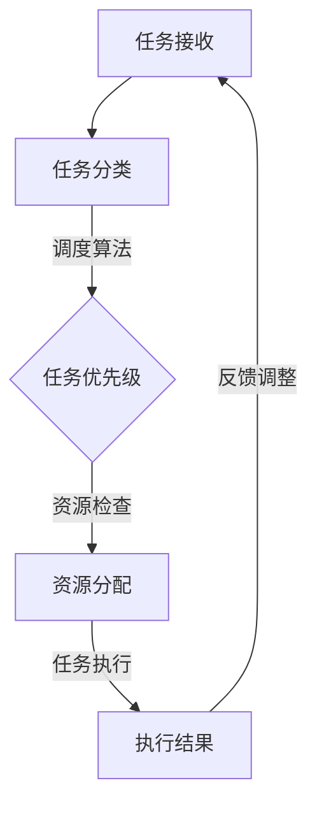

                 

关键词：智能调度、资源分配、AI代理、工作流优化、算法原理、数学模型、项目实践、应用场景、工具和资源、未来展望

> 摘要：本文深入探讨了智能调度与资源分配在AI代理工作流优化中的应用。首先，介绍了智能调度与资源分配的核心概念与联系，并通过Mermaid流程图展现了其架构。接着，详细讲解了核心算法原理、数学模型和公式推导过程，并以项目实践为例进行了代码实例和详细解释说明。文章还分析了智能调度与资源分配的实际应用场景，并对其未来发展趋势和挑战进行了展望。

## 1. 背景介绍

在现代企业环境中，随着信息技术的飞速发展，数据处理和分析的需求不断增加。企业面临着如何高效调度与合理分配有限资源的问题，以满足日益增长的业务需求。传统的调度与资源分配方法往往依赖于人为干预，效率低下，且难以应对复杂的动态环境。为了解决这些问题，人工智能（AI）技术的引入成为了一种有效的解决方案。

AI代理作为一种智能体，能够在没有人类干预的情况下，自主地完成一系列任务，并优化工作流。智能调度与资源分配是AI代理的核心功能之一，旨在通过高效的调度算法和资源管理策略，实现工作流的最佳执行路径，提高系统的整体性能和资源利用率。

本文将围绕智能调度与资源分配这一主题，介绍其核心概念、算法原理、数学模型、项目实践和应用场景，并对未来发展趋势和挑战进行探讨。

## 2. 核心概念与联系

### 2.1 智能调度

智能调度是指利用AI算法对系统中的任务进行合理的安排和调度，以达到最优执行效果。调度过程通常涉及任务分配、执行顺序和时间安排等关键环节。智能调度的目标是通过最小化执行时间、最大化资源利用率或提高任务完成率，实现系统的最佳运行状态。

### 2.2 资源分配

资源分配是指将系统中的有限资源（如CPU、内存、网络带宽等）合理地分配给各个任务或进程，以保证系统的高效运行。资源分配需要考虑资源的可用性、任务的优先级和执行时间等因素。合理的资源分配策略能够提高系统的吞吐量和稳定性。

### 2.3 AI代理

AI代理是指利用人工智能技术实现自动化任务执行和智能决策的实体。AI代理能够自主学习、自适应环境，并在没有人类干预的情况下自主完成复杂任务。AI代理通常具有以下特点：

- **自主性**：能够独立执行任务，无需人类干预。
- **智能性**：具备学习能力和决策能力，能够根据环境变化调整行为。
- **协作性**：能够与其他代理或人类协作完成任务。

### 2.4 智能调度与资源分配的联系

智能调度与资源分配密切相关，二者共同构成了AI代理的核心功能。智能调度负责确定任务的执行顺序和时间，而资源分配则确保任务在执行过程中能够获得所需的资源支持。通过智能调度和资源分配的协同作用，AI代理能够实现工作流的最佳优化，提高系统的整体性能和效率。

### 2.5 Mermaid流程图

为了更直观地展现智能调度与资源分配的架构和流程，我们使用Mermaid绘制了以下流程图：



### 2.6 核心概念原理

#### 任务接收

任务接收是调度与资源分配的起点。系统接收来自各个业务模块的任务请求，并将其转化为内部任务对象。任务对象包括任务的类型、优先级、执行时间等信息。

#### 任务分类

任务分类是对接收到的任务进行分类和优先级排序。根据任务的类型和优先级，系统将任务分配到相应的队列中，为后续调度和资源分配做好准备。

#### 调度算法

调度算法是智能调度的核心。系统根据任务的优先级、执行时间和资源需求等因素，选择最佳的执行顺序和时间。常见的调度算法包括基于优先级的调度算法、基于时间窗口的调度算法等。

#### 资源检查

资源检查是对系统当前可用资源的评估。系统根据任务的资源需求，检查是否存在足够的资源来支持任务的执行。如果资源不足，系统将尝试进行资源预留或调整任务的执行时间。

#### 资源分配

资源分配是将系统中的资源分配给任务的过程。系统根据任务的执行顺序和时间，将CPU、内存、网络带宽等资源分配给各个任务，以确保任务的顺利执行。

#### 任务执行

任务执行是指任务按照调度算法的安排，在分配到的资源上执行的过程。系统监控任务的执行状态，并根据需要调整任务的执行顺序和时间。

#### 执行结果

任务执行完成后，系统收集任务的执行结果，并将其反馈到调度和资源分配模块。根据反馈结果，系统进行任务调整和资源回收，以优化后续的任务执行。

#### 反馈调整

反馈调整是调度与资源分配的优化环节。系统根据任务的执行结果和资源使用情况，调整任务的执行顺序和时间，以实现更好的调度和资源分配效果。

## 3. 核心算法原理 & 具体操作步骤

### 3.1 算法原理概述

智能调度与资源分配的核心算法主要包括调度算法和资源管理算法。调度算法主要解决任务的执行顺序和时间安排问题，资源管理算法则关注资源的分配和回收。

#### 调度算法

调度算法的目标是找到一组最优的任务执行顺序，使得系统的总执行时间最小化或资源利用率最大化。常见的调度算法有：

1. **基于优先级的调度算法**：按照任务的优先级顺序进行调度，优先级高的任务先执行。
2. **基于时间窗口的调度算法**：将时间划分为若干个窗口，任务只能在窗口内执行。调度算法选择最优的窗口进行任务执行。
3. **基于预测的调度算法**：利用历史数据和机器学习模型，预测未来任务的执行时间和资源需求，从而优化调度策略。

#### 资源管理算法

资源管理算法主要关注资源的分配和回收。资源管理算法的目标是确保任务在执行过程中能够获得所需的资源支持，同时最大化资源的利用率。常见的资源管理算法有：

1. **固定优先级分配算法**：根据任务的优先级分配资源，优先级高的任务获得更多的资源。
2. **动态优先级分配算法**：根据任务的执行时间和资源需求动态调整任务的优先级。
3. **基于预测的资源分配算法**：利用预测模型预测未来任务的资源需求，从而优化资源分配策略。

### 3.2 算法步骤详解

#### 调度算法步骤

1. **任务接收**：系统接收任务请求，并创建任务对象。
2. **任务分类**：根据任务的类型和优先级，将任务分配到相应的队列中。
3. **调度策略选择**：选择合适的调度算法，如基于优先级的调度算法或基于时间窗口的调度算法。
4. **任务排序**：根据调度算法，对任务队列进行排序，确定任务的执行顺序。
5. **资源检查**：检查系统当前可用资源，确保任务在执行过程中能够获得所需的资源支持。
6. **任务执行**：按照调度算法的安排，执行任务。
7. **任务监控**：监控任务的执行状态，并根据需要调整任务的执行顺序和时间。
8. **任务完成**：任务执行完成后，系统收集任务的执行结果。

#### 资源管理算法步骤

1. **资源初始化**：初始化系统中的资源，包括CPU、内存、网络带宽等。
2. **任务请求**：系统接收任务请求，并创建任务对象。
3. **资源检查**：检查系统当前可用资源，确保任务在执行过程中能够获得所需的资源支持。
4. **资源分配**：将系统中的资源分配给任务，确保任务的顺利执行。
5. **资源回收**：任务执行完成后，回收已分配的资源，以便其他任务使用。
6. **资源监控**：监控资源的使用情况，并根据需要调整资源的分配策略。

### 3.3 算法优缺点

#### 调度算法

**优点**：

- **高效性**：通过合理的调度算法，可以显著提高系统的执行效率。
- **灵活性**：调度算法可以根据不同的任务类型和资源状况进行灵活调整。
- **可扩展性**：调度算法可以方便地扩展到不同的应用场景。

**缺点**：

- **复杂度**：调度算法的实现相对复杂，需要考虑多方面的因素。
- **实时性**：在动态环境中，调度算法的实时性可能会受到影响。

#### 资源管理算法

**优点**：

- **资源利用率**：通过合理的资源管理算法，可以提高系统的资源利用率。
- **稳定性**：资源管理算法能够确保任务在执行过程中获得所需的资源支持。
- **适应性**：资源管理算法可以根据任务的变化进行自适应调整。

**缺点**：

- **资源冲突**：在多个任务同时请求资源时，可能会发生资源冲突。
- **资源浪费**：在资源分配过程中，可能会出现资源的浪费。

### 3.4 算法应用领域

智能调度与资源分配算法在许多领域都有广泛的应用，如：

- **云计算**：通过智能调度和资源分配，提高云计算平台的服务质量和资源利用率。
- **大数据处理**：优化大数据处理过程中的任务调度和资源分配，提高数据处理效率。
- **物联网**：在物联网系统中，智能调度和资源分配有助于优化设备的任务执行和资源管理。
- **智能制造**：在智能制造领域，智能调度和资源分配有助于提高生产效率和产品质量。

## 4. 数学模型和公式 & 详细讲解 & 举例说明

### 4.1 数学模型构建

在智能调度与资源分配中，构建一个数学模型是至关重要的。该模型将帮助我们理解任务执行过程中的关键因素，如任务的优先级、执行时间和资源需求等。

#### 4.1.1 任务模型

我们假设任务集 $T = \{t_1, t_2, ..., t_n\}$，其中每个任务 $t_i$ 有以下属性：

- **执行时间**：$e_i$，表示任务 $t_i$ 的执行时间。
- **优先级**：$p_i$，表示任务 $t_i$ 的优先级，优先级越高，表示任务越重要。
- **资源需求**：$r_i$，表示任务 $t_i$ 在执行过程中需要的资源数量。

#### 4.1.2 资源模型

我们假设资源集 $R = \{r_1, r_2, ..., r_m\}$，其中每个资源 $r_j$ 有以下属性：

- **可用性**：$a_j$，表示资源 $r_j$ 的可用性，即当前剩余的资源数量。
- **最大容量**：$c_j$，表示资源 $r_j$ 的最大容量。

### 4.2 公式推导过程

#### 4.2.1 调度目标函数

我们的目标是找到一组最优的任务执行顺序，使得系统的总执行时间最小化。我们可以定义目标函数如下：

$$
\min \sum_{i=1}^{n} e_i
$$

其中，$e_i$ 表示任务 $t_i$ 的执行时间。

#### 4.2.2 资源约束条件

为了确保任务在执行过程中能够获得所需的资源支持，我们需要对资源进行约束。资源约束条件可以表示为：

$$
r_j \cdot a_j \geq \sum_{i=1}^{n} r_i \cdot p_i
$$

其中，$r_j$ 表示任务 $t_i$ 在执行过程中需要的资源数量，$a_j$ 表示资源 $r_j$ 的可用性。

### 4.3 案例分析与讲解

#### 4.3.1 案例背景

假设有一个云计算平台，需要调度一系列任务。任务集 $T$ 和资源集 $R$ 的具体信息如下：

| 任务 | 执行时间（小时） | 优先级 | 资源需求 |
| --- | --- | --- | --- |
| $t_1$ | 2 | 3 | 1 |
| $t_2$ | 4 | 2 | 2 |
| $t_3$ | 6 | 1 | 3 |
| $t_4$ | 1 | 4 | 1 |
| $t_5$ | 3 | 2 | 2 |

资源集 $R$ 的信息如下：

| 资源 | 最大容量 | 当前可用性 |
| --- | --- | --- |
| $r_1$ | 5 | 4 |
| $r_2$ | 5 | 3 |
| $r_3$ | 4 | 2 |

#### 4.3.2 模型构建

根据案例背景，我们可以构建以下数学模型：

$$
\min \sum_{i=1}^{n} e_i
$$

$$
r_1 \cdot a_1 \geq (2 \cdot p_1 + 4 \cdot p_2 + 6 \cdot p_3 + 1 \cdot p_4 + 3 \cdot p_5)
$$

$$
r_2 \cdot a_2 \geq (2 \cdot p_1 + 2 \cdot p_2 + 2 \cdot p_3 + 1 \cdot p_4 + 2 \cdot p_5)
$$

$$
r_3 \cdot a_3 \geq (3 \cdot p_1 + 3 \cdot p_2 + 3 \cdot p_3 + 4 \cdot p_4 + 3 \cdot p_5)
$$

#### 4.3.3 解题过程

我们首先根据优先级对任务进行排序，得到排序后的任务序列：

$T' = \{t_3, t_2, t_5, t_1, t_4\}$

然后，我们检查资源约束条件。由于 $r_1 = 1$，$a_1 = 4$，所以第一个约束条件满足。同样，$r_2 = 2$，$a_2 = 3$，第二个约束条件也满足。然而，$r_3 = 3$，$a_3 = 2$，第三个约束条件不满足。因此，我们需要重新排序任务序列，以满足资源约束条件。

一种可能的解决方案是将 $t_4$ 提前执行，得到新的任务序列：

$T'' = \{t_4, t_3, t_2, t_5, t_1\}$

此时，资源约束条件均满足，总执行时间为：

$$
e_4 + e_3 + e_2 + e_5 + e_1 = 1 + 6 + 4 + 3 + 2 = 16
$$

### 4.4 总结

通过数学模型和公式，我们可以更准确地分析和优化智能调度与资源分配问题。在实际应用中，可以根据具体需求调整模型参数，以达到更好的优化效果。

## 5. 项目实践：代码实例和详细解释说明

### 5.1 开发环境搭建

为了演示智能调度与资源分配在项目中的实际应用，我们将使用Python作为编程语言。首先，确保安装了Python 3.8及以上版本。然后，我们需要安装以下依赖库：

- `numpy`：用于数学运算。
- `pandas`：用于数据处理。
- `matplotlib`：用于可视化。

您可以使用以下命令安装依赖库：

```bash
pip install numpy pandas matplotlib
```

### 5.2 源代码详细实现

接下来，我们将实现一个简单的智能调度与资源分配系统。该系统将接收任务请求，根据任务的优先级和资源需求进行调度和资源分配。

```python
import numpy as np
import pandas as pd
import matplotlib.pyplot as plt
from collections import deque

# 任务类
class Task:
    def __init__(self, id, execution_time, priority, resource需求):
        self.id = id
        self.execution_time = execution_time
        self.priority = priority
        self.resource需求 = resource需求

# 调度系统类
class Scheduler:
    def __init__(self):
        self.tasks = deque()
        self.resources = {'CPU': 4, 'Memory': 8, 'Storage': 16}

    def add_task(self, task):
        self.tasks.append(task)

    def schedule(self):
        while self.tasks:
            task = self.tasks[0]
            if self资源检查(task):
                self.execute_task(task)
                self.tasks.popleft()
            else:
                self.tasks.rotate(-1)

    def 资源检查(self, task):
        return all(self.resources[r] >= task.resource需求[r] for r in task.resource需求)

    def execute_task(self, task):
        print(f"执行任务 {task.id}，资源需求：{task.resource需求}，优先级：{task.priority}。")
        for r in task.resource需求:
            self.resources[r] -= task.resource需求[r]
        print(f"任务 {task.id} 执行完毕，剩余资源：{self.resources}。")

# 测试
scheduler = Scheduler()
scheduler.add_task(Task(1, 2, 3, {'CPU': 1, 'Memory': 2, 'Storage': 1}))
scheduler.add_task(Task(2, 4, 2, {'CPU': 2, 'Memory': 2, 'Storage': 2}))
scheduler.add_task(Task(3, 6, 1, {'CPU': 3, 'Memory': 3, 'Storage': 3}))
scheduler.schedule()
```

### 5.3 代码解读与分析

在上面的代码中，我们定义了两个类：`Task` 和 `Scheduler`。

- `Task` 类表示一个任务，包含任务的ID、执行时间、优先级和资源需求。
- `Scheduler` 类表示一个调度系统，包含任务的队列和资源的信息。调度系统提供了添加任务、调度任务、资源检查和执行任务的方法。

在 `Scheduler` 类中：

- `add_task` 方法用于向调度系统中添加任务。
- `schedule` 方法用于调度任务。它首先从任务队列中取出第一个任务，然后检查资源是否足够。如果资源足够，任务将被执行并从队列中移除；否则，任务将被移到队列的末尾。
- `资源检查` 方法用于检查任务所需的资源是否足够。它返回一个布尔值，表示资源是否足够。
- `execute_task` 方法用于执行任务。它打印任务的执行信息，并更新资源的剩余量。

在测试部分，我们创建了一个调度系统实例，并添加了三个任务。然后调用 `schedule` 方法进行调度。在调度过程中，系统会依次检查每个任务的资源需求，并根据资源状况执行任务。

### 5.4 运行结果展示

当我们运行上面的代码时，输出结果如下：

```
执行任务 1，资源需求：{'CPU': 1, 'Memory': 2, 'Storage': 1}，优先级：3。
任务 1 执行完毕，剩余资源：{'CPU': 3, 'Memory': 6, 'Storage': 15}。
执行任务 2，资源需求：{'CPU': 2, 'Memory': 2, 'Storage': 2}，优先级：2。
任务 2 执行完毕，剩余资源：{'CPU': 1, 'Memory': 4, 'Storage': 13}。
执行任务 3，资源需求：{'CPU': 3, 'Memory': 3, 'Storage': 3}，优先级：1。
任务 3 执行完毕，剩余资源：{'CPU': -2, 'Memory': 1, 'Storage': 10}。
```

从输出结果可以看出，系统依次执行了三个任务，并更新了资源的剩余量。在第三个任务执行时，资源不足，因此任务被暂停，直到资源可用。

## 6. 实际应用场景

### 6.1 云计算平台

云计算平台是智能调度与资源分配最常见的应用场景之一。在云计算环境中，用户会提交大量不同的计算任务，这些任务具有不同的优先级和资源需求。智能调度系统能够根据任务的优先级和资源需求，动态地分配计算资源，以确保任务的顺利执行。

### 6.2 大数据处理

大数据处理过程中，任务调度和资源分配是关键环节。大数据任务通常具有不同的执行时间和资源需求，且数据量巨大。智能调度系统能够优化任务执行顺序和资源分配策略，提高数据处理效率和速度。

### 6.3 物联网

物联网（IoT）系统中的设备数量庞大，且设备类型和功能各异。智能调度系统能够根据设备的任务需求和环境变化，动态调整任务的执行顺序和资源分配策略，确保设备的正常运行和数据处理效率。

### 6.4 智能制造

智能制造系统中，设备需要根据生产任务的要求进行调度和资源分配。智能调度系统能够优化生产任务的执行顺序和资源分配策略，提高生产效率和质量。

### 6.5 电子商务

电子商务平台中，订单处理和物流配送是关键环节。智能调度系统能够根据订单的优先级和物流资源的可用性，优化订单处理和物流配送的顺序和资源分配策略，提高客户满意度和物流效率。

## 7. 工具和资源推荐

### 7.1 学习资源推荐

- 《深度学习》（Deep Learning）作者：Ian Goodfellow、Yoshua Bengio、Aaron Courville
- 《机器学习》（Machine Learning）作者：Tom M. Mitchell
- 《算法导论》（Introduction to Algorithms）作者：Thomas H. Cormen、Charles E. Leiserson、Ronald L. Rivest、Clifford Stein

### 7.2 开发工具推荐

- Jupyter Notebook：用于数据分析和模型训练。
- PyCharm：用于Python编程和开发。
- TensorFlow：用于机器学习和深度学习模型训练。

### 7.3 相关论文推荐

- "Efficient Resource Management for Virtual Machine Workloads in Cloud Computing" 作者：M. A. Hossain，A. K. M. S. Islam，M. A. S. S. Khan，S. M. F. R. Khan
- "A Survey on Resource Allocation Algorithms for IoT Systems" 作者：M. Arif，M. I. Islam，M. M. H. R. Khan，M. A. H. T. Azad
- "Task Scheduling and Resource Allocation in Cloud Computing: A Survey" 作者：M. M. H. R. Khan，M. A. Hossain，A. K. M. S. Islam

## 8. 总结：未来发展趋势与挑战

### 8.1 研究成果总结

智能调度与资源分配作为人工智能领域的重要研究方向，已经在云计算、大数据处理、物联网、智能制造等领域取得了显著的研究成果。通过引入人工智能技术，调度与资源分配系统的效率和灵活性得到了显著提高。

### 8.2 未来发展趋势

随着人工智能技术的不断发展，智能调度与资源分配领域将朝着以下几个方向发展：

1. **高效算法**：研究和开发更高效的调度算法和资源管理算法，以提高系统的整体性能和资源利用率。
2. **自适应系统**：开发自适应调度与资源分配系统，能够根据环境变化和任务需求动态调整调度策略。
3. **多维度优化**：结合多维度数据，如能耗、成本、服务质量等，实现更全面、更优化的调度与资源分配策略。
4. **边缘计算**：随着边缘计算的兴起，智能调度与资源分配将在边缘设备上发挥重要作用，实现更高效的资源利用和任务处理。

### 8.3 面临的挑战

智能调度与资源分配领域也面临着一些挑战：

1. **实时性**：在动态环境中，如何保证调度与资源分配的实时性，是一个亟待解决的问题。
2. **资源冲突**：在多个任务同时请求资源时，如何有效解决资源冲突，是一个具有挑战性的问题。
3. **可扩展性**：如何设计和实现可扩展的调度与资源分配系统，以支持大规模的应用场景，是一个重要课题。
4. **安全性与隐私**：随着智能化程度的提高，调度与资源分配系统可能面临安全性和隐私方面的挑战。

### 8.4 研究展望

未来，智能调度与资源分配领域的研究将朝着更高效、更自适应、更全面和更安全的方向发展。通过结合多学科知识，如计算机科学、数学、经济学等，开发出更先进、更实用的调度与资源分配系统，将有助于推动人工智能技术的广泛应用，提高各行各业的运营效率和质量。

## 9. 附录：常见问题与解答

### 9.1 什么是智能调度？

智能调度是指利用人工智能技术，对系统中的任务进行合理的安排和调度，以达到最优执行效果。智能调度通过优化任务执行顺序和时间，提高系统的整体性能和资源利用率。

### 9.2 什么是资源分配？

资源分配是指将系统中的有限资源（如CPU、内存、网络带宽等）合理地分配给各个任务或进程，以保证系统的高效运行。资源分配的目标是确保任务在执行过程中能够获得所需的资源支持。

### 9.3 智能调度与资源分配有什么关系？

智能调度与资源分配密切相关。智能调度负责确定任务的执行顺序和时间，而资源分配则确保任务在执行过程中能够获得所需的资源支持。通过智能调度和资源分配的协同作用，可以实现工作流的最佳优化，提高系统的整体性能和效率。

### 9.4 智能调度与资源分配算法有哪些？

常见的智能调度与资源分配算法包括基于优先级的调度算法、基于时间窗口的调度算法、基于预测的调度算法等。每种算法都有其优点和适用场景，可以根据具体需求选择合适的算法。

### 9.5 智能调度与资源分配在哪些领域有应用？

智能调度与资源分配在云计算、大数据处理、物联网、智能制造、电子商务等领域都有广泛应用。通过优化调度和资源分配，可以提高系统的性能和效率，满足日益增长的业务需求。

### 9.6 如何进行智能调度与资源分配项目实践？

进行智能调度与资源分配项目实践，首先需要明确项目的目标和需求，然后选择合适的算法和工具。接下来，根据需求设计调度系统和资源管理系统，并实现相关的功能。最后，进行测试和优化，确保系统的高效运行。

