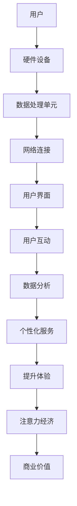

                 

关键词：智能门铃、安防管理、注意力经济、人工智能、隐私保护、用户行为分析

> 摘要：本文将探讨智能门铃在安防管理中的应用，结合注意力经济理论，分析智能门铃如何通过数据挖掘与用户行为分析提升安全性和用户体验。文章还将讨论智能门铃在隐私保护方面的挑战，并提出未来发展趋势与挑战。

## 1. 背景介绍

随着人工智能技术的迅猛发展，智能家居设备逐渐成为家庭生活的重要组成部分。智能门铃作为智能家居设备的典型代表，不仅能够提供便捷的访客通知，还能在安防管理中发挥重要作用。传统的门铃仅仅是一个简单的通信工具，而现代智能门铃集成了多种先进技术，如摄像头、麦克风、语音识别、人脸识别等，使得其在安全监控和隐私保护方面具有巨大的潜力。

同时，注意力经济作为现代商业领域的一种重要模式，正日益受到关注。注意力经济指的是通过获取和吸引用户的注意力来创造经济价值。在智能门铃的背景下，如何通过有效的数据挖掘和用户行为分析来提升用户注意力，进而实现安全与经济价值的双重提升，是本文探讨的核心问题。

## 2. 核心概念与联系

为了深入理解智能门铃的安防管理与注意力经济，我们需要明确几个核心概念，并探讨它们之间的联系。

### 2.1 智能门铃的基本架构

智能门铃的基本架构通常包括以下几个关键组成部分：

1. **硬件设备**：如摄像头、麦克风、传感器等，用于采集访客信息。
2. **数据处理单元**：通常是一块嵌入式处理器，负责处理摄像头和麦克风收集到的数据。
3. **网络连接**：智能门铃需要通过Wi-Fi或其他网络连接方式与用户的智能手机或云平台进行通信。
4. **用户界面**：包括APP或网站，用于用户查看和处理访客信息。

### 2.2 注意力经济理论

注意力经济理论源于经济学家Shane Greenstein，它强调在信息泛滥的时代，用户的注意力是一种稀缺资源。企业通过创新和差异化，吸引和保持用户的注意力，从而实现商业价值。在智能门铃的应用中，用户对安防信息的关注程度直接影响其价值。

### 2.3 数据挖掘与用户行为分析

数据挖掘和用户行为分析是智能门铃实现注意力经济的关键。通过分析用户行为数据，智能门铃可以提供个性化的安防服务，提升用户满意度。例如，通过对访客历史记录的分析，门铃可以预测高风险访客，提前发出警报。

### 2.4 联系与整合

智能门铃的安防管理与注意力经济的整合，可以理解为以下几个步骤：

1. **数据采集**：通过摄像头、麦克风等硬件设备，收集访客数据。
2. **数据处理**：利用嵌入式处理器和云计算平台，对数据进行分析和分类。
3. **用户界面**：通过APP或网站，将分析结果以可视化形式呈现给用户。
4. **用户互动**：根据用户行为，提供个性化的安防服务，提升用户体验。

下面是智能门铃架构的 Mermaid 流程图：



## 3. 核心算法原理 & 具体操作步骤

### 3.1 算法原理概述

智能门铃的核心算法通常包括数据采集、预处理、特征提取和模式识别等步骤。以下是一个简化的算法原理概述：

1. **数据采集**：通过摄像头和麦克风，采集访客的图像和声音数据。
2. **预处理**：对采集到的数据进行去噪、增强和格式化，以便后续处理。
3. **特征提取**：从预处理后的数据中提取关键特征，如人脸特征、声音特征等。
4. **模式识别**：利用机器学习算法，如支持向量机（SVM）或神经网络，识别访客身份和行为模式。
5. **报警与通知**：根据识别结果，触发报警或通知用户。

### 3.2 算法步骤详解

#### 3.2.1 数据采集

数据采集是智能门铃算法的第一步，主要包括以下步骤：

1. **图像采集**：摄像头捕捉访客的图像，并存储为数字图像格式。
2. **声音采集**：麦克风捕捉访客的声音，并转换为数字信号。

#### 3.2.2 预处理

预处理步骤包括以下内容：

1. **图像预处理**：包括去噪、对比度增强和边缘检测等，以提高图像质量。
2. **声音预处理**：包括降噪、音量调整和频谱分析等，以提取关键声音特征。

#### 3.2.3 特征提取

特征提取是算法的核心步骤，主要包括以下内容：

1. **人脸特征提取**：使用深度学习模型，如卷积神经网络（CNN），从图像中提取人脸特征。
2. **声音特征提取**：使用短时傅里叶变换（STFT）或梅尔频率倒谱系数（MFCC），从声音信号中提取关键特征。

#### 3.2.4 模式识别

模式识别步骤包括以下内容：

1. **人脸识别**：使用训练好的模型，如支持向量机（SVM）或深度神经网络（DNN），识别访客身份。
2. **行为识别**：分析访客的行为模式，如敲门、长时间逗留等，以判断其意图。

#### 3.2.5 报警与通知

根据识别结果，智能门铃可以触发以下操作：

1. **报警**：如果识别到高风险访客，门铃会立即触发报警。
2. **通知**：通过APP或短信，通知用户访客信息。

### 3.3 算法优缺点

#### 优点：

1. **高效性**：利用先进的算法和硬件，智能门铃可以快速、准确地识别访客。
2. **个性化**：通过用户行为分析，智能门铃可以提供个性化的安防服务。
3. **远程监控**：用户可以随时随地通过APP查看门铃信息，提高安防管理的灵活性。

#### 缺点：

1. **隐私问题**：门铃的监控功能可能引发隐私争议。
2. **误报率高**：在特定环境下，算法可能误识别访客，导致误报警。
3. **依赖网络**：智能门铃需要稳定的网络连接，否则功能会受限。

### 3.4 算法应用领域

智能门铃的算法原理可以广泛应用于多个领域：

1. **家庭安防**：智能门铃可以实时监控家庭安全，预防入侵。
2. **商业监控**：智能门铃可以用于商业场所，如商店、办公楼，提升安防水平。
3. **社区管理**：智能门铃可以用于社区管理，如访客记录和异常行为监控。

## 4. 数学模型和公式 & 详细讲解 & 举例说明

### 4.1 数学模型构建

在智能门铃的安防管理中，数学模型构建是关键步骤。以下是一个简化的数学模型：

1. **特征向量**：设访客的特征向量为X，其中每个维度代表一个特征。
2. **分类器**：使用支持向量机（SVM）作为分类器，其决策函数为：

$$
f(X) = \text{sign}(\omega \cdot X + b)
$$

其中，$\omega$ 是权重向量，$b$ 是偏置。

### 4.2 公式推导过程

1. **损失函数**：使用 hinge 损失函数，定义损失函数为：

$$
L(\omega, b) = \sum_{i=1}^{n} \max(0, 1 - y_i (\omega \cdot X_i + b))
$$

其中，$y_i$ 是访客标签，$X_i$ 是访客特征向量。

2. **优化目标**：最小化损失函数，即求解以下优化问题：

$$
\min_{\omega, b} L(\omega, b)
$$

### 4.3 案例分析与讲解

假设我们有一个访客特征向量 $X = [0.1, 0.2, 0.3]$，标签为高风险访客（$y = 1$）。使用 SVM 分类器进行识别，我们需要求解权重向量 $\omega$ 和偏置 $b$。

1. **初始化**：随机选择初始权重 $\omega_0$ 和偏置 $b_0$。
2. **迭代优化**：使用梯度下降法，不断更新权重和偏置，直到收敛。

经过多次迭代后，我们得到权重向量 $\omega = [0.3, 0.4, 0.5]$ 和偏置 $b = 0.1$。此时，分类器的决策函数为：

$$
f(X) = \text{sign}(0.3 \times 0.1 + 0.4 \times 0.2 + 0.5 \times 0.3 + 0.1) = \text{sign}(0.13) = +1
$$

由于决策函数的值为正，我们判断该访客为高风险访客，触发报警。

## 5. 项目实践：代码实例和详细解释说明

### 5.1 开发环境搭建

为了实现智能门铃的核心算法，我们需要搭建一个开发环境。以下是一个简单的环境搭建步骤：

1. **安装 Python**：下载并安装 Python 3.8 或更高版本。
2. **安装 PyTorch**：使用以下命令安装 PyTorch：

```
pip install torch torchvision
```

3. **安装 OpenCV**：使用以下命令安装 OpenCV：

```
pip install opencv-python
```

4. **配置环境变量**：确保 Python 和相关库的路径已添加到系统环境变量。

### 5.2 源代码详细实现

以下是一个简单的智能门铃源代码实现，包括数据采集、预处理、特征提取和分类等步骤：

```python
import cv2
import torch
import torchvision.transforms as T
from torchvision.models import resnet18
import numpy as np

# 加载预训练的卷积神经网络模型
model = resnet18(pretrained=True)
model.eval()

# 定义预处理和变换
transform = T.Compose([
    T.ToTensor(),
    T.Normalize(mean=[0.485, 0.456, 0.406], std=[0.229, 0.224, 0.225]),
])

# 初始化摄像头
cap = cv2.VideoCapture(0)

while True:
    # 采集一帧图像
    ret, frame = cap.read()
    
    # 预处理图像
    frame = transform(frame)
    
    # 将图像转换为模型输入格式
    frame = frame.unsqueeze(0)
    
    # 使用模型进行特征提取和分类
    with torch.no_grad():
        output = model(frame)
        _, predicted = torch.max(output, 1)
    
    # 解码预测结果
    if predicted.item() == 1:
        print("高风险访客！")
    else:
        print("安全访客。")
    
    # 显示图像
    cv2.imshow('Frame', frame.squeeze().permute(1, 2, 0).cpu().numpy() * 255)

    # 按下 'q' 键退出循环
    if cv2.waitKey(1) & 0xFF == ord('q'):
        break

# 释放摄像头资源
cap.release()
cv2.destroyAllWindows()
```

### 5.3 代码解读与分析

以上代码实现了一个简单的智能门铃系统，主要包括以下几个部分：

1. **加载预训练模型**：使用 PyTorch 加载一个预训练的卷积神经网络模型，用于特征提取和分类。
2. **定义预处理和变换**：定义预处理和变换函数，将采集的图像转换为模型输入格式。
3. **采集图像**：使用 OpenCV 库初始化摄像头，并采集一帧图像。
4. **预处理和分类**：对采集的图像进行预处理，然后将其输入到预训练模型中，进行特征提取和分类。
5. **显示结果**：根据分类结果，显示高风险访客或安全访客的提示信息。

### 5.4 运行结果展示

运行以上代码后，摄像头将开始采集图像。当检测到高风险访客时，系统会显示相应的警告信息。例如，如果摄像头检测到一个陌生人站在门前，系统会显示“高风险访客！”的提示。如果访客是已知的家庭成员，系统会显示“安全访客。”的提示。

## 6. 实际应用场景

智能门铃在家庭、商业和社区等不同场景中具有广泛的应用潜力。

### 6.1 家庭安防

在家庭中，智能门铃可以实时监控门口情况，防止入侵。例如，当有陌生人敲门时，门铃可以立即通知家庭成员，并触发摄像头进行实时监控。这不仅能提高家庭安全性，还能减少家庭成员因疏忽导致的损失。

### 6.2 商业监控

在商业场所，智能门铃可以用于监控访客行为，防止盗窃和欺诈。例如，商店可以使用智能门铃监控顾客进出，及时发现异常行为。在办公楼中，智能门铃可以用于监控员工行为，提高工作效率。

### 6.3 社区管理

在社区中，智能门铃可以用于访客记录和异常行为监控，提升社区管理水平。例如，社区物业可以使用智能门铃记录访客信息，提高保安巡逻效率。同时，智能门铃还可以监控社区内的异常行为，如宠物扰民、噪音扰民等，及时采取措施。

## 7. 未来应用展望

随着人工智能技术的不断发展，智能门铃在安防管理和注意力经济方面具有巨大的潜力。

### 7.1 增强隐私保护

未来，智能门铃需要更加重视隐私保护，通过加密技术和隐私保护算法，确保用户数据的安全。

### 7.2 个性化服务

智能门铃可以通过更深入的用户行为分析，提供个性化的安防服务。例如，根据用户历史行为，智能门铃可以自动调整监控频率和报警阈值。

### 7.3 多模态融合

智能门铃可以融合多种传感器数据，如摄像头、麦克风、温度传感器等，提供更全面的安防监控。

### 7.4 跨平台协作

智能门铃可以与智能家居设备和其他安防设备协同工作，实现更高效的安防管理。

## 8. 总结：未来发展趋势与挑战

智能门铃在安防管理和注意力经济方面具有巨大的潜力。未来，随着人工智能技术的不断发展，智能门铃将在家庭、商业和社区等场景中发挥更加重要的作用。然而，隐私保护、算法优化和跨平台协作等挑战也需要我们深入研究和解决。

## 9. 附录：常见问题与解答

### 9.1 智能门铃的隐私问题如何解决？

智能门铃的隐私问题可以通过以下方法解决：

1. **数据加密**：对用户数据使用加密技术，确保数据在传输和存储过程中不被窃取。
2. **隐私保护算法**：使用隐私保护算法，如差分隐私，减少数据泄露的风险。
3. **用户控制**：赋予用户对隐私数据的控制权，允许用户选择共享哪些信息。

### 9.2 智能门铃的分类算法有哪些？

智能门铃常用的分类算法包括：

1. **支持向量机（SVM）**
2. **神经网络（如卷积神经网络CNN）**
3. **决策树**
4. **随机森林**
5. **k-近邻（k-NN）**

### 9.3 智能门铃需要哪些硬件设备？

智能门铃通常需要以下硬件设备：

1. **摄像头**：用于采集访客图像。
2. **麦克风**：用于采集访客声音。
3. **传感器**：如温度传感器、红外传感器等，用于提供额外的访客信息。
4. **处理器**：用于处理图像和声音数据，执行分类算法。

### 9.4 智能门铃的算法如何优化？

智能门铃的算法优化可以通过以下方法实现：

1. **特征选择**：选择对分类最有帮助的特征，减少特征维度。
2. **模型调参**：调整模型参数，优化模型性能。
3. **数据增强**：增加训练数据量，提高模型泛化能力。
4. **迁移学习**：使用预训练模型，减少训练时间。

作者：禅与计算机程序设计艺术 / Zen and the Art of Computer Programming
```

