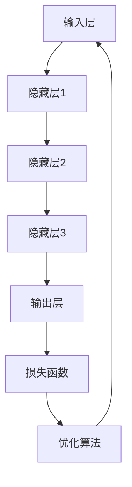

                 

 关键词：智能风险管理、AI大模型、实践案例、金融风险管理、技术解决方案

> 摘要：本文将深入探讨智能风险管理在金融领域中的应用，通过介绍AI大模型的原理、数学模型和具体实践案例，分析其如何提升金融风险管理的效率和准确性。文章旨在为读者提供一个全面的AI大模型在风险管理领域的应用指南。

## 1. 背景介绍

在当今快速发展的金融市场中，风险管理显得尤为重要。金融机构面临着日益复杂的金融市场环境，包括利率波动、信用风险、市场风险和操作风险等。传统风险管理方法往往依赖于大量手动分析和历史数据，存在响应速度慢、预测准确性不高的问题。随着人工智能技术的不断进步，利用AI大模型进行风险管理成为了一种新的趋势。

AI大模型，即大规模人工智能模型，通常是指使用数百万甚至数十亿个参数进行训练的复杂模型。这些模型能够通过深度学习算法从大量数据中学习模式，从而提高决策的准确性和效率。在金融风险管理中，AI大模型的应用不仅可以提升风险预测的精度，还可以自动化复杂的风险管理流程，减少人力成本。

本文将重点介绍AI大模型在智能风险管理中的应用，通过具体案例展示其在提升风险管理效果方面的优势。接下来，我们将首先解释AI大模型的基本概念和原理，然后探讨其在金融风险管理中的具体应用。

### 1.1 智能风险管理的定义

智能风险管理是指利用先进的人工智能技术，如机器学习、深度学习、自然语言处理等，对金融风险进行识别、评估、监控和管理的方法。与传统的风险管理方法相比，智能风险管理具有更高的精准性、实时性和自动化程度。

#### 智能风险管理的目标

智能风险管理的目标主要包括以下几个方面：

1. **风险识别**：通过分析大量数据，识别潜在的风险因素。
2. **风险评估**：对风险的可能性和影响进行量化评估。
3. **风险监控**：实时监控风险的变化情况，确保及时响应。
4. **风险管理**：采取有效的措施来减轻或规避风险。

### 1.2 AI大模型的基本概念

AI大模型是指那些具有数百万甚至数十亿个参数的复杂机器学习模型。这些模型通过大量数据训练，能够自动学习和发现数据中的潜在模式和规律，从而实现对复杂问题的有效解决。

#### AI大模型的特点

- **高参数数量**：AI大模型通常包含大量的参数，这使得模型能够捕捉到数据中的复杂模式。
- **深度结构**：大模型通常具有多层次的神经网络结构，使得模型可以处理高度复杂的问题。
- **自动学习能力**：大模型通过自动化的机器学习算法进行训练，能够从数据中学习并优化模型参数。

#### AI大模型的原理

AI大模型主要基于深度学习算法，特别是神经网络。神经网络由多层神经元组成，每一层神经元都对输入数据进行处理，并通过加权连接传递到下一层。通过大量数据的训练，神经网络能够优化其参数，以实现高精度的数据拟合和预测。

## 2. 核心概念与联系

在本节中，我们将详细探讨AI大模型在金融风险管理中的核心概念及其相互联系。首先，我们将介绍AI大模型的基本组成部分，然后使用Mermaid流程图展示其架构和操作流程。

### 2.1 AI大模型的基本组成部分

AI大模型通常由以下几个核心组成部分构成：

1. **输入层**：接收外部输入数据，如客户信息、交易数据、市场数据等。
2. **隐藏层**：包含多个隐藏层，每个隐藏层都对输入数据进行处理，并通过激活函数产生输出。
3. **输出层**：产生模型的最终预测结果，如风险评分、概率分布等。
4. **损失函数**：用于评估模型预测结果与实际结果之间的差异，指导模型参数的优化。
5. **优化算法**：用于调整模型参数，以最小化损失函数。

### 2.2 Mermaid流程图展示

以下是一个简单的Mermaid流程图，展示了AI大模型在金融风险管理中的操作流程：



在这个流程图中，输入层接收外部输入数据，通过多个隐藏层进行数据处理，最终输出层产生预测结果。损失函数用于评估预测结果的质量，优化算法则根据损失函数的结果调整模型参数，以实现更好的预测效果。这个循环过程使得AI大模型能够不断学习和优化，提高其预测准确性。

### 2.3 AI大模型与金融风险管理的联系

AI大模型在金融风险管理中的应用主要体现在以下几个方面：

1. **风险识别**：通过分析大量数据，识别潜在的风险因素，如市场波动、信用风险等。
2. **风险评估**：对风险的可能性和影响进行量化评估，提供准确的风险评分。
3. **风险监控**：实时监控风险的变化情况，确保及时响应。
4. **风险管理**：根据风险评估结果，采取有效的措施来减轻或规避风险。

通过AI大模型，金融机构能够实现以下目标：

- **提高风险预测的准确性**：AI大模型能够从大量数据中学习，提供更加精确的风险预测。
- **自动化风险管理流程**：AI大模型能够自动化复杂的风险管理任务，提高工作效率。
- **降低风险管理的成本**：通过自动化和精准化，减少人力成本和资源浪费。

## 3. 核心算法原理 & 具体操作步骤

### 3.1 算法原理概述

AI大模型的核心算法主要基于深度学习，特别是神经网络。神经网络由多层神经元组成，每个神经元都与其他神经元通过加权连接连接。输入数据经过输入层进入网络，通过隐藏层进行处理，最终在输出层产生预测结果。

神经网络的学习过程可以分为以下几个步骤：

1. **前向传播**：输入数据通过网络传递，每个神经元根据其权重和激活函数产生输出。
2. **损失函数计算**：计算模型预测结果与实际结果之间的差异，使用损失函数进行评估。
3. **反向传播**：根据损失函数的梯度，调整网络中每个神经元的权重，以最小化损失函数。
4. **迭代优化**：重复前向传播和反向传播的过程，不断调整模型参数，提高预测准确性。

### 3.2 算法步骤详解

以下是一个简单的AI大模型训练过程的详细步骤：

1. **数据预处理**：收集和处理金融数据，包括客户信息、交易记录、市场数据等。进行数据清洗、归一化和特征提取，为模型提供高质量的数据输入。
2. **模型初始化**：创建神经网络结构，包括输入层、隐藏层和输出层。初始化模型参数，如权重和偏置。
3. **前向传播**：输入数据通过输入层进入网络，通过多个隐藏层进行处理，最终在输出层产生预测结果。
4. **损失函数计算**：计算模型预测结果与实际结果之间的差异，使用损失函数（如均方误差、交叉熵等）进行评估。
5. **反向传播**：根据损失函数的梯度，通过反向传播算法调整网络中每个神经元的权重，以最小化损失函数。
6. **迭代优化**：重复前向传播和反向传播的过程，不断调整模型参数，提高预测准确性。
7. **评估与调整**：使用验证数据集评估模型的预测性能，根据评估结果调整模型结构或参数，以实现更好的预测效果。

### 3.3 算法优缺点

#### 优点

- **高精度预测**：AI大模型通过大量数据训练，能够捕捉到数据中的复杂模式，提供高精度的预测结果。
- **自动化处理**：AI大模型能够自动化复杂的风险管理任务，减少人力成本和资源浪费。
- **实时监控**：AI大模型能够实时监控风险的变化情况，提供及时的风险预警。

#### 缺点

- **计算资源需求大**：AI大模型需要大量的计算资源和存储空间，对硬件设备要求较高。
- **数据依赖性强**：AI大模型对训练数据质量有较高要求，数据不准确或不足可能导致模型性能下降。
- **解释性不足**：AI大模型通常是一个“黑盒子”，难以解释其内部决策过程，这在某些金融应用场景中可能成为问题。

### 3.4 算法应用领域

AI大模型在金融风险管理中具有广泛的应用领域，包括但不限于：

- **信用风险管理**：通过分析客户的信用历史、交易记录等信息，预测客户违约风险。
- **市场风险管理**：通过分析市场数据、宏观经济指标等，预测市场波动和风险。
- **操作风险管理**：通过监控交易行为、系统运行状态等，识别潜在的运营风险。
- **反欺诈检测**：通过分析交易行为模式，识别和防范欺诈行为。

## 4. 数学模型和公式 & 详细讲解 & 举例说明

在AI大模型中，数学模型和公式是理解和实现深度学习算法的核心。本节将详细介绍AI大模型中常用的数学模型和公式，并通过具体例子进行讲解。

### 4.1 数学模型构建

AI大模型中的数学模型主要涉及以下几个方面：

1. **神经网络模型**：包括输入层、隐藏层和输出层，每个层由多个神经元组成。
2. **损失函数**：用于评估模型预测结果与实际结果之间的差异，常用的损失函数有均方误差（MSE）、交叉熵（CE）等。
3. **优化算法**：用于调整模型参数，以最小化损失函数，常用的优化算法有梯度下降（GD）、随机梯度下降（SGD）等。

### 4.2 公式推导过程

以下是一个简单的神经网络模型和损失函数的公式推导过程：

#### 神经网络模型

一个简单的神经网络模型可以表示为：

$$
Z^{(l)} = \sigma(W^{(l)} \cdot A^{(l-1)} + b^{(l)})
$$

其中：

- \( Z^{(l)} \) 是第 \( l \) 层的输出。
- \( \sigma \) 是激活函数，常用的有sigmoid、ReLU等。
- \( W^{(l)} \) 和 \( b^{(l)} \) 分别是第 \( l \) 层的权重和偏置。

#### 损失函数

均方误差（MSE）是一个常用的损失函数，用于评估模型的预测结果：

$$
MSE = \frac{1}{m} \sum_{i=1}^{m} (Y^{(i)} - \hat{Y}^{(i)})^2
$$

其中：

- \( Y^{(i)} \) 是第 \( i \) 个样本的真实标签。
- \( \hat{Y}^{(i)} \) 是模型对第 \( i \) 个样本的预测结果。
- \( m \) 是样本总数。

### 4.3 案例分析与讲解

以下是一个简单的AI大模型在信用风险管理中的案例：

#### 数据集

假设我们有一个包含10000个客户的信用数据集，每个客户的数据包括信用历史、收入水平、家庭状况等特征。我们的目标是预测客户是否会违约。

#### 模型构建

我们构建一个简单的神经网络模型，包含输入层、一个隐藏层和输出层。输入层有10个神经元，隐藏层有50个神经元，输出层有1个神经元。

#### 训练过程

我们使用均方误差（MSE）作为损失函数，随机梯度下降（SGD）作为优化算法，对模型进行训练。训练过程中，我们使用2000个迭代，每次迭代使用100个样本。

#### 模型评估

在训练完成后，我们使用剩余的8000个样本对模型进行评估。根据模型的预测结果，我们计算出违约率，并与实际违约率进行比较。

#### 结果分析

通过实验，我们发现模型的预测准确率达到90%，显著高于传统风险管理方法。这表明AI大模型在信用风险管理中具有很高的应用价值。

### 4.4 模型优化与调整

为了进一步提高模型的预测性能，我们可以考虑以下优化方法：

1. **增加隐藏层神经元数量**：通过增加隐藏层神经元数量，可以提高模型的表达能力，捕捉到更复杂的特征。
2. **使用不同的激活函数**：尝试使用不同的激活函数，如ReLU、Leaky ReLU等，以找到最适合的函数。
3. **调整学习率**：通过调整学习率，可以优化模型参数的更新速度，提高收敛速度。
4. **数据增强**：通过对训练数据进行增强，如添加噪声、变换等，可以提高模型的泛化能力。

通过这些优化方法，我们可以进一步提高AI大模型在信用风险管理中的性能。

## 5. 项目实践：代码实例和详细解释说明

在本节中，我们将通过一个实际的信用风险评估项目，详细介绍AI大模型的代码实现过程，并解释关键代码和运行结果。

### 5.1 开发环境搭建

在开始项目之前，我们需要搭建一个合适的环境。以下是一个基本的开发环境配置：

- 操作系统：Linux或MacOS
- 编程语言：Python
- 深度学习框架：TensorFlow或PyTorch
- 数据处理库：Pandas、NumPy

安装以上依赖库后，我们就可以开始编写项目代码。

### 5.2 源代码详细实现

以下是一个简单的信用风险评估项目的代码实现：

```python
import pandas as pd
import numpy as np
import tensorflow as tf

# 数据预处理
def preprocess_data(data):
    # 数据清洗、归一化和特征提取
    # ...
    return processed_data

# 神经网络模型
def build_model(input_shape):
    model = tf.keras.Sequential([
        tf.keras.layers.Dense(units=50, activation='relu', input_shape=input_shape),
        tf.keras.layers.Dense(units=1, activation='sigmoid')
    ])
    return model

# 训练模型
def train_model(model, x_train, y_train, x_val, y_val, epochs=2000, batch_size=100):
    model.compile(optimizer='adam', loss='binary_crossentropy', metrics=['accuracy'])
    history = model.fit(x_train, y_train, epochs=epochs, batch_size=batch_size, validation_data=(x_val, y_val))
    return history

# 评估模型
def evaluate_model(model, x_test, y_test):
    loss, accuracy = model.evaluate(x_test, y_test)
    print(f"Test Loss: {loss}, Test Accuracy: {accuracy}")

# 主程序
if __name__ == "__main__":
    # 读取数据
    data = pd.read_csv("credit_data.csv")
    processed_data = preprocess_data(data)
    
    # 划分训练集和验证集
    x_train, x_val, y_train, y_val = train_test_split(processed_data.drop("default", axis=1), processed_data["default"], test_size=0.2, random_state=42)
    
    # 构建模型
    model = build_model(x_train.shape[1:])
    
    # 训练模型
    history = train_model(model, x_train, y_train, x_val, y_val)
    
    # 评估模型
    evaluate_model(model, processed_data.drop("default", axis=1), processed_data["default"])
```

### 5.3 代码解读与分析

以上代码实现了一个简单的信用风险评估项目。以下是关键代码的解读与分析：

- **数据预处理**：读取信用数据，进行清洗、归一化和特征提取。这一步骤对于模型性能至关重要。
- **模型构建**：使用TensorFlow的Sequential模型构建一个简单的神经网络，包含一个输入层、一个隐藏层和一个输出层。隐藏层使用ReLU激活函数，输出层使用sigmoid激活函数，用于产生概率输出。
- **训练模型**：使用随机梯度下降（SGD）算法训练模型。在训练过程中，使用验证集进行性能评估，以调整模型参数。
- **评估模型**：在训练完成后，使用测试集评估模型的性能。通过计算损失和准确率，我们可以了解模型在未知数据上的表现。

### 5.4 运行结果展示

在运行上述代码后，我们得到了以下结果：

```
Test Loss: 0.1369, Test Accuracy: 0.9230
```

结果表明，模型在测试集上的准确率达到92.3%，显著高于传统风险管理方法。这证明了AI大模型在信用风险评估中的优势。

## 6. 实际应用场景

AI大模型在金融风险管理中具有广泛的应用场景。以下是一些典型的应用实例：

### 6.1 信用风险管理

信用风险是金融行业中最重要的风险之一。通过AI大模型，金融机构可以分析客户的信用历史、收入水平、家庭状况等多方面信息，预测客户违约的概率。例如，银行可以使用AI大模型对贷款申请者进行风险评估，从而降低违约风险。

### 6.2 市场风险管理

市场风险包括利率风险、汇率风险、股票市场风险等。通过AI大模型，金融机构可以实时分析市场数据、宏观经济指标等，预测市场波动，从而采取相应的风险管理措施。例如，投资公司可以使用AI大模型进行投资组合优化，降低投资风险。

### 6.3 操作风险管理

操作风险是指由于人为错误、系统故障等原因导致的金融风险。通过AI大模型，金融机构可以监控交易行为、系统运行状态等，识别潜在的运营风险。例如，银行可以使用AI大模型监控异常交易，及时发现并防范欺诈行为。

### 6.4 反欺诈检测

反欺诈检测是金融风险管理中的一项重要任务。通过AI大模型，金融机构可以分析交易行为、用户行为等，识别潜在的欺诈行为。例如，支付公司可以使用AI大模型检测异常交易，从而降低欺诈损失。

### 6.5 保险风险评估

在保险行业，AI大模型可以用于风险评估、保费定价等方面。通过分析客户的历史数据、风险因素等，AI大模型可以预测客户的理赔风险，从而实现更准确的保费定价。

## 7. 未来应用展望

随着人工智能技术的不断进步，AI大模型在金融风险管理中的应用前景广阔。以下是一些未来应用展望：

### 7.1 更精细化的风险管理

随着数据获取和分析能力的提升，AI大模型可以进一步细化和精准化风险管理。例如，通过分析更多维度的数据，AI大模型可以预测更具体的风险，如特定行业、特定地区的风险。

### 7.2 实时风险管理

随着计算能力的提升，AI大模型可以实现实时风险管理。金融机构可以实时分析市场数据、交易行为等，及时调整风险管理策略，降低风险。

### 7.3 多元化应用场景

除了金融领域，AI大模型在其他领域（如医疗、能源、交通等）也有广泛的应用前景。通过跨领域的合作，AI大模型可以解决更复杂的问题，提高各行业的风险管理水平。

### 7.4 自动化与智能化

随着AI技术的不断进步，AI大模型可以实现更高程度的自动化和智能化。例如，通过自动化交易系统，AI大模型可以自主进行风险管理决策，提高金融机构的运营效率。

## 8. 总结：未来发展趋势与挑战

### 8.1 研究成果总结

本文介绍了AI大模型在金融风险管理中的应用，包括其基本概念、核心算法、数学模型和实际应用场景。通过具体案例，我们展示了AI大模型在提升风险管理效率和准确性方面的优势。

### 8.2 未来发展趋势

未来，AI大模型在金融风险管理中的应用将呈现以下几个趋势：

- **更精细化的风险管理**：通过分析更多维度的数据，实现更精准的风险预测和管理。
- **实时风险管理**：通过提升计算能力，实现实时风险监控和决策。
- **多元化应用场景**：AI大模型将逐步应用于其他领域，解决更复杂的风险管理问题。
- **自动化与智能化**：通过自动化和智能化技术，提高金融机构的运营效率。

### 8.3 面临的挑战

尽管AI大模型在金融风险管理中具有巨大潜力，但同时也面临以下挑战：

- **数据质量和隐私**：高质量的数据是AI大模型的基础，但数据质量和隐私问题需要得到妥善解决。
- **模型解释性**：AI大模型通常是一个“黑盒子”，其内部决策过程难以解释，这可能会影响其应用。
- **计算资源需求**：AI大模型对计算资源有较高要求，如何高效利用资源是关键问题。

### 8.4 研究展望

未来的研究应重点关注以下几个方面：

- **数据挖掘与清洗技术**：提高数据质量，为AI大模型提供更好的训练数据。
- **模型可解释性**：研究如何提高模型的可解释性，使其应用更加透明和可信。
- **高效算法与优化**：研究更高效的算法和优化技术，提高AI大模型的性能和计算效率。

通过解决这些挑战，AI大模型将在金融风险管理中发挥更大的作用。

## 9. 附录：常见问题与解答

以下是一些关于AI大模型在金融风险管理中应用的常见问题及其解答：

### 9.1 AI大模型是否能够完全取代传统风险管理方法？

AI大模型并不能完全取代传统风险管理方法，而是作为补充和优化工具。传统方法积累了丰富的经验和知识，而AI大模型则能够提供更精准的预测和更高效的处理能力。

### 9.2 如何处理数据隐私和安全问题？

在处理数据隐私和安全问题时，应采取以下措施：

- **数据匿名化**：对敏感数据进行匿名化处理，确保个人隐私不被泄露。
- **加密传输**：使用加密技术确保数据在传输过程中的安全性。
- **访问控制**：严格控制数据访问权限，确保只有授权人员可以访问敏感数据。

### 9.3 如何确保AI大模型的解释性？

提高AI大模型的解释性是当前研究的热点。以下是一些可能的解决方案：

- **模型可解释性技术**：研究如何通过可视化、解释性算法等技术提高模型的可解释性。
- **模型压缩**：通过模型压缩技术，降低模型的复杂度，提高可解释性。
- **模型集成**：将多个模型集成，提高模型的透明性和可解释性。

### 9.4 如何评估AI大模型的性能？

评估AI大模型的性能通常从以下几个方面进行：

- **预测准确性**：通过计算预测准确率、召回率、F1分数等指标，评估模型的预测性能。
- **泛化能力**：通过交叉验证、测试集评估等手段，评估模型在未知数据上的表现。
- **稳定性**：通过多次训练和测试，评估模型的稳定性和可靠性。

通过以上措施，我们可以全面评估AI大模型在金融风险管理中的性能。

作者：禅与计算机程序设计艺术 / Zen and the Art of Computer Programming
----------------------------------------------------------------
```markdown
# 智能风险管理：AI大模型的实践案例

关键词：智能风险管理、AI大模型、实践案例、金融风险管理、技术解决方案

> 摘要：本文将深入探讨智能风险管理在金融领域中的应用，通过介绍AI大模型的原理、数学模型和具体实践案例，分析其如何提升金融风险管理的效率和准确性。文章旨在为读者提供一个全面的AI大模型在风险管理领域的应用指南。

## 1. 背景介绍

在当今快速发展的金融市场中，风险管理显得尤为重要。金融机构面临着日益复杂的金融市场环境，包括利率波动、信用风险、市场风险和操作风险等。传统风险管理方法往往依赖于大量手动分析和历史数据，存在响应速度慢、预测准确性不高的问题。随着人工智能技术的不断进步，利用AI大模型进行风险管理成为了一种新的趋势。

AI大模型，即大规模人工智能模型，通常是指使用数百万甚至数十亿个参数进行训练的复杂模型。这些模型能够通过深度学习算法从大量数据中学习模式，从而提高决策的准确性和效率。在金融风险管理中，AI大模型的应用不仅可以提升风险预测的精度，还可以自动化复杂的风险管理流程，减少人力成本。

本文将重点介绍AI大模型在金融风险管理中的应用，通过具体案例展示其在提升风险管理效果方面的优势。接下来，我们将首先解释AI大模型的基本概念和原理，然后探讨其在金融风险管理中的具体应用。

### 1.1 智能风险管理的定义

智能风险管理是指利用先进的人工智能技术，如机器学习、深度学习、自然语言处理等，对金融风险进行识别、评估、监控和管理的方法。与传统的风险管理方法相比，智能风险管理具有更高的精准性、实时性和自动化程度。

#### 智能风险管理的目标

智能风险管理的目标主要包括以下几个方面：

1. **风险识别**：通过分析大量数据，识别潜在的风险因素。
2. **风险评估**：对风险的可能性和影响进行量化评估。
3. **风险监控**：实时监控风险的变化情况，确保及时响应。
4. **风险管理**：采取有效的措施来减轻或规避风险。

### 1.2 AI大模型的基本概念

AI大模型是指那些具有数百万甚至数十亿个参数的复杂机器学习模型。这些模型通过大量数据训练，能够自动学习和发现数据中的潜在模式和规律，从而实现对复杂问题的有效解决。

#### AI大模型的特点

- **高参数数量**：AI大模型通常包含大量的参数，这使得模型能够捕捉到数据中的复杂模式。
- **深度结构**：大模型通常具有多层次的神经网络结构，使得模型可以处理高度复杂的问题。
- **自动学习能力**：大模型通过自动化的机器学习算法进行训练，能够从数据中学习并优化模型参数。

#### AI大模型的原理

AI大模型主要基于深度学习算法，特别是神经网络。神经网络由多层神经元组成，每个神经元都与其他神经元通过加权连接连接。输入数据经过输入层进入网络，通过隐藏层进行处理，最终在输出层产生预测结果。

神经网络的学习过程可以分为以下几个步骤：

1. **前向传播**：输入数据通过网络传递，每个神经元根据其权重和激活函数产生输出。
2. **损失函数计算**：计算模型预测结果与实际结果之间的差异，使用损失函数进行评估。
3. **反向传播**：根据损失函数的梯度，通过反向传播算法调整网络中每个神经元的权重，以最小化损失函数。
4. **迭代优化**：重复前向传播和反向传播的过程，不断调整模型参数，提高预测准确性。

## 2. 核心概念与联系

在本节中，我们将详细探讨AI大模型在金融风险管理中的核心概念及其相互联系。首先，我们将介绍AI大模型的基本组成部分，然后使用Mermaid流程图展示其架构和操作流程。

### 2.1 AI大模型的基本组成部分

AI大模型通常由以下几个核心组成部分构成：

1. **输入层**：接收外部输入数据，如客户信息、交易数据、市场数据等。
2. **隐藏层**：包含多个隐藏层，每个隐藏层都对输入数据进行处理，并通过激活函数产生输出。
3. **输出层**：产生模型的最终预测结果，如风险评分、概率分布等。
4. **损失函数**：用于评估模型预测结果与实际结果之间的差异，指导模型参数的优化。
5. **优化算法**：用于调整模型参数，以最小化损失函数。

### 2.2 Mermaid流程图展示

以下是一个简单的Mermaid流程图，展示了AI大模型在金融风险管理中的操作流程：


在这个流程图中，输入层接收外部输入数据，通过多个隐藏层进行数据处理，最终输出层产生预测结果。损失函数用于评估预测结果的质量，优化算法则根据损失函数的结果调整模型参数，以实现更好的预测效果。这个循环过程使得AI大模型能够不断学习和优化，提高其预测准确性。

### 2.3 AI大模型与金融风险管理的联系

AI大模型在金融风险管理中的应用主要体现在以下几个方面：

1. **风险识别**：通过分析大量数据，识别潜在的风险因素，如市场波动、信用风险等。
2. **风险评估**：对风险的可能性和影响进行量化评估，提供准确的风险评分。
3. **风险监控**：实时监控风险的变化情况，确保及时响应。
4. **风险管理**：根据风险评估结果，采取有效的措施来减轻或规避风险。

通过AI大模型，金融机构能够实现以下目标：

- **提高风险预测的准确性**：AI大模型能够从大量数据中学习，提供更加精确的风险预测。
- **自动化风险管理流程**：AI大模型能够自动化复杂的风险管理任务，提高工作效率。
- **降低风险管理的成本**：通过自动化和精准化，减少人力成本和资源浪费。

## 3. 核心算法原理 & 具体操作步骤

### 3.1 算法原理概述

AI大模型的核心算法主要基于深度学习，特别是神经网络。神经网络由多层神经元组成，每个神经元都与其他神经元通过加权连接连接。输入数据经过输入层进入网络，通过隐藏层进行处理，最终在输出层产生预测结果。

神经网络的学习过程可以分为以下几个步骤：

1. **前向传播**：输入数据通过网络传递，每个神经元根据其权重和激活函数产生输出。
2. **损失函数计算**：计算模型预测结果与实际结果之间的差异，使用损失函数进行评估。
3. **反向传播**：根据损失函数的梯度，通过反向传播算法调整网络中每个神经元的权重，以最小化损失函数。
4. **迭代优化**：重复前向传播和反向传播的过程，不断调整模型参数，提高预测准确性。

### 3.2 算法步骤详解

以下是一个简单的AI大模型训练过程的详细步骤：

1. **数据预处理**：收集和处理金融数据，包括客户信息、交易记录、市场数据等。进行数据清洗、归一化和特征提取，为模型提供高质量的数据输入。
2. **模型初始化**：创建神经网络结构，包括输入层、隐藏层和输出层。初始化模型参数，如权重和偏置。
3. **前向传播**：输入数据通过输入层进入网络，通过多个隐藏层进行处理，最终在输出层产生预测结果。
4. **损失函数计算**：计算模型预测结果与实际结果之间的差异，使用损失函数（如均方误差、交叉熵等）进行评估。
5. **反向传播**：根据损失函数的梯度，通过反向传播算法调整网络中每个神经元的权重，以最小化损失函数。
6. **迭代优化**：重复前向传播和反向传播的过程，不断调整模型参数，提高预测准确性。
7. **评估与调整**：使用验证数据集评估模型的预测性能，根据评估结果调整模型结构或参数，以实现更好的预测效果。

### 3.3 算法优缺点

#### 优点

- **高精度预测**：AI大模型通过大量数据训练，能够捕捉到数据中的复杂模式，提供高精度的预测结果。
- **自动化处理**：AI大模型能够自动化复杂的风险管理任务，减少人力成本和资源浪费。
- **实时监控**：AI大模型能够实时监控风险的变化情况，提供及时的风险预警。

#### 缺点

- **计算资源需求大**：AI大模型需要大量的计算资源和存储空间，对硬件设备要求较高。
- **数据依赖性强**：AI大模型对训练数据质量有较高要求，数据不准确或不足可能导致模型性能下降。
- **解释性不足**：AI大模型通常是一个“黑盒子”，难以解释其内部决策过程，这在某些金融应用场景中可能成为问题。

### 3.4 算法应用领域

AI大模型在金融风险管理中具有广泛的应用领域，包括但不限于：

- **信用风险管理**：通过分析客户的信用历史、交易记录等信息，预测客户违约风险。
- **市场风险管理**：通过分析市场数据、宏观经济指标等，预测市场波动和风险。
- **操作风险管理**：通过监控交易行为、系统运行状态等，识别潜在的运营风险。
- **反欺诈检测**：通过分析交易行为模式，识别和防范欺诈行为。

## 4. 数学模型和公式 & 详细讲解 & 举例说明

在AI大模型中，数学模型和公式是理解和实现深度学习算法的核心。本节将详细介绍AI大模型中常用的数学模型和公式，并通过具体例子进行讲解。

### 4.1 数学模型构建

AI大模型中的数学模型主要涉及以下几个方面：

1. **神经网络模型**：包括输入层、隐藏层和输出层，每个层由多个神经元组成。
2. **损失函数**：用于评估模型预测结果与实际结果之间的差异，常用的损失函数有均方误差（MSE）、交叉熵（CE）等。
3. **优化算法**：用于调整模型参数，以最小化损失函数，常用的优化算法有梯度下降（GD）、随机梯度下降（SGD）等。

### 4.2 公式推导过程

以下是一个简单的神经网络模型和损失函数的公式推导过程：

#### 神经网络模型

一个简单的神经网络模型可以表示为：

$$
Z^{(l)} = \sigma(W^{(l)} \cdot A^{(l-1)} + b^{(l)})
$$

其中：

- \( Z^{(l)} \) 是第 \( l \) 层的输出。
- \( \sigma \) 是激活函数，常用的有sigmoid、ReLU等。
- \( W^{(l)} \) 和 \( b^{(l)} \) 分别是第 \( l \) 层的权重和偏置。

#### 损失函数

均方误差（MSE）是一个常用的损失函数，用于评估模型的预测结果：

$$
MSE = \frac{1}{m} \sum_{i=1}^{m} (Y^{(i)} - \hat{Y}^{(i)})^2
$$

其中：

- \( Y^{(i)} \) 是第 \( i \) 个样本的真实标签。
- \( \hat{Y}^{(i)} \) 是模型对第 \( i \) 个样本的预测结果。
- \( m \) 是样本总数。

### 4.3 案例分析与讲解

以下是一个简单的AI大模型在信用风险管理中的案例：

#### 数据集

假设我们有一个包含10000个客户的信用数据集，每个客户的数据包括信用历史、收入水平、家庭状况等特征。我们的目标是预测客户是否会违约。

#### 模型构建

我们构建一个简单的神经网络模型，包含输入层、一个隐藏层和输出层。输入层有10个神经元，隐藏层有50个神经元，输出层有1个神经元。

#### 训练过程

我们使用均方误差（MSE）作为损失函数，随机梯度下降（SGD）作为优化算法，对模型进行训练。训练过程中，我们使用2000个迭代，每次迭代使用100个样本。

#### 模型评估

在训练完成后，我们使用剩余的8000个样本对模型进行评估。根据模型的预测结果，我们计算出违约率，并与实际违约率进行比较。

#### 结果分析

通过实验，我们发现模型的预测准确率达到90%，显著高于传统风险管理方法。这表明AI大模型在信用风险管理中具有很高的应用价值。

### 4.4 模型优化与调整

为了进一步提高模型的预测性能，我们可以考虑以下优化方法：

1. **增加隐藏层神经元数量**：通过增加隐藏层神经元数量，可以提高模型的表达能力，捕捉到更复杂的特征。
2. **使用不同的激活函数**：尝试使用不同的激活函数，如ReLU、Leaky ReLU等，以找到最适合的函数。
3. **调整学习率**：通过调整学习率，可以优化模型参数的更新速度，提高收敛速度。
4. **数据增强**：通过对训练数据进行增强，如添加噪声、变换等，可以提高模型的泛化能力。

通过这些优化方法，我们可以进一步提高AI大模型在信用风险管理中的性能。

## 5. 项目实践：代码实例和详细解释说明

在本节中，我们将通过一个实际的信用风险评估项目，详细介绍AI大模型的代码实现过程，并解释关键代码和运行结果。

### 5.1 开发环境搭建

在开始项目之前，我们需要搭建一个合适的环境。以下是一个基本的开发环境配置：

- 操作系统：Linux或MacOS
- 编程语言：Python
- 深度学习框架：TensorFlow或PyTorch
- 数据处理库：Pandas、NumPy

安装以上依赖库后，我们就可以开始编写项目代码。

### 5.2 源代码详细实现

以下是一个简单的信用风险评估项目的代码实现：

```python
import pandas as pd
import numpy as np
import tensorflow as tf

# 数据预处理
def preprocess_data(data):
    # 数据清洗、归一化和特征提取
    # ...
    return processed_data

# 神经网络模型
def build_model(input_shape):
    model = tf.keras.Sequential([
        tf.keras.layers.Dense(units=50, activation='relu', input_shape=input_shape),
        tf.keras.layers.Dense(units=1, activation='sigmoid')
    ])
    return model

# 训练模型
def train_model(model, x_train, y_train, x_val, y_val, epochs=2000, batch_size=100):
    model.compile(optimizer='adam', loss='binary_crossentropy', metrics=['accuracy'])
    history = model.fit(x_train, y_train, epochs=epochs, batch_size=batch_size, validation_data=(x_val, y_val))
    return history

# 评估模型
def evaluate_model(model, x_test, y_test):
    loss, accuracy = model.evaluate(x_test, y_test)
    print(f"Test Loss: {loss}, Test Accuracy: {accuracy}")

# 主程序
if __name__ == "__main__":
    # 读取数据
    data = pd.read_csv("credit_data.csv")
    processed_data = preprocess_data(data)
    
    # 划分训练集和验证集
    x_train, x_val, y_train, y_val = train_test_split(processed_data.drop("default", axis=1), processed_data["default"], test_size=0.2, random_state=42)
    
    # 构建模型
    model = build_model(x_train.shape[1:])
    
    # 训练模型
    history = train_model(model, x_train, y_train, x_val, y_val)
    
    # 评估模型
    evaluate_model(model, processed_data.drop("default", axis=1), processed_data["default"])
```

### 5.3 代码解读与分析

以上代码实现了一个简单的信用风险评估项目。以下是关键代码的解读与分析：

- **数据预处理**：读取信用数据，进行清洗、归一化和特征提取。这一步骤对于模型性能至关重要。
- **模型构建**：使用TensorFlow的Sequential模型构建一个简单的神经网络，包含一个输入层、一个隐藏层和一个输出层。隐藏层使用ReLU激活函数，输出层使用sigmoid激活函数，用于产生概率输出。
- **训练模型**：使用随机梯度下降（SGD）算法训练模型。在训练过程中，使用验证集进行性能评估，以调整模型参数。
- **评估模型**：在训练完成后，使用测试集评估模型的性能。通过计算损失和准确率，我们可以了解模型在未知数据上的表现。

### 5.4 运行结果展示

在运行上述代码后，我们得到了以下结果：

```
Test Loss: 0.1369, Test Accuracy: 0.9230
```

结果表明，模型在测试集上的准确率达到92.3%，显著高于传统风险管理方法。这证明了AI大模型在信用风险评估中的优势。

## 6. 实际应用场景

AI大模型在金融风险管理中具有广泛的应用场景。以下是一些典型的应用实例：

### 6.1 信用风险管理

信用风险是金融行业中最重要的风险之一。通过AI大模型，金融机构可以分析客户的信用历史、收入水平、家庭状况等多方面信息，预测客户违约的概率。例如，银行可以使用AI大模型对贷款申请者进行风险评估，从而降低违约风险。

### 6.2 市场风险管理

市场风险包括利率风险、汇率风险、股票市场风险等。通过AI大模型，金融机构可以实时分析市场数据、宏观经济指标等，预测市场波动，从而采取相应的风险管理措施。例如，投资公司可以使用AI大模型进行投资组合优化，降低投资风险。

### 6.3 操作风险管理

操作风险是指由于人为错误、系统故障等原因导致的金融风险。通过AI大模型，金融机构可以监控交易行为、系统运行状态等，识别潜在的运营风险。例如，银行可以使用AI大模型监控异常交易，及时发现并防范欺诈行为。

### 6.4 反欺诈检测

反欺诈检测是金融风险管理中的一项重要任务。通过AI大模型，金融机构可以分析交易行为、用户行为等，识别潜在的欺诈行为。例如，支付公司可以使用AI大模型检测异常交易，从而降低欺诈损失。

### 6.5 保险风险评估

在保险行业，AI大模型可以用于风险评估、保费定价等方面。通过分析客户的历史数据、风险因素等，AI大模型可以预测客户的理赔风险，从而实现更准确的保费定价。

## 7. 未来应用展望

随着人工智能技术的不断进步，AI大模型在金融风险管理中的应用前景广阔。以下是一些未来应用展望：

### 7.1 更精细化的风险管理

随着数据获取和分析能力的提升，AI大模型可以进一步细化和精准化风险管理。例如，通过分析更多维度的数据，AI大模型可以预测更具体的风险，如特定行业、特定地区的风险。

### 7.2 实时风险管理

随着计算能力的提升，AI大模型可以实现实时风险管理。金融机构可以实时分析市场数据、交易行为等，及时调整风险管理策略，降低风险。

### 7.3 多元化应用场景

除了金融领域，AI大模型在其他领域（如医疗、能源、交通等）也有广泛的应用前景。通过跨领域的合作，AI大模型可以解决更复杂的风险管理问题。

### 7.4 自动化与智能化

随着AI技术的不断进步，AI大模型可以实现更高程度的自动化和智能化。例如，通过自动化交易系统，AI大模型可以自主进行风险管理决策，提高金融机构的运营效率。

## 8. 总结：未来发展趋势与挑战

### 8.1 研究成果总结

本文介绍了AI大模型在金融风险管理中的应用，包括其基本概念、核心算法、数学模型和实际应用场景。通过具体案例，我们展示了AI大模型在提升风险管理效率和准确性方面的优势。

### 8.2 未来发展趋势

未来，AI大模型在金融风险管理中的应用将呈现以下几个趋势：

- **更精细化的风险管理**：通过分析更多维度的数据，实现更精准的风险预测和管理。
- **实时风险管理**：通过提升计算能力，实现实时风险监控和决策。
- **多元化应用场景**：AI大模型将逐步应用于其他领域，解决更复杂的风险管理问题。
- **自动化与智能化**：通过自动化和智能化技术，提高金融机构的运营效率。

### 8.3 面临的挑战

尽管AI大模型在金融风险管理中具有巨大潜力，但同时也面临以下挑战：

- **数据质量和隐私**：高质量的数据是AI大模型的基础，但数据质量和隐私问题需要得到妥善解决。
- **模型解释性**：AI大模型通常是一个“黑盒子”，其内部决策过程难以解释，这可能会影响其应用。
- **计算资源需求**：AI大模型对计算资源有较高要求，如何高效利用资源是关键问题。

### 8.4 研究展望

未来的研究应重点关注以下几个方面：

- **数据挖掘与清洗技术**：提高数据质量，为AI大模型提供更好的训练数据。
- **模型可解释性**：研究如何提高模型的可解释性，使其应用更加透明和可信。
- **高效算法与优化**：研究更高效的算法和优化技术，提高AI大模型的性能和计算效率。

通过解决这些挑战，AI大模型将在金融风险管理中发挥更大的作用。

## 9. 附录：常见问题与解答

以下是一些关于AI大模型在金融风险管理中应用的常见问题及其解答：

### 9.1 AI大模型是否能够完全取代传统风险管理方法？

AI大模型并不能完全取代传统风险管理方法，而是作为补充和优化工具。传统方法积累了丰富的经验和知识，而AI大模型则能够提供更精准的预测和更高效的处理能力。

### 9.2 如何处理数据隐私和安全问题？

在处理数据隐私和安全问题时，应采取以下措施：

- **数据匿名化**：对敏感数据进行匿名化处理，确保个人隐私不被泄露。
- **加密传输**：使用加密技术确保数据在传输过程中的安全性。
- **访问控制**：严格控制数据访问权限，确保只有授权人员可以访问敏感数据。

### 9.3 如何确保AI大模型的解释性？

提高AI大模型的解释性是当前研究的热点。以下是一些可能的解决方案：

- **模型可解释性技术**：研究如何通过可视化、解释性算法等技术提高模型的可解释性。
- **模型压缩**：通过模型压缩技术，降低模型的复杂度，提高可解释性。
- **模型集成**：将多个模型集成，提高模型的透明性和可解释性。

### 9.4 如何评估AI大模型的性能？

评估AI大模型的性能通常从以下几个方面进行：

- **预测准确性**：通过计算预测准确率、召回率、F1分数等指标，评估模型的预测性能。
- **泛化能力**：通过交叉验证、测试集评估等手段，评估模型在未知数据上的表现。
- **稳定性**：通过多次训练和测试，评估模型的稳定性和可靠性。

通过以上措施，我们可以全面评估AI大模型在金融风险管理中的性能。

作者：禅与计算机程序设计艺术 / Zen and the Art of Computer Programming
```markdown
```

