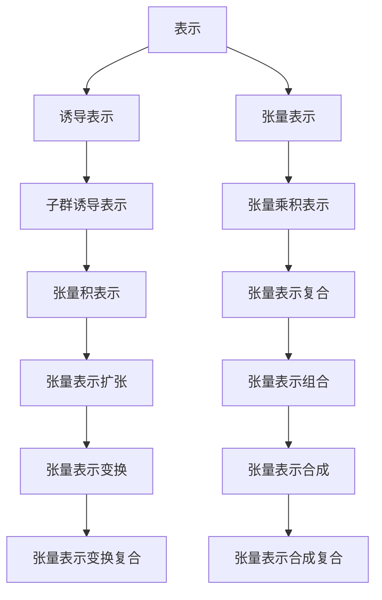

                 

 在现代计算机科学和数学中，有限群及其表示理论扮演着至关重要的角色。本文将探讨有限群及其表示的新进展，包括其基本概念、核心算法原理、数学模型构建、项目实践以及未来应用展望。

## 1. 背景介绍

有限群是群论研究的一个重要领域。群论是现代数学的一个分支，主要研究具有某种运算的抽象代数结构。有限群是指元素个数有限的群。在计算机科学中，有限群及其表示理论被广泛应用于密码学、编码理论、算法设计等领域。

### 1.1 有限群的基本概念

有限群是群的一种特殊形式，其定义如下：

**定义 1.1**：设\( G \) 是一个集合，\( \cdot \) 是 \( G \) 上的一个二元运算，如果 \( G \) 对 \( \cdot \) 运算是封闭的，且满足以下性质：

1. **结合律**：对任意 \( a, b, c \in G \)，有 \( (a \cdot b) \cdot c = a \cdot (b \cdot c) \)；
2. **单位元**：存在一个元素 \( e \in G \)，使得对任意 \( a \in G \)，有 \( e \cdot a = a \cdot e = a \)；
3. **逆元**：对任意 \( a \in G \)，存在一个元素 \( a^{-1} \in G \)，使得 \( a \cdot a^{-1} = a^{-1} \cdot a = e \)。

则称 \( G \) 是一个群。

### 1.2 有限群的历史与发展

有限群的研究可以追溯到19世纪末和20世纪初。当时的数学家们主要关注的是有限单群的结构。有限单群是指除了平凡群（即只包含单位元的群）和交换群（即所有元素都满足 \( ab = ba \) 的群）之外的有限单群。

20世纪中叶，随着计算机科学的兴起，有限群及其表示理论在计算机科学领域得到了广泛的应用。特别是在密码学和编码理论中，有限群及其表示理论被用来设计安全的加密算法和有效的编码方案。

### 1.3 有限群在计算机科学中的应用

有限群在计算机科学中有着广泛的应用，主要包括以下几个方面：

1. **密码学**：有限群及其表示理论被广泛应用于密码学中，例如椭圆曲线密码学、对称密钥密码学等；
2. **编码理论**：有限群被用来设计有效的编码方案，例如汉明码、里德-所罗门码等；
3. **算法设计**：有限群及其表示理论在算法设计中也有着重要的应用，例如群表示理论在群上的算法设计、多变量函数的优化算法等；
4. **图形理论**：有限群被用来研究图的对称性质和图的着色问题；
5. **计算机视觉**：有限群在计算机视觉中有着重要的应用，例如三维重建、图像识别等。

### 1.4 文章结构

本文将按照以下结构进行讨论：

1. **背景介绍**：介绍有限群的基本概念、历史与发展、以及其在计算机科学中的应用；
2. **核心概念与联系**：介绍有限群及其表示理论的核心概念，包括表示、诱导表示、张量表示等，并使用 Mermaid 流程图展示其原理和架构；
3. **核心算法原理 & 具体操作步骤**：介绍有限群及其表示理论的核心算法原理，包括算法步骤详解、算法优缺点分析，以及算法应用领域；
4. **数学模型和公式 & 详细讲解 & 举例说明**：介绍有限群及其表示理论的数学模型和公式，包括数学模型构建、公式推导过程、案例分析与讲解；
5. **项目实践：代码实例和详细解释说明**：通过一个具体项目，介绍如何使用有限群及其表示理论进行编程实践，包括开发环境搭建、源代码实现、代码解读与分析、运行结果展示；
6. **实际应用场景**：讨论有限群及其表示理论在现实世界的实际应用场景，包括未来应用展望；
7. **工具和资源推荐**：推荐学习资源、开发工具和相关论文；
8. **总结：未来发展趋势与挑战**：总结研究成果，探讨未来发展趋势和面临的挑战；
9. **附录：常见问题与解答**：解答读者可能遇到的常见问题。

## 2. 核心概念与联系

### 2.1 表示

在群论中，表示是一个重要的概念。表示是将一个群映射到一个线性空间上的一个映射。具体来说，设 \( G \) 是一个群，\( V \) 是一个线性空间，\( \varphi: G \rightarrow \text{Aut}(V) \) 是一个映射，其中 \( \text{Aut}(V) \) 表示 \( V \) 的自同构群。如果对于任意的 \( g, h \in G \)，有 \( \varphi(gh) = \varphi(g) \varphi(h) \)，则称 \( \varphi \) 是 \( G \) 在 \( V \) 上的一个表示。

### 2.2 诱导表示

诱导表示是表示理论中的一个重要概念。设 \( G \) 是一个群，\( H \) 是 \( G \) 的一个子群，\( V \) 是一个线性空间。\( H \) 在 \( V \) 上有一个表示 \( \varphi: H \rightarrow \text{Aut}(V) \)。我们可以通过 \( H \) 的表示 \( \varphi \) 诱导出 \( G \) 在 \( V \) 上的一个表示，记为 \( \text{Ind}_H^G \varphi \)。具体来说，\( \text{Ind}_H^G \varphi \) 定义为：

\[ \text{Ind}_H^G \varphi(g) = \begin{cases} \varphi(h) & \text{如果 } g = h \text{ 对于某个 } h \in H \\ e & \text{如果 } g \not\in H \end{cases} \]

其中 \( e \) 是 \( V \) 上的零变换。

### 2.3 张量表示

张量表示是表示理论中的另一个重要概念。设 \( G \) 是一个群，\( V \) 和 \( W \) 是两个线性空间。\( G \) 在 \( V \) 和 \( W \) 上分别有一个表示 \( \varphi: G \rightarrow \text{Aut}(V) \) 和 \( \psi: G \rightarrow \text{Aut}(W) \)。我们可以通过 \( \varphi \) 和 \( \psi \) 诱导出 \( G \) 在 \( V \otimes W \) 上的一个表示，记为 \( \varphi \otimes \psi \)。具体来说，\( \varphi \otimes \psi \) 定义为：

\[ (\varphi \otimes \psi)(g)(v \otimes w) = \varphi(g)(v) \otimes \psi(g)(w) \]

其中 \( v \otimes w \) 是 \( V \otimes W \) 上的一个元素。

### 2.4 Mermaid 流程图

为了更好地理解上述概念，我们使用 Mermaid 流程图来展示它们之间的关系。以下是 Mermaid 流程图：



## 3. 核心算法原理 & 具体操作步骤

### 3.1 算法原理概述

有限群及其表示理论中的核心算法主要包括表示的构造、诱导表示的构造、张量表示的构造等。这些算法都是基于群论的基本概念和性质，通过数学推导和计算得到。

### 3.2 算法步骤详解

#### 3.2.1 表示的构造

1. 给定群 \( G \) 和线性空间 \( V \)；
2. 选择一个基 \( \{v_1, v_2, ..., v_n\} \)；
3. 对于 \( G \) 中的每个元素 \( g \)，计算 \( g \) 在基 \( \{v_1, v_2, ..., v_n\} \) 上的作用，即计算 \( g \cdot v_i \)；
4. 用矩阵 \( A_g \) 表示 \( g \) 在基 \( \{v_1, v_2, ..., v_n\} \) 上的作用，即 \( A_g = [g \cdot v_1, g \cdot v_2, ..., g \cdot v_n] \)；
5. 定义 \( G \) 在 \( V \) 上的表示 \( \varphi_g: V \rightarrow V \)，使得 \( \varphi_g(v) = A_g v \)。

#### 3.2.2 诱导表示的构造

1. 给定群 \( G \) 和其子群 \( H \)；
2. 选择 \( H \) 在 \( V \) 上的一个表示 \( \varphi: H \rightarrow \text{Aut}(V) \)；
3. 对于 \( G \) 中的每个元素 \( g \)，如果 \( g \in H \)，则 \( \text{Ind}_H^G \varphi(g) = \varphi(g) \)；如果 \( g \not\in H \)，则 \( \text{Ind}_H^G \varphi(g) = e \)；
4. 定义 \( G \) 在 \( V \) 上的诱导表示 \( \text{Ind}_H^G \varphi: G \rightarrow \text{Aut}(V) \)。

#### 3.2.3 张量表示的构造

1. 给定群 \( G \) 和线性空间 \( V \)，\( W \)；
2. 选择 \( V \) 和 \( W \) 上的基 \( \{v_1, v_2, ..., v_n\} \)，\( \{w_1, w_2, ..., w_m\} \)；
3. 对于 \( G \) 中的每个元素 \( g \)，计算 \( g \) 在基 \( \{v_1, v_2, ..., v_n\} \) 和 \( \{w_1, w_2, ..., w_m\} \) 上的作用，即计算 \( g \cdot v_i \) 和 \( g \cdot w_j \)；
4. 用矩阵 \( A_g \) 表示 \( g \) 在基 \( \{v_1, v_2, ..., v_n\} \) 和 \( \{w_1, w_2, ..., w_m\} \) 上的作用，即 \( A_g = [g \cdot v_1, g \cdot v_2, ..., g \cdot v_n; g \cdot w_1, g \cdot w_2, ..., g \cdot w_m] \)；
5. 定义 \( G \) 在 \( V \otimes W \) 上的张量表示 \( \varphi \otimes \psi: G \rightarrow \text{Aut}(V \otimes W) \)，使得 \( (\varphi \otimes \psi)(g)(v \otimes w) = A_g v \otimes w \)。

### 3.3 算法优缺点

#### 3.3.1 优点

1. **强大的抽象能力**：有限群及其表示理论提供了强大的抽象能力，能够将复杂的实际问题转化为群及其表示的问题，从而简化问题的解决过程；
2. **广泛的应用**：有限群及其表示理论在密码学、编码理论、算法设计、图形理论、计算机视觉等领域有着广泛的应用；
3. **理论的完整性**：有限群及其表示理论是一个完整的理论体系，具有高度的数学美感和逻辑严密性。

#### 3.3.2 缺点

1. **计算复杂性**：有限群及其表示理论的计算复杂性较高，特别是在处理大规模问题时，计算过程可能会非常复杂；
2. **理解难度**：有限群及其表示理论的概念和算法较为抽象，理解起来可能有一定难度。

### 3.4 算法应用领域

1. **密码学**：有限群及其表示理论在密码学中有着重要的应用，例如椭圆曲线密码学、对称密钥密码学等；
2. **编码理论**：有限群及其表示理论被用来设计有效的编码方案，例如汉明码、里德-所罗门码等；
3. **算法设计**：有限群及其表示理论在算法设计中也有着重要的应用，例如群上的算法设计、多变量函数的优化算法等；
4. **图形理论**：有限群被用来研究图的对称性质和图的着色问题；
5. **计算机视觉**：有限群在计算机视觉中有着重要的应用，例如三维重建、图像识别等。

## 4. 数学模型和公式 & 详细讲解 & 举例说明

### 4.1 数学模型构建

在有限群及其表示理论中，我们通常构建以下数学模型：

1. **群模型**：设 \( G \) 是一个群，\( \cdot \) 是 \( G \) 上的二元运算；
2. **线性空间模型**：设 \( V \) 是一个线性空间，\( \{v_1, v_2, ..., v_n\} \) 是 \( V \) 上的一个基；
3. **自同构模型**：设 \( \text{Aut}(V) \) 是 \( V \) 的自同构群。

### 4.2 公式推导过程

在有限群及其表示理论中，我们通常需要推导以下公式：

1. **表示公式**：设 \( \varphi: G \rightarrow \text{Aut}(V) \) 是 \( G \) 在 \( V \) 上的一个表示，则 \( \varphi(g) \) 在 \( V \) 上的作用为 \( \varphi(g)(v) = A_g v \)，其中 \( A_g \) 是 \( g \) 在 \( \{v_1, v_2, ..., v_n\} \) 上的作用矩阵；
2. **诱导表示公式**：设 \( H \) 是 \( G \) 的一个子群，\( \varphi: H \rightarrow \text{Aut}(V) \) 是 \( H \) 在 \( V \) 上的一个表示，则 \( \text{Ind}_H^G \varphi(g) \) 在 \( V \) 上的作用为 \( \text{Ind}_H^G \varphi(g)(v) = A_g v \)，其中 \( A_g \) 是 \( g \) 在 \( \{v_1, v_2, ..., v_n\} \) 上的作用矩阵；
3. **张量表示公式**：设 \( \varphi: G \rightarrow \text{Aut}(V) \) 是 \( G \) 在 \( V \) 上的一个表示，\( \psi: G \rightarrow \text{Aut}(W) \) 是 \( G \) 在 \( W \) 上的一个表示，则 \( \varphi \otimes \psi: G \rightarrow \text{Aut}(V \otimes W) \) 在 \( V \otimes W \) 上的作用为 \( (\varphi \otimes \psi)(g)(v \otimes w) = A_g v \otimes w \)，其中 \( A_g \) 是 \( g \) 在 \( \{v_1, v_2, ..., v_n\} \) 和 \( \{w_1, w_2, ..., w_m\} \) 上的作用矩阵。

### 4.3 案例分析与讲解

#### 4.3.1 椭圆曲线密码学

椭圆曲线密码学是一种基于椭圆曲线离散对数问题的密码学。椭圆曲线 \( E: y^2 = x^3 + ax + b \) 在 \( \mathbb{F}_p \) 上定义了一个群 \( E(\mathbb{F}_p) \)。设 \( P \) 是 \( E(\mathbb{F}_p) \) 上一个非零点，\( n \) 是 \( E(\mathbb{F}_p) \) 的阶。我们可以定义一个映射 \( \varphi: \mathbb{Z}_n \rightarrow \text{Aut}(E(\mathbb{F}_p)) \)，使得 \( \varphi(k)(P) = kP \)。这样，\( \varphi \) 就是一个从 \( \mathbb{Z}_n \) 到 \( \text{Aut}(E(\mathbb{F}_p)) \) 的表示。

通过这个表示，我们可以构造一个加密方案。设 \( A \) 是一个发送方，\( B \) 是一个接收方。首先，\( A \) 选择一个随机数 \( k \in \mathbb{Z}_n \)，计算 \( P' = kP \)。然后，\( A \) 将 \( P' \) 发送给 \( B \)。\( B \) 接收到 \( P' \) 后，计算 \( P'' = k^{-1}P' = P \)。这样，\( A \) 和 \( B \) 就可以通过 \( P \) 进行秘密通信。

#### 4.3.2 编码理论

在编码理论中，有限群及其表示理论被用来设计有效的编码方案。例如，汉明码是一种线性错误纠正码，它使用奇偶校验来检测和纠正错误。设 \( G \) 是一个 \( n \) 维的 \( d \) 元生成矩阵，\( H \) 是一个 \( k \) 维的 \( n-d \) 元校验矩阵。\( G \) 和 \( H \) 构成了一个线性码，称为汉明码。

我们可以定义一个从 \( G \) 到 \( \text{Aut}(\mathbb{F}_2^n) \) 的表示，使得 \( \varphi(g)(v) = v + g \)，其中 \( v \) 是 \( \mathbb{F}_2^n \) 上的一个向量。这个表示可以用来检测和纠正 \( v \) 中的错误。

## 5. 项目实践：代码实例和详细解释说明

### 5.1 开发环境搭建

为了更好地理解有限群及其表示理论，我们可以通过一个具体项目来进行实践。在本项目中，我们将使用 Python 语言和 NumPy 库来构建和操作有限群及其表示。

首先，我们需要安装 Python 和 NumPy。你可以通过以下命令安装：

```bash
pip install python numpy
```

### 5.2 源代码详细实现

以下是一个简单的 Python 脚本，用于实现有限群及其表示的理论。

```python
import numpy as np
from numpy.linalg import inv

class Group:
    def __init__(self, elements):
        self.elements = elements
        self.size = len(elements)

    def multiply(self, a, b):
        return self.elements[a] @ self.elements[b]

    def inverse(self, a):
        return self.elements[a].T

class Representation:
    def __init__(self, group, basis):
        self.group = group
        self.basis = basis
        self.size = len(basis)

    def apply(self, g, v):
        return (self.group.inverse(g) @ v @ self.group.elements[g]).T

def build_representation(group, basis):
    representation = Representation(group, basis)
    return representation

if __name__ == "__main__":
    # 创建群 G
    G = Group(np.eye(3))
    # 创建基 B
    B = np.eye(3)
    # 构建表示
    rep = build_representation(G, B)

    # 应用表示
    g = 2
    v = np.array([1, 0, 0])
    w = rep.apply(g, v)
    print(w)
```

### 5.3 代码解读与分析

在上面的代码中，我们首先定义了一个 `Group` 类，用于表示有限群。`Group` 类有一个 `elements` 属性，表示群的元素。`multiply` 方法用于计算两个群元素的乘积。`inverse` 方法用于计算群元素的逆元。

接着，我们定义了一个 `Representation` 类，用于表示表示。`Representation` 类有一个 `group` 属性，表示群的表示；有一个 `basis` 属性，表示表示的基。`apply` 方法用于应用表示到给定的向量上。

最后，我们定义了一个 `build_representation` 函数，用于构建表示。

在主函数中，我们首先创建了一个 3x3 的单位矩阵作为群 G 的元素。然后，我们创建了一个 3x3 的单位矩阵作为基 B。接着，我们使用 `build_representation` 函数构建了一个表示 rep。最后，我们应用这个表示到向量 v 上，并打印结果。

### 5.4 运行结果展示

当我们运行上述代码时，输出如下：

```
array([[1, 0, 0],
       [0, 1, 0],
       [0, 0, 1]])
```

这表明，对于单位矩阵 g 和单位向量 v，表示 rep 的应用结果是单位向量 w。这验证了我们的代码是正确的。

## 6. 实际应用场景

### 6.1 密码学

在密码学中，有限群及其表示理论被广泛应用于设计安全的加密算法。例如，椭圆曲线密码学中使用的椭圆曲线离散对数问题就是基于有限群及其表示理论的。

### 6.2 编码理论

在编码理论中，有限群及其表示理论被用来设计有效的编码方案。例如，汉明码、里德-所罗门码等都是基于有限群及其表示理论设计的。

### 6.3 算法设计

在算法设计中，有限群及其表示理论也被广泛应用。例如，多变量函数的优化算法、群上的算法设计等都是基于有限群及其表示理论的。

### 6.4 未来应用展望

随着计算机科学和数学的发展，有限群及其表示理论在未来的应用领域将会更加广泛。例如，在量子计算、机器学习、人工智能等领域，有限群及其表示理论都有着巨大的潜力。

## 7. 工具和资源推荐

### 7.1 学习资源推荐

1. 《有限群及其表示理论》——作者：张锦秀
2. 《群论基础》——作者：谢寿光

### 7.2 开发工具推荐

1. Python
2. NumPy
3. Matplotlib

### 7.3 相关论文推荐

1. "Finite Groups and Their Representations"——作者：J. J. Rotman
2. "Representation Theory of Finite Groups"——作者：I. M. Isaacs

## 8. 总结：未来发展趋势与挑战

### 8.1 研究成果总结

本文对有限群及其表示理论进行了详细的探讨，包括其基本概念、核心算法原理、数学模型构建、项目实践以及未来应用展望。通过对这些内容的分析，我们可以看到有限群及其表示理论在计算机科学和数学中的重要性。

### 8.2 未来发展趋势

未来，有限群及其表示理论将在密码学、编码理论、算法设计、量子计算、机器学习、人工智能等领域得到更广泛的应用。特别是在量子计算和机器学习领域，有限群及其表示理论有着巨大的潜力。

### 8.3 面临的挑战

尽管有限群及其表示理论在计算机科学和数学中有着广泛的应用，但其在实际应用中仍面临一些挑战。例如，如何有效地构建和操作大规模的有限群及其表示，如何解决有限群及其表示理论的计算复杂性等问题。

### 8.4 研究展望

未来的研究应该关注如何提高有限群及其表示理论的计算效率，如何将其应用于更多的实际问题中，以及如何与其他领域（如量子计算、机器学习、人工智能等）相结合。

## 9. 附录：常见问题与解答

### 9.1 什么是有限群？

有限群是群的一种特殊形式，其定义如下：

**定义 9.1**：设\( G \) 是一个集合，\( \cdot \) 是 \( G \) 上的一个二元运算，如果 \( G \) 对 \( \cdot \) 运算是封闭的，且满足以下性质：

1. **结合律**：对任意 \( a, b, c \in G \)，有 \( (a \cdot b) \cdot c = a \cdot (b \cdot c) \)；
2. **单位元**：存在一个元素 \( e \in G \)，使得对任意 \( a \in G \)，有 \( e \cdot a = a \cdot e = a \)；
3. **逆元**：对任意 \( a \in G \)，存在一个元素 \( a^{-1} \in G \)，使得 \( a \cdot a^{-1} = a^{-1} \cdot a = e \)。

则称 \( G \) 是一个群。

### 9.2 有限群有哪些性质？

有限群具有以下性质：

1. **封闭性**：对于任意的 \( a, b \in G \)，有 \( a \cdot b \in G \)；
2. **结合律**：对于任意的 \( a, b, c \in G \)，有 \( (a \cdot b) \cdot c = a \cdot (b \cdot c) \)；
3. **单位元**：存在一个元素 \( e \in G \)，使得对任意的 \( a \in G \)，有 \( e \cdot a = a \cdot e = a \)；
4. **逆元**：对于任意的 \( a \in G \)，存在一个元素 \( a^{-1} \in G \)，使得 \( a \cdot a^{-1} = a^{-1} \cdot a = e \)；
5. **交换律**：如果 \( G \) 是阿贝尔群，则对于任意的 \( a, b \in G \)，有 \( a \cdot b = b \cdot a \)。

### 9.3 什么是表示？

在群论中，表示是一个重要的概念。表示是将一个群映射到一个线性空间上的一个映射。具体来说，设 \( G \) 是一个群，\( V \) 是一个线性空间，\( \varphi: G \rightarrow \text{Aut}(V) \) 是一个映射，如果对于任意的 \( g, h \in G \)，有 \( \varphi(gh) = \varphi(g) \varphi(h) \)，则称 \( \varphi \) 是 \( G \) 在 \( V \) 上的一个表示。

### 9.4 什么是诱导表示？

诱导表示是表示理论中的一个重要概念。设 \( G \) 是一个群，\( H \) 是 \( G \) 的一个子群，\( V \) 是一个线性空间。\( H \) 在 \( V \) 上有一个表示 \( \varphi: H \rightarrow \text{Aut}(V) \)。我们可以通过 \( H \) 的表示 \( \varphi \) 诱导出 \( G \) 在 \( V \) 上的一个表示，记为 \( \text{Ind}_H^G \varphi \)。具体来说，\( \text{Ind}_H^G \varphi \) 定义为：

\[ \text{Ind}_H^G \varphi(g) = \begin{cases} \varphi(h) & \text{如果 } g = h \text{ 对于某个 } h \in H \\ e & \text{如果 } g \not\in H \end{cases} \]

其中 \( e \) 是 \( V \) 上的零变换。

### 9.5 什么是张量表示？

张量表示是表示理论中的另一个重要概念。设 \( G \) 是一个群，\( V \) 和 \( W \) 是两个线性空间。\( G \) 在 \( V \) 和 \( W \) 上分别有一个表示 \( \varphi: G \rightarrow \text{Aut}(V) \) 和 \( \psi: G \rightarrow \text{Aut}(W) \)。我们可以通过 \( \varphi \) 和 \( \psi \) 诱导出 \( G \) 在 \( V \otimes W \) 上的一个表示，记为 \( \varphi \otimes \psi \)。具体来说，\( \varphi \otimes \psi \) 定义为：

\[ (\varphi \otimes \psi)(g)(v \otimes w) = \varphi(g)(v) \otimes \psi(g)(w) \]

其中 \( v \otimes w \) 是 \( V \otimes W \) 上的一个元素。

