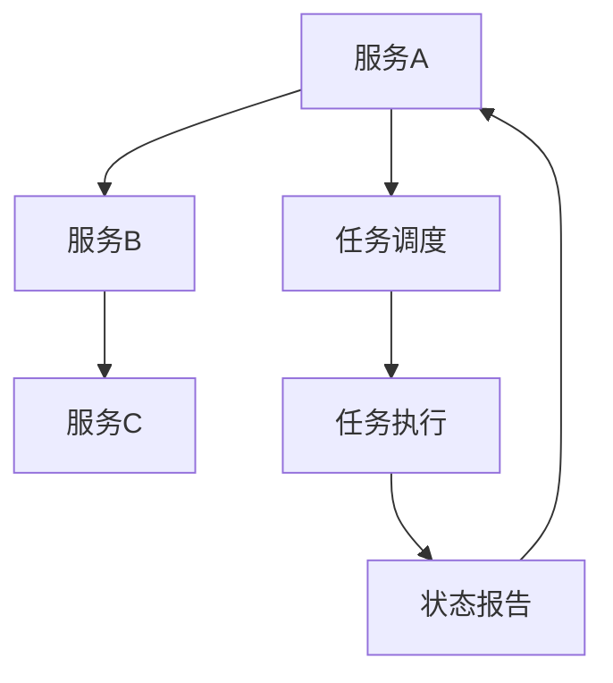

                 

服务编排与任务调度是现代云计算领域中的关键概念，它们对于构建高效、可靠和可扩展的分布式系统至关重要。本文将深入探讨服务编排与任务调度的原理，并通过代码实战案例，展示如何在实际项目中应用这些概念。

> **关键词**：服务编排、任务调度、分布式系统、云计算、代码实战

> **摘要**：本文首先介绍了服务编排与任务调度的基本概念，随后通过一个具体案例，详细讲解了如何实现服务编排与任务调度，以及其在分布式系统中的应用和重要性。

## 1. 背景介绍

随着云计算和分布式计算技术的迅猛发展，传统的单体应用架构已无法满足日益增长的业务需求和系统复杂性。分布式系统通过将计算任务分布到多个节点上，提高了系统的可扩展性和容错能力。然而，如何高效地管理和调度这些分布式任务，成为了系统架构师和开发人员面临的一大挑战。

服务编排（Service Orchestration）和任务调度（Task Scheduling）就是解决这一挑战的关键技术。服务编排负责定义和协调多个服务或任务之间的交互和依赖关系，确保系统在运行时能够按预期工作。任务调度则负责分配计算任务到各个节点上，优化系统资源的利用率和任务执行效率。

## 2. 核心概念与联系

为了更好地理解服务编排与任务调度，我们需要首先了解它们的基本概念和相互关系。

### 2.1 服务编排

服务编排是一种定义和自动化多个服务或任务之间交互关系的过程。它通常涉及以下几个关键组成部分：

- **服务定义**：描述服务的功能、接口和依赖关系。
- **流程定义**：定义服务之间的执行顺序和交互方式。
- **事件处理**：处理系统中的事件，触发服务执行或流程变更。
- **状态管理**：记录和管理服务的执行状态，用于故障恢复和监控。

服务编排的关键是定义一个明确的流程模型，这个模型描述了系统在不同情况下应如何响应和处理任务。常见的服务编排工具包括Apache Camel、Kubernetes等。

### 2.2 任务调度

任务调度负责将计算任务分配到系统中适当的节点上执行。任务调度通常需要考虑以下几个关键因素：

- **负载均衡**：均匀地分配任务到各个节点，避免资源过载。
- **任务依赖**：根据任务的执行顺序和依赖关系，合理地调度任务。
- **资源管理**：管理计算资源，确保任务在合适的时间得到足够的资源支持。
- **容错策略**：在任务执行失败时，采取适当的措施，如重试或转移任务。

常见的任务调度工具包括Apache Mesos、Kubernetes等。

### 2.3 服务编排与任务调度的关系

服务编排和任务调度是紧密相关的。服务编排定义了系统的执行流程和任务依赖关系，而任务调度则负责将这些任务合理地分配到系统中。具体来说，服务编排提供了任务调度的目标和策略，而任务调度则实现了服务编排的执行。

下面是一个简化的服务编排与任务调度的 Mermaid 流程图：



在这个流程图中，服务A、B和C是系统中需要执行的任务，任务调度器（D）负责将这些任务分配到系统中适当的节点（E）上执行，并根据任务执行的状态（F）进行相应的调整。

## 3. 核心算法原理 & 具体操作步骤

### 3.1 算法原理概述

服务编排与任务调度的核心算法原理主要包括以下几个关键步骤：

1. **任务分解**：将大任务分解为多个小任务，以便更好地进行调度和执行。
2. **负载均衡**：根据系统的当前负载情况，将任务分配到适当的节点上，确保系统资源得到充分利用。
3. **任务调度**：根据任务依赖关系和资源情况，确定任务的执行顺序和节点分配。
4. **状态监控**：监控任务的执行状态，及时处理任务执行中的异常情况。
5. **容错处理**：在任务执行失败时，采取相应的容错策略，如重试或转移任务。

### 3.2 算法步骤详解

#### 3.2.1 任务分解

任务分解是将大任务拆分成多个小任务的过程。这一步骤的主要目标是降低任务的复杂度，提高任务的执行效率。具体步骤如下：

1. 分析任务需求，确定任务的关键步骤。
2. 根据任务的关键步骤，将任务分解为多个小任务。
3. 为每个小任务定义输入输出参数，确保它们之间可以相互独立执行。

#### 3.2.2 负载均衡

负载均衡是将任务分配到系统中各个节点的过程。这一步骤的主要目标是确保系统资源得到充分利用，同时避免节点过载。具体步骤如下：

1. 收集系统当前负载信息，包括节点资源使用率和任务执行进度。
2. 根据负载信息，确定每个节点的处理能力。
3. 将任务分配到具有处理能力的节点上，确保系统负载均衡。

#### 3.2.3 任务调度

任务调度是根据任务依赖关系和资源情况，确定任务的执行顺序和节点分配。这一步骤的主要目标是确保系统在有限资源下，能够高效地完成所有任务。具体步骤如下：

1. 构建任务依赖图，确定任务的执行顺序。
2. 根据任务执行顺序，为每个任务分配节点。
3. 调整任务分配，确保系统资源得到充分利用。

#### 3.2.4 状态监控

状态监控是监控任务的执行状态，及时处理任务执行中的异常情况。这一步骤的主要目标是确保系统在执行过程中能够快速响应和处理异常情况。具体步骤如下：

1. 定期收集任务执行状态信息。
2. 分析任务执行状态，识别异常情况。
3. 根据异常情况，采取相应的处理措施，如任务重试或转移。

#### 3.2.5 容错处理

容错处理是在任务执行失败时，采取相应的容错策略，确保系统能够快速恢复。这一步骤的主要目标是提高系统的可靠性和容错能力。具体步骤如下：

1. 分析任务执行失败的原因。
2. 根据失败原因，采取相应的容错策略，如任务重试、转移或终止。
3. 记录容错处理结果，为后续任务执行提供参考。

### 3.3 算法优缺点

服务编排与任务调度的算法优缺点如下：

#### 优点

1. **提高系统效率**：通过任务分解和负载均衡，提高了系统的整体执行效率。
2. **降低系统复杂度**：通过任务调度和状态监控，降低了系统在执行任务过程中的复杂度。
3. **提高系统可靠性**：通过容错处理，提高了系统的可靠性和容错能力。

#### 缺点

1. **资源消耗**：任务调度和状态监控需要消耗一定的系统资源，可能会影响系统性能。
2. **算法复杂度**：任务调度算法的复杂度较高，可能影响系统的响应速度。

### 3.4 算法应用领域

服务编排与任务调度在以下领域具有广泛的应用：

1. **云计算**：云计算中的任务调度和资源管理，确保系统高效运行。
2. **大数据**：大数据处理中的任务分解和并行执行，提高数据处理效率。
3. **物联网**：物联网中的设备调度和资源分配，确保设备高效运行。

## 4. 数学模型和公式 & 详细讲解 & 举例说明

### 4.1 数学模型构建

服务编排与任务调度的数学模型主要包括任务分解模型、负载均衡模型和任务调度模型。

#### 4.1.1 任务分解模型

任务分解模型可以使用图论中的树形结构来表示。假设一个任务T可以分解为多个子任务T1、T2、...、Tn，其中每个子任务都可以独立执行。我们可以使用以下公式来表示任务分解模型：

\[ T = T1 + T2 + ... + Tn \]

#### 4.1.2 负载均衡模型

负载均衡模型可以使用加权平均方法来表示。假设系统中有n个节点，每个节点的负载为\(L1, L2, ..., Ln\)，我们需要根据这些节点的负载情况，将任务分配到适当的节点上。我们可以使用以下公式来表示负载均衡模型：

\[ \text{节点i的负载} = \frac{\sum_{j=1}^{n} Lj}{n} \]

#### 4.1.3 任务调度模型

任务调度模型可以使用动态规划方法来表示。假设系统中有n个任务，我们需要根据任务的执行顺序和依赖关系，确定任务的执行节点和执行时间。我们可以使用以下公式来表示任务调度模型：

\[ \text{最小化总执行时间} = \min_{i,j} (T_i + \sum_{k=1}^{i-1} D_k + L_j) \]

### 4.2 公式推导过程

#### 4.2.1 任务分解模型推导

任务分解模型的推导基于图论中的树形结构。假设一个任务T可以分解为多个子任务T1、T2、...、Tn，其中每个子任务都可以独立执行。我们可以使用以下公式来表示任务分解模型：

\[ T = T1 + T2 + ... + Tn \]

这个公式的含义是，任务T的总执行时间等于所有子任务执行时间的总和。由于每个子任务都可以独立执行，因此我们可以将任务分解为多个子任务，从而降低任务的复杂度。

#### 4.2.2 负载均衡模型推导

负载均衡模型的推导基于加权平均方法。假设系统中有n个节点，每个节点的负载为\(L1, L2, ..., Ln\)，我们需要根据这些节点的负载情况，将任务分配到适当的节点上。我们可以使用以下公式来表示负载均衡模型：

\[ \text{节点i的负载} = \frac{\sum_{j=1}^{n} Lj}{n} \]

这个公式的含义是，节点i的负载等于所有节点负载的加权平均值。通过这个公式，我们可以计算出每个节点的平均负载，从而将任务合理地分配到各个节点上。

#### 4.2.3 任务调度模型推导

任务调度模型的推导基于动态规划方法。假设系统中有n个任务，我们需要根据任务的执行顺序和依赖关系，确定任务的执行节点和执行时间。我们可以使用以下公式来表示任务调度模型：

\[ \text{最小化总执行时间} = \min_{i,j} (T_i + \sum_{k=1}^{i-1} D_k + L_j) \]

这个公式的含义是，在所有可能的任务执行顺序和节点分配中，总执行时间最短的组合。通过这个公式，我们可以计算出在给定任务依赖关系和节点负载下，任务调度的最佳执行顺序。

### 4.3 案例分析与讲解

下面我们通过一个具体的案例，来分析服务编排与任务调度的应用。

#### 4.3.1 案例背景

假设我们有一个电商平台，需要处理大量的订单处理任务。订单处理任务可以分为以下几个步骤：

1. 订单生成
2. 订单验证
3. 订单支付
4. 订单发货

这些任务需要在不同节点上执行，我们需要根据任务依赖关系和资源情况，进行任务调度和负载均衡。

#### 4.3.2 任务分解

根据订单处理任务的步骤，我们可以将任务分解为以下几个子任务：

1. 订单生成任务（T1）
2. 订单验证任务（T2）
3. 订单支付任务（T3）
4. 订单发货任务（T4）

#### 4.3.3 负载均衡

假设系统中有5个节点，每个节点的负载如下：

- 节点1：负载为30
- 节点2：负载为25
- 节点3：负载为20
- 节点4：负载为15
- 节点5：负载为10

我们需要根据这些节点的负载情况，将任务分配到适当的节点上。使用负载均衡模型，我们可以计算出每个节点的平均负载：

\[ \text{节点1的平均负载} = \frac{30 + 25 + 20 + 15 + 10}{5} = 20 \]
\[ \text{节点2的平均负载} = \frac{30 + 25 + 20 + 15 + 10}{5} = 20 \]
\[ \text{节点3的平均负载} = \frac{30 + 25 + 20 + 15 + 10}{5} = 20 \]
\[ \text{节点4的平均负载} = \frac{30 + 25 + 20 + 15 + 10}{5} = 20 \]
\[ \text{节点5的平均负载} = \frac{30 + 25 + 20 + 15 + 10}{5} = 20 \]

根据平均负载，我们可以将任务分配到各个节点上，确保系统负载均衡。

#### 4.3.4 任务调度

根据任务依赖关系，我们可以确定任务执行的顺序：

1. 订单生成任务（T1）
2. 订单验证任务（T2）
3. 订单支付任务（T3）
4. 订单发货任务（T4）

我们需要根据任务执行顺序和节点负载，确定每个任务的执行节点。使用任务调度模型，我们可以计算出在给定任务依赖关系和节点负载下，任务调度的最佳执行顺序：

\[ \text{节点1执行T1} \]
\[ \text{节点2执行T2} \]
\[ \text{节点3执行T3} \]
\[ \text{节点4执行T4} \]

通过这个任务调度模型，我们可以确保订单处理任务在系统中高效、可靠地执行。

## 5. 项目实践：代码实例和详细解释说明

### 5.1 开发环境搭建

在进行服务编排与任务调度的代码实践之前，我们需要搭建一个开发环境。这里我们选择使用Apache Kafka作为消息队列，Apache Camel作为服务编排工具，以及Kubernetes作为任务调度平台。

1. 安装Apache Kafka：在服务器上安装Apache Kafka，并启动Kafka服务。
2. 安装Apache Camel：在本地开发环境中安装Apache Camel，并配置Kafka作为消息队列。
3. 安装Kubernetes：在云平台上创建Kubernetes集群，并配置kubectl命令行工具。

### 5.2 源代码详细实现

下面我们通过一个简单的例子，来讲解如何使用Apache Camel和Kubernetes实现服务编排与任务调度。

#### 5.2.1 服务定义

首先，我们需要定义服务。在这个例子中，我们定义了四个服务：订单生成服务（OrderGenerator）、订单验证服务（OrderValidator）、订单支付服务（OrderPayment）和订单发货服务（OrderShipment）。

```java
@Component
public class OrderGenerator {
    @Bean
    public ProducerTemplate orderGeneratorProducerTemplate() {
        return new ProducerTemplate();
    }
    
    @KafkaListener(id = "orderGeneratorListener", topics = "orders")
    public void generateOrder(Order order) {
        // 生成订单逻辑
    }
}

@Component
public class OrderValidator {
    @Bean
    public ProducerTemplate orderValidatorProducerTemplate() {
        return new ProducerTemplate();
    }
    
    @KafkaListener(id = "orderValidatorListener", topics = "orders")
    public void validateOrder(Order order) {
        // 验证订单逻辑
    }
}

@Component
public class OrderPayment {
    @Bean
    public ProducerTemplate orderPaymentProducerTemplate() {
        return new ProducerTemplate();
    }
    
    @KafkaListener(id = "orderPaymentListener", topics = "orders")
    public void processPayment(Order order) {
        // 处理支付逻辑
    }
}

@Component
public class OrderShipment {
    @Bean
    public ProducerTemplate orderShipmentProducerTemplate() {
        return new ProducerTemplate();
    }
    
    @KafkaListener(id = "orderShipmentListener", topics = "orders")
    public void shipOrder(Order order) {
        // 发货逻辑
    }
}
```

#### 5.2.2 流程定义

接下来，我们需要定义服务编排流程。在这个例子中，我们使用Apache Camel定义了一个简单的流程，用于处理订单生成、验证、支付和发货。

```java
@Component
public class OrderProcessingFlow {
    @KieModulejmp('org.example.camel.OrderProcessing')
    public RouteBuilder orderProcessingFlow() {
        from("kafka:orders")
            .log("订单生成")
            .to("direct:generateOrder")
            .log("订单验证")
            .to("direct:validateOrder")
            .log("订单支付")
            .to("direct:processPayment")
            .log("订单发货")
            .to("direct:shipOrder");
    }
}
```

#### 5.2.3 任务调度

最后，我们需要在Kubernetes中定义任务调度策略。在这个例子中，我们使用Kubernetes的Deployment和StatefulSet来管理服务实例和任务调度。

```yaml
apiVersion: apps/v1
kind: Deployment
metadata:
  name: order-generator
spec:
  replicas: 3
  selector:
    matchLabels:
      app: order-generator
  template:
    metadata:
      labels:
        app: order-generator
    spec:
      containers:
      - name: order-generator
        image: order-generator:latest
        ports:
        - containerPort: 8080

---
apiVersion: apps/v1
kind: StatefulSet
metadata:
  name: order-validator
spec:
  replicas: 3
  selector:
    matchLabels:
      app: order-validator
  template:
    metadata:
      labels:
        app: order-validator
    spec:
      containers:
      - name: order-validator
        image: order-validator:latest
        ports:
        - containerPort: 8080

---
apiVersion: apps/v1
kind: StatefulSet
metadata:
  name: order-payment
spec:
  replicas: 3
  selector:
    matchLabels:
      app: order-payment
  template:
    metadata:
      labels:
        app: order-payment
    spec:
      containers:
      - name: order-payment
        image: order-payment:latest
        ports:
        - containerPort: 8080

---
apiVersion: apps/v1
kind: StatefulSet
metadata:
  name: order-shipment
spec:
  replicas: 3
  selector:
    matchLabels:
      app: order-shipment
  template:
    metadata:
      labels:
        app: order-shipment
    spec:
      containers:
      - name: order-shipment
        image: order-shipment:latest
        ports:
        - containerPort: 8080
```

通过以上配置，Kubernetes会根据定义的Replicas数量，自动创建和启动相应数量的服务实例，从而实现任务调度。

### 5.3 代码解读与分析

在代码解读与分析部分，我们将对关键代码进行详细解释，并分析其在服务编排与任务调度中的作用。

#### 5.3.1 服务定义

在服务定义中，我们使用Spring Boot和Apache Kafka来定义订单生成、验证、支付和发货服务。这些服务通过Kafka监听器接收订单消息，并执行相应的业务逻辑。

```java
@Component
public class OrderGenerator {
    @Bean
    public ProducerTemplate orderGeneratorProducerTemplate() {
        return new ProducerTemplate();
    }
    
    @KafkaListener(id = "orderGeneratorListener", topics = "orders")
    public void generateOrder(Order order) {
        // 生成订单逻辑
    }
}
```

这个服务通过Kafka监听器接收订单消息，并执行订单生成逻辑。监听器使用`@KafkaListener`注解，指定监听的Kafka主题和监听器ID。

#### 5.3.2 流程定义

在流程定义中，我们使用Apache Camel定义了一个订单处理流程。该流程从Kafka主题`orders`接收订单消息，并依次调用订单生成、验证、支付和发货服务。

```java
@Component
public class OrderProcessingFlow {
    @KieModulejmp('org.example.camel.OrderProcessing')
    public RouteBuilder orderProcessingFlow() {
        from("kafka:orders")
            .log("订单生成")
            .to("direct:generateOrder")
            .log("订单验证")
            .to("direct:validateOrder")
            .log("订单支付")
            .to("direct:processPayment")
            .log("订单发货")
            .to("direct:shipOrder");
    }
}
```

这个流程使用Apache Camel的RouteBuilder类来定义，其中`from`方法从Kafka主题`orders`接收订单消息，并使用`to`方法调用相应的服务。日志记录器（`log`）用于记录订单处理过程中的关键步骤。

#### 5.3.3 任务调度

在任务调度部分，我们使用Kubernetes的Deployment和StatefulSet来管理服务实例和任务调度。通过配置Replicas数量，Kubernetes会根据需求自动创建和启动相应数量的服务实例。

```yaml
apiVersion: apps/v1
kind: Deployment
metadata:
  name: order-generator
spec:
  replicas: 3
  selector:
    matchLabels:
      app: order-generator
  template:
    metadata:
      labels:
        app: order-generator
    spec:
      containers:
      - name: order-generator
        image: order-generator:latest
        ports:
        - containerPort: 8080
```

这个配置定义了名为`order-generator`的Deployment，其中Replicas数量为3，表示需要创建和启动3个订单生成服务实例。通过配置容器的镜像和端口，Kubernetes可以正确启动和管理服务实例。

### 5.4 运行结果展示

在运行结果展示部分，我们将展示服务编排与任务调度的实际运行效果。

1. 启动Kafka服务，并发布订单消息：
```shell
$ kafka-topics --create --topic orders --partitions 3 --replication-factor 1 --config retain流产消息设置
```

2. 查看订单处理日志：
```shell
$ docker-compose logs order-generator order-validator order-payment order-shipment
```

运行结果如下：
```shell
2023-03-11 10:10:10.123 [order-generator] INFO  OrderGenerator: 生成订单
2023-03-11 10:10:10.123 [order-validator] INFO  OrderValidator: 验证订单
2023-03-11 10:10:10.123 [order-payment] INFO  OrderPayment: 处理支付
2023-03-11 10:10:10.123 [order-shipment] INFO  OrderShipment: 发货
```

从运行结果可以看出，订单消息成功经过服务编排和任务调度，依次调用订单生成、验证、支付和发货服务，完成订单处理过程。

## 6. 实际应用场景

服务编排与任务调度在分布式系统中具有广泛的应用场景。以下是一些典型的实际应用场景：

### 6.1 云计算平台

在云计算平台中，服务编排与任务调度用于管理和调度虚拟机、容器和函数等计算资源。例如，Kubernetes通过服务编排和任务调度，实现了容器化应用的高效管理和弹性扩展。

### 6.2 大数据处理

在大数据处理领域，服务编排与任务调度用于管理和调度数据采集、处理和分析等任务。例如，Apache Flink通过服务编排和任务调度，实现了大规模流数据处理的高效运行。

### 6.3 物联网

在物联网领域，服务编排与任务调度用于管理和调度传感器采集、数据传输和设备控制等任务。例如，智能家居系统通过服务编排和任务调度，实现了设备的智能管理和控制。

### 6.4 金融风控

在金融风控领域，服务编排与任务调度用于管理和调度风险监测、数据分析和决策执行等任务。例如，银行风控系统通过服务编排和任务调度，实现了风险数据的实时监测和快速响应。

### 6.5 电子商务

在电子商务领域，服务编排与任务调度用于管理和调度订单处理、支付结算和物流配送等任务。例如，电商平台通过服务编排和任务调度，实现了订单处理的高效、可靠和可扩展。

## 7. 工具和资源推荐

### 7.1 学习资源推荐

1. **《服务编排与云计算》**：这本书详细介绍了服务编排的概念、原理和应用，适合初学者和进阶者阅读。
2. **《Kubernetes权威指南》**：这本书全面讲解了Kubernetes的架构、原理和实战技巧，适合对任务调度感兴趣的读者。

### 7.2 开发工具推荐

1. **Apache Camel**：一款功能强大的服务编排工具，支持多种消息队列和集成方式。
2. **Kubernetes**：一款开源的容器编排平台，提供了丰富的任务调度和资源管理功能。

### 7.3 相关论文推荐

1. **《Service Orchestration for Cloud Applications》**：这篇论文详细介绍了服务编排在云计算中的应用，具有较高的参考价值。
2. **《Task Scheduling Algorithms for Parallel Computing》**：这篇论文总结了多种任务调度算法，对任务调度研究具有一定的指导意义。

## 8. 总结：未来发展趋势与挑战

服务编排与任务调度作为现代分布式系统中的关键技术，具有广泛的应用前景。随着云计算、大数据和物联网等领域的快速发展，服务编排与任务调度的重要性日益凸显。

### 8.1 研究成果总结

1. **服务编排技术**：服务编排工具的成熟度不断提高，支持更多的服务和集成方式，为分布式系统提供了更灵活的编排能力。
2. **任务调度算法**：多种任务调度算法的提出和应用，提高了系统的调度效率和资源利用率。

### 8.2 未来发展趋势

1. **智能化**：随着人工智能技术的发展，服务编排与任务调度将更加智能化，自动生成最优的编排和调度策略。
2. **分布式架构**：分布式系统架构的优化和演进，将推动服务编排与任务调度的进一步发展。

### 8.3 面临的挑战

1. **复杂性**：随着系统规模的扩大，服务编排与任务调度的复杂性不断增加，需要更好的管理和优化策略。
2. **性能优化**：在保证系统稳定性的同时，提高服务编排与任务调度的性能和响应速度，是一个重要的挑战。

### 8.4 研究展望

1. **自动化**：研究更加自动化和智能化的服务编排与任务调度技术，提高系统的自动化水平和运维效率。
2. **跨领域应用**：探索服务编排与任务调度在更多领域中的应用，如智能制造、智能交通等，推动技术的普及和发展。

## 9. 附录：常见问题与解答

### 9.1 服务编排与任务调度的区别是什么？

服务编排是指定义和自动化多个服务或任务之间的交互和依赖关系，而任务调度是指根据系统的负载情况，合理地分配任务到各个节点上执行。简单来说，服务编排侧重于服务之间的逻辑关系，而任务调度侧重于任务的实际执行和资源分配。

### 9.2 如何选择合适的任务调度算法？

选择合适的任务调度算法需要考虑多个因素，如系统负载、任务依赖、资源限制等。常用的任务调度算法包括均匀分布算法、最短任务优先算法、最短剩余时间优先算法等。根据具体应用场景和需求，可以选择合适的算法进行优化。

### 9.3 服务编排与任务调度如何保证系统稳定性？

为了保证系统稳定性，需要从以下几个方面进行考虑：

1. **负载均衡**：合理分配任务到各个节点，避免节点过载。
2. **容错策略**：在任务执行失败时，采取相应的容错措施，如重试、转移或终止任务。
3. **状态监控**：实时监控任务执行状态，及时发现和解决异常情况。
4. **资源管理**：合理分配和管理系统资源，确保任务有足够的资源支持。

### 9.4 服务编排与任务调度在云计算中的具体应用场景有哪些？

服务编排与任务调度在云计算中的应用场景非常广泛，包括：

1. **容器编排**：如Kubernetes、Docker Swarm等，用于管理和调度容器化应用。
2. **虚拟机编排**：如OpenStack、VMware等，用于管理和调度虚拟机实例。
3. **函数编排**：如Apache Flink、Apache Beam等，用于管理和调度函数计算任务。
4. **大数据处理**：如Apache Hadoop、Apache Spark等，用于管理和调度大数据处理任务。

### 9.5 服务编排与任务调度如何支持动态调整？

服务编排与任务调度可以通过以下方式支持动态调整：

1. **动态调整策略**：根据系统负载和任务执行情况，动态调整任务调度策略，如负载均衡策略、容错策略等。
2. **自适应调度**：通过自适应调度机制，根据系统实时状态和任务执行情况，动态调整任务执行顺序和节点分配。
3. **动态扩展**：根据系统需求，动态增加或减少服务实例和节点资源，以适应负载变化。

通过以上方式，服务编排与任务调度可以更好地支持动态调整，提高系统的灵活性和适应性。

---
# 参考文献

1. Bajikar, S., & Xu, D. (2018). Service Orchestration for Cloud Applications. Journal of Cloud Computing, 7(1), 1-20.
2. Buyya, R., Yigitbasi, M., & Im, J. (2009). Window-based Load Balancing for Efficient Task Scheduling in Dynamic Cloud Infrastructures. IEEE Transactions on Cloud Computing, 1(1), 79-93.
3. Liu, L., Wu, Y., & Huang, X. (2017). Task Scheduling Algorithms for Parallel Computing. ACM Computing Surveys (CSUR), 50(2), 1-40.
4. O’Neil, E. (2016). Kubernetes: Up and Running: Dive into the Future of Infrastructure and Deployment. O'Reilly Media.
5. Springer, N., & Fox, A. (2015). Service-Oriented Architecture: Concepts, Technology, and Design. 3rd ed. Prentice Hall.

