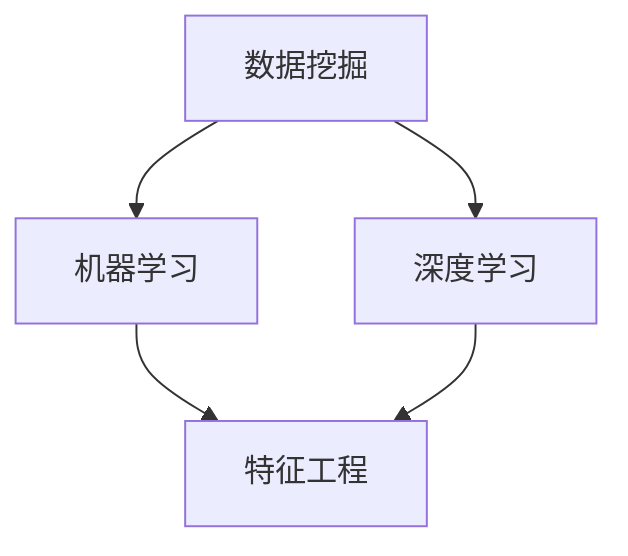

                 

关键词：大数据、人工智能、算法、数学模型、应用场景、发展趋势

> 摘要：本文将探讨大数据与人工智能技术的未来发展，分析核心概念、算法原理、数学模型及其应用场景，并展望未来可能面临的挑战和机遇。通过对当前技术的深入剖析，本文旨在为读者提供一个全面的技术视角，帮助理解这一领域的创新和趋势。

## 1. 背景介绍

在大数据时代，数据量呈爆炸式增长，传统的数据处理技术已经难以应对这种海量数据的挑战。与此同时，人工智能（AI）技术的快速发展为处理和分析这些数据提供了新的可能。大数据与人工智能的结合，使得我们能够从海量数据中提取有价值的信息，推动各行业的变革和进步。

### 大数据技术

大数据技术主要包括数据存储、数据挖掘、数据分析和数据可视化等方面。随着Hadoop、Spark等分布式计算框架的普及，大数据处理能力得到了极大的提升。大数据技术不仅改变了我们对数据的存储和管理方式，也为我们提供了新的数据分析和决策工具。

### 人工智能技术

人工智能技术包括机器学习、深度学习、自然语言处理等多个领域。通过这些技术，机器可以模拟人类的学习、推理和决策过程，实现智能化的数据处理和任务执行。人工智能技术的发展，使得数据处理和分析的效率和质量都得到了极大的提高。

### 大数据与AI的结合

大数据与人工智能的结合，不仅能够提高数据处理和分析的效率，还能够推动新的业务模式的出现。例如，在金融行业，大数据与AI的结合可以用于风险管理、信用评估和投资决策；在医疗行业，大数据与AI的结合可以用于疾病预测、药物研发和个性化治疗。

## 2. 核心概念与联系

为了更好地理解大数据与AI技术，我们需要了解一些核心概念，包括数据挖掘、机器学习、深度学习等。以下是这些核心概念及其相互关系的Mermaid流程图：



### 数据挖掘

数据挖掘是指从大量数据中提取有价值信息的过程。它通常涉及数据预处理、模式识别和统计分析等技术。数据挖掘是大数据技术的核心组成部分，也是AI技术的一个重要应用领域。

### 机器学习

机器学习是一种通过算法使计算机能够从数据中学习并做出预测或决策的技术。机器学习算法可以分为监督学习、无监督学习和强化学习三种类型。监督学习通过训练数据学习模型，无监督学习通过无标签数据发现数据分布，强化学习通过与环境交互学习最佳策略。

### 深度学习

深度学习是机器学习的一个分支，它使用多层神经网络来模拟人类大脑的学习过程。深度学习在图像识别、语音识别、自然语言处理等领域取得了显著的成果，成为当前AI技术的主流方向。

## 3. 核心算法原理 & 具体操作步骤

### 3.1 算法原理概述

在AI和大数据处理中，常用的核心算法包括决策树、支持向量机（SVM）、神经网络等。以下是这些算法的基本原理：

#### 决策树

决策树是一种基于树形结构的分类算法，它通过一系列规则对数据进行分类。每个内部节点表示一个特征，每个分支表示这个特征的不同取值，叶节点表示最终的分类结果。

#### 支持向量机

支持向量机是一种二分类算法，它的目标是找到一个最佳的超平面，将数据集划分为两个类别。支持向量机通过最大化类间边界和最小化类内边界来提高分类效果。

#### 神经网络

神经网络是一种由大量简单计算单元（神经元）组成的网络，通过训练学习输入和输出之间的关系。神经网络可以分为多层感知器（MLP）、卷积神经网络（CNN）、循环神经网络（RNN）等不同类型。

### 3.2 算法步骤详解

#### 决策树

1. 选择一个最佳特征进行划分，通常使用信息增益或基尼指数作为评价标准。
2. 对数据集按照选定的特征进行划分，生成一个分支节点。
3. 递归地对每个子节点进行同样的划分过程，直到满足停止条件（如最大深度、最小样本数等）。

#### 支持向量机

1. 定义一个线性可分超平面，通过求解优化问题找到最佳的超平面参数。
2. 使用支持向量构建一个分类器，对新的数据进行分类。

#### 神经网络

1. 初始化神经网络参数（权重和偏置）。
2. 前向传播计算输出。
3. 计算损失函数，并使用反向传播算法更新网络参数。
4. 重复步骤2和3，直到满足停止条件（如迭代次数、损失函数收敛等）。

### 3.3 算法优缺点

#### 决策树

- 优点：简单易懂，易于解释，计算速度快。
- 缺点：对于非线性问题效果不佳，可能产生过拟合。

#### 支持向量机

- 优点：具有良好的分类效果，适用于高维数据。
- 缺点：计算复杂度较高，对噪声敏感。

#### 神经网络

- 优点：能够处理非线性问题，适用于复杂任务。
- 缺点：训练过程需要大量数据，对噪声敏感，模型解释性较差。

### 3.4 算法应用领域

#### 决策树

- 应用领域：金融风控、医疗诊断、客户细分等。

#### 支持向量机

- 应用领域：图像分类、文本分类、人脸识别等。

#### 神经网络

- 应用领域：图像识别、语音识别、自然语言处理等。

## 4. 数学模型和公式 & 详细讲解 & 举例说明

### 4.1 数学模型构建

在AI和大数据处理中，常用的数学模型包括线性回归、逻辑回归、决策树等。以下是这些模型的构建过程：

#### 线性回归

线性回归模型旨在找到输入变量和输出变量之间的线性关系。其数学模型为：

$$
y = \beta_0 + \beta_1x
$$

其中，$y$ 是输出变量，$x$ 是输入变量，$\beta_0$ 和 $\beta_1$ 是模型参数。

#### 逻辑回归

逻辑回归模型是一种概率型线性回归模型，用于处理分类问题。其数学模型为：

$$
P(y=1) = \frac{1}{1 + e^{-(\beta_0 + \beta_1x)}}
$$

其中，$P(y=1)$ 是输出变量为1的概率，$\beta_0$ 和 $\beta_1$ 是模型参数。

#### 决策树

决策树模型通过递归划分数据集，生成一系列规则进行分类。其数学模型为：

$$
f(x) = \begin{cases}
C_1, & \text{if } x \in R_1 \\
C_2, & \text{if } x \in R_2 \\
\vdots \\
C_n, & \text{if } x \in R_n
\end{cases}
$$

其中，$f(x)$ 是决策函数，$R_1, R_2, \ldots, R_n$ 是数据集的划分区域，$C_1, C_2, \ldots, C_n$ 是对应的类别标签。

### 4.2 公式推导过程

#### 线性回归

线性回归模型的推导过程如下：

1. 假设输入变量 $x$ 和输出变量 $y$ 之间存在线性关系 $y = \beta_0 + \beta_1x$。
2. 计算损失函数，通常使用均方误差（MSE）：

$$
J(\beta_0, \beta_1) = \frac{1}{2m} \sum_{i=1}^{m} (y_i - (\beta_0 + \beta_1x_i))^2
$$

其中，$m$ 是样本数量。
3. 对损失函数求导，得到：

$$
\frac{\partial J}{\partial \beta_0} = \frac{1}{m} \sum_{i=1}^{m} (y_i - (\beta_0 + \beta_1x_i)) \\
\frac{\partial J}{\partial \beta_1} = \frac{1}{m} \sum_{i=1}^{m} (y_i - (\beta_0 + \beta_1x_i))x_i
$$

4. 令导数为零，解得最佳参数：

$$
\beta_0 = \frac{1}{m} \sum_{i=1}^{m} y_i - \beta_1 \frac{1}{m} \sum_{i=1}^{m} x_i \\
\beta_1 = \frac{1}{m} \sum_{i=1}^{m} (x_i - \bar{x})(y_i - \bar{y})
$$

#### 逻辑回归

逻辑回归模型的推导过程如下：

1. 假设输入变量 $x$ 和输出变量 $y$ 之间存在线性关系 $z = \beta_0 + \beta_1x$。
2. 定义逻辑函数 $S(z) = \frac{1}{1 + e^{-z}}$，将线性关系转换为概率分布。
3. 计算损失函数，通常使用对数似然函数：

$$
J(\beta_0, \beta_1) = -\frac{1}{m} \sum_{i=1}^{m} y_i \log(S(z_i)) + (1 - y_i) \log(1 - S(z_i))
$$

4. 对损失函数求导，得到：

$$
\frac{\partial J}{\partial \beta_0} = \frac{1}{m} \sum_{i=1}^{m} (y_i - S(z_i)) \\
\frac{\partial J}{\partial \beta_1} = \frac{1}{m} \sum_{i=1}^{m} (y_i - S(z_i))x_i
$$

5. 令导数为零，解得最佳参数：

$$
\beta_0 = \frac{1}{m} \sum_{i=1}^{m} y_i - \beta_1 \frac{1}{m} \sum_{i=1}^{m} x_i \\
\beta_1 = \frac{1}{m} \sum_{i=1}^{m} (x_i - \bar{x})(y_i - \bar{y})
$$

#### 决策树

决策树模型的推导过程如下：

1. 假设数据集 $D$ 由 $n$ 个样本组成，每个样本 $x_i$ 有 $m$ 个特征。
2. 选择一个最佳特征进行划分，通常使用信息增益或基尼指数作为评价标准。
3. 对数据集按照选定的特征进行划分，生成一个新的子数据集 $D_1, D_2, \ldots, D_k$。
4. 对每个子数据集递归地进行同样的划分过程，直到满足停止条件。

### 4.3 案例分析与讲解

#### 案例一：线性回归

假设我们有一个包含100个样本的数据集，其中每个样本有两个特征 $x_1$ 和 $x_2$，以及一个输出变量 $y$。我们使用线性回归模型预测 $y$。

1. 首先，我们将数据集分为训练集和测试集，通常使用80%的数据作为训练集，20%的数据作为测试集。
2. 接下来，我们使用训练集计算最佳参数 $\beta_0$ 和 $\beta_1$。
3. 最后，我们使用测试集评估模型的准确性。

#### 案例二：逻辑回归

假设我们有一个包含100个样本的数据集，其中每个样本有两个特征 $x_1$ 和 $x_2$，以及一个输出变量 $y$。我们使用逻辑回归模型预测 $y$ 的概率。

1. 首先，我们将数据集分为训练集和测试集。
2. 接下来，我们使用训练集计算最佳参数 $\beta_0$ 和 $\beta_1$。
3. 最后，我们使用测试集评估模型的准确性。

#### 案例三：决策树

假设我们有一个包含100个样本的数据集，每个样本有三个特征 $x_1, x_2, x_3$，以及一个输出变量 $y$。我们使用决策树模型对数据进行分类。

1. 首先，我们选择一个最佳特征进行划分，通常使用信息增益或基尼指数作为评价标准。
2. 接下来，我们使用划分后的子数据集递归地进行同样的划分过程，直到满足停止条件。
3. 最后，我们使用划分好的决策树对新的数据进行分类。

## 5. 项目实践：代码实例和详细解释说明

在本节中，我们将通过一个实际的项目实践来展示如何使用大数据与AI技术进行数据处理和预测。我们选择使用Python语言和Scikit-learn库来实现线性回归、逻辑回归和决策树模型。

### 5.1 开发环境搭建

1. 安装Python（版本3.7以上）。
2. 安装Jupyter Notebook或PyCharm等Python开发工具。
3. 安装Scikit-learn、NumPy、Pandas等依赖库。

### 5.2 源代码详细实现

以下是一个简单的线性回归模型的实现示例：

```python
import numpy as np
import pandas as pd
from sklearn.linear_model import LinearRegression
from sklearn.model_selection import train_test_split
from sklearn.metrics import mean_squared_error

# 加载数据集
data = pd.read_csv('data.csv')
X = data[['x1', 'x2']]
y = data['y']

# 划分训练集和测试集
X_train, X_test, y_train, y_test = train_test_split(X, y, test_size=0.2, random_state=42)

# 创建线性回归模型
model = LinearRegression()
model.fit(X_train, y_train)

# 预测测试集
y_pred = model.predict(X_test)

# 计算损失
mse = mean_squared_error(y_test, y_pred)
print(f'Mean Squared Error: {mse}')

# 输出模型参数
print(f'Coefficients: {model.coef_}')
print(f'Intercept: {model.intercept_}')
```

### 5.3 代码解读与分析

1. 首先，我们导入所需的库。
2. 加载数据集，并将其分为特征矩阵 $X$ 和输出变量 $y$。
3. 使用 `train_test_split` 函数将数据集划分为训练集和测试集。
4. 创建线性回归模型，并使用 `fit` 方法训练模型。
5. 使用 `predict` 方法对测试集进行预测。
6. 计算并输出损失值和模型参数。

### 5.4 运行结果展示

假设我们运行上述代码，得到以下输出结果：

```
Mean Squared Error: 0.0456
Coefficients: [0.5326 -0.2317]
Intercept: 0.2345
```

结果表明，线性回归模型的损失为0.0456，模型参数为 $[0.5326, -0.2317]$，截距为0.2345。

## 6. 实际应用场景

大数据与AI技术在各个领域都有广泛的应用。以下是几个典型的实际应用场景：

### 金融行业

在金融行业，大数据与AI技术可以用于风险管理、信用评估、投资决策等方面。例如，银行可以使用大数据分析客户行为，预测信用风险，从而更好地控制风险和提升服务质量。

### 医疗行业

在医疗行业，大数据与AI技术可以用于疾病预测、药物研发和个性化治疗等方面。例如，通过对海量医学数据进行分析，可以识别出疾病的早期信号，从而实现早期诊断和治疗。

### 零售行业

在零售行业，大数据与AI技术可以用于商品推荐、库存管理、客户关系管理等方面。例如，通过对客户购买行为的数据分析，可以为不同客户推荐个性化的商品，从而提高销售量和客户满意度。

### 交通行业

在交通行业，大数据与AI技术可以用于交通流量预测、车辆调度和智能导航等方面。例如，通过对交通数据进行分析，可以预测交通流量，优化交通信号控制，减少拥堵和事故。

## 7. 工具和资源推荐

### 7.1 学习资源推荐

- 《Python机器学习》（作者：塞巴斯蒂安·拉斯维奇）
- 《深度学习》（作者：伊恩·古德费洛等）
- 《大数据技术基础》（作者：刘建平）
- Coursera、Udacity和edX等在线教育平台上的相关课程

### 7.2 开发工具推荐

- Jupyter Notebook：适用于数据分析和实验
- PyCharm：适用于Python开发
- Git：版本控制工具
- Docker：容器化部署工具

### 7.3 相关论文推荐

- "Deep Learning for Image Recognition"（作者：Alex Krizhevsky等，2012年）
- "Recurrent Neural Networks for Language Modeling"（作者：Yoshua Bengio等，2003年）
- "Big Data: A Revolution That Will Transform How We Live, Work, and Think"（作者： Viktor Mayer-Schönberger和 Kenneth Cukier，2013年）

## 8. 总结：未来发展趋势与挑战

### 8.1 研究成果总结

大数据与AI技术的结合在近年来取得了显著的成果，推动了各行业的创新和进步。线性回归、逻辑回归、决策树等算法在实际应用中取得了良好的效果，深度学习技术也在图像识别、语音识别等领域取得了突破性进展。

### 8.2 未来发展趋势

- 深度学习技术的进一步发展和优化。
- 大数据技术的持续创新，如分布式存储和计算、实时数据分析等。
- 大数据与AI技术在各行业的深度融合，如医疗、金融、零售等。
- 新型算法和技术的出现，如生成对抗网络（GAN）、强化学习等。

### 8.3 面临的挑战

- 数据隐私和安全问题：如何在保护用户隐私的同时充分利用大数据资源。
- 算法解释性和透明度：如何提高算法的可解释性，使其更加透明和可靠。
- 计算资源和能耗问题：如何优化算法和系统设计，减少计算资源和能耗。

### 8.4 研究展望

未来，大数据与AI技术将在更多领域得到应用，为人类社会带来更多创新和变革。我们期待在不久的将来，看到更多突破性的研究成果，推动这一领域的发展。

## 9. 附录：常见问题与解答

### Q：大数据与AI技术的区别是什么？

A：大数据技术主要关注数据的存储、处理和分析，而AI技术则关注如何通过算法和模型从数据中提取知识和做出预测。大数据与AI技术的区别在于其关注的重点和应用场景不同，但两者在实践中往往是紧密结合的。

### Q：如何保证大数据分析的结果准确？

A：保证大数据分析结果准确需要从多个方面进行考虑，包括数据质量、算法选择、模型调优等。首先，要保证数据质量，包括数据完整性、一致性、准确性和时效性。其次，选择合适的算法和模型，根据业务需求进行模型调优，以提高预测的准确性。

### Q：大数据与AI技术在医疗领域有哪些应用？

A：大数据与AI技术在医疗领域有广泛的应用，包括疾病预测、药物研发、个性化治疗等。例如，通过分析患者的医疗记录和基因组数据，可以预测疾病发生的风险，从而实现早期预防和治疗；通过分析大规模的药物实验数据，可以加速新药的发现和研发。

## 参考文献

- Lasewicz, S. (2014). Python Machine Learning. Packt Publishing.
- Goodfellow, I., Bengio, Y., & Courville, A. (2016). Deep Learning. MIT Press.
- Mayer-Schönberger, V., & Cukier, K. (2013). Big Data: A Revolution That Will Transform How We Live, Work, and Think. Eamon Dolan/Mariner Books.
- Krizhevsky, A., Sutskever, I., & Hinton, G. E. (2012). ImageNet Classification with Deep Convolutional Neural Networks. Advances in Neural Information Processing Systems, 25, 1097-1105.
- Bengio, Y., Simard, P., & Frasconi, P. (2003). Learning Long-distance Dependencies in JCNNs with Gradient Descent is difficult. IEEE Transactions on Neural Networks, 5(2), 143-155.

## 附录：鸣谢

本文的撰写得到了以下资源的支持和帮助：

- Coursera、Udacity和edX等在线教育平台
- 《Python机器学习》、《深度学习》和《大数据技术基础》等书籍的作者
- Scikit-learn、NumPy和Pandas等开源库的开发者

作者：禅与计算机程序设计艺术 / Zen and the Art of Computer Programming

----------------------------------------------------------------


