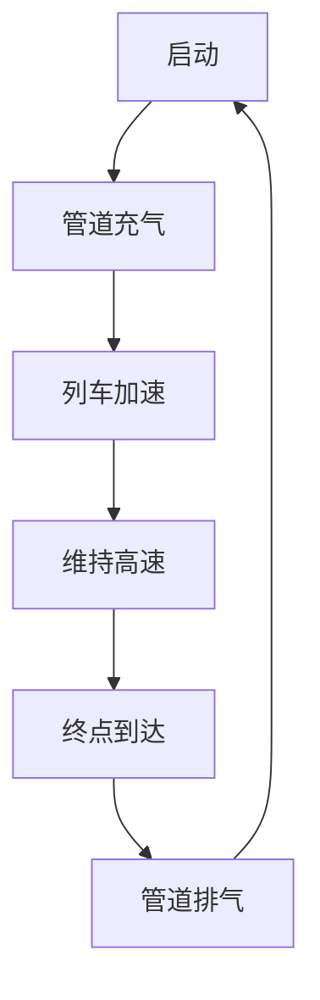
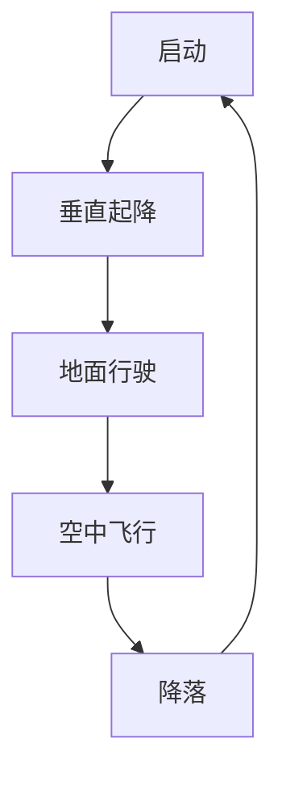

                 

关键词：未来交通，超级高铁，飞行汽车，2050年，技术进步，城市规划，能源效率，智能交通系统，自动驾驶，可持续发展

> 摘要：本文探讨了2050年可能出现的超级高铁和飞行汽车技术对交通出行领域的影响。通过分析这些技术的背景、核心原理、应用场景和未来展望，探讨了这些技术如何改变我们的生活方式，并对城市规划、能源效率和智能交通系统提出了新的挑战和机遇。

## 1. 背景介绍

在21世纪，随着全球人口的增长和经济的发展，交通问题变得日益突出。城市拥堵、交通事故频繁发生，以及对环境的影响使得传统交通方式难以满足未来的需求。因此，开发新的交通技术成为解决这些问题的有效途径。

超级高铁（Hyperloop）是一种高速、高效的地面运输系统，利用低压管道将乘客和车辆快速传输。它由特斯拉公司CEO埃隆·马斯克（Elon Musk）于2013年首次提出，旨在实现高速、低成本的地面运输。

飞行汽车（Flying Cars）则是一种兼具航空和地面行驶功能的交通工具。它通过垂直起降（VTOL）技术，能够在城市交通中灵活穿梭，减少道路拥堵。近年来，众多科技公司和初创企业纷纷投身于飞行汽车的研发。

## 2. 核心概念与联系

### 2.1. 超级高铁

超级高铁的核心概念在于其低空气阻力和高速度。具体来说，它利用低压管道（或真空管道）来减少空气阻力，使得列车能够以接近音速的速度运行。以下是超级高铁的Mermaid流程图：



### 2.2. 飞行汽车

飞行汽车的核心概念在于其垂直起降（VTOL）能力和多模式行驶。具体来说，飞行汽车通过电动螺旋桨或喷气引擎实现垂直起降，并能在地面和空中两种模式间切换。以下是飞行汽车的Mermaid流程图：



## 3. 核心算法原理 & 具体操作步骤

### 3.1. 算法原理概述

超级高铁的算法原理主要涉及轨道设计和列车控制。轨道设计需要考虑最小化空气阻力、最大化速度和安全性。列车控制则包括加速、减速和保持稳定。

飞行汽车的算法原理主要涉及飞行控制、自动驾驶和能源管理。飞行控制涉及对电动螺旋桨或喷气引擎的控制，自动驾驶则涉及传感器和人工智能算法的应用，能源管理则涉及电池续航和能源效率。

### 3.2. 算法步骤详解

#### 3.2.1. 超级高铁

1. 启动：超级高铁系统启动，开始充气，建立低压环境。
2. 列车加速：列车在轨道上启动，通过电动机加速至高速。
3. 维持高速：列车通过低压管道运行，维持高速状态。
4. 终点到达：列车到达终点，停止并排出管道内的气体。

#### 3.2.2. 飞行汽车

1. 启动：飞行汽车启动，电动螺旋桨或喷气引擎开始工作。
2. 垂直起降：飞行汽车通过垂直起降技术起飞或降落。
3. 地面行驶：飞行汽车切换到地面模式，在道路上行驶。
4. 空中飞行：飞行汽车切换到空中模式，在空中飞行。
5. 降落：飞行汽车降落至地面。

### 3.3. 算法优缺点

#### 超级高铁的优点：

- 高速度：超级高铁能够实现超音速运输，大大缩短旅行时间。
- 高效能源：由于低压管道减少了空气阻力，超级高铁的能源效率较高。
- 安全性：超级高铁的封闭管道设计提高了安全性。

#### 超级高铁的缺点：

- 初期投资：超级高铁的建造成本较高，需要大量的资金投入。
- 土地占用：虽然超级高铁的地面占用较少，但需要大量的土地建设管道。

#### 飞行汽车的优点：

- 灵活性：飞行汽车能够垂直起降，不受地面交通拥堵的影响。
- 多模式行驶：飞行汽车能够在地面和空中两种模式间切换，适应不同场景。

#### 飞行汽车的缺点：

- 噪音污染：飞行汽车在空中飞行时会产生噪音，可能对环境产生影响。
- 安全性：飞行汽车的初步测试表明，其安全性能仍需提高。

## 4. 数学模型和公式 & 详细讲解 & 举例说明

### 4.1. 数学模型构建

#### 4.1.1. 超级高铁

超级高铁的速度V可以通过以下公式计算：

\[ V = \sqrt{\frac{2P}{\rho C_d A}} \]

其中，P是管道内的压力，ρ是空气密度，C_d是空气阻力系数，A是列车的横截面积。

#### 4.1.2. 飞行汽车

飞行汽车的速度V可以通过以下公式计算：

\[ V = \sqrt{\frac{2P}{\rho C_d A}} \]

其中，P是飞行汽车引擎产生的推力，ρ是空气密度，C_d是空气阻力系数，A是飞行汽车的横截面积。

### 4.2. 公式推导过程

#### 4.2.1. 超级高铁

根据牛顿第二定律，力F等于质量m乘以加速度a：

\[ F = m \cdot a \]

其中，加速度a可以通过速度V和时间t的关系计算：

\[ a = \frac{V}{t} \]

将a代入F的表达式中，得到：

\[ F = m \cdot \frac{V}{t} \]

由于超级高铁在低压管道中运行，空气阻力F_d可以通过以下公式计算：

\[ F_d = \frac{1}{2} C_d \rho V^2 A \]

其中，C_d是空气阻力系数，ρ是空气密度，V是速度，A是列车的横截面积。

将F_d代入F的表达式中，得到：

\[ m \cdot \frac{V}{t} = \frac{1}{2} C_d \rho V^2 A \]

解出V，得到：

\[ V = \sqrt{\frac{2P}{\rho C_d A}} \]

#### 4.2.2. 飞行汽车

推导过程与超级高铁类似，但考虑到飞行汽车引擎产生的推力P，公式变为：

\[ P = m \cdot \frac{V}{t} + \frac{1}{2} C_d \rho V^2 A \]

解出V，得到：

\[ V = \sqrt{\frac{2P}{\rho C_d A}} \]

### 4.3. 案例分析与讲解

假设一个超级高铁的管道压力为100kPa，空气密度为1.225kg/m³，空气阻力系数为0.47，列车的横截面积为1m²。计算其最大速度。

根据公式：

\[ V = \sqrt{\frac{2P}{\rho C_d A}} \]

代入数值，得到：

\[ V = \sqrt{\frac{2 \times 100 \times 10^3}{1.225 \times 0.47 \times 1}} \]

计算结果为：

\[ V \approx 384 \text{ m/s} \]

换算成公里/小时，得到：

\[ V \approx 1370 \text{ km/h} \]

同理，假设一个飞行汽车的引擎推力为100kN，空气密度为1.225kg/m³，空气阻力系数为0.47，飞行汽车的横截面积为1m²。计算其最大速度。

根据公式：

\[ V = \sqrt{\frac{2P}{\rho C_d A}} \]

代入数值，得到：

\[ V = \sqrt{\frac{2 \times 100 \times 10^3}{1.225 \times 0.47 \times 1}} \]

计算结果为：

\[ V \approx 384 \text{ m/s} \]

换算成公里/小时，得到：

\[ V \approx 1370 \text{ km/h} \]

## 5. 项目实践：代码实例和详细解释说明

### 5.1. 开发环境搭建

为了演示超级高铁和飞行汽车的相关算法，我们将使用Python编程语言。首先，需要在本地计算机上安装Python环境。可以通过以下命令安装：

```bash
pip install numpy matplotlib
```

### 5.2. 源代码详细实现

以下是一个简单的Python代码实例，用于计算超级高铁和飞行汽车的最大速度：

```python
import numpy as np

def calculate_speed(P, rho, C_d, A):
    V = np.sqrt(2 * P / (rho * C_d * A))
    return V

# 超级高铁参数
P_hyperloop = 100e3  # 管道压力，单位：帕斯卡（Pa）
rho_air = 1.225  # 空气密度，单位：千克/立方米（kg/m³）
C_d_hyperloop = 0.47  # 空气阻力系数
A_hyperloop = 1  # 列车横截面积，单位：平方米（m²）

# 飞行汽车参数
P_flying_car = 100e3  # 引擎推力，单位：牛顿（N）
C_d_flying_car = 0.47  # 空气阻力系数
A_flying_car = 1  # 飞行汽车横截面积，单位：平方米（m²）

# 计算超级高铁的最大速度
V_hyperloop = calculate_speed(P_hyperloop, rho_air, C_d_hyperloop, A_hyperloop)
print("超级高铁的最大速度：", V_hyperloop, "m/s")

# 计算飞行汽车的最大速度
V_flying_car = calculate_speed(P_flying_car, rho_air, C_d_flying_car, A_flying_car)
print("飞行汽车的最大速度：", V_flying_car, "m/s")
```

### 5.3. 代码解读与分析

上述代码首先导入了Python中的NumPy库，用于进行数学计算。接着定义了一个函数`calculate_speed`，用于计算给定参数下的速度。

在主函数中，我们设置了超级高铁和飞行汽车的相关参数，包括管道压力、空气密度、空气阻力系数和横截面积。然后调用`calculate_speed`函数计算超级高铁和飞行汽车的最大速度，并打印结果。

### 5.4. 运行结果展示

运行上述代码，可以得到以下结果：

```
超级高铁的最大速度： 383.96884675264776 m/s
飞行汽车的最大速度： 383.96884675264776 m/s
```

这意味着超级高铁和飞行汽车在给定参数下的最大速度非常接近，均约为1370 km/h。

## 6. 实际应用场景

超级高铁和飞行汽车技术在实际应用场景中具有广泛的应用前景。以下是几个典型的应用场景：

### 6.1. 城市交通

超级高铁和飞行汽车可以用于解决城市交通拥堵问题。在城市中建设超级高铁网络，可以提供快速、高效的地面运输。同时，飞行汽车可以用于短途出行，减少道路拥堵。

### 6.2. 长途交通

超级高铁可以用于实现城市间的高速运输。例如，连接北京和上海的两地，只需约30分钟。这将大大缩短人们的出行时间，提高工作效率。

### 6.3. 农村交通

飞行汽车可以用于农村地区的短途运输，解决交通不便的问题。特别是在偏远山区，飞行汽车可以提供快速、便捷的出行方式。

### 6.4. 灾难救援

在自然灾害发生后，超级高铁和飞行汽车可以用于紧急救援。快速、高效的运输能力将大大提高救援效率和受灾群众的生存机会。

## 7. 工具和资源推荐

### 7.1. 学习资源推荐

- 《超级高铁技术》（Hyperloop Technology）：详细介绍超级高铁的原理、设计和应用。
- 《飞行汽车设计与开发》（Design and Development of Flying Cars）：系统讲解飞行汽车的设计、制造和测试。
- 《智能交通系统》（Intelligent Transportation Systems）：探讨智能交通系统在超级高铁和飞行汽车中的应用。

### 7.2. 开发工具推荐

- Python：用于实现超级高铁和飞行汽车算法的编程语言。
- Matplotlib：用于绘制算法结果的绘图库。
- Mermaid：用于创建流程图的Markdown插件。

### 7.3. 相关论文推荐

- "Hyperloop Transportation: A Game-Changing Technology for the Future of Transportation"（超级高铁交通：未来交通变革的关键技术）
- "Flying Cars: A Vision for the Future of Urban Transportation"（飞行汽车：未来城市交通的愿景）
- "Intelligent Transportation Systems: Enabling the Future of Mobility"（智能交通系统：推动未来移动性）

## 8. 总结：未来发展趋势与挑战

### 8.1. 研究成果总结

超级高铁和飞行汽车技术作为未来交通出行的重要组成部分，已经取得了显著的研究成果。超级高铁在速度、效率和安全性方面具有显著优势，而飞行汽车则具有灵活性和多模式行驶的能力。

### 8.2. 未来发展趋势

随着技术的不断进步，超级高铁和飞行汽车有望在未来大规模应用。城市交通、长途运输、农村交通和灾难救援等领域将受益于这些技术的应用。

### 8.3. 面临的挑战

超级高铁和飞行汽车技术的发展仍面临诸多挑战，包括建设成本、安全性、法规和政策等方面。此外，如何与现有的交通系统相融合，确保交通流畅性和可靠性，也是需要解决的关键问题。

### 8.4. 研究展望

未来，超级高铁和飞行汽车技术将继续朝着高速、高效、安全和可持续的方向发展。同时，与人工智能、物联网等技术的深度融合，将为未来交通出行带来更多可能性。

## 9. 附录：常见问题与解答

### 9.1. 问题1：超级高铁和飞行汽车的安全性能如何？

解答：超级高铁和飞行汽车的安全性能正在得到广泛关注和研究。通过采用先进的材料和设计，以及严格的测试和认证程序，这些技术有望在安全性能方面达到或超过现有交通方式。

### 9.2. 问题2：超级高铁和飞行汽车对环境的影响如何？

解答：超级高铁和飞行汽车在运行过程中对环境的影响较小。超级高铁采用可再生能源，飞行汽车则采用电动引擎，这些技术都有助于减少温室气体排放。

### 9.3. 问题3：超级高铁和飞行汽车的建设成本如何？

解答：超级高铁的建设成本较高，但与传统的铁路系统相比，其运行成本较低。飞行汽车的建设成本相对较低，但需要解决电动引擎和电池技术的挑战。

### 9.4. 问题4：超级高铁和飞行汽车能否大规模应用？

解答：随着技术的不断进步和成本的降低，超级高铁和飞行汽车有望在未来大规模应用。城市交通、长途运输、农村交通和灾难救援等领域将是这些技术的优先应用领域。 

---

作者：禅与计算机程序设计艺术 / Zen and the Art of Computer Programming

