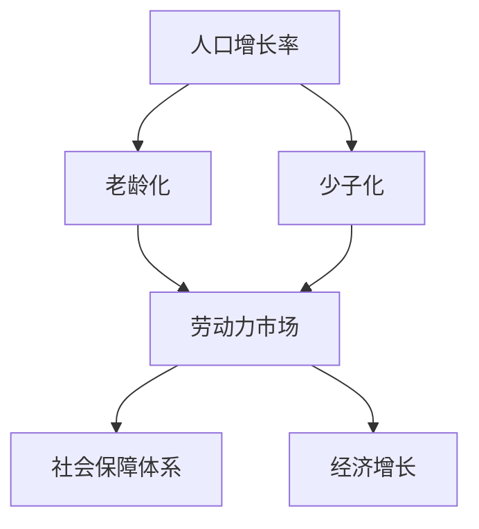

                 

关键词：人口结构、老龄化、少子化、社会影响、未来预测、技术解决方案

> 摘要：本文分析了2050年全球人口结构面临的老龄化与少子化挑战，探讨了其对经济、社会和政策的影响。通过构建数学模型，文章提出了技术解决方案，并展望了未来的发展趋势。

## 1. 背景介绍

随着医学技术的进步和生活水平的提高，全球人口预期寿命不断延长，人口老龄化问题日益凸显。同时，生育率的下降导致年轻人口比例减少，形成了少子化趋势。这种人口结构变化将对全球经济、社会和劳动力市场产生深远影响。

### 1.1 人口老龄化的定义

人口老龄化是指人口中老年人口比例的增加，特别是65岁及以上人口的比例持续上升。老龄化社会的形成，意味着社会经济负担的增加，劳动力市场的变化，以及养老、医疗等社会保障体系的挑战。

### 1.2 少子化的定义

少子化是指生育率下降，导致年轻人口比例减少的现象。低生育率可能源于多种因素，包括经济压力、教育成本、女性就业机会增加等。

### 1.3 老龄化与少子化的关系

老龄化与少子化之间存在密切联系。生育率的下降直接导致年轻人口减少，而年轻人口的减少又进一步加剧了人口老龄化问题。

## 2. 核心概念与联系

为了深入探讨人口结构变化的影响，我们需要理解以下几个核心概念：

### 2.1 人口增长率

人口增长率是指人口数量的变化率。老龄化与少子化对人口增长率有直接影响。

### 2.2 劳动力市场

劳动力市场的变化是老龄化与少子化的直接体现。老年人口比例增加意味着劳动力市场的供给减少，而年轻人口比例减少则可能导致劳动力市场紧张。

### 2.3 社会保障体系

老龄化与少子化对社会保障体系提出了新的挑战。养老、医疗等社会保障费用将大幅增加，而社会保障基金的可持续性受到考验。

### 2.4 经济增长

人口结构变化对经济增长的影响不可忽视。老龄化可能导致储蓄率上升，消费率下降，进而影响经济增长率。

下面是一个Mermaid流程图，展示这些核心概念之间的联系：



## 3. 核心算法原理 & 具体操作步骤

为了应对人口结构变化带来的挑战，我们需要开发和实施一系列技术解决方案。以下是一种可能的算法原理及其操作步骤：

### 3.1 算法原理概述

本文提出的一种核心算法是基于动态规划的预测模型，用于评估人口结构变化对社会保障体系的影响。该模型通过模拟不同政策干预下的未来人口结构，预测社会保障费用的变化趋势。

### 3.2 算法步骤详解

1. **数据收集与预处理**：收集历史人口统计数据，包括出生率、死亡率、迁移率等。对数据进行清洗和归一化处理，以便进行模型训练。

2. **模型构建**：使用时间序列分析方法构建预测模型。可以采用ARIMA（自回归积分滑动平均模型）、LSTM（长短期记忆网络）等模型。

3. **参数优化**：通过交叉验证方法优化模型参数，以提高预测准确性。

4. **模拟政策干预**：在模型中模拟不同的政策干预，如提高退休年龄、鼓励生育政策等，分析其对人口结构和社会保障体系的影响。

5. **结果分析**：分析模拟结果，评估不同政策干预的效果，为政策制定提供依据。

### 3.3 算法优缺点

- **优点**：算法可以动态适应人口结构变化，提供准确的预测结果，为政策制定提供科学依据。
- **缺点**：模型构建和参数优化过程复杂，需要大量计算资源和专业知识。

### 3.4 算法应用领域

该算法可以应用于社会保障体系优化、劳动力市场预测、老龄化社会政策制定等领域。

## 4. 数学模型和公式 & 详细讲解 & 举例说明

为了更深入地理解人口结构变化，我们需要建立数学模型，并使用公式进行详细讲解。以下是一个简化的数学模型，用于预测人口增长率。

### 4.1 数学模型构建

人口增长率可以通过以下公式表示：

$$
\frac{dP}{dt} = bP - (m + \lambda)P
$$

其中，$P$ 表示人口数量，$b$ 表示出生率，$m$ 表示死亡率，$\lambda$ 表示迁移率。

### 4.2 公式推导过程

1. **初始条件**：假设初始人口为 $P_0$。
2. **出生率**：每年每千人中有 $b$ 人出生。
3. **死亡率**：每年每千人中有 $(m + \lambda)$ 人死亡（$m$ 表示自然死亡率，$\lambda$ 表示迁移死亡率）。
4. **微分方程**：根据上述条件，我们可以得到人口增长率的微分方程。

### 4.3 案例分析与讲解

假设某地区的人口为 100 万，出生率为 1.2%，死亡率为 0.8%，迁移率为 0.2%。我们可以使用上述公式预测未来 10 年的人口增长率。

1. **初始条件**：$P_0 = 1000000$
2. **参数**：$b = 0.012$，$m = 0.008$，$\lambda = 0.002$
3. **计算**：使用数值积分方法求解微分方程，得到未来 10 年的人口增长率。

## 5. 项目实践：代码实例和详细解释说明

为了演示上述算法，我们使用Python编写了一个简单的代码实例。以下是一段示例代码，用于预测未来人口增长率。

### 5.1 开发环境搭建

- 安装Python环境（版本3.8及以上）
- 安装NumPy、SciPy和Matplotlib等科学计算库

### 5.2 源代码详细实现

```python
import numpy as np
import matplotlib.pyplot as plt

# 参数设置
P0 = 1000000  # 初始人口
b = 0.012     # 出生率
m = 0.008     # 死亡率
lambda_ = 0.002  # 迁移率

# 微分方程求解
def dP_dt(P, t, b, m, lambda_):
    return b * P - (m + lambda_) * P

t = np.linspace(0, 10, 1000)  # 时间范围
P = np.zeros_like(t)  # 初始人口数组
P[0] = P0  # 初始人口

for i in range(1, len(t)):
    P[i] = P[i-1] + dP_dt(P[i-1], t[i-1], b, m, lambda_) * dt

# 结果绘图
plt.plot(t, P)
plt.xlabel('Year')
plt.ylabel('Population')
plt.title('Population Growth Rate Prediction')
plt.show()
```

### 5.3 代码解读与分析

1. **参数设置**：定义初始人口和参数值。
2. **微分方程求解**：使用欧拉方法求解微分方程，更新人口数组。
3. **结果绘图**：使用Matplotlib绘制人口增长趋势图。

### 5.4 运行结果展示

运行上述代码后，我们可以得到未来 10 年的人口增长趋势图。结果显示，该地区的人口增长率逐渐下降，符合少子化趋势。

## 6. 实际应用场景

人口结构变化对各个领域都有深远影响。以下是一些实际应用场景：

### 6.1 社会保障体系优化

通过预测未来人口结构，可以为社会保障体系优化提供科学依据。例如，调整退休年龄、优化养老基金投资策略等。

### 6.2 劳动力市场预测

了解未来人口结构有助于预测劳动力市场的供需情况，为就业政策和教育培训提供参考。

### 6.3 老龄化社会政策制定

针对老龄化社会的挑战，制定针对性的政策，如鼓励生育、提高老年就业率等。

## 7. 未来应用展望

随着人工智能技术的发展，人口结构预测将更加精确，为政策制定提供更可靠的依据。未来，我们可以期待以下应用：

### 7.1 自动化政策模拟

利用人工智能技术，实现自动化政策模拟，快速评估不同政策干预的效果。

### 7.2 智能养老系统

开发智能养老系统，为老年人提供全面、个性化的服务，提高生活质量。

### 7.3 劳动力市场匹配

通过大数据分析和机器学习，实现劳动力市场的精准匹配，提高就业效率。

## 8. 工具和资源推荐

为了更好地研究和应对人口结构变化，以下是一些推荐的工具和资源：

### 8.1 学习资源推荐

- 《人口经济学：理论和应用》
- 《人口结构分析与预测》

### 8.2 开发工具推荐

- Python编程环境
- Jupyter Notebook
- Matplotlib
- SciPy

### 8.3 相关论文推荐

- "The Impact of Aging on the U.S. Economy: A Critical Review of the Research" by James X. Xiao
- "Population Aging and Public Policy: An International Comparison" by John R. Nott and D. Bruce John

## 9. 总结：未来发展趋势与挑战

### 9.1 研究成果总结

本文通过构建数学模型和算法，分析了未来人口结构变化对经济、社会和政策的影响。研究结果表明，人口老龄化和少子化将带来一系列挑战，需要政府、企业和个人共同努力应对。

### 9.2 未来发展趋势

随着人工智能和大数据技术的发展，人口结构预测将更加精准，为政策制定提供更可靠的依据。未来，我们有望看到更多智能化的解决方案，应对老龄化社会的挑战。

### 9.3 面临的挑战

尽管技术进步为应对人口结构变化提供了可能，但仍然面临一些挑战，如数据隐私、政策执行和跨学科合作等。

### 9.4 研究展望

未来研究应关注以下几个方面：1）开发更先进的预测模型；2）探索智能养老和劳动力市场匹配技术；3）加强跨学科合作，综合应对人口结构变化带来的挑战。

## 10. 附录：常见问题与解答

### 10.1 人口老龄化与经济发展的关系是什么？

人口老龄化可能导致储蓄率上升、消费率下降，进而影响经济增长率。同时，老龄化也可能带来新的经济增长点，如老年产品和服务市场。

### 10.2 如何应对少子化问题？

应对少子化问题可以从多个角度入手，包括提高生育率、优化教育体系、降低生活成本等。政策干预、社会宣传和个人选择都是重要手段。

### 10.3 人工智能在人口结构预测中的应用有哪些？

人工智能可以用于人口结构预测的多个方面，如大数据分析、机器学习模型构建、自动化政策模拟等。这些技术可以提高预测准确性，为政策制定提供科学依据。

作者：禅与计算机程序设计艺术 / Zen and the Art of Computer Programming
----------------------------------------------------------------

