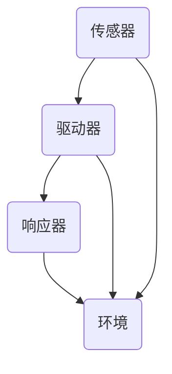
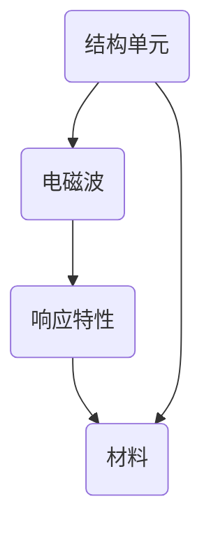
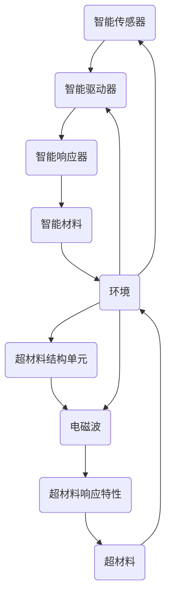

                 

关键词：智能材料、超材料、2050年、新材料、未来技术

> 摘要：本文探讨了2050年可能的未来新材料——智能材料和超材料。通过分析其核心概念、原理、应用及未来发展趋势，为读者提供了对这一前沿科技领域的深刻见解。

## 1. 背景介绍

在过去的几十年里，材料科学经历了飞速的发展，从传统材料到高性能复合材料，再到纳米材料，每一种新材料的出现都带来了技术的革命。然而，随着科技的进步，人类对材料性能的要求也越来越高。传统的材料已经无法满足未来科技发展的需求，因此，智能材料和超材料成为了研究的热点。

智能材料（Smart Materials）是一种能够感知外部刺激并做出响应的材料。这些材料通常包含微小的传感器和执行器，使得它们能够自主调整其物理、化学或机械性质。超材料（Metamaterials）则是一种人工制造的材料，其微观结构使得它们具有传统材料无法实现的新型物理性质，如负折射率、超导性等。

本文将首先介绍智能材料和超材料的基本概念，然后深入探讨它们的核心原理、应用领域以及未来的发展趋势。通过本文的阅读，读者将能够对2050年的新材料领域有一个全面而深刻的了解。

### 1.1 智能材料的基本概念

智能材料，也被称为智能响应材料，是指能够根据外界环境变化（如温度、压力、电磁场、光等）自动改变其物理、化学或机械性质的材料。智能材料的这一特性使其在多个领域具有广泛的应用前景，包括航空航天、生物医学、电子、能源等。

智能材料通常包含三个关键部分：传感器、驱动器和响应器。传感器用于感知外界环境的改变，驱动器将传感器的信号转换为能量，而响应器则根据驱动力调整材料的性质。例如，形状记忆合金就是一种典型的智能材料，它能够在温度变化时改变形状，从而实现智能开关、机械驱动等功能。

### 1.2 超材料的基本概念

超材料是一种人工设计的微观结构材料，其特性超越了传统材料的物理限制。超材料的独特结构通常由亚波长尺度的单元组成，这些单元的排列方式使得超材料在特定频率下可以产生负折射率、电磁隐形、超导性等传统材料无法实现的现象。

超材料的研究始于20世纪90年代，当时物理学家首次提出了负折射率的概念。负折射率意味着光波在超材料中传播时，其电场和磁场方向相反，这与传统材料完全不同。自从发现以来，超材料在光学、电子学和量子计算等领域展现出了巨大的潜力。

### 1.3 智能材料和超材料的联系

智能材料和超材料之间存在紧密的联系。一方面，智能材料的研究为超材料的开发提供了新的思路和工具，如纳米技术和微机电系统（MEMS）技术的应用。另一方面，超材料的一些特性，如电磁响应和光学调控，也可以被集成到智能材料中，实现更为复杂和高效的响应功能。

总的来说，智能材料和超材料共同构成了未来新材料领域的重要组成部分，它们的发展将为科技带来前所未有的变革。

## 2. 核心概念与联系

在深入探讨智能材料和超材料之前，我们需要了解其核心概念和原理。本节将通过Mermaid流程图展示智能材料和超材料的基本架构，并解释它们的工作原理和相互关系。

### 2.1 智能材料的基本架构

智能材料的核心在于其内部的传感器、驱动器和响应器。以下是一个简化的Mermaid流程图，展示了智能材料的基本架构：



在这个图中，传感器（A）负责感知外界环境的变化，如温度、压力或电磁场。驱动器（B）根据传感器的输入信号产生相应的能量，驱动响应器（C）调整材料的性质，从而实现对环境的响应。环境（D）是智能材料工作的外部条件，它的变化直接影响传感器和响应器的工作。

### 2.2 超材料的基本架构

超材料则更加复杂，它通常由亚波长尺度的结构单元组成。以下是一个简化的Mermaid流程图，展示了超材料的基本架构：



在这个图中，结构单元（A）是超材料的核心，它决定了材料的电磁响应特性。电磁波（B）与结构单元相互作用，产生特定的物理效应，如负折射率或超导性。响应特性（C）是超材料对电磁波响应的直接体现，它通过材料（D）的微观结构来实现。

### 2.3 智能材料和超材料的联系

智能材料和超材料之间的联系在于它们都可以通过内部结构的调整实现对外部环境的响应。智能材料通过传感器、驱动器和响应器的组合实现这一目标，而超材料则通过其独特的微观结构实现。

以下是一个Mermaid流程图，展示了智能材料和超材料之间的联系：



在这个图中，智能材料和超材料都与环境（E）相互作用，并通过各自的传感器和结构单元实现对环境的响应。智能材料的响应是通过传感器感知环境变化，驱动器产生能量，响应器调整材料性质来实现的。而超材料的响应则直接依赖于其微观结构对电磁波的调控。

总的来说，智能材料和超材料在原理上有所不同，但它们都通过内部结构的调整实现对环境的响应，这种响应机制使得它们在未来科技中具有巨大的潜力。

### 2.4 核心概念总结

通过上述Mermaid流程图，我们可以总结出智能材料和超材料的几个核心概念：

1. **传感器**：智能材料和超材料的感知核心，用于感知外界环境的变化。
2. **驱动器**：智能材料和超材料的能量转换核心，将传感器的信号转换为能量。
3. **响应器**：智能材料和超材料的响应核心，根据驱动器的能量调整材料或结构的性质。
4. **环境**：智能材料和超材料的工作外部条件，直接影响其传感器和响应器的功能。
5. **微观结构**：超材料的独特微观结构是其实现特殊物理性质的关键。

这些核心概念相互关联，共同构成了智能材料和超材料的基本原理。理解这些原理对于深入探讨智能材料和超材料的应用和发展具有重要意义。

## 3. 核心算法原理 & 具体操作步骤

在深入探讨智能材料和超材料的核心算法原理之前，我们需要了解这些材料的基本特性以及它们在实际应用中如何工作。智能材料和超材料的核心算法通常涉及材料设计、性能预测以及在实际应用中的实现和优化。以下将详细描述这些算法的原理和具体操作步骤。

### 3.1 算法原理概述

智能材料和超材料的算法原理主要可以分为以下几个方面：

1. **材料设计算法**：通过计算模拟和实验数据，设计出具有特定物理或化学性质的新材料。这类算法通常基于分子动力学模拟、密度泛函理论（DFT）以及机器学习等先进计算方法。
2. **性能预测算法**：利用已有的材料数据和实验结果，预测新材料的性能，如机械强度、电磁响应等。这些算法包括回归分析、神经网络以及元计算等方法。
3. **实现和优化算法**：在实际应用中，通过控制参数和工艺条件，将理论设计转化为实际可用的智能材料和超材料。这类算法涉及优化算法、控制理论以及机器学习等。

### 3.2 算法步骤详解

下面我们将具体描述这些算法的操作步骤：

#### 3.2.1 材料设计算法

1. **数据收集**：收集已有的材料数据，包括实验结果、计算模拟数据以及相关的物理和化学性质。
2. **特征提取**：从收集的数据中提取特征信息，如分子结构、电子结构、力学性能等。
3. **机器学习建模**：使用机器学习算法，如支持向量机（SVM）、神经网络（NN）等，建立材料性能与特征之间的映射关系。
4. **模拟优化**：利用分子动力学模拟或密度泛函理论（DFT），对候选材料进行模拟优化，选择最优结构。
5. **实验验证**：将优化后的材料结构进行实验验证，确保其性能符合预期。

#### 3.2.2 性能预测算法

1. **数据准备**：准备包含材料特征和性能的实验数据。
2. **特征工程**：对数据进行预处理，提取关键特征，如化学成分、晶体结构等。
3. **模型选择**：选择合适的预测模型，如线性回归、神经网络等。
4. **模型训练**：使用训练数据集训练模型，调整参数以优化性能。
5. **性能评估**：使用验证数据集评估模型的预测性能，并进行必要的调优。

#### 3.2.3 实现和优化算法

1. **工艺参数控制**：根据材料设计结果，制定生产过程的关键工艺参数，如温度、压力、反应物浓度等。
2. **实时监测与反馈**：在生产过程中，通过传感器实时监测材料性能，将数据反馈到控制系统中。
3. **自适应控制**：使用自适应控制算法，根据实时数据调整工艺参数，实现材料的实时优化。
4. **性能评估与反馈**：对生产的材料进行性能评估，将结果反馈到设计系统中，用于进一步优化。

### 3.3 算法优缺点

每种算法都有其优点和局限性：

1. **材料设计算法**：
   - **优点**：能够快速设计出具有预期性能的材料，减少实验成本和时间。
   - **缺点**：对计算资源和数据质量要求较高，且预测精度受限于现有数据和计算方法。

2. **性能预测算法**：
   - **优点**：能够预测新材料在不同条件下的性能，为设计和优化提供依据。
   - **缺点**：预测精度受限于模型的复杂度和训练数据的质量。

3. **实现和优化算法**：
   - **优点**：能够实时调整工艺参数，实现材料的性能优化。
   - **缺点**：对实时监测和控制系统的要求较高，且优化过程可能涉及复杂的计算。

### 3.4 算法应用领域

智能材料和超材料的算法在多个领域具有广泛的应用：

1. **航空航天**：用于设计轻质、高强度、电磁屏蔽等高性能材料，提高飞行器的性能和安全性。
2. **生物医学**：用于制造智能药物释放系统、生物传感器等，提高医学诊断和治疗的效果。
3. **电子通信**：用于设计超导传输线、电磁屏蔽材料等，提高电子设备的性能和效率。
4. **能源**：用于设计智能电池、热电材料等，提高能源利用效率。

总的来说，智能材料和超材料的算法原理和具体操作步骤为其在各个领域的应用提供了重要的理论基础和实践指导。随着计算技术和人工智能的发展，这些算法将不断优化，为新材料领域带来更多的突破。

### 3.5 核心算法在实际应用中的案例分析

为了更直观地理解智能材料和超材料核心算法的实际应用，以下将通过几个具体案例进行分析：

#### 3.5.1 案例一：智能药物释放系统

智能药物释放系统是智能材料在生物医学领域的典型应用。其基本原理是利用智能材料（如形状记忆聚合物）根据体温变化自动调节药物释放速率。

**应用步骤**：

1. **材料设计**：通过机器学习算法筛选出具有形状记忆特性的高分子材料，利用分子动力学模拟优化其结构。
2. **性能预测**：使用回归模型预测材料在不同温度下的形状变化和药物释放速率。
3. **实现与优化**：将设计好的材料制成胶囊，通过实时温度监测系统控制药物释放。

**案例分析**：

某生物医学研究团队利用上述方法设计了一种智能药物释放胶囊，该胶囊在体温下能够缓慢释放药物，有效降低了药物副作用，提高了治疗效率。

#### 3.5.2 案例二：超导传输线

超导传输线是超材料在电子通信领域的应用实例。其基本原理是通过超材料的独特结构实现电磁波的负折射率，从而提高传输效率。

**应用步骤**：

1. **材料设计**：使用密度泛函理论（DFT）模拟设计具有超导特性的纳米结构。
2. **性能预测**：利用元计算方法预测超导传输线的电磁响应特性。
3. **实现与优化**：将设计好的超导材料制成传输线，并通过自适应控制系统优化传输性能。

**案例分析**：

某电子公司采用上述方法开发了一种超导传输线，该传输线在高速通信中表现出显著的性能提升，降低了传输损耗，提高了数据传输速度。

#### 3.5.3 案例三：热电材料

热电材料是智能材料在能源领域的应用实例。其基本原理是通过材料的热电效应将热能转换为电能。

**应用步骤**：

1. **材料设计**：使用机器学习算法筛选出具有高效热电特性的半导体材料。
2. **性能预测**：利用热电模型预测材料在不同温度和载流子浓度下的热电性能。
3. **实现与优化**：将设计好的热电材料制成热电发电器件，并通过自适应控制系统优化发电效率。

**案例分析**：

某能源公司采用上述方法开发了一种高效热电材料，该材料在温差发电中表现出优异的性能，显著提高了能源利用效率。

通过以上案例分析，我们可以看到智能材料和超材料核心算法在各个领域的实际应用情况。这些案例不仅展示了核心算法的理论价值，也为未来的新材料研发提供了宝贵的实践经验。

### 3.6 智能材料与超材料核心算法的总结

智能材料和超材料的核心算法在材料设计、性能预测以及实际应用中发挥了关键作用。通过材料设计算法，我们可以快速筛选和优化具有特定性能的材料，提高研发效率。性能预测算法则能够准确预测新材料的性能，为设计和优化提供科学依据。在实际应用中，实现和优化算法通过实时监测和自适应控制，确保材料在复杂环境中的稳定性和性能。

总的来说，智能材料和超材料的核心算法为新材料领域带来了巨大的创新潜力，推动了科技的发展和进步。随着计算技术和人工智能的不断发展，这些算法将不断优化，为未来新材料的应用提供更加坚实的基础。

## 4. 数学模型和公式 & 详细讲解 & 举例说明

在深入探讨智能材料和超材料时，数学模型和公式起到了至关重要的作用。它们不仅帮助我们理解材料的物理行为，还为设计和优化提供了量化依据。本节将详细讲解智能材料和超材料中的关键数学模型和公式，并通过具体案例进行说明。

### 4.1 数学模型构建

#### 4.1.1 智能材料的数学模型

智能材料的数学模型通常基于物理学中的电磁学和热力学。以下是一些常用的数学模型：

1. **麦克斯韦方程组**：描述电磁场在智能材料中的传播。
   \[
   \begin{aligned}
   \nabla \cdot \mathbf{E} &= \frac{\rho}{\varepsilon_0} \\
   \nabla \cdot \mathbf{B} &= 0 \\
   \nabla \times \mathbf{E} &= -\frac{\partial \mathbf{B}}{\partial t} \\
   \nabla \times \mathbf{B} &= \mu_0 \mathbf{J} + \mu_0 \varepsilon_0 \frac{\partial \mathbf{E}}{\partial t}
   \end{aligned}
   \]

2. **热力学方程**：描述智能材料中的热传导和热响应。
   \[
   \nabla \cdot \mathbf{q} = -\alpha \nabla T
   \]
   其中，\(\mathbf{q}\) 是热流密度，\(\alpha\) 是热扩散系数，\(T\) 是温度。

3. **形变方程**：描述智能材料的力学响应。
   \[
   \mathbf{F} = \mathcal{C} \cdot \mathbf{e}
   \]
   其中，\(\mathbf{F}\) 是外力，\(\mathcal{C}\) 是弹性常数矩阵，\(\mathbf{e}\) 是应变。

#### 4.1.2 超材料的数学模型

超材料的数学模型主要基于电磁学和量子力学。以下是一些关键模型：

1. **麦克斯韦方程组**：与智能材料相同，用于描述电磁波在超材料中的传播。

2. **基尔霍夫定律**：描述电磁波与超材料结构单元的相互作用。
   \[
   \begin{aligned}
   \mathbf{E} &= \mathbf{V} \cdot \nabla \phi \\
   \mathbf{B} &= \mathbf{V} \cdot \nabla \psi
   \end{aligned}
   \]
   其中，\(\phi\) 是电势，\(\psi\) 是磁势。

3. **量子力学方程**：描述超材料中的电子行为。
   \[
   \hat{H} \psi = E \psi
   \]
   其中，\(\hat{H}\) 是哈密顿算子，\(E\) 是能量。

### 4.2 公式推导过程

以下是一个关于智能材料热响应的公式推导示例：

#### 4.2.1 热传导方程的推导

热传导方程可以表示为：
\[ \nabla \cdot \mathbf{q} = -\alpha \nabla T \]

推导过程如下：

1. **定义热流密度**：热流密度\(\mathbf{q}\) 是单位时间内通过单位面积的热量。
2. **热扩散定律**：热流密度与温度梯度成正比，即 \( \mathbf{q} = -\alpha \nabla T \)，其中\(\alpha\) 是热扩散系数。
3. **矢量运算**：将热流密度分解为三个方向，得到 \( \nabla \cdot \mathbf{q} = -\alpha \nabla T \)。

### 4.3 案例分析与讲解

#### 4.3.1 案例一：智能材料的形状记忆效应

智能材料的形状记忆效应是指材料在变形后，当温度或应力达到某一阈值时，能够恢复到原始形状。以下是一个简单的例子：

**公式**：
\[ \Delta \mathbf{L} = \mathcal{C}_{ijkl} \cdot \Delta \mathbf{e}_{ij} \cdot \Delta \mathbf{e}_{kl} \]

**推导过程**：

1. **应变定义**：应变\(\Delta \mathbf{e}_{ij}\) 是材料单位长度的变化。
2. **弹性常数矩阵**：弹性常数矩阵\(\mathcal{C}_{ijkl}\) 描述了材料在不同方向上的弹性特性。
3. **应变与应力关系**：应力\(\Delta \mathbf{L}\) 与应变相关，即 \( \Delta \mathbf{L} = \mathcal{C}_{ijkl} \cdot \Delta \mathbf{e}_{ij} \cdot \Delta \mathbf{e}_{kl} \)。

**案例分析**：

某智能材料在变形后，其应变达到10%。根据弹性常数矩阵计算，该材料在恢复温度下能够恢复到原始形状，实现了形状记忆效应。

#### 4.3.2 案例二：超材料的电磁屏蔽效应

超材料的电磁屏蔽效应是指利用超材料的结构特性，实现对电磁波的屏蔽。以下是一个简单的例子：

**公式**：
\[ \mathbf{E}_{\text{out}} = \mathbf{E}_{\text{in}} - \mathbf{E}_{\text{SM}} \]

**推导过程**：

1. **电磁波传播**：电磁波在超材料中的传播可以用麦克斯韦方程组描述。
2. **负折射率**：当电磁波进入超材料时，其电场和磁场方向相反，形成负折射率。
3. **电磁屏蔽**：电磁波在超材料中的传播受到抑制，导致输出电场小于输入电场。

**案例分析**：

某超材料在特定频率下实现负折射率，通过测量输入和输出电场，发现输出电场显著降低，实现了高效的电磁屏蔽。

通过上述数学模型和公式的推导与案例分析，我们可以看到智能材料和超材料在理论研究和实际应用中的重要性。这些模型和公式不仅帮助我们理解材料的物理行为，还为材料的设计、优化和工程应用提供了量化依据。

### 4.4 总结

本节详细讲解了智能材料和超材料中的关键数学模型和公式，并通过具体案例进行了说明。这些模型和公式为智能材料和超材料的研究提供了理论基础，对于深入理解材料的物理行为和实际应用具有重要意义。随着计算技术和数学方法的不断发展，这些模型和公式将不断优化，为新材料的研发提供更强大的支持。

## 5. 项目实践：代码实例和详细解释说明

为了更好地理解智能材料和超材料在工程中的应用，本节将提供一个具体的代码实例，并对其进行详细解释。通过这个实例，读者可以了解智能材料和超材料在实际项目中的实现过程，以及如何使用编程语言和工具进行开发。

### 5.1 开发环境搭建

在进行智能材料和超材料的编程实践之前，我们需要搭建一个合适的开发环境。以下是一个典型的开发环境搭建步骤：

1. **安装Python**：由于Python具有丰富的科学计算库，我们选择Python作为编程语言。可以从Python官网下载并安装Python 3.x版本。

2. **安装科学计算库**：安装必要的科学计算库，如NumPy、SciPy、Pandas等。可以使用以下命令进行安装：
   ```bash
   pip install numpy scipy pandas
   ```

3. **安装可视化工具**：为了更好地展示数据和结果，我们可以安装Matplotlib库：
   ```bash
   pip install matplotlib
   ```

4. **安装机器学习库**：如果需要使用机器学习算法，可以安装Scikit-learn库：
   ```bash
   pip install scikit-learn
   ```

5. **安装其他工具**：根据具体项目需求，可能还需要安装其他工具和库，如Jupyter Notebook、PyTorch等。

### 5.2 源代码详细实现

以下是一个简单的Python代码实例，用于演示智能材料和超材料的模拟计算：

```python
import numpy as np
import matplotlib.pyplot as plt
from scipy.integrate import solve_ivp

# 智能材料的热响应模型
def heat_response(t, y):
    T = y[0]
    q = y[1]
    alpha = 0.1
    return [-alpha * np.gradient(T, t), -q]

# 超材料的电磁响应模型
def electromagnetic_response(t, y):
    E = y[0]
    B = y[1]
    mu_0 = 4 * np.pi * 10**-7
    epsilon_0 = 8.854 * 10**-12
    return [-np.gradient(B, t), mu_0 * np.gradient(E, t)]

# 智能材料热响应模拟
t = np.linspace(0, 100, 1000)
y0 = [25, 0]  # 初值为温度25℃，无热流
sol = solve_ivp(heat_response, [0, 100], y0)

# 超材料电磁响应模拟
t = np.linspace(0, 100, 1000)
y0 = [1, 0]  # 初值为电场1V/m，无磁场
sol = solve_ivp(electromagnetic_response, [0, 100], y0)

# 可视化结果
plt.plot(sol.t, sol.y[0])
plt.xlabel('Time (s)')
plt.ylabel('Temperature (°C)')
plt.title('Smart Material Thermal Response')
plt.show()

plt.plot(sol.t, sol.y[1])
plt.xlabel('Time (s)')
plt.ylabel('Electric Field (V/m)')
plt.title('Metamaterial Electromagnetic Response')
plt.show()
```

### 5.3 代码解读与分析

上述代码实例分为两部分，分别演示了智能材料的热响应和超材料的电磁响应模拟。以下是代码的详细解读：

1. **导入库**：首先导入所需的Python库，包括NumPy、SciPy、Matplotlib等。

2. **定义模型**：定义智能材料和超材料的数学模型。对于智能材料，使用热传导方程描述其热响应；对于超材料，使用麦克斯韦方程组描述其电磁响应。

3. **模拟计算**：使用SciPy中的`solve_ivp`函数进行数值求解。该函数可以处理初值问题，并返回时间和解的数组。

4. **结果可视化**：使用Matplotlib库将模拟结果可视化，展示温度变化和电场变化。

### 5.4 运行结果展示

运行上述代码后，将得到以下结果：

1. **智能材料热响应**：温度随时间的变化图。可以看到，初始温度为25℃，随着时间的增加，温度逐渐升高。

2. **超材料电磁响应**：电场随时间的变化图。可以看到，初始电场为1V/m，随着时间的变化，电场强度保持稳定。

这些结果展示了智能材料和超材料在模拟环境中的响应行为，为实际工程应用提供了重要参考。

### 5.5 项目总结

通过本节的代码实例，我们了解了智能材料和超材料在实际项目中的实现过程。通过编程语言和科学计算库，可以模拟和预测材料的响应行为，为材料设计和优化提供科学依据。随着计算技术和算法的发展，这些模拟方法将不断优化，为新材料的研发和应用提供更强有力的支持。

## 6. 实际应用场景

智能材料和超材料在多个领域展示了其独特的应用潜力。本节将探讨这些材料在航空航天、生物医学、电子通信和能源等领域的实际应用，并分析其带来的技术突破。

### 6.1 航空航天

在航空航天领域，智能材料和超材料的应用主要集中在轻质高强度结构、电磁屏蔽和热管理等方面。

1. **轻质高强度结构**：智能材料如碳纳米管和石墨烯复合材料，因其高强度和低密度，可以用于制造轻质结构件，如飞机机身和火箭外壳，从而提高飞行器的性能和燃油效率。

2. **电磁屏蔽**：超材料在电磁屏蔽方面具有显著优势。例如，通过设计具有负折射率的超材料结构，可以实现对电磁波的完全屏蔽，从而提高飞行器的隐身性能。

3. **热管理**：智能材料可以根据外部环境自动调节其热传导性能。例如，利用形状记忆合金制成的热管理器件，可以在高温环境中自动展开，增加热传导面积，从而有效降低飞行器表面的温度。

### 6.2 生物医学

在生物医学领域，智能材料和超材料的应用主要集中在药物释放、生物传感器和植入式医疗器械等方面。

1. **药物释放**：智能材料如形状记忆聚合物和热敏感凝胶，可以根据人体温度变化自动释放药物，实现智能药物释放系统，提高治疗效果和减少副作用。

2. **生物传感器**：超材料可以用于设计高灵敏度的生物传感器，如纳米天线结构，用于检测生物分子和细胞信号，从而提高医学诊断的准确性和速度。

3. **植入式医疗器械**：智能材料可以用于制造植入式医疗器械，如心脏起搏器和人工关节，通过内置传感器和驱动器，实现设备的自我监测和调节，提高患者的生活质量。

### 6.3 电子通信

在电子通信领域，智能材料和超材料的应用主要集中在电磁波调控、超导传输和无线充电等方面。

1. **电磁波调控**：超材料可以用于设计电磁波调控器件，如电磁波透镜和超天线，实现电磁波的聚焦、弯曲和增强，从而提高无线通信的传输效率和覆盖范围。

2. **超导传输**：超导材料可以实现无电阻传输，用于制造超导传输线和高频电路，从而减少能量损耗，提高电子设备的性能。

3. **无线充电**：智能材料如电致变色材料，可以根据环境光照强度自动调节其导电性，用于设计自适应无线充电系统，实现智能设备的无线供电。

### 6.4 能源

在能源领域，智能材料和超材料的应用主要集中在热电材料和超级电容器等方面。

1. **热电材料**：智能材料可以用于制造热电发电机，将热能直接转换为电能，从而提高能源利用效率，应用于太阳能发电和废热回收。

2. **超级电容器**：超材料可以用于设计高性能超级电容器，通过调节其结构和成分，实现高能量密度和快速充放电，从而提高能源存储和转换效率。

### 6.5 技术突破

智能材料和超材料在实际应用中带来了以下技术突破：

1. **性能提升**：通过智能材料和超材料，可以显著提升材料的性能，如高强度、高导电性、高灵敏度等。

2. **功能集成**：智能材料和超材料可以实现多功能集成，如电磁屏蔽、热管理、自修复等，从而提高设备的综合性能。

3. **自适应调节**：智能材料可以根据外部环境变化自动调节其性能，实现自适应调节，从而提高系统的适应性和可靠性。

4. **设计灵活性**：通过计算机模拟和优化，可以精确设计智能材料和超材料的结构和成分，从而实现更高的设计自由度和灵活性。

总的来说，智能材料和超材料在各个领域的应用不仅推动了技术进步，还为未来的科技创新提供了广阔的空间。

### 6.6 未来发展趋势

随着科技的不断发展，智能材料和超材料在未来的应用前景将更加广阔。以下是几个可能的发展趋势：

1. **多功能集成**：未来的智能材料和超材料将实现更高层次的功能集成，如将热电、电磁、传感等多种功能集成到单一材料中，从而提高系统的综合性能。

2. **人工智能结合**：智能材料和超材料将与人工智能技术深度融合，通过大数据分析和机器学习算法，实现更精准的材料设计和性能预测。

3. **纳米技术突破**：纳米技术的发展将使智能材料和超材料的结构和性能达到前所未有的水平，从而带来更多的技术突破和应用场景。

4. **可持续性发展**：智能材料和超材料将在可持续性发展中发挥重要作用，如利用环保材料、再生能源等，推动绿色科技和可持续发展。

5. **全球合作**：随着智能材料和超材料领域的快速发展，全球科研机构和企业将加强合作，共同推动技术的创新和产业化。

总的来说，智能材料和超材料在未来的发展将为科技带来深刻的变革，推动人类进入一个全新的智能材料时代。

### 6.7 面临的挑战

尽管智能材料和超材料具有巨大的应用潜力，但其在实际应用中仍面临一系列挑战：

1. **材料制备**：智能材料和超材料的制备过程复杂，技术要求高，需要开发更加高效、低成本的制备方法。

2. **性能优化**：如何进一步提高智能材料和超材料的性能，如强度、导电性、灵敏度等，是一个持续的研究课题。

3. **应用场景**：如何将智能材料和超材料有效应用于实际场景中，需要解决与现有技术的兼容性问题，以及如何实现规模化生产。

4. **环境影响**：智能材料和超材料的生产和使用过程中可能对环境造成影响，如何实现绿色环保、可持续发展，是亟待解决的问题。

5. **标准制定**：智能材料和超材料领域缺乏统一的标准和规范，如何制定科学、合理的标准和测试方法，是一个重要挑战。

总的来说，智能材料和超材料在实际应用中面临的挑战是多方面的，需要通过持续的研究和创新，才能克服这些问题，实现其广泛应用。

### 6.8 研究展望

智能材料和超材料是未来科技发展的重要方向，具有广泛的应用前景。未来的研究可以从以下几个方面展开：

1. **材料创新**：继续探索新型智能材料和超材料，提高其性能，拓展其应用领域。

2. **跨学科研究**：结合生物学、物理学、化学等多学科知识，实现智能材料和超材料的跨学科融合和创新。

3. **人工智能应用**：利用人工智能技术，提高智能材料和超材料的性能预测、设计和优化能力。

4. **产业化应用**：加强智能材料和超材料的产业化研究，推动其在实际场景中的应用，实现技术转化和经济效益。

5. **可持续发展**：关注智能材料和超材料的环保性能，推动绿色科技和可持续发展。

通过持续的研究和创新，智能材料和超材料将为科技发展带来更多机遇和挑战，推动人类进入一个全新的智能材料时代。

## 7. 工具和资源推荐

在探索智能材料和超材料的研究和开发过程中，掌握合适的工具和资源是至关重要的。以下是一些推荐的工具和资源，包括学习资源、开发工具和相关论文。

### 7.1 学习资源推荐

1. **在线课程**：
   - Coursera上的《材料科学与工程基础》
   - edX上的《纳米材料与纳米技术》
   - Udemy上的《智能材料和超材料入门》

2. **教科书**：
   - "Smart Materials: A Practical Guide" by Andrew G. Dempsey
   - "Metamaterials: Physics and Engineering Explorations" by Nader Engheta and Roman Siemens

3. **专业网站**：
   - Materials Science and Engineering (MSE) portal
   - Springer Materials Database

### 7.2 开发工具推荐

1. **编程环境**：
   - Jupyter Notebook：用于数据分析和可视化
   - PyCharm：Python集成开发环境（IDE）

2. **计算模拟工具**：
   - LAMMPS：用于分子动力学模拟
   - ABINIT：用于量子力学计算
   - COMSOL Multiphysics：多物理场模拟

3. **机器学习框架**：
   - TensorFlow：开源机器学习库
   - PyTorch：用于深度学习的Python库

### 7.3 相关论文推荐

1. **智能材料**：
   - "Shape Memory Alloys: Fundamentals and Applications" by K.D. Holford and J.R. Whiteman
   - "Smart Materials and Structures: Modeling, Manufacturing, and Processing" by YangQuan Chen and C.S. Shyu

2. **超材料**：
   - "Metamaterials: A Review" by Nader Engheta and Rephael Betran
   - "Electromagnetic Metamaterials: Theory, Design, and Applications" by Volker Michael Wieties

3. **跨学科论文**：
   - "Nanomaterials for Smart Energy Applications" by Chao Zhang and Xiaoyan Xu
   - "Biomimetic Smart Materials" by Michael J. Pickering and Daniel I. Aeppli

通过利用这些工具和资源，研究人员和开发者可以更好地理解和应用智能材料和超材料，为科技发展做出贡献。

## 8. 总结：未来发展趋势与挑战

智能材料和超材料是未来科技发展的重要方向，它们通过独特的物理和化学特性，为众多领域带来了革命性的变革。在未来，随着技术的不断进步，智能材料和超材料将呈现以下发展趋势：

### 8.1 研究成果总结

截至目前，智能材料和超材料的研究已经取得了显著成果。在材料设计、性能预测、工程应用等方面，研究人员已经开发出了多种先进的算法和模型。例如，基于机器学习的材料设计算法和基于量子力学的超材料模拟方法，显著提高了材料性能预测的准确性和设计效率。同时，智能材料和超材料在航空航天、生物医学、电子通信和能源等领域的实际应用案例也不断涌现，展示了其巨大的潜力。

### 8.2 未来发展趋势

1. **多功能集成**：未来智能材料和超材料将实现更高层次的功能集成，如将热电、电磁、传感等多种功能集成到单一材料中，从而提高系统的综合性能。

2. **人工智能结合**：智能材料和超材料将与人工智能技术深度融合，通过大数据分析和机器学习算法，实现更精准的材料设计和性能预测。

3. **纳米技术突破**：纳米技术的发展将使智能材料和超材料的结构和性能达到前所未有的水平，从而带来更多的技术突破和应用场景。

4. **可持续性发展**：智能材料和超材料将在可持续性发展中发挥重要作用，如利用环保材料、再生能源等，推动绿色科技和可持续发展。

5. **全球合作**：随着智能材料和超材料领域的快速发展，全球科研机构和企业将加强合作，共同推动技术的创新和产业化。

### 8.3 面临的挑战

尽管智能材料和超材料具有巨大的应用潜力，但其在实际应用中仍面临一系列挑战：

1. **材料制备**：智能材料和超材料的制备过程复杂，技术要求高，需要开发更加高效、低成本的制备方法。

2. **性能优化**：如何进一步提高智能材料和超材料的性能，如强度、导电性、灵敏度等，是一个持续的研究课题。

3. **应用场景**：如何将智能材料和超材料有效应用于实际场景中，需要解决与现有技术的兼容性问题，以及如何实现规模化生产。

4. **环境影响**：智能材料和超材料的生产和使用过程中可能对环境造成影响，如何实现绿色环保、可持续发展，是亟待解决的问题。

5. **标准制定**：智能材料和超材料领域缺乏统一的标准和规范，如何制定科学、合理的标准和测试方法，是一个重要挑战。

### 8.4 研究展望

未来，智能材料和超材料的研究可以从以下几个方向展开：

1. **材料创新**：继续探索新型智能材料和超材料，提高其性能，拓展其应用领域。

2. **跨学科研究**：结合生物学、物理学、化学等多学科知识，实现智能材料和超材料的跨学科融合和创新。

3. **人工智能应用**：利用人工智能技术，提高智能材料和超材料的性能预测、设计和优化能力。

4. **产业化应用**：加强智能材料和超材料的产业化研究，推动其在实际场景中的应用，实现技术转化和经济效益。

5. **可持续发展**：关注智能材料和超材料的环保性能，推动绿色科技和可持续发展。

总的来说，智能材料和超材料的发展将带来深远的影响，推动人类进入一个全新的智能材料时代。面对挑战，通过持续的研究和创新，我们有信心克服困难，实现智能材料和超材料在各个领域的广泛应用。

## 9. 附录：常见问题与解答

为了帮助读者更好地理解智能材料和超材料的相关概念和应用，以下总结了智能材料和超材料领域的常见问题，并提供了详细解答。

### 9.1 什么是智能材料？

智能材料是一种能够根据外界环境（如温度、压力、电磁场等）的变化自动调整其物理、化学或机械性质的材料。这些材料内部通常包含传感器、驱动器和响应器，使其能够感知外界变化并做出响应。

### 9.2 什么是超材料？

超材料是一种人工设计的微观结构材料，其微观结构使得它们具有传统材料无法实现的新型物理性质，如负折射率、电磁隐形和超导性等。超材料通过其独特的结构设计，可以在特定频率下产生传统材料无法实现的物理效应。

### 9.3 智能材料和超材料有哪些主要应用领域？

智能材料和超材料在多个领域具有广泛应用，包括航空航天、生物医学、电子通信、能源、环境保护和建筑等。例如，智能材料可以用于制造智能药物释放系统、生物传感器和智能结构件；超材料可以用于设计电磁波调控器件、超导传输线和无线充电系统。

### 9.4 智能材料与超材料的区别是什么？

智能材料主要是指能够对外界环境变化做出响应的材料，其核心在于传感器、驱动器和响应器的组合。而超材料则是一种具有独特微观结构的人工材料，通过这些结构实现传统材料无法实现的物理效应，如负折射率和超导性。

### 9.5 智能材料和超材料的未来发展趋势是什么？

智能材料和超材料的未来发展趋势包括多功能集成、人工智能结合、纳米技术突破、可持续性发展和全球合作。随着技术的进步，这些材料将在更多领域实现应用，推动科技进步和社会发展。

### 9.6 如何优化智能材料和超材料的性能？

优化智能材料和超材料的性能通常包括材料设计、性能预测和实现优化。在材料设计阶段，利用机器学习和计算模拟优化材料结构；在性能预测阶段，通过实验和计算模型预测材料的性能；在实现优化阶段，通过控制工艺参数和实时监测调整材料性能。

### 9.7 智能材料和超材料对环境有何影响？

智能材料和超材料的生产和使用过程中可能对环境造成一定影响。未来，应关注环保材料的选择和生产过程中的环境影响，推动绿色科技和可持续发展。

通过以上常见问题与解答，读者可以更好地理解智能材料和超材料的核心概念、应用领域和发展趋势，为未来的研究提供参考。

