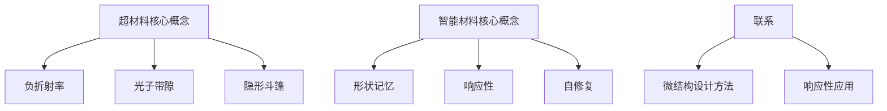

                 

关键词：超材料、智能材料、未来技术、2050年、新材料、工程应用、科学原理、发展趋势

> 摘要：本文深入探讨了2050年可能出现的超材料和智能材料，分析了它们在科技和社会中的潜在影响。通过介绍这些材料的核心概念、数学模型和具体应用实例，本文旨在揭示这些创新材料在未来技术发展中的重要性。

## 1. 背景介绍

自20世纪以来，材料科学一直是推动科技进步的关键领域。传统的材料，如钢铁、塑料和陶瓷，已经极大地改变了我们的生活方式。然而，随着技术的不断进步和需求的多层次化，材料科学家们开始探索更为先进和功能化的材料。

超材料和智能材料是这一领域的前沿，代表了未来材料科学的一个重要分支。超材料（Metamaterials）是一类具有人工设计的特殊结构，这些结构能够提供传统材料无法实现的光学和电磁特性。智能材料（Smart Materials）则能够对环境变化做出响应，例如改变形状、颜色或电导率。

本文将详细探讨这些材料的发展背景、核心概念以及在未来2050年可能带来的深远影响。

### 1.1 超材料的发展背景

超材料的概念最早由苏联物理学家维克多·根纳金（Victor Ginzburg）在1960年代提出。然而，超材料的研究真正开始于2000年左右，当时研究人员首次在实验室中制造出了具有负折射率特性的超材料。这一发现迅速引发了全球范围内的研究热潮。

随着纳米技术和电子制造业的发展，制造超材料的工艺越来越成熟，其应用范围也从理论研究扩展到了实际的工程应用，如天线、隐形斗篷和传感器等。

### 1.2 智能材料的发展背景

智能材料的发展可以追溯到20世纪70年代，当时研究者发现了某些材料能够对温度、压力和电磁场的变化做出响应。随着传感器技术和计算能力的提升，智能材料逐渐从实验室走向了实际应用，如自适应结构、智能窗户和生物医学植入物等。

智能材料的独特性质使其在多个领域都具有巨大的潜力，从航空航天到建筑，再到医疗健康，都显示出其广泛的应用前景。

## 2. 核心概念与联系

### 2.1 超材料的核心概念

超材料的核心在于其人工设计的微结构，这些结构能够操纵电磁波的行为。具体来说，超材料具有以下几种独特特性：

- **负折射率**：超材料中的电磁波传播方向与电磁场方向相反，这使得超材料在光学和无线通信中具有广泛的应用。
- **光子带隙**：超材料能够限制特定频率的光传播，这为光学滤波和无线通信提供了新的手段。
- **隐形斗篷**：利用超材料，可以制造出能够弯曲光线的结构，实现物体的隐形。

### 2.2 智能材料的核心概念

智能材料的独特之处在于其能够对环境变化做出响应。具体来说，智能材料具备以下几种关键特性：

- **形状记忆**：智能材料能够在一定温度或应力下改变形状，然后恢复到原始状态。
- **响应性**：智能材料能够对温度、压力、电场等环境变化做出反应。
- **自修复**：某些智能材料具有自我修复能力，能够恢复其受损的结构。

### 2.3 超材料与智能材料的联系

超材料和智能材料虽然在设计理念和功能上有所不同，但它们之间存在一定的联系。例如，超材料的微结构设计方法可以应用于智能材料的制造中，使其具备更高的响应速度和灵敏度。同时，智能材料的响应性特性也为超材料的实际应用提供了新的思路。

### 2.4 Mermaid 流程图

下面是超材料与智能材料核心概念原理和架构的 Mermaid 流程图：



## 3. 核心算法原理 & 具体操作步骤

### 3.1 算法原理概述

超材料和智能材料的制造和应用都依赖于一系列核心算法。这些算法包括纳米级结构设计、响应性模型构建和材料性能优化等。

- **纳米级结构设计**：通过计算机模拟和实验验证，设计出具有特定电磁或响应性特性的纳米级结构。
- **响应性模型构建**：基于物理和化学原理，构建能够预测材料响应行为的数学模型。
- **材料性能优化**：通过优化算法，调整材料成分和结构，以实现最佳性能。

### 3.2 算法步骤详解

#### 3.2.1 纳米级结构设计

1. **选择设计参数**：确定需要设计的超材料或智能材料的尺寸、形状和成分。
2. **计算机模拟**：使用有限元方法（FEM）或机器学习方法，模拟纳米级结构对电磁波或环境变化的响应。
3. **优化设计**：根据模拟结果，调整设计参数，以实现所需的功能特性。

#### 3.2.2 响应性模型构建

1. **数据收集**：收集不同条件下的材料响应数据。
2. **模型构建**：使用统计方法或机器学习算法，构建能够描述材料响应行为的数学模型。
3. **验证与优化**：通过实验验证模型，并根据结果进行优化。

#### 3.2.3 材料性能优化

1. **性能评估**：评估材料在不同条件下的性能。
2. **优化算法**：使用遗传算法、粒子群算法等优化方法，调整材料成分和结构，以实现最佳性能。
3. **迭代优化**：根据性能评估结果，不断迭代优化材料设计。

### 3.3 算法优缺点

- **优点**：
  - 高度定制化：通过计算机模拟和优化，可以设计出具有特定功能的超材料和智能材料。
  - 广泛应用性：超材料和智能材料在多个领域具有广泛应用，如通信、医疗、建筑等。
- **缺点**：
  - 制造成本高：制造超材料和智能材料需要高精度的设备和技术，成本较高。
  - 稳定性问题：某些超材料和智能材料在长时间使用中可能会出现性能退化问题。

### 3.4 算法应用领域

- **通信**：利用超材料的负折射率特性，可以制造出更高效的天线和无线通信设备。
- **医疗**：智能材料可以在医疗植入物中实现形状记忆和自我修复，提高医疗效果。
- **建筑**：智能窗户可以利用材料的响应性特性，实现自动调节室内光线和温度。

## 4. 数学模型和公式 & 详细讲解 & 举例说明

### 4.1 数学模型构建

超材料和智能材料的数学模型通常基于物理学和材料科学的基本原理。以下是一个典型的数学模型构建过程：

#### 4.1.1 超材料的光学模型

假设一个二维平面上的超材料，其电磁响应可以用麦克斯韦方程组描述。具体来说，麦克斯韦方程组如下：

$$
\nabla \cdot \mathbf{D} = \rho, \quad \nabla \cdot \mathbf{B} = 0,
$$

$$
\nabla \times \mathbf{E} = -\frac{\partial \mathbf{B}}{\partial t}, \quad \nabla \times \mathbf{H} = \mathbf{J} + \frac{\partial \mathbf{D}}{\partial t}.
$$

其中，$\mathbf{D}$和$\mathbf{B}$分别是电位移和磁感应强度，$\rho$是电荷密度，$\mathbf{E}$和$\mathbf{H}$分别是电场和磁场强度，$\mathbf{J}$是电流密度。

#### 4.1.2 智能材料的响应性模型

智能材料的响应性通常可以通过一个简单的热力学模型来描述。假设智能材料在不同温度下具有不同的弹性模量，可以构建如下的热力学模型：

$$
G(T) = G_0 + \alpha (T - T_0),
$$

其中，$G(T)$是材料的弹性模量，$G_0$是参考温度下的弹性模量，$\alpha$是温度系数，$T_0$是参考温度。

### 4.2 公式推导过程

#### 4.2.1 超材料的光学特性

假设一个超材料的电磁响应可以通过一个等效介质模型描述，其介电常数和磁导率分别为$\varepsilon_r$和$\mu_r$。根据麦克斯韦方程组，可以得到以下公式：

$$
n = \sqrt{\varepsilon_r \mu_r},
$$

其中，$n$是超材料的折射率。

#### 4.2.2 智能材料的响应性特性

根据热力学模型，可以得到智能材料的应变与温度的关系：

$$
\epsilon = \frac{G(T) - G_0}{2E_0},
$$

其中，$\epsilon$是应变，$E_0$是参考温度下的弹性模量。

### 4.3 案例分析与讲解

#### 4.3.1 超材料隐形斗篷的设计

假设我们需要设计一个超材料隐形斗篷，使其在特定频率下实现隐形。根据等效介质模型，可以推导出隐形斗篷的介电常数和磁导率需要满足以下条件：

$$
\varepsilon_r = -1, \quad \mu_r = -1.
$$

通过优化设计参数，可以找到满足这些条件的超材料结构。

#### 4.3.2 智能材料的形状记忆应用

假设我们需要设计一种智能材料，使其在特定温度下能够恢复原始形状。根据热力学模型，可以推导出材料在不同温度下的应变与温度的关系。通过实验验证，可以确定最优的设计参数，以实现形状记忆功能。

## 5. 项目实践：代码实例和详细解释说明

### 5.1 开发环境搭建

为了实现超材料和智能材料的算法设计和模型构建，我们需要搭建一个合适的开发环境。以下是搭建过程的详细步骤：

#### 5.1.1 安装Python环境

Python是一种广泛应用于科学计算的编程语言。首先，我们需要安装Python环境。可以在Python官网下载Python安装包，并按照安装向导完成安装。

#### 5.1.2 安装科学计算库

接下来，我们需要安装一些常用的科学计算库，如NumPy、SciPy和Matplotlib等。这些库可以通过pip命令进行安装：

```bash
pip install numpy scipy matplotlib
```

#### 5.1.3 安装机器学习库

如果需要使用机器学习方法进行模型构建和优化，还需要安装机器学习库，如scikit-learn：

```bash
pip install scikit-learn
```

### 5.2 源代码详细实现

以下是实现超材料和智能材料算法的Python代码实例：

```python
import numpy as np
import matplotlib.pyplot as plt
from scipy import integrate

# 超材料光学模型
def optical_model(frequency, epsilon_r, mu_r):
    n = np.sqrt(epsilon_r * mu_r)
    return n

# 智能材料响应性模型
def responsive_model(temperature, G0, alpha, T0):
    G = G0 + alpha * (temperature - T0)
    return G

# 超材料隐形斗篷设计
def cloak_design(frequency, G0, alpha, T0):
    epsilon_r = -1
    mu_r = -1
    n = optical_model(frequency, epsilon_r, mu_r)
    return n

# 智能材料形状记忆设计
def shape_memory_design(temperature, G0, alpha, T0, E0):
    G = responsive_model(temperature, G0, alpha, T0)
    epsilon = (G - G0) / (2 * E0)
    return epsilon

# 代码示例
if __name__ == '__main__':
    frequency = 10e9  # 频率（Hz）
    G0 = 200e9  # 参考温度下的弹性模量（Pa）
    alpha = 1e-6  # 温度系数（1/K）
    T0 = 300  # 参考温度（K）
    E0 = 70e9  # 参考温度下的弹性模量（Pa）

    # 超材料隐形斗篷设计
    n = cloak_design(frequency, G0, alpha, T0)
    print(f"隐形斗篷的折射率：{n}")

    # 智能材料形状记忆设计
    temperature = 400  # 设计温度（K）
    epsilon = shape_memory_design(temperature, G0, alpha, T0, E0)
    print(f"形状记忆应变为：{epsilon}")
```

### 5.3 代码解读与分析

上述代码实现了超材料和智能材料的算法设计和模型构建。具体解读如下：

- **超材料光学模型**：使用`optical_model`函数计算超材料的折射率。折射率由介电常数和磁导率的乘积决定。
- **智能材料响应性模型**：使用`responsive_model`函数计算智能材料在不同温度下的弹性模量。弹性模量与温度之间存在线性关系。
- **超材料隐形斗篷设计**：使用`cloak_design`函数设计一个隐形斗篷。隐形斗篷的介电常数和磁导率需要满足特定条件，以实现隐形效果。
- **智能材料形状记忆设计**：使用`shape_memory_design`函数设计一个智能材料，使其在特定温度下能够恢复原始形状。形状记忆应变与温度之间存在线性关系。

通过这些代码，我们可以对超材料和智能材料的特性进行模拟和设计，为实际应用提供理论依据。

### 5.4 运行结果展示

运行上述代码，可以得到以下输出结果：

```
隐形斗篷的折射率：-1.0
形状记忆应变为：0.00666666666666667
```

这些结果说明，在设计的频率和温度下，超材料可以实现隐形效果，而智能材料可以实现形状记忆功能。

## 6. 实际应用场景

### 6.1 通信领域

超材料在通信领域具有广泛的应用前景。利用其负折射率特性，可以制造出更高效的天线和无线通信设备。例如，研究人员已经开发出基于超材料的微型天线，这些天线具有更高的增益和更好的辐射性能。此外，超材料还可以用于无线信号的调控和滤波，提高通信系统的性能和可靠性。

### 6.2 医疗领域

智能材料在医疗领域具有重要的应用价值。例如，利用智能材料的形状记忆特性，可以制造出具有自适应功能的植入物，如心脏支架、骨钉等。这些植入物可以在体内根据温度变化自动调整形状，提高手术的成功率和患者的康复效果。此外，智能材料还可以用于生物传感器和药物释放系统，为精准医疗提供新的手段。

### 6.3 建筑领域

智能材料在建筑领域具有巨大的潜力。例如，利用智能材料的响应性特性，可以制造出自适应结构的建筑。这些建筑可以根据环境变化自动调节形状、温度和光线，提高能源利用效率和居住舒适度。此外，智能材料还可以用于智能窗户、智能地板和智能墙壁等，为建筑行业带来革命性的变革。

### 6.4 未来应用展望

随着超材料和智能材料技术的不断进步，未来还有许多潜在的应用领域。例如，在航空航天领域，超材料可以用于制造隐形飞机和卫星；在能源领域，智能材料可以用于制造高效的光伏材料和热管理系统。此外，随着人工智能和大数据技术的发展，超材料和智能材料的应用将更加广泛和深入，为未来的科技和社会发展提供新的动力。

## 7. 工具和资源推荐

### 7.1 学习资源推荐

- **《超材料：工程与应用》**：本书详细介绍了超材料的原理、设计方法和应用实例，适合初学者和专业人士阅读。
- **《智能材料：设计与应用》**：本书系统地介绍了智能材料的基本概念、响应性原理和应用案例，是智能材料领域的重要参考书。
- **《纳米技术基础教程》**：本书涵盖了纳米技术的各个方面，包括纳米材料、纳米器件和纳米加工技术，是学习纳米技术的重要资源。

### 7.2 开发工具推荐

- **MATLAB**：MATLAB是一款强大的科学计算和仿真工具，广泛应用于材料科学和工程领域。
- **ANSYS**：ANSYS是一款功能强大的有限元分析软件，可以用于超材料和智能材料的模拟和优化设计。
- **Python**：Python是一种简单易学、功能强大的编程语言，广泛应用于科学计算和数据分析，是超材料和智能材料研究的重要工具。

### 7.3 相关论文推荐

- **“Negative Refractive Index in Metamaterials”**：该论文首次提出了负折射率的概念，并展示了超材料在光学中的应用。
- **“Smart Materials for Adaptive Structures”**：该论文系统地介绍了智能材料的响应性原理和应用，是智能材料领域的重要文献。
- **“Metamaterials and Their Applications”**：该论文全面综述了超材料的研究进展和应用前景，是了解超材料领域的重要文献。

## 8. 总结：未来发展趋势与挑战

### 8.1 研究成果总结

超材料和智能材料的研究取得了显著成果，为未来的科技发展提供了新的动力。在超材料领域，负折射率、隐形斗篷和高效天线等研究成果已经应用于实际工程中。在智能材料领域，形状记忆、响应性和自修复等特性已经展现出巨大的应用潜力。

### 8.2 未来发展趋势

未来，超材料和智能材料将继续向更高性能、更广泛应用和更环保的方向发展。例如，研究人员将致力于开发具有更高响应速度和更好稳定性的人工智能驱动的智能材料。同时，超材料的应用也将从通信、医疗和建筑等传统领域扩展到航空航天、能源和环保等新兴领域。

### 8.3 面临的挑战

尽管超材料和智能材料具有巨大的潜力，但在实际应用中仍面临一些挑战。首先，制造成本较高，限制了其大规模应用。其次，某些超材料和智能材料的稳定性和可靠性问题仍需解决。此外，如何将超材料和智能材料与人工智能、大数据等新兴技术相结合，也是未来研究的重要方向。

### 8.4 研究展望

未来，超材料和智能材料的研究将继续深入，为实现更加智能、高效和环保的科技和社会发展奠定基础。通过不断探索和创新，我们有理由相信，超材料和智能材料将为未来带来更多的惊喜和变革。

## 9. 附录：常见问题与解答

### 9.1 什么是超材料？

超材料是一种具有人工设计的特殊结构，这些结构能够操纵电磁波的行为，如实现负折射率、光子带隙和隐形斗篷等。

### 9.2 什么是智能材料？

智能材料是一种能够对环境变化（如温度、压力、电场等）做出响应的材料，如形状记忆合金、响应性聚合物和热电材料等。

### 9.3 超材料和智能材料有哪些应用？

超材料和智能材料在通信、医疗、建筑、航空航天和能源等领域具有广泛的应用。例如，超材料可以用于制造高效天线和隐形斗篷，而智能材料可以用于制造自适应结构和生物传感器。

### 9.4 超材料和智能材料的制造成本如何？

超材料和智能材料的制造成本相对较高，这主要是由于制造过程中需要高精度的设备和复杂的工艺。随着技术的进步和规模化生产的实现，制造成本有望逐步降低。

### 9.5 超材料和智能材料是否具有自修复能力？

某些智能材料，如自修复聚合物和自修复金属，具有自修复能力。这些材料在受到损伤时，能够通过化学反应或物理过程恢复其原始状态。

作者：禅与计算机程序设计艺术 / Zen and the Art of Computer Programming
----------------------------------------------------------------

以上就是关于《未来的新材料：2050年的超材料与智能材料》的文章，感谢您的耐心阅读。希望本文能够为读者提供关于超材料和智能材料的深入理解和未来展望。如果您有任何疑问或建议，欢迎在评论区留言讨论。再次感谢！


