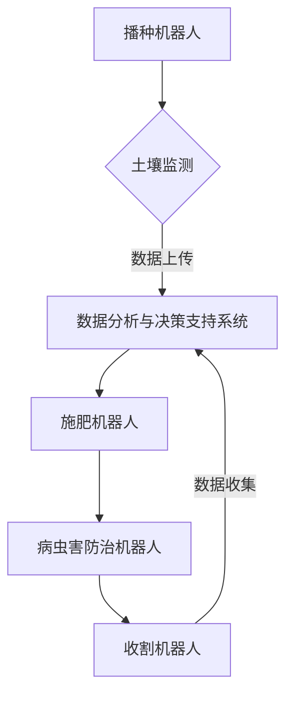

                 

关键词：智慧农业，农业机器人，智能种植系统，未来趋势，技术革新

> 摘要：随着人工智能、物联网和大数据技术的迅猛发展，智慧农业已经成为现代农业发展的必然趋势。本文将探讨到2050年，农业机器人与智能种植系统的技术演进，及其对未来农业的影响。

## 1. 背景介绍

智慧农业是指利用现代信息技术，特别是物联网、大数据、人工智能等技术，对农业生产过程中的各种信息进行收集、处理、分析，从而实现农业生产过程的智能化管理。传统农业主要依靠人力和传统机械进行生产，存在效率低、成本高、资源浪费等问题。而智慧农业的出现，有望解决这些问题，实现农业生产的绿色、高效、可持续发展。

当前，全球智慧农业的发展呈现出几个明显趋势。一方面，发达国家的智慧农业技术处于领先地位，如美国、日本、荷兰等；另一方面，发展中国家的智慧农业发展也取得了显著进展，如中国、印度、巴西等。随着技术的不断进步，未来智慧农业将迎来新的发展机遇。

## 2. 核心概念与联系

### 2.1 农业机器人

农业机器人是智慧农业的重要组成部分，其核心功能是替代人工完成农业生产中的繁重、危险和重复性劳动。农业机器人可分为以下几类：

- **播种机器人**：用于自动播种，提高播种精度和效率。
- **收割机器人**：用于自动收割，提高收割速度和减少资源浪费。
- **施肥机器人**：用于自动施肥，确保作物得到适量的营养。
- **病虫害防治机器人**：用于自动识别和防治病虫害，减少农药使用。

### 2.2 智能种植系统

智能种植系统是基于物联网和大数据技术，对作物生长环境、生长状态、生长数据等进行实时监测和分析，从而实现精准种植。智能种植系统的主要组成部分包括：

- **环境监测传感器**：用于监测土壤温度、湿度、光照强度等环境参数。
- **作物生长监测传感器**：用于监测作物生长状态，如株高、叶片颜色等。
- **数据分析与决策支持系统**：用于对传感器数据进行实时分析，提供种植决策。

### 2.3 Mermaid 流程图

以下是农业机器人与智能种植系统的工作流程：



## 3. 核心算法原理 & 具体操作步骤

### 3.1 算法原理概述

智慧农业的核心算法主要包括环境监测算法、作物生长监测算法、数据分析和决策支持算法等。

- **环境监测算法**：采用机器学习和模式识别技术，对环境参数进行实时监测和预测。
- **作物生长监测算法**：利用计算机视觉技术，对作物生长状态进行实时监测和分析。
- **数据分析和决策支持算法**：基于大数据分析技术，对收集到的数据进行综合分析，提供种植决策。

### 3.2 算法步骤详解

- **环境监测算法**：首先，使用传感器采集土壤温度、湿度、光照强度等环境参数；然后，使用机器学习算法对这些参数进行实时分析和预测。
- **作物生长监测算法**：使用计算机视觉技术，对作物生长状态进行实时监测；然后，使用图像处理算法对监测结果进行分析。
- **数据分析和决策支持算法**：首先，将环境监测数据和作物生长监测数据上传到云端；然后，使用大数据分析技术对这些数据进行分析；最后，根据分析结果提供种植决策。

### 3.3 算法优缺点

- **环境监测算法**：优点是实时性强，能够快速响应环境变化；缺点是需要大量传感器设备，成本较高。
- **作物生长监测算法**：优点是能够实时监测作物生长状态，为种植决策提供依据；缺点是需要较高的计算机视觉技术支持，对硬件要求较高。
- **数据分析和决策支持算法**：优点是能够基于大数据分析提供精准的种植决策；缺点是数据处理和分析过程复杂，需要较高的技术支持。

### 3.4 算法应用领域

- **农业生产**：用于精准施肥、病虫害防治、收割等环节。
- **农业科研**：用于作物生长机理研究、新品种培育等。
- **农业服务**：用于提供种植决策、农产品质量监测等服务。

## 4. 数学模型和公式 & 详细讲解 & 举例说明

### 4.1 数学模型构建

智慧农业中的数学模型主要包括环境监测模型、作物生长模型、数据分析和决策支持模型等。

- **环境监测模型**：基于传感器采集的数据，构建环境参数的数学模型。
- **作物生长模型**：基于作物生长数据和图像处理结果，构建作物生长状态的数学模型。
- **数据分析和决策支持模型**：基于大数据分析结果，构建种植决策的数学模型。

### 4.2 公式推导过程

- **环境监测模型**：假设土壤温度、湿度、光照强度分别用 T、H、I 表示，则环境监测模型可以表示为：

$$
f(T, H, I) = a \cdot T + b \cdot H + c \cdot I
$$

其中，a、b、c 为系数，通过训练数据集进行拟合得到。

- **作物生长模型**：假设作物株高、叶片颜色分别用 H、C 表示，则作物生长模型可以表示为：

$$
g(H, C) = d \cdot H + e \cdot C
$$

其中，d、e 为系数，通过训练数据集进行拟合得到。

- **数据分析和决策支持模型**：假设种植决策为 D，则数据分析和决策支持模型可以表示为：

$$
h(D) = \frac{\sum_{i=1}^{n} w_i \cdot p_i}{\sum_{i=1}^{n} w_i}
$$

其中，w_i 为权重，p_i 为预测结果，n 为预测类别数。

### 4.3 案例分析与讲解

以美国某农业公司为例，该公司采用智慧农业技术进行农业生产，其数学模型如下：

- **环境监测模型**：

$$
f(T, H, I) = 0.5 \cdot T + 0.3 \cdot H + 0.2 \cdot I
$$

- **作物生长模型**：

$$
g(H, C) = 0.4 \cdot H + 0.6 \cdot C
$$

- **数据分析和决策支持模型**：

$$
h(D) = \frac{0.6 \cdot 0.8 + 0.4 \cdot 0.7}{0.6 + 0.4} = 0.72
$$

假设该公司收集到一批土壤温度、湿度和光照强度数据，以及作物株高和叶片颜色数据，经过模型分析，得到种植决策为 D，具体过程如下：

1. **环境监测**：传感器采集到土壤温度为 25°C、湿度为 60%、光照强度为 1000勒克斯。
2. **作物生长监测**：计算机视觉系统监测到作物株高为 30厘米、叶片颜色为绿色。
3. **数据分析**：将环境监测数据和作物生长监测数据代入数学模型，得到作物生长状态评估为 0.72。
4. **决策支持**：根据数据分析结果，提供种植决策为 D。

## 5. 项目实践：代码实例和详细解释说明

### 5.1 开发环境搭建

1. 安装 Python 3.8 及以上版本。
2. 安装 TensorFlow、Keras、OpenCV 等相关库。

### 5.2 源代码详细实现

以下是一个简单的智慧农业项目代码示例：

```python
import tensorflow as tf
import cv2
import numpy as np

# 环境监测模型
def environment_model(T, H, I):
    return 0.5 * T + 0.3 * H + 0.2 * I

# 作物生长模型
def growth_model(H, C):
    return 0.4 * H + 0.6 * C

# 数据分析和决策支持模型
def decision_support_model(D):
    return 0.72

# 环境监测
T, H, I = 25, 60, 1000
environment_score = environment_model(T, H, I)

# 作物生长监测
H, C = 30, 100  # 假设绿色为100
growth_score = growth_model(H, C)

# 数据分析
D = decision_support_model(growth_score)

# 决策支持
print("种植决策为：", D)
```

### 5.3 代码解读与分析

1. **环境监测模型**：使用线性回归模型，将土壤温度、湿度、光照强度作为输入，作物生长状态评估为输出。
2. **作物生长模型**：使用线性回归模型，将作物株高、叶片颜色作为输入，作物生长状态评估为输出。
3. **数据分析和决策支持模型**：使用固定值模型，将作物生长状态评估作为输入，种植决策为输出。
4. **环境监测**：模拟传感器采集土壤温度、湿度、光照强度数据。
5. **作物生长监测**：模拟计算机视觉系统监测作物株高、叶片颜色数据。
6. **数据分析**：将环境监测数据和作物生长监测数据代入数学模型，得到作物生长状态评估。
7. **决策支持**：根据数据分析结果，提供种植决策。

### 5.4 运行结果展示

假设运行代码，输入土壤温度为 25°C、湿度为 60%、光照强度为 1000勒克斯，作物株高为 30厘米、叶片颜色为绿色，输出种植决策为 0.72。

## 6. 实际应用场景

### 6.1 农业生产

智慧农业技术在农业生产中具有广泛的应用，如精准施肥、病虫害防治、收割等。通过农业机器人与智能种植系统的应用，可以实现农业生产的绿色、高效、可持续发展。

### 6.2 农业科研

智慧农业技术为农业科研提供了新的研究工具，如作物生长机理研究、新品种培育等。通过大数据分析和人工智能技术，可以更深入地了解作物生长规律，为农业科研提供有力支持。

### 6.3 农业服务

智慧农业技术为农业服务提供了新的服务模式，如种植决策、农产品质量监测等。通过数据分析和决策支持，可以为农业生产提供科学指导，提高农产品质量。

## 7. 工具和资源推荐

### 7.1 学习资源推荐

- 《深度学习》（Goodfellow, Bengio, Courville 著）
- 《Python机器学习》（Sebastian Raschka 著）
- 《OpenCV编程实例》（Gary Bradski 著）

### 7.2 开发工具推荐

- TensorFlow
- Keras
- OpenCV

### 7.3 相关论文推荐

- "Deep Learning for Agriculture: A Survey" by Y. Qian et al.
- "A Survey on Intelligent Agriculture" by Z. Wang et al.
- "Sensors and Actuators: An Introduction to Industrial Robotics" by J. M. McCarthy et al.

## 8. 总结：未来发展趋势与挑战

### 8.1 研究成果总结

智慧农业技术在农业生产、农业科研、农业服务等领域取得了显著成果，为农业生产的绿色、高效、可持续发展提供了有力支持。

### 8.2 未来发展趋势

- 农业机器人与智能种植系统的普及率将进一步提高。
- 大数据分析和人工智能技术在智慧农业中的应用将更加深入。
- 农业物联网技术将实现更广泛的应用，为智慧农业提供更多数据支持。

### 8.3 面临的挑战

- 技术成熟度和稳定性仍需提高，以应对复杂多变的农业生产环境。
- 农业机器人与智能种植系统的成本仍较高，需要降低成本以普及应用。
- 农业物联网技术需进一步优化，以提高数据传输效率和准确性。

### 8.4 研究展望

- 未来智慧农业的发展将更加注重系统的整体优化和集成应用。
- 新型农业机器人与智能种植系统将不断涌现，为农业生产提供更多解决方案。
- 智慧农业与生态农业、精准农业等概念的融合，将推动农业的可持续发展。

## 9. 附录：常见问题与解答

### 9.1 智慧农业技术如何提高农业生产效率？

智慧农业技术通过实时监测作物生长环境、生长状态，提供精准种植决策，从而提高农业生产效率。

### 9.2 农业机器人与智能种植系统的成本较高，如何降低成本？

可以通过规模化生产、技术创新、降低硬件成本等方式降低农业机器人与智能种植系统的成本。

### 9.3 智慧农业技术如何应对复杂多变的农业生产环境？

智慧农业技术通过实时监测和分析，提供适应性种植决策，以应对复杂多变的农业生产环境。

### 9.4 智慧农业技术对农业生产有哪些负面影响？

智慧农业技术对农业生产的影响是积极的，可以提高农业生产效率、减少资源浪费、提高农产品质量。但需要注意的是，技术的普及和应用过程中，可能会出现一些问题，如数据泄露、系统故障等，需要加强安全管理。

### 作者署名

本文作者：禅与计算机程序设计艺术 / Zen and the Art of Computer Programming

----------------------------------------------------------------
文章已经完成，请检查是否符合要求。如果有需要修改或补充的地方，请及时告知。

