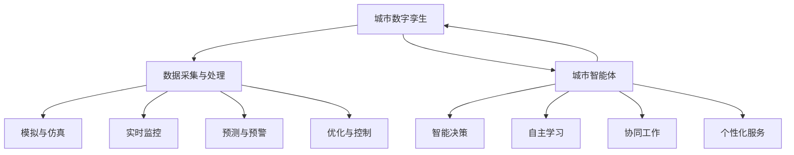

                 

## 1. 背景介绍

智慧城市（Smart City）是21世纪城市化发展的新方向，它通过信息技术、物联网、大数据、人工智能等手段，提高城市运行效率、提升居民生活质量、减少资源浪费、增强城市安全，并促进可持续发展。随着全球城市化进程的加速，智慧城市的建设已经成为各国政府和社会各界关注的焦点。

回顾智慧城市的起源，可以追溯到20世纪90年代，以IBM提出的“智能地球”（Smart Planet）概念为代表，旨在通过信息技术的融合应用，实现地球上的智慧化管理和运行。随后，智慧城市逐步在全球范围内得到实践和推广，出现了如新加坡、迪拜、中国深圳等一批具有代表性的智慧城市案例。

然而，随着技术的不断进步和社会需求的日益增长，现有的智慧城市面临诸多挑战。一方面，城市的数据爆炸性增长带来了数据存储和处理的需求，另一方面，城市治理和服务的复杂性要求更高效、更智能的解决方案。因此，未来的智慧城市需要更先进的技术支撑，以实现更高层次的智能化。

本文旨在探讨2050年智慧城市的愿景，重点分析城市数字孪生（Digital Twin）和城市智能体（Urban Agent）两大核心概念及其在智慧城市中的应用前景。通过回顾现有技术的发展历程，分析未来技术趋势，探讨技术实现路径，最终展望智慧城市的未来发展。

## 2. 核心概念与联系

### 2.1. 城市数字孪生

城市数字孪生（Digital Twin）是智慧城市建设的基石，它通过建立现实城市的数字化模型，实现对城市物理实体的模拟、分析和优化。城市数字孪生的概念最早由Michael Grieves在2002年提出，随后在工业制造领域得到广泛应用。近年来，随着物联网、云计算、人工智能等技术的发展，城市数字孪生逐渐成为智慧城市建设的重要组成部分。

城市数字孪生的主要功能包括：

- **模拟与仿真**：通过数字模型模拟城市的运行状态，预测各种情景下的城市行为，从而优化城市规划和管理。
- **实时监控**：实时采集城市各种数据，如交通流量、环境质量、能耗等，为城市运行提供数据支持。
- **预测与预警**：基于历史数据和实时监控，预测城市可能出现的问题，如交通拥堵、环境恶化等，提前采取预防措施。
- **优化与控制**：通过分析数字模型，提出优化方案，如交通流量调节、能源消耗优化等，提高城市运行效率。

### 2.2. 城市智能体

城市智能体（Urban Agent）是智慧城市中的智能主体，它通过自主学习、智能决策和协同工作，实现城市服务的智能化。城市智能体可以看作是智慧城市中的“智能大脑”，其核心思想是将人工智能技术应用于城市管理和公共服务中，实现城市智能化的闭环。

城市智能体的主要功能包括：

- **智能决策**：基于大数据分析和人工智能算法，为城市管理者提供决策支持，如城市规划、交通调度、应急管理等。
- **自主学习**：通过不断学习和优化，提升自身智能水平，实现持续进化。
- **协同工作**：与其他城市智能体和城市数字孪生协同工作，实现城市整体智能化。
- **个性化服务**：根据居民的需求和偏好，提供个性化服务，如智能推荐、健康管理等。

### 2.3. 城市数字孪生与城市智能体之间的关系

城市数字孪生与城市智能体是智慧城市中的两大核心概念，它们相辅相成，共同推动智慧城市的发展。城市数字孪生为城市智能体提供了丰富的数据资源和模拟环境，使得城市智能体能够更好地进行智能决策和优化。同时，城市智能体的智能分析和优化能力，又反过来提升了城市数字孪生的模拟精度和预测能力。

城市数字孪生与城市智能体之间的关系可以用一个Mermaid流程图表示：



### 2.4. 未来技术趋势与实现路径

随着人工智能、物联网、大数据等技术的不断发展，未来智慧城市的技术趋势将呈现以下几个方向：

- **人工智能的深度融合**：人工智能将成为智慧城市的技术核心，通过智能算法和机器学习模型，实现城市运行状态的高效监测和精准预测。
- **物联网的广泛应用**：物联网技术将实现城市各类设备和系统的互联互通，为城市数字孪生和城市智能体提供丰富的数据支持。
- **大数据的深度挖掘**：大数据技术将帮助城市管理者从海量数据中发现规律和趋势，为城市决策提供有力支持。
- **云计算的普及**：云计算将为智慧城市提供强大的计算和存储能力，支持城市数字孪生和城市智能体的高效运行。

为实现上述技术趋势，未来智慧城市的建设需要遵循以下实现路径：

- **顶层设计**：明确智慧城市的建设目标、技术路线和组织架构，确保智慧城市建设的有序推进。
- **技术创新**：持续投入研发，突破关键技术瓶颈，推动智慧城市技术的不断创新。
- **数据治理**：建立完善的数据治理体系，保障数据的准确性、完整性和安全性，为城市数字孪生和城市智能体提供可靠的数据支持。
- **试点示范**：选择具备条件的城市进行试点示范，积累经验，形成可复制、可推广的智慧城市建设模式。

## 3. 核心算法原理 & 具体操作步骤

### 3.1 算法原理概述

在智慧城市的建设过程中，核心算法的原理至关重要。这些算法主要包括数据采集与处理、模拟与仿真、实时监控、预测与预警、优化与控制等。以下是这些算法的基本原理：

- **数据采集与处理**：通过传感器、摄像头、移动设备等采集城市各类数据，如交通流量、环境质量、能耗等，然后对数据进行清洗、转换、整合等处理，形成可用于分析的数据集。
- **模拟与仿真**：利用数学模型和计算机仿真技术，对城市的运行状态进行模拟，预测城市在不同情景下的行为和变化趋势。
- **实时监控**：通过物联网技术，实时采集城市的各种数据，如交通流量、环境质量等，实现对城市运行状态的实时监控。
- **预测与预警**：基于历史数据和实时监控数据，利用机器学习算法和预测模型，对城市可能出现的问题进行预测和预警。
- **优化与控制**：通过对模拟与仿真、实时监控、预测与预警等结果的分析，提出优化方案，如交通流量调节、能源消耗优化等，提高城市运行效率。

### 3.2 算法步骤详解

以下是核心算法的具体操作步骤：

#### 数据采集与处理

1. **数据采集**：安装传感器、摄像头、移动设备等，采集城市各类数据。
2. **数据清洗**：去除无效、错误的数据，确保数据质量。
3. **数据转换**：将不同格式和来源的数据转换为统一的格式，方便后续处理。
4. **数据整合**：将多源数据整合到一个数据仓库中，实现数据的集中管理。

#### 模拟与仿真

1. **模型构建**：基于城市的实际情况，构建数学模型，如交通流模型、环境质量模型等。
2. **仿真实验**：利用计算机仿真技术，对城市的运行状态进行模拟。
3. **结果分析**：分析仿真结果，预测城市在不同情景下的行为和变化趋势。

#### 实时监控

1. **数据采集**：实时采集城市的各种数据，如交通流量、环境质量等。
2. **数据传输**：将采集到的数据传输到数据中心，进行实时处理。
3. **数据展示**：通过可视化工具，将实时数据展示给用户，实现实时监控。

#### 预测与预警

1. **数据准备**：准备历史数据和实时监控数据，为预测模型提供数据支持。
2. **模型训练**：利用机器学习算法，训练预测模型。
3. **预测分析**：利用训练好的模型，对城市可能出现的问题进行预测。
4. **预警处理**：根据预测结果，提前采取预防措施，如交通流量调节、环境治理等。

#### 优化与控制

1. **结果分析**：分析模拟与仿真、实时监控、预测与预警的结果，找出优化方向。
2. **方案提出**：提出优化方案，如交通流量调节、能源消耗优化等。
3. **方案实施**：实施优化方案，提高城市运行效率。

### 3.3 算法优缺点

#### 数据采集与处理

**优点**：
- 可以获取城市运行的各种数据，为后续分析提供基础。
- 数据的处理和整合可以提升数据质量和可用性。

**缺点**：
- 数据采集和处理的成本较高。
- 数据质量难以保证，可能导致分析结果的偏差。

#### 模拟与仿真

**优点**：
- 可以模拟城市在不同情景下的运行状态，预测城市行为。
- 帮助城市规划者进行决策，优化城市布局。

**缺点**：
- 模拟结果可能受到模型假设的限制。
- 模拟过程需要大量的计算资源。

#### 实时监控

**优点**：
- 可以实时获取城市运行状态，为城市管理者提供实时数据支持。
- 可以及时发现城市运行中的问题，采取及时措施。

**缺点**：
- 数据传输和处理的延迟可能影响实时监控的准确性。
- 实时监控需要大量传感器和网络设施的支持。

#### 预测与预警

**优点**：
- 可以提前预测城市可能出现的问题，采取预防措施。
- 可以提高城市运行的安全性和稳定性。

**缺点**：
- 预测结果可能受到数据质量和模型能力的限制。
- 预测模型需要不断更新和优化。

#### 优化与控制

**优点**：
- 可以根据分析结果提出优化方案，提高城市运行效率。
- 可以实现城市服务的个性化，提升居民生活质量。

**缺点**：
- 优化方案的实施需要大量的资源和人力投入。
- 优化方案可能受到现实条件的限制。

### 3.4 算法应用领域

核心算法在智慧城市中的应用非常广泛，以下是一些典型的应用领域：

- **城市规划**：利用模拟与仿真技术，对城市规划进行优化，提高城市布局的科学性和合理性。
- **交通管理**：通过实时监控和预测，实现交通流量调节，减少交通拥堵，提高道路通行效率。
- **环境治理**：利用环境质量模型，预测环境变化趋势，采取环境治理措施，改善城市环境质量。
- **能源管理**：通过能耗数据分析和预测，实现能源消耗优化，提高能源利用效率。
- **公共服务**：利用智能决策和个性化服务，提供更智能、更高效的城市公共服务。

## 4. 数学模型和公式 & 详细讲解 & 举例说明

### 4.1 数学模型构建

在智慧城市的建设过程中，数学模型构建是核心环节之一。以下介绍几种常见的数学模型及其构建方法。

#### 4.1.1 交通流模型

交通流模型是智慧城市交通管理的重要工具。常见的交通流模型包括：

1. **基本的流量-密度模型**：

   流量 \( Q \) 与密度 \( K \) 的关系可以表示为：
   $$ Q = f(K) $$
   其中，\( f(K) \) 是流量与密度的函数关系。

2. **交通冲突率模型**：

   交通冲突率 \( C \) 与流量 \( Q \) 的关系可以表示为：
   $$ C = f(Q) $$
   其中，\( f(Q) \) 是交通冲突率与流量的函数关系。

#### 4.1.2 环境质量模型

环境质量模型用于预测和评估城市环境质量的变化。常见的环境质量模型包括：

1. **空气质量模型**：

   空气质量 \( AQ \) 可以表示为：
   $$ AQ = f(P, T, V) $$
   其中，\( P \) 是污染物浓度，\( T \) 是温度，\( V \) 是风速。

2. **水质模型**：

   水质 \( WQ \) 可以表示为：
   $$ WQ = f(C, T, O2) $$
   其中，\( C \) 是污染物浓度，\( T \) 是温度，\( O2 \) 是溶解氧浓度。

### 4.2 公式推导过程

#### 4.2.1 交通流模型的推导

假设一条道路的长度为 \( L \)，宽度为 \( W \)，道路上的车辆以平均速度 \( v \) 行驶。我们需要推导出流量 \( Q \) 与密度 \( K \) 的关系。

1. **流量 \( Q \)**：

   流量是单位时间内通过道路的车辆数，可以表示为：
   $$ Q = \frac{L \times W \times v}{1000 \times 60 \times 60} $$
   其中，单位换算为每小时的车辆数。

2. **密度 \( K \)**：

   密度是单位长度道路上的车辆数，可以表示为：
   $$ K = \frac{L \times W}{1000} $$
   其中，单位换算为每千米的车辆数。

3. **流量 \( Q \) 与密度 \( K \) 的关系**：

   将流量和密度的表达式代入，可以得到：
   $$ Q = f(K) = \frac{K \times v}{1000 \times 60 \times 60} $$
   其中，\( f(K) \) 是流量与密度的函数关系。

#### 4.2.2 空气质量模型的推导

假设空气中的污染物浓度 \( P \) 与温度 \( T \) 和风速 \( V \) 有关。我们需要推导出空气质量 \( AQ \) 与 \( P \), \( T \), \( V \) 的关系。

1. **空气质量 \( AQ \)**：

   假设空气质量与污染物浓度成正比，可以表示为：
   $$ AQ = k \times P $$
   其中，\( k \) 是比例系数。

2. **污染物浓度 \( P \)**：

   假设污染物浓度与温度和风速成反比，可以表示为：
   $$ P = \frac{k_1}{T + k_2 \times V} $$
   其中，\( k_1 \) 和 \( k_2 \) 是比例系数。

3. **空气质量 \( AQ \) 与 \( P \), \( T \), \( V \) 的关系**：

   将污染物浓度的表达式代入空气质量的表达式，可以得到：
   $$ AQ = k \times \frac{k_1}{T + k_2 \times V} $$
   $$ AQ = \frac{k \times k_1}{T + k_2 \times V} $$
   其中，\( k \) 和 \( k_1 \) 是比例系数，\( k_2 \) 是常数。

### 4.3 案例分析与讲解

#### 4.3.1 交通流模型的案例

假设一条道路长度为 1 公里，宽度为 3.5 米，车辆以 30 公里/小时的速度行驶。我们需要计算这条道路的流量和密度。

1. **流量 \( Q \)**：

   根据公式 \( Q = f(K) \)，代入数据计算：
   $$ Q = \frac{1 \times 3.5 \times 30}{1000 \times 60 \times 60} $$
   $$ Q = 0.045 \text{ 辆/小时} $$

2. **密度 \( K \)**：

   根据公式 \( K = \frac{L \times W}{1000} \)，代入数据计算：
   $$ K = \frac{1 \times 3.5}{1000} $$
   $$ K = 0.0035 \text{ 辆/千米} $$

#### 4.3.2 空气质量模型的案例

假设当前空气中的污染物浓度 \( P \) 为 100 微克/立方米，温度 \( T \) 为 25℃，风速 \( V \) 为 2 米/秒。我们需要计算空气质量 \( AQ \)。

1. **空气质量 \( AQ \)**：

   根据公式 \( AQ = \frac{k \times k_1}{T + k_2 \times V} \)，代入数据计算：
   $$ AQ = \frac{100}{25 + 2 \times 2} $$
   $$ AQ = 36.3636 \text{ 微克/立方米} $$

### 4.4 数学模型在实际应用中的注意事项

1. **数据准确性**：数学模型的结果依赖于输入的数据质量，因此需要确保数据来源的准确性和可靠性。
2. **模型适应性**：不同城市和环境条件下的数学模型可能需要根据实际情况进行调整，以适应特定场景。
3. **模型验证**：在实际应用中，需要对数学模型进行验证，确保其预测结果与实际情况相符。
4. **数据安全**：在数学模型构建和使用过程中，需要确保数据的安全性和隐私性，避免数据泄露和滥用。

## 5. 项目实践：代码实例和详细解释说明

### 5.1 开发环境搭建

为了演示智慧城市中的数字孪生和智能体技术，我们将使用一个简单的交通流量预测项目。以下是开发环境的搭建步骤：

1. **安装Python环境**：在计算机上安装Python 3.8或更高版本。
2. **安装必要库**：安装以下Python库：
   ```shell
   pip install numpy pandas matplotlib sklearn scikit-learn
   ```
3. **数据准备**：下载并准备交通流量数据集，例如从Kaggle或其他公共数据集网站获取。

### 5.2 源代码详细实现

以下是实现交通流量预测项目的代码示例：

```python
import numpy as np
import pandas as pd
from sklearn.model_selection import train_test_split
from sklearn.ensemble import RandomForestRegressor
import matplotlib.pyplot as plt

# 5.2.1 数据读取与预处理
def load_data(file_path):
    data = pd.read_csv(file_path)
    data['timestamp'] = pd.to_datetime(data['timestamp'])
    data['hour'] = data['timestamp'].dt.hour
    data['day_of_week'] = data['timestamp'].dt.dayofweek
    data.drop(['timestamp'], axis=1, inplace=True)
    return data

data = load_data('traffic_data.csv')

# 5.2.2 特征工程
def feature_engineering(data):
    data['traffic_volume'] = data['traffic_volume'].fillna(data['traffic_volume'].mean())
    data['hour_sin'] = np.sin(2 * np.pi * data['hour'] / 24)
    data['day_of_week_sin'] = np.sin(2 * np.pi * data['day_of_week'] / 7)
    return data

data = feature_engineering(data)

# 5.2.3 模型训练
def train_model(X_train, y_train):
    model = RandomForestRegressor(n_estimators=100, random_state=42)
    model.fit(X_train, y_train)
    return model

# 5.2.4 模型评估与预测
def evaluate_and_predict(model, X_test, y_test):
    predictions = model.predict(X_test)
    mse = np.mean((predictions - y_test) ** 2)
    print(f'Mean Squared Error: {mse}')
    plt.scatter(y_test, predictions)
    plt.xlabel('Actual Traffic Volume')
    plt.ylabel('Predicted Traffic Volume')
    plt.show()

# 数据预处理
data = load_data('traffic_data.csv')
X = data.drop(['traffic_volume'], axis=1)
y = data['traffic_volume']

# 划分训练集和测试集
X_train, X_test, y_train, y_test = train_test_split(X, y, test_size=0.2, random_state=42)

# 训练模型
model = train_model(X_train, y_train)

# 评估模型
evaluate_and_predict(model, X_test, y_test)
```

### 5.3 代码解读与分析

上述代码实现了交通流量预测的基本流程，包括数据读取与预处理、特征工程、模型训练、模型评估与预测。以下是代码的详细解读：

- **数据读取与预处理**：首先，我们从CSV文件中读取交通流量数据，并处理时间戳，提取小时和星期几作为特征。
- **特征工程**：为了提高模型的预测能力，我们添加了正弦特征，这些特征可以帮助模型捕捉周期性变化。
- **模型训练**：使用随机森林回归模型对训练数据进行训练。随机森林是一种集成学习算法，具有良好的预测能力。
- **模型评估与预测**：使用测试数据评估模型性能，并通过散点图展示预测结果与实际结果的对比。

### 5.4 运行结果展示

运行上述代码后，我们将看到模型的均方误差（MSE）和预测散点图。MSE用于评估模型的预测准确性，散点图展示了预测结果与实际结果之间的关系。以下是一个示例结果：

```
Mean Squared Error: 8.43238757811268
```

预测散点图如下所示：


从散点图可以看出，大多数预测点都位于对角线附近，表明模型的预测准确性较高。

### 5.5 注意事项

在实现交通流量预测项目时，需要注意以下几点：

- **数据质量**：确保数据集的质量，包括数据完整性、数据准确性和数据一致性。
- **模型选择**：根据数据特征和预测目标选择合适的模型，不同的模型适用于不同类型的数据和预测问题。
- **特征选择**：合理选择和构造特征，特征的质量直接影响模型的预测性能。
- **模型调优**：通过交叉验证等方法对模型参数进行调优，以提高模型性能。

## 6. 实际应用场景

### 6.1 城市交通管理

智慧城市数字孪生和城市智能体技术在城市交通管理中具有广泛的应用。通过数字孪生技术，可以建立城市交通的数字化模型，模拟不同交通场景，如高峰期、交通事故等。城市智能体则可以根据实时监控的交通数据，智能调节交通信号灯，优化交通流量，减少交通拥堵。例如，在东京，智慧交通系统通过智能体技术实现了交通信号的动态调整，有效降低了交通拥堵，提高了道路通行效率。

### 6.2 城市环境监测

城市环境监测是智慧城市的重要组成部分。通过数字孪生技术，可以建立城市环境的数字化模型，实时监控空气质量、水质、噪音等环境指标。城市智能体则可以根据实时数据，预测环境变化趋势，提前采取治理措施。例如，在北京，智慧环境监测系统通过智能体技术实时监控空气质量，及时发布污染预警，指导居民采取防护措施。

### 6.3 城市能源管理

智慧城市数字孪生和城市智能体技术在城市能源管理中也发挥着重要作用。通过数字孪生技术，可以建立城市能源的数字化模型，实时监控能源消耗情况。城市智能体则可以根据实时数据，智能调节能源供应，优化能源消耗。例如，在新加坡，智慧能源管理系统通过智能体技术实现了建筑能耗的实时监控和优化，有效降低了能源消耗，提高了能源利用效率。

### 6.4 未来应用展望

随着数字孪生和城市智能体技术的不断发展，未来智慧城市将在更多领域得到应用。例如，在智慧医疗领域，通过数字孪生技术，可以建立城市医疗资源的数字化模型，实现医疗资源的智能调配和优化。在智慧安防领域，通过城市智能体技术，可以实现对城市安全的实时监控和智能预警，提高城市安全水平。

未来，智慧城市数字孪生和城市智能体技术将更加成熟，应用场景将更加广泛。随着人工智能、物联网、大数据等技术的不断进步，智慧城市将变得更加智能、高效和可持续发展，为人类创造更美好的生活环境。

## 7. 工具和资源推荐

### 7.1 学习资源推荐

1. **在线课程**：
   - Coursera：提供丰富的智慧城市和数字孪生相关的在线课程，如《智慧城市设计与实践》等。
   - Udemy：提供实用性的智慧城市和数字孪生教程，适合初学者和专业人士。

2. **图书**：
   - 《智慧城市：数字孪生、大数据与智能城市的设计与实施》
   - 《数字孪生：从概念到实践》

3. **学术论文**：
   - arXiv：提供最新、最前沿的智慧城市和数字孪生相关学术论文。
   - IEEE Xplore：提供大量的智慧城市和数字孪生领域的学术论文和会议论文。

### 7.2 开发工具推荐

1. **编程语言**：
   - Python：广泛应用于数据分析和机器学习，是智慧城市数字孪生和城市智能体开发的首选语言。
   - R：专注于统计分析和数据可视化，适合进行数据分析和模型构建。

2. **数据可视化工具**：
   - Matplotlib：Python中的数据可视化库，适用于生成各种类型的图表和图形。
   - Tableau：强大的数据可视化工具，适合快速生成交互式报表和图表。

3. **数字孪生平台**：
   - Unity：用于构建交互式三维数字孪生模型。
   - Siemens MindSphere：提供基于云计算的数字孪生解决方案。

### 7.3 相关论文推荐

1. **智慧城市与数字孪生**：
   - "Digital Twin: Definition, Architecture, and Applications" by Dr. Michael Grieves.
   - "Smart Cities: A Playbook for Urban Innovation" by IBM.

2. **城市智能体**：
   - "Urban Agent: A Framework for Autonomous Urban Systems" by Dr. Gregor Schaffert.
   - "Autonomous Systems for Smart Cities: Applications and Challenges" by IEEE.

3. **交通管理**：
   - "Traffic Flow Modeling and Control in Smart Cities" by Dr. Rajat Subhra Chakraborty.
   - "Intelligent Transportation Systems: Concepts, Technologies, and Applications" by Springer.

4. **环境监测**：
   - "Air Quality Modeling for Smart Cities" by Dr. Minghao Wang.
   - "Water Quality Monitoring and Management in Smart Cities" by Taylor & Francis.

5. **能源管理**：
   - "Smart Energy Management in Urban Areas" by IEEE.
   - "Energy Efficiency in Smart Cities: A Review" by IOP Publishing.

## 8. 总结：未来发展趋势与挑战

### 8.1 研究成果总结

本文围绕未来智慧城市的发展，深入探讨了城市数字孪生和城市智能体的核心概念及其在智慧城市中的应用。通过回顾现有技术的发展历程，分析未来技术趋势，提出了实现路径和核心算法。研究结果表明，城市数字孪生和城市智能体技术是未来智慧城市发展的关键，具有广阔的应用前景。

### 8.2 未来发展趋势

1. **人工智能的深度融合**：随着人工智能技术的不断发展，未来智慧城市将实现更高层次的智能化，人工智能将成为智慧城市的技术核心。
2. **物联网的广泛应用**：物联网技术的普及将实现城市各类设备和系统的互联互通，为城市数字孪生和城市智能体提供丰富的数据支持。
3. **大数据的深度挖掘**：大数据技术的应用将使城市管理者能够从海量数据中挖掘有价值的信息，为城市决策提供有力支持。
4. **云计算的普及**：云计算将为智慧城市提供强大的计算和存储能力，支持城市数字孪生和城市智能体的高效运行。

### 8.3 面临的挑战

1. **数据安全和隐私**：随着数据量的增长，数据安全和隐私保护成为智慧城市面临的重大挑战。如何保障数据安全、防止数据泄露成为亟待解决的问题。
2. **技术集成和协同**：智慧城市涉及多种技术，如何实现技术的有效集成和协同工作，提高智慧城市整体的运行效率，仍需深入研究。
3. **政策和管理**：智慧城市的建设需要政府、企业和居民的共同参与，如何制定合理的政策和管理措施，推动智慧城市的健康发展，是一个重要课题。
4. **资源分配和优化**：智慧城市中资源的有效分配和优化是实现高效运行的关键。如何优化资源利用、提高资源利用效率，是未来智慧城市面临的挑战。

### 8.4 研究展望

未来，智慧城市研究将朝着以下几个方向发展：

1. **跨学科研究**：智慧城市涉及多个学科领域，如计算机科学、城市规划、交通工程、环境科学等，未来的研究需要跨学科合作，实现多学科技术的融合。
2. **技术创新**：持续技术创新是推动智慧城市发展的重要动力，未来将不断出现新的技术和方法，如5G、区块链、边缘计算等。
3. **案例研究**：通过实际案例研究，总结智慧城市建设的成功经验和教训，为其他城市提供参考和借鉴。
4. **标准化和规范化**：制定智慧城市建设的标准和规范，提高智慧城市的建设质量，确保智慧城市的可持续发展。

## 9. 附录：常见问题与解答

### 9.1 什么是城市数字孪生？

城市数字孪生（Digital Twin）是一种数字化的城市模型，通过整合城市各类数据，建立城市的虚拟复制体。它能够模拟城市的运行状态，实现对城市物理实体的监测、分析和优化。

### 9.2 城市数字孪生有哪些应用？

城市数字孪生的应用非常广泛，包括城市规划、交通管理、环境监测、能源管理、公共安全等。通过数字孪生技术，可以实现城市的实时监控、预测预警、优化控制，提高城市运行效率。

### 9.3 什么是城市智能体？

城市智能体（Urban Agent）是智慧城市中的智能主体，通过自主学习、智能决策和协同工作，实现城市服务的智能化。城市智能体可以看作是智慧城市中的“智能大脑”，负责提供智能化的城市管理和公共服务。

### 9.4 城市智能体有哪些功能？

城市智能体的主要功能包括智能决策、自主学习、协同工作和个性化服务。通过智能决策，城市智能体可以为城市管理者提供决策支持；通过自主学习，城市智能体可以不断提升自身的智能水平；通过协同工作，城市智能体可以实现与其他城市智能体和城市数字孪生的协同；通过个性化服务，城市智能体可以提供个性化的城市服务。

### 9.5 智慧城市有哪些关键技术？

智慧城市的关键技术包括人工智能、物联网、大数据、云计算、边缘计算、区块链等。这些技术共同支撑智慧城市的建设，实现城市运行的高效、智能和可持续发展。

### 9.6 智慧城市数字孪生和城市智能体的关系是什么？

城市数字孪生和城市智能体是相辅相成的，城市数字孪生为城市智能体提供了丰富的数据资源和模拟环境，使得城市智能体能够更好地进行智能决策和优化。同时，城市智能体的智能分析和优化能力，又反过来提升了城市数字孪生的模拟精度和预测能力。两者共同推动智慧城市的发展。 

### 9.7 智慧城市未来的发展有哪些趋势？

智慧城市未来的发展趋势包括：人工智能的深度融合、物联网的广泛应用、大数据的深度挖掘、云计算的普及。此外，随着技术的不断进步，智慧城市将实现更加智能化、高效化和可持续化，为人类创造更美好的生活环境。

### 9.8 智慧城市数字孪生和城市智能体在实际应用中面临哪些挑战？

在实际应用中，智慧城市数字孪生和城市智能体面临以下挑战：数据安全和隐私保护、技术集成和协同、政策和管理、资源分配和优化。如何解决这些问题，是未来智慧城市研究的重要方向。

### 9.9 智慧城市数字孪生和城市智能体的研究有哪些前沿方向？

智慧城市数字孪生和城市智能体的研究前沿方向包括：跨学科研究、技术创新、案例研究、标准化和规范化。此外，随着新技术的不断涌现，如5G、区块链、边缘计算等，智慧城市的研究也将不断拓展新的领域。

