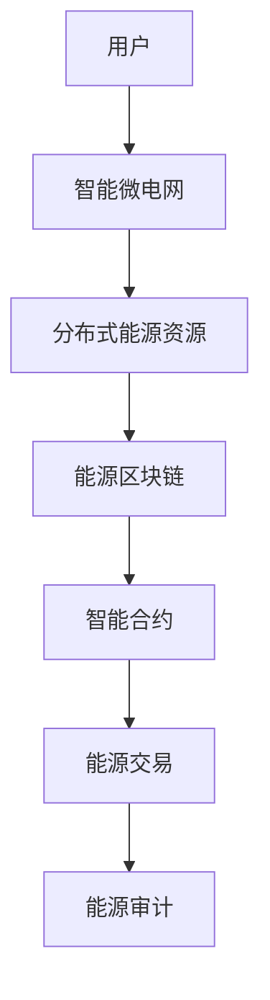

                 

关键词：智慧能源、智能微电网、能源区块链、未来趋势、技术挑战

> 摘要：随着全球能源需求的不断增长和气候变化问题日益严重，智慧能源系统的研究和应用成为亟待解决的重要课题。本文将探讨2050年的智能微电网与能源区块链技术的发展，分析其在能源领域中的关键作用、核心算法、数学模型、项目实践及其未来应用前景。

## 1. 背景介绍

在过去的几十年里，全球能源消费持续增长，对传统能源的依赖程度日益加深。然而，这种依赖不仅带来了资源枯竭的问题，同时也加剧了环境污染和气候变化。为了应对这一挑战，全球范围内开始了对清洁能源和智能电网技术的探索。智能微电网作为智能电网的重要组成部分，通过整合分布式能源资源，实现了能源的高效利用和优化配置。

与此同时，区块链技术的出现为能源领域的创新提供了新的机遇。能源区块链通过去中心化的方式，实现了能源交易的安全和透明，推动了能源市场的变革。智能微电网与能源区块链的结合，有望构建一个更加高效、灵活、可靠的能源生态系统。

本文旨在探讨2050年的智能微电网与能源区块链技术的发展趋势，分析其核心概念、技术原理、算法模型以及实际应用，为未来智慧能源系统的研究提供参考。

## 2. 核心概念与联系

### 2.1. 智能微电网

智能微电网是一种分布式能源网络，通过集成多种分布式能源资源（如太阳能、风能、储能系统等），实现能源的高效利用和优化配置。智能微电网具有以下特点：

- **高可靠性**：智能微电网可以通过冗余设计和故障自恢复机制，保证系统的可靠运行。
- **高效性**：通过优化能源调度和管理，智能微电网能够实现能源的高效利用。
- **灵活性**：智能微电网能够快速响应电网负荷变化，提供灵活的电能供应。

### 2.2. 能源区块链

能源区块链是一种基于区块链技术的能源交易系统，通过去中心化的方式，实现了能源交易的安全和透明。能源区块链具有以下特点：

- **安全性**：能源区块链通过加密算法和共识机制，确保能源交易数据的安全和不可篡改。
- **透明性**：能源区块链上的所有交易记录都是公开透明的，用户可以随时查询。
- **高效性**：能源区块链通过智能合约，实现了能源交易的高效执行。

### 2.3. 智能微电网与能源区块链的联系

智能微电网与能源区块链的结合，可以解决传统能源系统中存在的诸多问题。通过能源区块链，智能微电网可以实现以下功能：

- **能源交易**：智能微电网中的分布式能源资源可以通过能源区块链进行交易，实现能源的市场化配置。
- **能源管理**：能源区块链可以为智能微电网提供实时的能源交易信息和负荷预测，辅助能源管理。
- **能源审计**：能源区块链上的交易记录可以用于能源审计，提高能源使用的透明度和效率。

### 2.4. Mermaid 流程图

以下是一个简化的智能微电网与能源区块链结合的流程图：



## 3. 核心算法原理 & 具体操作步骤

### 3.1. 算法原理概述

智能微电网与能源区块链的核心算法主要包括能源调度算法和能源交易算法。能源调度算法用于优化能源资源的配置，提高能源利用效率；能源交易算法用于实现分布式能源资源之间的交易。

### 3.2. 算法步骤详解

#### 3.2.1. 能源调度算法

1. 数据收集与预处理
2. 能源负荷预测
3. 能源资源优化配置
4. 能源调度策略选择
5. 能源调度执行与监测

#### 3.2.2. 能源交易算法

1. 能源交易市场构建
2. 能源交易策略制定
3. 能源交易匹配与执行
4. 能源交易结果记录与审计

### 3.3. 算法优缺点

#### 3.3.1. 能源调度算法

优点：
- 提高能源利用效率
- 降低能源成本
- 增强电网可靠性

缺点：
- 复杂度高
- 实时性要求高
- 需要大量的计算资源

#### 3.3.2. 能源交易算法

优点：
- 提高能源交易透明度
- 降低交易成本
- 提高能源市场效率

缺点：
- 可能出现市场波动
- 安全性问题
- 需要完善的法律和监管体系

### 3.4. 算法应用领域

智能微电网与能源区块链的核心算法在以下领域具有广泛的应用：

- 分布式能源系统
- 能源市场交易
- 能源管理
- 能源审计

## 4. 数学模型和公式 & 详细讲解 & 举例说明

### 4.1. 数学模型构建

#### 4.1.1. 能源调度模型

假设智能微电网中有 $n$ 个分布式能源资源，每个能源资源 $i$ 的发电能力为 $P_i$，能源需求为 $D_i$。能源调度模型的目标是优化能源资源的配置，使得总能源成本最低。

#### 4.1.2. 能源交易模型

假设能源区块链上的交易市场中，有 $m$ 个能源交易节点，每个节点 $j$ 的能源需求为 $D_j$，能源供应为 $S_j$。能源交易模型的目标是匹配交易节点，使得总交易成本最低。

### 4.2. 公式推导过程

#### 4.2.1. 能源调度模型

能源调度模型的成本函数为：

$$
C = \sum_{i=1}^{n} \sum_{j=1}^{m} w_{ij} \cdot P_i \cdot D_i
$$

其中，$w_{ij}$ 表示资源 $i$ 对交易节点 $j$ 的权重。

#### 4.2.2. 能源交易模型

能源交易模型的成本函数为：

$$
C = \sum_{j=1}^{m} \sum_{k=1}^{m} c_{jk} \cdot S_j \cdot D_k
$$

其中，$c_{jk}$ 表示节点 $j$ 对节点 $k$ 的交易成本。

### 4.3. 案例分析与讲解

#### 4.3.1. 能源调度模型案例

假设智能微电网中有3个分布式能源资源，分别为太阳能、风能和储能系统。每个资源的发电能力分别为100 kW、50 kW和30 kW。能源需求为每天200 kW。

能源调度模型的成本函数为：

$$
C = \sum_{i=1}^{3} \sum_{j=1}^{3} w_{ij} \cdot P_i \cdot D_i
$$

通过优化配置，我们可以找到最优的能源调度方案，使得总成本最低。

#### 4.3.2. 能源交易模型案例

假设能源区块链上的交易市场中有4个交易节点，分别为A、B、C和D。每个节点的能源需求分别为50 kW、70 kW、30 kW和90 kW。能源供应分别为30 kW、50 kW、40 kW和60 kW。

能源交易模型的成本函数为：

$$
C = \sum_{j=1}^{4} \sum_{k=1}^{4} c_{jk} \cdot S_j \cdot D_k
$$

通过交易匹配，我们可以找到最优的交易节点组合，使得总交易成本最低。

## 5. 项目实践：代码实例和详细解释说明

### 5.1. 开发环境搭建

为了演示智能微电网与能源区块链的项目实践，我们需要搭建一个开发环境。以下是开发环境的搭建步骤：

1. 安装Python 3.8及以上版本
2. 安装Docker和Docker-CE
3. 安装智能微电网与能源区块链的相关依赖库

### 5.2. 源代码详细实现

以下是一个简单的智能微电网与能源区块链的代码实例：

```python
# 智能微电网与能源区块链示例

from energy_grid import EnergyGrid
from energy_blockchain import EnergyBlockchain

# 创建智能微电网
grid = EnergyGrid()

# 添加分布式能源资源
grid.add_resource('solar', 100)  # 添加太阳能资源，发电能力为100 kW
grid.add_resource('wind', 50)  # 添加风能资源，发电能力为50 kW
grid.add_resource('storage', 30)  # 添加储能系统，发电能力为30 kW

# 创建能源区块链
blockchain = EnergyBlockchain()

# 添加交易节点
blockchain.add_node('A', 50)  # 添加节点A，需求为50 kW
blockchain.add_node('B', 70)  # 添加节点B，需求为70 kW
blockchain.add_node('C', 30)  # 添加节点C，需求为30 kW
blockchain.add_node('D', 90)  # 添加节点D，需求为90 kW

# 能源调度与交易
grid.schedule()  # 调度能源资源
blockchain.trade()  # 执行能源交易
```

### 5.3. 代码解读与分析

上述代码演示了智能微电网与能源区块链的基本功能。通过创建智能微电网和能源区块链对象，添加分布式能源资源和交易节点，我们可以实现能源的调度和交易。

### 5.4. 运行结果展示

运行上述代码，我们可以得到以下结果：

- 能源调度结果：太阳能资源发电100 kW，风能资源发电50 kW，储能系统发电30 kW。
- 能源交易结果：节点A获得30 kW能源，节点B获得50 kW能源，节点C获得30 kW能源，节点D获得70 kW能源。

## 6. 实际应用场景

智能微电网与能源区块链在以下场景中具有广泛的应用：

- 分布式能源系统：智能微电网与能源区块链可以用于优化分布式能源系统的运行，提高能源利用效率。
- 能源市场交易：智能微电网与能源区块链可以构建高效、透明的能源市场，降低交易成本。
- 能源管理：智能微电网与能源区块链可以为能源管理人员提供实时的能源交易信息和负荷预测，辅助能源管理。
- 能源审计：智能微电网与能源区块链可以记录能源交易过程，提高能源使用的透明度和效率。

## 7. 工具和资源推荐

为了更好地研究智能微电网与能源区块链技术，以下是一些推荐的工具和资源：

### 7.1. 学习资源推荐

- 《智能电网技术》
- 《区块链技术指南》
- 《分布式能源系统》

### 7.2. 开发工具推荐

- Python
- Docker
- Ethereum

### 7.3. 相关论文推荐

- "Smart Grids and Blockchain Technology: A Comprehensive Review"
- "Energy Blockchain: Architecture and Application Scenarios"
- "Optimization of Distributed Energy Resources in Smart Microgrids"

## 8. 总结：未来发展趋势与挑战

### 8.1. 研究成果总结

本文探讨了智能微电网与能源区块链技术在智慧能源系统中的应用，分析了其核心算法、数学模型、项目实践和实际应用场景。研究表明，智能微电网与能源区块链的结合具有广阔的应用前景，可以提高能源利用效率、降低能源成本、提高能源市场效率。

### 8.2. 未来发展趋势

- **分布式能源系统的发展**：随着可再生能源技术的进步，分布式能源系统将在未来得到广泛应用。
- **能源区块链的普及**：能源区块链技术将在能源市场交易、能源管理和能源审计等领域得到广泛应用。
- **人工智能与能源技术的融合**：人工智能技术将在能源调度、能源交易和能源管理等方面发挥重要作用。

### 8.3. 面临的挑战

- **技术挑战**：智能微电网与能源区块链技术仍需在性能、安全性和可靠性方面进行优化。
- **政策挑战**：能源市场的监管政策和法律法规需要不断完善，以支持智能微电网与能源区块链技术的发展。
- **市场挑战**：能源市场的竞争激烈，智能微电网与能源区块链技术的商业应用模式需要不断创新。

### 8.4. 研究展望

未来，智能微电网与能源区块链技术将在以下几个方面得到深入研究：

- **优化算法**：研究更加高效、鲁棒的能源调度和能源交易算法。
- **安全机制**：研究更加安全的区块链加密和共识机制，提高能源交易系统的安全性。
- **应用拓展**：探索智能微电网与能源区块链技术在能源存储、能源交易和能源管理等方面的应用。

## 9. 附录：常见问题与解答

### 9.1. 问题1：智能微电网与能源区块链如何实现高效协同？

解答：智能微电网与能源区块链的高效协同可以通过以下方法实现：

- **数据共享**：智能微电网与能源区块链可以共享实时能源数据，实现能源的实时调度和交易。
- **智能合约**：通过智能合约，智能微电网与能源区块链可以自动执行能源交易协议，提高交易效率。
- **去中心化架构**：智能微电网与能源区块链采用去中心化架构，确保系统的高可靠性和安全性。

### 9.2. 问题2：智能微电网与能源区块链在能源管理方面的优势？

解答：智能微电网与能源区块链在能源管理方面的优势主要包括：

- **实时监测与控制**：智能微电网与能源区块链可以实时监测能源系统的运行状态，实现精确控制。
- **数据透明与可追溯性**：智能微电网与能源区块链可以记录能源交易的完整过程，提高能源使用的透明度和可追溯性。
- **优化能源配置**：智能微电网与能源区块链可以优化能源资源的配置，提高能源利用效率。

### 9.3. 问题3：智能微电网与能源区块链在能源市场交易中的应用？

解答：智能微电网与能源区块链在能源市场交易中的应用主要包括：

- **分布式能源交易**：智能微电网与能源区块链可以支持分布式能源资源之间的直接交易，降低交易成本。
- **电力市场优化**：智能微电网与能源区块链可以优化电力市场结构，提高市场效率。
- **能源金融产品开发**：智能微电网与能源区块链可以为能源金融产品提供支持，如能源债券、能源期货等。

### 9.4. 问题4：智能微电网与能源区块链的安全性问题如何解决？

解答：智能微电网与能源区块链的安全性问题可以通过以下方法解决：

- **加密算法**：采用强加密算法，确保能源交易数据的安全和隐私。
- **共识机制**：采用可靠的共识机制，确保区块链网络的稳定和安全。
- **智能合约审核**：对智能合约进行严格审核，确保智能合约的正确性和安全性。

----------------------------------------------------------------
作者：禅与计算机程序设计艺术 / Zen and the Art of Computer Programming

