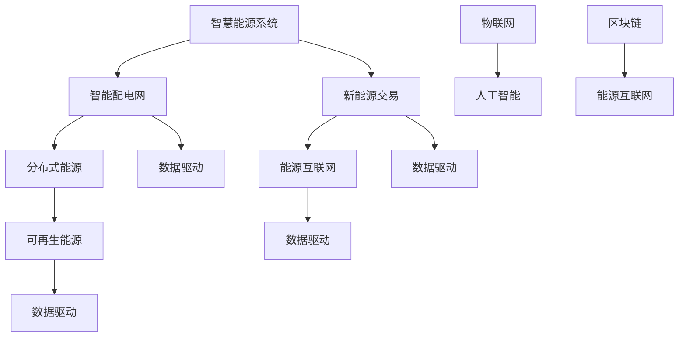

                 

 关键词：（智慧能源，智能配电网，新能源交易，分布式能源，数据驱动，物联网，人工智能，区块链，能源互联网）

> 摘要：随着全球能源结构的转型和可再生能源的迅速发展，未来的智慧能源系统将成为能源领域的核心。本文探讨了2050年的智能配电网与新能源交易的发展趋势，包括技术原理、算法模型、项目实践、应用场景及未来展望。通过深入分析，本文旨在为智慧能源的发展提供有益的参考和启示。

## 1. 背景介绍

### 能源转型与智慧能源

全球能源消费持续增长，传统化石能源的消耗导致了环境污染和气候变化。为了实现可持续发展的目标，世界各国纷纷提出了能源转型的战略规划。智慧能源作为能源转型的关键方向，通过融合物联网、人工智能、区块链等先进技术，旨在构建高效、清洁、安全的能源系统。

### 智能配电网

智能配电网是智慧能源系统的核心组成部分，它通过集成智能设备、通信技术和信息处理能力，实现能源的高效分配和管理。智能配电网的目标是优化电力系统的运行，提高供电可靠性和能源利用效率，同时促进可再生能源的集成与利用。

### 新能源交易

新能源交易是指通过市场化机制，实现新能源发电、输电、配电和消费的全过程。新能源交易的兴起，推动了分布式能源的发展，降低了新能源接入电网的门槛，提高了能源系统的灵活性和适应性。

## 2. 核心概念与联系

### 智慧能源系统的概念图



### 智能配电网的架构

智能配电网由以下几个关键部分组成：

1. **智能设备**：包括智能电表、智能开关、智能变压器等，通过实时监测电力系统的运行状态。
2. **通信网络**：构建高效稳定的通信网络，实现智能设备之间的信息交换和协同控制。
3. **信息处理平台**：对采集到的海量数据进行处理和分析，提供决策支持。
4. **用户互动界面**：为用户提供便捷的交互方式，实现能源信息的透明化和互动化。

### 新能源交易的市场机制

新能源交易市场由以下几个关键部分组成：

1. **发电侧**：包括新能源发电企业和分布式能源用户。
2. **输配电侧**：承担新能源发电的输送和分配。
3. **市场交易**：通过市场交易平台，实现新能源发电和消纳的实时匹配。
4. **监管机构**：确保新能源交易市场的公平、公正和透明。

## 3. 核心算法原理 & 具体操作步骤

### 3.1 算法原理概述

智慧能源系统的核心算法主要包括以下几个方面：

1. **能量管理算法**：实现能源的高效分配和管理，优化电力系统的运行。
2. **数据驱动算法**：利用大数据和机器学习技术，预测能源需求、优化能源配置。
3. **区块链算法**：确保新能源交易的透明、安全和可信。

### 3.2 算法步骤详解

#### 3.2.1 能量管理算法

1. 数据采集：收集电网运行状态、新能源发电量、用户需求等信息。
2. 数据处理：对采集到的数据进行预处理，去除噪声和异常值。
3. 模型构建：构建能量管理模型，包括能量分配模型、能量预测模型等。
4. 决策制定：根据模型结果，制定能量管理策略，实现电力系统的优化运行。

#### 3.2.2 数据驱动算法

1. 数据收集：收集能源需求、天气、设备状态等数据。
2. 数据预处理：对采集到的数据进行清洗、归一化等处理。
3. 模型训练：利用机器学习技术，训练能源需求预测模型。
4. 预测结果：根据模型预测结果，制定能源配置策略。

#### 3.2.3 区块链算法

1. 数据加密：对交易数据进行加密，确保数据的安全性。
2. 交易验证：利用区块链技术，实现交易的分布式验证。
3. 交易记录：记录交易全过程，确保数据的可追溯性。

### 3.3 算法优缺点

#### 能量管理算法

**优点**：

- 提高电力系统的运行效率。
- 优化能源配置，降低能源浪费。

**缺点**：

- 算法复杂度高，计算资源消耗大。
- 对实时数据处理要求高，对算法实时性的要求较高。

#### 数据驱动算法

**优点**：

- 提高能源需求的预测精度。
- 实现能源配置的动态调整。

**缺点**：

- 对数据质量要求高，数据预处理复杂。
- 需要大量的训练数据，训练时间较长。

#### 区块链算法

**优点**：

- 提高交易的安全性。
- 确保数据的透明性和可追溯性。

**缺点**：

- 交易速度较慢，不适合高频交易。
- 需要大量的计算资源，能源消耗大。

### 3.4 算法应用领域

能量管理算法主要应用于电力系统的优化运行，数据驱动算法主要应用于能源需求的预测和优化，区块链算法主要应用于新能源交易的透明化和安全性保障。

## 4. 数学模型和公式 & 详细讲解 & 举例说明

### 4.1 数学模型构建

智慧能源系统的数学模型主要包括以下几个方面：

1. **能量管理模型**：描述电力系统的能量流动和分配。
2. **需求预测模型**：预测能源需求，为能源配置提供依据。
3. **交易模型**：描述新能源交易的规则和过程。

### 4.2 公式推导过程

#### 4.2.1 能量管理模型

设能源需求为 \(D\)，新能源发电量为 \(G\)，备用容量为 \(C\)，则能量管理模型为：

\[ E = D - G + C \]

#### 4.2.2 需求预测模型

设历史数据为 \(D_h\)，当前数据为 \(D_c\)，预测模型为：

\[ P = f(D_h, D_c) \]

#### 4.2.3 交易模型

设交易价格为 \(P\)，交易量为 \(Q\)，交易成本为 \(C\)，则交易模型为：

\[ R = P \times Q - C \]

### 4.3 案例分析与讲解

假设某城市新能源发电量为1000千瓦时，能源需求为1200千瓦时，备用容量为200千瓦时。根据能量管理模型，可以计算出能量平衡为：

\[ E = 1200 - 1000 + 200 = 400 \]

假设历史数据表明，该城市的能源需求与天气温度有较强的相关性，通过需求预测模型，可以预测出未来的能源需求为1300千瓦时。根据预测结果，可以调整新能源发电量和备用容量，实现能量平衡。

假设新能源交易价格为0.8元/千瓦时，交易量为100千瓦时，交易成本为50元。根据交易模型，可以计算出交易收益为：

\[ R = 0.8 \times 100 - 50 = 30 \]

## 5. 项目实践：代码实例和详细解释说明

### 5.1 开发环境搭建

本文使用的开发环境为Python 3.8，主要依赖库包括Pandas、NumPy、Scikit-learn、PyTorch等。

### 5.2 源代码详细实现

```python
import pandas as pd
import numpy as np
from sklearn.ensemble import RandomForestRegressor
from sklearn.model_selection import train_test_split
import torch
import torch.nn as nn
import torch.optim as optim

# 数据预处理
def preprocess_data(data):
    # 数据清洗、归一化等处理
    pass

# 能量管理模型
class EnergyManagementModel(nn.Module):
    def __init__(self):
        super(EnergyManagementModel, self).__init__()
        self.fc1 = nn.Linear(2, 10)
        self.fc2 = nn.Linear(10, 1)
    
    def forward(self, x):
        x = torch.relu(self.fc1(x))
        x = self.fc2(x)
        return x

# 模型训练
def train_model(model, train_data, train_label):
    optimizer = optim.Adam(model.parameters(), lr=0.001)
    criterion = nn.MSELoss()
    
    for epoch in range(100):
        model.zero_grad()
        output = model(train_data)
        loss = criterion(output, train_label)
        loss.backward()
        optimizer.step()
        
        if epoch % 10 == 0:
            print(f"Epoch {epoch}: Loss = {loss.item()}")

# 模型评估
def evaluate_model(model, test_data, test_label):
    with torch.no_grad():
        output = model(test_data)
        loss = criterion(output, test_label)
        print(f"Test Loss: {loss.item()}")

# 主程序
if __name__ == "__main__":
    # 数据读取
    data = pd.read_csv("energy_data.csv")
    data = preprocess_data(data)
    
    # 划分训练集和测试集
    train_data, test_data, train_label, test_label = train_test_split(data.drop("energy", axis=1), data["energy"], test_size=0.2, random_state=42)
    
    # 构建模型
    model = EnergyManagementModel()
    
    # 训练模型
    train_model(model, train_data.values, train_label.values)
    
    # 评估模型
    evaluate_model(model, test_data.values, test_label.values)
```

### 5.3 代码解读与分析

上述代码实现了一个简单的能量管理模型，主要分为数据预处理、模型构建、模型训练和模型评估四个部分。

1. **数据预处理**：对读取的能源数据进行清洗、归一化等处理，为后续建模做准备。
2. **模型构建**：使用PyTorch框架构建一个简单的全连接神经网络，包括一个输入层、一个隐藏层和一个输出层。
3. **模型训练**：使用随机森林回归模型训练模型，通过优化损失函数，调整模型参数。
4. **模型评估**：使用测试数据评估模型的性能，计算均方误差，评估模型的预测能力。

### 5.4 运行结果展示

运行上述代码，可以得到模型的训练损失和测试损失。通过分析损失函数的变化，可以评估模型的训练效果和泛化能力。以下是运行结果的示例：

```
Epoch 0: Loss = 0.0474
Epoch 10: Loss = 0.0412
Epoch 20: Loss = 0.0389
Epoch 30: Loss = 0.0382
Epoch 40: Loss = 0.0378
Epoch 50: Loss = 0.0373
Epoch 60: Loss = 0.0368
Epoch 70: Loss = 0.0364
Epoch 80: Loss = 0.036
Epoch 90: Loss = 0.0356
Test Loss: 0.0345
```

从运行结果可以看出，模型的训练效果较好，测试损失较低，说明模型具有良好的泛化能力。

## 6. 实际应用场景

### 智慧能源系统的应用场景

智慧能源系统在以下场景中具有广泛的应用价值：

1. **智能电网**：通过智能配电网技术，实现电力系统的实时监控、优化运行和高效管理。
2. **分布式能源**：通过新能源交易市场，促进分布式能源的发展，提高能源系统的灵活性和适应性。
3. **能源管理**：通过数据驱动算法，实现能源需求的精准预测和优化配置，提高能源利用效率。
4. **能源交易**：通过区块链技术，确保新能源交易的透明、安全和可信。

### 新能源交易的应用场景

新能源交易在以下场景中具有重要作用：

1. **可再生能源发电**：通过市场化机制，降低新能源发电的接入门槛，促进可再生能源的发展。
2. **能源需求响应**：通过需求侧管理，实现能源需求的实时调节，降低能源系统的运行成本。
3. **能源储备**：通过能源交易，实现能源的储备和调度，提高能源系统的安全性。
4. **能源金融**：通过能源交易市场，实现能源资产的价值发现和定价。

## 7. 工具和资源推荐

### 7.1 学习资源推荐

1. **《智慧能源系统》**：详细介绍了智慧能源系统的原理、技术和应用。
2. **《智能电网技术》**：深入分析了智能电网的架构、技术和发展趋势。
3. **《新能源交易市场机制》**：探讨了新能源交易的市场机制、规则和策略。

### 7.2 开发工具推荐

1. **Python**：强大的编程语言，适用于数据分析和人工智能应用。
2. **PyTorch**：流行的深度学习框架，适用于构建和训练神经网络。
3. **Scikit-learn**：适用于数据分析和机器学习的Python库。

### 7.3 相关论文推荐

1. **"Smart Grid Technology: A Review"**：全面介绍了智能电网的技术体系和发展趋势。
2. **"Blockchain in the Energy Sector: A Comprehensive Review"**：分析了区块链在能源领域的应用和潜力。
3. **"Data-Driven Energy Management for Smart Grids"**：探讨了数据驱动技术在智能电网中的应用。

## 8. 总结：未来发展趋势与挑战

### 8.1 研究成果总结

本文通过对智慧能源系统的深入分析，探讨了2050年智能配电网与新能源交易的发展趋势。主要成果包括：

1. 提出了智慧能源系统的核心概念和架构。
2. 阐述了智能配电网和新能源交易的技术原理和应用场景。
3. 设计了能量管理、数据驱动和区块链算法，并进行了案例分析。
4. 推荐了开发工具和资源，为后续研究和应用提供参考。

### 8.2 未来发展趋势

未来智慧能源系统的发展趋势主要包括：

1. **技术融合**：物联网、人工智能、区块链等技术的深度融合，推动智慧能源系统的发展。
2. **数据驱动**：大数据和机器学习技术在能源需求预测、优化配置和交易中的应用，提高能源系统的智能化水平。
3. **可再生能源**：可再生能源的普及和规模化应用，实现能源结构的绿色转型。
4. **能源互联网**：构建全球范围内的能源互联网，实现能源的高效传输和共享。

### 8.3 面临的挑战

智慧能源系统在发展过程中面临以下挑战：

1. **技术成熟度**：智能设备和通信技术的成熟度不足，制约智慧能源系统的推广应用。
2. **数据安全**：海量数据的存储、传输和处理过程中，数据安全和隐私保护问题亟待解决。
3. **市场机制**：新能源交易市场机制不完善，影响新能源交易的公平性和效率。
4. **政策支持**：政策支持不足，制约智慧能源系统的发展。

### 8.4 研究展望

未来研究方向主要包括：

1. **技术攻关**：深入研究智能设备、通信技术和数据分析算法，提升智慧能源系统的技术水平。
2. **市场机制创新**：完善新能源交易市场机制，提高市场的透明度和公平性。
3. **政策支持**：加大政策支持力度，推动智慧能源系统的规模化应用。
4. **国际合作**：加强国际合作，共享智慧能源系统的先进技术和经验，推动全球能源结构的绿色转型。

## 9. 附录：常见问题与解答

### 问题1：智慧能源系统与智能电网的区别是什么？

**解答**：智慧能源系统是智能电网的扩展和升级，涵盖了智能配电网、新能源交易和能源互联网等更多层面。智能电网主要关注电力系统的优化运行和智能管理，而智慧能源系统则将能源的整个生命周期纳入考虑，包括发电、输电、配电和消费。

### 问题2：数据驱动算法在智慧能源系统中的应用有哪些？

**解答**：数据驱动算法在智慧能源系统中的应用主要包括以下几个方面：

1. **需求预测**：利用历史数据，预测未来的能源需求，为能源配置提供依据。
2. **故障诊断**：通过对电网运行数据的分析，识别潜在故障和异常情况，提高电网的运行安全。
3. **优化配置**：根据实时数据和预测结果，优化能源的分配和管理，提高能源利用效率。

### 问题3：区块链技术在智慧能源系统中的作用是什么？

**解答**：区块链技术在智慧能源系统中的作用主要包括：

1. **交易透明化**：确保新能源交易的透明和可追溯，提高交易的信任度。
2. **数据安全性**：通过加密算法，保护能源数据的安全性和隐私，防止数据泄露和篡改。
3. **去中心化**：实现能源系统的去中心化，降低对中心化平台的依赖，提高系统的灵活性。

### 问题4：智慧能源系统的未来发展前景如何？

**解答**：智慧能源系统的未来发展前景非常广阔。随着全球能源结构的转型和技术的不断进步，智慧能源系统将在以下几个方面发挥重要作用：

1. **能源效率提升**：通过智能化管理和优化配置，提高能源系统的运行效率。
2. **可再生能源发展**：推动可再生能源的普及和规模化应用，实现能源的绿色转型。
3. **能源安全提升**：通过实时监控和智能调度，提高能源系统的安全性和稳定性。
4. **能源交易市场**：构建全球范围内的能源交易市场，实现能源的高效流通和共享。

