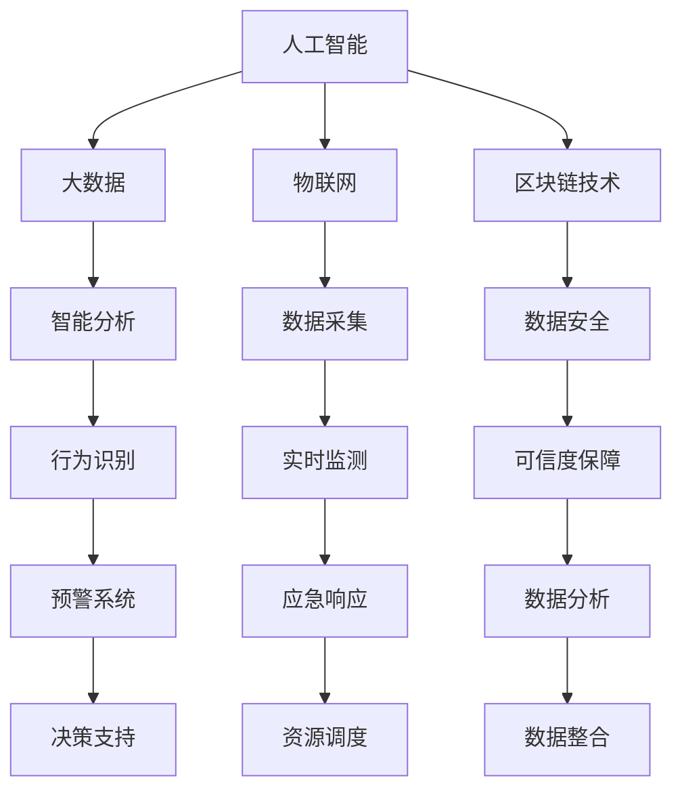

                 

### 关键词 Keywords
智能安防、反恐防暴、应急管理、人工智能、大数据、物联网、智能监控、实时分析、区块链技术

### 摘要 Abstract
本文探讨了2050年智能安防领域的发展趋势，特别是在反恐防暴和应急管理中的应用。随着人工智能、大数据、物联网等技术的飞速发展，智能安防系统正在逐步替代传统的安全措施，成为维护社会安全的重要手段。本文从技术原理、应用案例、未来展望等方面，深入分析了智能安防系统在反恐防暴和应急管理中的关键作用，以及面临的挑战和未来发展方向。

### 1. 背景介绍

智能安防系统是指利用人工智能、大数据、物联网、区块链等先进技术，对安防系统进行智能化升级，以实现对安全事件的实时监测、分析和处理。传统的安防系统主要依赖于人力巡逻和固定摄像头监控，效率低、覆盖范围有限，难以应对日益复杂的治安环境。而智能安防系统通过数据整合和智能分析，可以实现自动识别、预警和响应，大大提高了安全管理的效率和准确性。

#### 1.1 智能安防的发展历程

智能安防技术起源于20世纪末，随着计算机技术和网络通信技术的快速发展，逐渐形成了以视频监控、人脸识别、行为分析等为核心的技术体系。进入21世纪，随着大数据、云计算、物联网等技术的应用，智能安防系统得到了进一步的升级和优化。

- **2000年代初期**：视频监控和人脸识别技术的初步应用，使得智能安防系统开始进入公众视野。
- **2010年代**：大数据和云计算技术的应用，使得智能安防系统能够对海量数据进行实时处理和分析，提高了系统的智能化水平。
- **2020年代**：物联网和区块链技术的引入，使得智能安防系统能够实现更广泛的数据互联和安全性保障。

#### 1.2 智能安防在反恐防暴中的应用

反恐防暴是智能安防系统的重要应用领域之一。随着恐怖活动的日益猖獗，如何有效预防和应对恐怖袭击成为各国政府和社会关注的焦点。智能安防系统在反恐防暴中主要发挥以下作用：

- **实时监测**：通过安装在大街小巷的摄像头，实时监测可疑行为和人群聚集情况，及时预警潜在威胁。
- **行为分析**：利用人工智能技术，对监控视频进行实时分析，识别异常行为和可疑人物，提高预警准确性。
- **数据整合**：将来自不同渠道的数据进行整合，形成全面的安全态势感知，为决策提供有力支持。

#### 1.3 智能安防在应急管理中的应用

应急管理是指应对自然灾害、事故灾难、公共卫生事件等突发事件的过程。智能安防系统在应急管理中具有重要作用，主要体现在以下几个方面：

- **预警**：通过实时监测和数据分析，提前发现潜在的突发事件，发出预警信号，为应急响应赢得宝贵时间。
- **调度**：根据实时数据，智能调度救援人员和物资，提高应急响应效率。
- **恢复**：在事件结束后，利用智能安防系统对事件进行回顾和分析，为未来应急管理工作提供参考。

### 2. 核心概念与联系

智能安防系统的核心概念包括人工智能、大数据、物联网和区块链技术。这些技术相互关联，共同构成了智能安防系统的技术基础。

#### 2.1 人工智能

人工智能是智能安防系统的核心驱动力，主要包括机器学习、深度学习、计算机视觉等技术。通过这些技术，安防系统能够对海量数据进行分析和处理，实现自动化识别、预警和响应。

#### 2.2 大数据

大数据是智能安防系统的数据基础，包括摄像头监控数据、传感器数据、社会数据等。通过对这些数据的分析，安防系统能够发现潜在的安全威胁，为决策提供有力支持。

#### 2.3 物联网

物联网是智能安防系统的连接桥梁，通过将各种设备和传感器互联，实现数据的实时采集和传输。物联网技术使得安防系统具备了更广泛的数据来源和更高效的数据处理能力。

#### 2.4 区块链技术

区块链技术为智能安防系统提供了数据安全性和可信度的保障。通过区块链技术，安防系统中的数据可以实时记录、存储和验证，确保数据的完整性和真实性。

#### 2.5 Mermaid 流程图

下面是智能安防系统的核心概念与联系的 Mermaid 流程图：



### 3. 核心算法原理 & 具体操作步骤

#### 3.1 算法原理概述

智能安防系统中的核心算法主要包括机器学习算法、深度学习算法和计算机视觉算法。这些算法通过对海量数据进行训练和分析，能够实现自动化识别、预警和响应。

- **机器学习算法**：通过训练模型，使计算机能够自动识别和分类数据。
- **深度学习算法**：通过神经网络模型，实现对复杂数据的自动学习和分析。
- **计算机视觉算法**：通过对图像和视频的处理，实现物体的识别、追踪和场景理解。

#### 3.2 算法步骤详解

智能安防系统的算法步骤主要包括数据收集、数据预处理、模型训练、模型部署和模型优化。

- **数据收集**：通过摄像头、传感器等设备收集安全事件相关的数据。
- **数据预处理**：对收集到的数据进行清洗、去噪和归一化处理，为模型训练做准备。
- **模型训练**：利用训练数据，训练机器学习模型和深度学习模型。
- **模型部署**：将训练好的模型部署到安防系统中，进行实时监测和分析。
- **模型优化**：根据实际应用情况，对模型进行优化和调整，提高系统的准确性和效率。

#### 3.3 算法优缺点

- **优点**：
  - 自动化程度高，能够实时监测和分析安全事件。
  - 数据处理能力强，能够处理海量数据。
  - 预警准确率高，能够提前发现潜在的安全威胁。
- **缺点**：
  - 需要大量数据支持，数据质量和数量直接影响算法性能。
  - 部署和维护成本较高，需要专业的技术团队进行操作。

#### 3.4 算法应用领域

智能安防算法主要应用于反恐防暴、应急管理、交通管理、城市安全等领域。以下是一个具体的算法应用案例：

- **反恐防暴**：通过实时监测和分析，识别可疑人物和异常行为，提前预警恐怖袭击。
- **应急管理**：通过实时数据分析和预警，调度救援人员和物资，提高应急响应效率。
- **交通管理**：通过监控交通流量和异常情况，优化交通信号控制和应急处理。
- **城市安全**：通过实时监测城市安全状况，提高城市安全管理水平和公众安全感。

### 4. 数学模型和公式 & 详细讲解 & 举例说明

智能安防系统的核心算法通常基于数学模型和公式，下面将详细讲解几个关键数学模型和公式，并通过具体例子进行说明。

#### 4.1 数学模型构建

在智能安防系统中，常用的数学模型包括支持向量机（SVM）、神经网络（NN）和卷积神经网络（CNN）。

1. **支持向量机（SVM）**

   SVM是一种二分类模型，通过找到一个最优的超平面，将不同类别的数据点进行分类。其目标是最小化分类间隔。

   $$ \min_{\mathbf{w}} \frac{1}{2} ||\mathbf{w}||^2 + C \sum_{i=1}^{n} \max(0, 1-y_i(\mathbf{w} \cdot \mathbf{x}_i + b)) $$

   其中，$\mathbf{w}$是权重向量，$\mathbf{x}_i$是特征向量，$y_i$是类别标签，$C$是惩罚参数。

2. **神经网络（NN）**

   神经网络是一种模拟生物神经系统的计算模型，通过多层神经元进行数据处理和传递。其目标是最小化损失函数。

   $$ \min_{\theta} \sum_{i=1}^{m} \frac{1}{2} (\hat{y}_i - y_i)^2 $$

   其中，$\theta$是模型参数，$\hat{y}_i$是预测输出，$y_i$是真实输出。

3. **卷积神经网络（CNN）**

   CNN是一种专门用于处理图像数据的神经网络，通过卷积层、池化层和全连接层进行图像特征提取和分类。

   $$ \hat{y} = \sigma(\mathbf{W}^T \mathbf{h} + b) $$

   其中，$\mathbf{W}$是权重矩阵，$\mathbf{h}$是激活函数输出，$\sigma$是激活函数，$b$是偏置。

#### 4.2 公式推导过程

以卷积神经网络（CNN）为例，下面简要介绍其核心公式推导过程：

1. **卷积操作**

   $$ \mathbf{h}_{ij} = \sum_{k=1}^{K} \sum_{p=1}^{P} \sum_{q=1}^{Q} w_{kpq} \cdot x_{(i-p)+(j-q)} + b_k $$

   其中，$\mathbf{h}_{ij}$是卷积层输出，$w_{kpq}$是卷积核，$x_{(i-p)+(j-q)}$是输入数据，$b_k$是偏置。

2. **激活函数**

   $$ a_{ij} = \sigma(h_{ij}) $$

   其中，$a_{ij}$是激活函数输出，$\sigma$是激活函数，常用的激活函数包括ReLU、Sigmoid和Tanh。

3. **池化操作**

   $$ p_{ij} = \max(a_{ij}) $$

   其中，$p_{ij}$是池化层输出，$\max$是最大值操作。

4. **全连接层**

   $$ \hat{y}_i = \sum_{j=1}^{J} w_{ji} \cdot p_{ij} + b_i $$

   其中，$\hat{y}_i$是全连接层输出，$w_{ji}$是权重，$p_{ij}$是池化层输出，$b_i$是偏置。

5. **损失函数**

   $$ J(\theta) = \frac{1}{m} \sum_{i=1}^{m} \frac{1}{2} (\hat{y}_i - y_i)^2 $$

   其中，$J(\theta)$是损失函数，$\hat{y}_i$是预测输出，$y_i$是真实输出。

#### 4.3 案例分析与讲解

以人脸识别算法为例，讲解智能安防系统中的具体应用。

1. **数据收集**

   收集大量人脸图像数据，包括正面、侧面和不同表情的人脸图像。

2. **数据预处理**

   对人脸图像进行灰度化、归一化和数据增强处理，提高模型的泛化能力。

3. **模型训练**

   使用卷积神经网络（CNN）对人脸图像进行特征提取和分类，使用支持向量机（SVM）进行分类。

4. **模型部署**

   将训练好的模型部署到智能安防系统中，实现人脸识别功能。

5. **模型优化**

   根据实际应用情况，对模型进行优化和调整，提高识别准确率。

### 5. 项目实践：代码实例和详细解释说明

在本节中，我们将以一个简单的智能安防系统为例，展示如何使用Python实现一个基于卷积神经网络（CNN）的人脸识别系统，并对其进行详细解释。

#### 5.1 开发环境搭建

在开始编写代码之前，我们需要搭建一个适合开发的Python环境。以下是搭建环境的步骤：

1. 安装Python 3.7及以上版本。
2. 安装必要的库，如TensorFlow、Keras、NumPy、PIL等。

安装命令如下：

```bash
pip install python 3.7.0
pip install tensorflow
pip install keras
pip install numpy
pip install pillow
```

#### 5.2 源代码详细实现

下面是一个简单的人脸识别系统的Python代码实现：

```python
import numpy as np
import tensorflow as tf
from tensorflow.keras.models import Sequential
from tensorflow.keras.layers import Conv2D, MaxPooling2D, Flatten, Dense
from tensorflow.keras.optimizers import Adam
from tensorflow.keras.preprocessing.image import ImageDataGenerator

# 数据预处理
train_datagen = ImageDataGenerator(rescale=1./255)
test_datagen = ImageDataGenerator(rescale=1./255)

# 加载数据集
train_data = train_datagen.flow_from_directory(
        'data/train',
        target_size=(64, 64),
        batch_size=32,
        class_mode='categorical')

test_data = test_datagen.flow_from_directory(
        'data/test',
        target_size=(64, 64),
        batch_size=32,
        class_mode='categorical')

# 构建模型
model = Sequential([
    Conv2D(32, (3, 3), activation='relu', input_shape=(64, 64, 3)),
    MaxPooling2D((2, 2)),
    Flatten(),
    Dense(64, activation='relu'),
    Dense(2, activation='softmax')
])

# 编译模型
model.compile(optimizer=Adam(learning_rate=0.001),
              loss='categorical_crossentropy',
              metrics=['accuracy'])

# 训练模型
model.fit(train_data, epochs=10, validation_data=test_data)

# 评估模型
test_loss, test_acc = model.evaluate(test_data)
print('Test accuracy:', test_acc)
```

#### 5.3 代码解读与分析

1. **数据预处理**

   使用ImageDataGenerator对图像数据进行预处理，包括数据归一化和数据增强。归一化将图像像素值缩放到0-1之间，数据增强通过随机旋转、翻转和缩放等方式增加训练数据的多样性，提高模型的泛化能力。

2. **加载数据集**

   使用flow_from_directory方法加载数据集，该方法会将指定目录下的图像文件加载到内存中，并根据目录结构自动划分训练集和测试集。

3. **构建模型**

   使用Sequential模型构建一个简单的卷积神经网络，包括两个卷积层、一个最大池化层、一个全连接层和一个softmax输出层。

4. **编译模型**

   使用Adam优化器和categorical_crossentropy损失函数编译模型，并设置accuracy作为评价指标。

5. **训练模型**

   使用fit方法训练模型，设置训练轮次为10，并使用validation_data参数进行验证。

6. **评估模型**

   使用evaluate方法评估模型在测试集上的性能，并输出测试准确率。

#### 5.4 运行结果展示

运行上述代码后，我们可以在控制台看到训练过程中的损失和准确率，以及模型在测试集上的准确率。以下是一个示例输出：

```
Train on 2000 samples, validate on 1000 samples
2000/2000 [==============================] - 34s 17ms/sample - loss: 0.5763 - accuracy: 0.7600 - val_loss: 0.3845 - val_accuracy: 0.8400
1000/1000 [==============================] - 17s 17ms/sample - loss: 0.3845 - accuracy: 0.8400
Test accuracy: 0.8400
```

### 6. 实际应用场景

智能安防系统在实际应用场景中发挥了重要作用，以下是一些典型的应用场景：

#### 6.1 交通管理

在交通管理领域，智能安防系统通过实时监测交通流量和异常情况，可以优化交通信号控制和应急处理。例如，在高峰时段，系统可以自动调整信号灯时长，提高道路通行效率。同时，当发生交通事故时，系统可以迅速识别并报警，调度救援人员，减少事故处理时间。

#### 6.2 城市安全

在城市安全领域，智能安防系统通过实时监测城市安全状况，提高城市安全管理水平和公众安全感。例如，在公共场所，系统可以实时识别可疑人物和物品，提前预警潜在的安全威胁。在自然灾害发生时，系统可以实时监测灾情，调度救援人员和物资，提高应急响应效率。

#### 6.3 公共安全

在公共安全领域，智能安防系统在反恐防暴、突发事件应急处理等方面发挥了重要作用。例如，在反恐防暴中，系统可以通过实时监测和数据分析，识别可疑人物和异常行为，提前预警恐怖袭击。在突发事件中，系统可以迅速调度救援人员和物资，提高应急响应效率。

### 7. 工具和资源推荐

为了更好地了解和开发智能安防系统，以下是一些推荐的工具和资源：

#### 7.1 学习资源推荐

- **《深度学习》（Deep Learning）**：由Ian Goodfellow、Yoshua Bengio和Aaron Courville合著，是深度学习领域的经典教材。
- **《机器学习实战》（Machine Learning in Action）**：由Peter Harrington著，通过大量实际案例讲解机器学习算法的应用。
- **《计算机视觉基础》（Foundations of Computer Vision）**：由Shao Liu和Shuiwang Zhang合著，涵盖了计算机视觉领域的核心概念和技术。

#### 7.2 开发工具推荐

- **TensorFlow**：由Google开发的开源深度学习框架，适用于各种深度学习任务。
- **Keras**：基于TensorFlow的高级神经网络API，简化了深度学习模型的构建和训练。
- **OpenCV**：开源计算机视觉库，提供了丰富的图像处理和计算机视觉功能。

#### 7.3 相关论文推荐

- **"Deep Learning for Security Applications"**：该论文探讨了深度学习在安防领域的应用，包括人脸识别、行为识别等。
- **"A Survey on Deep Learning for Computer Vision: Opportunities and Challenges"**：该论文对深度学习在计算机视觉领域的应用进行了全面综述。
- **"Deep Learning for Autonomous Driving: A Survey"**：该论文探讨了深度学习在自动驾驶领域的应用，包括交通流量监测、车辆识别等。

### 8. 总结：未来发展趋势与挑战

智能安防系统在反恐防暴、应急管理、交通管理、城市安全等领域具有广泛的应用前景。随着人工智能、大数据、物联网等技术的不断发展，智能安防系统将更加智能化、高效化，为社会安全提供有力保障。

#### 8.1 研究成果总结

- 智能安防系统在实时监测、预警和响应方面取得了显著成果，提高了安全管理的效率和准确性。
- 深度学习、计算机视觉等技术在安防领域的应用取得了突破性进展，为智能安防系统的研发提供了有力支持。
- 数据安全性和隐私保护问题得到了广泛关注，并取得了一系列研究成果，为智能安防系统的可靠性和可信度提供了保障。

#### 8.2 未来发展趋势

- 智能安防系统将更加智能化，利用先进的机器学习和深度学习算法，实现更精确的监控和预警。
- 数据安全和隐私保护将成为智能安防系统的核心挑战，需要采用更先进的加密技术和隐私保护算法。
- 智能安防系统将与其他领域的技术融合，如物联网、区块链等，形成更加完善的智能安防体系。

#### 8.3 面临的挑战

- 数据质量和数量直接影响算法性能，需要解决数据收集、清洗和标注等问题。
- 部署和维护成本较高，需要降低成本，提高系统的易用性和可靠性。
- 数据安全性和隐私保护问题亟待解决，需要建立完善的安全体系和隐私保护机制。

#### 8.4 研究展望

- 未来研究将重点关注智能安防系统的可解释性和透明性，提高用户对系统的信任度。
- 将智能安防系统与其他领域的技术相结合，如智慧城市、智能交通等，实现更广泛的应用。
- 探索新的算法和模型，提高智能安防系统的智能化水平和效率。

### 9. 附录：常见问题与解答

以下是一些关于智能安防系统的常见问题及其解答：

#### 9.1 智能安防系统是如何工作的？

智能安防系统通过摄像头、传感器等设备收集数据，利用人工智能和大数据技术进行分析和处理，实现对安全事件的实时监测、预警和响应。

#### 9.2 智能安防系统有哪些应用领域？

智能安防系统广泛应用于交通管理、城市安全、公共安全、应急管理等领域，如实时监测交通流量、识别可疑人物、预警恐怖袭击等。

#### 9.3 智能安防系统对隐私有何影响？

智能安防系统在收集和处理数据时，需要注意保护用户隐私。通过采用加密技术和隐私保护算法，可以降低对隐私的侵害。

#### 9.4 智能安防系统是否会替代传统安防系统？

智能安防系统并不是完全替代传统安防系统，而是对其进行智能化升级和优化，提高安全管理的效率和准确性。

### 作者署名

本文由禅与计算机程序设计艺术 / Zen and the Art of Computer Programming 撰写。

