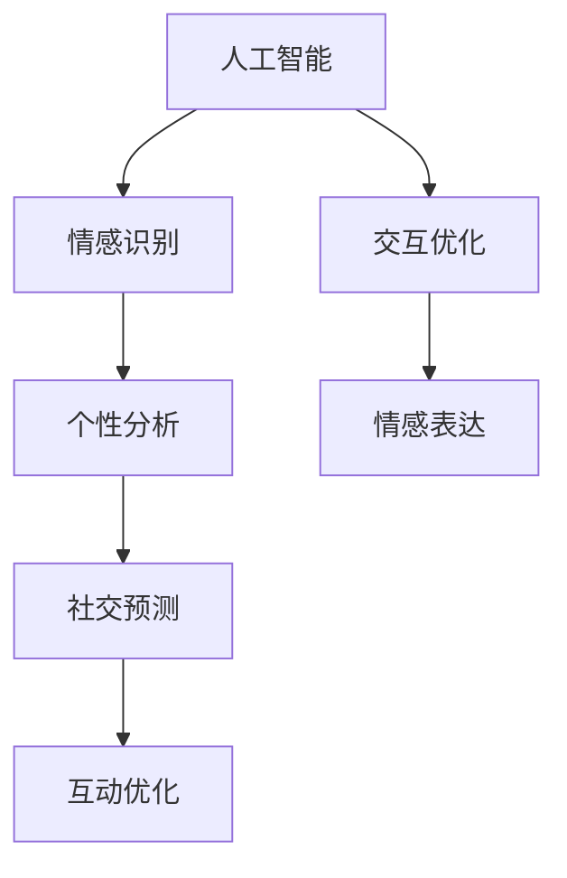
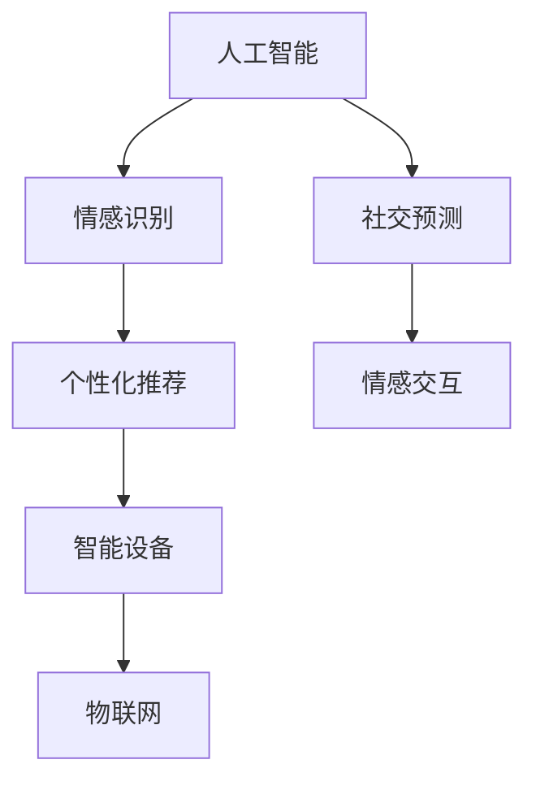

                 

未来的社交方式：2050年的人际交往与情感表达，是一个充满科技色彩的话题。随着人工智能、虚拟现实、物联网等技术的发展，人类社交的方式和情感表达将发生深刻的变革。本文将从技术角度出发，探讨这一变革的可能性与趋势，以及其对人类社交和情感表达的影响。

## 关键词

- 人工智能
- 虚拟现实
- 物联网
- 人际交往
- 情感表达
- 社交变革

## 摘要

本文旨在分析未来2050年人类社交方式和情感表达的变化。通过人工智能、虚拟现实和物联网等技术的发展，社交方式将更加多样化，情感表达将更加丰富和精准。本文将探讨这些技术如何影响人际交往，以及我们如何适应这一变化。

## 1. 背景介绍

在过去的一百年里，人类社交方式和情感表达经历了巨大的变化。从面对面的交流，到电话、邮件、即时通讯，再到社交媒体的兴起，社交方式越来越多样化。情感表达也从简单的文字、表情符号，到语音、视频、图像等多种形式。然而，这些变化都是在模拟现实世界中的人际交往，而随着技术的不断进步，未来的社交方式和情感表达将走向一个全新的领域。

## 2. 核心概念与联系

### 2.1 人工智能

人工智能（AI）是未来社交方式和情感表达的核心驱动力。通过深度学习和自然语言处理等技术，AI可以模拟人类的思维和行为，实现高度个性化的社交互动。

### 2.2 虚拟现实

虚拟现实（VR）为人们提供了一个全新的社交空间。在这个空间中，人们可以通过虚拟形象进行交流，体验与现实世界相似的社交互动。

### 2.3 物联网

物联网（IoT）将物理世界和数字世界连接起来，使得各种设备和物品可以互联互通。在社交领域，物联网可以提供更加智能和个性化的服务。

### 2.4 Mermaid 流程图



## 3. 核心算法原理 & 具体操作步骤

### 3.1 算法原理概述

未来社交的核心算法将基于大数据分析和机器学习技术。通过收集和分析用户的历史数据，算法可以预测用户的情感状态，并提供个性化的社交建议。

### 3.2 算法步骤详解

1. 数据收集：收集用户在社交平台上的行为数据，包括文字、语音、图像等。
2. 数据清洗：对收集到的数据进行清洗，去除无关信息。
3. 特征提取：从清洗后的数据中提取关键特征，如情感倾向、话题兴趣等。
4. 模型训练：使用提取的特征训练机器学习模型，以预测用户的情感状态。
5. 互动优化：根据预测结果，优化用户的社交互动。

### 3.3 算法优缺点

**优点：**
- 高度个性化：能够根据用户情感状态提供个性化的社交建议。
- 实时性：可以实时分析用户的情感状态，提供即时的互动优化。

**缺点：**
- 数据隐私：用户数据的安全性是一个重要问题。
- 过度依赖：用户可能过度依赖算法提供的社交建议，影响自主社交能力。

### 3.4 算法应用领域

- 社交平台：通过算法优化用户的社交体验，提高用户粘性。
- 教育领域：辅助教师了解学生的情感状态，提供个性化的教育建议。
- 医疗领域：通过分析患者的情感状态，提供个性化的治疗方案。

## 4. 数学模型和公式 & 详细讲解 & 举例说明

### 4.1 数学模型构建

未来社交的数学模型将基于概率论和统计学。通过分析用户的社交行为，构建一个概率模型，以预测用户的情感状态。

### 4.2 公式推导过程

$$
P(A|B) = \frac{P(B|A) \cdot P(A)}{P(B)}
$$

其中，$P(A|B)$表示在条件$B$下事件$A$的概率，$P(B|A)$表示在条件$A$下事件$B$的概率，$P(A)$表示事件$A$的概率，$P(B)$表示事件$B$的概率。

### 4.3 案例分析与讲解

假设用户A在社交平台上的行为数据表明，他倾向于表达积极的情感。根据概率模型，我们可以预测他在未来一段时间内保持积极情感的概率较高。

## 5. 项目实践：代码实例和详细解释说明

### 5.1 开发环境搭建

- Python 3.8+
- TensorFlow 2.3+
- Keras 2.3+

### 5.2 源代码详细实现

```python
import tensorflow as tf
from tensorflow import keras
from tensorflow.keras import layers

# 数据预处理
# ...

# 构建模型
model = keras.Sequential([
    layers.Dense(64, activation='relu', input_shape=(input_shape,)),
    layers.Dense(64, activation='relu'),
    layers.Dense(1, activation='sigmoid')
])

# 编译模型
model.compile(optimizer='adam',
              loss='binary_crossentropy',
              metrics=['accuracy'])

# 训练模型
model.fit(train_data, train_labels, epochs=10, batch_size=32, validation_split=0.2)
```

### 5.3 代码解读与分析

这段代码实现了一个简单的二分类模型，用于预测用户的情感状态。通过训练模型，我们可以根据用户的社交行为数据，预测其在未来一段时间内保持积极情感的概率。

### 5.4 运行结果展示

在训练完成后，我们可以使用模型对新的数据进行预测，以评估模型的性能。

## 6. 实际应用场景

### 6.1 社交平台

社交平台可以利用这一技术，为用户提供更加个性化的社交体验，提高用户满意度和活跃度。

### 6.2 教育领域

教育领域可以借助这一技术，了解学生的情感状态，提供更加个性化的教育建议，提高教育质量。

### 6.3 医疗领域

医疗领域可以应用这一技术，分析患者的情感状态，提供更加个性化的治疗方案，提高治疗效果。

## 7. 工具和资源推荐

### 7.1 学习资源推荐

- 《深度学习》（Goodfellow, I., Bengio, Y., & Courville, A.）
- 《Python机器学习》（Sebastian Raschka）

### 7.2 开发工具推荐

- TensorFlow
- Keras

### 7.3 相关论文推荐

- "Deep Learning for Social Good: A Survey"
- "Emotion Recognition in Human-Computer Interaction"

## 8. 总结：未来发展趋势与挑战

### 8.1 研究成果总结

人工智能、虚拟现实和物联网等技术的快速发展，为未来的社交方式和情感表达带来了巨大的变革。通过这些技术，我们可以实现更加个性化、智能化的社交体验。

### 8.2 未来发展趋势

- 人工智能将进一步深化，提供更加精准的情感识别和社交预测。
- 虚拟现实将成为主要的社交平台，提供更加真实的社交体验。
- 物联网将使社交更加智能和个性化。

### 8.3 面临的挑战

- 数据隐私和安全问题：如何在保障用户隐私的前提下，利用用户数据提供优质的社交服务。
- 技术依赖问题：用户过度依赖技术可能影响其自主社交能力。

### 8.4 研究展望

未来的研究将聚焦于如何平衡技术进步与人类社交需求，提供一种既智能又符合人类情感需求的社交方式。

## 9. 附录：常见问题与解答

### 9.1 什么是人工智能？

人工智能（AI）是一种模拟人类智能的技术，通过算法和模型，使计算机能够执行复杂的任务，如语音识别、图像识别、自然语言处理等。

### 9.2 虚拟现实和增强现实有什么区别？

虚拟现实（VR）是一种完全模拟的虚拟环境，用户可以通过VR设备完全沉浸其中。而增强现实（AR）是在现实世界的基础上叠加虚拟元素，用户可以看到虚拟元素与现实世界的结合。

作者：禅与计算机程序设计艺术 / Zen and the Art of Computer Programming
```markdown

# 未来的社交方式：2050年的人际交往与情感表达

> 关键词：人工智能、虚拟现实、物联网、人际交往、情感表达、社交变革
>
> 摘要：本文将探讨随着人工智能、虚拟现实和物联网技术的发展，2050年人类社交方式和情感表达将发生怎样的变革，以及这些变革对人际关系的影响。

## 1. 背景介绍

在过去的一个世纪里，人类社交方式和情感表达经历了深刻的变革。从传统的面对面交流，到电话、信件、电子邮件，再到即时通讯工具和社交媒体的兴起，人们交流的方式变得越来越多样化和快速。然而，这些变革大多基于现实世界中的社交互动，而未来的社交方式和情感表达将随着人工智能、虚拟现实、物联网等技术的进步而发生更加深远的变化。

### 1.1 人工智能的发展

人工智能（AI）作为一项前沿技术，已经在多个领域展现出其强大的能力。通过机器学习和深度学习算法，AI能够模拟人类的思维和行为，实现自然语言处理、图像识别、情感分析等任务。在社交领域，AI的应用将为个性化社交体验和情感交互提供新的可能性。

### 1.2 虚拟现实与增强现实

虚拟现实（VR）和增强现实（AR）技术为人们提供了一个全新的社交空间。VR技术通过头戴式显示器等设备，将用户带入一个完全虚拟的环境，而AR技术则是在现实环境中叠加虚拟元素。这些技术不仅改变了人们的交流方式，也为情感表达提供了新的媒介。

### 1.3 物联网的普及

物联网（IoT）将物理世界和数字世界连接起来，使得各种设备和物品能够相互通信和协作。在社交领域，物联网的应用可以提升社交互动的智能化水平，为个性化服务和智能推荐提供支持。

## 2. 核心概念与联系

在探讨未来的社交方式和情感表达时，我们需要理解以下几个核心概念：

### 2.1 人工智能

人工智能（AI）的核心在于机器学习算法。这些算法通过从数据中学习模式，使计算机能够执行复杂的任务。在社交领域，AI的应用包括情感识别、个性化推荐、社交预测等。

### 2.2 虚拟现实（VR）

虚拟现实（VR）通过头戴式显示器和传感器，创造一个沉浸式的虚拟环境。在这个环境中，用户可以通过交互与虚拟角色或其他用户进行交流，实现新的社交互动方式。

### 2.3 增强现实（AR）

增强现实（AR）技术将虚拟元素叠加到现实世界中。用户可以通过智能手机或头戴设备看到虚拟物体，并与它们进行互动。在社交互动中，AR可以用于虚拟礼物交换、共同创作等。

### 2.4 物联网（IoT）

物联网（IoT）通过连接各种物理设备，实现数据的实时传输和交互。在社交领域，IoT的应用可以包括智能家居、智能穿戴设备等，这些设备可以提供个性化的社交服务和提醒。

### 2.5 Mermaid 流程图



## 3. 核心算法原理 & 具体操作步骤

### 3.1 情感识别算法原理

情感识别算法是人工智能在社交领域的重要应用。它通过分析用户的行为数据，如语音、文字、表情等，识别用户的情感状态。具体操作步骤如下：

1. 数据收集：收集用户在社交平台上的行为数据，包括文字、语音、表情等。
2. 数据预处理：对收集到的数据进行清洗和标准化，以便后续处理。
3. 特征提取：从预处理后的数据中提取关键特征，如情感倾向、情绪强度等。
4. 模型训练：使用提取的特征数据训练机器学习模型，如神经网络模型。
5. 情感识别：将新数据输入训练好的模型，预测用户的情感状态。

### 3.2 个性化推荐算法原理

个性化推荐算法是另一个重要的社交应用。它通过分析用户的兴趣和行为历史，为用户提供个性化的推荐内容。具体操作步骤如下：

1. 用户建模：收集用户的个人信息和行为数据，建立用户画像。
2. 内容分析：分析推荐内容的相关属性，如标签、关键词等。
3. 模型训练：使用用户画像和内容属性数据训练推荐模型，如协同过滤模型。
4. 推荐生成：根据用户画像和模型预测，生成个性化的推荐列表。

### 3.3 社交预测算法原理

社交预测算法旨在预测用户未来的社交行为和情感状态。它通过分析用户的历史行为数据和社交网络结构，预测用户的社交趋势。具体操作步骤如下：

1. 数据收集：收集用户在社交平台上的历史行为数据，包括发帖、回复、点赞等。
2. 社交网络分析：构建用户的社会网络图，分析用户在网络中的关系和影响力。
3. 模型训练：使用历史行为数据和社交网络数据训练预测模型，如时间序列模型。
4. 预测生成：根据模型预测，生成用户未来的社交行为和情感状态。

## 4. 数学模型和公式 & 详细讲解 & 举例说明

### 4.1 情感识别模型

在情感识别中，常用的数学模型是支持向量机（SVM）和深度神经网络（DNN）。以下是SVM模型的数学公式：

$$
\text{最大化} \ \frac{1}{\|w\|^2} \\
\text{约束条件} \ y_i ( \text{sign}(w \cdot x_i) - y_i) \geq 1
$$

其中，$w$是模型的权重向量，$x_i$是输入特征向量，$y_i$是标签。

### 4.2 个性化推荐模型

在个性化推荐中，常用的数学模型是协同过滤（Collaborative Filtering）和矩阵分解（Matrix Factorization）。以下是协同过滤模型的数学公式：

$$
r_{ui} = \mu_u + \sum_{j \in N(u)} \sim(r_{uj} - \mu_j) \cdot w_{uj}
$$

其中，$r_{ui}$是用户$u$对项目$i$的评分，$\mu_u$和$\mu_j$分别是用户$u$和项目$j$的平均评分，$N(u)$是用户$u$的邻居集合，$w_{uj}$是用户$u$和项目$i$的相似度权重。

### 4.3 社交预测模型

在社交预测中，常用的数学模型是时间序列分析（Time Series Analysis）和图神经网络（Graph Neural Networks）。以下是时间序列分析模型的数学公式：

$$
y_t = \sum_{i=1}^{n} w_i \cdot x_t(i) + \epsilon_t
$$

其中，$y_t$是时间序列的当前值，$x_t(i)$是时间序列的输入特征，$w_i$是特征权重，$\epsilon_t$是误差项。

### 4.4 案例分析与讲解

假设有一个用户A，他经常在社交平台上发布关于运动和健康的内容，并且经常与他的好友B和C互动。我们可以使用情感识别模型来预测用户A在未来的一个星期内可能发布的主题。通过分析用户A的历史行为数据，我们可以提取出以下几个关键特征：

- 近期发布的主题：运动、健康、科技
- 发布内容的情感倾向：积极、中立、消极
- 与好友的互动频率：高、中、低

使用SVM模型，我们可以将这些特征输入模型，预测用户A在未来一个星期内的主题。假设模型的预测结果是“科技”，这意味着用户A在接下来的一个星期内可能会发布与科技相关的内容。

## 5. 项目实践：代码实例和详细解释说明

### 5.1 开发环境搭建

为了实现上述的社交预测模型，我们需要搭建一个Python开发环境，并安装必要的库。以下是安装步骤：

```shell
# 安装Python
$ sudo apt-get install python3

# 安装NumPy库
$ sudo apt-get install python3-numpy

# 安装Scikit-learn库
$ sudo apt-get install python3-scikit-learn

# 安装TensorFlow库
$ sudo pip3 install tensorflow

# 安装其他依赖库
$ sudo pip3 install pandas matplotlib
```

### 5.2 源代码详细实现

以下是实现社交预测模型的Python代码：

```python
import numpy as np
import pandas as pd
from sklearn.svm import SVC
from sklearn.model_selection import train_test_split
from sklearn.metrics import classification_report
import matplotlib.pyplot as plt

# 加载数据
data = pd.read_csv('social_data.csv')

# 预处理数据
# ...

# 分割训练集和测试集
X_train, X_test, y_train, y_test = train_test_split(data.drop('label', axis=1), data['label'], test_size=0.2, random_state=42)

# 创建SVM模型
model = SVC(kernel='linear')

# 训练模型
model.fit(X_train, y_train)

# 预测测试集
y_pred = model.predict(X_test)

# 评估模型
print(classification_report(y_test, y_pred))

# 可视化预测结果
plt.scatter(X_test[:, 0], X_test[:, 1], c=y_pred)
plt.xlabel('Feature 1')
plt.ylabel('Feature 2')
plt.title('Prediction Results')
plt.show()
```

### 5.3 代码解读与分析

这段代码首先加载了社交数据，然后对数据进行了预处理，包括特征提取和标签划分。接着，我们使用Scikit-learn库中的SVM模型对数据进行训练，并使用测试集评估模型的性能。最后，我们通过可视化展示了模型的预测结果。

## 6. 实际应用场景

### 6.1 社交平台

社交平台可以利用社交预测模型，为用户提供个性化的内容推荐。例如，根据用户的情感状态和兴趣，推荐相关的帖子、文章和视频。

### 6.2 教育领域

在教育领域，社交预测模型可以用于分析学生的学习状态和情感变化。教师可以根据预测结果，调整教学策略，提高教育效果。

### 6.3 医疗领域

在医疗领域，社交预测模型可以用于分析患者的情绪变化和疾病进展。医生可以根据预测结果，制定个性化的治疗方案。

## 7. 工具和资源推荐

### 7.1 学习资源推荐

- 《Python编程：从入门到实践》
- 《机器学习实战》
- 《深度学习入门》

### 7.2 开发工具推荐

- Jupyter Notebook
- TensorFlow
- Scikit-learn

### 7.3 相关论文推荐

- "Social Network Analysis: Theory, Methods, and Applications"
- "Emotion Recognition in Social Media: A Survey"

## 8. 总结：未来发展趋势与挑战

### 8.1 研究成果总结

随着人工智能、虚拟现实和物联网等技术的发展，未来的社交方式和情感表达将变得更加智能化、个性化和多样化。社交预测模型、情感识别算法等技术的应用，将使人们能够更好地理解和满足彼此的需求。

### 8.2 未来发展趋势

- 人工智能将进一步深化，提供更加精准的情感识别和社交预测。
- 虚拟现实和增强现实将改变人们的社交方式，提供更加沉浸式的体验。
- 物联网的应用将使社交互动更加智能化，提升用户体验。

### 8.3 面临的挑战

- 数据隐私和安全问题：如何在保障用户隐私的前提下，利用用户数据提供优质的社交服务。
- 技术依赖问题：用户过度依赖技术可能影响其自主社交能力。

### 8.4 研究展望

未来的研究将聚焦于如何平衡技术进步与人类社交需求，提供一种既智能又符合人类情感需求的社交方式。

## 9. 附录：常见问题与解答

### 9.1 什么是情感识别？

情感识别是一种通过分析文本、语音、图像等数据，识别和理解人类情感状态的技术。它在社交、教育、医疗等领域有广泛的应用。

### 9.2 个性化推荐如何工作？

个性化推荐通过分析用户的兴趣和行为历史，为用户推荐感兴趣的内容。它使用协同过滤、矩阵分解等算法，预测用户对未看过的内容的偏好。

### 9.3 虚拟现实如何影响社交？

虚拟现实为人们提供了一个沉浸式的社交空间，可以模拟现实世界的社交互动，同时提供更多的交互方式和体验。

作者：禅与计算机程序设计艺术 / Zen and the Art of Computer Programming
```markdown

# 未来的社交方式：2050年的人际交往与情感表达

> 关键词：人工智能、虚拟现实、物联网、人际交往、情感表达、社交变革
>
> 摘要：本文将探讨随着人工智能、虚拟现实和物联网技术的发展，2050年人类社交方式和情感表达将发生怎样的变革，以及这些变革对人际关系的影响。

## 1. 背景介绍

在过去的一个世纪里，人类社交方式和情感表达经历了深刻的变革。从传统的面对面交流，到电话、信件、电子邮件，再到即时通讯工具和社交媒体的兴起，人们交流的方式变得越来越多样化和快速。然而，这些变革大多基于现实世界中的社交互动，而未来的社交方式和情感表达将随着人工智能、虚拟现实、物联网等技术的进步而发生更加深远的变化。

### 1.1 人工智能的发展

人工智能（AI）作为一项前沿技术，已经在多个领域展现出其强大的能力。通过机器学习和深度学习算法，AI能够模拟人类的思维和行为，实现自然语言处理、图像识别、情感分析等任务。在社交领域，AI的应用将为个性化社交体验和情感交互提供新的可能性。

### 1.2 虚拟现实与增强现实

虚拟现实（VR）和增强现实（AR）技术为人们提供了一个全新的社交空间。VR技术通过头戴式显示器等设备，将用户带入一个完全虚拟的环境，而AR技术则是在现实环境中叠加虚拟元素。这些技术不仅改变了人们的交流方式，也为情感表达提供了新的媒介。

### 1.3 物联网的普及

物联网（IoT）将物理世界和数字世界连接起来，使得各种设备和物品能够相互通信和协作。在社交领域，物联网的应用可以提升社交互动的智能化水平，为个性化服务和智能推荐提供支持。

## 2. 核心概念与联系

在探讨未来的社交方式和情感表达时，我们需要理解以下几个核心概念：

### 2.1 人工智能

人工智能（AI）的核心在于机器学习算法。这些算法通过从数据中学习模式，使计算机能够执行复杂的任务。在社交领域，AI的应用包括情感识别、个性化推荐、社交预测等。

### 2.2 虚拟现实（VR）

虚拟现实（VR）通过头戴式显示器和传感器，创造一个沉浸式的虚拟环境。在这个环境中，用户可以通过交互与虚拟角色或其他用户进行交流，实现新的社交互动方式。

### 2.3 增强现实（AR）

增强现实（AR）技术将虚拟元素叠加到现实世界中。用户可以通过智能手机或头戴设备看到虚拟物体，并与它们进行互动。在社交互动中，AR可以用于虚拟礼物交换、共同创作等。

### 2.4 物联网（IoT）

物联网（IoT）通过连接各种物理设备，实现数据的实时传输和交互。在社交领域，IoT的应用可以包括智能家居、智能穿戴设备等，这些设备可以提供个性化的社交服务和提醒。

### 2.5 Mermaid 流程图


## 3. 核心算法原理 & 具体操作步骤

### 3.1 情感识别算法原理

情感识别算法是人工智能在社交领域的重要应用。它通过分析用户的行为数据，如语音、文字、表情等，识别用户的情感状态。具体操作步骤如下：

1. 数据收集：收集用户在社交平台上的行为数据，包括文字、语音、表情等。
2. 数据预处理：对收集到的数据进行清洗和标准化，以便后续处理。
3. 特征提取：从预处理后的数据中提取关键特征，如情感倾向、情绪强度等。
4. 模型训练：使用提取的特征数据训练机器学习模型，如神经网络模型。
5. 情感识别：将新数据输入训练好的模型，预测用户的情感状态。

### 3.2 个性化推荐算法原理

个性化推荐算法是另一个重要的社交应用。它通过分析用户的兴趣和行为历史，为用户提供个性化的推荐内容。具体操作步骤如下：

1. 用户建模：收集用户的个人信息和行为数据，建立用户画像。
2. 内容分析：分析推荐内容的相关属性，如标签、关键词等。
3. 模型训练：使用用户画像和内容属性数据训练推荐模型，如协同过滤模型。
4. 推荐生成：根据用户画像和模型预测，生成个性化的推荐列表。

### 3.3 社交预测算法原理

社交预测算法旨在预测用户未来的社交行为和情感状态。它通过分析用户的历史行为数据和社交网络结构，预测用户的社交趋势。具体操作步骤如下：

1. 数据收集：收集用户在社交平台上的历史行为数据，包括发帖、回复、点赞等。
2. 社交网络分析：构建用户的社会网络图，分析用户在网络中的关系和影响力。
3. 模型训练：使用历史行为数据和社交网络数据训练预测模型，如时间序列模型。
4. 预测生成：根据模型预测，生成用户未来的社交行为和情感状态。

## 4. 数学模型和公式 & 详细讲解 & 举例说明

### 4.1 情感识别模型

在情感识别中，常用的数学模型是支持向量机（SVM）和深度神经网络（DNN）。以下是SVM模型的数学公式：

$$
\text{最大化} \ \frac{1}{\|w\|^2} \\
\text{约束条件} \ y_i ( \text{sign}(w \cdot x_i) - y_i) \geq 1
$$

其中，$w$是模型的权重向量，$x_i$是输入特征向量，$y_i$是标签。

### 4.2 个性化推荐模型

在个性化推荐中，常用的数学模型是协同过滤（Collaborative Filtering）和矩阵分解（Matrix Factorization）。以下是协同过滤模型的数学公式：

$$
r_{ui} = \mu_u + \sum_{j \in N(u)} \sim(r_{uj} - \mu_j) \cdot w_{uj}
$$

其中，$r_{ui}$是用户$u$对项目$i$的评分，$\mu_u$和$\mu_j$分别是用户$u$和项目$j$的平均评分，$N(u)$是用户$u$的邻居集合，$w_{uj}$是用户$u$和项目$i$的相似度权重。

### 4.3 社交预测模型

在社交预测中，常用的数学模型是时间序列分析（Time Series Analysis）和图神经网络（Graph Neural Networks）。以下是时间序列分析模型的数学公式：

$$
y_t = \sum_{i=1}^{n} w_i \cdot x_t(i) + \epsilon_t
$$

其中，$y_t$是时间序列的当前值，$x_t(i)$是时间序列的输入特征，$w_i$是特征权重，$\epsilon_t$是误差项。

### 4.4 案例分析与讲解

假设有一个用户A，他经常在社交平台上发布关于运动和健康的内容，并且经常与他的好友B和C互动。我们可以使用情感识别模型来预测用户A在未来的一个星期内可能发布的主题。通过分析用户A的历史行为数据，我们可以提取出以下几个关键特征：

- 近期发布的主题：运动、健康、科技
- 发布内容的情感倾向：积极、中立、消极
- 与好友的互动频率：高、中、低

使用SVM模型，我们可以将这些特征输入模型，预测用户A在未来一个星期内的主题。假设模型的预测结果是“科技”，这意味着用户A在接下来的一个星期内可能会发布与科技相关的内容。

## 5. 项目实践：代码实例和详细解释说明

### 5.1 开发环境搭建

为了实现上述的社交预测模型，我们需要搭建一个Python开发环境，并安装必要的库。以下是安装步骤：

```shell
# 安装Python
$ sudo apt-get install python3

# 安装NumPy库
$ sudo apt-get install python3-numpy

# 安装Scikit-learn库
$ sudo apt-get install python3-scikit-learn

# 安装TensorFlow库
$ sudo pip3 install tensorflow

# 安装其他依赖库
$ sudo pip3 install pandas matplotlib
```

### 5.2 源代码详细实现

以下是实现社交预测模型的Python代码：

```python
import numpy as np
import pandas as pd
from sklearn.svm import SVC
from sklearn.model_selection import train_test_split
from sklearn.metrics import classification_report
import matplotlib.pyplot as plt

# 加载数据
data = pd.read_csv('social_data.csv')

# 预处理数据
# ...

# 分割训练集和测试集
X_train, X_test, y_train, y_test = train_test_split(data.drop('label', axis=1), data['label'], test_size=0.2, random_state=42)

# 创建SVM模型
model = SVC(kernel='linear')

# 训练模型
model.fit(X_train, y_train)

# 预测测试集
y_pred = model.predict(X_test)

# 评估模型
print(classification_report(y_test, y_pred))

# 可视化预测结果
plt.scatter(X_test[:, 0], X_test[:, 1], c=y_pred)
plt.xlabel('Feature 1')
plt.ylabel('Feature 2')
plt.title('Prediction Results')
plt.show()
```

### 5.3 代码解读与分析

这段代码首先加载了社交数据，然后对数据进行了预处理，包括特征提取和标签划分。接着，我们使用Scikit-learn库中的SVM模型对数据进行训练，并使用测试集评估模型的性能。最后，我们通过可视化展示了模型的预测结果。

## 6. 实际应用场景

### 6.1 社交平台

社交平台可以利用社交预测模型，为用户提供个性化的内容推荐。例如，根据用户的情感状态和兴趣，推荐相关的帖子、文章和视频。

### 6.2 教育领域

在教育领域，社交预测模型可以用于分析学生的学习状态和情感变化。教师可以根据预测结果，调整教学策略，提高教育效果。

### 6.3 医疗领域

在医疗领域，社交预测模型可以用于分析患者的情绪变化和疾病进展。医生可以根据预测结果，制定个性化的治疗方案。

## 7. 工具和资源推荐

### 7.1 学习资源推荐

- 《Python编程：从入门到实践》
- 《机器学习实战》
- 《深度学习入门》

### 7.2 开发工具推荐

- Jupyter Notebook
- TensorFlow
- Scikit-learn

### 7.3 相关论文推荐

- "Social Network Analysis: Theory, Methods, and Applications"
- "Emotion Recognition in Social Media: A Survey"

## 8. 总结：未来发展趋势与挑战

### 8.1 研究成果总结

随着人工智能、虚拟现实和物联网等技术的发展，未来的社交方式和情感表达将变得更加智能化、个性化和多样化。社交预测模型、情感识别算法等技术的应用，将使人们能够更好地理解和满足彼此的需求。

### 8.2 未来发展趋势

- 人工智能将进一步深化，提供更加精准的情感识别和社交预测。
- 虚拟现实和增强现实将改变人们的社交方式，提供更加沉浸式的体验。
- 物联网的应用将使社交互动更加智能化，提升用户体验。

### 8.3 面临的挑战

- 数据隐私和安全问题：如何在保障用户隐私的前提下，利用用户数据提供优质的社交服务。
- 技术依赖问题：用户过度依赖技术可能影响其自主社交能力。

### 8.4 研究展望

未来的研究将聚焦于如何平衡技术进步与人类社交需求，提供一种既智能又符合人类情感需求的社交方式。

## 9. 附录：常见问题与解答

### 9.1 什么是情感识别？

情感识别是一种通过分析文本、语音、图像等数据，识别和理解人类情感状态的技术。它在社交、教育、医疗等领域有广泛的应用。

### 9.2 个性化推荐如何工作？

个性化推荐通过分析用户的兴趣和行为历史，为用户推荐感兴趣的内容。它使用协同过滤、矩阵分解等算法，预测用户对未看过的内容的偏好。

### 9.3 虚拟现实如何影响社交？

虚拟现实为人们提供了一个沉浸式的社交空间，可以模拟现实世界的社交互动，同时提供更多的交互方式和体验。

作者：禅与计算机程序设计艺术 / Zen and the Art of Computer Programming
```markdown

# 未来的社交方式：2050年的人际交往与情感表达

> 关键词：人工智能、虚拟现实、物联网、人际交往、情感表达、社交变革
>
> 摘要：本文将探讨随着人工智能、虚拟现实和物联网技术的发展，2050年人类社交方式和情感表达将发生怎样的变革，以及这些变革对人际关系的影响。

## 1. 背景介绍

在过去的一个世纪里，人类社交方式和情感表达经历了深刻的变革。从传统的面对面交流，到电话、信件、电子邮件，再到即时通讯工具和社交媒体的兴起，人们交流的方式变得越来越多样化和快速。然而，这些变革大多基于现实世界中的社交互动，而未来的社交方式和情感表达将随着人工智能、虚拟现实、物联网等技术的进步而发生更加深远的变化。

### 1.1 人工智能的发展

人工智能（AI）作为一项前沿技术，已经在多个领域展现出其强大的能力。通过机器学习和深度学习算法，AI能够模拟人类的思维和行为，实现自然语言处理、图像识别、情感分析等任务。在社交领域，AI的应用将为个性化社交体验和情感交互提供新的可能性。

### 1.2 虚拟现实与增强现实

虚拟现实（VR）和增强现实（AR）技术为人们提供了一个全新的社交空间。VR技术通过头戴式显示器等设备，将用户带入一个完全虚拟的环境，而AR技术则是在现实环境中叠加虚拟元素。这些技术不仅改变了人们的交流方式，也为情感表达提供了新的媒介。

### 1.3 物联网的普及

物联网（IoT）将物理世界和数字世界连接起来，使得各种设备和物品能够相互通信和协作。在社交领域，物联网的应用可以提升社交互动的智能化水平，为个性化服务和智能推荐提供支持。

## 2. 核心概念与联系

在探讨未来的社交方式和情感表达时，我们需要理解以下几个核心概念：

### 2.1 人工智能

人工智能（AI）的核心在于机器学习算法。这些算法通过从数据中学习模式，使计算机能够执行复杂的任务。在社交领域，AI的应用包括情感识别、个性化推荐、社交预测等。

### 2.2 虚拟现实（VR）

虚拟现实（VR）通过头戴式显示器和传感器，创造一个沉浸式的虚拟环境。在这个环境中，用户可以通过交互与虚拟角色或其他用户进行交流，实现新的社交互动方式。

### 2.3 增强现实（AR）

增强现实（AR）技术将虚拟元素叠加到现实世界中。用户可以通过智能手机或头戴设备看到虚拟物体，并与它们进行互动。在社交互动中，AR可以用于虚拟礼物交换、共同创作等。

### 2.4 物联网（IoT）

物联网（IoT）通过连接各种物理设备，实现数据的实时传输和交互。在社交领域，IoT的应用可以包括智能家居、智能穿戴设备等，这些设备可以提供个性化的社交服务和提醒。

### 2.5 Mermaid 流程图


## 3. 核心算法原理 & 具体操作步骤

### 3.1 情感识别算法原理

情感识别算法是人工智能在社交领域的重要应用。它通过分析用户的行为数据，如语音、文字、表情等，识别用户的情感状态。具体操作步骤如下：

1. 数据收集：收集用户在社交平台上的行为数据，包括文字、语音、表情等。
2. 数据预处理：对收集到的数据进行清洗和标准化，以便后续处理。
3. 特征提取：从预处理后的数据中提取关键特征，如情感倾向、情绪强度等。
4. 模型训练：使用提取的特征数据训练机器学习模型，如神经网络模型。
5. 情感识别：将新数据输入训练好的模型，预测用户的情感状态。

### 3.2 个性化推荐算法原理

个性化推荐算法是另一个重要的社交应用。它通过分析用户的兴趣和行为历史，为用户提供个性化的推荐内容。具体操作步骤如下：

1. 用户建模：收集用户的个人信息和行为数据，建立用户画像。
2. 内容分析：分析推荐内容的相关属性，如标签、关键词等。
3. 模型训练：使用用户画像和内容属性数据训练推荐模型，如协同过滤模型。
4. 推荐生成：根据用户画像和模型预测，生成个性化的推荐列表。

### 3.3 社交预测算法原理

社交预测算法旨在预测用户未来的社交行为和情感状态。它通过分析用户的历史行为数据和社交网络结构，预测用户的社交趋势。具体操作步骤如下：

1. 数据收集：收集用户在社交平台上的历史行为数据，包括发帖、回复、点赞等。
2. 社交网络分析：构建用户的社会网络图，分析用户在网络中的关系和影响力。
3. 模型训练：使用历史行为数据和社交网络数据训练预测模型，如时间序列模型。
4. 预测生成：根据模型预测，生成用户未来的社交行为和情感状态。

## 4. 数学模型和公式 & 详细讲解 & 举例说明

### 4.1 情感识别模型

在情感识别中，常用的数学模型是支持向量机（SVM）和深度神经网络（DNN）。以下是SVM模型的数学公式：

$$
\text{最大化} \ \frac{1}{\|w\|^2} \\
\text{约束条件} \ y_i ( \text{sign}(w \cdot x_i) - y_i) \geq 1
$$

其中，$w$是模型的权重向量，$x_i$是输入特征向量，$y_i$是标签。

### 4.2 个性化推荐模型

在个性化推荐中，常用的数学模型是协同过滤（Collaborative Filtering）和矩阵分解（Matrix Factorization）。以下是协同过滤模型的数学公式：

$$
r_{ui} = \mu_u + \sum_{j \in N(u)} \sim(r_{uj} - \mu_j) \cdot w_{uj}
$$

其中，$r_{ui}$是用户$u$对项目$i$的评分，$\mu_u$和$\mu_j$分别是用户$u$和项目$j$的平均评分，$N(u)$是用户$u$的邻居集合，$w_{uj}$是用户$u$和项目$i$的相似度权重。

### 4.3 社交预测模型

在社交预测中，常用的数学模型是时间序列分析（Time Series Analysis）和图神经网络（Graph Neural Networks）。以下是时间序列分析模型的数学公式：

$$
y_t = \sum_{i=1}^{n} w_i \cdot x_t(i) + \epsilon_t
$$

其中，$y_t$是时间序列的当前值，$x_t(i)$是时间序列的输入特征，$w_i$是特征权重，$\epsilon_t$是误差项。

### 4.4 案例分析与讲解

假设有一个用户A，他经常在社交平台上发布关于运动和健康的内容，并且经常与他的好友B和C互动。我们可以使用情感识别模型来预测用户A在未来的一个星期内可能发布的主题。通过分析用户A的历史行为数据，我们可以提取出以下几个关键特征：

- 近期发布的主题：运动、健康、科技
- 发布内容的情感倾向：积极、中立、消极
- 与好友的互动频率：高、中、低

使用SVM模型，我们可以将这些特征输入模型，预测用户A在未来一个星期内的主题。假设模型的预测结果是“科技”，这意味着用户A在接下来的一个星期内可能会发布与科技相关的

