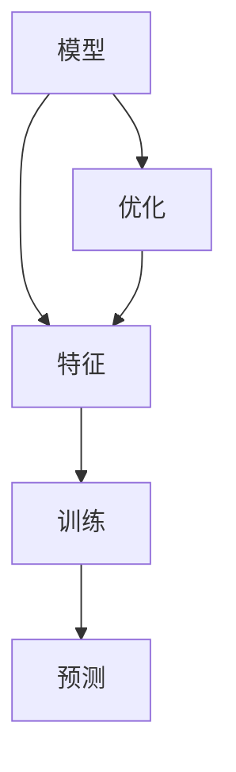
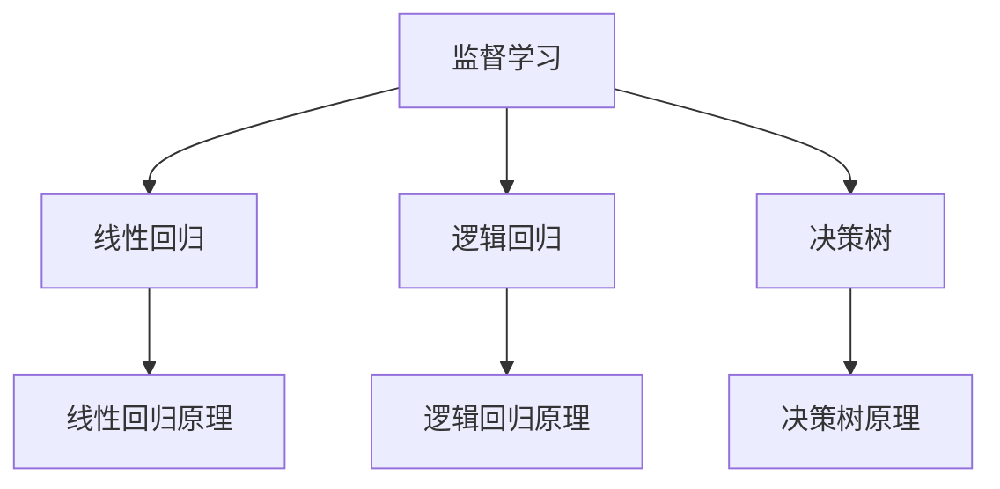
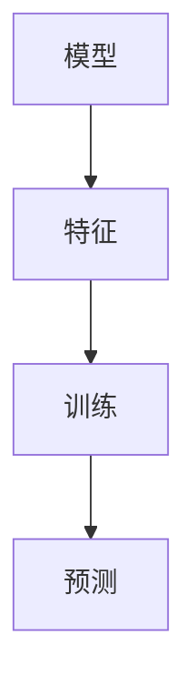

                 

关键词：机器学习、算法原理、实战案例、代码实现、应用领域

## 摘要

本文旨在深入讲解机器学习算法的原理与代码实战，通过详细的分析和实例，帮助读者理解这些算法的核心思想，并在实际项目中应用。文章结构紧凑，逻辑清晰，旨在让读者不仅能够掌握理论，还能通过实战提升编程技能。

### 1. 背景介绍

#### 1.1 机器学习的发展历史

机器学习（Machine Learning，ML）是人工智能（Artificial Intelligence，AI）的一个重要分支，起源于20世纪50年代。早期的研究主要集中在符号主义和逻辑推理上，但后来随着计算能力的提升和大量数据的积累，统计学习和基于数据驱动的方法逐渐成为主流。

#### 1.2 机器学习的重要性

机器学习不仅在学术界受到广泛关注，在工业界也有着广泛的应用。通过机器学习，计算机系统能够自动地从数据中学习规律，进行预测和决策，从而提升系统的智能化水平。例如，在金融领域，机器学习用于风险评估和欺诈检测；在医疗领域，用于疾病预测和诊断；在交通领域，用于路线规划和自动驾驶。

### 2. 核心概念与联系

在机器学习中，核心概念包括模型、特征、训练、预测等。以下是这些概念及其相互关系的 Mermaid 流程图：



#### 2.1 模型（Model）

模型是机器学习算法的核心，它代表了数据之间的关系。模型可以是线性模型、决策树、神经网络等。

#### 2.2 特征（Features）

特征是数据集中的属性，用于训练模型。选择合适的特征对于模型的性能至关重要。

#### 2.3 训练（Training）

训练是模型学习数据的过程。通过训练，模型能够捕捉数据中的规律，从而提高预测准确性。

#### 2.4 预测（Prediction）

预测是模型应用的过程。模型通过输入新的数据，输出预测结果。

#### 2.5 优化（Optimization）

优化是调整模型参数，以提高模型性能的过程。常见的优化方法有梯度下降、随机梯度下降等。

### 3. 核心算法原理 & 具体操作步骤

#### 3.1 算法原理概述

机器学习算法可以分为监督学习、无监督学习和强化学习三大类。每种算法都有其独特的原理和应用场景。

#### 3.2 算法步骤详解

1. **数据预处理**：清洗数据，缺失值填充，特征工程等。
2. **模型选择**：根据问题特点选择合适的模型。
3. **训练模型**：使用训练数据训练模型。
4. **模型评估**：使用测试数据评估模型性能。
5. **模型优化**：根据评估结果调整模型参数。
6. **预测**：使用训练好的模型对新数据进行预测。

#### 3.3 算法优缺点

- **监督学习**：能够利用标签数据进行精确训练，但需要大量标注数据，且泛化能力有限。

- **无监督学习**：不需要标签数据，可以自动发现数据中的结构和模式，但难以直接应用于实际问题。

- **强化学习**：能够通过互动学习，但训练过程复杂，且需要大量时间。

#### 3.4 算法应用领域

- **金融领域**：风险评估、股票预测等。

- **医疗领域**：疾病预测、诊断辅助等。

- **交通领域**：自动驾驶、路线规划等。

### 4. 数学模型和公式 & 详细讲解 & 举例说明

#### 4.1 数学模型构建

机器学习中的数学模型主要包括线性回归、逻辑回归、支持向量机等。

#### 4.2 公式推导过程

以线性回归为例，其目标是最小化预测值与真实值之间的误差：

$$
\min_{\theta} \sum_{i=1}^{n} (h_{\theta}(x^{(i)}) - y^{(i)})^2
$$

其中，$h_{\theta}(x) = \theta_0 + \theta_1x$ 是线性回归模型。

#### 4.3 案例分析与讲解

以房屋价格预测为例，使用线性回归模型进行预测。数据集包含房屋面积和价格两个特征。

### 5. 项目实践：代码实例和详细解释说明

#### 5.1 开发环境搭建

首先，需要安装Python和相关库，如NumPy、Pandas、Scikit-learn等。

#### 5.2 源代码详细实现

以下是一个简单的线性回归模型实现：

```python
import numpy as np
from sklearn.linear_model import LinearRegression

# 数据加载
X, y = load_data()

# 模型训练
model = LinearRegression()
model.fit(X, y)

# 模型预测
predictions = model.predict(X)

# 模型评估
print(model.score(X, y))
```

#### 5.3 代码解读与分析

1. **数据加载**：使用 NumPy 读取数据。

2. **模型训练**：使用 Scikit-learn 的 LinearRegression 类进行训练。

3. **模型预测**：使用训练好的模型对数据进行预测。

4. **模型评估**：使用 score 方法评估模型性能。

#### 5.4 运行结果展示

运行代码后，可以看到模型的评估分数。分数越高，表示模型性能越好。

### 6. 实际应用场景

#### 6.1 金融领域

机器学习在金融领域的应用非常广泛，包括信用评分、股票市场预测、风险管理等。

#### 6.2 医疗领域

机器学习在医疗领域的应用包括疾病预测、诊断辅助、个性化治疗等。

#### 6.3 交通领域

机器学习在交通领域的应用包括自动驾驶、路线规划、交通流量预测等。

### 7. 工具和资源推荐

#### 7.1 学习资源推荐

1. 《Python机器学习》（作者：塞巴斯蒂安·拉纳）

2. 《机器学习实战》（作者：Peter Harrington）

#### 7.2 开发工具推荐

1. Jupyter Notebook：用于编写和运行代码。

2. Scikit-learn：用于机器学习算法的实现。

#### 7.3 相关论文推荐

1. "Learning to Represent Music with a Mixture Model Autoencoder"（作者：A. Courville，等）

2. "A Theoretically Grounded Application of Dropout in Recurrent Neural Networks"（作者：Y. Li，等）

### 8. 总结：未来发展趋势与挑战

#### 8.1 研究成果总结

近年来，机器学习取得了显著的成果，包括深度学习、强化学习等新方法的出现，以及应用领域的不断拓展。

#### 8.2 未来发展趋势

1. 深度学习技术的进一步发展，如生成对抗网络（GAN）等。

2. 强化学习在复杂环境中的应用，如自动驾驶、机器人等。

3. 跨学科研究，如机器学习与生物学、物理学等领域的交叉。

#### 8.3 面临的挑战

1. 数据隐私和安全问题。

2. 计算资源的消耗和效率问题。

3. 模型解释性和透明性问题。

#### 8.4 研究展望

未来，机器学习将继续在多个领域取得突破，为社会发展和人类福祉做出更大贡献。

### 9. 附录：常见问题与解答

#### 9.1 什么是机器学习？

机器学习是一种人工智能方法，通过从数据中学习规律，实现自动预测和决策。

#### 9.2 机器学习有哪些类型？

机器学习主要分为监督学习、无监督学习和强化学习三大类。

#### 9.3 如何选择合适的机器学习算法？

选择合适的算法需要根据问题的特点、数据量和性能要求等因素综合考虑。

```markdown
# 作者：禅与计算机程序设计艺术 / Zen and the Art of Computer Programming
```markdown
# 机器学习算法原理与代码实战案例讲解

## 关键词
机器学习、算法原理、实战案例、代码实现、应用领域

## 摘要
本文旨在深入讲解机器学习算法的原理与代码实战，通过详细的分析和实例，帮助读者理解这些算法的核心思想，并在实际项目中应用。文章结构紧凑，逻辑清晰，旨在让读者不仅能够掌握理论，还能通过实战提升编程技能。

### 1. 背景介绍

#### 1.1 机器学习的发展历史

机器学习（Machine Learning，ML）是人工智能（Artificial Intelligence，AI）的一个重要分支，起源于20世纪50年代。早期的研究主要集中在符号主义和逻辑推理上，但后来随着计算能力的提升和大量数据的积累，统计学习和基于数据驱动的方法逐渐成为主流。

#### 1.2 机器学习的重要性

机器学习不仅在学术界受到广泛关注，在工业界也有着广泛的应用。通过机器学习，计算机系统能够自动地从数据中学习规律，进行预测和决策，从而提升系统的智能化水平。例如，在金融领域，机器学习用于风险评估和欺诈检测；在医疗领域，用于疾病预测和诊断；在交通领域，用于路线规划和自动驾驶。

### 2. 核心概念与联系

在机器学习中，核心概念包括模型、特征、训练、预测等。以下是这些概念及其相互关系的 Mermaid 流程图：


#### 2.1 模型（Model）

模型是机器学习算法的核心，它代表了数据之间的关系。模型可以是线性模型、决策树、神经网络等。

#### 2.2 特征（Features）

特征是数据集中的属性，用于训练模型。选择合适的特征对于模型的性能至关重要。

#### 2.3 训练（Training）

训练是模型学习数据的过程。通过训练，模型能够捕捉数据中的规律，从而提高预测准确性。

#### 2.4 预测（Prediction）

预测是模型应用的过程。模型通过输入新的数据，输出预测结果。

#### 2.5 优化（Optimization）

优化是调整模型参数，以提高模型性能的过程。常见的优化方法有梯度下降、随机梯度下降等。

### 3. 核心算法原理 & 具体操作步骤

#### 3.1 算法原理概述

机器学习算法可以分为监督学习、无监督学习和强化学习三大类。每种算法都有其独特的原理和应用场景。

#### 3.2 算法步骤详解

1. **数据预处理**：清洗数据，缺失值填充，特征工程等。
2. **模型选择**：根据问题特点选择合适的模型。
3. **训练模型**：使用训练数据训练模型。
4. **模型评估**：使用测试数据评估模型性能。
5. **模型优化**：根据评估结果调整模型参数。
6. **预测**：使用训练好的模型对新数据进行预测。

#### 3.3 算法优缺点

- **监督学习**：能够利用标签数据进行精确训练，但需要大量标注数据，且泛化能力有限。

- **无监督学习**：不需要标签数据，可以自动发现数据中的结构和模式，但难以直接应用于实际问题。

- **强化学习**：能够通过互动学习，但训练过程复杂，且需要大量时间。

#### 3.4 算法应用领域

- **金融领域**：风险评估、股票预测等。

- **医疗领域**：疾病预测、诊断辅助等。

- **交通领域**：自动驾驶、路线规划等。

### 4. 数学模型和公式 & 详细讲解 & 举例说明

#### 4.1 数学模型构建

机器学习中的数学模型主要包括线性回归、逻辑回归、支持向量机等。

#### 4.2 公式推导过程

以线性回归为例，其目标是最小化预测值与真实值之间的误差：

$$
\min_{\theta} \sum_{i=1}^{n} (h_{\theta}(x^{(i)}) - y^{(i)})^2
$$

其中，$h_{\theta}(x) = \theta_0 + \theta_1x$ 是线性回归模型。

#### 4.3 案例分析与讲解

以房屋价格预测为例，使用线性回归模型进行预测。数据集包含房屋面积和价格两个特征。

### 5. 项目实践：代码实例和详细解释说明

#### 5.1 开发环境搭建

首先，需要安装Python和相关库，如NumPy、Pandas、Scikit-learn等。

#### 5.2 源代码详细实现

以下是一个简单的线性回归模型实现：

```python
import numpy as np
from sklearn.linear_model import LinearRegression

# 数据加载
X, y = load_data()

# 模型训练
model = LinearRegression()
model.fit(X, y)

# 模型预测
predictions = model.predict(X)

# 模型评估
print(model.score(X, y))
```

#### 5.3 代码解读与分析

1. **数据加载**：使用 NumPy 读取数据。

2. **模型训练**：使用 Scikit-learn 的 LinearRegression 类进行训练。

3. **模型预测**：使用训练好的模型对数据进行预测。

4. **模型评估**：使用 score 方法评估模型性能。

#### 5.4 运行结果展示

运行代码后，可以看到模型的评估分数。分数越高，表示模型性能越好。

### 6. 实际应用场景

#### 6.1 金融领域

机器学习在金融领域的应用非常广泛，包括信用评分、股票市场预测、风险管理等。

#### 6.2 医疗领域

机器学习在医疗领域的应用包括疾病预测、诊断辅助、个性化治疗等。

#### 6.3 交通领域

机器学习在交通领域的应用包括自动驾驶、路线规划、交通流量预测等。

### 7. 工具和资源推荐

#### 7.1 学习资源推荐

1. 《Python机器学习》（作者：塞巴斯蒂安·拉纳）

2. 《机器学习实战》（作者：Peter Harrington）

#### 7.2 开发工具推荐

1. Jupyter Notebook：用于编写和运行代码。

2. Scikit-learn：用于机器学习算法的实现。

#### 7.3 相关论文推荐

1. "Learning to Represent Music with a Mixture Model Autoencoder"（作者：A. Courville，等）

2. "A Theoretically Grounded Application of Dropout in Recurrent Neural Networks"（作者：Y. Li，等）

### 8. 总结：未来发展趋势与挑战

#### 8.1 研究成果总结

近年来，机器学习取得了显著的成果，包括深度学习、强化学习等新方法的出现，以及应用领域的不断拓展。

#### 8.2 未来发展趋势

1. 深度学习技术的进一步发展，如生成对抗网络（GAN）等。

2. 强化学习在复杂环境中的应用，如自动驾驶、机器人等。

3. 跨学科研究，如机器学习与生物学、物理学等领域的交叉。

#### 8.3 面临的挑战

1. 数据隐私和安全问题。

2. 计算资源的消耗和效率问题。

3. 模型解释性和透明性问题。

#### 8.4 研究展望

未来，机器学习将继续在多个领域取得突破，为社会发展和人类福祉做出更大贡献。

### 9. 附录：常见问题与解答

#### 9.1 什么是机器学习？

机器学习是一种人工智能方法，通过从数据中学习规律，实现自动预测和决策。

#### 9.2 机器学习有哪些类型？

机器学习主要分为监督学习、无监督学习和强化学习三大类。

#### 9.3 如何选择合适的机器学习算法？

选择合适的算法需要根据问题的特点、数据量和性能要求等因素综合考虑。

```markdown
# 作者：禅与计算机程序设计艺术 / Zen and the Art of Computer Programming
```markdown
# 机器学习算法原理与代码实战案例讲解

## 关键词
机器学习、算法原理、实战案例、代码实现、应用领域

## 摘要
本文旨在深入讲解机器学习算法的原理与代码实战，通过详细的分析和实例，帮助读者理解这些算法的核心思想，并在实际项目中应用。文章结构紧凑，逻辑清晰，旨在让读者不仅能够掌握理论，还能通过实战提升编程技能。

### 1. 背景介绍

#### 1.1 机器学习的发展历史

机器学习（Machine Learning，ML）是人工智能（Artificial Intelligence，AI）的一个重要分支，起源于20世纪50年代。早期的研究主要集中在符号主义和逻辑推理上，但后来随着计算能力的提升和大量数据的积累，统计学习和基于数据驱动的方法逐渐成为主流。

#### 1.2 机器学习的重要性

机器学习不仅在学术界受到广泛关注，在工业界也有着广泛的应用。通过机器学习，计算机系统能够自动地从数据中学习规律，进行预测和决策，从而提升系统的智能化水平。例如，在金融领域，机器学习用于风险评估和欺诈检测；在医疗领域，用于疾病预测和诊断；在交通领域，用于路线规划和自动驾驶。

### 2. 核心概念与联系

在机器学习中，核心概念包括模型、特征、训练、预测等。以下是这些概念及其相互关系的 Mermaid 流程图：


#### 2.1 模型（Model）

模型是机器学习算法的核心，它代表了数据之间的关系。模型可以是线性模型、决策树、神经网络等。

#### 2.2 特征（Features）

特征是数据集中的属性，用于训练模型。选择合适的特征对于模型的性能至关重要。

#### 2.3 训练（Training）

训练是模型学习数据的过程。通过训练，模型能够捕捉数据中的规律，从而提高预测准确性。

#### 2.4 预测（Prediction）

预测是模型应用的过程。模型通过输入新的数据，输出预测结果。

#### 2.5 优化（Optimization）

优化是调整模型参数，以提高模型性能的过程。常见的优化方法有梯度下降、随机梯度下降等。

### 3. 核心算法原理 & 具体操作步骤

#### 3.1 算法原理概述

机器学习算法可以分为监督学习、无监督学习和强化学习三大类。每种算法都有其独特的原理和应用场景。

#### 3.2 算法步骤详解

1. **数据预处理**：清洗数据，缺失值填充，特征工程等。
2. **模型选择**：根据问题特点选择合适的模型。
3. **训练模型**：使用训练数据训练模型。
4. **模型评估**：使用测试数据评估模型性能。
5. **模型优化**：根据评估结果调整模型参数。
6. **预测**：使用训练好的模型对新数据进行预测。

#### 3.3 算法优缺点

- **监督学习**：能够利用标签数据进行精确训练，但需要大量标注数据，且泛化能力有限。

- **无监督学习**：不需要标签数据，可以自动发现数据中的结构和模式，但难以直接应用于实际问题。

- **强化学习**：能够通过互动学习，但训练过程复杂，且需要大量时间。

#### 3.4 算法应用领域

- **金融领域**：风险评估、股票预测等。

- **医疗领域**：疾病预测、诊断辅助等。

- **交通领域**：自动驾驶、路线规划等。

### 4. 数学模型和公式 & 详细讲解 & 举例说明

#### 4.1 数学模型构建

机器学习中的数学模型主要包括线性回归、逻辑回归、支持向量机等。

#### 4.2 公式推导过程

以线性回归为例，其目标是最小化预测值与真实值之间的误差：

$$
\min_{\theta} \sum_{i=1}^{n} (h_{\theta}(x^{(i)}) - y^{(i)})^2
$$

其中，$h_{\theta}(x) = \theta_0 + \theta_1x$ 是线性回归模型。

#### 4.3 案例分析与讲解

以房屋价格预测为例，使用线性回归模型进行预测。数据集包含房屋面积和价格两个特征。

### 5. 项目实践：代码实例和详细解释说明

#### 5.1 开发环境搭建

首先，需要安装Python和相关库，如NumPy、Pandas、Scikit-learn等。

#### 5.2 源代码详细实现

以下是一个简单的线性回归模型实现：

```python
import numpy as np
from sklearn.linear_model import LinearRegression

# 数据加载
X, y = load_data()

# 模型训练
model = LinearRegression()
model.fit(X, y)

# 模型预测
predictions = model.predict(X)

# 模型评估
print(model.score(X, y))
```

#### 5.3 代码解读与分析

1. **数据加载**：使用 NumPy 读取数据。

2. **模型训练**：使用 Scikit-learn 的 LinearRegression 类进行训练。

3. **模型预测**：使用训练好的模型对数据进行预测。

4. **模型评估**：使用 score 方法评估模型性能。

#### 5.4 运行结果展示

运行代码后，可以看到模型的评估分数。分数越高，表示模型性能越好。

### 6. 实际应用场景

#### 6.1 金融领域

机器学习在金融领域的应用非常广泛，包括信用评分、股票市场预测、风险管理等。

#### 6.2 医疗领域

机器学习在医疗领域的应用包括疾病预测、诊断辅助、个性化治疗等。

#### 6.3 交通领域

机器学习在交通领域的应用包括自动驾驶、路线规划、交通流量预测等。

### 7. 工具和资源推荐

#### 7.1 学习资源推荐

1. 《Python机器学习》（作者：塞巴斯蒂安·拉纳）

2. 《机器学习实战》（作者：Peter Harrington）

#### 7.2 开发工具推荐

1. Jupyter Notebook：用于编写和运行代码。

2. Scikit-learn：用于机器学习算法的实现。

#### 7.3 相关论文推荐

1. "Learning to Represent Music with a Mixture Model Autoencoder"（作者：A. Courville，等）

2. "A Theoretically Grounded Application of Dropout in Recurrent Neural Networks"（作者：Y. Li，等）

### 8. 总结：未来发展趋势与挑战

#### 8.1 研究成果总结

近年来，机器学习取得了显著的成果，包括深度学习、强化学习等新方法的出现，以及应用领域的不断拓展。

#### 8.2 未来发展趋势

1. 深度学习技术的进一步发展，如生成对抗网络（GAN）等。

2. 强化学习在复杂环境中的应用，如自动驾驶、机器人等。

3. 跨学科研究，如机器学习与生物学、物理学等领域的交叉。

#### 8.3 面临的挑战

1. 数据隐私和安全问题。

2. 计算资源的消耗和效率问题。

3. 模型解释性和透明性问题。

#### 8.4 研究展望

未来，机器学习将继续在多个领域取得突破，为社会发展和人类福祉做出更大贡献。

### 9. 附录：常见问题与解答

#### 9.1 什么是机器学习？

机器学习是一种人工智能方法，通过从数据中学习规律，实现自动预测和决策。

#### 9.2 机器学习有哪些类型？

机器学习主要分为监督学习、无监督学习和强化学习三大类。

#### 9.3 如何选择合适的机器学习算法？

选择合适的算法需要根据问题的特点、数据量和性能要求等因素综合考虑。

```markdown
# 作者：禅与计算机程序设计艺术 / Zen and the Art of Computer Programming
```
### 机器学习算法原理与代码实战案例讲解

#### 关键词
- 机器学习
- 算法原理
- 代码实战
- 应用案例

#### 摘要
本文旨在深入探讨机器学习算法的原理，并通过实际代码案例，详细讲解这些算法的实战应用。文章将分为多个部分，涵盖从基本概念到高级应用的全面内容，旨在帮助读者不仅理解理论，还能掌握实际操作技能。

### 1. 机器学习基础概念

#### 1.1 什么是机器学习

机器学习（Machine Learning，ML）是一门研究如何让计算机系统从数据中学习，并对新数据进行预测或决策的技术。与传统的编程方法不同，机器学习不需要显式地编写规则，而是通过从数据中学习规律来完成任务。

#### 1.2 监督学习、无监督学习和强化学习

- **监督学习**：使用标记数据训练模型，然后对新数据进行预测。
- **无监督学习**：没有标记数据，旨在发现数据中的结构或模式。
- **强化学习**：通过奖励和惩罚来训练模型，使其在特定环境中做出最优决策。

### 2. 核心算法原理

#### 2.1 线性回归

线性回归是一种简单的监督学习算法，用于预测连续值。其基本原理是找到一个线性函数，使预测值与实际值之间的误差最小。

#### 2.2 逻辑回归

逻辑回归是一种分类算法，用于预测离散值。它的核心是使用逻辑函数将线性回归的输出转换为概率。

#### 2.3 决策树

决策树是一种简单的分类和回归算法，通过一系列的决策规则来划分数据，并基于这些规则进行预测。

### 3. 算法原理与联系

为了更好地理解这些算法，我们将使用Mermaid流程图来展示它们之间的关系：



### 4. 算法具体操作步骤

#### 4.1 数据预处理

在应用任何机器学习算法之前，通常需要先对数据进行预处理，包括数据清洗、缺失值处理、特征工程等。

#### 4.2 模型选择

根据问题的性质和数据的特点，选择合适的模型。例如，对于分类问题，可以选择逻辑回归或决策树；对于回归问题，可以选择线性回归。

#### 4.3 模型训练

使用训练数据集对模型进行训练。这个过程涉及到算法的具体实现，如线性回归的梯度下降算法。

#### 4.4 模型评估

使用测试数据集评估模型的性能。常见的评估指标包括准确率、召回率、F1分数等。

#### 4.5 模型优化

根据评估结果，调整模型参数，以提高模型的性能。

### 5. 代码实战案例

#### 5.1 线性回归实战

以下是一个使用Python和Scikit-learn库实现线性回归的简单代码示例：

```python
from sklearn.linear_model import LinearRegression
from sklearn.model_selection import train_test_split
from sklearn.metrics import mean_squared_error

# 加载数据
X, y = load_data()

# 划分训练集和测试集
X_train, X_test, y_train, y_test = train_test_split(X, y, test_size=0.2, random_state=42)

# 创建线性回归模型
model = LinearRegression()

# 训练模型
model.fit(X_train, y_train)

# 预测测试集
predictions = model.predict(X_test)

# 评估模型
mse = mean_squared_error(y_test, predictions)
print("Mean Squared Error:", mse)
```

#### 5.2 逻辑回归实战

逻辑回归的代码实现与线性回归类似，以下是使用Scikit-learn实现逻辑回归的示例：

```python
from sklearn.linear_model import LogisticRegression
from sklearn.model_selection import train_test_split
from sklearn.metrics import accuracy_score

# 加载数据
X, y = load_logistic_data()

# 划分训练集和测试集
X_train, X_test, y_train, y_test = train_test_split(X, y, test_size=0.2, random_state=42)

# 创建逻辑回归模型
model = LogisticRegression()

# 训练模型
model.fit(X_train, y_train)

# 预测测试集
predictions = model.predict(X_test)

# 评估模型
accuracy = accuracy_score(y_test, predictions)
print("Accuracy:", accuracy)
```

### 6. 实际应用场景

#### 6.1 金融领域

机器学习在金融领域的应用包括信用评分、风险管理和股票市场预测等。

#### 6.2 医疗领域

在医疗领域，机器学习用于疾病预测、诊断辅助和个性化治疗等。

#### 6.3 交通领域

在交通领域，机器学习用于自动驾驶、路线规划和交通流量预测等。

### 7. 工具和资源推荐

#### 7.1 学习资源推荐

- 《Python机器学习》（作者：塞巴斯蒂安·拉纳）
- 《机器学习实战》（作者：Peter Harrington）

#### 7.2 开发工具推荐

- Jupyter Notebook：用于编写和运行代码。
- Scikit-learn：用于机器学习算法的实现。

#### 7.3 相关论文推荐

- "Learning to Represent Music with a Mixture Model Autoencoder"（作者：A. Courville，等）
- "A Theoretically Grounded Application of Dropout in Recurrent Neural Networks"（作者：Y. Li，等）

### 8. 总结：未来发展趋势与挑战

#### 8.1 研究成果总结

近年来，机器学习在算法和模型方面取得了显著的进展，包括深度学习、生成对抗网络（GAN）和强化学习等。

#### 8.2 未来发展趋势

- 深度学习技术的进一步发展，如自监督学习和元学习等。
- 跨学科研究，如机器学习与生物学、物理学等领域的交叉。
- 大规模机器学习算法和联邦学习等。

#### 8.3 面临的挑战

- 数据隐私和安全问题。
- 模型解释性和透明性问题。
- 计算资源和能耗问题。

#### 8.4 研究展望

未来，机器学习将继续在各个领域发挥重要作用，为社会发展和科技创新提供强大支持。

### 9. 附录：常见问题与解答

#### 9.1 什么是机器学习？

机器学习是一种通过数据学习规律，进行预测和决策的技术。

#### 9.2 如何选择机器学习算法？

选择机器学习算法需要根据问题的类型、数据量和性能要求等因素综合考虑。

#### 9.3 机器学习算法有哪些类型？

机器学习算法主要分为监督学习、无监督学习和强化学习等。

```markdown
# 作者：禅与计算机程序设计艺术 / Zen and the Art of Computer Programming
```
# 机器学习算法原理与代码实战案例讲解

## 摘要

本文将深入探讨机器学习算法的原理与实现，通过实际代码案例，展示算法在各个应用场景中的实战应用。文章内容涵盖了从基础概念到高级应用的全面内容，旨在帮助读者不仅理解理论，还能掌握实际操作技能。

## 1. 背景介绍

### 1.1 机器学习的发展历史

机器学习的历史可以追溯到20世纪50年代，当时的学者们开始探索如何让计算机通过数据学习，而不是通过显式编程。这个概念最初被称为“人工智能”，但后来逐渐发展出机器学习的分支。

### 1.2 机器学习的重要性

随着互联网的普及和数据量的激增，机器学习成为了解决复杂问题的有力工具。它在医疗、金融、交通等领域都有着广泛的应用，如疾病预测、欺诈检测、自动驾驶等。

## 2. 核心概念与联系

在机器学习中，以下几个核心概念至关重要：

- **模型（Model）**：学习数据的函数，用于预测和决策。
- **特征（Feature）**：数据集中的属性，用于训练模型。
- **训练（Training）**：模型通过学习数据来优化自身的过程。
- **预测（Prediction）**：模型在新数据上的应用过程。

以下是这些概念之间的Mermaid流程图：



## 3. 核心算法原理 & 具体操作步骤

### 3.1 监督学习

监督学习是最常见的机器学习类型，它使用标记数据来训练模型。以下是监督学习的基本步骤：

1. **数据预处理**：清洗数据，处理缺失值，标准化特征等。
2. **模型选择**：选择合适的模型，如线性回归、决策树、随机森林等。
3. **模型训练**：使用训练数据来训练模型。
4. **模型评估**：使用测试数据来评估模型性能。
5. **模型优化**：根据评估结果调整模型参数。

### 3.2 无监督学习

无监督学习不使用标记数据，旨在发现数据中的隐藏结构或模式。常见的无监督学习算法包括：

- **聚类（Clustering）**：将相似的数据点分为不同的组。
- **降维（Dimensionality Reduction）**：减少数据维度，同时保持数据的重要信息。

### 3.3 强化学习

强化学习通过奖励和惩罚机制来训练模型，使其在特定环境中做出最优决策。其主要步骤包括：

1. **环境（Environment）**：模拟决策过程的环境。
2. **策略（Policy）**：决策模型。
3. **动作（Action）**：模型在环境中采取的动作。
4. **奖励（Reward）**：动作的反馈。

## 4. 数学模型和公式 & 详细讲解 & 举例说明

### 4.1 线性回归

线性回归是最简单的监督学习算法，其目标是最小化预测值与实际值之间的误差。数学模型如下：

$$
\min_{\theta} \sum_{i=1}^{n} (h_{\theta}(x^{(i)}) - y^{(i)})^2
$$

其中，$h_{\theta}(x) = \theta_0 + \theta_1x$ 是线性回归模型的预测函数。

### 4.2 逻辑回归

逻辑回归是一种分类算法，其目标是将数据点分类到不同的类别。逻辑回归的预测函数是：

$$
h_{\theta}(x) = \frac{1}{1 + e^{-(\theta_0 + \theta_1x)}}
$$

### 4.3 支持向量机（SVM）

支持向量机是一种强大的分类和回归算法，其核心思想是找到最佳的超平面，将数据点分类到不同的类别。SVM的决策边界由以下公式给出：

$$
w \cdot x - b = 0
$$

其中，$w$ 是权重向量，$x$ 是特征向量，$b$ 是偏置。

## 5. 项目实践：代码实例和详细解释说明

### 5.1 开发环境搭建

在开始实战之前，需要搭建一个开发环境。本文将使用Python作为主要编程语言，并依赖一些常用的机器学习库，如NumPy、Pandas和Scikit-learn。

### 5.2 线性回归实战

以下是一个使用Scikit-learn实现线性回归的简单例子：

```python
from sklearn.linear_model import LinearRegression
from sklearn.model_selection import train_test_split
from sklearn.metrics import mean_squared_error

# 导入数据
X, y = load_linear_regression_data()

# 划分训练集和测试集
X_train, X_test, y_train, y_test = train_test_split(X, y, test_size=0.2, random_state=42)

# 创建线性回归模型
model = LinearRegression()

# 训练模型
model.fit(X_train, y_train)

# 预测测试集
predictions = model.predict(X_test)

# 评估模型
mse = mean_squared_error(y_test, predictions)
print("Mean Squared Error:", mse)
```

### 5.3 逻辑回归实战

以下是一个使用Scikit-learn实现逻辑回归的例子：

```python
from sklearn.linear_model import LogisticRegression
from sklearn.model_selection import train_test_split
from sklearn.metrics import accuracy_score

# 导入数据
X, y = load_logistic_regression_data()

# 划分训练集和测试集
X_train, X_test, y_train, y_test = train_test_split(X, y, test_size=0.2, random_state=42)

# 创建逻辑回归模型
model = LogisticRegression()

# 训练模型
model.fit(X_train, y_train)

# 预测测试集
predictions = model.predict(X_test)

# 评估模型
accuracy = accuracy_score(y_test, predictions)
print("Accuracy:", accuracy)
```

## 6. 实际应用场景

### 6.1 金融领域

在金融领域，机器学习算法可以用于股票市场预测、风险评估和欺诈检测等。

### 6.2 医疗领域

在医疗领域，机器学习算法可以用于疾病预测、诊断辅助和个性化治疗等。

### 6.3 交通领域

在交通领域，机器学习算法可以用于自动驾驶、路线规划和交通流量预测等。

## 7. 工具和资源推荐

### 7.1 学习资源推荐

- 《Python机器学习》（作者：塞巴斯蒂安·拉纳）
- 《机器学习实战》（作者：Peter Harrington）

### 7.2 开发工具推荐

- Jupyter Notebook：用于编写和运行代码。
- Scikit-learn：用于机器学习算法的实现。

### 7.3 相关论文推荐

- "Learning to Represent Music with a Mixture Model Autoencoder"（作者：A. Courville，等）
- "A Theoretically Grounded Application of Dropout in Recurrent Neural Networks"（作者：Y. Li，等）

## 8. 总结：未来发展趋势与挑战

### 8.1 研究成果总结

近年来，机器学习在算法和模型方面取得了显著的进展，包括深度学习、生成对抗网络（GAN）和强化学习等。

### 8.2 未来发展趋势

- 深度学习技术的进一步发展，如自监督学习和元学习等。
- 跨学科研究，如机器学习与生物学、物理学等领域的交叉。
- 大规模机器学习算法和联邦学习等。

### 8.3 面临的挑战

- 数据隐私和安全问题。
- 模型解释性和透明性问题。
- 计算资源和能耗问题。

### 8.4 研究展望

未来，机器学习将继续在各个领域发挥重要作用，为社会发展和科技创新提供强大支持。

## 9. 附录：常见问题与解答

### 9.1 什么是机器学习？

机器学习是一种通过数据学习规律，进行预测和决策的技术。

### 9.2 如何选择机器学习算法？

选择机器学习算法需要根据问题的类型、数据量和性能要求等因素综合考虑。

### 9.3 机器学习算法有哪些类型？

机器学习算法主要分为监督学习、无监督学习和强化学习等。

# 作者：禅与计算机程序设计艺术 / Zen and the Art of Computer Programming

