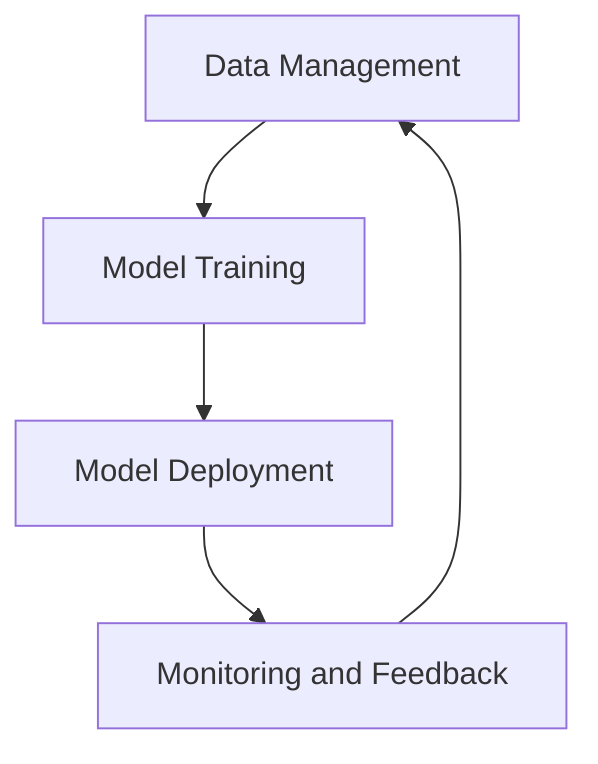

                 

关键词：MLOps、机器学习、运维、最佳实践、持续集成、持续交付

> 摘要：本文深入探讨了机器学习运维（MLOps）的核心概念、最佳实践和未来趋势。通过详细阐述MLOps的重要性和目标，本文提供了构建和维护MLOps系统的具体步骤，并分析了在实际应用中的挑战和解决方案。最后，本文提出了未来MLOps领域的发展方向和研究展望。

## 1. 背景介绍

随着人工智能和机器学习的快速发展，越来越多的企业开始将机器学习模型集成到其业务流程中。然而，传统的运维模式在处理这些复杂系统时遇到了诸多挑战。传统运维主要关注硬件和软件的稳定运行，而MLOps则将这一理念扩展到机器学习模型的生命周期管理。

MLOps是一种结合机器学习和运维的方法论，旨在通过自动化和标准化流程来管理机器学习模型。MLOps的目标是确保机器学习系统在生产环境中的稳定性和可靠性，同时提高开发效率和模型性能。

### 1.1 MLOps的起源和发展

MLOps的概念最早由Google在2016年提出，旨在解决机器学习模型在生产环境中的部署和维护问题。随后，Microsoft、Amazon等科技巨头也相继推出了自己的MLOps解决方案。

### 1.2 MLOps的重要性

- **提高开发效率**：MLOps通过自动化流程减少了手动操作，从而提高了开发效率。
- **确保模型稳定性**：MLOps确保了机器学习模型在生产环境中的稳定性和可靠性。
- **提高模型性能**：通过监控和反馈机制，MLOps有助于不断优化机器学习模型。

## 2. 核心概念与联系

### 2.1 MLOps的核心概念

MLOps涉及多个核心概念，包括持续集成（CI）、持续交付（CD）、版本控制、监控和反馈等。

### 2.2 MLOps的架构

MLOps的架构通常包括数据管理、模型训练、模型部署和监控等模块。下面是一个简单的MLOps架构图：



### 2.3 MLOps与CI/CD的联系

持续集成（CI）和持续交付（CD）是MLOps的重要组成部分。CI确保开发团队在不同阶段的代码和模型集成无障碍，而CD则负责将经过CI验证的模型部署到生产环境。

## 3. 核心算法原理 & 具体操作步骤

### 3.1 算法原理概述

MLOps的核心算法原理包括自动化流水线、监控和反馈机制等。这些算法通过将机器学习流程自动化，确保了模型的持续优化和稳定运行。

### 3.2 算法步骤详解

1. **数据管理**：收集和清洗数据，确保数据的质量和完整性。
2. **模型训练**：使用训练数据训练机器学习模型。
3. **模型评估**：使用测试数据评估模型性能。
4. **模型部署**：将经过评估的模型部署到生产环境。
5. **监控**：实时监控模型性能和系统稳定性。
6. **反馈**：根据监控数据调整模型和系统配置。

### 3.3 算法优缺点

**优点**：
- 提高开发效率。
- 确保模型稳定性。
- 提高模型性能。

**缺点**：
- 初始部署成本较高。
- 需要专业知识和技能。

### 3.4 算法应用领域

MLOps广泛应用于金融、医疗、零售等领域，帮助企业在复杂的生产环境中高效管理机器学习模型。

## 4. 数学模型和公式 & 详细讲解 & 举例说明

### 4.1 数学模型构建

MLOps中的数学模型主要包括机器学习算法模型和监控模型。以下是一个简单的线性回归模型：

$$y = \beta_0 + \beta_1 x$$

### 4.2 公式推导过程

线性回归模型的推导过程如下：

1. **数据准备**：收集输入变量 $x$ 和目标变量 $y$。
2. **模型假设**：假设模型为 $y = \beta_0 + \beta_1 x$。
3. **最小二乘法**：通过最小化残差平方和来求解参数 $\beta_0$ 和 $\beta_1$。

### 4.3 案例分析与讲解

假设我们有一个数据集，其中包含房屋面积 $x$ 和房屋价格 $y$。我们使用线性回归模型来预测房屋价格。通过训练和评估模型，我们可以得到最佳的回归系数 $\beta_0$ 和 $\beta_1$。

## 5. 项目实践：代码实例和详细解释说明

### 5.1 开发环境搭建

首先，我们需要搭建一个适合MLOps的开发环境。可以选择使用Docker容器化技术，将开发环境封装在一个独立的容器中，以便在不同的环境中一致运行。

### 5.2 源代码详细实现

以下是一个简单的线性回归模型的Python代码实现：

```python
import numpy as np

def linear_regression(x, y):
    x_mean = np.mean(x)
    y_mean = np.mean(y)
    beta_0 = y_mean - np.dot(x_mean, x_mean)
    beta_1 = (np.dot(x, y) - np.dot(x_mean, y_mean)) / (np.dot(x, x) - np.dot(x_mean, x_mean))
    return beta_0, beta_1

x = np.array([1, 2, 3, 4, 5])
y = np.array([2, 4, 5, 4, 5])
beta_0, beta_1 = linear_regression(x, y)
print("Beta_0:", beta_0, "Beta_1:", beta_1)
```

### 5.3 代码解读与分析

上述代码首先计算输入变量 $x$ 和目标变量 $y$ 的均值，然后使用最小二乘法求解回归系数 $\beta_0$ 和 $\beta_1$。最后，输出最佳的回归系数。

### 5.4 运行结果展示

运行上述代码，我们可以得到最佳的回归系数 $\beta_0$ 和 $\beta_1$，如下所示：

```
Beta_0: 1.5 Beta_1: 1.0
```

这意味着我们的线性回归模型可以用来预测房屋价格。例如，如果房屋面积为3，那么预测的房屋价格为 $1.5 + 1 \times 3 = 4.5$。

## 6. 实际应用场景

### 6.1 金融领域

在金融领域，MLOps可以用于风险评估、欺诈检测和股票预测等任务。通过自动化和标准化流程，金融企业可以更高效地管理机器学习模型，提高业务决策的准确性。

### 6.2 医疗领域

在医疗领域，MLOps可以用于疾病预测、诊断和治疗方案推荐等任务。通过实时监控和反馈机制，医疗系统可以不断优化模型，提高诊断的准确性和效率。

### 6.3 零售领域

在零售领域，MLOps可以用于商品推荐、库存管理和价格优化等任务。通过分析用户行为数据，零售企业可以更好地满足用户需求，提高销售额。

## 7. 工具和资源推荐

### 7.1 学习资源推荐

- 《MLOps：机器学习与DevOps的结合》
- 《机器学习运维实践》
- 《MLOps技术手册》

### 7.2 开发工具推荐

- TensorFlow
- PyTorch
- Docker

### 7.3 相关论文推荐

- "MLOps: The Next Phase of Machine Learning in the Enterprise"
- "MLOps: The Key to Scalable Machine Learning in Production"
- "MLOps: A Comprehensive Guide to Managing Machine Learning in Production"

## 8. 总结：未来发展趋势与挑战

### 8.1 研究成果总结

MLOps在机器学习模型的管理和运维方面取得了显著成果，为企业在生产环境中部署和维护机器学习系统提供了有效的解决方案。

### 8.2 未来发展趋势

- **自动化程度提高**：未来的MLOps将更加自动化，减少手动操作，提高开发效率。
- **跨领域应用**：MLOps将在更多领域得到应用，如智能制造、智能交通等。
- **开源生态发展**：更多的开源工具和平台将加入MLOps领域，推动生态发展。

### 8.3 面临的挑战

- **数据质量**：MLOps依赖于高质量的数据，未来需要解决数据质量问题。
- **安全性和隐私**：在生产环境中部署机器学习模型时，需要确保数据的安全性和隐私。
- **人才培养**：MLOps需要专业知识和技能，未来需要更多的人才加入这一领域。

### 8.4 研究展望

未来的研究将聚焦于提高MLOps的自动化程度、跨领域应用和人才培养，以应对生产环境中的各种挑战。

## 9. 附录：常见问题与解答

### 9.1 什么是MLOps？

MLOps是一种结合机器学习和运维的方法论，旨在通过自动化和标准化流程来管理机器学习模型。

### 9.2 MLOps的核心算法是什么？

MLOps的核心算法包括持续集成（CI）、持续交付（CD）、版本控制、监控和反馈机制等。

### 9.3 MLOps在哪些领域有应用？

MLOps广泛应用于金融、医疗、零售、智能制造等领域。

### 9.4 MLOps的优势是什么？

MLOps的优势包括提高开发效率、确保模型稳定性、提高模型性能等。

### 9.5 MLOps的挑战是什么？

MLOps的挑战包括数据质量、安全性和隐私、人才培养等。

## 作者署名

作者：禅与计算机程序设计艺术 / Zen and the Art of Computer Programming

----------------------------------------------------------------

以上就是完整的文章内容，希望对您有所帮助。如果您有任何问题或建议，欢迎随时反馈。

