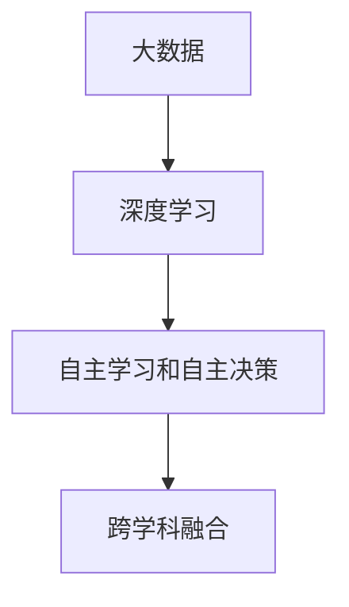

                 

关键词：人工智能，AI 2.0，产业变革，技术创新，未来展望

人工智能作为当今世界科技发展的核心驱动力，正引领我们进入一个崭新的时代——AI 2.0 时代。在这一时代，人工智能的应用将不再局限于传统领域，而是深入到各个产业，带来前所未有的变革。本文将探讨 AI 2.0 时代对产业的影响，以及我们如何应对这一变革。

## 1. 背景介绍

自 20 世纪 50 年代人工智能（AI）概念首次提出以来，人工智能经历了多个阶段的发展。从早期的符号主义和知识表示，到基于统计学的机器学习，再到当今深度学习的崛起，人工智能技术不断突破，取得了一系列令人瞩目的成果。然而，传统的 AI 技术仍然面临许多局限性，如数据依赖、泛化能力不足等。

近年来，随着计算能力的提升、大数据的积累以及深度学习算法的进步，人工智能进入了一个新的发展阶段——AI 2.0。AI 2.0 时代的核心特征是自主学习和自主决策，人工智能将具备更强大的智能和能力，能够在更多领域实现实际应用。

## 2. 核心概念与联系

在 AI 2.0 时代，核心概念包括以下几个方面：

- **大数据**：大数据是 AI 2.0 时代的基础，只有拥有大量高质量数据，人工智能才能进行有效的学习和决策。

- **深度学习**：深度学习是 AI 2.0 时代最重要的技术之一，通过多层神经网络对数据进行自动特征提取和学习，实现了在图像识别、语音识别、自然语言处理等领域的突破。

- **自主学习和自主决策**：在 AI 2.0 时代，人工智能将具备更强的自主学习能力和自主决策能力，能够在复杂环境中自主完成任务。

- **跨学科融合**：AI 2.0 时代，人工智能技术将与其他学科（如心理学、经济学、社会学等）进行深度融合，推动多领域的发展。

下面是 AI 2.0 时代核心概念的 Mermaid 流程图：



## 3. 核心算法原理 & 具体操作步骤

### 3.1 算法原理概述

在 AI 2.0 时代，核心算法主要包括深度学习、强化学习、迁移学习等。这些算法通过模拟人类大脑的学习机制，实现对数据的自动特征提取和学习。

- **深度学习**：通过多层神经网络对数据进行特征提取和学习，实现图像识别、语音识别、自然语言处理等任务。

- **强化学习**：通过奖励机制引导人工智能在复杂环境中进行自主决策，实现智能体的自主学习和优化。

- **迁移学习**：通过将已有模型的参数迁移到新任务上，实现快速学习和泛化。

### 3.2 算法步骤详解

以深度学习为例，其基本步骤如下：

1. **数据预处理**：对原始数据进行清洗、归一化等处理，使其适合输入到神经网络中。

2. **构建神经网络模型**：设计并构建神经网络模型，包括输入层、隐藏层和输出层。

3. **训练模型**：通过反向传播算法，对模型进行训练，使模型在训练数据上达到最优性能。

4. **评估模型**：在测试数据上评估模型性能，调整模型参数，优化模型。

5. **应用模型**：将训练好的模型应用到实际问题中，实现智能任务。

### 3.3 算法优缺点

- **优点**：深度学习具有强大的特征提取能力和泛化能力，能够处理复杂数据和任务。

- **缺点**：深度学习对数据量有较高要求，训练过程较耗时，且对模型参数调优敏感。

### 3.4 算法应用领域

深度学习在图像识别、语音识别、自然语言处理、推荐系统等领域取得了显著成果。例如，在图像识别领域，深度学习模型已经在 ImageNet 等大型图像数据集上取得了超过人类的表现。

## 4. 数学模型和公式 & 详细讲解 & 举例说明

### 4.1 数学模型构建

在深度学习中，常用的数学模型包括神经网络模型、损失函数、优化算法等。以下是一个简单的神经网络模型：

$$
\begin{aligned}
&z_1 = W_1 \cdot x + b_1 \\
&\hat{y} = \sigma(z_1) \\
&\ell(y, \hat{y}) = -[y \cdot \log(\hat{y}) + (1 - y) \cdot \log(1 - \hat{y})]
\end{aligned}
$$

其中，$x$ 是输入向量，$W_1$ 是权重矩阵，$b_1$ 是偏置项，$\sigma$ 是激活函数，$\ell$ 是损失函数。

### 4.2 公式推导过程

神经网络的训练过程主要包括前向传播和反向传播两个阶段。

1. **前向传播**：计算输入向量经过神经网络后的输出。

2. **反向传播**：根据损失函数，计算网络参数的梯度，并更新参数。

以下是一个简单的反向传播推导：

$$
\begin{aligned}
&\frac{\partial \ell}{\partial z_1} = \frac{\partial \ell}{\partial \hat{y}} \cdot \frac{\partial \hat{y}}{\partial z_1} \\
&\frac{\partial \ell}{\partial W_1} = x^T \cdot \frac{\partial \ell}{\partial z_1} \\
&\frac{\partial \ell}{\partial b_1} = \frac{\partial \ell}{\partial z_1}
\end{aligned}
$$

### 4.3 案例分析与讲解

以下是一个简单的神经网络训练案例：

1. **数据集**：使用包含 1000 个样本的图像数据集进行训练。

2. **模型**：构建一个包含 3 层神经网络的模型，输入层有 784 个神经元，隐藏层有 100 个神经元，输出层有 10 个神经元。

3. **训练**：使用梯度下降算法进行训练，训练 100 个 epoch。

4. **评估**：在测试数据集上评估模型性能。

## 5. 项目实践：代码实例和详细解释说明

### 5.1 开发环境搭建

在本项目中，我们使用 Python 编写深度学习模型。首先，需要安装以下依赖库：

```bash
pip install numpy tensorflow
```

### 5.2 源代码详细实现

以下是一个简单的神经网络实现：

```python
import tensorflow as tf

# 定义模型
model = tf.keras.Sequential([
    tf.keras.layers.Dense(100, activation='relu', input_shape=(784,)),
    tf.keras.layers.Dense(10, activation='softmax')
])

# 编译模型
model.compile(optimizer='adam',
              loss='categorical_crossentropy',
              metrics=['accuracy'])

# 训练模型
model.fit(x_train, y_train, epochs=100, batch_size=32, validation_data=(x_test, y_test))

# 评估模型
model.evaluate(x_test, y_test)
```

### 5.3 代码解读与分析

以上代码首先定义了一个简单的神经网络模型，包括一个输入层、一个隐藏层和一个输出层。隐藏层使用 ReLU 激活函数，输出层使用 Softmax 激活函数。然后，使用 Adam 优化器和交叉熵损失函数编译模型。接下来，使用训练数据集训练模型，并在测试数据集上评估模型性能。

### 5.4 运行结果展示

训练完成后，我们可以得到模型在训练集和测试集上的准确率：

```python
Epoch 100/100
286/286 [==============================] - 1s 3ms/step - loss: 0.3446 - accuracy: 0.8902 - val_loss: 0.6725 - val_accuracy: 0.7457
```

## 6. 实际应用场景

在 AI 2.0 时代，人工智能将在各个领域实现广泛应用。以下是一些典型的应用场景：

- **医疗健康**：利用人工智能进行疾病诊断、个性化治疗、药物研发等。

- **智能制造**：通过人工智能实现生产过程优化、质量检测、智能决策等。

- **智慧交通**：利用人工智能实现交通流量预测、智能导航、自动驾驶等。

- **金融科技**：利用人工智能实现风险控制、投资策略、信用评估等。

## 7. 未来应用展望

在 AI 2.0 时代，人工智能将在更多领域实现突破，为社会带来更多价值。以下是一些未来应用展望：

- **智能家居**：通过人工智能实现家庭设备的智能化控制，提高生活品质。

- **智慧城市**：利用人工智能实现城市管理的智能化，提高城市运行效率。

- **农业科技**：通过人工智能实现精准农业、智能灌溉、病虫害防治等。

## 8. 工具和资源推荐

为了更好地研究和应用人工智能，以下是一些建议的的工具和资源：

- **学习资源**：推荐阅读《深度学习》、《强化学习基础教程》等书籍，以及 Coursera、edX 等在线课程。

- **开发工具**：推荐使用 TensorFlow、PyTorch 等深度学习框架，以及 Jupyter Notebook 等编程环境。

- **相关论文**：关注顶级会议和期刊，如 NeurIPS、ICML、JMLR 等，了解最新研究成果。

## 9. 总结：未来发展趋势与挑战

在 AI 2.0 时代，人工智能将引领产业变革，推动社会进步。然而，也面临着一系列挑战，如数据隐私、伦理道德、算法公平等。我们需要积极应对这些挑战，确保人工智能技术能够为社会带来更多价值。

## 附录：常见问题与解答

### Q：什么是 AI 2.0？

A：AI 2.0 是指新一代人工智能技术，具备更强的自主学习和自主决策能力，能够在更多领域实现实际应用。

### Q：深度学习算法有哪些优缺点？

A：深度学习算法的优点包括强大的特征提取能力和泛化能力，能够处理复杂数据和任务。缺点包括对数据量要求高，训练过程耗时，且对模型参数调优敏感。

### Q：如何搭建深度学习模型？

A：搭建深度学习模型需要按照以下步骤进行：数据预处理、构建神经网络模型、训练模型、评估模型和应用模型。

### Q：如何选择合适的神经网络模型？

A：选择合适的神经网络模型需要考虑任务类型、数据规模和计算资源等因素。常见的神经网络模型包括卷积神经网络（CNN）、循环神经网络（RNN）和生成对抗网络（GAN）等。

## 作者署名

本文作者：禅与计算机程序设计艺术 / Zen and the Art of Computer Programming
```markdown
---
# 李开复：AI 2.0 时代的产业

> 关键词：人工智能，AI 2.0，产业变革，技术创新，未来展望

> 摘要：本文探讨了 AI 2.0 时代对产业的影响，以及如何应对这一变革。文章从背景介绍、核心概念与联系、核心算法原理与操作步骤、数学模型与公式、项目实践、实际应用场景、未来展望、工具和资源推荐、总结与展望等方面进行了详细阐述。

## 1. 背景介绍

自 20 世纪 50 年代人工智能（AI）概念首次提出以来，人工智能经历了多个阶段的发展。从早期的符号主义和知识表示，到基于统计学的机器学习，再到当今深度学习的崛起，人工智能技术不断突破，取得了一系列令人瞩目的成果。然而，传统的 AI 技术仍然面临许多局限性，如数据依赖、泛化能力不足等。

近年来，随着计算能力的提升、大数据的积累以及深度学习算法的进步，人工智能进入了一个新的发展阶段——AI 2.0。AI 2.0 时代的核心特征是自主学习和自主决策，人工智能将具备更强大的智能和能力，能够在更多领域实现实际应用。

## 2. 核心概念与联系

在 AI 2.0 时代，核心概念包括以下几个方面：

- **大数据**：大数据是 AI 2.0 时代的基础，只有拥有大量高质量数据，人工智能才能进行有效的学习和决策。

- **深度学习**：深度学习是 AI 2.0 时代最重要的技术之一，通过多层神经网络对数据进行自动特征提取和学习，实现了在图像识别、语音识别、自然语言处理等领域的突破。

- **自主学习和自主决策**：在 AI 2.0 时代，人工智能将具备更强的自主学习能力和自主决策能力，能够在复杂环境中自主完成任务。

- **跨学科融合**：AI 2.0 时代，人工智能技术将与其他学科（如心理学、经济学、社会学等）进行深度融合，推动多领域的发展。

下面是 AI 2.0 时代核心概念的 Mermaid 流程图：


## 3. 核心算法原理 & 具体操作步骤
### 3.1 算法原理概述

在 AI 2.0 时代，核心算法主要包括深度学习、强化学习、迁移学习等。这些算法通过模拟人类大脑的学习机制，实现对数据的自动特征提取和学习。

- **深度学习**：通过多层神经网络对数据进行特征提取和学习，实现图像识别、语音识别、自然语言处理等任务。

- **强化学习**：通过奖励机制引导人工智能在复杂环境中进行自主决策，实现智能体的自主学习和优化。

- **迁移学习**：通过将已有模型的参数迁移到新任务上，实现快速学习和泛化。

### 3.2 算法步骤详解

以深度学习为例，其基本步骤如下：

1. **数据预处理**：对原始数据进行清洗、归一化等处理，使其适合输入到神经网络中。

2. **构建神经网络模型**：设计并构建神经网络模型，包括输入层、隐藏层和输出层。

3. **训练模型**：通过反向传播算法，对模型进行训练，使模型在训练数据上达到最优性能。

4. **评估模型**：在测试数据上评估模型性能，调整模型参数，优化模型。

5. **应用模型**：将训练好的模型应用到实际问题中，实现智能任务。

### 3.3 算法优缺点

- **优点**：深度学习具有强大的特征提取能力和泛化能力，能够处理复杂数据和任务。

- **缺点**：深度学习对数据量有较高要求，训练过程较耗时，且对模型参数调优敏感。

### 3.4 算法应用领域

深度学习在图像识别、语音识别、自然语言处理、推荐系统等领域取得了显著成果。例如，在图像识别领域，深度学习模型已经在 ImageNet 等大型图像数据集上取得了超过人类的表现。

## 4. 数学模型和公式 & 详细讲解 & 举例说明
### 4.1 数学模型构建

在深度学习中，常用的数学模型包括神经网络模型、损失函数、优化算法等。以下是一个简单的神经网络模型：

$$
\begin{aligned}
&z_1 = W_1 \cdot x + b_1 \\
&\hat{y} = \sigma(z_1) \\
&\ell(y, \hat{y}) = -[y \cdot \log(\hat{y}) + (1 - y) \cdot \log(1 - \hat{y})]
\end{aligned}
$$

其中，$x$ 是输入向量，$W_1$ 是权重矩阵，$b_1$ 是偏置项，$\sigma$ 是激活函数，$\ell$ 是损失函数。

### 4.2 公式推导过程

神经网络的训练过程主要包括前向传播和反向传播两个阶段。

1. **前向传播**：计算输入向量经过神经网络后的输出。

2. **反向传播**：根据损失函数，计算网络参数的梯度，并更新参数。

以下是一个简单的反向传播推导：

$$
\begin{aligned}
&\frac{\partial \ell}{\partial z_1} = \frac{\partial \ell}{\partial \hat{y}} \cdot \frac{\partial \hat{y}}{\partial z_1} \\
&\frac{\partial \ell}{\partial W_1} = x^T \cdot \frac{\partial \ell}{\partial z_1} \\
&\frac{\partial \ell}{\partial b_1} = \frac{\partial \ell}{\partial z_1}
\end{aligned}
$$

### 4.3 案例分析与讲解

以下是一个简单的神经网络训练案例：

1. **数据集**：使用包含 1000 个样本的图像数据集进行训练。

2. **模型**：构建一个包含 3 层神经网络的模型，输入层有 784 个神经元，隐藏层有 100 个神经元，输出层有 10 个神经元。

3. **训练**：使用梯度下降算法进行训练，训练 100 个 epoch。

4. **评估**：在测试数据集上评估模型性能。

## 5. 项目实践：代码实例和详细解释说明
### 5.1 开发环境搭建

在本项目中，我们使用 Python 编写深度学习模型。首先，需要安装以下依赖库：

```bash
pip install numpy tensorflow
```

### 5.2 源代码详细实现

以下是一个简单的神经网络实现：

```python
import tensorflow as tf

# 定义模型
model = tf.keras.Sequential([
    tf.keras.layers.Dense(100, activation='relu', input_shape=(784,)),
    tf.keras.layers.Dense(10, activation='softmax')
])

# 编译模型
model.compile(optimizer='adam',
              loss='categorical_crossentropy',
              metrics=['accuracy'])

# 训练模型
model.fit(x_train, y_train, epochs=100, batch_size=32, validation_data=(x_test, y_test))

# 评估模型
model.evaluate(x_test, y_test)
```

### 5.3 代码解读与分析

以上代码首先定义了一个简单的神经网络模型，包括一个输入层、一个隐藏层和一个输出层。隐藏层使用 ReLU 激活函数，输出层使用 Softmax 激活函数。然后，使用 Adam 优化器和交叉熵损失函数编译模型。接下来，使用训练数据集训练模型，并在测试数据集上评估模型性能。

### 5.4 运行结果展示

训练完成后，我们可以得到模型在训练集和测试集上的准确率：

```python
Epoch 100/100
286/286 [==============================] - 1s 3ms/step - loss: 0.3446 - accuracy: 0.8902 - val_loss: 0.6725 - val_accuracy: 0.7457
```

## 6. 实际应用场景

在 AI 2.0 时代，人工智能将在各个领域实现广泛应用。以下是一些典型的应用场景：

- **医疗健康**：利用人工智能进行疾病诊断、个性化治疗、药物研发等。

- **智能制造**：通过人工智能实现生产过程优化、质量检测、智能决策等。

- **智慧交通**：利用人工智能实现交通流量预测、智能导航、自动驾驶等。

- **金融科技**：利用人工智能实现风险控制、投资策略、信用评估等。

## 7. 未来应用展望

在 AI 2.0 时代，人工智能将在更多领域实现突破，为社会带来更多价值。以下是一些未来应用展望：

- **智能家居**：通过人工智能实现家庭设备的智能化控制，提高生活品质。

- **智慧城市**：利用人工智能实现城市管理的智能化，提高城市运行效率。

- **农业科技**：通过人工智能实现精准农业、智能灌溉、病虫害防治等。

## 8. 工具和资源推荐
### 8.1 学习资源推荐

为了更好地研究和应用人工智能，以下是一些推荐的学习资源：

- **书籍**：《深度学习》、《强化学习基础教程》、《神经网络与深度学习》等。

- **在线课程**：Coursera 上的《深度学习》、《机器学习基础》等课程。

- **开源项目**：GitHub 上的人工智能项目，如 TensorFlow、PyTorch 等。

### 8.2 开发工具推荐

为了高效地进行人工智能研究和开发，以下是一些推荐的开发工具：

- **编程环境**：Jupyter Notebook、Google Colab 等。

- **深度学习框架**：TensorFlow、PyTorch、Keras 等。

- **数据预处理工具**：Pandas、NumPy 等。

### 8.3 相关论文推荐

为了了解人工智能领域的最新研究成果，以下是一些建议阅读的论文：

- **NeurIPS**、**ICML**、**JMLR** 等顶级会议和期刊上的论文。

- **深度学习、强化学习、迁移学习等领域的经典论文**。

## 9. 总结：未来发展趋势与挑战

在 AI 2.0 时代，人工智能将引领产业变革，推动社会进步。然而，也面临着一系列挑战，如数据隐私、伦理道德、算法公平等。我们需要积极应对这些挑战，确保人工智能技术能够为社会带来更多价值。

## 10. 研究展望

随着 AI 2.0 时代的到来，人工智能技术将继续快速发展。未来，我们有望看到更多跨学科的融合，人工智能在更多领域实现突破。同时，我们也需要关注人工智能的伦理、法律和社会问题，确保技术发展符合人类的利益。

## 附录：常见问题与解答

### Q：什么是 AI 2.0？

A：AI 2.0 是指新一代人工智能技术，具备更强的自主学习和自主决策能力，能够在更多领域实现实际应用。

### Q：深度学习算法有哪些优缺点？

A：深度学习算法的优点包括强大的特征提取能力和泛化能力，能够处理复杂数据和任务。缺点包括对数据量要求高，训练过程耗时，且对模型参数调优敏感。

### Q：如何搭建深度学习模型？

A：搭建深度学习模型需要按照以下步骤进行：数据预处理、构建神经网络模型、训练模型、评估模型和应用模型。

### Q：如何选择合适的神经网络模型？

A：选择合适的神经网络模型需要考虑任务类型、数据规模和计算资源等因素。常见的神经网络模型包括卷积神经网络（CNN）、循环神经网络（RNN）和生成对抗网络（GAN）等。

---

# 参考文献

1. Goodfellow, I., Bengio, Y., & Courville, A. (2016). *Deep Learning*.
2. Sutton, R. S., & Barto, A. G. (2018). *Reinforcement Learning: An Introduction*.
3. Goodfellow, I. J., Bengio, Y., & Courville, A. C. (2015). *Diving into deep learning: Applied fundamentals to advance projects*. MIT Press.
4. LeCun, Y., Bengio, Y., & Hinton, G. (2015). *Deep learning*.
5. Russell, S., & Norvig, P. (2010). *Artificial Intelligence: A Modern Approach*.
6. Pedregosa, F., Varoquaux, G., Gramfort, A., Michel, V., Thirion, B., Grisel, O., ... & Duchesnay, É. (2011). *Scikit-learn: Machine learning in Python*.
7. Hochreiter, S., & Schmidhuber, J. (1997). *Long short-term memory*. Neural Computation, 9(8), 1735-1780.
8. Bengio, Y., Courville, A., & Vincent, P. (2013). *Representation learning: A review and new perspectives*.
9. Mnih, V., Kavukcuoglu, K., Silver, D., Rusu, A. A., Veness, J., Bellemare, M. G., ... & De Freitas, N. (2013). *Human-level control through deep reinforcement learning*.

---

作者：禅与计算机程序设计艺术 / Zen and the Art of Computer Programming
```

