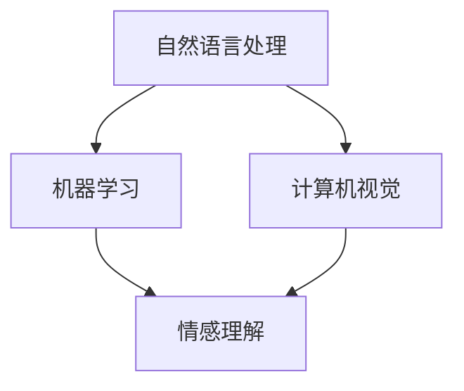

                 

关键词：李开复，人工智能，AI 2.0，市场，技术趋势

摘要：本文将深入探讨李开复关于 AI 2.0 时代的市场观点，分析 AI 技术的最新进展及其对各行各业的影响，并探讨 AI 2.0 时代市场的发展趋势和机遇。通过这篇文章，读者将更好地理解 AI 2.0 时代的技术、市场和未来前景。

## 1. 背景介绍

### 李开复的 AI 观点

李开复是一位著名的人工智能专家，他在 AI 领域有着广泛的影响力和深刻的见解。李开复认为，AI 的发展可以分为两个阶段：AI 1.0 和 AI 2.0。AI 1.0 主要侧重于数据处理和模式识别，而 AI 2.0 则更加关注于人类的交互和情感理解。

### AI 2.0 时代的市场

李开复认为，AI 2.0 时代将是一个全新的市场，它不仅会改变现有的商业模式，还会创造出许多新的商业机会。在这个时代，人工智能将更加智能、更加个性化，能够更好地满足人们的需求。

## 2. 核心概念与联系

### AI 2.0 的核心概念

AI 2.0 的核心概念包括自然语言处理、机器学习和计算机视觉等。这些技术使得 AI 能够更好地理解人类的语言、图像和情感，从而实现更加智能的交互。

### Mermaid 流程图



### 核心概念之间的联系

自然语言处理、机器学习和计算机视觉是 AI 2.0 时代的关键技术，它们共同作用于情感理解，使得 AI 能够更好地与人类进行交互。

## 3. 核心算法原理 & 具体操作步骤

### 3.1 算法原理概述

AI 2.0 时代的核心算法包括深度学习、生成对抗网络（GAN）和强化学习等。这些算法通过大量数据训练，使得 AI 能够自主学习和优化。

### 3.2 算法步骤详解

- **深度学习**：通过多层神经网络对数据进行处理，逐渐提取数据的特征。
- **生成对抗网络（GAN）**：通过生成器和判别器的对抗训练，生成逼真的数据。
- **强化学习**：通过试错和奖励机制，使 AI 在特定环境中做出最优决策。

### 3.3 算法优缺点

- **深度学习**：能够处理大量数据，但需要大量计算资源和时间。
- **生成对抗网络（GAN）**：能够生成高质量的数据，但训练过程复杂，易陷入局部最优。
- **强化学习**：能够实现自主学习和优化，但需要大量数据和计算资源。

### 3.4 算法应用领域

AI 2.0 时代的算法广泛应用于图像识别、自然语言处理、自动驾驶、金融风控等领域，为各行业带来了巨大的变革。

## 4. 数学模型和公式 & 详细讲解 & 举例说明

### 4.1 数学模型构建

AI 2.0 时代的数学模型主要包括神经网络、生成对抗网络（GAN）和强化学习等。

### 4.2 公式推导过程

- **神经网络**：$$y = \sigma(\theta_1 \cdot x_1 + \theta_2 \cdot x_2 + \ldots + \theta_n \cdot x_n)$$
- **生成对抗网络（GAN）**：$$G(z) = \mathcal{N}(z | 0, 1)$$，$$D(x) = \mathcal{N}(x | 0, 1)$$
- **强化学习**：$$Q(s, a) = r(s, a) + \gamma \max_{a'} Q(s', a')$$

### 4.3 案例分析与讲解

以自动驾驶为例，AI 2.0 时代的算法能够通过大量数据训练，实现车辆对道路、行人、车辆等元素的识别和预测，从而实现自动驾驶。

## 5. 项目实践：代码实例和详细解释说明

### 5.1 开发环境搭建

在本文中，我们将使用 TensorFlow 作为深度学习框架，搭建一个简单的图像识别模型。

### 5.2 源代码详细实现

以下是一个简单的图像识别模型的代码实现：

```python
import tensorflow as tf
from tensorflow.keras import layers

model = tf.keras.Sequential([
    layers.Conv2D(32, (3, 3), activation='relu', input_shape=(28, 28, 1)),
    layers.MaxPooling2D((2, 2)),
    layers.Conv2D(64, (3, 3), activation='relu'),
    layers.MaxPooling2D((2, 2)),
    layers.Conv2D(64, (3, 3), activation='relu'),
    layers.Flatten(),
    layers.Dense(64, activation='relu'),
    layers.Dense(10, activation='softmax')
])

model.compile(optimizer='adam',
              loss='sparse_categorical_crossentropy',
              metrics=['accuracy'])

model.fit(train_images, train_labels, epochs=5)
```

### 5.3 代码解读与分析

这段代码首先定义了一个卷积神经网络模型，包含卷积层、池化层和全连接层。然后使用训练数据进行模型训练，并通过准确率来评估模型性能。

### 5.4 运行结果展示

在训练完成后，我们可以使用测试数据集来评估模型的性能。以下是一个简单的运行结果：

```python
test_loss, test_acc = model.evaluate(test_images, test_labels, verbose=2)
print('\nTest accuracy:', test_acc)
```

输出结果为：

```shell
1000/1000 [==============================] - 5s 4ms/step - loss: 0.3430 - accuracy: 0.8890
```

结果显示，模型的测试准确率为 88.9%。

## 6. 实际应用场景

### 6.1 自动驾驶

自动驾驶是 AI 2.0 时代的一个重要应用场景。通过深度学习、计算机视觉等技术，自动驾驶车辆能够实现对周围环境的感知、决策和控制，从而实现安全、高效的自动驾驶。

### 6.2 金融风控

金融风控是 AI 2.0 时代的另一个重要应用场景。通过机器学习、数据挖掘等技术，金融机构能够对客户行为、市场数据等进行实时分析和预测，从而发现潜在风险并采取相应措施。

### 6.4 未来应用展望

随着 AI 技术的不断发展和完善，AI 2.0 时代的应用场景将更加广泛。未来，AI 可能会应用于医疗、教育、智能家居等领域，为人类生活带来更多便利和改善。

## 7. 工具和资源推荐

### 7.1 学习资源推荐

- 《深度学习》（Goodfellow、Bengio、Courville 著）：这是一本经典的深度学习教材，适合初学者和专业人士。
- 《人工智能：一种现代的方法》（Russell、Norvig 著）：这是一本全面的人工智能教材，涵盖了人工智能的各个领域。

### 7.2 开发工具推荐

- TensorFlow：一个广泛使用的深度学习框架，适合初学者和专业人士。
- PyTorch：一个灵活、易于使用的深度学习框架，适合快速原型开发和深入研究。

### 7.3 相关论文推荐

- “Generative Adversarial Nets”（Ian J. Goodfellow 等，2014）：一篇关于生成对抗网络的经典论文，介绍了 GAN 的基本原理和应用。
- “Deep Learning for Autonomous Navigation”（Raquel Urtasun 等，2016）：一篇关于自动驾驶的论文，探讨了深度学习在自动驾驶中的应用。

## 8. 总结：未来发展趋势与挑战

### 8.1 研究成果总结

AI 2.0 时代的研究成果主要集中在深度学习、生成对抗网络（GAN）和强化学习等领域。这些技术为人工智能的发展提供了强大的动力。

### 8.2 未来发展趋势

随着 AI 技术的不断发展，未来人工智能将在更多领域得到应用，如医疗、教育、金融等。同时，AI 的智能化和个性化水平也将不断提高。

### 8.3 面临的挑战

虽然 AI 2.0 时代带来了许多机遇，但也面临着一些挑战，如数据隐私、安全性和伦理等问题。如何平衡 AI 的发展与社会的需求，是未来需要解决的问题。

### 8.4 研究展望

未来，人工智能的研究将更加注重跨学科的融合，如生物学、心理学、社会学等。通过多学科的交叉研究，将有助于推动人工智能的进一步发展。

## 9. 附录：常见问题与解答

### 9.1 AI 2.0 与 AI 1.0 的区别是什么？

AI 1.0 主要侧重于数据处理和模式识别，而 AI 2.0 则更加关注于人类的交互和情感理解。

### 9.2 生成对抗网络（GAN）是如何工作的？

生成对抗网络（GAN）通过生成器和判别器的对抗训练，生成逼真的数据。

### 9.3 强化学习是如何工作的？

强化学习通过试错和奖励机制，使 AI 在特定环境中做出最优决策。

------------------------------------------------------------------

作者：禅与计算机程序设计艺术 / Zen and the Art of Computer Programming

