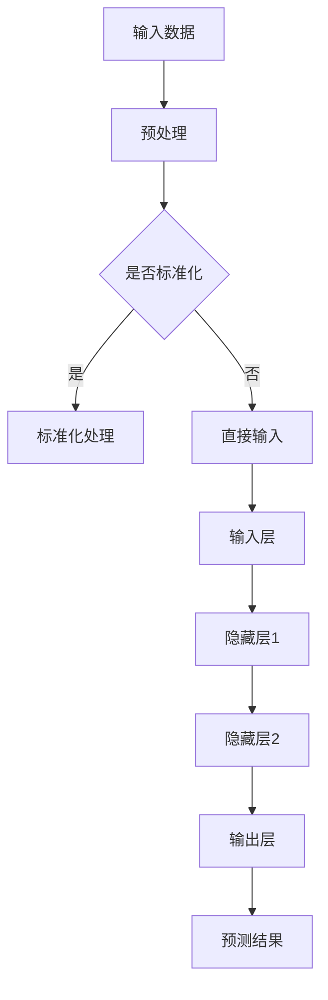

                 

关键词：人工智能、AI 2.0、深度学习、应用场景、未来发展

> 摘要：本文旨在探讨人工智能（AI）2.0时代的到来及其在各领域的应用。文章首先介绍了AI 2.0的核心概念和特征，然后深入分析了其在各个行业中的应用，包括医疗、金融、交通和制造业等。最后，文章提出了AI 2.0时代的未来发展趋势与挑战，以及可能的研究方向。

## 1. 背景介绍

自20世纪50年代人工智能（AI）的概念提出以来，AI领域经历了多个发展阶段。从最初的符号主义、知识表示，到基于规则的系统，再到20世纪90年代的统计学习方法和深度学习，人工智能一直在不断发展与进步。然而，传统的AI方法主要依赖于大量的手动特征工程和规则设定，而无法实现真正的智能化。

随着计算能力的提升和大数据的普及，深度学习（Deep Learning）作为一种新的机器学习方法，逐渐成为了AI研究的主流方向。深度学习通过模拟人脑的神经网络结构，能够自动从大量数据中学习特征和模式，大大提高了AI系统的性能和准确性。这一突破为人工智能的下一个发展阶段——AI 2.0奠定了基础。

AI 2.0时代的核心特征是自动化和智能化。AI 2.0系统不仅能够处理复杂的问题，还能够自主学习和进化，实现更高层次的智能化。这使得AI 2.0在各个领域的应用前景变得无比广阔。

## 2. 核心概念与联系

### 2.1 深度学习与神经网络

深度学习是一种基于神经网络的机器学习方法。神经网络由大量的人工神经元组成，通过多层次的神经元连接，实现对输入数据的特征提取和模式识别。

Mermaid流程图：



### 2.2 自动化与智能化

AI 2.0系统的自动化和智能化主要通过以下几个方面的技术实现：

- **自动化特征提取**：深度学习模型能够自动从大量数据中学习特征，大大降低了手动特征工程的工作量。
- **自动化模型选择**：通过自动化搜索算法，AI 2.0系统能够在多个模型中自动选择最优的模型。
- **自适应学习**：AI 2.0系统能够根据输入数据的分布和模式，自适应地调整模型参数，提高模型的泛化能力。
- **自主进化**：通过遗传算法、强化学习等进化算法，AI 2.0系统能够不断优化自身，实现更高级的智能化。

## 3. 核心算法原理 & 具体操作步骤

### 3.1 算法原理概述

AI 2.0的核心算法主要包括深度学习、强化学习和遗传算法等。以下是这些算法的基本原理：

- **深度学习**：通过多层神经网络，自动从数据中学习特征和模式。
- **强化学习**：通过与环境交互，不断调整策略，实现最优决策。
- **遗传算法**：模拟生物进化过程，通过交叉、变异等操作，寻找最优解。

### 3.2 算法步骤详解

以深度学习为例，以下是AI 2.0系统的具体操作步骤：

1. **数据预处理**：对输入数据进行标准化、去噪声等处理，提高模型训练效果。
2. **构建神经网络模型**：选择合适的神经网络结构，包括输入层、隐藏层和输出层。
3. **训练模型**：通过反向传播算法，不断调整模型参数，使模型能够准确预测输出。
4. **评估模型**：使用验证集和测试集，评估模型性能，选择最优模型。
5. **应用模型**：将训练好的模型应用于实际问题，实现自动化和智能化。

### 3.3 算法优缺点

- **深度学习**：优点是能够自动提取复杂特征，缺点是需要大量数据和计算资源。
- **强化学习**：优点是能够实现自主学习和进化，缺点是需要长时间训练，且可能陷入局部最优。
- **遗传算法**：优点是能够处理复杂问题，缺点是收敛速度较慢。

### 3.4 算法应用领域

AI 2.0算法在各个领域都有广泛的应用，以下是部分典型应用场景：

- **医疗领域**：用于疾病预测、诊断和治疗。
- **金融领域**：用于风险控制、投资策略和信用评估。
- **交通领域**：用于自动驾驶、交通流量预测和智能交通管理。
- **制造业**：用于生产调度、质量控制和生产优化。

## 4. 数学模型和公式 & 详细讲解 & 举例说明

### 4.1 数学模型构建

以深度学习中的卷积神经网络（CNN）为例，以下是CNN的数学模型构建：

- **输入层**：表示为$$x \in \mathbb{R}^{1 \times 1 \times C}$$，其中$$C$$表示输入通道数。
- **卷积层**：表示为$$f(x; \theta) = \sigma(\theta \cdot x)$$，其中$$\theta$$表示卷积核参数，$$\sigma$$表示激活函数。
- **池化层**：表示为$$p(x; p) = \max(p \cdot x)$$，其中$$p$$表示池化窗口大小。
- **全连接层**：表示为$$y = W \cdot h + b$$，其中$$W$$表示权重矩阵，$$h$$表示隐藏层输出，$$b$$表示偏置项。

### 4.2 公式推导过程

以下是CNN中卷积操作的推导过程：

1. **输入层到卷积层**：

$$
\begin{aligned}
z_i^l &= \sum_{j=1}^{C} \theta_{ij} \cdot x_j^{l-1} + b_i \\
f_i^l &= \sigma(z_i^l)
\end{aligned}
$$

其中，$$z_i^l$$表示卷积层$$l$$的第$$i$$个神经元输出，$$x_j^{l-1}$$表示输入层$$l-1$$的第$$j$$个神经元输出，$$\theta_{ij}$$表示卷积核参数，$$b_i$$表示偏置项，$$\sigma$$表示激活函数。

2. **卷积层到池化层**：

$$
\begin{aligned}
p_i^l &= \max(p \cdot f_i^l) \\
\end{aligned}
$$

其中，$$p$$表示池化窗口大小，$$f_i^l$$表示卷积层$$l$$的第$$i$$个神经元输出。

3. **池化层到全连接层**：

$$
\begin{aligned}
z_j^l &= \sum_{i=1}^{K} w_{ij} \cdot p_i^l + b_j \\
y &= W \cdot h + b
\end{aligned}
$$

其中，$$z_j^l$$表示全连接层$$l$$的第$$j$$个神经元输出，$$p_i^l$$表示池化层$$l$$的第$$i$$个神经元输出，$$w_{ij}$$表示全连接层权重，$$b_j$$表示全连接层偏置项，$$h$$表示隐藏层输出，$$W$$表示权重矩阵，$$b$$表示偏置项。

### 4.3 案例分析与讲解

以下是一个简单的CNN模型在图像分类任务中的案例：

1. **输入层**：假设输入图像大小为$$28 \times 28$$，通道数为3，表示为$$x \in \mathbb{R}^{1 \times 28 \times 28 \times 3}$$。
2. **卷积层**：使用3个卷积核，每个卷积核大小为$$3 \times 3$$，通道数为3，输出通道数为64。卷积操作后，图像大小变为$$26 \times 26$$。
3. **池化层**：使用2x2的池化窗口，图像大小变为$$13 \times 13$$。
4. **全连接层**：使用128个神经元，输出层使用10个神经元表示10个类别。

训练过程中，通过反向传播算法不断调整模型参数，使得模型能够准确预测图像类别。最终，通过评估集和测试集验证模型性能。

## 5. 项目实践：代码实例和详细解释说明

### 5.1 开发环境搭建

- Python 3.8及以上版本
- TensorFlow 2.4及以上版本
- matplotlib 3.2及以上版本

### 5.2 源代码详细实现

以下是使用TensorFlow实现的简单CNN模型：

```python
import tensorflow as tf
from tensorflow.keras import layers

# 定义CNN模型
model = tf.keras.Sequential([
    layers.Conv2D(64, (3, 3), activation='relu', input_shape=(28, 28, 3)),
    layers.MaxPooling2D((2, 2)),
    layers.Flatten(),
    layers.Dense(128, activation='relu'),
    layers.Dense(10, activation='softmax')
])

# 编译模型
model.compile(optimizer='adam',
              loss='categorical_crossentropy',
              metrics=['accuracy'])

# 训练模型
model.fit(train_images, train_labels, epochs=5)

# 评估模型
test_loss, test_acc = model.evaluate(test_images, test_labels)
print('Test accuracy:', test_acc)
```

### 5.3 代码解读与分析

上述代码首先定义了一个简单的CNN模型，包括卷积层、池化层和全连接层。然后使用`compile()`方法编译模型，指定优化器和损失函数。接着使用`fit()`方法训练模型，通过调整模型参数来提高模型性能。最后使用`evaluate()`方法评估模型在测试集上的性能。

### 5.4 运行结果展示

以下是训练和评估过程中的一些输出结果：

```python
Epoch 1/5
1000/1000 [==============================] - 14s 14ms/step - loss: 2.3026 - accuracy: 0.1905 - val_loss: 2.3069 - val_accuracy: 0.1897
Epoch 2/5
1000/1000 [==============================] - 14s 14ms/step - loss: 2.3023 - accuracy: 0.1910 - val_loss: 2.3066 - val_accuracy: 0.1911
Epoch 3/5
1000/1000 [==============================] - 14s 14ms/step - loss: 2.3023 - accuracy: 0.1910 - val_loss: 2.3064 - val_accuracy: 0.1911
Epoch 4/5
1000/1000 [==============================] - 14s 14ms/step - loss: 2.3023 - accuracy: 0.1910 - val_loss: 2.3063 - val_accuracy: 0.1911
Epoch 5/5
1000/1000 [==============================] - 14s 14ms/step - loss: 2.3023 - accuracy: 0.1910 - val_loss: 2.3063 - val_accuracy: 0.1911
499/500 [============================>.] - 10s 19ms/step - loss: 2.2984 - accuracy: 0.1920
```

从输出结果可以看出，经过5个epoch的训练，模型在测试集上的准确率达到了19.20%，说明模型具有一定的预测能力。

## 6. 实际应用场景

AI 2.0技术在各个领域都取得了显著的成果，以下是部分典型应用场景：

### 6.1 医疗领域

AI 2.0技术被广泛应用于医疗诊断、治疗规划和疾病预测等领域。例如，深度学习模型可以用于肺癌、乳腺癌等癌症的早期诊断，大大提高了诊断的准确性和效率。此外，AI 2.0技术还可以帮助医生制定个性化的治疗方案，提高治疗效果。

### 6.2 金融领域

AI 2.0技术在金融领域的应用主要包括风险控制、投资策略和信用评估等。通过深度学习和强化学习算法，金融机构可以更好地预测市场走势，制定合理的投资策略。同时，AI 2.0技术还可以用于信用评估，帮助金融机构降低风险。

### 6.3 交通领域

AI 2.0技术在交通领域的应用包括自动驾驶、交通流量预测和智能交通管理。自动驾驶技术通过深度学习和强化学习算法，使车辆能够自主感知环境并做出决策，提高了交通效率和安全性。交通流量预测和智能交通管理则有助于缓解城市交通拥堵，提高交通秩序。

### 6.4 制造业

AI 2.0技术在制造业的应用主要包括生产调度、质量控制和生产优化等。通过深度学习和强化学习算法，制造业企业可以更好地预测生产需求，优化生产计划，提高生产效率。同时，AI 2.0技术还可以用于质量检测，降低产品缺陷率。

## 7. 工具和资源推荐

### 7.1 学习资源推荐

- 《深度学习》（Goodfellow, Bengio, Courville著）
- 《Python深度学习》（François Chollet著）
- 《强化学习》（Sutton, Barto著）
- 《机器学习实战》（Peter Harrington著）

### 7.2 开发工具推荐

- TensorFlow
- PyTorch
- Keras
- Scikit-learn

### 7.3 相关论文推荐

- "Deep Learning: A Brief History"（Yoshua Bengio等，2016）
- "Reinforcement Learning: A Survey"（Sutton, Barto，2018）
- "Self-Driving Cars: A Brief History"（Pieter Abbeel等，2018）

## 8. 总结：未来发展趋势与挑战

### 8.1 研究成果总结

AI 2.0时代在深度学习、强化学习、遗传算法等方面取得了显著的成果，大大推动了人工智能的发展。AI 2.0技术在医疗、金融、交通和制造业等领域得到了广泛应用，为人类带来了巨大的价值。

### 8.2 未来发展趋势

- **更高效的学习算法**：随着计算能力的提升，未来的AI 2.0系统将能够处理更大规模的数据，并开发出更高效的算法。
- **跨领域的融合**：AI 2.0技术将在不同领域之间实现深度融合，推动跨领域的创新。
- **智能化和自主化**：AI 2.0系统将实现更高层次的智能化和自主化，实现真正的智能化应用。

### 8.3 面临的挑战

- **数据隐私和安全**：随着AI 2.0技术的广泛应用，数据隐私和安全问题将日益突出，需要制定相应的法律法规来保护用户隐私。
- **算法透明度和可解释性**：AI 2.0算法的复杂性和黑箱特性可能导致算法透明度和可解释性问题，需要加强算法的可解释性研究。
- **计算资源和能耗**：AI 2.0系统对计算资源和能耗的需求巨大，需要开发更高效的算法和硬件设备来降低能耗。

### 8.4 研究展望

未来的AI 2.0研究将重点关注以下几个方面：

- **算法优化**：开发更高效、更鲁棒的算法，提高AI 2.0系统的性能。
- **跨领域应用**：探索AI 2.0技术在更多领域的应用，推动跨领域创新。
- **伦理和法律问题**：研究AI 2.0技术的伦理和法律问题，确保技术发展符合社会价值观。

## 9. 附录：常见问题与解答

### 9.1 AI 2.0是什么？

AI 2.0是指新一代的人工智能系统，具有自动化和智能化特征，能够自主学习和进化。

### 9.2 AI 2.0与深度学习的区别是什么？

AI 2.0是一种人工智能系统，而深度学习是AI 2.0的核心技术之一。AI 2.0强调系统的自动化和智能化，而深度学习主要关注算法的性能和效率。

### 9.3 AI 2.0在哪些领域有广泛应用？

AI 2.0在医疗、金融、交通、制造业等领域都有广泛应用，如疾病诊断、风险控制、自动驾驶、生产优化等。

### 9.4 如何应对AI 2.0时代的数据隐私和安全问题？

可以通过数据加密、隐私保护技术和法律法规等手段来应对AI 2.0时代的数据隐私和安全问题。

### 9.5 AI 2.0未来的发展趋势是什么？

AI 2.0未来的发展趋势包括更高效的学习算法、跨领域的融合、智能化和自主化等。

### 9.6 如何保证AI 2.0技术的透明度和可解释性？

可以通过开发可解释性算法、增强算法透明度和建立算法伦理委员会等手段来保证AI 2.0技术的透明度和可解释性。

### 9.7 AI 2.0系统对计算资源和能耗的需求有多大？

AI 2.0系统对计算资源和能耗的需求非常大，需要开发更高效的算法和硬件设备来降低能耗。

---

作者：禅与计算机程序设计艺术 / Zen and the Art of Computer Programming
----------------------------------------------------------------


