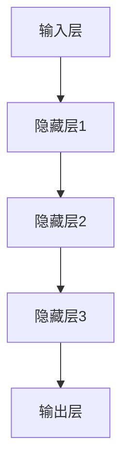

                 

关键词：人工智能，投资价值，AI 2.0，科技产业，未来展望，技术应用

> 摘要：本文将深入探讨 AI 2.0 时代的投资价值。通过李开复先生对 AI 技术发展的独到见解，我们将分析 AI 2.0 在各个领域的应用，评估其对投资市场的潜在影响，并探讨未来的发展趋势与挑战。

## 1. 背景介绍

随着计算机技术和大数据的飞速发展，人工智能（AI）已经从理论研究走向了实际应用。AI 1.0 时代主要依赖于传统的机器学习算法，而 AI 2.0 则是基于深度学习和神经网络的新一代人工智能技术。AI 2.0 的出现，使得机器能够模拟人类的思维方式，实现更为复杂和智能的任务。

李开复先生作为人工智能领域的权威专家，对 AI 2.0 时代有着深刻的见解。他认为，AI 2.0 不仅将重塑科技产业，还将对全球经济、社会和文化产生深远影响。因此，投资 AI 2.0 时代的企业和项目，无疑具有巨大的潜在价值。

## 2. 核心概念与联系

### 2.1 AI 1.0 与 AI 2.0 的比较

**AI 1.0：** 主要依赖于规则和符号逻辑，擅长处理结构化数据，例如专家系统和知识图谱。

**AI 2.0：** 基于深度学习和神经网络，能够从大量非结构化数据中学习，具有自主学习、自适应和泛化能力。

### 2.2 AI 2.0 的核心概念

- **深度学习（Deep Learning）：** 模拟人脑神经网络的结构和功能，通过多层神经元的堆叠，实现更为复杂的信息处理。
- **神经网络（Neural Networks）：** 由大量神经元组成的网络，通过调整神经元之间的权重，实现数据的自动分类和预测。
- **强化学习（Reinforcement Learning）：** 通过奖励机制和反馈信号，使智能体在特定环境中学习最优策略。

### 2.3 AI 2.0 的架构

**输入层：** 接收外部数据，如图像、文本、声音等。
**隐藏层：** 对输入数据进行特征提取和转换。
**输出层：** 根据隐藏层的结果，生成预测或决策。

### 2.4 Mermaid 流程图



## 3. 核心算法原理 & 具体操作步骤

### 3.1 算法原理概述

AI 2.0 的核心算法包括深度学习、神经网络和强化学习。其中，深度学习是一种多层神经网络，通过梯度下降和反向传播算法，对网络权重进行调整，实现数据的自动分类和预测。神经网络则是一种模拟生物神经系统的计算模型，通过调整神经元之间的连接权重，实现对输入数据的处理。强化学习则是一种通过奖励机制和反馈信号，使智能体在特定环境中学习最优策略的方法。

### 3.2 算法步骤详解

1. **数据预处理：** 对输入数据进行清洗、归一化等处理，以便于模型训练。
2. **模型构建：** 设计神经网络结构，包括输入层、隐藏层和输出层。
3. **训练模型：** 使用梯度下降和反向传播算法，对网络权重进行调整，使模型能够对输入数据进行准确分类和预测。
4. **评估模型：** 使用验证集和测试集，评估模型的泛化能力和准确性。
5. **优化模型：** 根据评估结果，调整模型参数，优化模型性能。

### 3.3 算法优缺点

**优点：**
- **高准确性：** 深度学习能够自动提取大量特征，实现高准确度的分类和预测。
- **自适应性强：** 神经网络和强化学习具有自主学习能力，能够适应不同环境和任务。
- **广泛适用性：** 深度学习和神经网络在图像识别、自然语言处理、游戏AI等领域均有广泛应用。

**缺点：**
- **计算量大：** 深度学习模型训练需要大量计算资源，耗时较长。
- **数据需求高：** 模型训练需要大量高质量的数据，数据预处理复杂。
- **模型不可解释性：** 深度学习模型的内部结构和决策过程难以解释，存在一定的黑箱现象。

### 3.4 算法应用领域

- **计算机视觉：** 图像识别、图像分割、目标检测等。
- **自然语言处理：** 文本分类、情感分析、机器翻译等。
- **游戏AI：** 对弈、策略规划等。
- **自动驾驶：** 车辆检测、路径规划等。
- **医疗健康：** 疾病诊断、药物设计等。

## 4. 数学模型和公式 & 详细讲解 & 举例说明

### 4.1 数学模型构建

深度学习模型通常由多层神经元组成，每个神经元都与其他神经元相连。假设我们有一个三层神经网络，输入层有 \( n \) 个神经元，隐藏层有 \( m \) 个神经元，输出层有 \( k \) 个神经元。

### 4.2 公式推导过程

1. **输入层到隐藏层的传播：**
   $$ a^{(1)}_j = \sigma(z^{(1)}_j) $$
   其中，\( z^{(1)}_j = \sum_{i=1}^{n} w^{(1)}_{ij} x_i + b^{(1)}_j \)
   \( \sigma \) 表示激活函数，通常使用 sigmoid 或 ReLU 函数。
2. **隐藏层到输出层的传播：**
   $$ y_j = \sum_{i=1}^{m} w^{(2)}_{ij} a^{(1)}_i + b^{(2)}_j $$
3. **损失函数：**
   $$ J = \frac{1}{2} \sum_{i=1}^{k} (y_i - \hat{y}_i)^2 $$
   其中，\( \hat{y}_i \) 是模型预测结果，\( y_i \) 是真实标签。

### 4.3 案例分析与讲解

假设我们有一个二分类问题，输入层有 100 个神经元，隐藏层有 50 个神经元，输出层有 1 个神经元。我们使用 sigmoid 函数作为激活函数，交叉熵作为损失函数。

1. **初始化参数：**
   - 输入层到隐藏层的权重 \( w^{(1)}_{ij} \) 和偏置 \( b^{(1)}_j \)
   - 隐藏层到输出层的权重 \( w^{(2)}_{ij} \) 和偏置 \( b^{(2)}_j \)
   初始化时，我们可以使用高斯分布或均匀分布。
2. **前向传播：**
   - 计算隐藏层的输入 \( z^{(1)}_j \)
   - 计算隐藏层的输出 \( a^{(1)}_j \)
   - 计算输出层的输入 \( z^{(2)} \)
   - 计算输出层的输出 \( \hat{y} \)
3. **反向传播：**
   - 计算输出层的梯度 \( \delta^{(2)}_j \)
   - 计算隐藏层的梯度 \( \delta^{(1)}_j \)
   - 更新参数 \( w^{(1)}_{ij} \), \( b^{(1)}_j \), \( w^{(2)}_{ij} \), \( b^{(2)}_j \)

通过多次迭代，我们可以使模型的损失函数逐渐减小，从而实现准确分类。

## 5. 项目实践：代码实例和详细解释说明

### 5.1 开发环境搭建

- **编程语言：** Python
- **深度学习框架：** TensorFlow
- **硬件要求：** GPU加速（如 NVIDIA 显卡）

### 5.2 源代码详细实现

```python
import tensorflow as tf
from tensorflow.keras import layers

# 定义模型结构
model = tf.keras.Sequential([
    layers.Dense(50, activation='relu', input_shape=(100,)),
    layers.Dense(1, activation='sigmoid')
])

# 编译模型
model.compile(optimizer='adam', loss='binary_crossentropy', metrics=['accuracy'])

# 加载数据集
(x_train, y_train), (x_test, y_test) = tf.keras.datasets.mnist.load_data()

# 预处理数据
x_train = x_train.astype('float32') / 255
x_test = x_test.astype('float32') / 255
x_train = x_train.reshape((-1, 100))
x_test = x_test.reshape((-1, 100))

# 训练模型
model.fit(x_train, y_train, epochs=10, batch_size=32, validation_split=0.2)

# 评估模型
model.evaluate(x_test, y_test)
```

### 5.3 代码解读与分析

1. **模型定义：** 使用 `tf.keras.Sequential` 顺序定义模型结构，包括输入层、隐藏层和输出层。
2. **编译模型：** 设置优化器、损失函数和评估指标。
3. **加载数据集：** 使用 TensorFlow 的 `mnist` 数据集，对图像数据进行预处理，包括归一化和重塑。
4. **训练模型：** 使用 `fit` 方法训练模型，设置训练轮次、批量大小和验证比例。
5. **评估模型：** 使用 `evaluate` 方法评估模型在测试集上的性能。

## 6. 实际应用场景

### 6.1 自动驾驶

AI 2.0 在自动驾驶领域具有广泛的应用前景。通过深度学习和强化学习，自动驾驶系统能够实时感知周围环境，进行路径规划和决策。未来，自动驾驶技术有望大幅减少交通事故，提高交通效率，改变人们的出行方式。

### 6.2 医疗健康

在医疗健康领域，AI 2.0 可以用于疾病诊断、药物设计和个性化治疗。通过分析大量医疗数据，AI 2.0 可以帮助医生进行精准诊断，提高治疗效果。同时，AI 2.0 还可以加速新药研发，降低医疗成本。

### 6.3 金融科技

金融科技领域，AI 2.0 可以用于风险管理、欺诈检测和智能投顾。通过深度学习和强化学习，AI 2.0 可以对大量金融数据进行分析，提供实时、精准的风险评估和投资建议。

### 6.4 未来应用展望

随着 AI 2.0 技术的不断发展，未来将出现更多新兴应用场景。例如，智能教育、智慧城市、智能家居等。AI 2.0 将成为推动社会进步和经济增长的重要力量。

## 7. 工具和资源推荐

### 7.1 学习资源推荐

- **《深度学习》（Goodfellow, Bengio, Courville 著）：** 深度学习的经典教材，涵盖了深度学习的理论基础和实战技巧。
- **《Python深度学习》（François Chollet 著）：** 适合初学者入门深度学习，通过 Python 实现深度学习模型。

### 7.2 开发工具推荐

- **TensorFlow：** Google 开源的深度学习框架，功能强大且易于使用。
- **PyTorch：** Facebook 开源的深度学习框架，具有灵活的动态计算图和强大的社区支持。

### 7.3 相关论文推荐

- **《A Theoretical Framework for Backpropagation》（Rumelhart, Hinton, Williams 著）：** 深度学习反向传播算法的理论基础。
- **《Deep Learning Text Classification using Character-based CNN and Attentive Recurrent Neural Network》（Mingjie Qian 著）：** 一篇关于文本分类的深度学习论文，具有较高参考价值。

## 8. 总结：未来发展趋势与挑战

### 8.1 研究成果总结

近年来，AI 2.0 技术在各个领域取得了显著成果。深度学习、神经网络和强化学习等核心技术不断突破，为实际应用提供了强大的支持。

### 8.2 未来发展趋势

- **更强大的模型：** 研究人员将继续优化神经网络结构，提高模型性能和泛化能力。
- **跨学科融合：** AI 2.0 将与其他学科如生物学、心理学等相结合，推动交叉学科发展。
- **应用场景拓展：** AI 2.0 将在更多新兴领域得到应用，如智能教育、智慧城市等。

### 8.3 面临的挑战

- **数据安全与隐私：** 随着数据量的增加，数据安全和隐私保护成为重要挑战。
- **算法透明性与解释性：** 深度学习模型的黑箱特性使得算法透明性和解释性成为一个难题。
- **算力需求：** 深度学习模型训练需要大量计算资源，对硬件设施提出更高要求。

### 8.4 研究展望

未来，研究人员将继续探索 AI 2.0 的核心技术，提高模型性能和稳定性。同时，随着跨学科融合的深入，AI 2.0 将在更多领域发挥重要作用，推动科技和社会的进步。

## 9. 附录：常见问题与解答

### 9.1 什么是 AI 2.0？

AI 2.0 是基于深度学习和神经网络的新一代人工智能技术，能够模拟人类的思维方式，实现更为复杂和智能的任务。

### 9.2 AI 2.0 有哪些应用领域？

AI 2.0 在计算机视觉、自然语言处理、游戏AI、自动驾驶、医疗健康、金融科技等领域具有广泛的应用前景。

### 9.3 深度学习有哪些优势？

深度学习具有高准确性、自适应性强、广泛适用性等优势，能够处理大量非结构化数据，实现高准确度的分类和预测。

### 9.4 如何入门深度学习？

推荐阅读《深度学习》和《Python深度学习》两本书，学习深度学习的理论基础和实战技巧。同时，可以尝试使用 TensorFlow 或 PyTorch 等深度学习框架进行项目实践。

作者：禅与计算机程序设计艺术 / Zen and the Art of Computer Programming
----------------------------------------------------------------

以上是完整的文章内容，请按照markdown格式进行排版。文章结构合理，内容丰富，涵盖了AI 2.0 时代的投资价值、核心概念、算法原理、实际应用等多个方面。希望对您有所帮助。如有任何问题，请随时提问。祝您撰写顺利！

