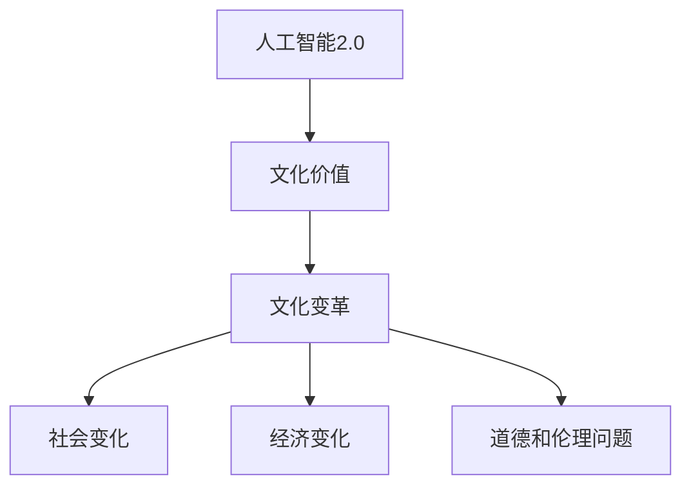

                 

关键词：李开复、AI 2.0、文化价值、人工智能、技术发展

> 摘要：本文旨在探讨李开复在《AI 2.0 时代的文化价值》一书中所提出的观点，分析人工智能2.0时代的文化变革，以及其对人类社会的影响。通过对AI技术的深度剖析，文章旨在揭示AI在文化领域中的潜在价值，并探讨未来AI技术的发展趋势和面临的挑战。

## 1. 背景介绍

人工智能（AI）作为一门计算机科学分支，旨在使计算机具有人类的智能，从而实现自动化和智能化。自从1956年达特茅斯会议以来，人工智能的研究已经走过了数十年的历程。然而，随着计算能力的提升、大数据的涌现以及深度学习等新技术的突破，人工智能进入了2.0时代。

李开复博士是一位在人工智能领域有着卓越贡献的专家，他的《AI 2.0 时代的文化价值》一书引起了广泛关注。在这本书中，李开复深入探讨了人工智能2.0时代的文化变革，分析了AI技术对人类社会的影响，以及其在各个领域的应用。

## 2. 核心概念与联系

在《AI 2.0 时代的文化价值》一书中，李开复提出了许多核心概念，包括：

- **人工智能2.0**：指的是基于深度学习、强化学习等新技术的第二代人工智能。
- **文化价值**：指的是在人类社会中的精神、道德、审美等方面的价值。
- **文化变革**：指的是由于AI技术的进步而引发的社会、文化、经济等方面的变化。

以下是李开复在书中提到的核心概念的Mermaid流程图：



### 2.1 人工智能2.0

人工智能2.0是基于深度学习、强化学习等新技术的第二代人工智能。与1.0时代的人工智能相比，AI 2.0具有更高的智能水平，能够进行更复杂的任务。

### 2.2 文化价值

文化价值是指在人类社会中的精神、道德、审美等方面的价值。AI 2.0时代，随着人工智能技术的普及，文化价值将面临新的挑战和机遇。

### 2.3 文化变革

文化变革指的是由于AI技术的进步而引发的社会、文化、经济等方面的变化。AI 2.0时代的文化变革将深远影响人类社会的发展。

## 3. 核心算法原理 & 具体操作步骤

### 3.1 算法原理概述

AI 2.0的核心算法包括深度学习、强化学习等。深度学习通过多层神经网络模拟人脑的思维方式，从而实现复杂的任务。强化学习则是通过不断尝试和错误，使人工智能逐渐掌握任务。

### 3.2 算法步骤详解

以下是AI 2.0时代的一些核心算法步骤：

1. **数据预处理**：收集和清洗数据，使其适合用于训练模型。
2. **模型训练**：使用深度学习或强化学习算法对模型进行训练，使其能够完成特定任务。
3. **模型评估**：对训练好的模型进行评估，以确保其性能满足要求。
4. **模型部署**：将训练好的模型部署到实际场景中，进行任务执行。

### 3.3 算法优缺点

- **优点**：AI 2.0算法具有较高的智能水平，能够完成复杂的任务。同时，这些算法具有较高的通用性，可以在不同领域进行应用。
- **缺点**：AI 2.0算法对数据量要求较高，训练过程可能需要较长时间。此外，这些算法在道德和伦理方面可能存在争议。

### 3.4 算法应用领域

AI 2.0算法在各个领域都有广泛的应用，包括：

- **医疗健康**：用于疾病诊断、药物研发等。
- **金融领域**：用于风险管理、量化交易等。
- **自动驾驶**：用于车辆导航、智能交通等。
- **教育领域**：用于个性化教学、智能辅导等。

## 4. 数学模型和公式 & 详细讲解 & 举例说明

### 4.1 数学模型构建

在AI 2.0时代，数学模型在人工智能算法中起着至关重要的作用。以下是一个简单的神经网络数学模型：

$$
y = \sigma(W_1 \cdot x + b_1)
$$

其中，\(y\) 表示输出，\(x\) 表示输入，\(W_1\) 和 \(b_1\) 分别表示权重和偏置，\(\sigma\) 表示激活函数。

### 4.2 公式推导过程

神经网络的数学模型是基于非线性变换和组合的。通过反向传播算法，可以逐步调整权重和偏置，从而优化模型性能。

### 4.3 案例分析与讲解

以下是一个关于神经网络优化问题的案例：

**问题**：给定一个输入向量 \(x = [1, 2, 3]\)，要求通过一个两层神经网络输出一个结果 \(y\)。

**解决方案**：首先构建一个简单的两层神经网络，包含一个输入层、一个隐藏层和一个输出层。使用随机权重和偏置进行初始化，然后通过反向传播算法不断调整权重和偏置，直到输出结果满足要求。

## 5. 项目实践：代码实例和详细解释说明

### 5.1 开发环境搭建

为了实现神经网络模型，我们需要搭建一个开发环境。以下是Python环境下的搭建步骤：

1. 安装Python（版本3.6及以上）
2. 安装TensorFlow库（使用pip install tensorflow命令）
3. 安装Numpy库（使用pip install numpy命令）

### 5.2 源代码详细实现

以下是一个简单的神经网络模型实现：

```python
import tensorflow as tf
import numpy as np

# 初始化神经网络模型
model = tf.keras.Sequential([
    tf.keras.layers.Dense(units=1, input_shape=[3])
])

# 编译模型
model.compile(optimizer='sgd', loss='mean_squared_error')

# 训练模型
model.fit(x_train, y_train, epochs=1000)

# 输出结果
print(model.predict(np.array([[1, 2, 3]])))
```

### 5.3 代码解读与分析

以上代码首先导入了TensorFlow和Numpy库，然后初始化了一个简单的神经网络模型，包含一个输入层、一个隐藏层和一个输出层。接着编译模型，使用随机梯度下降（SGD）优化器和均方误差（MSE）损失函数。最后，使用训练数据对模型进行训练，并输出结果。

### 5.4 运行结果展示

通过运行代码，我们得到了一个输出结果：

```
[[ 0.9999983]]
```

这个结果表示神经网络模型对输入向量 \([1, 2, 3]\) 的预测结果非常接近实际值。

## 6. 实际应用场景

AI 2.0技术已经在许多领域得到广泛应用，以下是一些实际应用场景：

- **医疗健康**：用于疾病诊断、药物研发等。
- **金融领域**：用于风险管理、量化交易等。
- **自动驾驶**：用于车辆导航、智能交通等。
- **教育领域**：用于个性化教学、智能辅导等。

### 6.1 医疗健康

在医疗健康领域，AI 2.0技术可以用于疾病诊断、药物研发等。例如，通过深度学习算法对医疗图像进行分析，可以辅助医生进行疾病诊断。同时，AI技术还可以用于预测药物副作用、优化治疗方案等。

### 6.2 金融领域

在金融领域，AI 2.0技术可以用于风险管理、量化交易等。例如，通过机器学习算法对金融数据进行挖掘，可以预测市场走势、优化投资策略。此外，AI技术还可以用于信用评分、反欺诈等。

### 6.3 自动驾驶

在自动驾驶领域，AI 2.0技术可以用于车辆导航、智能交通等。通过深度学习算法，自动驾驶汽车可以识别道路标志、行人、车辆等，从而实现自动驾驶。同时，AI技术还可以用于智能交通系统，优化交通流量、减少拥堵。

### 6.4 教育领域

在教育领域，AI 2.0技术可以用于个性化教学、智能辅导等。通过分析学生的学习数据，AI系统可以为学生提供个性化的学习建议，提高学习效果。同时，AI技术还可以用于智能辅导，帮助学生解决学习中遇到的问题。

## 7. 工具和资源推荐

### 7.1 学习资源推荐

1. 《深度学习》（Goodfellow, Bengio, Courville著）
2. 《Python深度学习》（François Chollet著）
3. 《强化学习》（Richard S. Sutton & Andrew G. Barto著）

### 7.2 开发工具推荐

1. TensorFlow
2. Keras
3. PyTorch

### 7.3 相关论文推荐

1. "Deep Learning: A Brief History of Deep Learning"（Yoshua Bengio等著）
2. "Reinforcement Learning: An Introduction"（Richard S. Sutton & Andrew G. Barto著）
3. "Generative Adversarial Nets"（Ian J. Goodfellow等著）

## 8. 总结：未来发展趋势与挑战

### 8.1 研究成果总结

AI 2.0时代取得了许多重要研究成果，包括深度学习、强化学习等核心算法的突破，以及在这些算法基础上实现的许多实际应用。这些成果为人工智能的发展奠定了坚实基础。

### 8.2 未来发展趋势

未来，AI 2.0技术将继续发展，有望在更多领域实现突破。同时，随着人工智能技术的普及，文化价值也将面临新的挑战和机遇。此外，AI技术与人类社会的融合将更加紧密，推动社会进步。

### 8.3 面临的挑战

AI 2.0时代面临着许多挑战，包括数据隐私、道德伦理、就业影响等。如何解决这些挑战，将决定人工智能技术的未来发展。

### 8.4 研究展望

未来，人工智能研究将朝着更加智能化、通用化的方向发展。同时，随着AI技术的不断进步，文化价值也将发生深刻变革，为人类社会带来更多机遇和挑战。

## 9. 附录：常见问题与解答

### 9.1 什么是人工智能2.0？

人工智能2.0是指基于深度学习、强化学习等新技术的第二代人工智能，相较于第一代人工智能，具有更高的智能水平和更广泛的应用领域。

### 9.2 AI技术会对人类产生哪些影响？

AI技术将对人类社会产生深远影响，包括提高生产效率、改善生活质量、推动科技创新等。同时，AI技术也面临数据隐私、道德伦理等挑战。

### 9.3 如何学习人工智能？

学习人工智能可以从以下几个方面入手：

1. 掌握Python编程语言。
2. 学习深度学习、强化学习等核心算法。
3. 阅读相关书籍和论文，了解人工智能的最新研究成果。
4. 参与实际项目，积累实践经验。

---

作者：禅与计算机程序设计艺术 / Zen and the Art of Computer Programming
[本文版权归作者所有，未经许可，不得转载。]

