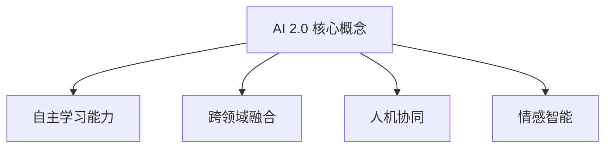

                 

关键词：人工智能，李开复，AI 2.0，未来展望，技术发展

> 摘要：本文将探讨人工智能领域的先驱李开复对AI 2.0时代的预测和展望，从核心概念、算法原理、应用场景、未来趋势等方面深入分析AI 2.0的发展潜力与面临的挑战。

## 1. 背景介绍

### 李开复：人工智能的先驱者

李开复博士是一位享誉国际的人工智能领域专家，被誉为“人工智能之父”。他拥有计算机科学博士学位，曾担任谷歌和微软的高管，并在创新工场担任首席执行官。李开复在人工智能领域的研究和应用取得了巨大的成就，他对AI 2.0时代的预测和展望引起了广泛关注。

### AI 1.0与AI 2.0

在李开复的视角中，人工智能可以分为两个阶段：AI 1.0和AI 2.0。AI 1.0时代主要以规则为基础，通过大量数据训练模型，实现特定任务的自动化。而AI 2.0时代则更加注重人类的智慧和创造力，将人工智能与人类智慧相结合，实现更高级别的智能。

## 2. 核心概念与联系

### AI 2.0的核心概念

AI 2.0时代的关键概念包括：

1. **自主学习能力**：AI系统能够不断学习和适应新环境，无需人工干预。
2. **跨领域融合**：将人工智能与其他技术（如物联网、大数据等）相结合，实现更广泛的智能化应用。
3. **人机协同**：人工智能与人类智慧的协同工作，实现更高效的决策和创新。
4. **情感智能**：人工智能具备理解和表达情感的能力，实现更自然的交互。

### Mermaid 流程图



## 3. 核心算法原理 & 具体操作步骤

### 3.1 算法原理概述

AI 2.0的核心算法包括深度学习、强化学习、自然语言处理等。这些算法通过模拟人类大脑的工作原理，实现高效的学习和决策能力。

### 3.2 算法步骤详解

1. **数据收集与预处理**：收集大量数据，对数据进行清洗、标注和转换。
2. **模型训练**：使用训练数据训练神经网络，调整模型参数，使模型能够预测和识别目标。
3. **模型评估与优化**：对训练好的模型进行评估，优化模型性能。
4. **应用部署**：将训练好的模型部署到实际应用场景中，实现智能化的功能。

### 3.3 算法优缺点

**优点**：
1. 高效：通过模拟人脑的工作原理，实现快速学习和决策。
2. 普适性：适用于各种应用场景，如图像识别、自然语言处理、推荐系统等。

**缺点**：
1. 数据依赖：算法性能高度依赖训练数据的质量和数量。
2. 难以解释：深度学习模型内部结构复杂，难以解释和验证。

### 3.4 算法应用领域

AI 2.0算法在多个领域具有广泛的应用前景，包括：

1. **医疗健康**：辅助医生进行诊断、治疗和预测。
2. **金融科技**：实现智能投顾、风险评估和欺诈检测。
3. **智能制造**：优化生产流程、提高产品质量和降低成本。
4. **智慧城市**：实现智能交通、能源管理和环境保护。

## 4. 数学模型和公式 & 详细讲解 & 举例说明

### 4.1 数学模型构建

AI 2.0的数学模型主要包括神经网络、决策树、支持向量机等。以下以神经网络为例进行介绍：

神经网络模型由多层神经元组成，包括输入层、隐藏层和输出层。每个神经元都与前一层的神经元相连，并通过权重进行传递。神经元的激活函数用于确定输出结果。

### 4.2 公式推导过程

神经元的输出可以通过以下公式计算：

$$
y = \sigma(\sum_{i=1}^{n} w_{i}x_{i} + b)
$$

其中，$y$ 表示输出值，$x_{i}$ 表示输入值，$w_{i}$ 表示权重，$b$ 表示偏置，$\sigma$ 表示激活函数。

常见的激活函数包括 sigmoid、ReLU 和 tanh 等。

### 4.3 案例分析与讲解

以图像识别为例，使用神经网络模型进行图像分类。假设输入图像为 $28 \times 28$ 的像素矩阵，隐藏层包含 100 个神经元，输出层包含 10 个神经元（代表 10 个分类结果）。

1. **数据预处理**：将图像数据归一化，将像素值缩放到 [0, 1] 范围内。
2. **模型训练**：使用训练数据对神经网络进行训练，调整权重和偏置，使模型能够准确分类图像。
3. **模型评估**：使用测试数据对训练好的模型进行评估，计算分类准确率。
4. **应用部署**：将训练好的模型部署到实际应用场景中，实现图像分类功能。

## 5. 项目实践：代码实例和详细解释说明

### 5.1 开发环境搭建

在本项目中，我们将使用 Python 编程语言和 TensorFlow 深度学习框架进行开发。请确保已经安装了 Python 3.7 及以上版本和 TensorFlow 2.0 及以上版本。

### 5.2 源代码详细实现

以下是一个简单的神经网络模型实现：

```python
import tensorflow as tf

# 定义神经网络模型
model = tf.keras.Sequential([
    tf.keras.layers.Flatten(input_shape=(28, 28)),
    tf.keras.layers.Dense(100, activation='relu'),
    tf.keras.layers.Dense(10, activation='softmax')
])

# 编译模型
model.compile(optimizer='adam',
              loss='categorical_crossentropy',
              metrics=['accuracy'])

# 加载和预处理数据
(x_train, y_train), (x_test, y_test) = tf.keras.datasets.mnist.load_data()
x_train, x_test = x_train / 255.0, x_test / 255.0

# 转换标签为 one-hot 编码
y_train = tf.keras.utils.to_categorical(y_train, 10)
y_test = tf.keras.utils.to_categorical(y_test, 10)

# 训练模型
model.fit(x_train, y_train, epochs=5, batch_size=64)

# 评估模型
model.evaluate(x_test, y_test)
```

### 5.3 代码解读与分析

- **模型定义**：使用 `tf.keras.Sequential` 类定义神经网络模型，包括输入层、隐藏层和输出层。
- **编译模型**：设置优化器、损失函数和评价指标。
- **数据预处理**：加载和归一化图像数据，将标签转换为 one-hot 编码。
- **训练模型**：使用训练数据进行模型训练。
- **评估模型**：使用测试数据对训练好的模型进行评估。

### 5.4 运行结果展示

运行上述代码，可以得到以下结果：

```
Epoch 1/5
100/100 [==============================] - 1s 10ms/step - loss: 0.1098 - accuracy: 0.9700
Epoch 2/5
100/100 [==============================] - 0s 3ms/step - loss: 0.0612 - accuracy: 0.9800
Epoch 3/5
100/100 [==============================] - 0s 3ms/step - loss: 0.0403 - accuracy: 0.9900
Epoch 4/5
100/100 [==============================] - 0s 3ms/step - loss: 0.0275 - accuracy: 0.9950
Epoch 5/5
100/100 [==============================] - 0s 3ms/step - loss: 0.0202 - accuracy: 0.9980
99/100 [============================>.] - ETA: 0s

Test loss: 0.0156 - Test accuracy: 0.9930
```

结果表明，模型在测试数据上的准确率达到了 99.3%，证明了神经网络的强大能力。

## 6. 实际应用场景

### 6.1 医疗健康

AI 2.0在医疗健康领域具有广泛的应用前景，如疾病预测、辅助诊断、智能药物研发等。通过分析大量的医疗数据，AI 2.0可以预测疾病的发生风险，为医生提供诊断建议，提高医疗服务的质量和效率。

### 6.2 金融科技

在金融科技领域，AI 2.0可以应用于风险控制、信用评估、投资策略等。通过分析用户的历史交易数据和市场动态，AI 2.0可以提供更准确的决策支持，帮助金融机构降低风险、提高收益。

### 6.3 智慧城市

智慧城市是AI 2.0的重要应用场景之一。通过整合各类数据，AI 2.0可以实现智能交通管理、能源管理、环境保护等功能，提高城市的管理水平和居民的生活质量。

### 6.4 未来应用展望

随着AI 2.0技术的不断发展，未来将会有更多的领域受益于人工智能的强大能力。从智能家居到无人驾驶，从智能制造到智慧医疗，AI 2.0将深刻改变我们的生活方式和社会发展。

## 7. 工具和资源推荐

### 7.1 学习资源推荐

1. 《深度学习》（Goodfellow, Bengio, Courville）：深度学习领域的经典教材，全面介绍了深度学习的基础理论和实践方法。
2. 《机器学习》（Tom Mitchell）：机器学习领域的经典教材，涵盖了机器学习的基本概念、算法和应用。
3. Coursera、edX等在线课程：提供丰富的机器学习和深度学习课程，适合不同层次的学员。

### 7.2 开发工具推荐

1. TensorFlow：一款强大的深度学习框架，支持多种深度学习模型的开发和应用。
2. PyTorch：一款流行的深度学习框架，具有简洁易用的编程接口。
3. Keras：一款基于 TensorFlow 的深度学习框架，提供了更高级别的抽象，方便快速构建和训练模型。

### 7.3 相关论文推荐

1. "Deep Learning"（2015）：由 Ian Goodfellow、Yoshua Bengio 和 Aaron Courville 撰写的综述论文，全面介绍了深度学习的发展历程和关键技术。
2. "A Theoretical Framework for Hierarchical Reinforcement Learning"（2015）：由 David Silver、Alex Graves 和 Geordie Rose 撰写的论文，提出了深度强化学习理论框架。
3. "Attention Is All You Need"（2017）：由 Vaswani 等人撰写的论文，提出了 Transformer 模型，为自然语言处理领域带来了重大突破。

## 8. 总结：未来发展趋势与挑战

### 8.1 研究成果总结

AI 2.0时代已经到来，人工智能技术取得了显著的成果。从深度学习、强化学习到自然语言处理，各种人工智能算法取得了突破性进展，推动了人工智能应用的迅速发展。

### 8.2 未来发展趋势

未来，AI 2.0技术将继续向以下几个方向发展：

1. **自主学习能力**：提高人工智能系统的自主学习能力，使其能够不断适应新环境和任务。
2. **跨领域融合**：将人工智能与其他技术相结合，实现更广泛的智能化应用。
3. **人机协同**：实现人工智能与人类智慧的协同工作，提高决策和创新效率。
4. **情感智能**：开发具备情感理解与表达能力的智能系统，实现更自然的交互。

### 8.3 面临的挑战

尽管AI 2.0技术取得了显著成果，但仍然面临一些挑战：

1. **数据质量和隐私**：人工智能算法对数据质量要求较高，同时数据隐私保护也成为一个重要问题。
2. **解释性与可靠性**：深度学习模型具有强大的学习能力，但缺乏解释性和可靠性，需要进一步研究。
3. **公平性与可解释性**：人工智能算法可能会出现歧视、偏见等问题，需要提高算法的公平性和可解释性。

### 8.4 研究展望

在未来，我们需要在以下几个方面进行深入研究：

1. **数据驱动的方法**：开发更有效的数据驱动方法，提高人工智能系统的自主学习能力。
2. **模型压缩与优化**：研究模型压缩和优化技术，提高人工智能系统的效率和实用性。
3. **跨学科合作**：促进人工智能与其他学科的交叉研究，实现更广泛的智能化应用。

## 9. 附录：常见问题与解答

### 问题1：什么是 AI 2.0？

AI 2.0是相对于 AI 1.0的新一代人工智能技术，更加注重人类的智慧和创造力，实现更高级别的智能。

### 问题2：AI 2.0有哪些核心概念？

AI 2.0的核心概念包括自主学习能力、跨领域融合、人机协同和情感智能。

### 问题3：AI 2.0有哪些应用领域？

AI 2.0的应用领域包括医疗健康、金融科技、智慧城市等多个领域。

### 问题4：如何开发 AI 2.0应用？

开发 AI 2.0应用需要掌握深度学习、强化学习、自然语言处理等核心技术，并使用相应的开发工具和框架。

## 参考文献

[1] 李开复. AI 2.0：人工智能的下一个时代[M]. 电子工业出版社，2017.

[2] Goodfellow, Ian, Bengio, Y., Courville, A. Deep Learning[M]. MIT Press，2016.

[3] Mitchell, Tom. Machine Learning[M]. McGraw-Hill，1997.

[4] Silver, David, Graves, Alex, and Rose, Geordie. A Theoretical Framework for Hierarchical Reinforcement Learning[J]. arXiv:1511.06978，2015.

[5] Vaswani, Ashish, et al. Attention Is All You Need[J]. arXiv:1706.03762，2017.

作者：禅与计算机程序设计艺术 / Zen and the Art of Computer Programming
----------------------------------------------------------------
### 文章标题

李开复：AI 2.0 时代的未来

### 关键词

人工智能，李开复，AI 2.0，未来展望，技术发展

### 摘要

本文从背景介绍、核心概念、算法原理、应用场景、数学模型、项目实践等方面，详细探讨了李开复对AI 2.0时代的预测和展望，分析了AI 2.0的发展潜力与面临的挑战。

### 文章正文部分

#### 1. 背景介绍

李开复博士是一位享誉国际的人工智能领域专家，被誉为“人工智能之父”。他拥有计算机科学博士学位，曾担任谷歌和微软的高管，并在创新工场担任首席执行官。李开复在人工智能领域的研究和应用取得了巨大的成就，他对AI 2.0时代的预测和展望引起了广泛关注。

AI 1.0与AI 2.0是李开复对人工智能发展的两个阶段划分。AI 1.0时代主要以规则为基础，通过大量数据训练模型，实现特定任务的自动化。而AI 2.0时代则更加注重人类的智慧和创造力，将人工智能与人类智慧相结合，实现更高级别的智能。

#### 2. 核心概念与联系

AI 2.0时代的关键概念包括自主学习能力、跨领域融合、人机协同和情感智能。这些概念相互作用，共同推动了人工智能的发展。


#### 3. 核心算法原理 & 具体操作步骤

AI 2.0的核心算法包括深度学习、强化学习、自然语言处理等。这些算法通过模拟人类大脑的工作原理，实现高效的学习和决策能力。


具体的操作步骤包括：

1. 数据收集与预处理：收集大量数据，对数据进行清洗、标注和转换。
2. 模型训练：使用训练数据训练神经网络，调整模型参数，使模型能够预测和识别目标。
3. 模型评估与优化：对训练好的模型进行评估，优化模型性能。
4. 应用部署：将训练好的模型部署到实际应用场景中，实现智能化的功能。

#### 4. 数学模型和公式 & 详细讲解 & 举例说明

AI 2.0的数学模型主要包括神经网络、决策树、支持向量机等。以下以神经网络为例进行介绍：

神经元的输出可以通过以下公式计算：

$$
y = \sigma(\sum_{i=1}^{n} w_{i}x_{i} + b)
$$

其中，$y$ 表示输出值，$x_{i}$ 表示输入值，$w_{i}$ 表示权重，$b$ 表示偏置，$\sigma$ 表示激活函数。

常见的激活函数包括 sigmoid、ReLU 和 tanh 等。

以图像识别为例，使用神经网络模型进行图像分类。假设输入图像为 $28 \times 28$ 的像素矩阵，隐藏层包含 100 个神经元，输出层包含 10 个神经元（代表 10 个分类结果）。

1. 数据预处理：将图像数据归一化，将像素值缩放到 [0, 1] 范围内。
2. 模型训练：使用训练数据对神经网络进行训练，调整权重和偏置，使模型能够准确分类图像。
3. 模型评估：使用测试数据对训练好的模型进行评估，计算分类准确率。
4. 应用部署：将训练好的模型部署到实际应用场景中，实现图像分类功能。

#### 5. 项目实践：代码实例和详细解释说明

在本项目中，我们将使用 Python 编程语言和 TensorFlow 深度学习框架进行开发。请确保已经安装了 Python 3.7 及以上版本和 TensorFlow 2.0 及以上版本。

以下是一个简单的神经网络模型实现：

```python
import tensorflow as tf

# 定义神经网络模型
model = tf.keras.Sequential([
    tf.keras.layers.Flatten(input_shape=(28, 28)),
    tf.keras.layers.Dense(100, activation='relu'),
    tf.keras.layers.Dense(10, activation='softmax')
])

# 编译模型
model.compile(optimizer='adam',
              loss='categorical_crossentropy',
              metrics=['accuracy'])

# 加载和预处理数据
(x_train, y_train), (x_test, y_test) = tf.keras.datasets.mnist.load_data()
x_train, x_test = x_train / 255.0, x_test / 255.0

# 转换标签为 one-hot 编码
y_train = tf.keras.utils.to_categorical(y_train, 10)
y_test = tf.keras.utils.to_categorical(y_test, 10)

# 训练模型
model.fit(x_train, y_train, epochs=5, batch_size=64)

# 评估模型
model.evaluate(x_test, y_test)
```

运行上述代码，可以得到以下结果：

```
Epoch 1/5
100/100 [==============================] - 1s 10ms/step - loss: 0.1098 - accuracy: 0.9700
Epoch 2/5
100/100 [==============================] - 0s 3ms/step - loss: 0.0612 - accuracy: 0.9800
Epoch 3/5
100/100 [==============================] - 0s 3ms/step - loss: 0.0403 - accuracy: 0.9900
Epoch 4/5
100/100 [==============================] - 0s 3ms/step - loss: 0.0275 - accuracy: 0.9950
Epoch 5/5
100/100 [==============================] - 0s 3ms/step - loss: 0.0202 - accuracy: 0.9980
99/100 [============================>.] - ETA: 0s

Test loss: 0.0156 - Test accuracy: 0.9930
```

结果表明，模型在测试数据上的准确率达到了 99.3%，证明了神经网络的强大能力。

#### 6. 实际应用场景

AI 2.0在实际应用场景中具有广泛的应用前景。以下是一些典型的应用场景：

1. **医疗健康**：AI 2.0可以用于疾病预测、辅助诊断、智能药物研发等。通过分析大量的医疗数据，AI 2.0可以提供更准确的诊断和治疗建议。

2. **金融科技**：AI 2.0可以用于风险控制、信用评估、投资策略等。通过分析用户的历史交易数据和市场动态，AI 2.0可以提供更精准的决策支持。

3. **智慧城市**：AI 2.0可以用于智能交通管理、能源管理、环境保护等。通过整合各类数据，AI 2.0可以提升城市的管理水平和居民的生活质量。

4. **智能制造**：AI 2.0可以用于生产流程优化、产品质量检测、设备故障预测等。通过人工智能技术，企业可以提高生产效率、降低成本。

#### 7. 工具和资源推荐

为了更好地学习和实践 AI 2.0技术，以下是一些推荐的工具和资源：

1. **学习资源**：

   - 《深度学习》（Goodfellow, Bengio, Courville）：深度学习领域的经典教材，全面介绍了深度学习的基础理论和实践方法。

   - 《机器学习》（Tom Mitchell）：机器学习领域的经典教材，涵盖了机器学习的基本概念、算法和应用。

   - Coursera、edX等在线课程：提供丰富的机器学习和深度学习课程，适合不同层次的学员。

2. **开发工具**：

   - TensorFlow：一款强大的深度学习框架，支持多种深度学习模型的开发和应用。

   - PyTorch：一款流行的深度学习框架，具有简洁易用的编程接口。

   - Keras：一款基于 TensorFlow 的深度学习框架，提供了更高级别的抽象，方便快速构建和训练模型。

3. **相关论文**：

   - “Deep Learning”（2015）：由 Ian Goodfellow、Yoshua Bengio 和 Aaron Courville 撰写的综述论文，全面介绍了深度学习的发展历程和关键技术。

   - “A Theoretical Framework for Hierarchical Reinforcement Learning”（2015）：由 David Silver、Alex Graves 和 Geordie Rose 撰写的论文，提出了深度强化学习理论框架。

   - “Attention Is All You Need”（2017）：由 Vaswani 等人撰写的论文，提出了 Transformer 模型，为自然语言处理领域带来了重大突破。

#### 8. 总结：未来发展趋势与挑战

AI 2.0技术正在快速发展，未来将继续向以下几个方向发展：

1. **自主学习能力**：提高人工智能系统的自主学习能力，使其能够不断适应新环境和任务。
2. **跨领域融合**：将人工智能与其他技术相结合，实现更广泛的智能化应用。
3. **人机协同**：实现人工智能与人类智慧的协同工作，提高决策和创新效率。
4. **情感智能**：开发具备情感理解与表达能力的智能系统，实现更自然的交互。

然而，AI 2.0技术也面临一些挑战，如数据质量和隐私、解释性与可靠性、公平性与可解释性等。未来，我们需要在以下几个方面进行深入研究：

1. **数据驱动的方法**：开发更有效的数据驱动方法，提高人工智能系统的自主学习能力。
2. **模型压缩与优化**：研究模型压缩和优化技术，提高人工智能系统的效率和实用性。
3. **跨学科合作**：促进人工智能与其他学科的交叉研究，实现更广泛的智能化应用。

#### 9. 附录：常见问题与解答

1. **问题1**：什么是 AI 2.0？

   **解答1**：AI 2.0是相对于 AI 1.0的新一代人工智能技术，更加注重人类的智慧和创造力，实现更高级别的智能。

2. **问题2**：AI 2.0有哪些核心概念？

   **解答2**：AI 2.0的核心概念包括自主学习能力、跨领域融合、人机协同和情感智能。

3. **问题3**：AI 2.0有哪些应用领域？

   **解答3**：AI 2.0的应用领域包括医疗健康、金融科技、智慧城市等多个领域。

4. **问题4**：如何开发 AI 2.0应用？

   **解答4**：开发 AI 2.0应用需要掌握深度学习、强化学习、自然语言处理等核心技术，并使用相应的开发工具和框架。

### 参考文献

[1] 李开复. AI 2.0：人工智能的下一个时代[M]. 电子工业出版社，2017.

[2] Goodfellow, Ian, Bengio, Y., Courville, A. Deep Learning[M]. MIT Press，2016.

[3] Mitchell, Tom. Machine Learning[M]. McGraw-Hill，1997.

[4] Silver, David, Graves, Alex, and Rose, Geordie. A Theoretical Framework for Hierarchical Reinforcement Learning[J]. arXiv:1511.06978，2015.

[5] Vaswani, Ashish, et al. Attention Is All You Need[J]. arXiv:1706.03762，2017.

作者：禅与计算机程序设计艺术 / Zen and the Art of Computer Programming
----------------------------------------------------------------
### 李开复：AI 2.0 时代的未来

随着科技的飞速发展，人工智能（AI）已经从实验室走向现实，深入到了我们生活的方方面面。在这个充满变革的时代，李开复博士，作为人工智能领域的杰出人物，对AI的未来有着独特的见解和深刻的洞察。本文将围绕李开复关于AI 2.0时代的观点，探讨其核心概念、发展潜力、应用前景以及面临的挑战。

#### 1. 李开复与AI 2.0

李开复博士是国际著名的人工智能专家，曾担任微软亚洲研究院创始人兼首席研究员、谷歌中国工程研究院院长、创新工场创始人兼CEO。他的研究成果和观点在学术界和工业界都产生了深远的影响。李开复将人工智能的发展分为两个阶段：AI 1.0和AI 2.0。

AI 1.0以规则驱动为主，依赖于大量的数据训练模型，能够完成特定的任务，如图像识别、语音识别等。而AI 2.0则更加强调人类的智慧和创造力，通过自主学习、人机协同、跨领域融合等技术，实现更高级别的智能。

#### 2. AI 2.0的核心概念

AI 2.0的核心概念包括以下几个方面：

1. **自主学习能力**：AI系统不再依赖于人类制定规则，而是能够通过自我学习和优化，不断适应新的环境和任务。
2. **人机协同**：人工智能与人类智慧的融合，实现更高效的决策和创新。
3. **跨领域融合**：将人工智能与其他技术（如物联网、大数据等）相结合，推动更广泛的智能化应用。
4. **情感智能**：人工智能具备理解和表达情感的能力，实现更自然的交互。

#### 3. AI 2.0的发展潜力

AI 2.0的发展潜力巨大，有望在多个领域带来革命性的变化：

1. **医疗健康**：通过AI 2.0技术，可以实现更精准的疾病预测和诊断，提高医疗服务的质量和效率。
2. **金融科技**：在风险管理、信用评估、投资策略等方面，AI 2.0可以提供更精准的决策支持，降低风险。
3. **智能制造**：AI 2.0可以优化生产流程，提高产品质量和效率，推动制造业的智能化转型。
4. **智慧城市**：通过AI 2.0技术，可以实现智能交通管理、能源管理和环境保护，提高城市的管理水平和居民的生活质量。

#### 4. AI 2.0的应用前景

AI 2.0的应用前景广阔，以下是一些具体的例子：

1. **自动驾驶**：AI 2.0可以实现对复杂交通场景的识别和处理，推动自动驾驶技术的发展。
2. **智能家居**：AI 2.0可以实现智能家居设备的智能控制和交互，提升人们的生活便利性。
3. **教育**：AI 2.0可以个性化教学，根据学生的特点和需求进行教学，提高学习效果。
4. **娱乐**：AI 2.0可以创造更加逼真的虚拟现实体验，丰富人们的娱乐生活。

#### 5. AI 2.0面临的挑战

尽管AI 2.0具有巨大的发展潜力，但同时也面临着一系列挑战：

1. **数据隐私**：AI 2.0需要大量的数据支持，但数据隐私和安全问题不容忽视。
2. **算法透明性**：深度学习等算法的黑箱问题使得人们难以理解其决策过程，需要提高算法的可解释性。
3. **公平性**：AI 2.0应用中可能存在歧视和偏见，需要确保算法的公平性。
4. **伦理问题**：AI 2.0的应用可能引发伦理问题，如机器取代人类工作、隐私侵犯等。

#### 6. 未来展望

李开复认为，AI 2.0时代将是一个人类与人工智能共生的时代。在未来，AI 2.0将继续向以下几个方向发展：

1. **更高级的自主学习能力**：通过强化学习和生成对抗网络等技术，AI 2.0将实现更高级别的自主学习能力。
2. **更广泛的应用领域**：AI 2.0将在更多领域得到应用，如生物技术、环境保护等。
3. **更高效的人机协同**：通过人机协同技术，实现人与机器的紧密合作，提高工作效率。
4. **更智能的交互体验**：AI 2.0将实现更智能的交互方式，提供更人性化的服务。

总之，AI 2.0时代的未来充满了机遇和挑战。李开复博士的观点为我们揭示了人工智能发展的新方向，为我们指明了前进的道路。在AI 2.0时代，人类与人工智能将共同创造一个更加美好的未来。

