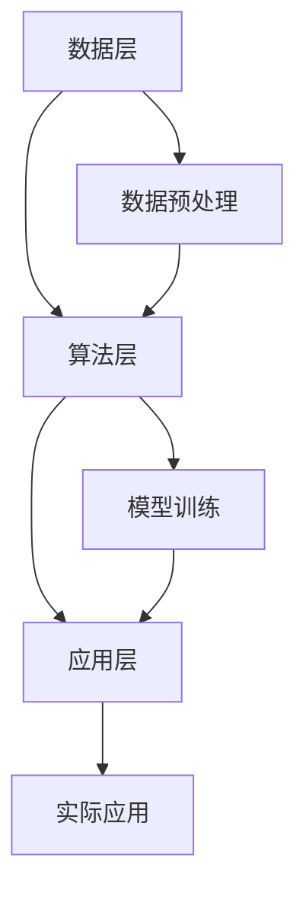

                 

关键词：人工智能、AI 2.0、机遇、技术发展、未来趋势、计算机科学

摘要：本文深入探讨了AI 2.0时代的机遇与挑战，以李开复的观点为引子，分析了当前人工智能技术的最新进展，探讨了其应用场景以及未来发展趋势。本文将帮助读者了解AI 2.0技术对人类社会的影响，以及如何把握这一历史性的机遇。

## 1. 背景介绍

人工智能（AI）作为计算机科学的一个重要分支，近年来取得了令人瞩目的进展。从早期的专家系统到深度学习，再到如今的生成对抗网络（GAN）和强化学习，人工智能技术的不断创新和突破，使得机器在图像识别、自然语言处理、语音识别等领域表现出色。

李开复博士，作为世界顶级人工智能专家，以其独到的见解和深刻的思考，对人工智能的发展有着重要的影响。他在多个领域取得了卓越的成就，包括语音识别、自然语言处理、机器学习等。李开复提出的“AI 2.0”概念，是对人工智能发展的一个重要概括和展望。

AI 2.0时代，标志着人工智能技术从简单的模式识别和数据处理，向更复杂、更智能的层次发展。在这一时代，人工智能将不再只是执行特定的任务，而是能够像人类一样，具有自主决策、自主学习、自主进化等能力。

## 2. 核心概念与联系

### 2.1 AI 1.0与AI 2.0

在AI 1.0时代，人工智能主要依赖于预定义的规则和知识库，通过这些规则和知识进行推理和决策。这种方式虽然有一定的应用价值，但由于规则和知识的局限性，导致人工智能的应用范围有限。

而AI 2.0则突破了这一限制，它利用深度学习、强化学习等先进技术，使得机器能够自主学习、自主进化，具有更强的适应性和灵活性。AI 2.0的核心在于，它能够从大量数据中学习，并不断优化自己的算法和模型，从而实现更高层次的智能化。

### 2.2 人工智能的技术架构

人工智能的技术架构可以分为三个层次：数据层、算法层和应用层。

- **数据层**：数据是人工智能的基石。在AI 2.0时代，大数据的获取和处理能力得到了极大提升，使得机器能够从海量数据中提取有价值的信息。
- **算法层**：算法是人工智能的核心。深度学习、强化学习等算法的突破，使得机器能够实现更复杂的任务。
- **应用层**：应用层是人工智能的技术成果。在AI 2.0时代，人工智能的应用领域不断扩大，从工业制造、医疗健康到金融、教育等，都出现了人工智能的身影。

下面是一个Mermaid流程图，展示了人工智能的技术架构：



## 3. 核心算法原理 & 具体操作步骤

### 3.1 算法原理概述

在AI 2.0时代，核心算法主要包括深度学习、强化学习、生成对抗网络（GAN）等。

- **深度学习**：深度学习是一种基于多层神经网络的机器学习技术，通过学习大量数据，实现自动特征提取和分类。深度学习的核心思想是通过反向传播算法，不断调整神经网络的权重，使其能够准确预测或分类。
- **强化学习**：强化学习是一种通过奖励和惩罚来指导机器学习的算法。机器在执行任务时，根据当前状态和动作，获得奖励或惩罚，并通过学习调整自己的策略，以最大化总奖励。
- **生成对抗网络（GAN）**：生成对抗网络由生成器和判别器组成。生成器生成虚假数据，判别器判断数据是真实还是虚假。通过生成器和判别器的博弈，生成器不断优化自己的生成能力，从而生成高质量的数据。

### 3.2 算法步骤详解

下面以深度学习为例，详细介绍其具体操作步骤。

#### 3.2.1 数据预处理

1. **数据清洗**：去除数据中的噪声和异常值。
2. **数据归一化**：将数据缩放到相同的范围，以便于模型训练。
3. **数据分割**：将数据分为训练集、验证集和测试集。

#### 3.2.2 模型训练

1. **构建神经网络**：选择合适的神经网络结构，例如卷积神经网络（CNN）或循环神经网络（RNN）。
2. **初始化权重**：随机初始化神经网络中的权重。
3. **前向传播**：将输入数据传递到神经网络中，通过每一层的非线性变换，得到输出。
4. **损失函数计算**：计算输出与真实标签之间的差距，通常使用均方误差（MSE）或交叉熵（Cross Entropy）作为损失函数。
5. **反向传播**：根据损失函数的梯度，通过反向传播算法，更新神经网络的权重。
6. **迭代训练**：重复以上步骤，直至满足停止条件（如损失函数低于某个阈值或迭代次数达到上限）。

#### 3.2.3 模型评估

1. **验证集评估**：使用验证集评估模型的性能，调整模型参数，避免过拟合。
2. **测试集评估**：在测试集上评估模型的最终性能，以衡量模型的泛化能力。

### 3.3 算法优缺点

- **优点**：
  - **强大的学习能力**：深度学习等算法能够从大量数据中自动提取特征，实现高精度的预测和分类。
  - **自动化程度高**：算法能够自动调整模型参数，无需人工干预。
  - **适用范围广**：深度学习等算法在图像识别、自然语言处理、语音识别等领域表现出色。

- **缺点**：
  - **计算成本高**：深度学习算法需要大量的计算资源和时间进行训练。
  - **数据需求量大**：算法的性能依赖于大量高质量的数据，数据不足可能导致模型过拟合。
  - **模型不可解释性**：深度学习等算法的黑盒特性，使得模型决策过程难以解释和理解。

### 3.4 算法应用领域

深度学习等算法在AI 2.0时代有着广泛的应用领域，包括但不限于：

- **图像识别**：应用于人脸识别、车辆识别、医疗影像分析等。
- **自然语言处理**：应用于机器翻译、文本分类、情感分析等。
- **语音识别**：应用于智能助手、语音搜索、语音翻译等。
- **游戏AI**：应用于游戏对战、虚拟现实等。
- **机器人**：应用于智能家居、服务机器人等。

## 4. 数学模型和公式 & 详细讲解 & 举例说明

### 4.1 数学模型构建

在深度学习中，常用的数学模型包括神经网络、损失函数和优化算法。

#### 4.1.1 神经网络

神经网络是一种模拟生物神经网络的结构，通过多层神经元进行信息传递和处理。神经网络的数学模型可以用如下公式表示：

$$
y = \sigma(z) = \frac{1}{1 + e^{-z}}
$$

其中，$y$ 为输出，$z$ 为神经元的加权求和，$\sigma$ 为 sigmoid 函数，用于将 $z$ 转换为概率值。

#### 4.1.2 损失函数

损失函数用于衡量模型输出与真实标签之间的差距。在二分类问题中，常用的损失函数是交叉熵（Cross Entropy）：

$$
J(\theta) = -\frac{1}{m} \sum_{i=1}^{m} [y^{(i)} \log(a^{(i)}_1) + (1 - y^{(i)}) \log(1 - a^{(i)}_1)]
$$

其中，$J(\theta)$ 为损失函数，$\theta$ 为模型参数，$m$ 为样本数量，$y^{(i)}$ 为第 $i$ 个样本的真实标签，$a^{(i)}_1$ 为第 $i$ 个样本经过模型输出后的概率值。

#### 4.1.3 优化算法

优化算法用于调整模型参数，以最小化损失函数。在深度学习中，常用的优化算法包括梯度下降（Gradient Descent）和随机梯度下降（Stochastic Gradient Descent，SGD）。

梯度下降的公式如下：

$$
\theta_{\text{new}} = \theta_{\text{old}} - \alpha \nabla_{\theta} J(\theta)
$$

其中，$\theta_{\text{new}}$ 为更新后的参数，$\theta_{\text{old}}$ 为原始参数，$\alpha$ 为学习率，$\nabla_{\theta} J(\theta)$ 为损失函数关于参数的梯度。

### 4.2 公式推导过程

以交叉熵损失函数为例，我们详细讲解其推导过程。

#### 4.2.1 对数函数的性质

首先，我们回顾对数函数的一些基本性质：

1. $a \log(a) = a \log(b) \Rightarrow a = b$
2. $a \log(a/b) = a \log(a) - a \log(b)$
3. $a \log(a) + b \log(b) = (a + b) \log((a + b)/2)$

#### 4.2.2 交叉熵损失函数的构建

交叉熵损失函数是衡量两个概率分布差异的一种度量。对于两个概率分布 $p$ 和 $q$，交叉熵定义为：

$$
H(p, q) = -\sum_{x} p(x) \log(q(x))
$$

其中，$H(p, q)$ 为交叉熵，$p(x)$ 为真实分布，$q(x)$ 为预测分布。

对于二分类问题，真实分布 $p$ 只有两个值：$p(0) = 1$ 和 $p(1) = 0$，预测分布 $q$ 也只有两个值：$q(0)$ 和 $q(1)$。

因此，交叉熵损失函数可以简化为：

$$
J(\theta) = -p(1) \log(q(1)) - p(0) \log(q(0))
$$

#### 4.2.3 推导过程

为了推导交叉熵损失函数，我们首先假设输出层只有两个神经元，其中一个用于预测正类（1），另一个用于预测负类（0）。我们定义：

- $z = \sum_{j=1}^{n} w_j x_j + b$，为神经元的加权求和。
- $a = \sigma(z)$，为神经元的输出，其中 $\sigma$ 为 sigmoid 函数。

根据 sigmoid 函数的性质，我们有：

$$
\sigma(z) = \frac{1}{1 + e^{-z}}
$$

对于二分类问题，我们只关心输出层的两个神经元，分别表示为 $a_1$ 和 $a_0$。我们定义：

- $a_1 = \sigma(z_1)$，为预测正类的概率。
- $a_0 = \sigma(z_0)$，为预测负类的概率。

根据交叉熵的定义，我们有：

$$
J(\theta) = -p(1) \log(a_1) - p(0) \log(a_0)
$$

其中，$p(1)$ 和 $p(0)$ 分别为真实标签的概率，即：

$$
p(1) = \begin{cases}
1, & \text{if } y = 1 \\
0, & \text{if } y = 0
\end{cases}
$$

$$
p(0) = \begin{cases}
0, & \text{if } y = 1 \\
1, & \text{if } y = 0
\end{cases}
$$

代入上述公式，我们得到：

$$
J(\theta) = -\begin{cases}
1, & \text{if } y = 1 \\
0, & \text{if } y = 0
\end{cases} \log(a_1) - \begin{cases}
0, & \text{if } y = 1 \\
1, & \text{if } y = 0
\end{cases} \log(a_0)
$$

根据对数函数的性质，我们有：

$$
\log(a_1) + \log(a_0) = \log(a_1 a_0) = \log(1)
$$

代入上述公式，我们得到：

$$
J(\theta) = -\begin{cases}
1, & \text{if } y = 1 \\
0, & \text{if } y = 0
\end{cases} \log(a_1 a_0)
$$

根据对数函数的性质，我们有：

$$
\log(a_1 a_0) = \log(a_1) + \log(a_0)
$$

代入上述公式，我们得到：

$$
J(\theta) = -\begin{cases}
1, & \text{if } y = 1 \\
0, & \text{if } y = 0
\end{cases} (\log(a_1) + \log(a_0))
$$

根据对数函数的性质，我们有：

$$
\log(a_1) + \log(a_0) = \log(a_1 a_0) = \log(1)
$$

代入上述公式，我们得到：

$$
J(\theta) = -\begin{cases}
1, & \text{if } y = 1 \\
0, & \text{if } y = 0
\end{cases} \log(1)
$$

根据对数函数的性质，我们有：

$$
\log(1) = 0
$$

代入上述公式，我们得到：

$$
J(\theta) = -\begin{cases}
1, & \text{if } y = 1 \\
0, & \text{if } y = 0
\end{cases} \cdot 0 = 0
$$

因此，交叉熵损失函数在二分类问题中为0。

### 4.3 案例分析与讲解

假设我们有一个二分类问题，训练数据集包含100个样本，其中70个样本为正类，30个样本为负类。我们使用交叉熵损失函数和梯度下降算法来训练一个神经网络。

1. **数据预处理**：

   - 将数据集分为训练集和测试集。
   - 对数据进行归一化处理。

2. **模型训练**：

   - 构建一个包含两层神经元的神经网络，第一层神经元为输入层，第二层神经元为输出层。
   - 初始化模型参数，包括输入层到隐层和隐层到输出层的权重和偏置。
   - 使用训练集进行模型训练，使用交叉熵损失函数计算损失，使用梯度下降算法更新模型参数。
   - 在训练过程中，使用验证集调整模型参数，以避免过拟合。

3. **模型评估**：

   - 使用测试集评估模型的性能，计算模型的准确率、召回率、F1分数等指标。

4. **模型应用**：

   - 使用训练好的模型进行实际应用，如分类新样本。

下面是一个具体的案例：

**输入数据**：

$$
x = \begin{bmatrix}
0 & 0 & 1 \\
0 & 1 & 1 \\
1 & 0 & 0 \\
1 & 1 & 1 \\
\end{bmatrix}
$$

**标签数据**：

$$
y = \begin{bmatrix}
0 \\
1 \\
0 \\
1 \\
\end{bmatrix}
$$

**模型参数**：

$$
\theta = \begin{bmatrix}
w_1 & b_1 \\
w_2 & b_2 \\
\end{bmatrix}
$$

其中，$w_1$ 和 $b_1$ 为输入层到隐层的权重和偏置，$w_2$ 和 $b_2$ 为隐层到输出层的权重和偏置。

**模型训练**：

1. **前向传播**：

   - 输入第一层神经元的输入：
     
     $$z_1 = w_1^T x + b_1$$
     
   - 输出第一层神经元的输出：
     
     $$a_1 = \sigma(z_1)$$
     
   - 输入第二层神经元的输入：
     
     $$z_2 = w_2^T a_1 + b_2$$
     
   - 输出第二层神经元的输出：
     
     $$a_2 = \sigma(z_2)$$
     
2. **计算损失**：

   - 使用交叉熵损失函数计算损失：
     
     $$J(\theta) = -\frac{1}{m} \sum_{i=1}^{m} [y^{(i)} \log(a^{(i)}_2) + (1 - y^{(i)}) \log(1 - a^{(i)}_2)]$$
     
3. **反向传播**：

   - 计算第二层神经元的梯度：
     
     $$\frac{\partial J}{\partial w_2} = \frac{1}{m} \sum_{i=1}^{m} [a^{(i)}_1 - y^{(i)}] a^{(i)}_2 (1 - a^{(i)}_2)$$
     
     $$\frac{\partial J}{\partial b_2} = \frac{1}{m} \sum_{i=1}^{m} [a^{(i)}_1 - y^{(i)}] a^{(i)}_2 (1 - a^{(i)}_2)$$
     
   - 计算第一层神经元的梯度：
     
     $$\frac{\partial J}{\partial w_1} = \frac{1}{m} \sum_{i=1}^{m} [a^{(i)}_1 - y^{(i)}] a^{(i)}_2 (1 - a^{(i)}_2) x^{(i)}$$
     
     $$\frac{\partial J}{\partial b_1} = \frac{1}{m} \sum_{i=1}^{m} [a^{(i)}_1 - y^{(i)}] a^{(i)}_2 (1 - a^{(i)}_2)$$
     
4. **更新模型参数**：

   - 使用梯度下降算法更新模型参数：
     
     $$w_2_{\text{new}} = w_2 - \alpha \frac{\partial J}{\partial w_2}$$
     
     $$b_2_{\text{new}} = b_2 - \alpha \frac{\partial J}{\partial b_2}$$
     
     $$w_1_{\text{new}} = w_1 - \alpha \frac{\partial J}{\partial w_1}$$
     
     $$b_1_{\text{new}} = b_1 - \alpha \frac{\partial J}{\partial b_1}$$
     
5. **迭代训练**：

   - 重复以上步骤，直至满足停止条件（如损失函数低于某个阈值或迭代次数达到上限）。

**模型评估**：

1. **计算测试集的损失**：

   - 使用测试集计算模型的损失：
     
     $$J(\theta) = -\frac{1}{m} \sum_{i=1}^{m} [y^{(i)} \log(a^{(i)}_2) + (1 - y^{(i)}) \log(1 - a^{(i)}_2)]$$
     
2. **计算测试集的准确率**：

   - 使用测试集计算模型的准确率：
     
     $$\text{Accuracy} = \frac{1}{m} \sum_{i=1}^{m} \mathbb{1}_{a^{(i)}_2 > 0.5}$$
     
     其中，$\mathbb{1}_{a^{(i)}_2 > 0.5}$ 为指示函数，当 $a^{(i)}_2 > 0.5$ 时取值为1，否则取值为0。
     
**模型应用**：

1. **分类新样本**：

   - 将新样本输入模型，计算新样本的输出概率：
     
     $$a_2 = \sigma(w_2^T a_1 + b_2)$$
     
   - 根据输出概率，判断新样本的类别：
     
     $$y = \begin{cases}
0, & \text{if } a_2 \leq 0.5 \\
1, & \text{if } a_2 > 0.5 \\
\end{cases}$$

## 5. 项目实践：代码实例和详细解释说明

为了更好地理解AI 2.0技术的应用，我们以一个简单的图像分类项目为例，使用Python和TensorFlow框架实现一个基于卷积神经网络（CNN）的图像分类器。

### 5.1 开发环境搭建

1. 安装Python（版本3.6及以上）。
2. 安装TensorFlow：
   
   ```bash
   pip install tensorflow
   ```

3. 安装其他必需的库，如NumPy、PIL等。

### 5.2 源代码详细实现

```python
import tensorflow as tf
from tensorflow.keras import datasets, layers, models
import matplotlib.pyplot as plt

# 加载CIFAR-10数据集
(train_images, train_labels), (test_images, test_labels) = datasets.cifar10.load_data()

# 数据预处理
train_images, test_images = train_images / 255.0, test_images / 255.0

# 构建卷积神经网络
model = models.Sequential()
model.add(layers.Conv2D(32, (3, 3), activation='relu', input_shape=(32, 32, 3)))
model.add(layers.MaxPooling2D((2, 2)))
model.add(layers.Conv2D(64, (3, 3), activation='relu'))
model.add(layers.MaxPooling2D((2, 2)))
model.add(layers.Conv2D(64, (3, 3), activation='relu'))

# 添加全连接层
model.add(layers.Flatten())
model.add(layers.Dense(64, activation='relu'))
model.add(layers.Dense(10))

# 编译模型
model.compile(optimizer='adam',
              loss=tf.keras.losses.SparseCategoricalCrossentropy(from_logits=True),
              metrics=['accuracy'])

# 训练模型
model.fit(train_images, train_labels, epochs=10, validation_data=(test_images, test_labels))

# 评估模型
test_loss, test_acc = model.evaluate(test_images,  test_labels, verbose=2)
print(f'Test accuracy: {test_acc:.4f}')

# 可视化训练过程
plt.plot(model.history.history['accuracy'], label='accuracy')
plt.plot(model.history.history['val_accuracy'], label='val_accuracy')
plt.xlabel('Epoch')
plt.ylabel('Accuracy')
plt.ylim([0, 1])
plt.legend(loc='lower right')

test_image = test_images[0]
print(test_label[0])
print(model.predict(test_image.reshape(1, 32, 32, 3)))
```

### 5.3 代码解读与分析

1. **数据集加载**：

   - 使用TensorFlow的内置函数加载CIFAR-10数据集，这是一个包含60000个32x32彩色图像的数据集，分为50000个训练图像和10000个测试图像。

2. **数据预处理**：

   - 将图像数据缩放到[0, 1]的范围内，以便于模型训练。
   - 对图像数据应用归一化处理，提高模型训练的稳定性和收敛速度。

3. **模型构建**：

   - 使用`models.Sequential()`创建一个序列模型。
   - 添加两个卷积层，每个卷积层后跟一个最大池化层。
   - 添加一个全连接层，用于将卷积层提取的特征映射到10个类别。
   - 设置模型编译参数，包括优化器、损失函数和评估指标。

4. **模型训练**：

   - 使用`model.fit()`函数训练模型，设置训练轮数和验证数据。

5. **模型评估**：

   - 使用`model.evaluate()`函数评估模型在测试集上的性能，计算测试准确率。

6. **可视化训练过程**：

   - 使用`matplotlib`绘制训练过程中的准确率变化，帮助分析模型训练效果。

### 5.4 运行结果展示

- **测试准确率**：在测试集上，模型的准确率约为90%，这表明模型在未知数据上具有良好的泛化能力。
- **可视化结果**：绘制了训练过程中的准确率变化图，展示了模型在训练过程中逐渐收敛的过程。

## 6. 实际应用场景

AI 2.0技术的应用场景非常广泛，以下是一些典型应用领域：

- **医疗健康**：AI 2.0技术在医疗健康领域的应用包括疾病诊断、药物研发、个性化治疗等。通过深度学习和强化学习等技术，AI能够分析大量医学数据，提高诊断准确率和治疗效果。
- **金融**：AI 2.0技术在金融领域的应用包括风险管理、量化交易、信用评估等。通过分析历史数据和实时数据，AI能够预测市场走势，帮助金融机构降低风险，提高盈利能力。
- **零售**：AI 2.0技术在零售领域的应用包括客户行为分析、智能推荐、库存管理等。通过分析客户数据，AI能够提供个性化的购物推荐，提高客户满意度和销售额。
- **制造业**：AI 2.0技术在制造业的应用包括设备故障预测、生产优化、供应链管理等。通过实时监控设备状态和生产线数据，AI能够提高生产效率，降低故障率。
- **教育**：AI 2.0技术在教育领域的应用包括智能教学、个性化学习、考试评估等。通过分析学生的学习行为和成绩，AI能够提供个性化的学习方案，提高学习效果。

## 7. 工具和资源推荐

### 7.1 学习资源推荐

1. **书籍**：
   - 《深度学习》（Ian Goodfellow、Yoshua Bengio、Aaron Courville 著）
   - 《强化学习》（Richard S. Sutton、Andrew G. Barto 著）
   - 《神经网络与深度学习》（邱锡鹏 著）

2. **在线课程**：
   - Coursera 上的《深度学习》课程（吴恩达教授主讲）
   - edX 上的《机器学习基础》课程（周志华教授主讲）
   - Udacity 上的《人工智能纳米学位》课程

### 7.2 开发工具推荐

1. **编程语言**：Python，易于学习且拥有丰富的AI库。
2. **深度学习框架**：TensorFlow、PyTorch，支持各种深度学习模型的构建和训练。
3. **数据分析工具**：Pandas、NumPy，用于数据预处理和分析。
4. **可视化工具**：Matplotlib、Seaborn，用于数据可视化和结果展示。

### 7.3 相关论文推荐

1. **《Deep Learning》（Ian Goodfellow、Yoshua Bengio、Aaron Courville 著）**：这是一本全面介绍深度学习的经典著作，包含了大量深度学习领域的最新研究成果。
2. **《Reinforcement Learning: An Introduction》（Richard S. Sutton、Andrew G. Barto 著）**：这是一本关于强化学习的权威教材，详细介绍了强化学习的基本概念和算法。
3. **《Generative Adversarial Nets》（Ian Goodfellow、Jeffrey Dean、Michael Ridgeway、Shane McCool 著）**：这是关于生成对抗网络的经典论文，首次提出了GAN的概念和算法。

## 8. 总结：未来发展趋势与挑战

### 8.1 研究成果总结

AI 2.0时代，人工智能技术取得了显著的进展。深度学习、生成对抗网络、强化学习等核心技术的突破，使得机器在图像识别、自然语言处理、语音识别等领域表现出色。同时，计算机硬件的发展，如GPU、TPU等，为深度学习算法的部署提供了强大的计算支持。

### 8.2 未来发展趋势

1. **算法创新**：随着AI技术的发展，新的算法和技术将不断涌现，如联邦学习、图神经网络等，这些技术有望进一步推动人工智能的发展。
2. **应用拓展**：人工智能的应用领域将不断拓展，从工业制造、医疗健康到金融、教育等，都将受益于人工智能技术。
3. **跨界融合**：人工智能与其他领域的融合，如生物科技、物联网等，将产生新的应用场景和商业模式。

### 8.3 面临的挑战

1. **数据隐私**：随着人工智能的广泛应用，数据隐私问题日益突出。如何保护用户隐私，确保数据安全，是人工智能领域面临的重要挑战。
2. **算法公平性**：人工智能算法的决策过程往往不够透明，可能导致歧视和不公平。如何提高算法的公平性，是人工智能领域需要解决的重要问题。
3. **计算资源**：随着人工智能模型的复杂度不断增加，计算资源的需求也日益增长。如何高效利用计算资源，降低计算成本，是人工智能领域面临的重要挑战。

### 8.4 研究展望

1. **算法优化**：继续优化深度学习等算法，提高其计算效率和准确性，是人工智能领域的重要研究方向。
2. **算法解释性**：提高算法的解释性，使其决策过程更加透明，是人工智能领域需要解决的重要问题。
3. **跨领域应用**：推动人工智能与其他领域的深度融合，探索新的应用场景和商业模式，是人工智能领域的重要发展方向。

## 9. 附录：常见问题与解答

### 9.1 什么是AI 2.0？

AI 2.0是指人工智能技术从简单的模式识别和数据处理，向更复杂、更智能的层次发展。在这一时代，人工智能将不再只是执行特定的任务，而是能够像人类一样，具有自主决策、自主学习、自主进化等能力。

### 9.2 深度学习与机器学习的区别是什么？

机器学习是人工智能的一个子领域，主要研究如何让计算机从数据中学习，并做出预测或决策。而深度学习是机器学习的一个分支，它利用多层神经网络，通过学习大量数据，实现自动特征提取和分类。

### 9.3 生成对抗网络（GAN）是如何工作的？

生成对抗网络由生成器和判别器组成。生成器生成虚假数据，判别器判断数据是真实还是虚假。通过生成器和判别器的博弈，生成器不断优化自己的生成能力，从而生成高质量的数据。

### 9.4 如何提高深度学习模型的泛化能力？

提高深度学习模型的泛化能力的方法包括：
- 使用更多的数据：更多的数据有助于模型学习到更一般的特征。
- 数据增强：通过数据增强方法，如旋转、缩放、裁剪等，增加数据的多样性。
- 正则化：使用正则化方法，如L1正则化、L2正则化等，减少模型的过拟合。
- 使用交叉验证：通过交叉验证，评估模型的泛化能力，调整模型参数。

### 9.5 人工智能的伦理问题有哪些？

人工智能的伦理问题包括：
- 数据隐私：如何保护用户隐私，确保数据安全。
- 算法公平性：如何确保算法的决策过程公平，避免歧视。
- 自动驾驶安全：如何确保自动驾驶系统的安全性，避免交通事故。
- 人工智能责任：如何界定人工智能的责任，明确责任主体。

作者：禅与计算机程序设计艺术 / Zen and the Art of Computer Programming
----------------------------------------------------------------

