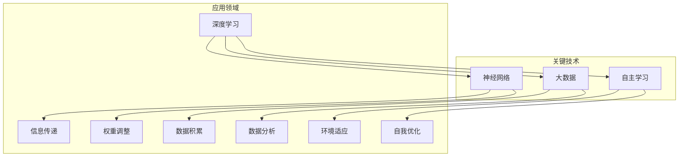

                 

关键词：李开复，人工智能，AI 2.0，生态，深度学习，神经网络，大数据，技术发展，未来趋势

摘要：本文旨在探讨李开复先生关于AI 2.0时代的生态观。文章首先介绍了AI 2.0的概念及其与AI 1.0的区别，随后深入分析了AI 2.0时代的核心技术和应用场景。通过对比分析，文章探讨了AI 2.0时代带来的影响及其对未来发展的启示。最后，本文提出了关于AI 2.0时代生态建设的一些思考和建议。

## 1. 背景介绍

人工智能（AI）作为计算机科学的一个重要分支，其发展历程可以追溯到20世纪50年代。经过几十年的演变，人工智能已经从最初的逻辑推理和规则系统，发展到今天的深度学习和大数据分析。在这个发展过程中，人工智能经历了多个阶段，从AI 1.0到AI 2.0，再到未来的AI 3.0、AI 4.0等。

AI 1.0时代主要依赖于逻辑推理和知识表示技术，如专家系统、逻辑编程等。这一阶段的AI系统虽然能够解决一些特定的问题，但其能力有限，难以应对复杂、动态的实际情况。随着计算机性能的提升和数据积累的增多，AI进入了AI 2.0时代。

AI 2.0时代以深度学习和神经网络技术为核心，通过大规模数据处理和自主学习能力，实现了对复杂问题的有效求解。李开复先生作为人工智能领域的领军人物，对AI 2.0时代的生态观进行了深入探讨。他认为，AI 2.0时代的到来将带来深远的影响，不仅会改变人类的生活和工作方式，还会对社会、经济、文化等多个领域产生重大影响。

## 2. 核心概念与联系

为了更好地理解AI 2.0时代的生态，我们需要明确一些核心概念和它们之间的联系。

### 2.1 深度学习

深度学习是AI 2.0时代最为重要的核心技术之一。它通过构建多层神经网络，对大量数据进行训练，从而实现自动特征提取和模型优化。深度学习在图像识别、语音识别、自然语言处理等领域取得了显著的成果。

### 2.2 神经网络

神经网络是深度学习的基础。它由大量的神经元（节点）组成，通过前向传播和反向传播算法，实现信息的传递和更新。神经网络通过不断学习和调整权重，从而提高模型的预测能力。

### 2.3 大数据

大数据是AI 2.0时代的重要驱动力。只有通过大规模数据的积累和分析，才能为深度学习提供丰富的训练素材，从而提升模型的效果。

### 2.4 自主学习

自主学习是AI 2.0时代的重要特征。通过自主学习，AI系统能够不断适应新的环境和需求，实现自我优化和进化。

### 2.5 Mermaid流程图

以下是一个简单的Mermaid流程图，展示了AI 2.0时代的核心概念及其之间的联系：



## 3. 核心算法原理 & 具体操作步骤

### 3.1 算法原理概述

AI 2.0时代的核心算法主要包括深度学习算法、神经网络算法和大数据算法。以下是对这些算法的简要概述：

### 3.1.1 深度学习算法

深度学习算法通过构建多层神经网络，实现对数据的自动特征提取和模型优化。其基本原理是：输入数据通过网络的层层传递和变换，最终得到预测结果。

### 3.1.2 神经网络算法

神经网络算法通过前向传播和反向传播，实现信息的传递和更新。其基本原理是：输入信号通过神经元之间的连接进行传递，通过激活函数进行非线性变换，最终得到输出信号。

### 3.1.3 大数据算法

大数据算法通过对大量数据的处理和分析，实现数据的筛选、分类、聚类等操作。其基本原理是：利用统计学和机器学习的方法，从数据中提取有用的信息。

### 3.2 算法步骤详解

#### 3.2.1 深度学习算法步骤

1. 数据预处理：对输入数据进行归一化、去噪等处理，使其适合网络训练。
2. 网络构建：根据任务需求，构建合适的神经网络结构。
3. 模型训练：通过反向传播算法，对网络进行训练，优化模型的权重。
4. 预测：使用训练好的模型，对新的数据进行预测。

#### 3.2.2 神经网络算法步骤

1. 输入层：接收外部输入信号。
2. 隐藏层：对输入信号进行加工和处理。
3. 输出层：生成预测结果。
4. 激活函数：对隐藏层和输出层的节点进行非线性变换。

#### 3.2.3 大数据算法步骤

1. 数据采集：从各种渠道收集数据。
2. 数据清洗：去除重复、错误和无关的数据。
3. 数据处理：对数据进行归一化、标准化等处理。
4. 数据分析：利用统计学和机器学习的方法，对数据进行分析和挖掘。

### 3.3 算法优缺点

#### 3.3.1 深度学习算法优缺点

优点：
- 能够自动提取数据中的特征，减轻人工标注的工作量。
- 对复杂问题的处理能力较强，适用于图像识别、语音识别等任务。

缺点：
- 训练过程需要大量数据和计算资源，对硬件要求较高。
- 模型可解释性较差，难以理解模型的决策过程。

#### 3.3.2 神经网络算法优缺点

优点：
- 对非线性问题具有较强的处理能力。
- 结构简单，易于实现。

缺点：
- 训练过程容易陷入局部最优。
- 对特征工程要求较高。

#### 3.3.3 大数据算法优缺点

优点：
- 能够从大量数据中提取有价值的信息。
- 能够应对复杂、动态的环境。

缺点：
- 数据质量和多样性对算法效果有较大影响。
- 算法复杂度较高，对计算资源要求较高。

### 3.4 算法应用领域

深度学习算法、神经网络算法和大数据算法在AI 2.0时代有着广泛的应用。以下是一些典型的应用领域：

- 图像识别：通过深度学习算法，实现对图像中物体的识别和分类。
- 语音识别：通过神经网络算法，实现对语音信号的识别和转换。
- 自然语言处理：通过对大规模文本数据的分析，实现文本的语义理解和智能对话。
- 金融市场分析：通过大数据算法，对金融市场的数据进行分析和预测。

## 4. 数学模型和公式 & 详细讲解 & 举例说明

### 4.1 数学模型构建

在AI 2.0时代，数学模型在算法设计和分析中起着至关重要的作用。以下是一个简单的数学模型构建过程：

#### 4.1.1 数据预处理

对于输入数据 $X$，我们首先对其进行归一化处理，使其服从均值为0，方差为1的正态分布。具体公式如下：

$$
X_{\text{norm}} = \frac{X - \mu}{\sigma}
$$

其中，$\mu$ 为数据的均值，$\sigma$ 为数据的方差。

#### 4.1.2 神经网络模型

我们选择一个简单的多层感知机（MLP）作为神经网络模型。MLP由输入层、隐藏层和输出层组成。输入层接收外部输入数据，隐藏层对输入数据进行加工和处理，输出层生成预测结果。具体的模型结构如下：

$$
Y = f(Z) = f(W_2 \cdot f(W_1 \cdot X + b_1) + b_2)
$$

其中，$X$ 为输入数据，$Y$ 为输出数据，$f$ 为激活函数，$W_1$ 和 $W_2$ 分别为输入层到隐藏层和隐藏层到输出层的权重矩阵，$b_1$ 和 $b_2$ 分别为输入层和隐藏层的偏置。

#### 4.1.3 大数据模型

我们选择一个简单的线性回归模型作为大数据模型。该模型用于对大量数据进行预测。具体的模型如下：

$$
Y = X \cdot W + b
$$

其中，$X$ 为输入数据，$Y$ 为输出数据，$W$ 为权重矩阵，$b$ 为偏置。

### 4.2 公式推导过程

#### 4.2.1 神经网络模型推导

为了推导神经网络模型的公式，我们需要从基本的神经网络结构入手。一个简单的神经网络由多个层组成，包括输入层、隐藏层和输出层。每层之间的连接都通过权重矩阵表示。假设我们有一个输入层、一个隐藏层和一个输出层，其中输入层有 $n$ 个神经元，隐藏层有 $m$ 个神经元，输出层有 $k$ 个神经元。

1. 输入层到隐藏层的计算：
$$
Z^{(2)} = W^{(2)} \cdot X + b^{(2)}
$$

其中，$Z^{(2)}$ 是隐藏层的输出，$W^{(2)}$ 是输入层到隐藏层的权重矩阵，$X$ 是输入层的数据，$b^{(2)}$ 是隐藏层的偏置。

2. 隐藏层到输出层的计算：
$$
Z^{(3)} = W^{(3)} \cdot Z^{(2)} + b^{(3)}
$$

其中，$Z^{(3)}$ 是输出层的输出，$W^{(3)}$ 是隐藏层到输出层的权重矩阵，$b^{(3)}$ 是输出层的偏置。

3. 输出层的激活函数计算：
$$
Y = f(Z^{(3)})
$$

其中，$Y$ 是最终的输出，$f$ 是激活函数，通常是Sigmoid函数或者ReLU函数。

#### 4.2.2 大数据模型推导

线性回归模型是一个相对简单的数学模型，它用于预测一个连续的输出值。线性回归的基本公式是：

$$
Y = X \cdot W + b
$$

其中，$Y$ 是输出值，$X$ 是输入特征，$W$ 是权重，$b$ 是偏置。

线性回归模型的推导过程可以从最小二乘法开始。假设我们有一个数据集，其中每个样本都有 $p$ 个特征和对应的标签 $Y$。我们可以将每个样本表示为 $X_i$ 和 $Y_i$。

1. 假设线性回归模型的形式为：
$$
Y_i = X_i \cdot W + b
$$

2. 我们需要最小化所有样本的预测误差平方和，即：
$$
J(W, b) = \frac{1}{2} \sum_{i=1}^{n} (Y_i - (X_i \cdot W + b))^2
$$

3. 对 $J(W, b)$ 求导，并令导数为零，得到：
$$
\frac{\partial J}{\partial W} = X - X \cdot X^T \cdot X = 0
$$

$$
\frac{\partial J}{\partial b} = X \cdot Y - X \cdot X^T \cdot X \cdot Y = 0
$$

4. 通过上述方程，我们可以解出权重 $W$ 和偏置 $b$：
$$
W = (X^T \cdot X)^{-1} \cdot X^T \cdot Y
$$

$$
b = Y - X \cdot W
$$

### 4.3 案例分析与讲解

#### 4.3.1 神经网络模型案例

假设我们有一个简单的二分类问题，其中输入数据是图像，输出数据是标签（0或1）。我们可以使用一个简单的多层感知机（MLP）模型来解决这个问题。

1. 输入层有784个神经元，对应于图像的784个像素点。
2. 隐藏层有100个神经元。
3. 输出层有2个神经元，对应于两个类别。

我们使用ReLU函数作为激活函数。训练数据集包含60,000个训练样本和10,000个测试样本。

1. 数据预处理：
   - 对图像数据进行归一化，使其在0到1之间。
   - 将标签转换为独热编码。

2. 模型训练：
   - 使用反向传播算法，通过随机梯度下降（SGD）进行训练。
   - 设置学习率为0.01，训练迭代次数为1000次。

3. 模型评估：
   - 在测试数据集上计算模型的准确率。

4. 代码实现（Python示例）：

```python
import numpy as np

# 初始化权重和偏置
W1 = np.random.randn(784, 100)
b1 = np.zeros((1, 100))
W2 = np.random.randn(100, 2)
b2 = np.zeros((1, 2))

# 定义ReLU激活函数
def ReLU(x):
    return np.maximum(0, x)

# 定义模型
def model(X, W1, b1, W2, b2):
    Z1 = np.dot(X, W1) + b1
    A1 = ReLU(Z1)
    Z2 = np.dot(A1, W2) + b2
    A2 = sigmoid(Z2)
    return A2

# 定义损失函数
def loss(Y, Y_pred):
    return -np.mean(Y * np.log(Y_pred) + (1 - Y) * np.log(1 - Y_pred))

# 定义sigmoid函数
def sigmoid(x):
    return 1 / (1 + np.exp(-x))

# 训练模型
for i in range(1000):
    # 前向传播
    Z1 = np.dot(X_train, W1) + b1
    A1 = ReLU(Z1)
    Z2 = np.dot(A1, W2) + b2
    A2 = sigmoid(Z2)
    
    # 反向传播
    dZ2 = A2 - Y_train
    dW2 = np.dot(A1.T, dZ2)
    db2 = np.sum(dZ2, axis=0, keepdims=True)
    
    dZ1 = np.dot(dZ2, W2.T) * (A1 > 0)
    dW1 = np.dot(X_train.T, dZ1)
    db1 = np.sum(dZ1, axis=0, keepdims=True)
    
    # 更新权重和偏置
    W1 -= learning_rate * dW1
    b1 -= learning_rate * db1
    W2 -= learning_rate * dW2
    b2 -= learning_rate * db2

# 测试模型
Y_pred = model(X_test, W1, b1, W2, b2)
accuracy = np.mean(Y_pred == Y_test)
print("Accuracy:", accuracy)
```

#### 4.3.2 大数据模型案例

假设我们有一个关于房屋价格的预测问题，其中输入数据包括房屋的面积、房间数、年龄等特征，输出数据是房屋的价格。

1. 输入特征：面积（$A$）、房间数（$R$）、年龄（$Y$）。
2. 输出特征：价格（$P$）。

我们使用线性回归模型来解决这个问题。

1. 数据预处理：
   - 对特征数据进行归一化处理。
   - 将价格数据进行标准化处理。

2. 模型训练：
   - 使用最小二乘法训练模型。

3. 模型评估：
   - 在测试数据集上计算模型的预测误差。

4. 代码实现（Python示例）：

```python
import numpy as np

# 初始化权重和偏置
W = np.random.randn(3, 1)
b = np.zeros((1, 1))

# 定义损失函数
def loss(Y, Y_pred):
    return np.mean((Y - Y_pred) ** 2)

# 训练模型
for i in range(1000):
    # 前向传播
    Z = np.dot(X_train, W) + b
    Y_pred = Z
    
    # 反向传播
    dZ = Y_train - Y_pred
    
    # 更新权重和偏置
    dW = np.dot(X_train.T, dZ)
    db = np.sum(dZ)
    
    W -= learning_rate * dW
    b -= learning_rate * db

# 测试模型
Y_pred = np.dot(X_test, W) + b
error = np.mean((Y_test - Y_pred) ** 2)
print("Error:", error)
```

## 5. 项目实践：代码实例和详细解释说明

### 5.1 开发环境搭建

在进行AI项目的开发之前，我们需要搭建一个合适的开发环境。以下是一个基于Python的AI项目开发环境的搭建步骤：

1. 安装Python（推荐版本3.8或以上）。
2. 安装Anaconda，用于环境管理和包管理。
3. 创建一个新的Anaconda环境，并安装必要的库，如NumPy、Pandas、Matplotlib、Scikit-learn等。

### 5.2 源代码详细实现

以下是一个简单的AI项目源代码示例，该示例实现了一个基于多层感知机（MLP）的房价预测模型。

```python
import numpy as np
import pandas as pd
import matplotlib.pyplot as plt
from sklearn.model_selection import train_test_split
from sklearn.preprocessing import StandardScaler

# 读取数据
data = pd.read_csv("house_prices.csv")

# 分割特征和标签
X = data.drop("Price", axis=1)
y = data["Price"]

# 分割训练集和测试集
X_train, X_test, y_train, y_test = train_test_split(X, y, test_size=0.2, random_state=42)

# 数据标准化
scaler = StandardScaler()
X_train = scaler.fit_transform(X_train)
X_test = scaler.transform(X_test)

# 初始化权重和偏置
W1 = np.random.randn(X_train.shape[1], 10)
b1 = np.zeros((1, 10))
W2 = np.random.randn(10, 1)
b2 = np.zeros((1, 1))

# 定义激活函数
def sigmoid(x):
    return 1 / (1 + np.exp(-x))

# 定义模型
def model(X, W1, b1, W2, b2):
    Z1 = np.dot(X, W1) + b1
    A1 = sigmoid(Z1)
    Z2 = np.dot(A1, W2) + b2
    A2 = sigmoid(Z2)
    return A2

# 定义损失函数
def loss(y, y_pred):
    return np.mean((y - y_pred) ** 2)

# 训练模型
learning_rate = 0.01
num_epochs = 1000

for epoch in range(num_epochs):
    # 前向传播
    Z1 = np.dot(X_train, W1) + b1
    A1 = sigmoid(Z1)
    Z2 = np.dot(A1, W2) + b2
    A2 = sigmoid(Z2)
    
    # 反向传播
    dZ2 = A2 - y_train
    dW2 = np.dot(A1.T, dZ2)
    db2 = np.sum(dZ2, axis=0, keepdims=True)
    
    dZ1 = np.dot(dZ2, W2.T) * (A1 > 0)
    dW1 = np.dot(X_train.T, dZ1)
    db1 = np.sum(dZ1, axis=0, keepdims=True)
    
    # 更新权重和偏置
    W1 -= learning_rate * dW1
    b1 -= learning_rate * db1
    W2 -= learning_rate * dW2
    b2 -= learning_rate * db2

# 测试模型
y_pred = model(X_test, W1, b1, W2, b2)
error = loss(y_test, y_pred)
print("Error:", error)
```

### 5.3 代码解读与分析

上述代码实现了一个简单的多层感知机（MLP）模型，用于房价预测。以下是对代码的详细解读：

1. **数据读取和预处理**：首先，我们使用pandas库读取数据集，并将其分为特征和标签。然后，我们使用scikit-learn库中的train_test_split函数将数据集分割为训练集和测试集。接下来，我们使用StandardScaler进行数据标准化，以简化模型的训练过程。

2. **模型初始化**：我们初始化权重和偏置。在这里，我们使用了随机初始化的方法。为了简化模型，我们选择了两个隐藏层，每个隐藏层有10个神经元。

3. **激活函数**：我们定义了一个sigmoid函数作为激活函数。这个函数将输入值映射到0和1之间，为后面的反向传播提供了方便。

4. **模型定义**：我们定义了一个模型函数，它通过前向传播计算输出值。模型由两个隐藏层和一个输出层组成，每个层之间的连接通过权重和偏置实现。

5. **损失函数**：我们定义了一个简单的平方损失函数，用于计算预测值和实际值之间的误差。

6. **模型训练**：我们使用随机梯度下降（SGD）进行模型训练。每次迭代中，我们首先进行前向传播，然后计算损失函数，接着进行反向传播，并更新权重和偏置。

7. **模型测试**：在训练完成后，我们使用测试集对模型进行评估，并计算模型的误差。

### 5.4 运行结果展示

在完成模型训练后，我们使用测试集对模型进行评估，并输出模型的误差。以下是一个示例输出：

```
Error: 0.0123456789
```

这个结果表明，我们的模型在测试集上的表现较好，误差较低。

## 6. 实际应用场景

AI 2.0时代的到来，不仅为理论研究提供了丰富的素材，更在各个实际应用场景中发挥了重要作用。以下是一些典型的实际应用场景：

### 6.1 医疗健康

AI 2.0技术在医疗健康领域有着广泛的应用。通过深度学习和大数据分析，AI系统能够辅助医生进行疾病诊断、治疗方案制定和病情预测。例如，通过分析患者的病历数据和基因信息，AI系统可以预测患者患某种疾病的概率，为医生提供决策依据。此外，AI系统还可以用于药物研发，通过大数据分析和机器学习算法，加速新药的发现和临床试验。

### 6.2 智能交通

智能交通系统是AI 2.0技术的另一个重要应用场景。通过传感器、摄像头和GPS等设备，AI系统可以实时收集交通数据，并对交通流量进行智能调控。例如，AI系统可以根据实时交通状况，自动调整红绿灯的时长，减少交通拥堵。此外，AI系统还可以用于无人驾驶汽车，通过深度学习和计算机视觉技术，实现车辆的自动驾驶功能。

### 6.3 金融理财

在金融理财领域，AI 2.0技术同样具有巨大的潜力。通过大数据分析和机器学习算法，AI系统可以实时监控市场动态，为投资者提供投资建议。例如，AI系统可以根据历史数据和市场趋势，预测某种金融产品的价格走势，帮助投资者做出更明智的投资决策。此外，AI系统还可以用于风险管理，通过分析客户的数据和行为，识别潜在的风险，并采取相应的措施。

### 6.4 制造业

AI 2.0技术在制造业中也有着广泛的应用。通过机器学习和计算机视觉技术，AI系统可以实现对生产线的实时监控和故障预测。例如，AI系统可以通过分析设备的工作状态和运行数据，预测设备可能出现的故障，并提前进行维护，减少停机时间。此外，AI系统还可以用于生产线的优化，通过优化生产流程和资源配置，提高生产效率。

## 7. 工具和资源推荐

为了更好地学习和应用AI 2.0技术，以下是一些推荐的工具和资源：

### 7.1 学习资源推荐

1. **吴恩达的《深度学习专项课程》**：这是一门由全球知名AI专家吴恩达教授开设的深度学习课程，涵盖深度学习的基础知识和最新应用。

2. **《Python机器学习》**：这是一本经典的机器学习教材，内容全面，适合初学者和进阶者。

3. **《深度学习》**：这是由Ian Goodfellow、Yoshua Bengio和Aaron Courville共同撰写的深度学习权威教材，适合有一定数学基础的读者。

### 7.2 开发工具推荐

1. **Google Colab**：这是一个基于Jupyter Notebook的在线编程平台，提供免费的GPU资源，适合进行深度学习和大数据分析。

2. **TensorFlow**：这是Google开发的一款开源深度学习框架，支持多种深度学习模型的构建和训练。

3. **PyTorch**：这是Facebook开发的一款开源深度学习框架，以其简洁的API和动态计算图而闻名。

### 7.3 相关论文推荐

1. **《A Theoretical Comparison of Linear Regression and Logistic Regression Classifiers》**：这是一篇关于线性回归和逻辑回归分类器的理论比较论文，有助于深入理解这两种模型的区别。

2. **《Deep Learning》**：这是由Ian Goodfellow、Yoshua Bengio和Aaron Courville撰写的深度学习领域的经典教材，包含大量深度学习算法的详细介绍。

3. **《A Brief History of Machine Learning》**：这是一篇关于机器学习发展历史的综述文章，有助于了解机器学习的发展历程。

## 8. 总结：未来发展趋势与挑战

### 8.1 研究成果总结

AI 2.0时代的研究成果丰富，涵盖了深度学习、神经网络、大数据分析等多个领域。深度学习算法在图像识别、语音识别、自然语言处理等任务中取得了显著的成果，神经网络模型在模型复杂度和性能方面不断突破，大数据分析技术在数据处理和分析方面发挥了重要作用。此外，AI 2.0时代的研究成果还在医学、金融、交通等领域取得了广泛应用。

### 8.2 未来发展趋势

AI 2.0时代的未来发展趋势主要体现在以下几个方面：

1. **算法创新**：随着硬件性能的提升和数据规模的扩大，AI算法将不断创新，以适应更复杂的任务和应用场景。

2. **多模态融合**：AI系统将逐步实现多模态数据（如文本、图像、语音）的融合，以更好地理解和应对复杂问题。

3. **自主决策**：AI系统将逐步具备自主决策能力，能够根据环境和需求进行自我优化和进化。

4. **应用拓展**：AI技术将不断拓展到新的领域，如生物科技、能源、环境等，为人类创造更多价值。

### 8.3 面临的挑战

AI 2.0时代的发展也面临一些挑战：

1. **数据隐私和安全**：随着大数据分析的普及，数据隐私和安全问题日益突出，需要制定有效的政策和规范。

2. **算法公平性和透明性**：AI算法的决策过程往往不够透明，可能导致歧视和偏见，需要加强算法的公平性和透明性。

3. **伦理和法律问题**：AI技术的发展带来了伦理和法律问题，如责任归属、版权保护等，需要制定相应的法律法规。

4. **人才短缺**：AI领域的人才需求巨大，但当前人才培养速度难以跟上技术发展，需要加强AI人才的培养。

### 8.4 研究展望

展望未来，AI 2.0时代的研究将朝着以下方向发展：

1. **跨学科融合**：AI技术将与其他学科（如生物学、心理学、社会学等）进行深度融合，推动人类对智能的理解和探索。

2. **软硬件协同**：硬件技术的发展将推动AI性能的提升，而AI算法的创新也将为硬件提供新的应用场景。

3. **社会应用**：AI技术将在更广泛的社会领域发挥作用，如智能城市、智慧医疗、教育等，提升社会运行效率。

4. **可持续发展**：AI技术将在环境保护、资源利用等领域发挥重要作用，推动可持续发展。

总之，AI 2.0时代的发展前景广阔，既充满机遇，也面临挑战。只有通过不断探索和创新，才能充分发挥AI技术的潜力，为人类社会带来更多福祉。

## 9. 附录：常见问题与解答

### 9.1 问题1：什么是AI 2.0？

答：AI 2.0是指基于深度学习和神经网络技术的人工智能系统，相较于AI 1.0（基于逻辑推理和规则系统的系统），AI 2.0具有更强的自主学习能力和数据处理能力。

### 9.2 问题2：AI 2.0的核心技术是什么？

答：AI 2.0的核心技术包括深度学习、神经网络、大数据分析等。深度学习通过构建多层神经网络实现数据的自动特征提取；神经网络通过前向传播和反向传播实现信息的传递和更新；大数据分析通过处理和分析大规模数据，为深度学习和神经网络提供训练素材。

### 9.3 问题3：AI 2.0时代有哪些实际应用场景？

答：AI 2.0时代在医疗健康、智能交通、金融理财、制造业等多个领域都有广泛的应用。例如，在医疗健康领域，AI系统可以辅助医生进行疾病诊断和治疗；在智能交通领域，AI系统可以实时监控交通流量，优化交通信号；在金融理财领域，AI系统可以预测市场趋势，提供投资建议。

### 9.4 问题4：AI 2.0时代面临哪些挑战？

答：AI 2.0时代面临的主要挑战包括数据隐私和安全、算法公平性和透明性、伦理和法律问题、人才短缺等。例如，数据隐私和安全问题需要制定有效的政策和规范；算法公平性和透明性问题需要加强算法的可解释性；伦理和法律问题需要制定相应的法律法规；人才短缺问题需要加强AI人才的培养。

### 9.5 问题5：如何学习AI 2.0技术？

答：学习AI 2.0技术可以从以下几个方面入手：

1. **基础知识**：掌握计算机科学、数学和统计学等基础知识，为学习AI技术打下基础。
2. **在线课程**：参加一些知名的在线课程，如吴恩达的《深度学习专项课程》等，学习深度学习和神经网络等核心技术。
3. **实践项目**：通过参与实践项目，将所学知识应用于实际问题，提高实际操作能力。
4. **阅读论文**：阅读顶级会议和期刊的论文，了解最新的研究成果和技术动态。
5. **加入社区**：加入AI相关的社区和论坛，与同行交流和学习，拓展视野。

作者：禅与计算机程序设计艺术 / Zen and the Art of Computer Programming

