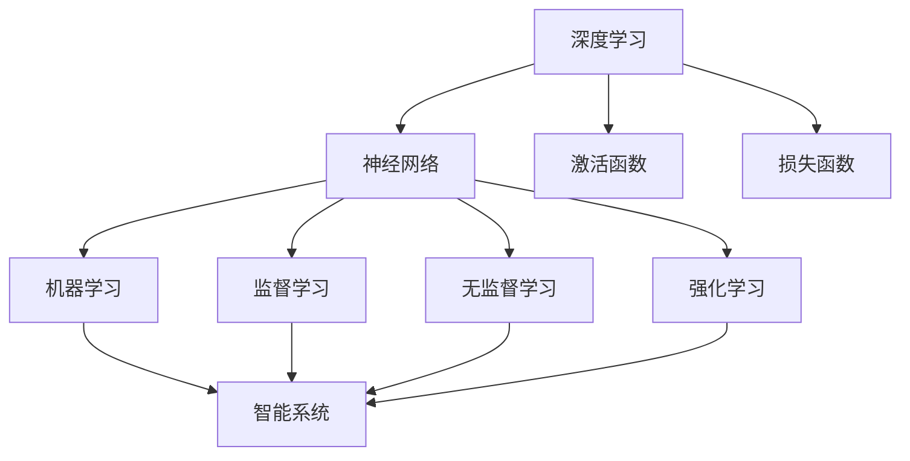

                 

关键词：人工智能、AI 2.0、生态、深度学习、神经网络、机器学习、智能系统、未来展望

摘要：本文旨在深入探讨AI 2.0时代的生态，解析其核心概念、技术原理、算法模型，并展望其未来发展。作者将结合自身的专业知识，提供逻辑清晰、结构紧凑、简单易懂的专业见解。

## 1. 背景介绍

人工智能（AI）作为一门交叉学科，涵盖了计算机科学、认知科学、认知心理学等多个领域。自1956年达特茅斯会议以来，人工智能的发展经历了数次起伏。20世纪80年代，专家系统的兴起让AI进入了实用阶段，但受限于知识获取的瓶颈，AI的发展在90年代后逐渐放缓。进入21世纪，随着大数据、云计算和深度学习的迅猛发展，人工智能迎来了新的春天，进入了AI 2.0时代。

AI 2.0时代相较于1.0时代，具有以下几个显著特点：

1. **数据驱动**：AI 2.0更加注重数据的价值，通过大量数据训练模型，从而提高模型的准确性和泛化能力。
2. **深度学习**：神经网络尤其是深度学习的崛起，使得AI在图像识别、语音识别、自然语言处理等领域取得了重大突破。
3. **自组织与自适应**：AI 2.0具备更强的自学习和自适应能力，能够在不完全依赖人类专家知识的情况下，自主调整模型参数。
4. **跨界融合**：AI 2.0与其他领域的深度融合，如生物信息学、神经科学等，推动了AI技术的创新和应用。

## 2. 核心概念与联系

在AI 2.0时代，核心概念和技术的联系如下：

### 2.1 深度学习

深度学习是一种基于神经网络的机器学习方法，通过多层神经网络对数据进行特征提取和变换，从而实现复杂任务的自动化。深度学习的核心包括：

- **神经网络**：一种模拟生物神经系统的计算模型，由大量神经元组成，通过前向传播和反向传播进行信息传递。
- **激活函数**：用于引入非线性变换，使得神经网络能够处理更复杂的问题。
- **损失函数**：用于评估模型的预测误差，引导模型优化参数。

### 2.2 机器学习

机器学习是AI的核心技术之一，通过构建模型从数据中学习规律和模式，从而实现自动化决策和预测。机器学习主要包括监督学习、无监督学习和强化学习三种类型。

- **监督学习**：通过标记数据进行训练，使得模型能够对未知数据进行预测。
- **无监督学习**：在没有标记数据的情况下，发现数据中的隐含结构。
- **强化学习**：通过与环境的交互，学习最优策略以实现特定目标。

### 2.3 智能系统

智能系统是将AI技术应用于实际问题的解决方案，具备智能感知、决策和执行能力。智能系统通常由传感器、执行器和AI算法组成，通过感知环境、分析数据和执行动作，实现自动化和智能化。

### 2.4 生态联系

深度学习、机器学习和智能系统之间的联系如下图所示：



## 3. 核心算法原理 & 具体操作步骤

### 3.1 算法原理概述

深度学习算法主要基于多层神经网络进行构建，通过前向传播和反向传播对模型进行训练和优化。具体步骤如下：

1. **前向传播**：将输入数据通过多层神经网络进行特征提取和变换，得到输出结果。
2. **损失计算**：计算输出结果与真实值之间的差异，得到损失值。
3. **反向传播**：将损失值反向传播到网络中的每个神经元，更新模型参数。
4. **迭代优化**：重复前向传播和反向传播的过程，逐步优化模型参数，直至满足停止条件。

### 3.2 算法步骤详解

1. **初始化模型参数**：随机初始化模型的权重和偏置。
2. **前向传播**：
   - 将输入数据通过输入层传递到第一层隐藏层，计算输出。
   - 将第一层隐藏层的输出传递到第二层隐藏层，计算输出。
   - 重复上述步骤，直至输出层得到最终结果。
3. **损失计算**：使用损失函数计算输出结果与真实值之间的差异。
4. **反向传播**：
   - 计算输出层误差对隐藏层神经元的梯度。
   - 将误差反向传递到隐藏层，计算隐藏层误差对输入层神经元的梯度。
   - 更新模型参数。
5. **迭代优化**：重复前向传播和反向传播的过程，直至满足停止条件。

### 3.3 算法优缺点

深度学习算法具有以下优点：

- **强大的特征提取能力**：通过多层神经网络，能够提取数据中的深层特征。
- **良好的泛化能力**：通过大量的训练数据和反向传播，能够降低过拟合现象。

但深度学习算法也存在以下缺点：

- **对数据的需求量较大**：训练深度模型需要大量的数据，数据质量和数量对模型性能有重要影响。
- **计算资源消耗大**：训练深度模型需要大量的计算资源，可能导致训练时间较长。
- **参数调优复杂**：深度模型的参数调优过程复杂，需要尝试多种参数组合。

### 3.4 算法应用领域

深度学习算法在以下领域具有广泛的应用：

- **计算机视觉**：图像识别、目标检测、图像生成等。
- **自然语言处理**：文本分类、机器翻译、情感分析等。
- **语音识别**：语音识别、语音合成、语音增强等。
- **推荐系统**：基于用户行为和兴趣进行个性化推荐。

## 4. 数学模型和公式

### 4.1 数学模型构建

深度学习算法的核心是多层神经网络，其数学模型可以表示为：

\[ y = \sigma(W \cdot x + b) \]

其中，\( y \) 是输出值，\( \sigma \) 是激活函数，\( W \) 是权重矩阵，\( x \) 是输入值，\( b \) 是偏置向量。

### 4.2 公式推导过程

1. **前向传播**：

\[ z = W \cdot x + b \]

\[ a = \sigma(z) \]

2. **损失计算**：

\[ L = -\frac{1}{m} \sum_{i=1}^{m} y_i \cdot \log(a_i) + (1 - y_i) \cdot \log(1 - a_i) \]

其中，\( y_i \) 是真实值，\( a_i \) 是预测值。

3. **反向传播**：

\[ \delta = a - y \]

\[ \frac{\partial L}{\partial W} = \delta \cdot a \cdot (1 - a) \cdot x \]

\[ \frac{\partial L}{\partial b} = \delta \cdot a \cdot (1 - a) \]

### 4.3 案例分析与讲解

以图像识别任务为例，假设我们有1000张猫和狗的图像，每张图像包含32x32像素，共10000个像素点。我们需要通过深度学习算法将这些图像分类。

1. **数据预处理**：
   - 将图像转换为灰度图像。
   - 将图像缩放到统一大小，如28x28像素。
   - 将图像数据归一化，使得像素值范围在0-1之间。

2. **模型构建**：
   - 输入层：28x28个神经元。
   - 隐藏层：100个神经元。
   - 输出层：2个神经元（猫和狗的分类）。

3. **模型训练**：
   - 使用随机梯度下降（SGD）进行模型训练。
   - 设置学习率为0.001，迭代次数为1000次。

4. **模型评估**：
   - 计算模型的准确率、召回率、F1值等指标。

## 5. 项目实践：代码实例和详细解释说明

### 5.1 开发环境搭建

- **Python环境**：安装Python 3.7及以上版本。
- **深度学习框架**：安装TensorFlow 2.0及以上版本。
- **图像处理库**：安装OpenCV 4.0及以上版本。

### 5.2 源代码详细实现

```python
import tensorflow as tf
import cv2
import numpy as np

# 数据预处理
def preprocess_image(image):
    image = cv2.cvtColor(image, cv2.COLOR_BGR2GRAY)
    image = cv2.resize(image, (28, 28))
    image = image / 255.0
    return image.flatten()

# 构建模型
model = tf.keras.Sequential([
    tf.keras.layers.Dense(100, activation='relu', input_shape=(784,)),
    tf.keras.layers.Dense(2, activation='softmax')
])

# 模型编译
model.compile(optimizer='adam', loss='categorical_crossentropy', metrics=['accuracy'])

# 训练模型
train_images = np.load('train_images.npy')
train_labels = np.load('train_labels.npy')
model.fit(train_images, train_labels, epochs=1000)

# 模型评估
test_images = np.load('test_images.npy')
test_labels = np.load('test_labels.npy')
loss, accuracy = model.evaluate(test_images, test_labels)
print('Test accuracy:', accuracy)
```

### 5.3 代码解读与分析

- **数据预处理**：将图像数据转换为灰度图像，并缩放到统一大小，然后进行归一化处理。
- **模型构建**：使用TensorFlow构建一个简单的全连接神经网络，包括一个隐藏层和输出层。
- **模型编译**：设置优化器和损失函数，准备训练模型。
- **模型训练**：使用训练数据训练模型，设置迭代次数。
- **模型评估**：使用测试数据评估模型性能。

## 6. 实际应用场景

深度学习在以下实际应用场景中具有重要价值：

- **计算机视觉**：图像识别、目标检测、图像生成等。
- **自然语言处理**：文本分类、机器翻译、情感分析等。
- **语音识别**：语音识别、语音合成、语音增强等。
- **推荐系统**：基于用户行为和兴趣进行个性化推荐。

## 7. 未来应用展望

随着深度学习技术的不断发展，未来人工智能将在更多领域发挥重要作用。以下是一些潜在的应用领域：

- **医疗健康**：利用深度学习进行疾病诊断、药物研发和个性化治疗。
- **智能制造**：利用深度学习实现智能机器人、智能工厂和智能供应链。
- **智能交通**：利用深度学习实现智能驾驶、智能交通管理和智能交通规划。
- **金融科技**：利用深度学习进行风险管理、信用评估和智能投顾。

## 8. 总结：未来发展趋势与挑战

### 8.1 研究成果总结

自AI 2.0时代以来，深度学习在计算机视觉、自然语言处理、语音识别等领域取得了显著的成果。随着算法的不断完善和计算资源的不断提升，深度学习将进一步提升AI系统的性能和可靠性。

### 8.2 未来发展趋势

1. **多模态融合**：将多种数据源（如图像、文本、语音）进行融合，实现更丰富的信息处理能力。
2. **自适应与自主学习**：开发更先进的自适应和学习算法，实现AI系统的自主学习和优化。
3. **伦理与安全**：加强AI伦理和安全研究，确保AI系统的透明性、可靠性和安全性。
4. **跨领域应用**：深度学习将在更多领域得到应用，推动各行各业的智能化转型。

### 8.3 面临的挑战

1. **数据隐私与安全**：如何保护用户数据隐私和安全，成为AI系统面临的重要挑战。
2. **计算资源消耗**：深度学习算法对计算资源的需求较高，如何优化算法和硬件，降低计算成本。
3. **伦理与责任**：如何确保AI系统的公平性、透明性和责任归属，避免潜在的社会风险。
4. **算法可解释性**：如何提高深度学习算法的可解释性，使其更具可信度和可接受度。

### 8.4 研究展望

未来，深度学习将在多模态融合、自适应与自主学习、伦理与安全等方面取得重要突破。同时，随着计算资源的提升和算法优化，深度学习将在更多领域实现广泛应用，为人类社会带来巨大价值。

## 9. 附录：常见问题与解答

### 问题1：什么是深度学习？

深度学习是一种基于神经网络的机器学习方法，通过多层神经网络对数据进行特征提取和变换，从而实现复杂任务的自动化。

### 问题2：深度学习算法如何训练？

深度学习算法通过前向传播和反向传播进行训练。首先，将输入数据通过多层神经网络进行特征提取和变换，得到输出结果；然后，计算输出结果与真实值之间的差异，得到损失值；接着，通过反向传播计算损失值对网络中每个神经元的梯度；最后，更新模型参数，重复上述过程，直至满足停止条件。

### 问题3：深度学习算法有哪些优缺点？

深度学习算法的优点包括强大的特征提取能力、良好的泛化能力等；缺点包括对数据的需求量较大、计算资源消耗大、参数调优复杂等。

### 问题4：深度学习算法在哪些领域有应用？

深度学习算法在计算机视觉、自然语言处理、语音识别、推荐系统等领域具有广泛的应用。

### 问题5：如何优化深度学习算法？

可以通过以下方法优化深度学习算法：调整学习率、选择合适的优化器、增加训练数据、调整网络结构等。

### 问题6：什么是多模态融合？

多模态融合是将多种数据源（如图像、文本、语音）进行融合，以实现更丰富的信息处理能力。

### 问题7：什么是自适应与自主学习？

自适应与自主学习是指AI系统能够根据环境和数据的变化，自主调整模型参数和学习策略，以提高性能。

### 问题8：什么是算法可解释性？

算法可解释性是指AI系统能够提供对决策过程和预测结果的解释，以提高透明性和可接受度。

### 问题9：如何确保AI系统的伦理与安全？

确保AI系统的伦理与安全需要从算法设计、数据管理、法律法规等多个方面进行综合考虑，包括数据隐私保护、公平性评估、安全漏洞检测等。

### 问题10：什么是深度学习算法的未来发展趋势？

深度学习算法的未来发展趋势包括多模态融合、自适应与自主学习、伦理与安全研究、跨领域应用等。

# 作者：禅与计算机程序设计艺术 / Zen and the Art of Computer Programming

