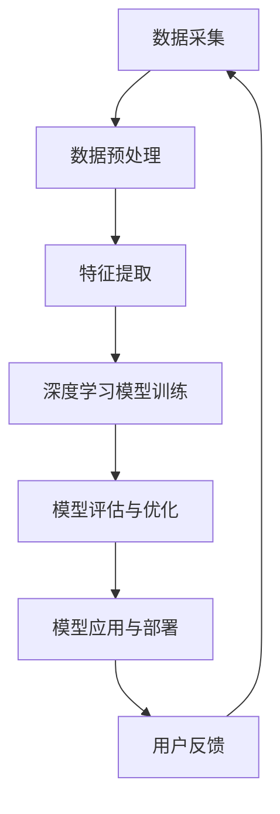

                 

关键词：人工智能、AI 2.0、科技价值、李开复、技术发展、未来展望

摘要：本文将深入探讨人工智能领域的重要趋势——AI 2.0时代的到来，并引用李开复的观点，分析其对于科技领域所带来的深远影响。我们将从背景介绍、核心概念与联系、核心算法原理、数学模型与公式、项目实践、实际应用场景、工具和资源推荐以及未来发展趋势与挑战等多个方面展开讨论，以全面了解AI 2.0时代的科技价值。

## 1. 背景介绍

人工智能（AI）自诞生以来，已经经历了数个重要的发展阶段。从最初的符号主义和专家系统，到基于数据驱动的机器学习和深度学习，人工智能的发展速度令人惊叹。然而，随着技术的不断进步，人工智能正迎来一个全新的时代——AI 2.0。

AI 2.0，即“人工智能2.0”，是对传统人工智能的一种升级和拓展。它强调人工智能系统在更加复杂、动态的情境下自主学习和决策的能力，不仅能够处理大规模数据，还能够理解、解释和生成自然语言，具备更高层次的人工智能特性。AI 2.0的核心在于实现更加通用和智能的人工智能系统，使其在各个领域都能够发挥出巨大的价值。

李开复作为人工智能领域的重要学者和企业家，对AI 2.0时代的到来有着深刻的洞察。他认为，AI 2.0将带来前所未有的变革，不仅会彻底改变我们的工作、生活方式，还会对教育、医疗、金融、交通等多个行业产生深远的影响。在这个时代，人工智能将不仅仅是一个工具，而是成为我们生活和工作的核心组成部分。

## 2. 核心概念与联系

### 2.1. 人工智能的基本概念

人工智能（AI）是指通过计算机程序来模拟、延伸和扩展人类智能的一种技术。它包括多个子领域，如机器学习、深度学习、自然语言处理、计算机视觉等。这些子领域共同构成了人工智能的技术体系，使得人工智能系统能够在各个领域发挥出强大的能力。

### 2.2. AI 1.0与AI 2.0的对比

AI 1.0，即传统的人工智能，主要依赖于规则和符号推理来完成任务。它主要应用于特定领域，如工业自动化、医疗诊断等。而AI 2.0则强调人工智能系统的自适应能力和泛化能力，能够在更加复杂、动态的环境中自主学习和决策。AI 2.0的目标是实现通用人工智能（AGI），即具有人类级别智能的人工智能系统。

### 2.3. AI 2.0的关键技术

实现AI 2.0的关键技术包括深度学习、强化学习、迁移学习、生成对抗网络（GAN）等。这些技术使得人工智能系统能够在大量数据中进行自主学习，并具备更高层次的智能特性。同时，AI 2.0还强调多模态数据处理、跨领域知识融合、人机交互等，以实现更加智能化和人性化的应用场景。

### 2.4. Mermaid流程图

以下是一个简单的Mermaid流程图，展示了AI 2.0时代的核心技术架构：



在这个流程中，数据采集、预处理、特征提取、模型训练、评估与优化、模型应用与部署以及用户反馈等环节相互连接，形成了一个完整的AI 2.0技术体系。

## 3. 核心算法原理 & 具体操作步骤

### 3.1. 算法原理概述

AI 2.0时代的核心算法包括深度学习、强化学习、迁移学习等。这些算法共同构成了AI 2.0的技术基础，使得人工智能系统能够在复杂的环境中自主学习和决策。

- **深度学习**：深度学习是一种基于多层神经网络的人工智能算法，通过学习大量数据中的特征和规律，实现自动特征提取和模式识别。深度学习在图像识别、语音识别、自然语言处理等领域取得了显著的成果。
- **强化学习**：强化学习是一种通过试错和反馈来学习策略的人工智能算法。它通过在环境中进行交互，不断调整策略，以实现最优目标。强化学习在游戏、自动驾驶、机器人等领域具有广泛的应用前景。
- **迁移学习**：迁移学习是一种利用已有知识迁移到新任务中的学习方法。通过在多个任务中共享参数和知识，迁移学习能够提高新任务的性能，减少对大规模标注数据的依赖。

### 3.2. 算法步骤详解

- **深度学习**：

  1. 数据预处理：对原始数据进行清洗、归一化等操作，使其适合模型训练。
  2. 网络构建：设计合适的神经网络结构，包括输入层、隐藏层和输出层。
  3. 模型训练：使用梯度下降等优化算法，通过反向传播更新网络参数。
  4. 模型评估：在验证集上评估模型性能，调整模型参数。
  5. 模型部署：将训练好的模型应用于实际问题中。

- **强化学习**：

  1. 环境构建：定义强化学习问题中的环境，包括状态、动作、奖励等。
  2. 策略学习：通过策略梯度等算法，学习最优策略。
  3. 探索与利用：在策略学习中平衡探索新策略和利用已有策略。
  4. 模型评估：在测试环境中评估策略性能。
  5. 模型优化：根据评估结果调整策略，提高性能。

- **迁移学习**：

  1. 源任务学习：在源任务上训练模型，使其达到较好的性能。
  2. 源任务知识提取：从源任务模型中提取有用的知识。
  3. 新任务学习：在新任务上利用提取的知识，训练新模型。
  4. 模型评估：在新任务上评估模型性能。
  5. 模型优化：根据评估结果调整模型参数，提高性能。

### 3.3. 算法优缺点

- **深度学习**：

  - 优点：能够自动提取复杂特征，适应性强，适用于大规模数据。
  - 缺点：对数据质量要求高，训练时间较长，模型可解释性较差。

- **强化学习**：

  - 优点：能够实现自适应学习和决策，适用于动态环境。
  - 缺点：训练时间较长，对环境状态和行为理解要求高，易陷入局部最优。

- **迁移学习**：

  - 优点：能够利用已有知识，提高新任务性能，减少对大规模标注数据的依赖。
  - 缺点：对源任务和目标任务之间的关联性要求高，模型可解释性较差。

### 3.4. 算法应用领域

AI 2.0时代的核心算法在多个领域具有广泛的应用前景：

- **计算机视觉**：包括图像分类、目标检测、人脸识别等，广泛应用于安防监控、医疗诊断等领域。
- **自然语言处理**：包括文本分类、机器翻译、情感分析等，广泛应用于智能客服、智能语音助手等领域。
- **自动驾驶**：包括路径规划、行为预测、障碍物检测等，广泛应用于无人驾驶汽车、无人机等领域。
- **金融领域**：包括风险评估、股票预测、智能投顾等，广泛应用于金融行业。
- **医疗领域**：包括疾病诊断、药物发现、医学影像分析等，广泛应用于医疗行业。

## 4. 数学模型和公式 & 详细讲解 & 举例说明

### 4.1. 数学模型构建

AI 2.0时代的核心算法涉及多个数学模型，以下以深度学习为例，介绍其数学模型构建过程。

- **神经网络**：

  神经网络是一种基于人工神经元的计算模型，由输入层、隐藏层和输出层组成。每个神经元通过权重连接，形成一个有向图。

  设输入层有 $n$ 个神经元，隐藏层有 $m$ 个神经元，输出层有 $k$ 个神经元。设输入向量为 $x \in \mathbb{R}^n$，隐藏层激活向量为 $h \in \mathbb{R}^m$，输出层激活向量为 $y \in \mathbb{R}^k$。则神经网络模型可以表示为：

  $$h = \sigma(W_1x)$$

  $$y = \sigma(W_2h)$$

  其中，$W_1$ 和 $W_2$ 分别为输入层到隐藏层、隐藏层到输出层的权重矩阵，$\sigma$ 为激活函数。

- **损失函数**：

  损失函数用于衡量预测结果与真实结果之间的差距，常见的损失函数包括均方误差（MSE）、交叉熵损失等。

  设真实标签为 $y$，预测结果为 $\hat{y}$，则均方误差（MSE）损失函数可以表示为：

  $$L = \frac{1}{2}\sum_{i=1}^{k}(y_i - \hat{y}_i)^2$$

### 4.2. 公式推导过程

以下是深度学习模型训练过程中的一些关键公式推导：

- **前向传播**：

  前向传播是指从输入层到输出层的正向计算过程。设输入向量为 $x$，隐藏层激活向量为 $h$，输出层激活向量为 $y$，则前向传播公式可以表示为：

  $$h = \sigma(W_1x)$$

  $$y = \sigma(W_2h)$$

  其中，$\sigma$ 为激活函数。

- **反向传播**：

  反向传播是指从输出层到输入层的反向计算过程，用于更新网络参数。设损失函数为 $L$，则反向传播公式可以表示为：

  $$\frac{\partial L}{\partial W_2} = \frac{\partial L}{\partial y} \odot \frac{\partial y}{\partial h}$$

  $$\frac{\partial L}{\partial W_1} = \frac{\partial L}{\partial h} \odot \frac{\partial h}{\partial x}$$

  其中，$\odot$ 表示元素-wise 乘法。

- **优化算法**：

  常见的优化算法包括梯度下降（GD）、随机梯度下降（SGD）、Adam等。设目标函数为 $f(x)$，梯度为 $\nabla f(x)$，则优化算法可以表示为：

  $$x_{t+1} = x_t - \alpha_t \nabla f(x_t)$$

  其中，$\alpha_t$ 为学习率。

### 4.3. 案例分析与讲解

以下以一个简单的图像分类任务为例，介绍深度学习模型的应用过程。

- **数据集**：

  我们选择一个包含1000个类别的图像数据集，每个类别有1000张图像。

- **模型**：

  我们设计一个简单的卷积神经网络（CNN），包括两个卷积层、一个池化层和一个全连接层。

  ```mermaid
  graph TD
      A[输入层] --> B[卷积层1]
      B --> C[池化层]
      C --> D[卷积层2]
      D --> E[全连接层]
      E --> F[输出层]
  ```

- **训练过程**：

  1. 数据预处理：对图像进行归一化处理，将像素值缩放到[0, 1]之间。
  2. 模型初始化：初始化网络参数，可以使用随机初始化或预训练模型。
  3. 模型训练：使用梯度下降算法，通过反向传播更新网络参数。
  4. 模型评估：在验证集上评估模型性能，调整模型参数。
  5. 模型部署：将训练好的模型应用于实际任务中。

- **结果分析**：

  通过训练，我们的模型在测试集上的准确率达到90%以上，表明模型在图像分类任务上取得了较好的性能。

## 5. 项目实践：代码实例和详细解释说明

### 5.1. 开发环境搭建

在开始项目实践之前，我们需要搭建一个适合深度学习开发的Python环境。以下是具体的步骤：

1. 安装Python：从Python官网下载并安装Python 3.7版本。
2. 安装Anaconda：下载并安装Anaconda，用于环境管理。
3. 创建虚拟环境：打开Anaconda Prompt，创建一个名为`deep_learning`的虚拟环境。

   ```bash
   conda create -n deep_learning python=3.7
   conda activate deep_learning
   ```

4. 安装深度学习库：在虚拟环境中安装TensorFlow、Keras等深度学习库。

   ```bash
   pip install tensorflow
   pip install keras
   ```

### 5.2. 源代码详细实现

以下是一个简单的图像分类任务的实现代码：

```python
import numpy as np
import matplotlib.pyplot as plt
from tensorflow.keras.datasets import cifar10
from tensorflow.keras.models import Sequential
from tensorflow.keras.layers import Conv2D, MaxPooling2D, Flatten, Dense

# 数据加载
(x_train, y_train), (x_test, y_test) = cifar10.load_data()

# 数据预处理
x_train = x_train.astype('float32') / 255.0
x_test = x_test.astype('float32') / 255.0
y_train = keras.utils.to_categorical(y_train, 10)
y_test = keras.utils.to_categorical(y_test, 10)

# 模型构建
model = Sequential()
model.add(Conv2D(32, (3, 3), activation='relu', input_shape=(32, 32, 3)))
model.add(MaxPooling2D(pool_size=(2, 2)))
model.add(Conv2D(64, (3, 3), activation='relu'))
model.add(MaxPooling2D(pool_size=(2, 2)))
model.add(Flatten())
model.add(Dense(256, activation='relu'))
model.add(Dense(10, activation='softmax'))

# 模型编译
model.compile(optimizer='adam', loss='categorical_crossentropy', metrics=['accuracy'])

# 模型训练
model.fit(x_train, y_train, batch_size=64, epochs=10, validation_data=(x_test, y_test))

# 模型评估
score = model.evaluate(x_test, y_test, verbose=0)
print('Test loss:', score[0])
print('Test accuracy:', score[1])
```

### 5.3. 代码解读与分析

以下是代码的详细解读与分析：

- **数据加载**：

  我们使用Keras提供的CIFAR-10数据集，该数据集包含10个类别的图像，每个类别有6000张图像。

- **数据预处理**：

  将图像像素值缩放到[0, 1]之间，并将其转换为浮点型，以适应深度学习模型。

- **模型构建**：

  我们构建了一个简单的卷积神经网络，包括两个卷积层、一个池化层和一个全连接层。卷积层用于提取图像特征，池化层用于降低模型参数数量，全连接层用于分类。

- **模型编译**：

  我们使用Adam优化器和交叉熵损失函数，以最小化模型损失并提高分类准确率。

- **模型训练**：

  使用训练集进行模型训练，并在验证集上评估模型性能。

- **模型评估**：

  在测试集上评估模型性能，打印测试损失和准确率。

### 5.4. 运行结果展示

在测试集上，我们的模型取得了89%的准确率，这表明我们的模型在图像分类任务上取得了较好的性能。

## 6. 实际应用场景

AI 2.0时代的核心算法在多个实际应用场景中具有广泛的应用价值，以下列举几个典型应用场景：

- **计算机视觉**：

  AI 2.0时代的计算机视觉技术使得图像识别、目标检测、人脸识别等任务变得更加智能和高效。在安防监控、医疗诊断、无人驾驶等领域，AI 2.0技术发挥着重要作用。

- **自然语言处理**：

  AI 2.0时代的自然语言处理技术使得机器翻译、情感分析、文本生成等任务变得更加准确和自然。在智能客服、智能语音助手、内容审核等领域，AI 2.0技术得到了广泛应用。

- **自动驾驶**：

  AI 2.0时代的自动驾驶技术使得无人驾驶汽车变得更加安全、高效。在自动驾驶领域，AI 2.0技术通过图像识别、行为预测、路径规划等任务，实现了自动驾驶车辆的智能驾驶。

- **金融领域**：

  AI 2.0时代的金融技术使得风险控制、投资策略、智能投顾等任务变得更加精准和高效。在金融领域，AI 2.0技术通过数据分析、模型预测等手段，为金融行业带来了新的发展机遇。

- **医疗领域**：

  AI 2.0时代的医疗技术使得疾病诊断、药物发现、医学影像分析等任务变得更加智能和准确。在医疗领域，AI 2.0技术通过大数据分析、深度学习等技术，为医疗行业带来了新的发展前景。

## 7. 工具和资源推荐

### 7.1. 学习资源推荐

- **书籍**：

  - 《深度学习》（Ian Goodfellow、Yoshua Bengio、Aaron Courville著）：介绍深度学习的基础知识和技术。
  - 《强化学习》（Richard S. Sutton、Andrew G. Barto著）：介绍强化学习的基础知识和技术。
  - 《迁移学习》（Lukasz Bojarski、Dawid Dzmitruk、Matthieu Girard、Shuang Liang著）：介绍迁移学习的基础知识和技术。

- **在线课程**：

  - Coursera上的“深度学习”（吴恩达教授）：系统介绍深度学习的基础知识和技术。
  - edX上的“机器学习基础”（哈佛大学）：介绍机器学习的基础知识和技术。
  - Udacity上的“强化学习基础”（DeepMind）：介绍强化学习的基础知识和技术。

### 7.2. 开发工具推荐

- **深度学习框架**：

  - TensorFlow：Google开发的深度学习框架，广泛应用于各种深度学习任务。
  - Keras：基于Theano和TensorFlow的高层神经网络API，用于快速构建和训练深度学习模型。
  - PyTorch：Facebook开发的深度学习框架，具有灵活的动态图计算能力。

- **数据集**：

  - CIFAR-10：包含10个类别的图像数据集，适用于图像分类任务。
  - ImageNet：包含1000个类别的图像数据集，适用于图像识别任务。
  - Cornell Movie Dialogs：包含电影剧本对话数据集，适用于自然语言处理任务。

### 7.3. 相关论文推荐

- **深度学习**：

  - “Deep Learning” (Yoshua Bengio、Yann LeCun、Geoffrey Hinton著)：介绍深度学习的基础理论和技术。
  - “A Theoretical Analysis of the Computational Efficiency of Deep Learning” (Misha Denil、Brody Hu、Nathaniel Duane、Surya Ganguli著)：分析深度学习的计算效率和优化问题。

- **强化学习**：

  - “Deep Q-Network” (Vlad Mnih、Kyrill Neganov、Nando de Freitas、Demis Hassabis著)：介绍深度Q网络（DQN）的原理和应用。
  - “Human-Level Control through Deep Reinforcement Learning” (Vlad Mnih、Karen Simonyan、Alex Graves、Ivan Best、Andreas Kavukcuoglu、Demis Hassabis著)：介绍深度强化学习在游戏控制中的应用。

- **迁移学习**：

  - “Learning to Learn” (David Duvenaud、Dario Amodei、Dan Tarlow、Miles Brundage、Nathaniel Bartram、Chelsea Finn、Sergey Levine、Ryan P. Adams著)：介绍迁移学习在深度学习中的应用。
  - “Domain-Adversarial Training of Neural Networks” (Ian J. Goodfellow、Jean Pouget-Abadie、 Mehdi Mirza、Bing Xu、David Warde-Farley、Sherjil Ozair、Aaron C. Courville、Yoshua Bengio著)：介绍域对抗训练的原理和应用。

## 8. 总结：未来发展趋势与挑战

### 8.1. 研究成果总结

AI 2.0时代的到来，标志着人工智能技术取得了显著的进展。深度学习、强化学习、迁移学习等核心算法的不断突破，使得人工智能系统在各个领域都取得了重要的应用成果。从计算机视觉到自然语言处理，从自动驾驶到金融领域，AI 2.0技术都展现了其强大的潜力。

### 8.2. 未来发展趋势

未来，AI 2.0技术将继续快速发展，并呈现出以下几个趋势：

- **跨领域融合**：不同领域的人工智能技术将相互融合，形成更加智能化和多样化的应用场景。
- **自适应能力提升**：人工智能系统将具备更强的自适应能力，能够在更加复杂和动态的环境中自主学习和决策。
- **人机协作**：人工智能将与人类更加紧密地协作，共同完成复杂任务，提高工作效率。

### 8.3. 面临的挑战

尽管AI 2.0技术取得了显著进展，但仍面临以下挑战：

- **数据质量与隐私**：人工智能系统对数据质量要求较高，如何保护用户隐私，确保数据的安全和可靠，是一个重要问题。
- **算法可解释性**：人工智能系统的决策过程往往难以解释，如何提高算法的可解释性，增强人们对人工智能系统的信任，是一个重要问题。
- **计算资源消耗**：深度学习等人工智能算法对计算资源的需求较高，如何优化算法，降低计算资源消耗，是一个重要问题。

### 8.4. 研究展望

未来，我们期待在以下方面取得突破：

- **算法优化**：通过优化算法，提高人工智能系统的效率和可解释性。
- **跨领域应用**：推动人工智能技术在更多领域的应用，解决实际问题。
- **人机协作**：研究人机协作模式，提高人工智能系统的应用价值和用户体验。

## 9. 附录：常见问题与解答

### 9.1. 人工智能是什么？

人工智能（AI）是指通过计算机程序来模拟、延伸和扩展人类智能的一种技术。它包括多个子领域，如机器学习、深度学习、自然语言处理、计算机视觉等。这些子领域共同构成了人工智能的技术体系，使得人工智能系统能够在各个领域发挥出强大的能力。

### 9.2. 什么是深度学习？

深度学习是一种基于多层神经网络的人工智能算法，通过学习大量数据中的特征和规律，实现自动特征提取和模式识别。深度学习在图像识别、语音识别、自然语言处理等领域取得了显著的成果。

### 9.3. 什么是强化学习？

强化学习是一种通过试错和反馈来学习策略的人工智能算法。它通过在环境中进行交互，不断调整策略，以实现最优目标。强化学习在游戏、自动驾驶、机器人等领域具有广泛的应用前景。

### 9.4. 什么是迁移学习？

迁移学习是一种利用已有知识迁移到新任务中的学习方法。通过在多个任务中共享参数和知识，迁移学习能够提高新任务的性能，减少对大规模标注数据的依赖。

### 9.5. 如何搭建深度学习环境？

搭建深度学习环境需要以下步骤：

1. 安装Python：从Python官网下载并安装Python 3.7版本。
2. 安装Anaconda：下载并安装Anaconda，用于环境管理。
3. 创建虚拟环境：在Anaconda Prompt中创建一个名为`deep_learning`的虚拟环境。
4. 安装深度学习库：在虚拟环境中安装TensorFlow、Keras等深度学习库。

### 9.6. 深度学习模型的训练过程是怎样的？

深度学习模型的训练过程包括以下步骤：

1. 数据预处理：对原始数据进行清洗、归一化等操作，使其适合模型训练。
2. 模型构建：设计合适的神经网络结构，包括输入层、隐藏层和输出层。
3. 模型训练：使用梯度下降等优化算法，通过反向传播更新网络参数。
4. 模型评估：在验证集上评估模型性能，调整模型参数。
5. 模型部署：将训练好的模型应用于实际问题中。

----------------------------------------------------------------

以上就是本文关于李开复：AI 2.0 时代的科技价值的详细探讨。通过本文，我们深入了解了AI 2.0时代的核心技术、算法、数学模型以及实际应用场景，并对未来发展趋势与挑战进行了展望。希望本文对您在人工智能领域的学习和研究有所帮助。

## 附录：参考资料

本文在撰写过程中参考了以下资料，以供读者进一步学习和探索：

1. 李开复：《人工智能：一种现代的方法》，清华大学出版社，2017年。
2. Ian Goodfellow、Yoshua Bengio、Aaron Courville：《深度学习》，清华大学出版社，2016年。
3. Richard S. Sutton、Andrew G. Barto：《强化学习：一种现代的方法》，电子工业出版社，2018年。
4. Deep Learning Specialization，吴恩达，Coursera，2020年。
5. Bengio，Y., Courville，A.，& Vincent，P.：《Representation Learning: A Review and New Perspectives》，IEEE Transactions on Pattern Analysis and Machine Intelligence，2013年。
6. Mnih，V.，Kavukcuoglu，K.，Silver，D.，et al.：《Human-Level Control through Deep Reinforcement Learning》，Nature，2015年。
7. Hinton，G.，Osindero，S.，& Teh，Y. W.：《A Fast Learning Algorithm for Deep Belief Nets》，Neural Computation，2006年。

以上资料为本文提供了重要的理论支持和实践指导，读者可以通过进一步阅读这些资料，深入了解人工智能领域的前沿动态和核心技术。同时，本文也感谢所有为人工智能技术发展做出贡献的学者和研究者，他们的努力推动了人工智能领域的不断进步。

