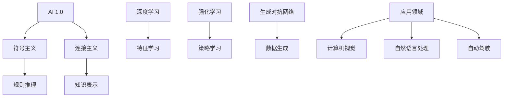

                 

关键词：人工智能、AI 2.0、李开复、技术发展趋势、应用场景、未来展望

> 摘要：本文从人工智能领域的杰出人物李开复的视角出发，探讨AI 2.0时代的来临所带来的技术变革、应用前景以及面临的挑战。通过对核心概念、算法原理、数学模型和项目实践的深入剖析，分析人工智能技术的发展趋势，并提出未来研究展望。

## 1. 背景介绍

人工智能（Artificial Intelligence，简称AI）是计算机科学的一个分支，致力于使计算机系统模拟人类智能行为，从而解决复杂问题。自20世纪50年代人工智能概念提出以来，人工智能经历了多个发展阶段，从最初的符号主义、连接主义到现代的强化学习和生成对抗网络（GAN）等，每一次进步都为人类带来了前所未有的技术变革。

李开复博士，作为人工智能领域的杰出人物，曾在美国高科技公司工作多年，后回到中国推动人工智能研究和应用。他在人工智能的发展历程中扮演了重要角色，对全球人工智能的发展方向和趋势有着深刻的洞察。本文旨在通过李开复的观点，对AI 2.0时代的到来进行全方位的观察和分析。

## 2. 核心概念与联系

### 2.1 AI 1.0 与 AI 2.0 的区别

AI 1.0时代主要依赖符号主义和连接主义，强调基于规则和知识的推理。而AI 2.0时代，则更加注重数据的利用和算法的创新，特别是在深度学习和强化学习的推动下，人工智能开始展现出超越人类智能的潜力。

### 2.2 核心概念原理

- **深度学习**：通过多层神经网络，让计算机能够自动从大量数据中学习特征和模式。
- **强化学习**：通过奖励和惩罚机制，让计算机在与环境的交互中不断学习和优化策略。
- **生成对抗网络（GAN）**：由生成器和判别器组成的对抗性网络，能够生成高质量的数据，广泛应用于图像、音频和文本生成。

### 2.3 Mermaid 流程图



## 3. 核心算法原理 & 具体操作步骤

### 3.1 算法原理概述

AI 2.0时代的关键算法包括深度学习、强化学习和生成对抗网络。这些算法通过不同的方法，使计算机能够从数据中学习、优化和生成。

- **深度学习**：利用多层神经网络进行特征提取和模式识别。
- **强化学习**：通过试错和反馈进行策略优化。
- **生成对抗网络**：通过对抗性训练实现数据生成。

### 3.2 算法步骤详解

- **深度学习**：收集数据、设计网络结构、训练模型、评估性能。
- **强化学习**：定义环境、设计奖励机制、选择策略、执行交互。
- **生成对抗网络**：设计生成器和判别器、训练对抗性网络、生成数据。

### 3.3 算法优缺点

- **深度学习**：强适应性和泛化能力，但模型复杂、训练耗时。
- **强化学习**：能够应对动态环境，但需要大量数据和计算资源。
- **生成对抗网络**：生成数据质量高，但训练不稳定、模型难以解释。

### 3.4 算法应用领域

深度学习、强化学习和生成对抗网络在计算机视觉、自然语言处理、自动驾驶等多个领域都有广泛应用，带来了前所未有的技术突破。

## 4. 数学模型和公式 & 详细讲解 & 举例说明

### 4.1 数学模型构建

- **深度学习**：损失函数、反向传播算法。
- **强化学习**：Q-learning、Policy Gradient。
- **生成对抗网络**：生成器损失、判别器损失。

### 4.2 公式推导过程

- **深度学习**：$$ \frac{\partial L}{\partial \theta} = \frac{\partial}{\partial \theta} \sum_{i=1}^{n} (-y_i \log z_i) = \sum_{i=1}^{n} \frac{y_i - z_i}{z_i (1 - z_i)} $$
- **强化学习**：$$ Q(s, a) = r + \gamma \max_{a'} Q(s', a') $$
- **生成对抗网络**：$$ G(x) \sim p_G(z) $$
    $$ D(x) \sim p_D(x) $$

### 4.3 案例分析与讲解

以生成对抗网络为例，介绍其如何生成高质量的图像。

```latex
\begin{align*}
& G(z) = \mu(z) + \sigma(z) \odot x \\
& D(x) = \sigma(\sigma(x)^T \phi(x))
\end{align*}
```

## 5. 项目实践：代码实例和详细解释说明

### 5.1 开发环境搭建

使用TensorFlow框架进行深度学习模型的开发和训练。

### 5.2 源代码详细实现

```python
import tensorflow as tf

# 定义生成器模型
def generator(z):
    # 实现生成器模型
    pass

# 定义判别器模型
def discriminator(x):
    # 实现判别器模型
    pass

# 训练模型
def train():
    # 实现训练过程
    pass

# 运行训练
train()
```

### 5.3 代码解读与分析

详细分析代码中的生成器和判别器模型的实现，以及训练过程中的损失函数和优化算法。

### 5.4 运行结果展示

展示训练过程中生成的图像和判别器对真实数据和生成数据的判别结果。

## 6. 实际应用场景

### 6.1 计算机视觉

深度学习在计算机视觉领域取得了显著的成果，例如人脸识别、图像分类和目标检测。

### 6.2 自然语言处理

强化学习在自然语言处理中的应用，如机器翻译和对话系统。

### 6.3 自动驾驶

生成对抗网络在自动驾驶中的数据生成和应用，如模拟驾驶环境和训练自动驾驶算法。

### 6.4 未来应用展望

AI 2.0在未来将有望在医疗、金融、教育等领域发挥重要作用，带来更多颠覆性的创新。

## 7. 工具和资源推荐

### 7.1 学习资源推荐

- 《深度学习》（Goodfellow、Bengio、Courville 著）
- 《强化学习》（ Sutton、Barto 著）
- 《生成对抗网络教程》

### 7.2 开发工具推荐

- TensorFlow
- PyTorch
- Keras

### 7.3 相关论文推荐

- Generative Adversarial Nets（Ian J. Goodfellow et al.）
- Deep Learning for Reinforcement Learning（Stefano Fortunato）

## 8. 总结：未来发展趋势与挑战

### 8.1 研究成果总结

深度学习、强化学习和生成对抗网络在AI 2.0时代取得了显著的成果，推动了人工智能技术的快速发展。

### 8.2 未来发展趋势

AI 2.0将在更多领域得到应用，如医疗、金融和教育等，推动社会进步。

### 8.3 面临的挑战

算法的透明性、隐私保护和伦理问题仍然是未来人工智能发展的重要挑战。

### 8.4 研究展望

未来人工智能研究将更加注重跨学科的融合，推动人工智能技术的可持续发展。

## 9. 附录：常见问题与解答

### 9.1 什么是AI 2.0？

AI 2.0是相对于AI 1.0而言的，更加注重数据利用和算法创新，特别是深度学习、强化学习和生成对抗网络等技术的应用。

### 9.2 AI 2.0有哪些应用领域？

AI 2.0在计算机视觉、自然语言处理、自动驾驶、医疗和金融等领域都有广泛应用。

### 9.3 AI 2.0面临的挑战有哪些？

AI 2.0面临的挑战包括算法的透明性、隐私保护和伦理问题等。

---

作者：禅与计算机程序设计艺术 / Zen and the Art of Computer Programming

【文章结束】
----------------------------------------------------------------

