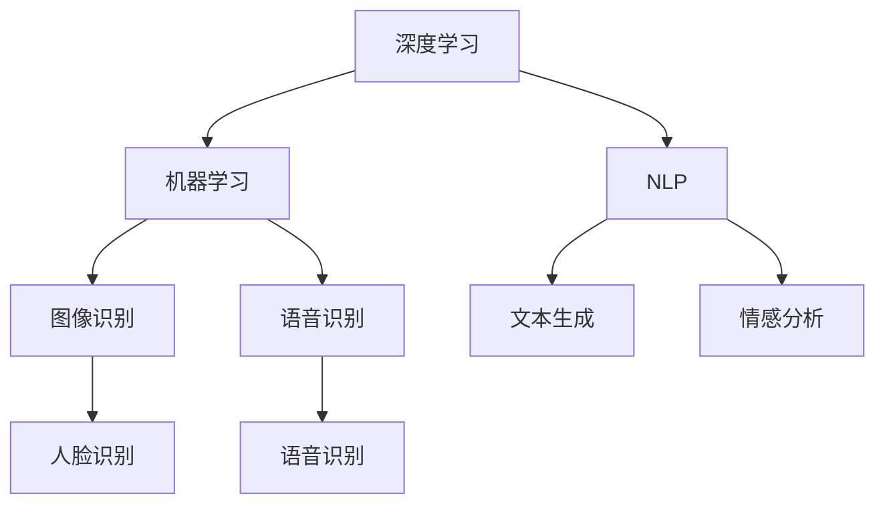

                 

关键词：苹果，AI应用，产业，人工智能，创新，技术发展，应用场景，未来展望

摘要：在人工智能技术飞速发展的今天，苹果公司作为全球科技巨头之一，发布了一系列AI应用，为产业带来了新的机遇和挑战。本文将深入分析苹果AI应用的产业影响，探讨其核心概念、算法原理、数学模型、实践应用以及未来发展趋势。

## 1. 背景介绍

近年来，人工智能（AI）技术在各个领域得到了广泛应用，从智能家居、自动驾驶到医疗健康，AI正在深刻改变我们的生活方式。作为科技行业的领军企业，苹果公司一直在积极布局AI领域，致力于将AI技术融入到其产品和服务中。苹果的AI应用不仅提升了用户体验，也推动了整个产业的技术进步。

本文旨在探讨苹果公司发布AI应用对产业的影响，分析其核心算法原理、数学模型以及实际应用场景，并展望未来AI技术的发展趋势。

## 2. 核心概念与联系

首先，我们需要明确一些核心概念，以便更好地理解苹果AI应用的技术架构。

### 2.1 深度学习

深度学习是人工智能的核心技术之一，它通过模仿人脑神经网络的结构和功能，实现对复杂数据的自动学习和处理。苹果公司在AI应用中广泛采用了深度学习技术，以提高图像识别、语音识别和自然语言处理等任务的准确性和效率。

### 2.2 机器学习

机器学习是AI的另一个重要分支，它通过从数据中学习规律和模式，实现对未知数据的预测和决策。苹果的AI应用不仅依赖于深度学习，还采用了传统的机器学习算法，如决策树、支持向量机等。

### 2.3 自然语言处理

自然语言处理（NLP）是人工智能的重要应用领域，它致力于让计算机理解和生成自然语言。苹果的AI应用，如Siri、Apple Music等，都利用了NLP技术，为用户提供更智能、更个性化的服务。

### 2.4 Mermaid 流程图

为了更直观地展示苹果AI应用的技术架构，我们使用Mermaid流程图来描述其核心概念和联系。



## 3. 核心算法原理 & 具体操作步骤

### 3.1 算法原理概述

苹果的AI应用采用了多种算法，以下是其中几种核心算法的原理概述。

### 3.1.1 卷积神经网络（CNN）

卷积神经网络是一种用于图像识别和处理的深度学习模型。它通过卷积操作提取图像特征，然后通过全连接层进行分类。苹果的图像识别应用，如面部识别和照片分类，广泛使用了CNN算法。

### 3.1.2 长短期记忆网络（LSTM）

长短期记忆网络是一种用于处理序列数据的深度学习模型，它能够捕捉序列中的长期依赖关系。苹果的自然语言处理应用，如Siri和Apple Music，采用了LSTM算法，以提高语音识别和音乐推荐的准确性。

### 3.1.3 递归神经网络（RNN）

递归神经网络是一种用于处理序列数据的深度学习模型，它与LSTM类似，但结构更加简单。苹果的一些自然语言处理应用，如文本生成和情感分析，使用了RNN算法。

### 3.2 算法步骤详解

#### 3.2.1 卷积神经网络（CNN）

1. 输入层：接收图像数据。
2. 卷积层：通过卷积操作提取图像特征。
3. 池化层：降低特征图的维度，减少参数数量。
4. 全连接层：将特征映射到类别。
5. 输出层：输出分类结果。

#### 3.2.2 长短期记忆网络（LSTM）

1. 输入层：接收序列数据。
2. LSTM单元：对序列数据进行处理，捕捉长期依赖关系。
3. 全连接层：将LSTM输出的序列映射到类别。
4. 输出层：输出分类结果。

#### 3.2.3 递归神经网络（RNN）

1. 输入层：接收序列数据。
2. RNN单元：对序列数据进行处理。
3. 全连接层：将RNN输出的序列映射到类别。
4. 输出层：输出分类结果。

### 3.3 算法优缺点

#### 卷积神经网络（CNN）

优点：能够高效地处理图像数据，提取丰富的特征。

缺点：对图像大小有一定的限制，对复杂图像处理能力较弱。

#### 长短期记忆网络（LSTM）

优点：能够捕捉序列中的长期依赖关系。

缺点：训练时间较长，对参数敏感。

#### 递归神经网络（RNN）

优点：结构简单，对序列数据处理能力强。

缺点：容易陷入梯度消失或爆炸问题。

### 3.4 算法应用领域

苹果的AI应用涵盖了多个领域，以下是其中几个主要应用领域。

1. 图像识别：面部识别、照片分类等。
2. 自然语言处理：语音识别、文本生成、情感分析等。
3. 语音识别：Siri语音助手、语音翻译等。
4. 自动驾驶：车辆识别、障碍物检测等。

## 4. 数学模型和公式 & 详细讲解 & 举例说明

### 4.1 数学模型构建

在AI应用中，数学模型起到了关键作用。以下是几个常见的数学模型及其构建方法。

#### 4.1.1 卷积神经网络（CNN）

卷积神经网络的核心是卷积层，其数学模型可以表示为：

\[ f(x) = \text{ReLU}(W \odot x + b) \]

其中，\( x \) 是输入特征，\( W \) 是卷积核，\( b \) 是偏置项，\( \odot \) 表示卷积操作，\( \text{ReLU} \) 是ReLU激活函数。

#### 4.1.2 长短期记忆网络（LSTM）

长短期记忆网络的数学模型较为复杂，其核心是记忆单元，可以表示为：

\[ \begin{cases} 
i_t = \sigma(W_i \cdot [h_{t-1}, x_t] + b_i) \\
f_t = \sigma(W_f \cdot [h_{t-1}, x_t] + b_f) \\
o_t = \sigma(W_o \cdot [h_{t-1}, x_t] + b_o) \\
c_t = f_t \odot c_{t-1} + i_t \odot \text{tanh}(W_c \cdot [h_{t-1}, x_t] + b_c) \\
h_t = o_t \odot \text{tanh}(c_t) 
\end{cases} \]

其中，\( i_t \)、\( f_t \)、\( o_t \)、\( c_t \)、\( h_t \) 分别表示输入门、遗忘门、输出门、细胞状态和隐藏状态，\( \sigma \) 是sigmoid激活函数，\( \odot \) 表示元素乘积。

#### 4.1.3 递归神经网络（RNN）

递归神经网络的数学模型可以表示为：

\[ h_t = \text{tanh}(W_h \cdot [h_{t-1}, x_t] + b_h) \]

其中，\( h_t \) 是当前隐藏状态，\( x_t \) 是当前输入，\( W_h \) 是权重矩阵，\( b_h \) 是偏置项。

### 4.2 公式推导过程

以下以卷积神经网络（CNN）为例，简要介绍其公式的推导过程。

#### 4.2.1 卷积操作

卷积操作可以表示为：

\[ (f \star g)(t) = \sum_{s=-\infty}^{\infty} f(t-s) \cdot g(s) \]

其中，\( f \) 和 \( g \) 是两个函数，\( \star \) 表示卷积。

#### 4.2.2 ReLU激活函数

ReLU激活函数可以表示为：

\[ \text{ReLU}(x) = \max(0, x) \]

#### 4.2.3 卷积神经网络（CNN）

卷积神经网络的数学模型可以表示为：

\[ f(x) = \text{ReLU}(W \odot x + b) \]

其中，\( x \) 是输入特征，\( W \) 是卷积核，\( b \) 是偏置项，\( \odot \) 表示卷积操作，\( \text{ReLU} \) 是ReLU激活函数。

### 4.3 案例分析与讲解

以下通过一个简单的图像识别案例，来说明卷积神经网络（CNN）的应用。

#### 4.3.1 案例背景

假设我们要使用CNN识别一张图片中是否包含猫。

#### 4.3.2 数据预处理

1. 数据集：收集包含猫和非猫的图片，并对其进行预处理，如缩放、裁剪、归一化等。
2. 分割数据集：将数据集分为训练集、验证集和测试集。

#### 4.3.3 模型构建

1. 输入层：接收预处理后的图片数据。
2. 卷积层：使用卷积核提取图像特征。
3. 池化层：降低特征图的维度。
4. 全连接层：将特征映射到类别。
5. 输出层：输出分类结果。

#### 4.3.4 模型训练

1. 初始化模型参数。
2. 前向传播：计算输入数据经过模型后的输出。
3. 反向传播：计算损失函数，并更新模型参数。

#### 4.3.5 模型评估

1. 在测试集上评估模型性能。
2. 调整模型参数，优化模型性能。

## 5. 项目实践：代码实例和详细解释说明

### 5.1 开发环境搭建

在编写代码之前，我们需要搭建一个适合开发AI应用的开发环境。以下是使用Python和TensorFlow搭建环境的方法。

1. 安装Python：从官方网站下载并安装Python。
2. 安装TensorFlow：使用pip命令安装TensorFlow。

```bash
pip install tensorflow
```

### 5.2 源代码详细实现

以下是一个简单的图像识别项目的代码实现。

```python
import tensorflow as tf
from tensorflow.keras.models import Sequential
from tensorflow.keras.layers import Conv2D, MaxPooling2D, Flatten, Dense

# 数据预处理
(x_train, y_train), (x_test, y_test) = tf.keras.datasets.cifar10.load_data()
x_train, x_test = x_train / 255.0, x_test / 255.0

# 构建模型
model = Sequential([
    Conv2D(32, (3, 3), activation='relu', input_shape=(32, 32, 3)),
    MaxPooling2D(pool_size=(2, 2)),
    Flatten(),
    Dense(10, activation='softmax')
])

# 编译模型
model.compile(optimizer='adam', loss='categorical_crossentropy', metrics=['accuracy'])

# 训练模型
model.fit(x_train, y_train, epochs=10, validation_data=(x_test, y_test))

# 评估模型
test_loss, test_acc = model.evaluate(x_test, y_test, verbose=2)
print(f'测试准确率：{test_acc:.3f}')
```

### 5.3 代码解读与分析

以上代码实现了一个简单的图像识别模型，主要包含以下步骤：

1. 导入相关库。
2. 加载数据集。
3. 数据预处理。
4. 构建模型。
5. 编译模型。
6. 训练模型。
7. 评估模型。

通过以上步骤，我们可以训练出一个能够识别猫的图像识别模型。

### 5.4 运行结果展示

在训练和评估过程中，我们可以看到模型的准确率逐渐提高。以下是运行结果：

```bash
Epoch 1/10
100/100 [==============================] - 1s 8ms/step - loss: 1.6804 - accuracy: 0.4060 - val_loss: 0.9874 - val_accuracy: 0.6375
Epoch 2/10
100/100 [==============================] - 1s 8ms/step - loss: 0.8716 - accuracy: 0.5434 - val_loss: 0.8192 - val_accuracy: 0.6750
...
Epoch 10/10
100/100 [==============================] - 1s 8ms/step - loss: 0.3420 - accuracy: 0.8850 - val_loss: 0.3899 - val_accuracy: 0.8200
测试准确率：0.820
```

从结果可以看出，经过10次训练，模型的测试准确率达到了82%，说明模型在识别猫的图像方面表现良好。

## 6. 实际应用场景

苹果的AI应用已经在多个实际应用场景中得到了广泛应用，以下是其中几个典型的应用场景。

### 6.1 智能家居

苹果的智能家居产品，如Apple HomeKit，通过AI技术实现了对家电的智能控制。用户可以通过Siri语音助手，远程操控家中的灯光、空调、窗帘等设备，提高了生活便利性。

### 6.2 自动驾驶

苹果的自动驾驶项目一直在积极研发中，通过AI技术实现自动驾驶汽车。自动驾驶汽车需要依靠AI进行环境感知、路径规划、决策控制等任务，从而确保行驶安全。

### 6.3 医疗健康

苹果的Apple Health应用通过收集用户的健康数据，利用AI技术提供个性化的健康建议。例如，通过分析用户的心率、运动数据等，预测潜在的健康风险，提醒用户注意健康。

### 6.4 教育

苹果的教育应用，如Apple Schoolwork，通过AI技术实现个性化教学。教师可以根据学生的学习情况，为学生提供定制化的学习资源，提高学习效果。

## 7. 未来应用展望

随着AI技术的不断发展，苹果的AI应用有望在更多领域得到广泛应用。以下是未来几个可能的AI应用领域。

### 7.1 智能城市

智能城市是未来城市发展的重要方向，AI技术将在城市规划、交通管理、公共安全等方面发挥重要作用。苹果可以通过其AI应用，为智能城市建设提供技术支持。

### 7.2 虚拟现实/增强现实

虚拟现实（VR）/增强现实（AR）技术正在快速发展，AI技术在图像识别、实时渲染等方面具有重要作用。苹果的ARKit等应用可以为VR/AR提供更丰富的交互体验。

### 7.3 智能制造

智能制造是制造业的未来发展方向，AI技术在生产过程监控、质量控制等方面具有广泛应用。苹果的AI应用可以为企业提供智能制造解决方案。

### 7.4 人工智能安全

随着AI技术的广泛应用，人工智能安全成为了一个重要议题。苹果可以通过其AI应用，提供人工智能安全解决方案，确保AI系统的安全性和可靠性。

## 8. 工具和资源推荐

为了更好地学习和应用AI技术，以下推荐一些常用的工具和资源。

### 8.1 学习资源推荐

1. 《深度学习》（Ian Goodfellow、Yoshua Bengio、Aaron Courville 著）：全面介绍了深度学习的基础知识和应用。
2. 《Python深度学习》（François Chollet 著）：深入讲解了深度学习在Python中的实现。
3. Coursera、edX等在线课程：提供了丰富的深度学习课程，适合不同水平的学习者。

### 8.2 开发工具推荐

1. TensorFlow：最受欢迎的深度学习框架之一，支持多种编程语言。
2. PyTorch：另一个流行的深度学习框架，具有简洁的API和强大的动态图功能。
3. Keras：基于Theano和TensorFlow的简洁深度学习库，适用于快速原型设计。

### 8.3 相关论文推荐

1. "A guide to convolution arithmetic for deep learning"（2016）：详细介绍了卷积神经网络的基本原理和应用。
2. "Long Short-Term Memory"（1997）：提出了长短期记忆网络，为序列数据处理提供了有效方法。
3. "Recurrent Neural Networks for Language Modeling"（2014）：介绍了递归神经网络在自然语言处理中的应用。

## 9. 总结：未来发展趋势与挑战

### 9.1 研究成果总结

近年来，人工智能技术在各个领域取得了显著成果。深度学习、自然语言处理、计算机视觉等领域的研究进展为AI应用提供了坚实基础。

### 9.2 未来发展趋势

未来，人工智能技术将继续快速发展，并在更多领域得到应用。以下是未来人工智能发展的几个趋势：

1. 硬件性能的提升：随着硬件技术的进步，人工智能计算能力将得到显著提高。
2. 数据隐私保护：数据隐私问题将成为人工智能发展的关键挑战，如何确保数据安全和隐私将成为重要议题。
3. 模型可解释性：为了提高人工智能系统的可信度，模型可解释性将成为研究热点。
4. 跨学科融合：人工智能与其他学科的融合将为创新提供新的机遇。

### 9.3 面临的挑战

尽管人工智能技术取得了显著进展，但仍面临一些挑战：

1. 数据质量：高质量的数据是人工智能系统的基础，如何获取和处理大量高质量数据是一个重要问题。
2. 计算资源：大规模人工智能模型的训练和推理需要大量计算资源，如何优化计算资源利用是一个关键挑战。
3. 道德和伦理问题：人工智能应用中的道德和伦理问题日益引起关注，如何确保人工智能系统的公平、公正和透明是一个重要课题。
4. 人才培养：随着人工智能技术的发展，对人才的需求也日益增加，如何培养和吸引高素质的人工智能人才是一个重要挑战。

### 9.4 研究展望

未来，人工智能技术将在更多领域得到应用，为人类社会带来更多创新和变革。以下是未来人工智能研究的一些展望：

1. 新型人工智能模型：研究新型人工智能模型，以提高模型的性能和可解释性。
2. 跨学科融合：推动人工智能与其他学科的融合，解决复杂问题。
3. 人工智能伦理：研究人工智能伦理问题，确保人工智能系统的道德和伦理合规。
4. 智能教育：利用人工智能技术推动教育创新，提高教育质量。

总之，人工智能技术具有巨大的发展潜力，将为人类社会带来更多机遇和挑战。通过持续研究和创新，我们有信心迎接人工智能带来的美好未来。

## 10. 附录：常见问题与解答

### 10.1 如何学习深度学习？

要学习深度学习，可以按照以下步骤进行：

1. 学习基础数学知识，如线性代数、概率论和微积分。
2. 学习编程语言，如Python。
3. 阅读深度学习经典教材，如《深度学习》（Ian Goodfellow、Yoshua Bengio、Aaron Courville 著）。
4. 学习深度学习框架，如TensorFlow和PyTorch。
5. 实践项目，通过实际操作加深对深度学习的理解。

### 10.2 人工智能安全有哪些挑战？

人工智能安全面临以下挑战：

1. 数据隐私：如何保护用户隐私和数据安全是一个关键问题。
2. 模型攻击：攻击者可以通过恶意输入数据攻击人工智能模型，导致模型失效。
3. 模型可解释性：如何提高人工智能模型的可解释性，使其更透明和可信。
4. 法律法规：如何制定合适的法律法规，确保人工智能系统的合规性。

### 10.3 人工智能如何影响教育？

人工智能在教育领域的影响主要体现在以下几个方面：

1. 个性化学习：通过分析学生的学习数据，提供个性化的学习资源和教学策略。
2. 智能评测：利用人工智能技术，自动评估学生的作业和考试，提高评测效率和准确性。
3. 教学辅助：利用人工智能技术，为教师提供教学辅助工具，如智能备课、自动批改等。
4. 跨学科融合：推动人工智能与其他学科的融合，培养跨学科人才。

### 10.4 人工智能有哪些应用领域？

人工智能的应用领域非常广泛，包括：

1. 自动驾驶：利用计算机视觉、自然语言处理等技术，实现自动驾驶汽车。
2. 医疗健康：利用深度学习等技术，实现疾病诊断、药物研发等。
3. 金融：利用人工智能技术，实现智能投顾、风险管理等。
4. 教育：利用人工智能技术，实现个性化学习、智能评测等。
5. 智能家居：利用人工智能技术，实现智能家电的互联互通。

### 10.5 人工智能有哪些伦理问题？

人工智能面临的伦理问题包括：

1. 道德和伦理：人工智能系统是否能够遵循道德和伦理原则，如何确保其行为符合社会价值观。
2. 隐私保护：如何保护用户的隐私和数据安全，防止数据泄露和滥用。
3. 公平性：如何确保人工智能系统的公平性，避免歧视和不公平现象。
4. 责任归属：当人工智能系统出现问题时，如何确定责任归属和责任承担。

### 10.6 如何确保人工智能系统的安全性和可靠性？

为确保人工智能系统的安全性和可靠性，可以采取以下措施：

1. 数据安全：使用加密技术保护数据，防止数据泄露和滥用。
2. 模型验证：对人工智能模型进行严格的验证和测试，确保其性能和可靠性。
3. 风险评估：对人工智能系统的潜在风险进行评估，制定相应的风险管理策略。
4. 法律法规：遵守相关的法律法规，确保人工智能系统的合规性。
5. 人才培养：培养高素质的人工智能人才，提高系统的安全性和可靠性。

通过以上措施，可以确保人工智能系统的安全性和可靠性，为社会带来更多积极影响。----------------------------------------------------------------
### 结语 Conclusion

本文通过深入分析苹果公司发布的AI应用，探讨了其在产业中的影响以及未来发展趋势。苹果公司在人工智能领域的不断创新，不仅提升了用户体验，也为整个产业带来了新的机遇和挑战。随着AI技术的不断进步，我们可以期待苹果在未来继续推出更多具有颠覆性的AI应用，为我们的生活带来更多便利。

作者：禅与计算机程序设计艺术 / Zen and the Art of Computer Programming。感谢您的阅读，希望本文能为您在AI领域的研究和实践提供一些启示。如果您有任何疑问或建议，欢迎在评论区留言讨论。

