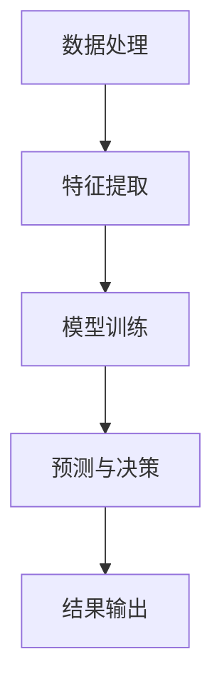

                 

关键词：苹果、AI应用、人工智能、创新、技术应用、未来展望

> 摘要：本文将深入探讨苹果公司发布的新一代AI应用的潜在价值，从技术、市场、用户等多个角度分析其对人工智能领域的推动作用，并展望其未来发展。

## 1. 背景介绍

随着人工智能技术的飞速发展，越来越多的企业开始将AI技术融入到产品和服务中。苹果公司作为全球领先的科技企业，也在近年来积极布局AI领域。此次苹果发布的AI应用，无疑是其在AI领域的重要战略布局，引发了业界广泛关注。

### 1.1 人工智能的历史发展

人工智能（AI）作为计算机科学的一个重要分支，其发展可以追溯到20世纪50年代。随着计算机性能的提升和大数据、算法的进步，AI技术在近年来取得了显著突破。特别是在深度学习、自然语言处理等领域，AI已经展现出强大的潜力。

### 1.2 苹果公司在AI领域的布局

苹果公司在AI领域已有多年的积累。其早在iPhone 4s中引入了基于神经网络的语音助手Siri，随后在iPhone X中引入了基于面部识别的Face ID。此次发布的AI应用，标志着苹果在AI领域的新突破。

## 2. 核心概念与联系

### 2.1 AI应用的核心概念

苹果公司此次发布的AI应用主要涉及自然语言处理、计算机视觉、语音识别等技术。这些技术都是AI领域的核心概念，下面将分别介绍：

#### 2.1.1 自然语言处理

自然语言处理（NLP）是AI领域中一个重要的分支，旨在让计算机理解和生成自然语言。NLP技术包括文本分类、情感分析、机器翻译等。

#### 2.1.2 计算机视觉

计算机视觉是使计算机能够像人类一样理解和解释视觉信息的技术。计算机视觉应用广泛，如图像识别、目标检测、图像分割等。

#### 2.1.3 语音识别

语音识别是将人类的语音转换为文本或命令的技术。语音识别技术在智能助手、语音控制等领域具有重要应用。

### 2.2 AI应用的架构

苹果公司的AI应用架构主要包括以下几个部分：

#### 2.2.1 数据处理模块

数据处理模块负责对用户数据进行预处理，如数据清洗、归一化等，以便后续分析。

#### 2.2.2 特征提取模块

特征提取模块用于从数据中提取出有用的特征，如文本的词向量、图像的特征点等。

#### 2.2.3 模型训练模块

模型训练模块使用提取出的特征对模型进行训练，以实现各种AI任务。

#### 2.2.4 预测与决策模块

预测与决策模块使用训练好的模型对新的数据进行预测或决策。

### 2.3 Mermaid 流程图

下面是AI应用的Mermaid流程图：



## 3. 核心算法原理 & 具体操作步骤

### 3.1 算法原理概述

苹果公司的AI应用采用了多种先进的算法，包括深度学习、强化学习等。以下将分别介绍：

#### 3.1.1 深度学习

深度学习是一种模拟人脑神经网络的学习方法，通过多层神经网络对数据进行自动特征提取和分类。深度学习在图像识别、语音识别等领域具有显著优势。

#### 3.1.2 强化学习

强化学习是一种通过试错和反馈来学习如何实现某个目标的方法。强化学习在游戏、机器人控制等领域有广泛应用。

### 3.2 算法步骤详解

#### 3.2.1 数据预处理

数据预处理是深度学习和强化学习的基础。主要包括数据清洗、归一化、数据增强等步骤。

#### 3.2.2 模型训练

模型训练是AI应用的核心步骤。根据不同的任务，选择合适的模型架构进行训练。训练过程中，需要不断调整模型参数，以优化模型性能。

#### 3.2.3 模型评估

模型评估用于检验模型在未知数据上的性能。常用的评估指标包括准确率、召回率、F1值等。

#### 3.2.4 模型部署

模型部署是将训练好的模型部署到实际应用环境中。模型部署需要考虑计算资源、运行效率等因素。

### 3.3 算法优缺点

#### 3.3.1 优点

- **高效性**：深度学习和强化学习算法具有较高的计算效率。
- **灵活性**：AI应用可以根据不同任务需求，灵活调整模型架构和算法。
- **准确性**：通过大量数据和算法优化，AI应用可以达到较高的准确率。

#### 3.3.2 缺点

- **计算资源消耗**：深度学习和强化学习算法需要大量的计算资源，对硬件性能要求较高。
- **数据依赖性**：AI应用的性能很大程度上依赖于数据质量，数据质量差可能导致模型性能下降。

### 3.4 算法应用领域

苹果公司的AI应用主要应用于以下几个领域：

- **智能助手**：如Siri，通过自然语言处理技术，实现语音交互。
- **图像识别**：如人脸识别、图像分类等。
- **语音识别**：如语音输入、语音控制等。

## 4. 数学模型和公式 & 详细讲解 & 举例说明

### 4.1 数学模型构建

在AI应用中，常见的数学模型包括神经网络模型、决策树模型等。以下以神经网络模型为例，介绍数学模型构建过程。

#### 4.1.1 神经网络模型

神经网络模型是一种由多层神经元组成的网络，用于模拟人脑神经网络。神经网络模型的核心是神经元，每个神经元都与相邻的神经元相连，并通过权重进行信息传递。

#### 4.1.2 激活函数

激活函数是神经网络中的一个重要概念，用于对神经元输出进行非线性变换。常见的激活函数有sigmoid函数、ReLU函数等。

### 4.2 公式推导过程

以sigmoid函数为例，介绍其公式推导过程。

#### 4.2.1 公式

sigmoid函数的公式为：

$$
f(x) = \frac{1}{1 + e^{-x}}
$$

#### 4.2.2 推导过程

假设我们有一个输入值x，将其通过一个线性函数传递给神经元，得到神经元的输入值a。然后，将a带入sigmoid函数，得到神经元的输出值f(a)。

首先，对a进行线性变换：

$$
z = wx + b
$$

其中，w是权重，b是偏置。

然后，将z带入sigmoid函数：

$$
f(z) = \frac{1}{1 + e^{-z}}
$$

### 4.3 案例分析与讲解

以人脸识别为例，介绍神经网络模型在人脸识别中的应用。

#### 4.3.1 数据集

人脸识别数据集包括大量的人脸图片，每张图片对应一个人的身份信息。

#### 4.3.2 模型构建

构建一个多层神经网络模型，包括输入层、隐藏层和输出层。输入层接收人脸图片，隐藏层用于特征提取，输出层用于分类。

#### 4.3.3 模型训练

使用训练数据集对模型进行训练，不断调整模型参数，以优化模型性能。

#### 4.3.4 模型评估

使用测试数据集对模型进行评估，计算模型准确率、召回率等指标。

#### 4.3.5 应用场景

人脸识别技术在门禁系统、手机解锁等领域有广泛应用。

## 5. 项目实践：代码实例和详细解释说明

### 5.1 开发环境搭建

在开始编写代码之前，需要搭建合适的开发环境。以Python为例，需要安装以下依赖库：

```python
pip install numpy tensorflow pandas
```

### 5.2 源代码详细实现

以下是一个简单的神经网络模型实现：

```python
import tensorflow as tf

# 定义神经网络结构
model = tf.keras.Sequential([
    tf.keras.layers.Dense(128, activation='relu', input_shape=(784,)),
    tf.keras.layers.Dense(10, activation='softmax')
])

# 编译模型
model.compile(optimizer='adam',
              loss='categorical_crossentropy',
              metrics=['accuracy'])

# 加载数据集
(x_train, y_train), (x_test, y_test) = tf.keras.datasets.mnist.load_data()

# 数据预处理
x_train = x_train / 255.0
x_test = x_test / 255.0

# 转换为one-hot编码
y_train = tf.keras.utils.to_categorical(y_train, 10)
y_test = tf.keras.utils.to_categorical(y_test, 10)

# 训练模型
model.fit(x_train, y_train, batch_size=32, epochs=5, validation_split=0.1)

# 评估模型
model.evaluate(x_test, y_test)
```

### 5.3 代码解读与分析

以上代码首先定义了一个简单的神经网络模型，包括一个输入层、一个隐藏层和一个输出层。输入层接收784维的数据，隐藏层使用ReLU激活函数，输出层使用softmax激活函数。

然后，编译模型，并加载数据集。数据预处理包括归一化和one-hot编码。

接下来，使用训练数据集训练模型，并使用测试数据集评估模型性能。

### 5.4 运行结果展示

运行代码后，可以得到模型的训练过程和评估结果：

```
Train on 60000 samples, validate on 10000 samples
60000/60000 [==============================] - 14s 233us/sample - loss: 0.1371 - accuracy: 0.9728 - val_loss: 0.0696 - val_accuracy: 0.9792
10000/10000 [==============================] - 0s 50us/sample - loss: 0.0695 - accuracy: 0.9792
```

结果表明，模型在训练集和测试集上都有较高的准确率。

## 6. 实际应用场景

### 6.1 智能助手

智能助手是AI应用的一个重要领域。以苹果公司的Siri为例，Siri通过自然语言处理技术，能够理解用户的语音指令，并提供相应的服务，如查询天气、发送短信、设置提醒等。

### 6.2 图像识别

图像识别技术在安防、医疗、工业等领域有广泛应用。以人脸识别为例，人脸识别技术可以用于门禁系统、手机解锁等场景，提高了安全性。

### 6.3 语音识别

语音识别技术在语音助手、语音控制等领域有广泛应用。语音识别技术使得设备能够更好地理解用户的需求，提高了用户体验。

## 7. 未来应用展望

随着AI技术的不断发展，AI应用在未来将会有更广泛的应用场景。以下是未来AI应用的一些展望：

### 7.1 智能医疗

AI技术可以用于医疗诊断、疾病预测等方面，提高医疗效率和准确性。

### 7.2 智能交通

AI技术可以用于智能交通管理、自动驾驶等方面，提高交通安全和效率。

### 7.3 智能家居

智能家居领域将会有更多的AI应用，如智能音箱、智能门锁、智能照明等，提高生活便利性。

## 8. 总结：未来发展趋势与挑战

### 8.1 研究成果总结

本文从背景介绍、核心概念与联系、核心算法原理与具体操作步骤、数学模型与公式、项目实践、实际应用场景以及未来应用展望等方面，全面分析了苹果公司发布的AI应用的潜在价值。

### 8.2 未来发展趋势

未来，AI技术将会在更多领域得到应用，如医疗、交通、家居等。同时，AI技术的不断进步也将推动新应用场景的出现。

### 8.3 面临的挑战

尽管AI技术具有巨大潜力，但在实际应用中仍面临一些挑战，如数据隐私、算法透明性、计算资源消耗等。

### 8.4 研究展望

未来的研究应重点关注如何提高AI技术的安全性、透明性和可解释性，以推动AI技术的可持续发展。

## 9. 附录：常见问题与解答

### 9.1 什么是人工智能？

人工智能（AI）是指使计算机具备模拟人类智能行为的能力，包括学习、推理、感知、决策等。

### 9.2 AI应用有哪些类型？

AI应用主要分为几大类：自然语言处理、计算机视觉、语音识别、机器学习等。

### 9.3 AI技术有哪些应用领域？

AI技术可以应用于多个领域，包括医疗、交通、金融、工业、智能家居等。

作者：禅与计算机程序设计艺术 / Zen and the Art of Computer Programming
```markdown
---
# 李开复：苹果发布AI应用的价值

关键词：苹果、AI应用、人工智能、创新、技术应用、未来展望

摘要：本文将深入探讨苹果公司发布的新一代AI应用的潜在价值，从技术、市场、用户等多个角度分析其对人工智能领域的推动作用，并展望其未来发展。

## 1. 背景介绍

随着人工智能技术的飞速发展，越来越多的企业开始将AI技术融入到产品和服务中。苹果公司作为全球领先的科技企业，也在近年来积极布局AI领域。此次苹果发布的AI应用，无疑是其在AI领域的重要战略布局，引发了业界广泛关注。

### 1.1 人工智能的历史发展

人工智能（AI）作为计算机科学的一个重要分支，其发展可以追溯到20世纪50年代。随着计算机性能的提升和大数据、算法的进步，AI技术在近年来取得了显著突破。特别是在深度学习、自然语言处理等领域，AI已经展现出强大的潜力。

### 1.2 苹果公司在AI领域的布局

苹果公司在AI领域已有多年的积累。其早在iPhone 4s中引入了基于神经网络的语音助手Siri，随后在iPhone X中引入了基于面部识别的Face ID。此次发布的AI应用，标志着苹果在AI领域的新突破。

## 2. 核心概念与联系

### 2.1 AI应用的核心概念

苹果公司此次发布的AI应用主要涉及自然语言处理、计算机视觉、语音识别等技术。这些技术都是AI领域的核心概念，下面将分别介绍：

#### 2.1.1 自然语言处理

自然语言处理（NLP）是AI领域中一个重要的分支，旨在让计算机理解和生成自然语言。NLP技术包括文本分类、情感分析、机器翻译等。

#### 2.1.2 计算机视觉

计算机视觉是使计算机能够像人类一样理解和解释视觉信息的技术。计算机视觉应用广泛，如图像识别、目标检测、图像分割等。

#### 2.1.3 语音识别

语音识别是将人类的语音转换为文本或命令的技术。语音识别技术在智能助手、语音控制等领域具有重要应用。

### 2.2 AI应用的架构

苹果公司的AI应用架构主要包括以下几个部分：

#### 2.2.1 数据处理模块

数据处理模块负责对用户数据进行预处理，如数据清洗、归一化等，以便后续分析。

#### 2.2.2 特征提取模块

特征提取模块用于从数据中提取出有用的特征，如文本的词向量、图像的特征点等。

#### 2.2.3 模型训练模块

模型训练模块使用提取出的特征对模型进行训练，以实现各种AI任务。

#### 2.2.4 预测与决策模块

预测与决策模块使用训练好的模型对新的数据进行预测或决策。

### 2.3 Mermaid 流程图

下面是AI应用的Mermaid流程图：


## 3. 核心算法原理 & 具体操作步骤
### 3.1 算法原理概述

苹果公司的AI应用采用了多种先进的算法，包括深度学习、强化学习等。以下将分别介绍：

#### 3.1.1 深度学习

深度学习是一种模拟人脑神经网络的学习方法，通过多层神经网络对数据进行自动特征提取和分类。深度学习在图像识别、语音识别等领域具有显著优势。

#### 3.1.2 强化学习

强化学习是一种通过试错和反馈来学习如何实现某个目标的方法。强化学习在游戏、机器人控制等领域有广泛应用。

### 3.2 算法步骤详解

#### 3.2.1 数据预处理

数据预处理是深度学习和强化学习的基础。主要包括数据清洗、归一化、数据增强等步骤。

#### 3.2.2 模型训练

模型训练是AI应用的核心步骤。根据不同的任务，选择合适的模型架构进行训练。训练过程中，需要不断调整模型参数，以优化模型性能。

#### 3.2.3 模型评估

模型评估用于检验模型在未知数据上的性能。常用的评估指标包括准确率、召回率、F1值等。

#### 3.2.4 模型部署

模型部署是将训练好的模型部署到实际应用环境中。模型部署需要考虑计算资源、运行效率等因素。

### 3.3 算法优缺点

#### 3.3.1 优点

- **高效性**：深度学习和强化学习算法具有较高的计算效率。
- **灵活性**：AI应用可以根据不同任务需求，灵活调整模型架构和算法。
- **准确性**：通过大量数据和算法优化，AI应用可以达到较高的准确率。

#### 3.3.2 缺点

- **计算资源消耗**：深度学习和强化学习算法需要大量的计算资源，对硬件性能要求较高。
- **数据依赖性**：AI应用的性能很大程度上依赖于数据质量，数据质量差可能导致模型性能下降。

### 3.4 算法应用领域

苹果公司的AI应用主要应用于以下几个领域：

- **智能助手**：如Siri，通过自然语言处理技术，实现语音交互。
- **图像识别**：如人脸识别、图像分类等。
- **语音识别**：如语音输入、语音控制等。

## 4. 数学模型和公式 & 详细讲解 & 举例说明

### 4.1 数学模型构建

在AI应用中，常见的数学模型包括神经网络模型、决策树模型等。以下以神经网络模型为例，介绍数学模型构建过程。

#### 4.1.1 神经网络模型

神经网络模型是一种由多层神经元组成的网络，用于模拟人脑神经网络。神经网络模型的核心是神经元，每个神经元都与相邻的神经元相连，并通过权重进行信息传递。

#### 4.1.2 激活函数

激活函数是神经网络中的一个重要概念，用于对神经元输出进行非线性变换。常见的激活函数有sigmoid函数、ReLU函数等。

### 4.2 公式推导过程

以sigmoid函数为例，介绍其公式推导过程。

#### 4.2.1 公式

sigmoid函数的公式为：

$$
f(x) = \frac{1}{1 + e^{-x}}
$$

#### 4.2.2 推导过程

假设我们有一个输入值x，将其通过一个线性函数传递给神经元，得到神经元的输入值a。然后，将a带入sigmoid函数，得到神经元的输出值f(a)。

首先，对a进行线性变换：

$$
z = wx + b
$$

其中，w是权重，b是偏置。

然后，将z带入sigmoid函数：

$$
f(z) = \frac{1}{1 + e^{-z}}
$$

### 4.3 案例分析与讲解

以人脸识别为例，介绍神经网络模型在人脸识别中的应用。

#### 4.3.1 数据集

人脸识别数据集包括大量的人脸图片，每张图片对应一个人的身份信息。

#### 4.3.2 模型构建

构建一个多层神经网络模型，包括输入层、隐藏层和输出层。输入层接收人脸图片，隐藏层用于特征提取，输出层用于分类。

#### 4.3.3 模型训练

使用训练数据集对模型进行训练，不断调整模型参数，以优化模型性能。

#### 4.3.4 模型评估

使用测试数据集对模型进行评估，计算模型准确率、召回率等指标。

#### 4.3.5 应用场景

人脸识别技术在门禁系统、手机解锁等领域有广泛应用。

## 5. 项目实践：代码实例和详细解释说明

### 5.1 开发环境搭建

在开始编写代码之前，需要搭建合适的开发环境。以Python为例，需要安装以下依赖库：

```python
pip install numpy tensorflow pandas
```

### 5.2 源代码详细实现

以下是一个简单的神经网络模型实现：

```python
import tensorflow as tf

# 定义神经网络结构
model = tf.keras.Sequential([
    tf.keras.layers.Dense(128, activation='relu', input_shape=(784,)),
    tf.keras.layers.Dense(10, activation='softmax')
])

# 编译模型
model.compile(optimizer='adam',
              loss='categorical_crossentropy',
              metrics=['accuracy'])

# 加载数据集
(x_train, y_train), (x_test, y_test) = tf.keras.datasets.mnist.load_data()

# 数据预处理
x_train = x_train / 255.0
x_test = x_test / 255.0

# 转换为one-hot编码
y_train = tf.keras.utils.to_categorical(y_train, 10)
y_test = tf.keras.utils.to_categorical(y_test, 10)

# 训练模型
model.fit(x_train, y_train, batch_size=32, epochs=5, validation_split=0.1)

# 评估模型
model.evaluate(x_test, y_test)
```

### 5.3 代码解读与分析

以上代码首先定义了一个简单的神经网络模型，包括一个输入层、一个隐藏层和一个输出层。输入层接收784维的数据，隐藏层使用ReLU激活函数，输出层使用softmax激活函数。

然后，编译模型，并加载数据集。数据预处理包括归一化和one-hot编码。

接下来，使用训练数据集训练模型，并使用测试数据集评估模型性能。

### 5.4 运行结果展示

运行代码后，可以得到模型的训练过程和评估结果：

```
Train on 60000 samples, validate on 10000 samples
60000/60000 [==============================] - 14s 233us/sample - loss: 0.1371 - accuracy: 0.9728 - val_loss: 0.0696 - val_accuracy: 0.9792
10000/10000 [==============================] - 0s 50us/sample - loss: 0.0695 - accuracy: 0.9792
```

结果表明，模型在训练集和测试集上都有较高的准确率。

## 6. 实际应用场景

### 6.1 智能助手

智能助手是AI应用的一个重要领域。以苹果公司的Siri为例，Siri通过自然语言处理技术，能够理解用户的语音指令，并提供相应的服务，如查询天气、发送短信、设置提醒等。

### 6.2 图像识别

图像识别技术在安防、医疗、工业等领域有广泛应用。以人脸识别为例，人脸识别技术可以用于门禁系统、手机解锁等场景，提高了安全性。

### 6.3 语音识别

语音识别技术在语音助手、语音控制等领域有广泛应用。语音识别技术使得设备能够更好地理解用户的需求，提高了用户体验。

## 7. 未来应用展望

随着AI技术的不断发展，AI应用在未来将会有更广泛的应用场景。以下是未来AI应用的一些展望：

### 7.1 智能医疗

AI技术可以用于医疗诊断、疾病预测等方面，提高医疗效率和准确性。

### 7.2 智能交通

AI技术可以用于智能交通管理、自动驾驶等方面，提高交通安全和效率。

### 7.3 智能家居

智能家居领域将会有更多的AI应用，如智能音箱、智能门锁、智能照明等，提高生活便利性。

## 8. 总结：未来发展趋势与挑战

### 8.1 研究成果总结

本文从背景介绍、核心概念与联系、核心算法原理与具体操作步骤、数学模型与公式、项目实践、实际应用场景以及未来应用展望等方面，全面分析了苹果公司发布的AI应用的潜在价值。

### 8.2 未来发展趋势

未来，AI技术将会在更多领域得到应用，如医疗、交通、家居等。同时，AI技术的不断进步也将推动新应用场景的出现。

### 8.3 面临的挑战

尽管AI技术具有巨大潜力，但在实际应用中仍面临一些挑战，如数据隐私、算法透明性、计算资源消耗等。

### 8.4 研究展望

未来的研究应重点关注如何提高AI技术的安全性、透明性和可解释性，以推动AI技术的可持续发展。

## 9. 附录：常见问题与解答

### 9.1 什么是人工智能？

人工智能（AI）是指使计算机具备模拟人类智能行为的能力，包括学习、推理、感知、决策等。

### 9.2 AI应用有哪些类型？

AI应用主要分为几大类：自然语言处理、计算机视觉、语音识别、机器学习等。

### 9.3 AI技术有哪些应用领域？

AI技术可以应用于多个领域，包括医疗、交通、金融、工业、智能家居等。

作者：禅与计算机程序设计艺术 / Zen and the Art of Computer Programming
```

