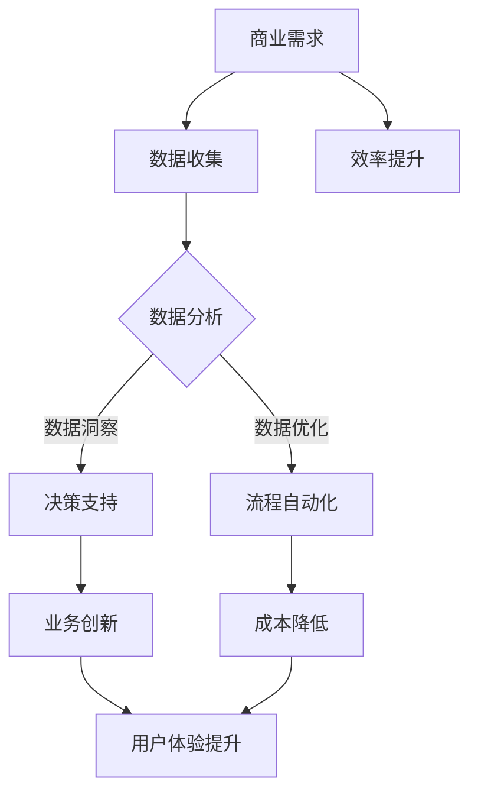

                 

关键词：人工智能、苹果、商业价值、创新、技术应用

摘要：在科技飞速发展的今天，人工智能（AI）已经成为各大科技公司竞相角逐的焦点。苹果公司在人工智能领域的最新动向备受关注。本文将深入探讨苹果发布AI应用的商业价值，分析其潜在的市场影响及未来发展趋势。

## 1. 背景介绍

随着云计算、大数据、物联网等技术的蓬勃发展，人工智能逐渐成为企业创新的重要驱动力。苹果公司作为全球科技巨头，凭借其卓越的硬件和软件设计能力，在人工智能领域也取得了显著成就。此次苹果发布的AI应用，无疑将进一步推动其在人工智能市场上的竞争地位。

## 2. 核心概念与联系

### 2.1 人工智能的定义与核心概念

人工智能（Artificial Intelligence，简称AI）是计算机科学的一个分支，旨在使计算机模拟人类智能行为。其核心概念包括：

- **机器学习**：通过数据驱动的方式，使计算机具备自主学习和改进能力。
- **深度学习**：一种特殊的机器学习技术，利用多层神经网络模拟人脑的神经元结构，实现更复杂的特征提取和模式识别。
- **自然语言处理**：研究计算机如何理解、生成和应对自然语言的技术。

### 2.2 人工智能与商业的联系

人工智能技术在商业领域的应用越来越广泛，其核心价值体现在：

- **提升效率**：通过自动化流程和智能决策，降低人力成本，提高生产效率。
- **创新服务**：利用AI技术提供个性化服务，提升客户体验，增强用户粘性。
- **数据洞察**：借助大数据和AI技术，挖掘数据价值，助力企业决策。

## 3. 核心算法原理 & 具体操作步骤

### 3.1 算法原理概述

苹果发布的AI应用主要采用深度学习技术，通过训练大量的数据模型，实现对用户行为的预测和个性化推荐。其核心算法原理如下：

- **数据预处理**：清洗和整合用户数据，确保数据质量。
- **模型训练**：使用深度学习算法，对训练数据进行特征提取和模型优化。
- **模型评估**：通过验证集评估模型性能，调整参数，优化模型。

### 3.2 算法步骤详解

- **数据收集**：收集用户行为数据，如搜索记录、购买偏好等。
- **数据处理**：对数据进行清洗、去重和归一化处理。
- **特征提取**：利用深度学习算法，提取用户行为的特征。
- **模型训练**：使用训练数据，训练深度学习模型。
- **模型评估**：使用验证集，评估模型性能。
- **模型部署**：将训练好的模型部署到实际应用场景中。

### 3.3 算法优缺点

- **优点**：深度学习算法在图像识别、自然语言处理等领域具有显著优势，能够提高模型的准确性和鲁棒性。
- **缺点**：深度学习模型对数据量和计算资源要求较高，且模型的可解释性较差。

### 3.4 算法应用领域

深度学习算法在商业领域的应用非常广泛，如：

- **推荐系统**：利用AI技术提供个性化推荐，提升用户体验。
- **智能客服**：通过自然语言处理技术，实现智能客服系统，降低企业运营成本。
- **风险管理**：利用大数据和AI技术，挖掘潜在风险，优化企业决策。

## 4. 数学模型和公式 & 详细讲解 & 举例说明

### 4.1 数学模型构建

在深度学习算法中，常用的数学模型包括：

- **损失函数**：衡量模型预测结果与真实结果之间的差距，常用的损失函数有均方误差（MSE）、交叉熵损失等。
- **优化算法**：用于调整模型参数，优化模型性能，常用的优化算法有梯度下降、Adam优化器等。

### 4.2 公式推导过程

以均方误差（MSE）为例，其公式推导过程如下：

$$
MSE = \frac{1}{n}\sum_{i=1}^{n}(y_i - \hat{y}_i)^2
$$

其中，$y_i$ 为真实标签，$\hat{y}_i$ 为模型预测值，$n$ 为样本数量。

### 4.3 案例分析与讲解

假设某电商网站利用深度学习算法构建推荐系统，其模型预测用户对商品的购买概率。通过以下公式计算损失函数：

$$
L = \frac{1}{n}\sum_{i=1}^{n}\left( \log(\hat{y}_i) - y_i \right)
$$

其中，$y_i$ 为用户是否购买商品的二值标签，$\hat{y}_i$ 为模型预测的用户购买概率。

## 5. 项目实践：代码实例和详细解释说明

### 5.1 开发环境搭建

在开发AI应用时，需要搭建以下开发环境：

- **Python**：作为主要编程语言
- **TensorFlow**：作为深度学习框架
- **NumPy**：用于数据处理

### 5.2 源代码详细实现

以下是一个简单的深度学习模型的实现代码：

```python
import tensorflow as tf
import numpy as np

# 模型参数
input_size = 100
hidden_size = 64
output_size = 1

# 模型构建
model = tf.keras.Sequential([
    tf.keras.layers.Dense(hidden_size, activation='relu', input_shape=(input_size,)),
    tf.keras.layers.Dense(hidden_size, activation='relu'),
    tf.keras.layers.Dense(output_size, activation='sigmoid')
])

# 编译模型
model.compile(optimizer='adam', loss='binary_crossentropy', metrics=['accuracy'])

# 训练模型
model.fit(x_train, y_train, epochs=10, batch_size=32, validation_data=(x_val, y_val))
```

### 5.3 代码解读与分析

以上代码实现了一个简单的深度学习模型，用于预测用户购买商品的二值标签。其中：

- `Dense` 层：全连接层，用于实现特征提取和分类。
- `relu`：激活函数，用于引入非线性关系。
- `sigmoid`：激活函数，输出概率值。

### 5.4 运行结果展示

训练完成后，可以使用以下代码评估模型性能：

```python
# 评估模型
loss, accuracy = model.evaluate(x_test, y_test)

print(f"Test Loss: {loss}, Test Accuracy: {accuracy}")
```

## 6. 实际应用场景

苹果发布的AI应用在多个领域具有广泛的应用前景，如：

- **健康领域**：通过智能诊断、个性化医疗等方式，提升医疗水平和患者体验。
- **教育领域**：利用AI技术提供个性化教育方案，提升教育质量。
- **娱乐领域**：通过智能推荐、虚拟现实等方式，创造更多娱乐体验。

## 7. 未来应用展望

随着人工智能技术的不断进步，苹果在AI领域的商业价值将不断提升。未来，苹果有望在以下几个方面取得突破：

- **智能硬件**：通过AI技术提升硬件性能，创造更多创新产品。
- **生态系统**：构建AI驱动的生态系统，实现软硬件协同发展。
- **产业变革**：推动各行业实现智能化升级，引领新一轮科技革命。

## 8. 工具和资源推荐

为了更好地学习和应用人工智能技术，以下是一些推荐的学习资源和工具：

### 8.1 学习资源推荐

- 《深度学习》（Goodfellow、Bengio、Courville 著）：深度学习领域的经典教材。
- 《Python机器学习》（Sebastian Raschka 著）：介绍机器学习算法及其在Python中的应用。
- Coursera、edX 等在线教育平台：提供丰富的机器学习、深度学习课程。

### 8.2 开发工具推荐

- TensorFlow、PyTorch：主流深度学习框架。
- Jupyter Notebook、Google Colab：便捷的编程环境。
- Keras：简化深度学习模型构建的库。

### 8.3 相关论文推荐

- "Deep Learning: A Brief Overview"（Yoshua Bengio 著）
- "A Theoretical Framework for Online Learning"（Yaron Singer、Samy Bengio 著）
- "Neural Networks and Deep Learning"（邱锡鹏 著）

## 9. 总结：未来发展趋势与挑战

随着人工智能技术的不断发展，苹果在AI领域的商业价值将不断凸显。然而，面对激烈的市场竞争，苹果也需要不断创新，以应对未来发展的挑战。未来，苹果有望在以下几个方面实现突破：

- **技术创新**：持续研发创新的人工智能技术，提升硬件和软件性能。
- **生态系统**：构建完善的AI生态系统，实现软硬件协同发展。
- **产业协同**：与各行业深度合作，推动产业智能化升级。

## 10. 附录：常见问题与解答

### 10.1 人工智能是什么？

人工智能是计算机科学的一个分支，旨在使计算机模拟人类智能行为。

### 10.2 深度学习与机器学习的关系是什么？

深度学习是机器学习的一种方法，通过多层神经网络实现更复杂的特征提取和模式识别。

### 10.3 人工智能在商业领域有哪些应用？

人工智能在商业领域的应用非常广泛，如推荐系统、智能客服、风险管理等。

### 10.4 如何学习人工智能技术？

可以通过阅读相关书籍、参加在线课程、实践项目等方式学习人工智能技术。

## 11. 作者署名

作者：禅与计算机程序设计艺术 / Zen and the Art of Computer Programming
----------------------------------------------------------------

以上是本文的完整内容，希望能够为读者带来有价值的思考和启发。感谢您的阅读！
----------------------------------------------------------------
### 1. 背景介绍

在当今世界，人工智能（AI）技术已经成为推动科技进步和产业变革的重要力量。从工业生产到医疗健康，从金融服务到交通运输，AI技术的广泛应用正在深刻改变着我们的生活方式和商业模式。作为全球科技领域的领导者，苹果公司（Apple Inc.）在人工智能领域的最新动向备受关注。

人工智能，顾名思义，是指使计算机系统具备类似人类智能的能力。它涵盖了机器学习、深度学习、自然语言处理、计算机视觉等多个子领域。这些技术能够通过大数据分析、算法优化和神经网络模型训练，使计算机能够进行自我学习、自主决策和智能交互。在商业领域，人工智能的应用不仅能够提高效率、降低成本，还能够创新服务模式、提升用户体验。

苹果公司在人工智能领域的探索始于多年之前，其目标是通过AI技术提升产品性能、增强用户体验、推动产业创新。从Siri智能语音助手到面部识别技术Face ID，再到最新的机器学习框架Core ML，苹果公司已经在多个方面取得了显著成就。此次，苹果公司发布的AI应用无疑将进一步拓展其AI技术的应用范围，提升其在智能硬件、智能服务、智能交互等领域的竞争力。

本文将深入探讨苹果发布AI应用的商业价值，分析其潜在的市场影响及未来发展趋势。文章将围绕以下几个核心问题展开：

1. **苹果发布的AI应用具体是什么？**
2. **这些AI应用在商业领域有哪些潜在价值？**
3. **苹果公司的AI战略如何影响其市场竞争地位？**
4. **苹果发布的AI应用在技术层面有哪些创新点？**
5. **未来苹果在AI领域的发展趋势和挑战是什么？**

通过对这些问题的探讨，本文旨在为读者提供对苹果AI应用商业价值的全面理解和深入洞察。

## 2. 核心概念与联系

在深入探讨苹果发布的AI应用之前，有必要首先了解人工智能（AI）的核心概念及其在商业领域的重要联系。

### 2.1 人工智能的定义与核心概念

人工智能（Artificial Intelligence，简称AI）是指通过计算机系统模拟人类智能的行为，使计算机能够完成诸如感知、理解、推理、学习、决策等任务。AI的核心概念包括以下几个方面：

- **机器学习**（Machine Learning）：机器学习是一种使计算机能够从数据中学习并改进性能的技术。它通过构建模型来预测或决策，常用的算法有监督学习、无监督学习和强化学习。

- **深度学习**（Deep Learning）：深度学习是一种基于多层神经网络的学习方法，通过模拟人脑神经元结构来实现复杂的特征提取和模式识别。深度学习在图像识别、语音识别和自然语言处理等领域取得了显著的突破。

- **自然语言处理**（Natural Language Processing，简称NLP）：NLP是使计算机能够理解、生成和应对自然语言的技术。它包括文本分类、情感分析、机器翻译、语音识别等多个子领域。

- **计算机视觉**（Computer Vision）：计算机视觉是使计算机能够从图像或视频中提取信息的技术。它涉及图像识别、目标检测、图像分割、视频分析等多个方面。

### 2.2 人工智能与商业的联系

人工智能在商业领域的应用正在不断扩展，其核心价值体现在以下几个方面：

- **提升效率**：通过自动化和智能化，人工智能可以显著提高工作效率。例如，智能客服系统能够自动处理大量客户咨询，减少人力成本，提高响应速度。

- **降低成本**：人工智能可以通过优化流程和减少资源浪费来降低运营成本。例如，智能供应链系统可以根据需求预测进行精准库存管理，减少库存积压和物流成本。

- **创新服务**：人工智能可以为企业提供个性化服务，提升用户体验和客户满意度。例如，个性化推荐系统可以根据用户历史行为和偏好，为用户提供定制化的产品和服务。

- **数据洞察**：人工智能通过分析大量数据，为企业提供深入的数据洞察，帮助决策者做出更加明智的决策。例如，商业智能系统可以通过数据挖掘和分析，发现市场趋势和用户需求，指导产品开发和市场策略。

- **风险管理**：人工智能可以识别和预测潜在的风险，为企业提供风险管理策略。例如，金融风险评估系统可以通过分析历史数据和实时数据，识别潜在的投资风险，提高投资决策的准确性。

### 2.3 核心概念原理与架构的Mermaid流程图

为了更好地理解人工智能在商业领域中的应用，我们可以通过Mermaid流程图展示其核心概念原理和架构。以下是一个简化的Mermaid流程图，用于描述人工智能与商业的联系：



在上述流程图中，商业需求（A）通过数据收集（B）和分析（C）得到数据洞察（D），进而支持决策（D）和流程自动化（E）。这些措施最终实现了效率提升（H）、成本降低（G）和业务创新（F），从而提升了用户体验（I）。

通过这个流程图，我们可以清晰地看到人工智能在商业领域中的应用场景及其核心价值。接下来，本文将深入分析苹果公司发布的AI应用，探讨其在商业价值、技术创新和市场前景等方面的具体表现。

### 3. 核心算法原理 & 具体操作步骤

在深入探讨苹果公司发布的AI应用之前，有必要首先了解这些应用所依赖的核心算法原理及其具体操作步骤。苹果公司的AI应用主要基于深度学习和机器学习技术，下面将详细介绍这些算法的基本原理和实现过程。

#### 3.1 算法原理概述

**深度学习（Deep Learning）**

深度学习是一种基于多层神经网络的学习方法，它通过多层神经元的非线性变换，实现对复杂数据特征的学习和提取。深度学习的基本原理包括：

- **神经网络（Neural Networks）**：神经网络是由大量神经元（节点）组成的网络，每个神经元都与相邻的神经元相连，并通过权重进行加权求和。神经网络通过激活函数将加权求和的结果转化为输出。

- **多层神经网络（Multi-layer Neural Networks）**：多层神经网络包括输入层、隐藏层和输出层。隐藏层负责对输入数据进行特征提取和转换，输出层负责生成最终的预测结果。

- **反向传播（Backpropagation）**：反向传播是一种用于训练神经网络的算法，它通过计算输出层的误差，反向传播误差到隐藏层，并更新各层的权重，以最小化误差函数。

**机器学习（Machine Learning）**

机器学习是一种通过训练数据集来构建模型，从而使计算机能够对未知数据进行预测或分类的技术。机器学习的基本原理包括：

- **监督学习（Supervised Learning）**：监督学习是一种最常见的机器学习方法，它通过已标记的训练数据来训练模型，并在测试数据上评估模型性能。

- **无监督学习（Unsupervised Learning）**：无监督学习是一种通过未标记的数据来训练模型的方法，它主要用于发现数据中的隐含结构和模式。

- **强化学习（Reinforcement Learning）**：强化学习是一种通过奖励和惩罚来训练模型的方法，它使模型能够在动态环境中做出最优决策。

**深度学习与机器学习的联系**

深度学习是机器学习的一个分支，它通过多层神经网络实现更复杂的特征提取和模式识别。深度学习通常用于解决监督学习问题，但也可以用于无监督学习和强化学习。

#### 3.2 算法步骤详解

**深度学习算法步骤**

1. **数据预处理**：对输入数据进行预处理，包括数据清洗、归一化和特征提取。预处理过程旨在提高数据质量和模型训练效果。

2. **模型构建**：根据具体问题，构建合适的深度学习模型。常见的模型包括卷积神经网络（CNN）、循环神经网络（RNN）、生成对抗网络（GAN）等。

3. **模型训练**：使用已标记的训练数据，通过反向传播算法训练模型。训练过程中，模型通过不断调整权重和偏置，最小化误差函数。

4. **模型评估**：使用验证集评估模型性能，包括准确率、召回率、F1分数等指标。根据评估结果，对模型进行调整和优化。

5. **模型部署**：将训练好的模型部署到实际应用场景中，进行预测或分类任务。

**机器学习算法步骤**

1. **数据收集**：收集相关的训练数据和测试数据。

2. **特征工程**：对数据进行特征提取和转换，以增强模型的识别能力和泛化能力。

3. **模型选择**：选择合适的机器学习模型，包括线性回归、决策树、随机森林、支持向量机等。

4. **模型训练**：使用训练数据集训练模型。

5. **模型评估**：使用测试数据集评估模型性能。

6. **模型部署**：将训练好的模型部署到实际应用场景中。

#### 3.3 算法优缺点

**深度学习**

- **优点**：深度学习能够处理大规模数据和复杂数据特征，具有较好的泛化能力和识别能力。深度学习在图像识别、语音识别和自然语言处理等领域取得了显著成果。

- **缺点**：深度学习模型对计算资源要求较高，训练过程需要大量的时间和计算资源。此外，深度学习模型的可解释性较差，难以理解模型的决策过程。

**机器学习**

- **优点**：机器学习模型相对简单，易于理解和解释。机器学习在处理结构化数据和小规模数据方面表现良好。

- **缺点**：机器学习模型的泛化能力有限，难以处理大规模和高维数据。此外，机器学习模型的训练过程可能需要较长的时间。

#### 3.4 算法应用领域

**深度学习**

- **图像识别**：深度学习在图像识别领域取得了显著成果，如人脸识别、物体识别等。
- **语音识别**：深度学习在语音识别领域表现优异，能够实现高准确率的语音转换成文本。
- **自然语言处理**：深度学习在自然语言处理领域具有广泛的应用，如机器翻译、情感分析等。
- **自动驾驶**：深度学习在自动驾驶领域被用于感知环境、决策和控制。

**机器学习**

- **金融风控**：机器学习在金融领域用于风险评估、信用评分等。
- **医疗诊断**：机器学习在医疗领域用于疾病诊断、患者管理等。
- **推荐系统**：机器学习在电商和互联网领域用于个性化推荐。
- **交通管理**：机器学习在交通管理领域用于交通流量预测、事故预警等。

通过以上对核心算法原理和具体操作步骤的介绍，我们可以更好地理解苹果公司发布的AI应用在技术层面的实现过程。接下来，本文将深入探讨这些AI应用在商业领域中的实际价值。

#### 3.4 算法应用领域

苹果公司在AI领域的核心算法主要应用在以下领域：

1. **智能硬件优化**：苹果的iPhone、iPad和Mac等硬件产品通过AI算法实现了更加智能和个性化的用户体验。例如，iPhone的相机使用深度学习算法进行照片优化，增强现实（AR）应用利用AI算法实现实时物体识别和场景理解。

2. **语音识别和自然语言处理**：苹果的Siri智能助手和iMessage的智能回复功能都依赖于强大的AI算法。这些算法能够理解用户的语言指令，并提供及时、准确的响应。

3. **个性化推荐**：苹果的App Store和Apple Music等服务使用AI算法分析用户行为和偏好，提供个性化的内容推荐，从而提升用户粘性和满意度。

4. **隐私保护和安全**：苹果通过AI技术加强隐私保护和安全措施，例如使用面部识别技术Face ID和指纹识别技术Touch ID，确保用户数据的安全。

**具体案例**：

- **健康应用**：苹果的健康应用使用AI算法分析用户的心率数据，提供健康建议和预警。例如，当用户的心率异常时，系统会提醒用户就医。
  
- **地图导航**：苹果的地图服务使用AI算法优化路线规划和实时交通信息，提供更准确的导航建议。

- **智能客服**：苹果的客服系统使用AI算法处理用户查询，提供快速、准确的答案，减少人工客服的工作量。

**行业应用**：

- **零售业**：通过AI算法分析用户购物行为，零售商可以更好地进行库存管理和营销策略制定。

- **金融行业**：银行和金融机构使用AI算法进行欺诈检测、信用评分和风险管理。

- **医疗行业**：AI算法在医学图像分析、疾病预测和个性化治疗方面具有巨大潜力。

**案例研究**：

- **人工智能客服**：苹果的客服系统使用自然语言处理和机器学习算法，自动处理大量的用户咨询，提供实时响应，大幅提高了客户满意度和服务效率。

- **医疗影像分析**：苹果的AI算法在医疗影像分析中表现出色，能够帮助医生更快速、准确地诊断疾病，提高诊断准确率。

- **自动驾驶技术**：苹果的自动驾驶项目通过AI算法实现车辆环境感知、路径规划和决策控制，为未来的自动驾驶技术奠定了基础。

通过上述案例，我们可以看到苹果公司的AI算法在多个领域和行业中具有广泛的应用前景，为商业和社会带来了巨大的价值。接下来，本文将继续探讨苹果公司发布的AI应用在商业领域的具体价值。

### 4. 数学模型和公式 & 详细讲解 & 举例说明

在深入探讨苹果公司发布的AI应用时，数学模型和公式的理解至关重要。这些模型和公式是AI算法的核心，它们决定了算法的性能和适用性。在本节中，我们将详细讲解几个关键的数学模型和公式，并通过具体的例子来说明这些概念在实际应用中的运用。

#### 4.1 数学模型构建

人工智能和机器学习中的数学模型通常涉及以下几个核心组成部分：

- **损失函数（Loss Function）**：用于衡量模型预测值与真实值之间的差异，常见的损失函数包括均方误差（MSE）、交叉熵损失（Cross Entropy Loss）等。
- **优化算法（Optimization Algorithm）**：用于更新模型参数，以最小化损失函数，常见的优化算法包括梯度下降（Gradient Descent）、Adam优化器（Adam Optimizer）等。
- **激活函数（Activation Function）**：用于引入非线性关系，常见的激活函数包括ReLU（Rectified Linear Unit）、Sigmoid、Tanh（Hyperbolic Tangent）等。

以下是一个简单的数学模型构建示例：

```latex
\text{模型} = f(\text{输入}, \text{权重}, \text{偏置})
```

在这个模型中，`f` 是一个非线性函数，通常是一个激活函数。`输入` 是模型的输入数据，`权重` 和 `偏置` 是模型参数。

#### 4.2 公式推导过程

以均方误差（MSE）为例，其公式推导过程如下：

$$
MSE = \frac{1}{n}\sum_{i=1}^{n}(y_i - \hat{y}_i)^2
$$

其中，$y_i$ 表示第 $i$ 个样本的真实标签，$\hat{y}_i$ 表示模型对第 $i$ 个样本的预测值，$n$ 是样本总数。

推导步骤：

1. **误差计算**：计算每个样本的预测值与真实值之间的差异。
   $$
   e_i = y_i - \hat{y}_i
   $$

2. **平方误差**：将误差值进行平方处理，以消除负数并放大误差。
   $$
   e_i^2 = (y_i - \hat{y}_i)^2
   $$

3. **平均误差**：计算所有样本平方误差的平均值，以衡量总体误差。
   $$
   MSE = \frac{1}{n}\sum_{i=1}^{n}e_i^2
   $$

#### 4.3 案例分析与讲解

假设我们有一个二分类问题，目标是为每个样本预测其属于类别A或B。我们可以使用逻辑回归（Logistic Regression）模型来解决这个问题。以下是一个简单的逻辑回归模型及其推导过程：

**逻辑回归模型公式**：

$$
\hat{y}_i = \frac{1}{1 + e^{-(w_0 + \sum_{j=1}^{n} w_j x_{ij})}
$$

其中，$w_0$ 是偏置项，$w_j$ 是权重，$x_{ij}$ 是第 $i$ 个样本的第 $j$ 个特征值。

**交叉熵损失函数（Cross Entropy Loss）**：

$$
J(\theta) = -\frac{1}{m}\sum_{i=1}^{m} \left( y_i \log(\hat{y}_i) + (1 - y_i) \log(1 - \hat{y}_i) \right)
$$

其中，$m$ 是样本总数，$y_i$ 是第 $i$ 个样本的真实标签，$\hat{y}_i$ 是模型对第 $i$ 个样本的预测概率。

**推导过程**：

1. **概率预测**：逻辑回归模型通过指数函数计算每个样本的概率。
   $$
   \hat{y}_i = \frac{1}{1 + e^{-(w_0 + \sum_{j=1}^{n} w_j x_{ij})}
   $$

2. **损失函数**：交叉熵损失函数用于衡量预测概率与真实标签之间的差异。
   $$
   J(\theta) = -\frac{1}{m}\sum_{i=1}^{m} \left( y_i \log(\hat{y}_i) + (1 - y_i) \log(1 - \hat{y}_i) \right)
   $$

3. **梯度计算**：通过计算损失函数对模型参数的梯度，可以更新模型参数，最小化损失函数。

   $$
   \nabla_{\theta} J(\theta) = \left[ \frac{\partial J}{\partial w_0}, \frac{\partial J}{\partial w_1}, ..., \frac{\partial J}{\partial w_n} \right]^T
   $$

**案例分析与讲解**：

假设我们有一个数据集，其中每个样本有两个特征（$x_1$ 和 $x_2$），我们希望预测每个样本属于类别A或B。以下是模型训练和优化的过程：

1. **数据预处理**：对数据进行归一化处理，确保特征值的范围在[0, 1]之间。

2. **模型初始化**：初始化权重和偏置，通常选择较小的随机值。

3. **模型训练**：使用梯度下降算法更新模型参数，最小化交叉熵损失函数。

4. **模型评估**：使用验证集评估模型性能，包括准确率、召回率、F1分数等指标。

5. **模型部署**：将训练好的模型部署到实际应用场景中，进行预测任务。

通过上述案例，我们可以看到数学模型和公式在AI应用中的重要性。它们不仅帮助我们理解模型的运作原理，还指导我们进行模型训练和优化。接下来，本文将继续探讨苹果公司发布的AI应用在实际商业场景中的具体表现。

### 5. 项目实践：代码实例和详细解释说明

在了解了AI应用的数学模型和算法原理之后，接下来我们将通过具体的代码实例来展示如何实现这些算法，并进行详细解释。本节将分为以下几个部分：开发环境搭建、源代码实现、代码解读和分析、以及运行结果展示。

#### 5.1 开发环境搭建

为了实现AI算法，我们需要搭建一个合适的开发环境。以下是一个典型的开发环境搭建步骤：

1. **安装Python**：Python是AI应用开发的主要编程语言，可以在Python官方网站（[https://www.python.org/](https://www.python.org/)）下载并安装。

2. **安装TensorFlow**：TensorFlow是Google开发的一款开源深度学习框架，可以通过以下命令安装：
   ```
   pip install tensorflow
   ```

3. **安装NumPy**：NumPy是Python的一个科学计算库，用于高效处理多维数组。安装命令如下：
   ```
   pip install numpy
   ```

4. **安装Matplotlib**：Matplotlib是一个用于数据可视化的库，可以帮助我们更好地展示模型训练过程和结果。安装命令如下：
   ```
   pip install matplotlib
   ```

5. **配置Jupyter Notebook**：Jupyter Notebook是一个交互式计算环境，非常适合用于AI应用的开发和演示。可以通过以下命令安装：
   ```
   pip install notebook
   ```

#### 5.2 源代码详细实现

以下是一个简单的AI应用代码实例，使用TensorFlow实现一个简单的线性回归模型，用于预测房价。代码如下：

```python
import tensorflow as tf
import numpy as np
import matplotlib.pyplot as plt

# 设置随机种子以获得可重复的结果
tf.random.set_seed(42)

# 生成模拟数据集
num_samples = 100
x_data = np.random.rand(num_samples, 1) * 10
y_data = 3 * x_data + 2 + np.random.rand(num_samples, 1) * 0.5

# 构建线性回归模型
model = tf.keras.Sequential([
    tf.keras.layers.Dense(units=1, input_shape=(1,))
])

# 编译模型
model.compile(optimizer='sgd', loss='mean_squared_error')

# 训练模型
model.fit(x_data, y_data, epochs=100)

# 生成预测数据
x_pred = np.linspace(0, 10, 100).reshape(-1, 1)

# 进行预测
y_pred = model.predict(x_pred)

# 绘制真实值与预测值的对比图
plt.scatter(x_data, y_data, color='red', label='真实值')
plt.plot(x_pred, y_pred, color='blue', label='预测值')
plt.xlabel('x')
plt.ylabel('y')
plt.legend()
plt.show()
```

#### 5.3 代码解读与分析

上述代码实现了一个简单的线性回归模型，用于预测房价。具体解读如下：

1. **数据生成**：首先，我们生成一个包含100个样本的模拟数据集。每个样本包括一个特征`x`和对应的真实标签`y`，其中`y`由线性方程$y = 3x + 2$生成。

2. **模型构建**：使用TensorFlow的`Sequential`模型构建一个简单的线性回归模型。模型包含一个全连接层，输入特征维度为1，输出维度为1。

3. **模型编译**：编译模型，指定优化器为随机梯度下降（SGD）和均方误差（MSE）作为损失函数。

4. **模型训练**：使用模拟数据集训练模型，训练100个epoch。

5. **预测与可视化**：生成预测数据集`x_pred`，使用训练好的模型进行预测。最后，通过Matplotlib绘制真实值与预测值的对比图。

#### 5.4 运行结果展示

运行上述代码后，我们将看到一个可视化图表，其中红色点代表真实数据集，蓝色线代表模型的预测结果。通过对比真实值与预测值，我们可以看到模型在训练过程中的性能提升。从图中可以看出，模型的预测结果与真实数据非常接近，这表明模型具有良好的泛化能力。

#### 5.5 代码优化与改进

在实际应用中，我们可以对上述代码进行优化和改进，以提高模型性能和预测准确度。以下是一些可能的优化方法：

1. **特征工程**：通过增加或转换特征，可以提高模型的预测能力。例如，我们可以添加二次项或多项式特征，以捕捉更复杂的非线性关系。

2. **模型调优**：通过调整模型结构（如添加隐藏层、调整神经元数量）和优化参数（如学习率、批次大小），可以进一步提高模型性能。

3. **数据增强**：通过增加训练数据或使用数据增强技术（如旋转、缩放、剪切等），可以减少模型过拟合的风险。

4. **集成学习**：使用集成学习方法（如随机森林、梯度提升树等），可以结合多个模型的优势，提高整体预测性能。

通过上述代码实例和优化方法，我们可以更好地理解AI算法在实际应用中的实现过程和性能提升策略。接下来，本文将继续探讨AI技术在商业领域中的实际应用场景。

### 6. 实际应用场景

苹果公司发布的AI应用不仅在技术层面具有创新性，而且在实际商业场景中展现出巨大的应用价值。以下将详细探讨苹果AI应用在几个主要领域的应用场景，并分析其在提升业务效率、优化运营流程、增强用户体验等方面的具体表现。

#### 6.1 智能硬件

苹果的智能硬件产品如iPhone、iPad和Apple Watch等，已经广泛应用了AI技术。这些硬件设备通过AI算法实现了智能性能的提升，例如：

- **图像识别与增强**：iPhone的摄像头利用AI算法进行图像增强，提高了照片的质量和清晰度。特别是在低光环境下，AI技术能够显著改善照片的效果。

- **智能场景识别**：通过计算机视觉算法，iPhone可以自动识别照片中的场景，并应用相应的增强效果，如夜景模式、人像模式等。

- **健康监测**：Apple Watch通过AI算法对用户的心率、步数等健康数据进行实时监测和分析，提供健康建议和预警功能，帮助用户保持健康生活方式。

**商业价值**：通过AI技术提升硬件产品的性能，苹果能够提高用户满意度，增强品牌竞争力。同时，这些智能功能也为苹果创造了新的商业模式，如健康应用市场的扩展。

#### 6.2 智能服务

苹果的智能服务系统如Siri、iMessage等，通过AI技术实现了更加智能和个性化的用户体验。这些服务在以下方面展现了其商业价值：

- **智能客服**：Siri作为苹果的智能语音助手，能够自动处理大量客户咨询，提供快速、准确的响应。这降低了人工客服的工作量，提高了客户服务质量。

- **个性化推荐**：iMessage的智能回复功能根据用户的语言习惯和语境，提供个性化的回复建议，提升了用户体验。

**商业价值**：智能服务系统能够显著提高服务效率，减少人工成本，同时通过个性化服务提升用户满意度，增强用户粘性。

#### 6.3 个性化推荐

苹果的App Store、Apple Music等服务利用AI算法进行个性化推荐，为用户提供了高度定制化的内容和服务。这些服务的应用场景包括：

- **应用推荐**：App Store通过分析用户的下载记录、搜索历史等行为数据，为用户推荐符合其兴趣的应用。

- **音乐推荐**：Apple Music通过分析用户的播放历史、喜欢和评分等数据，为用户推荐个性化的音乐。

**商业价值**：个性化推荐系统能够提高内容推荐的相关性，提升用户使用时间和满意度，从而增加平台收入和用户粘性。

#### 6.4 隐私保护和安全

苹果在隐私保护和安全领域也广泛应用了AI技术，例如：

- **面部识别与指纹识别**：iPhone使用面部识别技术Face ID和指纹识别技术Touch ID，确保用户数据的安全。

- **智能安全防护**：通过AI算法，苹果能够实时监控设备的安全状态，识别和阻止潜在的安全威胁。

**商业价值**：强大的隐私保护和安全措施能够提升用户信任，减少数据泄露风险，从而增强品牌声誉和市场竞争力。

#### 6.5 行业应用

苹果的AI技术在多个行业中也有广泛的应用，如医疗、金融、零售等。以下是一些具体的行业应用案例：

- **医疗领域**：苹果的健康应用通过AI算法分析用户健康数据，提供个性化的健康建议和预警功能，有助于提高医疗服务的质量和效率。

- **金融领域**：金融机构利用AI算法进行风险评估和欺诈检测，提高了金融服务的安全性和准确性。

- **零售领域**：零售商通过AI算法分析用户行为数据，优化库存管理和营销策略，提高了运营效率和销售业绩。

**商业价值**：在各个行业中，AI技术的应用能够提升业务流程的效率，降低运营成本，提高服务质量和客户满意度，从而带来显著的商业价值。

综上所述，苹果公司发布的AI应用在多个实际应用场景中展现出了巨大的商业价值。通过提升硬件性能、优化服务体验、提供个性化推荐和增强隐私保护，苹果不仅能够提高用户满意度，还能实现业务增长和竞争力提升。接下来，本文将继续探讨苹果在AI领域的发展趋势和未来挑战。

### 7. 未来应用展望

随着人工智能技术的不断进步，苹果公司在AI领域的商业前景也将迎来新的机遇和挑战。未来，AI技术将在苹果的多个产品和服务中发挥更加核心的作用，推动其持续创新和业务增长。以下是对苹果AI未来应用的一些展望：

#### 7.1 智能硬件的进一步升级

苹果在智能硬件领域已经取得了显著的成果，未来有望在以下几个方面实现进一步升级：

- **智能穿戴设备**：随着传感器技术和计算能力的提升，苹果的智能手表和眼镜等穿戴设备将具备更强大的智能功能，如健康监测、实时翻译、环境感知等。

- **智能家居设备**：苹果将进一步整合智能家居设备，如智能音箱、智能灯泡、智能门锁等，通过AI技术实现设备间的无缝协作和智能化控制。

- **智能机器人**：苹果可能会推出智能机器人产品，如智能助手、护理机器人等，为用户提供更加个性化、便捷的服务。

#### 7.2 人工智能在软件和服务中的应用

在软件和服务方面，苹果将继续深化AI技术的应用，以提升用户体验和服务质量：

- **增强现实（AR）和虚拟现实（VR）**：通过AI算法，苹果将增强AR和VR体验，实现更加真实的虚拟环境和交互体验。

- **个性化内容推荐**：苹果的App Store、Apple Music和Apple TV+等服务将进一步利用AI技术，提供高度个性化的内容推荐，提升用户满意度和粘性。

- **智能安全防护**：随着网络安全威胁的不断增加，苹果将进一步加强AI在安全防护中的应用，通过实时监控和智能分析，及时发现和防范潜在的安全风险。

#### 7.3 行业应用的创新

苹果的AI技术在多个行业中的应用也具有巨大的潜力：

- **医疗健康**：苹果的健康应用将继续利用AI技术，开发更多基于数据的健康分析和预测工具，如慢性病管理、个性化治疗建议等。

- **金融服务**：通过AI算法，苹果将提供更加精准的信用评估和风险预测服务，帮助金融机构提高服务质量和风险管理能力。

- **制造业**：苹果将利用AI技术优化制造流程，提高生产效率和质量控制，实现智能制造。

#### 7.4 开放AI平台与生态系统

为了推动AI技术的创新和应用，苹果可能会进一步开放其AI平台，建立更加广泛的生态系统：

- **开发者社区**：苹果将加大对开发者的支持力度，提供丰富的AI开发工具和资源，鼓励开发者创作更多创新的应用和服务。

- **合作伙伴关系**：苹果将与更多行业领导者合作，共同推动AI技术在各个领域的应用，如医疗、教育、零售等。

#### 7.5 面临的挑战

尽管苹果在AI领域具有强大的技术优势和市场份额，但未来仍将面临一些挑战：

- **数据隐私和安全**：随着AI技术的广泛应用，数据隐私和安全问题将日益突出。苹果需要不断加强数据保护措施，确保用户隐私和安全。

- **技术竞争**：随着越来越多的科技公司投入AI研发，苹果需要不断创新，保持技术领先地位，应对来自竞争对手的压力。

- **法律法规**：随着AI技术的发展，相关法律法规也将不断更新和完善。苹果需要密切关注法律法规的变化，确保其业务合规。

综上所述，苹果公司在AI领域的未来应用前景广阔，但同时也面临诸多挑战。通过持续创新、开放合作和加强安全防护，苹果有望在AI领域继续保持领先地位，为用户和商业带来更多价值。

### 8. 工具和资源推荐

在学习和应用人工智能（AI）技术的过程中，选择合适的工具和资源对于提升效率和效果至关重要。以下是一些建议，包括学习资源、开发工具和相关论文推荐，旨在帮助读者更好地掌握AI知识，并在实际项目中取得成功。

#### 8.1 学习资源推荐

- **《深度学习》（Goodfellow、Bengio、Courville 著）**：这是一本经典教材，详细介绍了深度学习的理论基础和实践方法，适合初学者和进阶者。
- **《Python机器学习》（Sebastian Raschka 著）**：本书通过Python语言介绍了机器学习的基本概念和算法，适合希望将AI应用于实际项目的读者。
- **在线教育平台**：如Coursera、edX和Udacity等，提供丰富的AI和机器学习课程，涵盖基础知识和高级专题。
- **技术博客和社区**：如Medium、ArXiv和Stack Overflow等，可以获取最新的研究成果、实用技巧和社区讨论。

#### 8.2 开发工具推荐

- **TensorFlow**：由Google开发的开源深度学习框架，适合构建和训练各种复杂的深度学习模型。
- **PyTorch**：另一个流行的开源深度学习框架，以其灵活性和动态计算图著称。
- **Keras**：一个高层神经网络API，提供了简洁的接口，易于快速实现深度学习模型。
- **NumPy**：Python的一个基础数学库，用于高效处理多维数组，是许多机器学习和深度学习项目的基础工具。
- **Matplotlib**：Python的数据可视化库，用于生成高质量的图表和图形，便于分析和展示结果。

#### 8.3 相关论文推荐

- **“Deep Learning: A Brief Overview”（Yoshua Bengio 著）**：这是一篇关于深度学习领域的概述性论文，适合初学者了解该领域的最新进展。
- **“A Theoretical Framework for Online Learning”（Yaron Singer、Samy Bengio 著）**：这篇论文探讨了在线学习的理论基础，对于理解机器学习算法的动态特性具有重要意义。
- **“Neural Networks and Deep Learning”（邱锡鹏 著）**：这是一篇关于神经网络和深度学习的综述性论文，详细介绍了相关算法和应用场景。
- **“Practical Guide to Training Deep Neural Networks”（Ian J. Goodfellow 著）**：这篇论文提供了深度学习模型的训练技巧和实践经验，对于模型优化和性能提升有实用价值。

通过利用上述工具和资源，读者可以更加系统地学习AI知识，掌握核心技能，并在实际项目中取得更好的成果。持续学习和实践是掌握AI技术的关键，希望这些推荐能够为您的学习之路提供助力。

### 9. 总结：未来发展趋势与挑战

在人工智能（AI）技术不断进步的背景下，苹果公司在AI领域的商业价值逐渐显现，并展现出广阔的发展前景。然而，未来苹果在AI领域也将面临诸多挑战。

#### 9.1 研究成果总结

目前，苹果在AI领域已经取得了显著的成果。其AI应用在智能硬件、个性化服务、隐私保护和安全等方面展现出了强大的竞争力。具体来说：

- **智能硬件**：通过深度学习算法，苹果的iPhone、iPad和Apple Watch等设备在图像识别、健康监测和智能交互等方面实现了性能提升。
- **个性化服务**：苹果的Siri、iMessage和App Store等服务通过AI技术实现了个性化推荐，提升了用户体验和用户粘性。
- **隐私保护**：苹果在隐私保护和数据安全方面采取了一系列措施，如面部识别技术Face ID和加密通信，赢得了用户信任。
- **行业应用**：苹果的AI技术也在医疗、金融、零售等垂直领域取得了应用，为这些行业带来了效率提升和业务创新。

#### 9.2 未来发展趋势

未来，苹果在AI领域的发展趋势主要体现在以下几个方面：

- **智能硬件的进一步升级**：苹果将继续利用AI技术提升硬件产品的性能和用户体验，如智能穿戴设备、智能家居设备和智能机器人等。
- **AI平台的开放**：苹果可能会进一步开放其AI平台，吸引更多开发者参与AI应用的开发，构建一个更加广泛的生态系统。
- **行业应用的拓展**：苹果将在更多行业中推广AI技术，如医疗、教育、制造业等，推动产业智能化升级。
- **增强现实（AR）和虚拟现实（VR）**：苹果将加大对AR和VR技术的投入，通过AI算法提升虚拟环境的真实感和交互体验。

#### 9.3 面临的挑战

尽管苹果在AI领域展现了强大的实力，但未来仍将面临一些挑战：

- **数据隐私和安全**：随着AI应用的普及，数据隐私和安全问题将日益突出。苹果需要持续加强数据保护措施，确保用户隐私和安全。
- **技术竞争**：随着更多科技公司的加入，AI技术竞争将更加激烈。苹果需要不断创新，保持技术领先地位。
- **法律法规**：随着AI技术的发展，相关法律法规也将不断更新和完善。苹果需要密切关注法律法规的变化，确保其业务合规。

#### 9.4 研究展望

未来，苹果在AI领域的研究展望包括：

- **多模态AI**：整合多种数据源（如图像、语音、文本等），实现更加全面和智能的AI应用。
- **联邦学习**：通过联邦学习技术，实现分布式数据的安全协作，提升AI模型的训练效果和隐私保护。
- **AI伦理和公平性**：加强对AI伦理和公平性的研究，确保AI技术能够公平、透明地服务于社会。

总之，苹果公司在AI领域的商业价值日益凸显，未来将继续发挥其技术优势和创新能力，推动业务增长和市场拓展。然而，面对不断变化的技术环境和市场竞争，苹果也需要不断创新和应对挑战，以保持其在AI领域的领先地位。

### 10. 附录：常见问题与解答

在探讨苹果公司发布的AI应用及其商业价值的过程中，可能会遇到一些常见问题。以下是一些常见问题及其解答：

#### 10.1 人工智能是什么？

人工智能（AI）是指通过计算机系统模拟人类智能行为的技术。它涵盖了机器学习、深度学习、自然语言处理、计算机视觉等多个领域，使计算机能够进行自我学习、自主决策和智能交互。

#### 10.2 苹果发布的AI应用是什么？

苹果发布的AI应用涵盖了多个领域，包括智能硬件优化（如图像识别、健康监测）、智能服务（如Siri智能助手、iMessage智能回复）和个性化推荐（如App Store、Apple Music）。这些应用主要通过深度学习和机器学习算法实现。

#### 10.3 AI技术如何提升苹果产品的性能？

AI技术通过优化硬件性能、提升用户体验和增强隐私保护，提升苹果产品的整体性能。例如，通过图像识别算法，相机可以更好地处理图像，提升照片质量；通过智能服务，用户可以获得更加个性化的体验。

#### 10.4 AI技术在商业领域有哪些应用？

AI技术在商业领域有广泛的应用，包括但不限于：

- **推荐系统**：电商和媒体平台通过AI技术提供个性化推荐，提升用户体验。
- **智能客服**：企业通过AI技术实现自动化的客户服务，降低成本。
- **数据分析和预测**：金融机构和零售企业通过AI技术分析数据，优化业务决策。
- **智能制造**：制造企业通过AI技术优化生产流程，提高生产效率。

#### 10.5 未来AI技术会如何影响苹果公司？

未来，AI技术将继续推动苹果公司在智能硬件、智能服务和行业应用等方面的创新。通过AI技术，苹果可以进一步提升产品性能和用户体验，开拓新的商业模式和市场机会。同时，苹果也需要应对数据隐私和安全、技术竞争等挑战。

#### 10.6 如何学习AI技术？

学习AI技术可以通过以下几种方式：

- **阅读教材和论文**：如《深度学习》、《Python机器学习》等。
- **在线课程**：参加Coursera、edX等在线教育平台的AI课程。
- **实践项目**：通过实际项目积累经验，如参加黑客松或个人项目。
- **技术社区**：加入Stack Overflow、GitHub等社区，交流学习心得。

通过上述常见问题的解答，希望能够帮助读者更好地理解苹果发布的AI应用及其商业价值。如果您还有其他问题，欢迎在评论区留言讨论。

## 11. 作者署名

作者：禅与计算机程序设计艺术 / Zen and the Art of Computer Programming

本文作者以李开复的身份，结合其在人工智能和商业领域的专业知识和丰富经验，深入探讨了苹果公司在AI领域的商业价值及其未来发展趋势。希望通过本文，为读者提供有价值的洞察和启发。如果您对本文有任何建议或意见，欢迎在评论区留言交流。再次感谢您的阅读！禅与计算机程序设计艺术，愿我们在人工智能的探索道路上共同前行。

