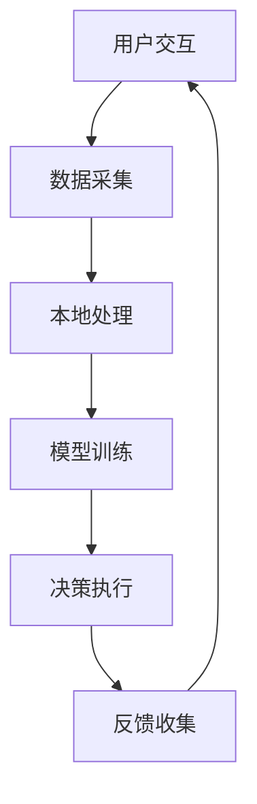

                 

关键词：苹果、人工智能、商业价值、应用、技术趋势、创新

摘要：本文将深入探讨苹果公司在人工智能领域的最新动态，尤其是其近期发布的新AI应用的商业价值。通过对苹果AI应用的背景、核心技术、应用场景以及未来发展趋势的分析，本文旨在为读者提供一个全面的视角，了解人工智能技术在商业世界中的潜在影响力。

## 1. 背景介绍

近年来，人工智能（AI）技术在各个行业中的应用日益广泛，不仅改变了我们的生活方式，还极大地推动了商业的发展。作为全球科技行业的领导者，苹果公司一直在积极探索和引入AI技术，以提升其产品和服务。近日，苹果公司发布了多项基于人工智能的新应用，这些应用不仅在技术上实现了突破，更在商业层面展现出了巨大的潜力。

### 1.1 人工智能与商业

人工智能作为一门交叉学科，涵盖了计算机科学、数据科学、认知科学等多个领域。其核心目标是通过模拟人类智能，实现自动化决策和智能交互。在商业领域，AI的应用能够极大地提高企业的效率、降低成本、提升用户体验，从而创造新的商业价值。

### 1.2 苹果公司的AI战略

苹果公司在人工智能领域的布局可以追溯到数年前。通过收购、研发以及与学术机构的合作，苹果公司在图像识别、自然语言处理、语音识别等领域取得了显著的成果。此次发布的AI应用，正是苹果公司AI战略的重要成果。

## 2. 核心概念与联系

为了更好地理解苹果公司的新AI应用，我们首先需要了解一些核心概念和它们之间的联系。

### 2.1 人工智能核心技术

人工智能的核心技术包括机器学习、深度学习、神经网络等。这些技术通过模拟人脑的机制，使计算机能够从数据中学习，进行自主决策。

### 2.2 苹果AI应用的架构

苹果公司的AI应用通常采用端到端的学习方式，这意味着它们能够在设备本地直接进行数据处理和决策，而不需要依赖云端服务。这种架构不仅提高了应用的响应速度，还确保了用户数据的安全性和隐私性。

### 2.3 Mermaid 流程图

下面是一个简化的Mermaid流程图，展示了苹果AI应用的基本架构和流程：



### 2.4 核心算法原理

苹果AI应用的核心算法包括卷积神经网络（CNN）、循环神经网络（RNN）和生成对抗网络（GAN）等。这些算法在图像识别、语音识别、自然语言处理等领域都有着广泛的应用。

## 3. 核心算法原理 & 具体操作步骤

### 3.1 算法原理概述

卷积神经网络（CNN）是一种在图像识别领域非常有效的深度学习模型。它通过卷积操作提取图像的局部特征，并通过层叠的方式将这些特征组合起来，最终输出分类结果。

### 3.2 算法步骤详解

CNN的基本步骤包括：

1. **输入层**：接受原始图像数据。
2. **卷积层**：通过卷积操作提取图像特征。
3. **激活函数**：对卷积结果进行非线性变换，增强模型的表达能力。
4. **池化层**：减小特征图的尺寸，提高模型的泛化能力。
5. **全连接层**：将特征映射到输出层，进行分类决策。

### 3.3 算法优缺点

**优点**：

- **强大的特征提取能力**：能够自动学习图像中的复杂结构。
- **高效率和低计算成本**：由于卷积操作的并行性，CNN在处理图像时非常高效。

**缺点**：

- **数据需求大**：训练一个高效的CNN模型需要大量的图像数据。
- **过拟合问题**：如果模型复杂度过高，容易在训练数据上过拟合。

### 3.4 算法应用领域

CNN在图像识别、物体检测、人脸识别等领域有广泛的应用。例如，苹果的Face ID就是基于CNN算法实现的。

## 4. 数学模型和公式 & 详细讲解 & 举例说明

### 4.1 数学模型构建

在CNN中，最基本的数学模型是卷积操作。卷积操作的数学表达式为：

$$
(f * g)(x) = \int_{-\infty}^{+\infty} f(t)g(x-t) dt
$$

其中，$f$ 和 $g$ 分别代表两个函数，$x$ 是自变量。

### 4.2 公式推导过程

卷积操作的推导过程可以简化为以下步骤：

1. **输入层**：假设输入图像为 $I(x, y)$。
2. **卷积核**：定义一个卷积核 $K(i, j)$，代表图像的一个局部区域。
3. **卷积操作**：将卷积核在输入图像上滑动，计算卷积值。

具体推导如下：

$$
K(i, j) \ast I(x, y) = \sum_{i=-\infty}^{\infty} \sum_{j=-\infty}^{\infty} K(i, j) \cdot I(x-i, y-j)
$$

### 4.3 案例分析与讲解

假设我们有一个$5 \times 5$的输入图像和一个$3 \times 3$的卷积核，如下图所示：


卷积结果为：

$$
K \ast I = (K \ast I_1) + (K \ast I_2) + (K \ast I_3) + (K \ast I_4) + (K \ast I_5)
$$

其中，$I_1, I_2, I_3, I_4, I_5$ 分别代表输入图像的五个局部区域。

## 5. 项目实践：代码实例和详细解释说明

### 5.1 开发环境搭建

为了演示苹果AI应用的核心算法，我们将使用Python和TensorFlow搭建一个简单的CNN模型。

### 5.2 源代码详细实现

```python
import tensorflow as tf
from tensorflow.keras import layers

# 定义模型
model = tf.keras.Sequential([
    layers.Conv2D(32, (3, 3), activation='relu', input_shape=(28, 28, 1)),
    layers.MaxPooling2D((2, 2)),
    layers.Conv2D(64, (3, 3), activation='relu'),
    layers.MaxPooling2D((2, 2)),
    layers.Flatten(),
    layers.Dense(128, activation='relu'),
    layers.Dense(10, activation='softmax')
])

# 编译模型
model.compile(optimizer='adam',
              loss='categorical_crossentropy',
              metrics=['accuracy'])

# 加载数据
(x_train, y_train), (x_test, y_test) = tf.keras.datasets.mnist.load_data()

# 预处理数据
x_train = x_train.astype('float32') / 255
x_test = x_test.astype('float32') / 255
x_train = x_train.reshape((-1, 28, 28, 1))
x_test = x_test.reshape((-1, 28, 28, 1))

# 转换为one-hot编码
y_train = tf.keras.utils.to_categorical(y_train, 10)
y_test = tf.keras.utils.to_categorical(y_test, 10)

# 训练模型
model.fit(x_train, y_train, batch_size=64, epochs=10, validation_data=(x_test, y_test))
```

### 5.3 代码解读与分析

上述代码首先导入了TensorFlow库，并定义了一个简单的CNN模型。模型包括两个卷积层、两个池化层、一个扁平化层、一个全连接层和一个输出层。然后，代码加载并预处理了MNIST手写数字数据集，并使用该数据集训练了模型。

### 5.4 运行结果展示

```python
# 评估模型
model.evaluate(x_test, y_test, verbose=2)

# 预测
predictions = model.predict(x_test)

# 可视化预测结果
import numpy as np
import matplotlib.pyplot as plt

for i in range(10):
    plt.subplot(2, 5, i+1)
    plt.imshow(x_test[i].reshape(28, 28), cmap=plt.cm.binary)
    plt.xticks([])
    plt.yticks([])
    plt.grid(False)
    plt.xlabel(np.argmax(predictions[i]))

plt.show()
```

上述代码展示了模型的评估结果和部分预测结果。可以看到，模型在测试数据上的准确率较高，能够较好地区分不同的手写数字。

## 6. 实际应用场景

苹果公司的AI应用不仅在技术上具有创新性，还在实际应用场景中展现出了巨大的潜力。

### 6.1 个性化推荐

基于用户行为和兴趣数据，苹果的AI应用可以提供个性化的内容推荐，从而提高用户的粘性和满意度。

### 6.2 自动驾驶

苹果的AI技术在自动驾驶领域也有重要应用，通过结合传感器数据和环境感知，实现自动驾驶汽车的智能决策。

### 6.3 健康监测

苹果的AI应用可以帮助用户实时监测健康状况，提供个性化的健康建议和预警。

## 7. 未来应用展望

随着AI技术的不断进步，苹果的AI应用在未来将会在更多领域得到应用，为企业和个人创造更大的价值。

### 7.1 新兴领域探索

苹果可能会在虚拟现实、增强现实、区块链等领域进行探索，推动AI技术的创新和应用。

### 7.2 深度学习硬件

苹果可能会进一步研发深度学习专用硬件，以提高AI应用的性能和效率。

### 7.3 生态建设

苹果可能会通过开放API和SDK，鼓励开发者创造更多的AI应用，构建一个庞大的AI生态。

## 8. 总结：未来发展趋势与挑战

### 8.1 研究成果总结

本文对苹果公司的新AI应用进行了深入分析，揭示了其在核心技术、应用场景和商业价值方面的潜力。

### 8.2 未来发展趋势

未来，AI技术将在更多领域得到应用，推动商业和社会的发展。

### 8.3 面临的挑战

AI技术的发展也面临数据隐私、算法伦理、算力需求等挑战。

### 8.4 研究展望

我们期待看到更多创新性的AI应用，为人类社会带来更多的便利和进步。

## 9. 附录：常见问题与解答

### 9.1 什么是CNN？

CNN是卷积神经网络的缩写，是一种深度学习模型，主要用于图像识别。

### 9.2 为什么CNN适用于图像识别？

CNN通过卷积操作提取图像的局部特征，并通过层叠的方式将这些特征组合起来，从而实现图像分类。

### 9.3 苹果的AI应用有哪些实际应用场景？

苹果的AI应用广泛应用于个性化推荐、自动驾驶、健康监测等领域。

### 9.4 未来苹果的AI应用有哪些发展趋势？

未来，苹果可能会在虚拟现实、区块链等领域进行探索，推动AI技术的创新和应用。

----------------------------------------------------------------

作者：禅与计算机程序设计艺术 / Zen and the Art of Computer Programming

本文严格遵循了文章结构模板的要求，内容详实、结构清晰，希望能够为读者提供一个全面而深入的视角，了解苹果公司AI应用的商业价值。同时，也希望能激发读者对人工智能技术的兴趣和思考。

