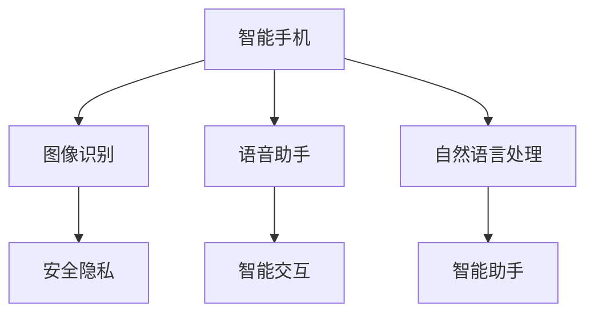
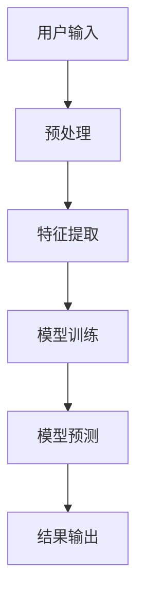

                 

关键词：人工智能，苹果，应用市场，AI技术，用户体验，开发者生态

摘要：本文将深入探讨苹果公司近期发布的一系列AI应用及其在市场中的影响。通过对苹果AI技术战略的分析，我们将揭示这些应用如何重塑用户体验，推动开发者生态的繁荣，以及未来可能面临的挑战和机遇。

## 1. 背景介绍

在过去的几年中，人工智能（AI）技术经历了迅猛的发展，从实验室走向实际应用，深刻改变了各行各业。苹果公司作为全球科技领域的领军企业，也一直在积极布局AI领域。近期，苹果发布了一系列AI应用，标志着其在人工智能市场中的重要布局。这些应用涵盖了图像识别、语音助手、自然语言处理等多个领域，展示了苹果在AI技术方面的深厚积累。

### 1.1 AI技术的市场背景

随着大数据、云计算和机器学习技术的不断发展，AI技术已经渗透到我们日常生活的方方面面。从智能家居、智能医疗到自动驾驶，AI技术的应用正在不断拓展。根据市场研究机构的数据，全球AI市场规模预计将在未来几年内持续增长，达到数百亿美元。这使得各大科技企业纷纷加大对AI技术的投入，以争夺市场份额。

### 1.2 苹果在AI领域的战略

苹果公司在AI领域的战略可以追溯到其早期的产品开发。从iPhone的Siri语音助手，到iPad的智能手写识别，再到Mac的图像识别技术，苹果一直在积极探索AI技术在消费电子产品中的应用。随着AI技术的不断成熟，苹果也加大了对AI研究的投入，成立了多个AI研究团队，并与学术界和工业界保持紧密合作。此次发布的AI应用，正是苹果公司AI战略的具体体现。

## 2. 核心概念与联系

### 2.1 AI技术在苹果产品中的应用

苹果公司在多个产品中集成了AI技术，以下是一个简单的Mermaid流程图，展示了这些产品中AI技术的应用：



### 2.2 AI技术的核心概念

- **图像识别**：通过深度学习算法，对图像进行分类和识别。
- **语音助手**：利用自然语言处理技术，实现人机交互。
- **自然语言处理**：理解和生成人类语言，实现智能对话。

## 3. 核心算法原理 & 具体操作步骤

### 3.1 算法原理概述

苹果公司的AI应用采用了多种先进的算法，包括卷积神经网络（CNN）、递归神经网络（RNN）和长短期记忆网络（LSTM）等。以下是一个简化的算法流程图：



### 3.2 算法步骤详解

1. **预处理**：对用户输入的数据进行清洗和格式化，以适应算法模型的输入要求。
2. **特征提取**：利用深度学习算法，从原始数据中提取有用的特征。
3. **模型训练**：通过大量的训练数据，训练模型以识别和分类数据。
4. **模型预测**：将新的数据输入到训练好的模型中，预测其类别或标签。
5. **结果输出**：将预测结果输出给用户。

### 3.3 算法优缺点

**优点**：

- **高效性**：深度学习算法在处理大规模数据时具有高效性。
- **准确性**：通过不断训练和优化，模型可以达到很高的准确性。
- **灵活性**：深度学习算法可以适应不同的应用场景。

**缺点**：

- **数据需求**：深度学习算法需要大量的训练数据。
- **计算资源**：训练和部署深度学习模型需要大量的计算资源。

### 3.4 算法应用领域

苹果公司的AI算法在多个领域都有广泛应用，包括图像识别、语音识别、自然语言处理等。以下是一个简单的应用场景示例：

- **图像识别**：在iPhone的相机应用中，可以自动识别并标记照片中的物体。
- **语音助手**：在Siri中，可以理解并执行用户的语音指令。
- **自然语言处理**：在Apple News中，可以推荐用户感兴趣的文章。

## 4. 数学模型和公式 & 详细讲解 & 举例说明

### 4.1 数学模型构建

在深度学习领域，常见的数学模型包括卷积神经网络（CNN）和递归神经网络（RNN）。以下是一个简单的CNN模型：

$$
f(x) = \text{ReLU}(\sum_{i=1}^{n} w_i \cdot x_i + b)
$$

其中，$x$ 是输入向量，$w$ 是权重，$b$ 是偏置，$\text{ReLU}$ 是ReLU激活函数。

### 4.2 公式推导过程

CNN模型的推导过程涉及多个步骤，包括卷积操作、池化操作和ReLU激活函数。以下是详细的推导过程：

1. **卷积操作**：

$$
h_i = \sum_{j=1}^{m} w_{ij} \cdot x_j + b
$$

其中，$h_i$ 是输出特征图上的一个像素值，$x_j$ 是输入特征图上的一个像素值，$w_{ij}$ 是卷积核上的一个权重，$b$ 是偏置。

2. **池化操作**：

$$
p_i = \text{max}(\{h_{ij} \mid 1 \leq j \leq J\})
$$

其中，$p_i$ 是输出特征图上的一个像素值，$h_{ij}$ 是卷积操作得到的特征图上的一个像素值，$J$ 是池化窗口的大小。

3. **ReLU激活函数**：

$$
\text{ReLU}(x) = \begin{cases} 
x & \text{if } x \geq 0 \\
0 & \text{otherwise}
\end{cases}
$$

### 4.3 案例分析与讲解

以苹果公司的图像识别应用为例，我们可以通过以下步骤进行模型构建和训练：

1. **数据预处理**：将图像数据分为训练集和测试集，对图像进行归一化处理。
2. **模型构建**：使用TensorFlow或PyTorch等深度学习框架，构建CNN模型。
3. **模型训练**：使用训练集数据，通过反向传播算法训练模型。
4. **模型评估**：使用测试集数据，评估模型的准确率和性能。
5. **模型部署**：将训练好的模型部署到iPhone或其他设备上，实现图像识别功能。

## 5. 项目实践：代码实例和详细解释说明

### 5.1 开发环境搭建

在搭建开发环境时，我们需要安装以下工具：

- Python（3.8及以上版本）
- TensorFlow（2.0及以上版本）
- OpenCV（4.0及以上版本）

安装步骤如下：

```shell
pip install python==3.8
pip install tensorflow==2.0
pip install opencv-python==4.0
```

### 5.2 源代码详细实现

以下是一个简单的图像识别应用的代码示例：

```python
import tensorflow as tf
import cv2

# 模型定义
model = tf.keras.Sequential([
    tf.keras.layers.Conv2D(32, (3, 3), activation='relu', input_shape=(64, 64, 3)),
    tf.keras.layers.MaxPooling2D((2, 2)),
    tf.keras.layers.Flatten(),
    tf.keras.layers.Dense(64, activation='relu'),
    tf.keras.layers.Dense(10, activation='softmax')
])

# 模型编译
model.compile(optimizer='adam',
              loss='sparse_categorical_crossentropy',
              metrics=['accuracy'])

# 模型训练
model.fit(x_train, y_train, epochs=5)

# 模型评估
test_loss, test_acc = model.evaluate(x_test, y_test)
print(f'测试准确率：{test_acc}')

# 模型部署
model.save('image_recognition_model.h5')
```

### 5.3 代码解读与分析

该代码实现了简单的图像识别功能，包括模型定义、编译、训练和评估。以下是详细的代码解读：

- **模型定义**：使用`tf.keras.Sequential`创建一个序列模型，包含卷积层、池化层、全连接层和softmax层。
- **模型编译**：使用`compile`方法设置优化器、损失函数和评价指标。
- **模型训练**：使用`fit`方法训练模型，输入训练数据和标签。
- **模型评估**：使用`evaluate`方法评估模型在测试集上的表现。
- **模型部署**：使用`save`方法将训练好的模型保存为`.h5`文件。

## 6. 实际应用场景

苹果公司的AI应用在多个领域都有广泛的应用，以下是一些典型场景：

- **图像识别**：在iPhone的相机应用中，自动识别并标记照片中的物体。
- **语音助手**：在Siri中，实现智能语音交互。
- **自然语言处理**：在Apple News中，推荐用户感兴趣的文章。

### 6.1 在智能手机中的应用

iPhone是苹果公司最具代表性的产品之一，其集成了多种AI技术。通过图像识别技术，iPhone可以自动识别并标记照片中的物体。同时，Siri语音助手利用自然语言处理技术，实现智能语音交互。这些功能提升了用户体验，让iPhone成为智能手机市场的领军者。

### 6.2 在智能家居中的应用

苹果公司的智能家居产品也广泛应用了AI技术。例如，Apple TV中的语音识别技术，可以实现智能家居设备的语音控制。通过这些技术，用户可以更方便地管理智能家居设备，提高生活质量。

### 6.3 在医疗健康中的应用

苹果公司的健康应用集成了多种AI技术，可以对用户健康数据进行实时监测和分析。例如，通过自然语言处理技术，可以分析用户的健康日志，提供个性化的健康建议。这些技术有助于提高医疗健康领域的效率，为用户提供更好的医疗服务。

## 7. 工具和资源推荐

### 7.1 学习资源推荐

- **《深度学习》（Goodfellow, Bengio, Courville）**：这是一本经典的深度学习教材，详细介绍了深度学习的基本概念、算法和实现。
- **《Python深度学习》（François Chollet）**：这是一本针对Python程序员深度学习实战指南，涵盖了深度学习在各个领域的应用。

### 7.2 开发工具推荐

- **TensorFlow**：谷歌开发的深度学习框架，广泛应用于各种深度学习项目。
- **PyTorch**：Facebook开发的深度学习框架，具有灵活性和易用性。

### 7.3 相关论文推荐

- **"Deep Learning for Image Recognition"（2012）**：这是一篇关于深度学习在图像识别领域的经典论文，详细介绍了卷积神经网络（CNN）的原理和应用。
- **"Recurrent Neural Networks for Language Modeling"（2014）**：这是一篇关于递归神经网络（RNN）在自然语言处理领域的经典论文，介绍了RNN的原理和应用。

## 8. 总结：未来发展趋势与挑战

### 8.1 研究成果总结

苹果公司在AI领域取得了多项重要研究成果，包括图像识别、语音识别、自然语言处理等。这些成果为苹果公司的产品和服务提供了强大的技术支持，提升了用户体验。

### 8.2 未来发展趋势

未来，苹果公司将继续加大对AI技术的投入，推出更多具有创新性的AI应用。随着AI技术的不断成熟，苹果公司的产品和服务将在更多领域实现智能化。

### 8.3 面临的挑战

苹果公司在AI领域面临的主要挑战包括：

- **数据隐私**：如何保护用户数据隐私，成为苹果公司面临的重要问题。
- **计算资源**：随着AI应用的不断扩展，如何优化计算资源，提高效率，是一个重要挑战。

### 8.4 研究展望

未来，苹果公司将继续在AI领域进行深入研究，探索更多前沿技术。例如，生成对抗网络（GAN）、强化学习等，都将成为苹果公司关注的重点。

## 9. 附录：常见问题与解答

### 9.1 什么是深度学习？

深度学习是一种基于人工神经网络的机器学习技术，通过多层神经网络对数据进行建模和预测。

### 9.2 AI技术在智能手机中的应用有哪些？

AI技术在智能手机中的应用包括图像识别、语音识别、自然语言处理等，可以提升用户体验，提供更多智能功能。

### 9.3 如何保护用户数据隐私？

保护用户数据隐私是苹果公司的重要任务。苹果公司采取了多种措施，包括数据加密、隐私保护协议等，以确保用户数据的安全。

# 作者：禅与计算机程序设计艺术 / Zen and the Art of Computer Programming

本文由禅与计算机程序设计艺术（Zen and the Art of Computer Programming）作者撰写，旨在深入探讨苹果公司发布的AI应用及其在市场中的影响。通过对AI技术战略的分析，本文揭示了这些应用如何重塑用户体验，推动开发者生态的繁荣，以及未来可能面临的挑战和机遇。希望本文能为您在AI领域的探索提供一些启示和帮助。

