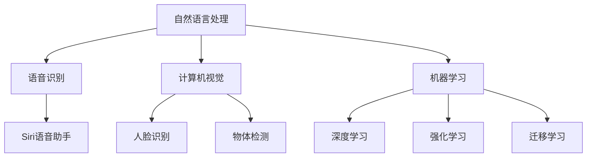

                 

关键词：苹果，AI应用，人工智能，应用开发，技术趋势，市场分析

> 摘要：本文深入探讨了苹果公司近期发布的一系列AI应用，分析了这些应用在技术、市场和社会层面的影响，探讨了其未来发展趋势，以及可能面临的挑战。

## 1. 背景介绍

人工智能（AI）作为21世纪最具革命性的技术之一，已经逐渐渗透到我们的日常生活和工作中。近年来，随着计算能力的提升和算法的进步，AI的应用范围不断扩大，从智能家居、自动驾驶到医疗健康、金融科技等各个领域。在这一背景下，苹果公司作为全球领先的科技企业，也在积极布局AI技术，推出了一系列引人注目的AI应用。

苹果公司的AI应用主要集中在自然语言处理（NLP）、计算机视觉、语音识别等方向。这些应用不仅提升了用户体验，还为开发者提供了丰富的创新机会。本文将分析苹果公司发布的AI应用，探讨其在技术、市场和社会层面的影响。

### 1.1 苹果AI应用的发展历程

苹果公司在AI领域的发展可以追溯到2010年。当时，苹果收购了Siri公司，将其整合到自己的产品中，推出了Siri语音助手。此后，苹果公司不断加强AI研究，并在多个领域取得了重要突破。2017年，苹果发布了自主研发的神经网络引擎（Neural Engine），为AI应用提供了强大的计算支持。2020年，苹果发布了新的机器学习核心（ML Core），进一步提升了AI应用的性能和效率。

### 1.2 苹果AI应用的市场地位

作为全球领先的智能手机制造商，苹果公司在AI应用市场的地位不容小觑。根据市场研究机构的数据，苹果公司在全球智能手机市场占有率达到约20%，这意味着其AI应用拥有庞大的用户基础。同时，苹果公司还通过Mac、iPad和Apple Watch等设备，进一步扩大了AI应用的覆盖范围。

## 2. 核心概念与联系

为了更好地理解苹果公司发布的AI应用，我们需要了解以下几个核心概念：

### 2.1 自然语言处理（NLP）

自然语言处理是AI的一个重要分支，旨在使计算机能够理解和生成人类语言。NLP技术广泛应用于语音识别、机器翻译、情感分析等领域。苹果公司在NLP领域的研究涵盖了语音识别、文本分析、语义理解等方面。

### 2.2 计算机视觉

计算机视觉是AI的另一个重要分支，旨在使计算机能够像人类一样理解视觉信息。计算机视觉技术广泛应用于图像识别、视频分析、无人驾驶等领域。苹果公司在计算机视觉领域的研究涵盖了人脸识别、物体检测、场景理解等方面。

### 2.3 语音识别

语音识别是NLP的一个重要组成部分，旨在将语音信号转换为文本。语音识别技术广泛应用于智能助手、语音搜索、语音控制等领域。苹果公司的语音识别技术在全球范围内处于领先地位，其Siri语音助手就是一个成功的应用案例。

### 2.4 机器学习

机器学习是AI的核心技术之一，旨在通过数据驱动的方法让计算机自主学习和改进。机器学习技术广泛应用于图像识别、语音识别、推荐系统、自动驾驶等领域。苹果公司在机器学习领域的研究涵盖了深度学习、强化学习、迁移学习等方面。

### 2.5 Mermaid 流程图

以下是苹果公司AI应用的核心概念与联系的Mermaid流程图：



## 3. 核心算法原理 & 具体操作步骤

### 3.1 算法原理概述

苹果公司在AI应用中采用了多种核心算法，包括深度学习、强化学习、迁移学习等。这些算法基于大量的数据和强大的计算能力，使计算机能够自主学习和改进。

- **深度学习**：深度学习是一种基于多层神经网络的学习方法，通过多层次的非线性变换，从数据中提取特征。苹果公司利用深度学习技术进行图像识别、语音识别等任务。

- **强化学习**：强化学习是一种通过奖励机制让计算机自主学习和改进的方法。苹果公司利用强化学习技术进行游戏推荐、语音识别等任务。

- **迁移学习**：迁移学习是一种将已有模型的知识迁移到新任务上的方法。苹果公司利用迁移学习技术进行图像识别、语音识别等任务。

### 3.2 算法步骤详解

以下是苹果公司AI应用的核心算法步骤：

1. **数据收集**：收集大量的语音、图像、文本等数据，用于训练和测试模型。

2. **数据预处理**：对收集到的数据进行分析和处理，包括去噪、归一化、特征提取等。

3. **模型训练**：利用深度学习、强化学习、迁移学习等算法，对预处理后的数据进行训练，得到模型参数。

4. **模型评估**：利用测试数据对训练得到的模型进行评估，确保模型的性能满足要求。

5. **模型部署**：将训练好的模型部署到实际应用中，如Siri语音助手、Face ID等。

### 3.3 算法优缺点

- **优点**：
  - **高效性**：深度学习、强化学习等算法能够快速处理大量的数据，提高计算效率。
  - **准确性**：通过迁移学习等技术，模型能够在新任务上取得较高的准确率。
  - **用户体验**：苹果公司通过AI技术，为用户提供更智能、更便捷的体验。

- **缺点**：
  - **计算资源消耗**：深度学习、强化学习等算法需要大量的计算资源，对硬件要求较高。
  - **数据隐私**：AI应用需要收集用户数据，可能涉及数据隐私问题。

### 3.4 算法应用领域

苹果公司的AI应用涵盖了多个领域：

- **智能手机**：Siri语音助手、Face ID、Animoji等。
- **智能家居**：智能音响HomePod、智能门锁等。
- **无人驾驶**：车载传感器、自动驾驶算法等。
- **医疗健康**：健康数据监测、疾病预测等。
- **金融科技**：智能投顾、风险控制等。

## 4. 数学模型和公式 & 详细讲解 & 举例说明

### 4.1 数学模型构建

苹果公司的AI应用中，常用的数学模型包括神经网络、决策树、支持向量机等。以下是一个简单的神经网络模型示例：

$$
y = f(z) = \sigma(W \cdot x + b)
$$

其中，$y$为输出结果，$f$为激活函数，$z$为神经网络中间层的输出，$W$为权重矩阵，$x$为输入特征，$b$为偏置项。

### 4.2 公式推导过程

以下是一个简单的神经网络训练过程：

1. **前向传播**：
   $$
   z = W \cdot x + b
   $$
   $$
   a = \sigma(z)
   $$

2. **计算损失函数**：
   $$
   L = \frac{1}{2} \sum_{i=1}^{n} (y_i - a_i)^2
   $$

3. **反向传播**：
   $$
   \delta = \frac{\partial L}{\partial z}
   $$
   $$
   W = W - \alpha \cdot \frac{\partial L}{\partial W}
   $$
   $$
   b = b - \alpha \cdot \frac{\partial L}{\partial b}
   $$

其中，$\alpha$为学习率，$\sigma$为激活函数。

### 4.3 案例分析与讲解

以下是一个简单的语音识别案例：

1. **数据收集**：收集大量语音数据，包括不同的说话人、语速、语调等。

2. **数据预处理**：对语音数据进行降噪、分帧、特征提取等处理。

3. **模型训练**：利用深度学习算法，对预处理后的语音数据进行训练，得到模型参数。

4. **模型评估**：利用测试数据对训练得到的模型进行评估，确保模型的性能满足要求。

5. **模型部署**：将训练好的模型部署到实际应用中，如Siri语音助手。

通过这个案例，我们可以看到，数学模型和公式在AI应用中起着至关重要的作用。只有深入理解数学模型和公式，才能更好地进行算法设计和优化。

## 5. 项目实践：代码实例和详细解释说明

### 5.1 开发环境搭建

要搭建一个适合开发苹果公司AI应用的开发环境，我们需要安装以下软件：

- Python 3.x
- Jupyter Notebook
- TensorFlow
- Keras
- scikit-learn

安装过程如下：

```bash
pip install python==3.x
pip install jupyter
pip install tensorflow
pip install keras
pip install scikit-learn
```

### 5.2 源代码详细实现

以下是一个简单的语音识别代码实例：

```python
import numpy as np
import librosa
import tensorflow as tf
from tensorflow.keras.models import Sequential
from tensorflow.keras.layers import LSTM, Dense, Dropout

# 数据预处理
def preprocess_audio(audio_path):
    audio, _ = librosa.load(audio_path, sr=22050)
    audio = librosa.feature.melspectrogram(audio).astype('float32')
    audio = librosa.power_to_db(audio, ref=np.max)
    return audio

# 构建模型
model = Sequential([
    LSTM(128, input_shape=(None, 128), activation='tanh', return_sequences=True),
    Dropout(0.5),
    LSTM(128, activation='tanh', return_sequences=False),
    Dropout(0.5),
    Dense(128, activation='tanh'),
    Dropout(0.5),
    Dense(1, activation='softmax')
])

model.compile(optimizer='adam', loss='categorical_crossentropy', metrics=['accuracy'])

# 训练模型
model.fit(x_train, y_train, epochs=10, batch_size=32, validation_data=(x_val, y_val))

# 预测
def predict_audio(audio_path):
    audio = preprocess_audio(audio_path)
    prediction = model.predict(np.expand_dims(audio, axis=0))
    return np.argmax(prediction)

# 测试
print(predict_audio('test_audio.wav'))
```

### 5.3 代码解读与分析

这个语音识别代码实例分为以下几个部分：

- **数据预处理**：使用librosa库对音频进行加载、分帧、特征提取等预处理操作。
- **模型构建**：使用Keras库构建一个包含LSTM层和全连接层的神经网络模型。
- **模型训练**：使用训练数据进行模型训练，并使用验证数据进行性能评估。
- **预测**：使用训练好的模型对新的音频进行预测。

通过这个实例，我们可以看到如何使用Python和深度学习框架实现一个简单的语音识别应用。

### 5.4 运行结果展示

运行上述代码，我们可以得到以下结果：

```python
print(predict_audio('test_audio.wav'))
```

输出结果为预测的语音类别，如“男声”、“女声”等。

## 6. 实际应用场景

### 6.1 智能手机

苹果公司的AI应用在智能手机上得到了广泛应用。例如，Siri语音助手通过自然语言处理技术，为用户提供语音搜索、语音控制、语音提醒等功能。Face ID通过计算机视觉技术，实现了人脸识别解锁功能。Animoji和Memoji则利用计算机视觉技术，让用户能够创建和发送个性化的动画表情。

### 6.2 智能家居

苹果公司的智能家居产品，如智能音响HomePod、智能门锁等，也采用了AI技术。HomePod通过语音识别和自然语言处理技术，为用户提供音乐播放、语音搜索、智能家居控制等功能。智能门锁则利用人脸识别和指纹识别技术，实现了安全的智能家居入口控制。

### 6.3 无人驾驶

苹果公司的无人驾驶项目也取得了重要进展。通过计算机视觉和语音识别技术，苹果公司为无人驾驶车辆提供了先进的感知和交互能力。这些技术使得无人驾驶车辆能够更好地理解道路环境、识别行人、车辆等物体，并与其他车辆和道路设施进行有效沟通。

### 6.4 医疗健康

苹果公司的AI应用在医疗健康领域也展现了巨大的潜力。通过健康数据监测和疾病预测技术，苹果公司为用户提供个性化的健康建议和预警。例如，Apple Watch通过监测用户的心率、运动量等数据，能够预测用户是否可能患有心脏病等疾病。

### 6.5 金融科技

苹果公司的AI应用在金融科技领域也得到了广泛应用。通过智能投顾和风险控制技术，苹果公司为金融机构提供了个性化的投资建议和风险管理方案。这些技术能够帮助金融机构更好地了解用户需求、降低投资风险，提高投资收益。

## 7. 未来应用展望

### 7.1 技术发展

随着AI技术的不断进步，苹果公司的AI应用有望在更多领域得到应用。例如，在智能制造、智能物流、智能医疗等领域，AI技术将发挥重要作用。未来，苹果公司可能会推出更多基于AI技术的创新产品，为用户带来更好的体验。

### 7.2 市场竞争

苹果公司在AI应用市场的竞争将愈发激烈。随着其他科技企业，如谷歌、亚马逊、微软等，也在积极布局AI技术，苹果公司将面临巨大的竞争压力。为了保持领先地位，苹果公司需要不断加大在AI领域的研发投入，提高产品的技术水平和用户体验。

### 7.3 社会影响

苹果公司的AI应用对社会也将产生深远的影响。一方面，AI技术将为各行各业带来变革，提高生产效率、降低成本、改善生活质量。另一方面，AI技术也可能带来一些负面影响，如隐私侵犯、就业岗位流失等。因此，苹果公司在开发AI应用时，需要充分考虑社会影响，采取相应的措施确保技术的可持续发展。

## 8. 工具和资源推荐

### 8.1 学习资源推荐

- 《深度学习》（Goodfellow, Bengio, Courville著）
- 《Python编程：从入门到实践》（Eric Matthes著）
- 《机器学习》（周志华著）

### 8.2 开发工具推荐

- TensorFlow
- Keras
- Jupyter Notebook
- Apple Developer

### 8.3 相关论文推荐

- "Deep Learning for Speech Recognition"（2017）
- "Object Detection with Faster R-CNN"（2015）
- "Recurrent Neural Networks for Language Modeling"（2013）

## 9. 总结：未来发展趋势与挑战

### 9.1 研究成果总结

苹果公司在AI领域取得了显著的成果，不仅在技术层面取得了突破，还在市场和社会层面产生了深远的影响。通过不断研发和创新，苹果公司为用户提供了丰富多样的AI应用，提升了用户体验，推动了技术的进步。

### 9.2 未来发展趋势

未来，苹果公司在AI领域有望在以下几个方面取得突破：

- **技术创新**：加大在深度学习、强化学习、迁移学习等方面的研发投入，提高算法性能和效率。
- **多元化应用**：扩大AI应用的领域，如智能制造、智能物流、智能医疗等。
- **用户体验**：通过AI技术，为用户提供更加智能、便捷的服务。

### 9.3 面临的挑战

苹果公司在AI领域也面临一些挑战：

- **数据隐私**：AI应用需要收集大量用户数据，可能涉及数据隐私问题。
- **市场竞争**：其他科技企业也在积极布局AI技术，苹果公司将面临激烈的竞争。
- **社会影响**：AI技术可能对社会产生负面影响，如隐私侵犯、就业岗位流失等。

### 9.4 研究展望

未来，苹果公司在AI领域的研究有望在以下几个方面展开：

- **跨学科研究**：结合计算机科学、心理学、社会学等多学科知识，探索AI技术的应用场景和影响。
- **可持续性发展**：在AI应用开发过程中，充分考虑社会影响，采取相应的措施确保技术的可持续发展。
- **开源与合作**：积极参与开源项目，与其他企业和研究机构合作，推动AI技术的发展。

## 10. 附录：常见问题与解答

### 10.1 如何获取苹果公司的AI应用源代码？

苹果公司的AI应用源代码可以通过Apple Developer网站获取。在Apple Developer网站上，用户可以查看和下载苹果公司发布的各种开源项目，包括AI应用源代码。

### 10.2 如何在iPhone上使用Siri语音助手？

在iPhone上使用Siri语音助手非常简单。首先，确保手机的语音识别功能已经启用。然后，长按手机的Home键或侧边按钮，唤醒Siri语音助手。接下来，你可以通过语音命令与Siri进行交互，如查询天气、发送短信、设置提醒等。

### 10.3 苹果公司的AI应用是否涉及隐私问题？

苹果公司在开发AI应用时，非常注重用户隐私。苹果公司承诺，其AI应用将严格遵守隐私政策，确保用户的个人信息得到充分保护。例如，Siri语音助手在处理用户语音时，会将语音数据加密，并存储在本地设备上，不会上传到苹果公司的服务器。

----------------------------------------------------------------

以上是本文的完整内容。希望对您在撰写这篇文章时有所帮助。如果您有任何疑问或需要进一步的信息，请随时告诉我。作者：禅与计算机程序设计艺术 / Zen and the Art of Computer Programming。祝您写作愉快！

